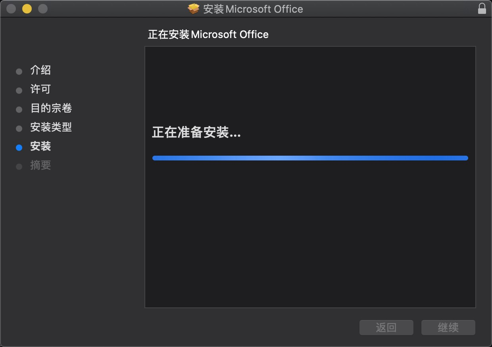
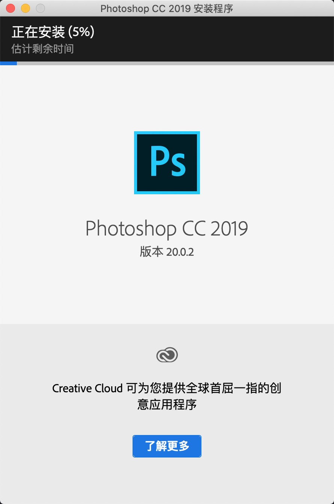
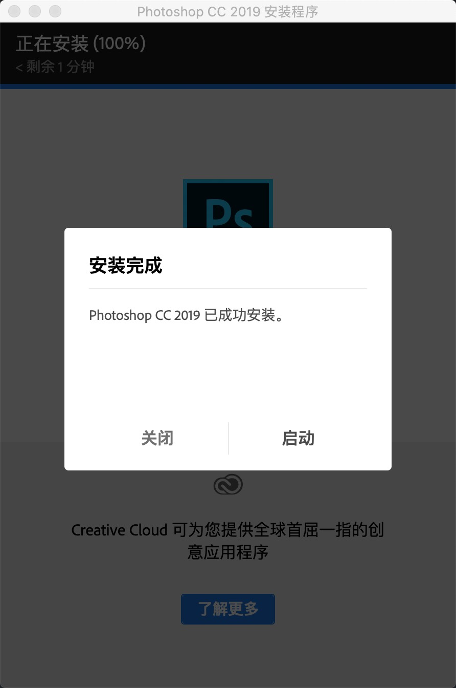

<!-- more -->

### 目录

- [CleanMyMac X 4.10.6](#cleanmymac-x-4106)
- [IINA 1.2.0](#iina-120)
- [Navicat 16.3.6](#navicat-1636)
- [Office 16.53](#office-1653)
- [Photoshop CC 2019](#photoshop-cc-2019)
- [TablePlus 3.11](#tableplus-311)
- [Typora 1.8.10](#typora-1810)

#### CleanMyMac X 4.10.6

> CleanMyMac X是一款专业的Mac清理软件，可智能清理mac磁盘垃圾和多余语言安装包，快速释放电脑内存，轻松管理和升级Mac上的应用。同时CleanMyMac X可以强力卸载恶意软件，修复系统漏洞，一键扫描和优化Mac系统，让您的电脑焕然一新！

- 1. 下载压缩包
      [Link](https://pan.baidu.com/s/1_oWGSkCuLLg8oUNlaoAN2g?pwd=5cv>)
      
- 2. 解压压缩包
      
- 3. 安装&破解
     
     
     

- 4 效果
    

    <a href="#目录" style="text-decoration: none;">Top</a>

#### IINA 1.2.0

> IINA 是一款专门针对 macOS 系统设计的现代媒体播放器。它为用户提供了调整回放设置的能力，并提供在 Intel 和 M1-based Mac 上本地运行的通用二进制文件。

- 1. 下载压缩包
      [Link](https://pan.baidu.com/s/1LExFry2DevxsF_GsjmAQKA?pwd=cpgz)
      
- 2. 解压压缩包
      
- 3. 安装&破解
     
     
     
     

- 4 效果
    

    <a href="#目录" style="text-decoration: none;">Top</a>

#### Navicat 16.3.6

- 1. 下载压缩包
      [Link](https://pan.baidu.com/s/1XL9QCsCvuIU5DpH-dr0LjA?pwd=c02x)
      
- 2. 解压压缩包
      
- 3. 安装&破解
     

- 4 效果
    

    <a href="#目录" style="text-decoration: none;">Top</a>

#### Office 16.53

- 1. 下载压缩包
      [Link](https://pan.baidu.com/s/1oUB9td-EmG4tGSxUnGOyVQ?pwd=j8wh)
      
- 2. 解压压缩包
      
- 3. 安装Office
     
     
     
     
     
     

- 4. 效果
    

- 5. 可根据需要安装Word|Excel,安装位置可自定义,步骤同上。

    <a href="#目录" style="text-decoration: none;">Top</a>

#### Photoshop CC 2019

- 1. 下载压缩包
      [Link](https://pan.baidu.com/s/1_HBBavN_8GMHAiRG9nYBsw?pwd=187e)
      
- 2. 解压压缩包
      
- 3. 安装&破解
     
     
     
     
     

    <a href="#目录" style="text-decoration: none;">Top</a>

#### TablePlus 3.11

- 1. 下载压缩包
      [Link](https://pan.baidu.com/s/1QJpEaqEWqllUJt0yXypkAA?pwd=cmoz)
      
- 2. 解压压缩包
      
- 3. 安装&破解
     
     

- 4 效果
    

    <a href="#目录" style="text-decoration: none;">Top</a>

#### Typora 1.8.10

- 1. 下载压缩包
      [Link](https://pan.baidu.com/s/1B3HKiyH9DK5w-abpSfPkzw?pwd=x9tx)
      
- 2. 解压压缩包
      
- 3. 安装&破解
     
     

- 4 效果
    

    <a href="#目录" style="text-decoration: none;">Top</a>

