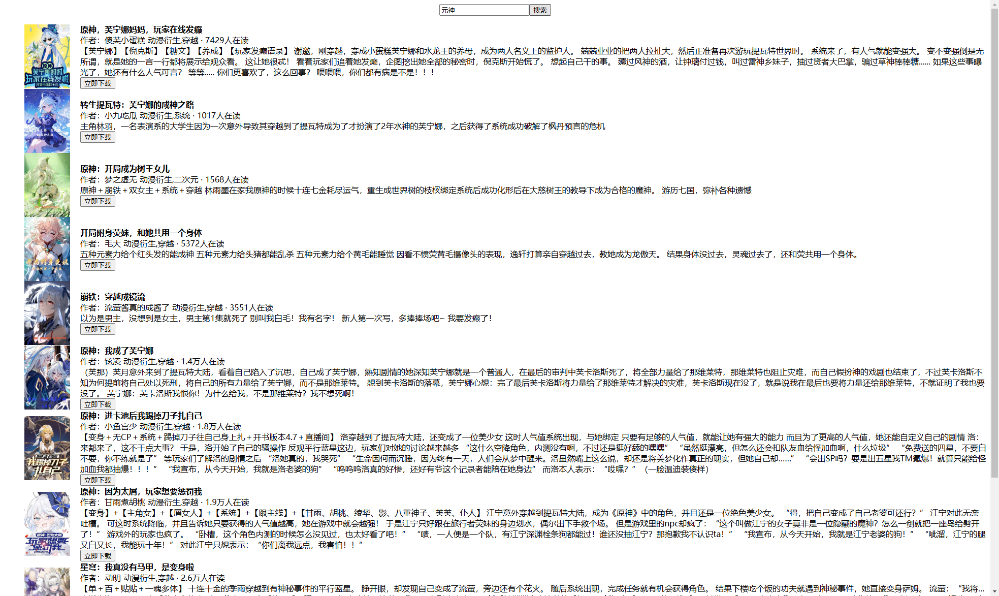

`番茄小说下载测试`

<!-- more -->
### 目录

- [一、协议参考](#一协议参考)
- [二、实现流程](#二实现流程)
- [三、展现方式](#三展现方式)
  
#### 一、协议参考

- 搜索 <https://api5-normal-lf.fqnovel.com/reading/bookapi/search/page/v/?query=%s&aid=1967&channel=0&os_version=0&device_type=0&device_platform=0&iid=466614321180296&passback={{(page-1)*10}}&version_code=999>
- 章节列表 <https://fanqienovel.com/page/{{bookID}}>
- 章节内容 <https://fanqienovel.com/reader/{{chapterID}}>

#### 二、实现流程

- 客户端设计
  客户端具备最基本的功能即可，越简单越好，因此只需要具备最简单的功能（搜索、详情、下载）。

  尽可能让所有的操作都在同一页面完成，开发多余页面，复杂且占用系统资源，移除放大缩小退出等无必要窗口。

  因此设计如下：

  1.搜索：
  
  - 首先用户输入小说名称，点击搜索，获取搜索结果，搜索结果以列表形式展示，每一行展示小说名称、作者、评分、更新时间。最下方可进行翻页操作。
  
  2.详情：

  - 点击行，进入小说详情，展示小说角色，分类，字数，简介等信息。
  
  3.下载：
  - 点击详情后代表选中该小说进行下载，点击最下方下载按钮，界面展示下载进度，下载完成后，展示下载时长。

- 协议设计
  1. 自动刷新Cookie:
  - 每次下载时需要携带Cookie, 携带同一Cookie 频繁访问会返回403，因此需要自动刷新Cookie，建立Cookie池，每次下载时随机使用Cookie。

  2. 并发章节下载:
  - 页面提供并发值设置，默认为5，不能超过50，每次下载时，根据并发值进行并发下载，下载完成后，展示下载时长。

- 使用流程
  1. 打开软件，输入小说名称，点击搜索，获取搜索结果。
  
  2. 点击搜索结果，进入小说详情，点击下载，开始下载。
  
  3. 等待下载完成，下载完成后，展示下载时长。
  
  

- 开发过程中遇到的一些问题
  - 需要使用Cookie进行章节内容下载，初始化及程序运行时自动进行Cookie获取，随机使用Cookie下载。
  - 字符乱码，对字符进行编码转换，没什么说的。
  - 过度设计，因对章节名称进行固定格式解析，导致不规范章节名无法解析，导致章节缺失。
  - 部分协议对部分小说获取章节列表及获取章节内容异常，采用其他协议进行多种方式处理。

#### 三、展现方式

- 客户端方式
  

- 网页方式
  

- 文章分享
  <https://www.52pojie.cn/forum.php?mod=viewthread&tid=1998711&page=1&extra=#pid52197275>  
