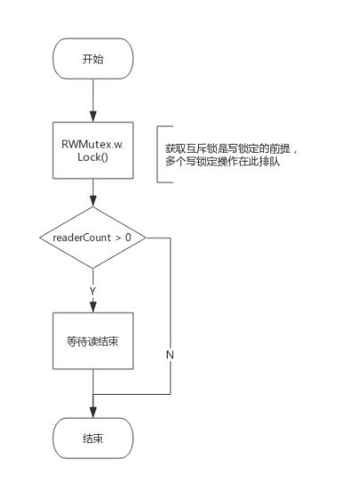
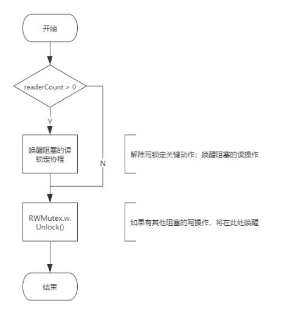
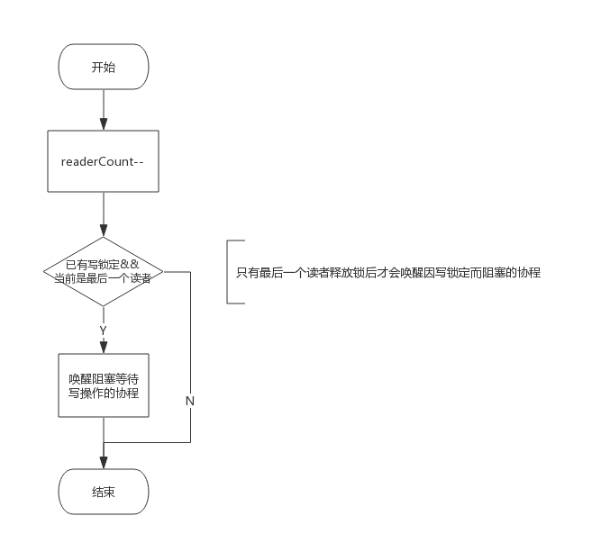
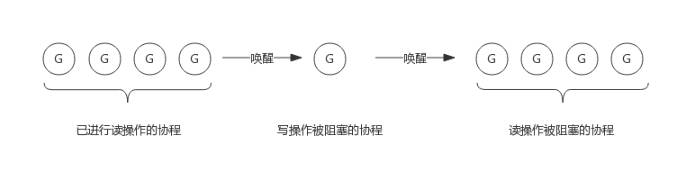

<!-- more -->

### 目录

- [一、RWMutex 是什么](#一rwmutex-是什么)
- [二、RWMutex 数据结构](#二rwmutex-数据结构)
- [三、场景分析](#三场景分析)

#### 一、RWMutex 是什么
>
> 读写互斥锁，是互斥锁的扩展，它支持两种锁模式：读锁和写锁。读锁可以同时被多个 goroutine 持有，而写锁只能被一个 goroutine 持有。读锁和写锁不能同时被持有。

- 写锁需要阻塞写锁：一个协程拥有写锁时，其他协程写锁定需要阻塞。
- 写锁需要阻塞读锁：一个协程拥有写锁时，其他协程读锁定需要阻塞。
- 读锁需要阻塞写锁：一个协程拥有读锁时，其他协程写锁定需要阻塞。
- 读锁不能阻塞读锁：一个协程拥有读锁时，其他协程也可以拥有读锁。

<div style="text-align: right;">
    <a href="#目录" style="text-decoration: none;">Top</a>
</div>

<hr style="background-color: blue;border: none;height: 15px;width: 100%" />

#### 二、RWMutex 数据结构

1. 源码数据结构

    ```go
    type RWMutex struct {
        w           Mutex  // 写锁 用于控制多个写锁，获取写锁首先要获取该锁，如果有一个写锁在进行，那么再到来的写锁会阻塞等待，优先级最高
        writerSem   uint32 // 写锁信号量 写阻塞等待的信号量，最后一个读锁释放锁时会释放信号量，唤醒等待的写锁
        readerSem   uint32 // 读锁信号量 读阻塞等待的信号量，持有写锁的协程释放锁后会释放信号量，唤醒等待的读锁
        readerCount int32  // 读锁计数 记录读锁的个数
        readerWait  int32  // 记录阻塞在写锁的读锁个数
    }
    ```

2. 接口定义

    ```go
    type RWMutex interface {
        Lock() // 写锁 
        Unlock() // 写锁解锁
        RLock() // 读锁
        RUnlock() // 读锁解锁
        RLocker() Locker // 返回一个Locker接口，Locker接口只有一个Lock方法，用于获取读锁
    }
    ```

3. Lock() 实现逻辑

    ```go
    func (rw *RWMutex) Lock() {
        if race.Enabled {
            _= rw.w.state
            race.Disable()
        }
        // First, resolve competition with other writers.
        rw.w.Lock()
        // Announce to readers there is a pending writer.
        r := rw.readerCount.Add(-rwmutexMaxReaders) + rwmutexMaxReaders
        // Wait for active readers.
        if r != 0 && rw.readerWait.Add(r) != 0 {
            runtime_SemacquireRWMutex(&rw.writerSem, false, 0)
        }
        if race.Enabled {
            race.Enable()
            race.Acquire(unsafe.Pointer(&rw.readerSem))
            race.Acquire(unsafe.Pointer(&rw.writerSem))
        }
    }
    ```

    1. 竞争其他写锁：首先，通过调用rw.w.Lock()来获取写锁。这一步确保了当前线程是唯一一个持有写锁的线程。

    2. 通知读锁：然后，通过rw.readerCount.Add(-rwmutexMaxReaders) + rwmutexMaxReaders来减少读锁计数器，并通知所有正在等待的读锁。rwmutexMaxReaders是一个常量，用于确保读锁计数器的值不会变为负数。

    3. 等待读锁释放：如果还有活跃的读锁（即r != 0），则通过rw.readerWait.Add(r)增加等待读锁的计数，并通过runtime_SemacquireRWMutex(&rw.writerSem, false, 0)等待所有读锁释放。

    4. 竞争检测：如果启用了竞争检测（race.Enabled），则在锁定和解锁时进行相应的检测和标记。(在启用竞争检测时，代码会禁用竞争检测，执行锁定操作，然后再重新启用竞争检测。这是为了避免竞争检测器干扰锁的获取和释放过程。)

    写锁操作需要做两件事:
    - 获取互斥锁
    - 阻塞等待所有读操作结束（如果有的话）
    流程图：
    

4. Unlock() 实现逻辑
    解除写锁需要做两件事：
    - 唤醒因读锁定而被阻塞的协程（如果有的话）
    - 解除互斥锁
    流程图：
    

5. RLock() 实现逻辑
   读锁定需要做两件事：
     - 增加读操作计数，即readerCount++
     - 阻塞等待写操作结束（如果有的话）
   流程图：
   

6. RUnlock() 实现逻辑
    解除读锁需要做两件事：
    - 减少读操作计数，即readerCount--
    - 唤醒因写锁定而被阻塞的协程（如果有的话）
    流程图：
    

<div style="text-align: right;">
    <a href="#目录" style="text-decoration: none;">Top</a>
</div>

<hr style="background-color: blue;border: none;height: 15px;width: 100%" />

#### 三、场景分析

1. 写操作是如何阻止写操作的
   > 读写锁包含一个互斥锁（Mutex），写锁定必须要先获取该互斥锁，如果互斥锁已经被协程A获取（或者协程A在阻塞等待读结束），意味着协程A获取了互斥锁，那么协程B只能阻塞等待该互斥锁。

   > 写操作依赖互斥锁阻止其他的写操作。

2. 写操作是如何阻止读操作的
   > RWMutex.readerCount是个整型值，用于表示读锁数量，不考虑写操作情况下，每次读锁定将该值+1，每次解除读锁定将该值-1，所以readerCount取值[0, N]，N 为读锁数量，实际上最多支持2^30个并发读锁。

   > 当写锁定时，会先将readerCount减去2^30，从而readerCount的值变为负数，此时再有读锁到来时，检测到readerCount为负值，便知道写操作在进行，只好阻塞等待。而真实的读操作个数并不会丢失，只需要将readerCount加上2^30，即可得到真实的读操作个数。

   > 写操作依赖readerCount 变成负值 来阻止读操作。

3. 读操作是如何阻止写操作的
   > 读锁定会先将RWMutex.readerCount++,此时写操作到来发现读锁数量不为0，会阻塞等待所有读操作结束。

   > 读操作通过 readerCount 来阻止写操作的。

4. 为什么写锁不会被饿死
   > 写操作要等待读操作结束后才可以获得锁，写操作等待期间可能还有新的读操作持续到来，如果写操作等待所有读操作结束，很可能被饿死。然而，通过RWMutex.readerWait可以完美解决这个问题。

   > 1. 写操作到来时，会把RWMutex.readerCount值拷贝到RWMutex.readerWait中，用于标记排在写操作前面的读锁个数。

   > 2. 当前面的读操作结束后，除了会递减RWMutex.readerCount,还会递减RWMutex.readerWait值，当RWMutex.readerWait值变为0时，唤醒写操作。

   > 3. 写操作相当于把一段连续的读操作划分成两部分，前面的读操作结束唤醒写操作，写操作结束后唤醒后面的读操作。
   

<div style="text-align: right;">
    <a href="#目录" style="text-decoration: none;">Top</a>
</div>

###### 参考链接如下

- [Go 专家编程](https://www.topgoer.cn/docs/gozhuanjia/gochan4)
