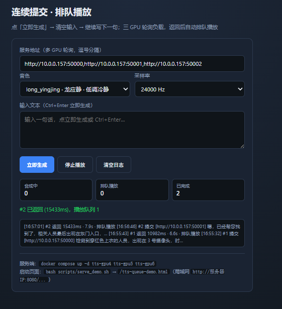

本文是一份 **CosyVoice2-0.5B 中文文本转语音（TTS）自托管部署手册**，覆盖有网机准备、离线/内网 master 构建启动、音色注册、验证试听、API 对接与日常运维。目标是在 **GPU 服务器** 上跑通流式语音合成服务，业务链路为 `jionlptime` → `understanding` → 检索 → **TTS 播报**（流式，目标首包 ≤ 500ms）。

<!-- more -->

<h2 id="c-1-0" class="mh1">一、部署约定</h2>

| 项 | 值 |
|----|----|
| 主模型 | CosyVoice2-0.5B（ModelScope `iic/CosyVoice2-0.5B`，约 4.5GB） |
| 备选模型 | CosyVoice-300M-SFT（显存 4–6GB）；≤4GB 可 PoC MeloTTS |
| 镜像 | `chinese-tts:cu118`（CUDA 11.8 + PyTorch cu118） |
| 运行环境 | CentOS 7.6 + Docker ≥20.10 + 驱动 515.x（CUDA 11.7） |
| 部署根目录 | `/data_hdd/cosyvoice` |
| 部署方式 | 宿主机 **Docker Compose** + 三张物理 GPU（非 K8s 工作负载） |
| GPU 实例 | 物理 GPU **4 / 5 / 6** → 端口 **50000 / 50001 / 50002** |
| 试听页 | `serve_demo` → **8080** |
| 输出格式 | PCM 24kHz s16le |

**分工约定：**

- **有网本机**：源码 / 模型 / wheel / 可选镜像构建与导出
- **master（部署机）**：导入 → 构建或 `docker load` → `compose up`
- **约束**：master 线程受限，**禁止**在其上 `git clone` 或 ModelScope 多线程下载

<h2 id="c-2-0" class="mh1">二、选型与架构</h2>

| 场景 | 选择 |
|------|------|
| 显存 ≥ 8GB | **CosyVoice2-0.5B**（主选，需注册音色） |
| 显存 4–6GB | CosyVoice-300M-SFT（自带中文男/女等） |
| 驱动 515.x | 必须用 **cu118** 镜像；不可直接跑 CUDA 12 镜像 |

数据流：

```text
文本流 → 分句（。！？； / ≥20 字兜底）→ 合成队列 → CosyVoice2 GPU
       → PCM 24kHz s16le → HTTP/WebSocket → 播放器
```

延迟预算：分句 50–100ms + TTS 首包 150–300ms + 传输 ≈ **≤450ms**。

单实例资源：显存 6–8GB，内存 8GB+，shm 8GB，磁盘 ≥20GB，`MAX_CONC=2`。

业务端口：`jionlptime` 8080 · `understanding` 8100 · **TTS 50000–50002**。

<h2 id="c-3-0" class="mh1">三、目录与实例规划</h2>

```text
/data_hdd/cosyvoice/
├── models/CosyVoice2-0.5B/    # 权重（llm.pt ≈1.9GB）
├── models/CosyVoice-ttsfrd/   # 可选，改善数字读音
├── build/CosyVoice/           # 构建源码（必须预置）
├── build/wheels/              # 可选 torch 2.1.2+cu118 wheel
├── prompts/                   # 参考音频
├── scripts/ config/ examples/
├── Dockerfile  docker-compose.yml  .env
└── outputs/  logs/
```

| 容器 | 物理 GPU | 端口 |
|------|----------|------|
| `chinese-tts-gpu4` | 4 | 50000 |
| `chinese-tts-gpu5` | 5 | 50001 |
| `chinese-tts-gpu6` | 6 | 50002 |

单卡 PoC：`docker compose --profile single-gpu up -d tts`。

<h2 id="c-4-0" class="mh1">四、前置检查（master）</h2>

```bash
nvidia-smi                                          # 515.x / CUDA 11.7，可见卡 4/5/6
docker run --rm --gpus all nvidia/cuda:11.8.0-base-ubuntu20.04 nvidia-smi
nvidia-smi --query-gpu=index,name,memory.total --format=csv
```

GPU 容器失败时，安装 NVIDIA Container Toolkit 后执行 `systemctl restart docker`。

<h2 id="c-5-0" class="mh1">五、有网机准备</h2>

在仓库 `chinese-tts/` 下执行。`DEPLOY_HOST` 按现场改。

<h2 id="c-5-1" class="mh2">5.1 同步部署文件</h2>

```bash
export DEPLOY_HOST=root@k8s-master-157
export DEPLOY_ROOT=/data_hdd/cosyvoice
bash scripts/sync_to_server.sh
ssh "$DEPLOY_HOST" "cd $DEPLOY_ROOT && sed -i 's/\r$//' scripts/*.sh && chmod +x scripts/*.sh"
```

首次也可手动拷贝：

```bash
scp -r Dockerfile docker-compose.yml .env.example scripts prompts config examples \
  "$DEPLOY_HOST:/data_hdd/cosyvoice/"
```

<h2 id="c-5-2" class="mh2">5.2 CosyVoice 源码（构建必须）</h2>

```bash
bash scripts/prepare_cosyvoice_src.sh
scp -r build/CosyVoice "$DEPLOY_HOST:/data_hdd/cosyvoice/build/"
```

<h2 id="c-5-3" class="mh2">5.3 模型权重（推荐本机 wget）</h2>

ModelScope：[iic/CosyVoice2-0.5B](https://www.modelscope.cn/models/iic/CosyVoice2-0.5B)

```bash
bash scripts/wget_models_local.sh CosyVoice2-0.5B
scp -r models/CosyVoice2-0.5B "$DEPLOY_HOST:/data_hdd/cosyvoice/models/"
ssh "$DEPLOY_HOST" "ls -lh /data_hdd/cosyvoice/models/CosyVoice2-0.5B/llm.pt"
```

**关键文件（合计约 4.5GB）**

| 文件 | 约大小 |
|------|--------|
| `llm.pt` | 1.9 GB |
| `CosyVoice-BlankEN/model.safetensors` | 942 MB |
| `speech_tokenizer_v2.onnx` / `.batch.onnx` | 各 ~473 MB |
| `flow.pt` / `flow.cache.pt` | 各 ~430 MB |
| `flow.decoder.estimator.fp32.onnx` | ~273 MB |
| `flow.encoder.fp32.zip` / `.fp16.zip` | ~183 / 111 MB |
| `hift.pt` / `campplus.onnx` | ~80 / 27 MB |
| 其余 yaml/json/tokenizer 等 | 小 |

直链格式（路径含 `/` 需 URL 编码为 `%2F`）：

```text
https://modelscope.cn/api/v1/models/iic/CosyVoice2-0.5B/repo?Revision=master&FilePath=<路径>
```

单文件断点续传示例：

```bash
mkdir -p models/CosyVoice2-0.5B
wget -c "https://modelscope.cn/api/v1/models/iic/CosyVoice2-0.5B/repo?Revision=master&FilePath=llm.pt" \
  -O models/CosyVoice2-0.5B/llm.pt
```

**备选下载（服务器有网但受限时）**

| 方式 | 命令 |
|------|------|
| Docker HTTP 顺序 | `bash scripts/download_models_docker.sh CosyVoice2-0.5B` |
| Git | `USE_GIT=1 bash scripts/download_models_docker.sh CosyVoice2-0.5B` |

可选：`CosyVoice-ttsfrd` → `models/CosyVoice-ttsfrd/`（改善数字读音）。  
300M-SFT：下载到 `models/CosyVoice-300M-SFT/`，`.env` 设 `MODEL_DIR=pretrained_models/CosyVoice-300M-SFT`。

<h2 id="c-5-4" class="mh2">5.4 PyTorch wheel（可选，约 2.3GB）</h2>

```bash
bash scripts/download_pytorch_wheels.sh
ssh "$DEPLOY_HOST" "mkdir -p /data_hdd/cosyvoice/build/wheels"
scp build/wheels/*.whl "$DEPLOY_HOST:/data_hdd/cosyvoice/build/wheels/"
```

文件名需匹配 `torch-2.1.2*.whl`；构建日志会显示「使用本地 PyTorch wheel」。

<h2 id="c-5-5" class="mh2">5.5 镜像备选：本机构建再导入</h2>

```bash
bash scripts/build_and_export.sh
scp cosyvoice-tts.tar "$DEPLOY_HOST:/data_hdd/cosyvoice/"
ssh "$DEPLOY_HOST" "docker load -i /data_hdd/cosyvoice/cosyvoice-tts.tar"
```

<h2 id="c-5-6" class="mh2">5.6 离线安装包清单</h2>

| 文件/目录 | 说明 | 必须 |
|-----------|------|------|
| `build/CosyVoice/` | 构建源码 | 是 |
| `models/CosyVoice2-0.5B/` | 主模型权重 | 是 |
| `Dockerfile` / `docker-compose.yml` / `.env` | 编排与配置 | 是 |
| `scripts/` / `prompts/` / `config/` | 部署与音色脚本 | 是 |
| `build/wheels/*.whl` | 本地 PyTorch wheel | 可选 |
| `cosyvoice-tts.tar` | 预构建镜像 | 可选（二选一） |
| `models/CosyVoice-ttsfrd/` | 数字读音优化 | 可选 |

<h2 id="c-6-0" class="mh1">六、master 安装启动</h2>

```bash
cd /data_hdd/cosyvoice
bash scripts/init_dirs.sh                    # 报 $'\r' 则先 sed -i 's/\r$//' scripts/*.sh
cp -n .env.example .env
bash scripts/check_build_ready.sh            # 须有 build/CosyVoice + llm.pt
bash scripts/docker_build_master.sh --no-cache   # 已 load 镜像可跳过
docker compose up -d tts-gpu4 tts-gpu5 tts-gpu6
docker compose logs -f tts-gpu4              # 首启加载 1～3 分钟
```

**.env 要点：** `DATA_ROOT`、`TTS_PORT_GPU4/5/6`、`MODEL_DIR`、`MAX_CONC`。

防火墙（按需）：

```bash
firewall-cmd --add-port=50000-50002/tcp --permanent
firewall-cmd --add-port=8080/tcp --permanent
firewall-cmd --reload
```

<h2 id="c-7-0" class="mh1">七、音色注册（CosyVoice2 必做）</h2>

CosyVoice2 **无开箱 spk**，须写入 `spk2info.pt`。`prompt_text` 必须与参考音频内容一致。

| spk_id | 场景 | prompt_text | WAV |
|--------|------|-------------|-----|
| `zh_female` | 默认播报 | 希望你以后能够做的比我还好呦。 | `build/CosyVoice/asset/zero_shot_prompt.wav` |
| `zh_male_std` | 告警/正式 | 请注意，系统检测到异常情况，请立即查看处理。 | `prompts/zh_male_std.wav` |
| `zh_female_soft` | 引导 | 您好，我来为您介绍一下具体的操作步骤。 | `prompts/zh_female_soft.wav` |
| `zh_female_news` | 新闻列举 | 今日要闻，下面为您播报最新检索结果。 | `prompts/zh_female_news.wav` |
| `zh_male_news` | 公告安保 | 据现场监控显示，相关人员已出现在指定区域。 | `prompts/zh_male_news.wav` |
| `zh_female_young` | 轻提示 | 太好了，已经帮您找到了，快来看一看吧。 | `prompts/zh_female_young.wav` |
| `zh_male_calm` | 长说明 | 接下来我将为您说明每一项配置的详细含义。 | `prompts/zh_male_calm.wav` |
| `zh_child` | 童声可选 | 你好呀，我们一起去看一看吧。 | `prompts/zh_child.wav` |

业务映射见 `config/voices.yaml`（如 `search_result→zh_female`，`alert→zh_male_std`）。

**音频规范：** WAV 16kHz mono s16，时长 **3～10s**，无 BGM/噪声；商用请自录（7 角色尽量不同说话人）。PoC 可用[阿里云音色试听](https://help.aliyun.com/zh/model-studio/cosyvoice-voice-list)下载 MP3（注意版权）。

<h2 id="c-7-1" class="mh2">7.1 准备参考音频</h2>

```bash
cd /data_hdd/cosyvoice

# 1) 官方女声
bash scripts/download_prompt_assets.sh
# GitHub 慢：COSYVOICE_ASSET_BASE=https://gitee.com/mirrors/CosyVoice/raw/main/asset bash scripts/download_prompt_assets.sh

# 2) 仅测流程（7 音色相同，上线前须替换）
# bash scripts/download_prompt_assets.sh --all-names

# 3) 自备 raw → 转 16k WAV
for n in zh_male_std zh_female_soft zh_female_news zh_male_news \
         zh_female_young zh_male_calm zh_child; do
  bash scripts/prepare_prompt_wav.sh "$n"
done
# 或：ffmpeg -i in.mp3 -ac 1 -ar 16000 -sample_fmt s16 prompts/zh_male_std.wav
```

<h2 id="c-7-2" class="mh2">7.2 注册音色</h2>

```bash
cd /data_hdd/cosyvoice

bash scripts/register_speaker.sh zh_female \
  "希望你以后能够做的比我还好呦。" \
  build/CosyVoice/asset/zero_shot_prompt.wav
bash scripts/register_all_speakers.sh

bash scripts/list_speakers.sh
```

说明：注册脚本会 **stop 三实例 → 写 spk2info → 再 up**；已存在则 skip。  
单条补注册：先 `docker compose stop tts-gpu4 tts-gpu5 tts-gpu6`，再 `register_speaker.sh`，再 `up -d`。

<h2 id="c-8-0" class="mh1">八、验证与试听</h2>

```bash
curl -sf http://127.0.0.1:50000/docs   # 501/502 同理
curl -X POST "http://127.0.0.1:50000/inference_sft" \
  -F "tts_text=你好，语音合成测试。" -F "spk_id=zh_female" -o /tmp/test.pcm

for id in zh_female zh_male_std zh_female_soft; do
  curl -X POST "http://127.0.0.1:50000/inference_sft" \
    -F "tts_text=你好，这是${id}音色测试。" -F "spk_id=${id}" -o "/tmp/${id}.pcm"
done
```

试听页（master）：

```bash
bash scripts/serve_demo.sh
```

| 页面 | 地址 |
|------|------|
| 整句流式 | `http://<ip>:8080/tts-demo.html` |
| 边输入边播 | `http://<ip>:8080/tts-bistream-demo.html` |
| 连续排队（推荐） | `http://<ip>:8080/tts-queue-demo.html` |

排队页服务地址填：`http://<ip>:50000,http://<ip>:50001,http://<ip>:50002`。  
Windows 本机开页、TTS 在 master：用 `scripts\serve_demo.bat`，服务地址仍填 master IP。

<h2 id="c-8-1" class="mh2">8.1 测试页面：文本转语音效果</h2>

推荐用 **连续排队试听页**（`tts-queue-demo.html`）验证合成效果与三 GPU 轮询。浏览器打开 `http://<服务器IP>:8080/tts-queue-demo.html`，在「服务地址」填入三实例（逗号分隔），选择音色与采样率后输入文本，点 **立即生成** 或 `Ctrl+Enter` 即可试听。

页面能力：

- **连续提交 · 排队播放**：生成后自动清空输入，可连续写下一句；三 GPU 轮询负载，返回后自动排队播放
- **状态面板**：合成中 / 排队播放 / 已完成计数，以及每条请求的 GPU 端口与耗时日志
- **多音色切换**：下拉选择已注册 `spk_id`（如图 `long_yingjing · 龙应静 · 低调冷静`）



图中示例：服务地址 `http://10.0.0.157:50000,50001,50002`，采样率 24000 Hz；日志可见请求 #1/#2 分别命中 GPU 50000、50001，合成返回后进入播放队列。部署侧对应命令：

```bash
docker compose up -d tts-gpu4 tts-gpu5 tts-gpu6
bash scripts/serve_demo.sh   # → http://<服务器IP>:8080/tts-queue-demo.html
```

<h2 id="c-9-0" class="mh1">九、API 对接</h2>

| 能力 | 方式 |
|------|------|
| OpenAPI | `GET /docs` |
| SFT 合成 | `POST /inference_sft`（form：`tts_text`、`spk_id`）→ PCM 24kHz |
| 双工流式 | `ws://<host>:50000/ws/bistream` |
| 多卡 | 业务轮询 50000–50002 |

WebSocket 双工流式示例：

```text
→ {"type":"start","spk_id":"zh_female"}
→ {"type":"text","chunk":"你好，"}
→ {"type":"end"}
← binary PCM
← {"type":"done"}
```

播报示例：检索「办公室前 / 14:32 / 黑裤子男性」→  
「在办公室前摄像头，14点32分检测到一名穿黑裤子的男性。」

<h2 id="c-10-0" class="mh1">十、日常运维</h2>

<h2 id="c-10-1" class="mh2">10.1 状态与日志</h2>

```bash
cd /data_hdd/cosyvoice
docker compose ps
docker compose logs --tail=100 tts-gpu4
docker compose logs -f tts-gpu5
```

<h2 id="c-10-2" class="mh2">10.2 重启与更新</h2>

```bash
docker compose restart tts-gpu4 tts-gpu5 tts-gpu6
# 同步脚本后：sed 换行 → chmod → compose up -d
docker compose up -d tts-gpu4 tts-gpu5 tts-gpu6
```

<h2 id="c-10-3" class="mh2">10.3 监控指标</h2>

关注：首包 P95 >800ms、显存 >90%、队列深度 >10、错误率 >1%。

**升级路径（参考）：** 驱动 525+ → CosyVoice3+cu121；高并发可加 vLLM / TensorRT。

<h2 id="c-11-0" class="mh1">十一、路径与参数对照</h2>

| 用途 | 路径/值 |
|------|---------|
| `DEPLOY_ROOT` | `/data_hdd/cosyvoice` |
| 主模型 | `models/CosyVoice2-0.5B/` |
| 构建源码 | `build/CosyVoice/` |
| 参考音频 | `prompts/` |
| 音色映射 | `config/voices.yaml` |
| 镜像 | `chinese-tts:cu118` |
| GPU4/5/6 端口 | `50000` / `50001` / `50002` |
| 试听页 | `8080` |
| 输出音频 | PCM 24kHz s16le |

| 参数 | 说明 |
|------|------|
| `DATA_ROOT` | 数据根目录 |
| `MODEL_DIR` | 容器内模型路径 |
| `TTS_PORT_GPU4/5/6` | 各 GPU 实例端口 |
| `MAX_CONC` | 单实例最大并发（默认 2） |

<h2 id="c-12-0" class="mh1">十二、常见问题</h2>

| 现象 | 处理 |
|------|------|
| `$'\r'` / pipefail 无效 | `sed -i 's/\r$//' scripts/*.sh` |
| 缺 CosyVoice 源码 | 本机 `prepare_cosyvoice_src.sh` 后 scp |
| master build/pip 线程失败 | `docker_build_master.sh` 或本机 `build_and_export.sh` + `docker load` |
| `cuda>=12` / 驱动不匹配 | 用本仓库 cu118；已设 `NVIDIA_DISABLE_REQUIRE=1` |
| 合成 OOM | 降 `MAX_CONC`、改 300M；注册前先 stop TTS |
| ModelScope 无法开线程 | 本机 wget 或 `download_models_docker.sh` |
| 未知 spk_id | `list_speakers.sh` / 先注册 |
| 合成不像参考音 | prompt_text 与 WAV 不一致，或有 BGM |
| 数字读音差 | 装 ttsfrd 或业务层数字转中文 |
| 8080/5000x 不通 | 监听 `0.0.0.0` + firewall；试听页勿填错本机 IP |

<h2 id="c-13-0" class="mh1">十三、检查清单</h2>

- [ ] `nvidia-smi` + `docker --gpus` 正常，卡 4/5/6 可用
- [ ] 部署文件已同步，脚本为 LF
- [ ] `build/CosyVoice`、`models/.../llm.pt` 就绪
- [ ] 镜像 `chinese-tts:cu118` 已构建或 load
- [ ] 三容器 Up，`/docs` 可访问
- [ ] 已注册音色，`inference_sft` 出音频
- [ ]（可选）8080 试听页局域网可开

<h2 id="c-14-0" class="mh1">十四、流程速查</h2>

```text
有网本机 (chinese-tts/)
  → sync 部署文件 / scp
  → prepare_cosyvoice_src.sh
  → wget 模型 → scp 到 master
  → （可选）wheel / build_and_export 镜像

master (/data_hdd/cosyvoice)
  → init_dirs + check_build_ready
  → docker_build 或 docker load
  → compose up -d tts-gpu4/5/6
  → 注册音色 register_all_speakers
  → curl /docs + inference_sft 验证
  → serve_demo 8080 试听
  → 业务对接 HTTP / WebSocket 50000–50002
```

<h2 id="c-15-0" class="mh1">十五、参考链接</h2>

- [CosyVoice](https://github.com/FunAudioLLM/CosyVoice)
- [CosyVoice2-0.5B](https://www.modelscope.cn/models/iic/CosyVoice2-0.5B)
- [CosyVoice-300M-SFT](https://www.modelscope.cn/models/iic/CosyVoice-300M-SFT)
- [NVIDIA Container Toolkit](https://docs.nvidia.com/datacenter/cloud-native/container-toolkit/install-guide.html)
- [CUDA 兼容性](https://docs.nvidia.com/deploy/cuda-compatibility/)
- 配置：`config/voices.yaml` · `prompts/speakers.csv`

<hr aria-hidden="true" style=" border: 0; height: 2px; background: linear-gradient(90deg, transparent, #1bb75c, transparent); margin: 2rem 0; " />

<!-- 目录容器 -->
<div class="mi1">
    <strong>目录</strong>
        <ul style="margin: 10px 0; padding-left: 20px; list-style-type: none;">
            <li style="list-style-type: none;"><a href="#c-1-0">一、部署约定</a></li>
            <li style="list-style-type: none;"><a href="#c-2-0">二、选型与架构</a></li>
            <li style="list-style-type: none;"><a href="#c-3-0">三、目录与实例规划</a></li>
            <li style="list-style-type: none;"><a href="#c-4-0">四、前置检查（master）</a></li>
            <li style="list-style-type: none;"><a href="#c-5-0">五、有网机准备</a></li>
                <ul style="padding-left: 15px; list-style-type: none;">
                    <li style="list-style-type: none;"><a href="#c-5-1">5.1 同步部署文件</a></li>
                    <li style="list-style-type: none;"><a href="#c-5-2">5.2 CosyVoice 源码</a></li>
                    <li style="list-style-type: none;"><a href="#c-5-3">5.3 模型权重</a></li>
                    <li style="list-style-type: none;"><a href="#c-5-4">5.4 PyTorch wheel</a></li>
                    <li style="list-style-type: none;"><a href="#c-5-5">5.5 镜像备选</a></li>
                    <li style="list-style-type: none;"><a href="#c-5-6">5.6 离线安装包清单</a></li>
                </ul>
            <li style="list-style-type: none;"><a href="#c-6-0">六、master 安装启动</a></li>
            <li style="list-style-type: none;"><a href="#c-7-0">七、音色注册</a></li>
                <ul style="padding-left: 15px; list-style-type: none;">
                    <li style="list-style-type: none;"><a href="#c-7-1">7.1 准备参考音频</a></li>
                    <li style="list-style-type: none;"><a href="#c-7-2">7.2 注册音色</a></li>
                </ul>
            <li style="list-style-type: none;"><a href="#c-8-0">八、验证与试听</a></li>
                <ul style="padding-left: 15px; list-style-type: none;">
                    <li style="list-style-type: none;"><a href="#c-8-1">8.1 测试页面：文本转语音效果</a></li>
                </ul>
            <li style="list-style-type: none;"><a href="#c-9-0">九、API 对接</a></li>
            <li style="list-style-type: none;"><a href="#c-10-0">十、日常运维</a></li>
                <ul style="padding-left: 15px; list-style-type: none;">
                    <li style="list-style-type: none;"><a href="#c-10-1">10.1 状态与日志</a></li>
                    <li style="list-style-type: none;"><a href="#c-10-2">10.2 重启与更新</a></li>
                    <li style="list-style-type: none;"><a href="#c-10-3">10.3 监控指标</a></li>
                </ul>
            <li style="list-style-type: none;"><a href="#c-11-0">十一、路径与参数对照</a></li>
            <li style="list-style-type: none;"><a href="#c-12-0">十二、常见问题</a></li>
            <li style="list-style-type: none;"><a href="#c-13-0">十三、检查清单</a></li>
            <li style="list-style-type: none;"><a href="#c-14-0">十四、流程速查</a></li>
            <li style="list-style-type: none;"><a href="#c-15-0">十五、参考链接</a></li>
        </ul>
</div>
