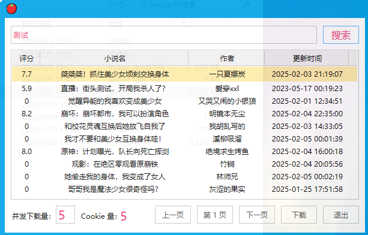
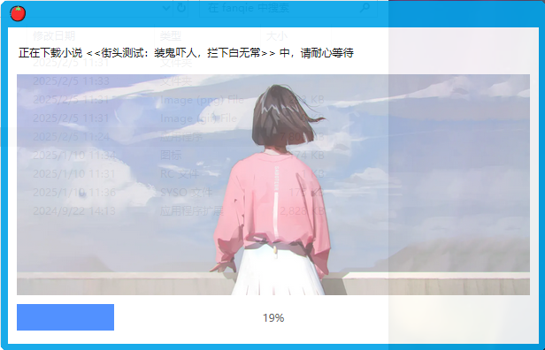

番茄小说离线下载，再也不用看视频了

<!-- more -->

<h2 id="c-1-0" class="mh1">一、协议参考</h2>

- **搜索接口**  

  ```
  https://api5-normal-lf.fqnovel.com/reading/bookapi/search/page/v/?query=%s&aid=1967&channel=0&os_version=0&device_type=0&device_platform=0&iid=466614321180296&passback={{(page-1)*10}}&version_code=999
  ```

- **章节列表**  

  ```
  https://fanqienovel.com/page/{{bookID}}
  ```

- **章节内容**  

  ```
  https://fanqienovel.com/reader/{{chapterID}}
  ```

---

<h2 id="c-2-0" class="mh1">二、实现流程</h2>

### 客户端设计

客户端具备最基本的功能即可，越简单越好，因此只需要具备最简单的功能（搜索、详情、下载）。

尽可能让所有的操作都在同一页面完成，开发多余页面，复杂且占用系统资源，移除放大缩小退出等无必要窗口。

#### 1. 搜索

- 首先用户输入小说名称，点击搜索，获取搜索结果
- 搜索结果以列表形式展示
- 每一行展示：小说名称、作者、评分、更新时间
- 最下方可进行翻页操作

#### 2. 详情

- 点击行，进入小说详情
- 展示：小说角色，分类，字数，简介等信息

#### 3. 下载

- 点击详情后代表选中该小说进行下载
- 点击最下方下载按钮，界面展示下载进度
- 下载完成后，展示下载时长

### 协议调整

#### 1. 自动刷新Cookie

- 每次下载时需要携带Cookie
- 携带同一Cookie频繁访问会返回403
- 需要自动刷新Cookie，建立Cookie池
- 每次下载时随机使用Cookie

#### 2. 并发章节下载

- 页面提供并发值设置，默认为5
- 并发值不能超过50
- 每次下载时，根据并发值进行并发下载
- 下载完成后，展示下载时长

### 使用流程

1. 打开软件，输入小说名称，点击搜索，获取搜索结果
   

2. 点击搜索结果，进入小说详情，点击下载，开始下载
   

3. 等待下载完成，下载完成后，展示下载时长
   
   

### 开发过程中遇到的一些问题

- **Cookie管理问题**：需要使用Cookie进行章节内容下载，初始化及程序运行时自动进行Cookie获取，随机使用Cookie下载
- **字符编码问题**：字符乱码，对字符进行编码转换
- **章节解析问题**：过度设计，因对章节名称进行固定格式解析，导致不规范章节名无法解析，导致章节缺失
- **协议兼容问题**：部分协议对部分小说获取章节列表及获取章节内容异常，采用其他协议进行多种方式处理

---

<h2 id="c-3-0" class="mh1">三、展现方式</h2>

### 客户端方式


### 网页方式


### 文章分享

<https://www.52pojie.cn/forum.php?mod=viewthread&tid=1998711&page=1&extra=#pid52197275>

<!-- 目录容器 -->
<div class="mi1">
    <strong>目录</strong>
        <ul style="margin: 10px 0; padding-left: 20px; list-style-type: none;">
            <li style="list-style-type: none;"><a href="#c-1-0">一、协议参考</a></li>
            <ul style="padding-left: 15px; list-style-type: none;"></ul>
            <li style="list-style-type: none;"><a href="#c-2-0">二、实现流程</a></li>
            <ul style="padding-left: 15px; list-style-type: none;"></ul>
            <li style="list-style-type: none;"><a href="#c-3-0">三、展现方式</a></li>
            <ul style="padding-left: 15px; list-style-type: none;"></ul>
        </ul>
</div>

<style>
    /* 一级段落 */
    .mh1 {
      text-align: center;
      color: black;
      background: linear-gradient(#fff 60%, #b2e311ff 40%);
      margin: 1.4em 0 1.1em;
      font-size: 1.4em;
      font-family: 'roboto', 'Iowan Old Style', 'Ovo', 'Hoefler Text', Georgia, 'Times New Roman', 'TIBch', 'Source Han Sans', 'PingFangSC-Regular', 'Hiragino Sans GB', 'STHeiti', 'Microsoft Yahei', 'Droid Sans Fallback', 'WenQuanYi Micro Hei', sans-serif;
      line-height: 1.7;
      letter-spacing: .33px;
    }
    /* 二级段落 */

    .mh2 {
      -webkit-text-size-adjust: 100%; letter-spacing: .33px; font-family: 'roboto', 'Iowan Old Style', 'Ovo', 'Hoefler Text', Georgia, 'Times New Roman', 'TIBch', 'Source Han Sans', 'PingFangSC-Regular', 'Hiragino Sans GB', 'STHeiti', 'Microsoft Yahei', 'Droid Sans Fallback', 'WenQuanYi Micro Hei', sans-serif; line-height: 1.7; color: #1cc03cff; border-left: 4px solid #1bb75cff; padding-left: 6px; margin: 1.4em 0 1.1em;
    }

    /* 目录 高度、宽度 可自行调整*/
    .mi1 {
      position: fixed; bottom: 240px; right: 10px; width: 240px; height: 100px; background: #f8f9fa; border: 1px solid #e9ecef; border-radius: 8px; padding: 15px; overflow-y: auto; font-family: 'roboto', 'Iowan Old Style', 'Ovo', 'Hoefler Text', Georgia, 'Times New Roman', 'TIBch', 'Source Han Sans', 'PingFangSC-Regular', 'Hiragino Sans GB', 'STHeiti', 'Microsoft Yahei', 'Droid Sans Fallback', 'WenQuanYi Micro Hei', sans-serif; font-size: 14px; line-height: 1.15; color: #444; letter-spacing: 0.33px; transition: all 0.3s ease;
    }

</style>
