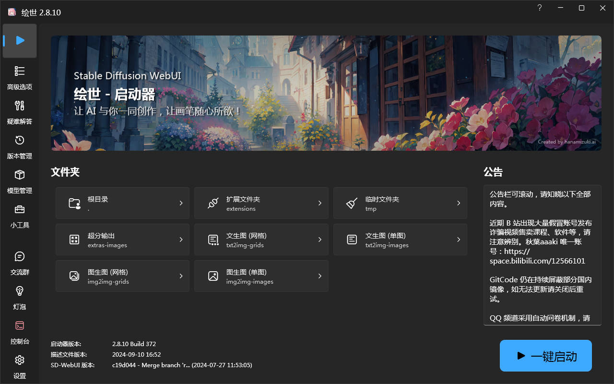
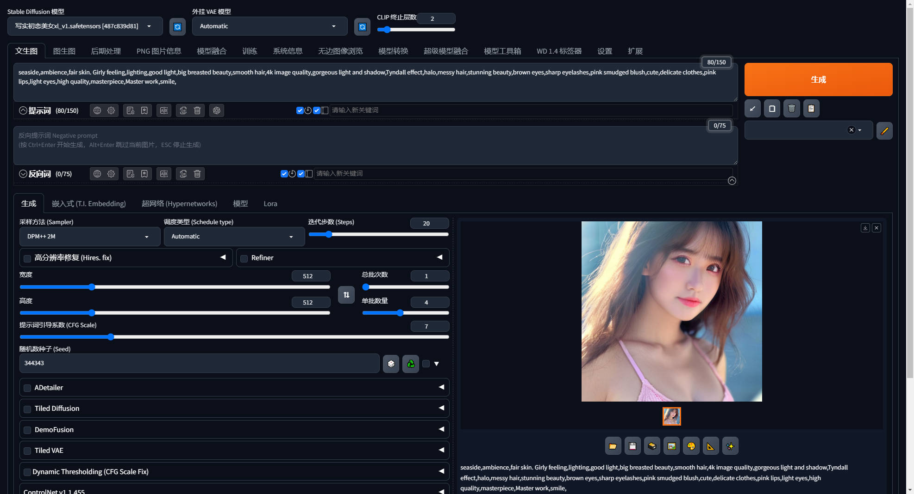

Stable Diffusion 文生图实践记录

<!-- more -->

<h2 id="c-1-0" class="mh1">一、带着问题去探索</h2>

<h2 id="c-1-1" class="mh2">1.1 AI 绘画是什么？</h2>

  > AI 绘画，顾名思义就是利用人工智能进行绘画，是人工智能生成内容（[AIGC](https://www.uisdc.com/tag/aigc)）的一个应用场景。其主要原理简单来说就是收集大量已有作品数据，通过算法对它们进行解析，最后再生成新作品，而算法也便是 AI 绘画的核心，是它得以爆火的基础。

- Midjourney 是什么？

    > Midjourney 是一个由 Midjourney 研究实验室开发的人工智能程序，可根据文本生成图像，目前架设在 Discord 频道上。于 2022 年 7 月 12 日进入公开测试阶段，使用者可通过 Discord 的机器人指令进行操作，可以创作出很多的图像作品。

- Discord 频道是什么？

    > Discord 是前几年诞生的非常火的一种新型聊天工具，类似 QQ、微信群。
    > Midjourney 的使用方式是：通过给 Discord 频道内的聊天机器人发送对应文本，聊天机器人返回对应的图片。

- Stable Diffusion 是什么 ?

    > Stable Diffusion 是一款基于人工智能技术开发的绘画软件，它可以帮助艺术家和设计师快速创建高品质的数字艺术作品。该软件使用了一种称为 GAN（生成对抗网络）的深度学习模型，该模型可以学习并模仿艺术家的创作风格，从而生成类似的艺术作品。链路追踪（Trace）是一种用于监控和诊断分布式系统的方法，它可以帮助你了解请求在系统中的路径，以及每个步骤的执行情况。
    >
    > Stable Diffusion 具有直观的用户界面，可以让用户轻松地调整绘画参数并实时预览结果。用户可以选择不同的画布、画笔和颜色，还可以通过调整图像的风格、纹理和颜色等参数来创建各种不同的艺术作品。

    > 除此之外，Stable Diffusion 还提供了一些高级功能，例如批量处理、自动矫正和自动化调整等，可以帮助用户更加高效地完成大量的绘画任务。
    >
    > 总之，Stable Diffusion 是一款功能强大的 AI 绘画软件，它比现在市面上主流的 AI 绘画软件 Midjourney 更加的强大，可以说 SD 是所有 AI 绘画的鼻祖级存在，同样，更强大代表着它的上手难度及配置要求也更高。

- Midjourney  和 Stable Diffusion 选择？

    > 从学习的角度看，其实这两个并不冲突，功能强大，都能生成高质量的图片， 学哪个都可以，或者两个都学习。
    >
    > 从经济角度看，MJ是收费的，是个在线的网站，对电脑配置没要求，需要魔法才能使用，内置了很多功能，通过各种命令和参数来出图。
    >
    > SD 是免费的，可以部署到自己的电脑上，能够离线使用，在生图方面更灵活，更自由一些。
    >

<h2 id="c-1-2" class="mh2">1.2 Stable Diffusion 电脑配置要求 ?</h2>
>
> 出图主要依赖GPU, 磁盘主要用来存储模型，模型文件一般都是大几G

- CPU：AMD或Intel CPU
- 内存：不低于16 GB DDR4或DDR5
- 存储：不低于10 GB可用空间，256GB或更大的SATA或NVMe固态驱动器
- GPU：不低于6 GB显存N卡, 或者具有至少8GB GDDR6内存的GeForce RTX GPU
- 操作系统：Windows10或Windows11

---

<h2 id="c-2-0" class="mh1">二、安装Stable Diffusion</h2>

<h2 id="c-2-1" class="mh2">2.1 原始流程安装（不推荐，易出问题）</h2>

1. Install [Python 3.10.6](https://www.python.org/downloads/release/python-3106/) (Newer version of Python does not support torch), checking "Add Python to PATH".

2. Install [git](https://git-scm.com/download/win).

3. Download the stable-diffusion-webui repository, for example by running `git clone https://github.com/AUTOMATIC1111/stable-diffusion-webui.git`.

4. Run `webui-user.bat` from Windows Explorer as normal, non-administrator, user.

<h2 id="c-2-2" class="mh2">2.2 整合包安装(解压即用)</h2>

> 1. 小破站 搜索 秋葉aaaki 2. 搜索框 搜索 整合包

​   

> 使用步骤

1. 下载压缩包 sd-webui-aki-vxxx
2. 解压缩到本地
3. 执行A绘世启动器，一键启动

​     

---

<h2 id="c-3-0" class="mh1">三、生成一张美女图片</h2>
<h2 id="c-3-1" class="mh2">3.1 基本参数了解</h2>

- Stable Diffusion 模型
  > 大模型切换

- 模型的VAE
  > VAE 的全称是 Variational Auto-Encoder，翻译过来是变分自动编码器，本质上是一种训练模型，Stable Diffusion 里的 VAE 主要是模型作者将训练好的模型“解压”的解码工具。

- CLIP 终止层数
  > 可以将CLIP skip想象成“您希望文本模型有多准确”的设置,CLIP跳过仅适用于使用CLIP或基于使用CLIP的模型。即1.x模型及其派生物。2.0模型及其派生物不与CLIP交互，因为它们使用OpenCLIP。

- 提示词及反提示词

    > 提示词内输入的东西就是你想要画的东西，反向提示词内输入的就是你不想要画的东西。
    >
    > 提示框内只能输入英文，所有符号都要使用英文半角，词语之间使用半角逗号隔开。

  - ① 最直接的权重调节就是调整词语顺序，越靠前权重越大，越靠后权重越低，上面说过。

  - ② 可以通过下面的语法来对关键词设置权重，一般权重设置在 0.5~2 之间，可以通过选中词汇，按 ctrl+↑↓来快速调节权重，每次调节为0.1，也可以直接输入。

  - ③ 加英文输入的（），一个括号代表这组关键词的权重是 1.1，两个括号是 1.1*1.1 的权重，不要加太多了哈。可以结合第二点固定权重，比如(((cute girl:1.2)))，那这个关键词的权重就很高了。

- 随机种子

  > 随机数的起点。保持这个值不变，可以多次生成相同（或几乎相同，如果启用了 xformers）的图像。没有什么种子天生就比其他的好，但如果你只是稍微改变你的输入参数，以前产生好结果的种子很可能仍然会产生好结果。

<h2 id="c-3-2" class="mh2">3.2 美女图生成</h2>

1. 首先下载 [美女模型](https://www.mediafire.com/file/a0a20ueou6yrmdf/%E5%86%99%E5%AE%9E%E5%88%9D%E6%81%8B%E7%BE%8E%E5%A5%B3xl_v1.safetensors/file)

2. 其次将模型导入指定文件夹 models\Stable-diffusion

3. 使用该模型生成，并填写指定提示词，点击生成
    >
    > 提示词参考
    >
    > seaside,ambience,fair skin. Girly feeling,lighting,good light,big breasted beauty,smooth hair,4k image quality,gorgeous light and shadow,Tyndall effect,halo,messy hair,stunning beauty,brown eyes,sharp eyelashes,pink smudged blush,cute,delicate clothes,pink lips,light eyes,high quality,masterpiece,Master work,smile,
4. 效果图如下
​
      

    > 模型下载地址:  <https://civitai.com/>
 >
---

<h2 id="c-4-0" class="mh1">四、参考资源</h2>

- [超详细！外婆都能看懂的Stable Diffusion入门教程](https://www.uisdc.com/stable-diffusion-3)
- [【AI绘画·24年8月最新】Stable Diffusion整合包v4.9发布！解压即用 防爆显存 三分钟入门AI绘画 ☆更新 ☆训练 ☆汉化 秋叶整合包](https://www.bilibili.com/video/BV1iM4y1y7oA/?spm_id_from=333.999.0.0&vd_source=7d32ad5a1a541e44326e50415ffd9907)
- [写实美女SD主模型下载！含生成提示词](https://www.freedidi.com/13482.html)

<!-- 目录容器 -->

    <strong>目录</strong>
        <ul style="margin: 10px 0; padding-left: 20px; list-style-type: none;">
            <li style="list-style-type: none;"><a href="#c-1-0">一、带着问题去探索</a></li>
                <ul style="padding-left: 15px; list-style-type: none;">
                    <li style="list-style-type: none;"><a href="#c-1-1">1.1 AI 绘画是什么？</a></li>
                    <li style="list-style-type: none;"><a href="#c-1-2">1.2 Stable Diffusion 电脑配置要求 ?</a></li>
                </ul>
            <li style="list-style-type: none;"><a href="#c-2-0">二、安装Stable Diffusion</a></li>
                <ul style="padding-left: 15px; list-style-type: none;">
                    <li style="list-style-type: none;"><a href="#c-2-1">2.1 原始流程安装</a></li>
                    <li style="list-style-type: none;"><a href="#c-2-2">2.2 整合包安装</a></li>
                </ul>
            <li style="list-style-type: none;"><a href="#c-3-0">三、生成一张美女图片</a></li>
                <ul style="padding-left: 15px; list-style-type: none;">
                    <li style="list-style-type: none;"><a href="#c-3-1">3.1 基本参数了解</a></li>
                    <li style="list-style-type: none;"><a href="#c-3-2">3.2 美女图生成</a></li>
                </ul>
            <li style="list-style-type: none;"><a href="#c-4-0">四、参考资源</a></li>
        </ul>

本技术手册将持续更新，欢迎提交Issue和Pull Request
