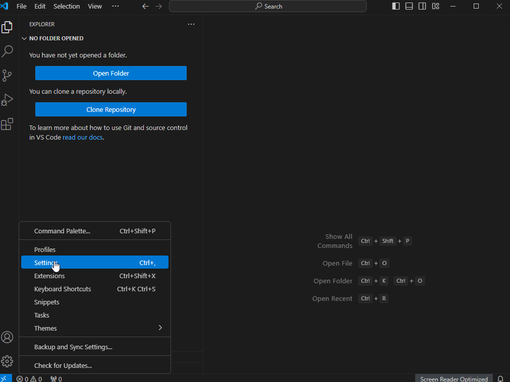
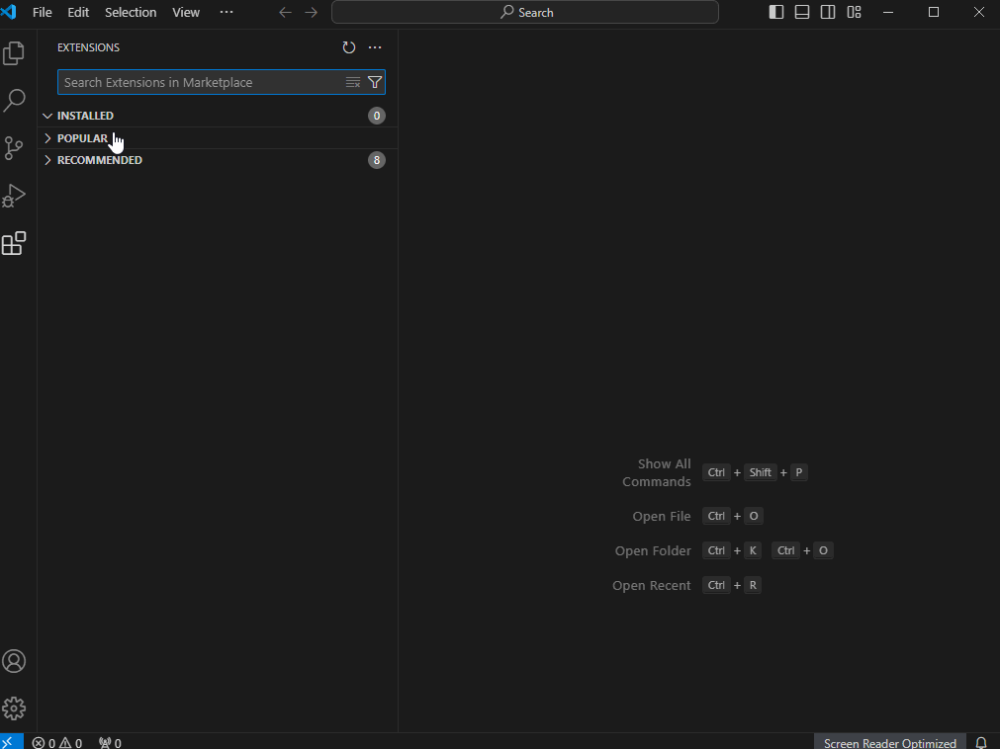
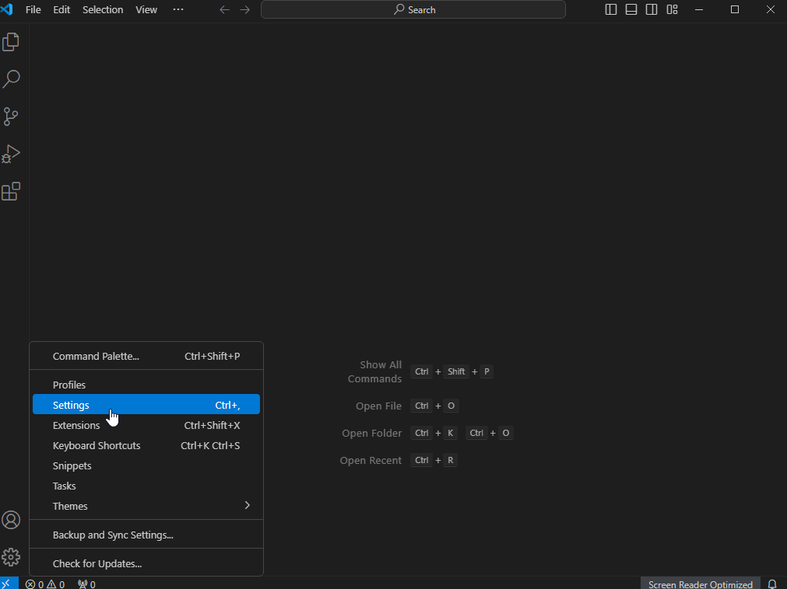
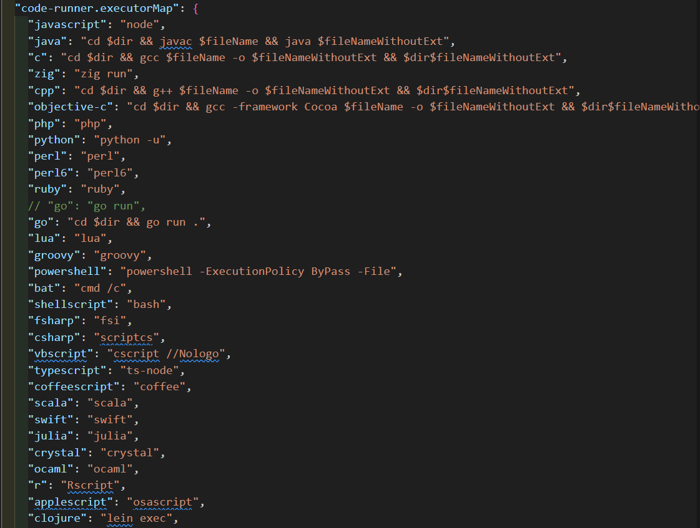

VS Code 的全称是 Visual Studio Code，是一款开源的、免费的、跨平台的、高性能的、轻量级的代码编辑器。它在性能、语言支持、开源社区方面，都做得很不错。

<!-- more -->

<h2 id="c-1-0" class="mh1">一、软件安装</h2>

> 软件下载请点击 [Visual Studio Code](https://code.visualstudio.com/Download)，软件安装较为基础且简单，基本就是下一步，唯一要注意的地方，*安装路径尽量自定义，建议不要把应用放在系统盘*。
>
> 

<h2 id="c-2-0" class="mh1">二、代理配置</h2>

> 代理设置分为两种，一种是通过 `settings.json` 文件配置，一种是通过终端配置。

### 1. settings.json 文件配置

```json
"http.proxy": "http://127.0.0.1:1080",
"http.proxyStrictSSL": false,
"https.proxy": "http://127.0.0.1:1080",
"https.proxyStrictSSL": false
```



### 2. 终端配置

- **设置代理**

  ```
  //http || https
  git config --global http.proxy 127.0.0.1:7890
  git config --global https.proxy 127.0.0.1:7890
  
  //sock5代理
  git config --global http.proxy socks5 127.0.0.1:7891
  git config --global https.proxy socks5 127.0.0.1:7891
  ```

- **查看代理**

  ```
  git config --global --get http.proxy
  git config --global --get https.proxy
  ```

- **取消代理**

  ```
  git config --global --unset http.proxy
  git config --global --unset https.proxy
  ```

<div style="text-align: right;">
    <a href="#目录" style="text-decoration: none;">Top</a>
</div>

<h2 id="c-3-0" class="mh1">三、插件配置</h2>

### 1. 安装简体中文插件示例



### 2. 推荐几个插件

| 插件名称                                                  | 描述信息                               |
| --------------------------------------------------------- | -------------------------------------- |
| Chinese (Simplified) Language Pack for Visual Studio Code | 中文语言包                             |
| Comment Translate                                         | 翻译插件                               |
| GitLens、Git History                                      | Git 插件                               |
| Todo Tree                                                 | 管理项目中的 TODO 注释和其他标记       |
| vscode-pets                                               | 萌宠插件                               |
| Tabnine (AI Code Completion)                              | AI 代码补全                            |
| CodeGeeX                                                  | 解释代码、生成注释、联网搜索、文件提问 |
| Markdown All in One                                       | md 文档编辑                            |
| Power Mode                                                | 酷炫打字                               |


### 3. 插件导出与导入

- **导出**
  

- **导入**
  

<div style="text-align: right;">
    <a href="#目录" style="text-decoration: none;">Top</a>
</div>

<h2 id="c-4-0" class="mh1">四、容器化开发</h2>

### 1. wsl 安装
>
> > 打开微软商店（Microsoft Store），搜索 Windows Terminal，免费下载
> >
> > 打开 Windows Terminal，输入 wsl --install，此命令将启用运行 WSL 并安装 Linux 的 Ubuntu 发行版所需的功能
> >
> > wsl --list --online，查看可用发行版列表并运行 wsl --install -d <DistroName> 以安装一个发行版
> >
> > wsl -l -v，查看正在运行的版本
> >
> > wsl --set-version <distro name> 2 命令将 <distro name> 替换为要更新的 Linux 发行版的名称。例如，wsl --set-version Ubuntu-20.04 2 会将 Ubuntu 20.04 发行版设置为使用 WSL 2。

### 2. docker 安装，基本就是下一步，不再赘述
>
> docker engine 配置参考
>
> ```
> {
>     "builder": {
>         "gc": {
>             "defaultKeepStorage": "120GB",
>             "enabled": true
>         }
>     },
>     "debug": false,
>     "experimental": false,
>     "features": {
>         "buildkit": true
>     },
>     "insecure-registries": [],
>     "registry-mirrors": [
>         "http://hub-mirror.c.163.com",
>         "https://docker.mirrors.ustc.edu.cn"
>     ]
> }
> ```

### 3. Docker 容器启动
>
> 下载启动镜像，一般为 Centos 系统镜像，可以使用 `docker pull centos:7.6` 下载镜像，安装开发环境，自定义封装镜像；也可以使用 `docker pull dingms/ucas-bdms-hw-u64-2019` 下载已经配置好开发环境的镜像。
>
> 启动容器，`docker run -it --name ucas-bdms-hw-u64-2019 dingms/ucas-bdms-hw-u64-2019 /bin/bash(sh)`，启动后输入 `Exit` 退出容器

### 4. Visual Studio Code `Remote Development`、`Dev Containers`、`Remote - SSH` 插件安装

### 5. 在 Docker 客户端打开容器，在 Visual Studio Code 中 Dev Containers -> Open Folder in Container -> 选择容器启动的路径，即可在 VsCode 中进行开发，开发环境与容器一致

<div style="text-align: right;">
    <a href="#目录" style="text-decoration: none;">Top</a>
</div>

<h2 id="c-5-0" class="mh1">五、Golang 安装</h2>

[安装参考文档](https://feng6917.github.io/go-install)

<h2 id="c-6-0" class="mh1">六、代码格式化</h2>

### 1. 安装 Clang-Format 插件 `apt install clang-format`

### 2. 在项目的根目录下（或者项目的任意上级目录下）新建一个 .clang-format 或 _clang-format 文件

配置内容可以参考官网：<https://clang.llvm.org/docs/ClangFormatStyleOptions.html>

除此之外无需其它配置，格式化代码即会根据该 clang-format 文件内容来格式化代码。

### 3. 设置全局配置

```
// 自动保存
"files.autoSave": "onFocusChange",
// proto3 格式化
"[proto3]": {
    "editor.defaultFormatter": "xaver.clang-format"
}
```

### 4. .clang-format Proto 文件格式化参考

```
Language: Proto
IndentWidth:     4
ColumnLimit: 1000
AlignTrailingComments:  true
PenaltyBreakComment:    1000
ReflowComments: true
AlignConsecutiveAssignments: true
```

<h2 id="c-7-0" class="mh1">七、断点调试</h2>

### 0. launch.json 微调整

```
{
    "name": "Launch Package",
    "type": "go",
    "request": "launch",
    "mode": "auto",
    "program": "${fileDirname}",
    "cwd": "${workspaceFolder}",
    "env": {},
    "args": []
}
```

### 1. `F5` 启动调试

### 2. `F5` 继续执行

### 3. `F10` 单步执行

### 4. `F11` 进入函数

### 5. 操作示例


#### 右上角运行插件使用

- 1. 安装 Code Runner 插件
- 2. 运行配置文件编辑
  

<h2 id="c-8-0" class="mh1">八、参考资源</h2>

- [如何使用 WSL 在 Windows 上安装 Linux](https://learn.microsoft.com/zh-cn/windows/wsl/install)

- [Docker Install](https://www.runoob.com/docker/windows-docker-install.html)

- [dingms 镜像](https://hub.docker.com/r/dingms/ucas-bdms-hw-u64-2019)

- [WSL 2.0 Install](https://blog.csdn.net/hjb2722404/article/details/120738062)

- [VsCode Install](https://www.runoob.com/w3cnote/vscode-tutorial.html)

- [Docker 使用容器来创建镜像](https://www.runoob.com/w3cnote/)

<hr aria-hidden="true" style=" border: 0; height: 2px; background: linear-gradient(90deg, transparent, #1bb75c, transparent); margin: 2rem 0; " />

<!-- 目录容器 -->
<div class="mi1">
    <strong>目录</strong>
        <ul style="margin: 10px 0; padding-left: 20px; list-style-type: none;">
            <li style="list-style-type: none;"><a href="#c-1-0">一、软件安装</a></li>
            <ul style="padding-left: 15px; list-style-type: none;"></ul>
            <li style="list-style-type: none;"><a href="#c-2-0">二、代理配置</a></li>
            <ul style="padding-left: 15px; list-style-type: none;"></ul>
            <li style="list-style-type: none;"><a href="#c-3-0">三、插件配置</a></li>
            <ul style="padding-left: 15px; list-style-type: none;"></ul>
            <li style="list-style-type: none;"><a href="#c-4-0">四、容器化开发</a></li>
            <ul style="padding-left: 15px; list-style-type: none;"></ul>
            <li style="list-style-type: none;"><a href="#c-5-0">五、Golang 安装</a></li>
            <ul style="padding-left: 15px; list-style-type: none;"></ul>
            <li style="list-style-type: none;"><a href="#c-6-0">六、代码格式化</a></li>
            <ul style="padding-left: 15px; list-style-type: none;"></ul>
            <li style="list-style-type: none;"><a href="#c-7-0">七、断点调试</a></li>
            <ul style="padding-left: 15px; list-style-type: none;"></ul>
            <li style="list-style-type: none;"><a href="#c-8-0">八、参考资源</a></li>
            <ul style="padding-left: 15px; list-style-type: none;"></ul>
        </ul>
</div>

<style>
    /* 一级段落 */
    .mh1 {
      text-align: center;
      color: black;
      background: linear-gradient(#fff 60%, #b2e311ff 40%);
      margin: 1.4em 0 1.1em;
      font-size: 1.4em;
      font-family: 'roboto', 'Iowan Old Style', 'Ovo', 'Hoefler Text', Georgia, 'Times New Roman', 'TIBch', 'Source Han Sans', 'PingFangSC-Regular', 'Hiragino Sans GB', 'STHeiti', 'Microsoft Yahei', 'Droid Sans Fallback', 'WenQuanYi Micro Hei', sans-serif;
      line-height: 1.7;
      letter-spacing: .33px;
    }
    /* 二级段落 */

    .mh2 {
      -webkit-text-size-adjust: 100%; letter-spacing: .33px; font-family: 'roboto', 'Iowan Old Style', 'Ovo', 'Hoefler Text', Georgia, 'Times New Roman', 'TIBch', 'Source Han Sans', 'PingFangSC-Regular', 'Hiragino Sans GB', 'STHeiti', 'Microsoft Yahei', 'Droid Sans Fallback', 'WenQuanYi Micro Hei', sans-serif; line-height: 1.7; color: #1cc03cff; border-left: 4px solid #1bb75cff; padding-left: 6px; margin: 1.4em 0 1.1em;
    }

    /* 目录 高度、宽度 可自行调整*/
    .mi1 {
      position: fixed; bottom: 240px; right: 10px; width: 240px; height: 210px; background: #f8f9fa; border: 1px solid #e9ecef; border-radius: 8px; padding: 15px; overflow-y: auto; font-family: 'roboto', 'Iowan Old Style', 'Ovo', 'Hoefler Text', Georgia, 'Times New Roman', 'TIBch', 'Source Han Sans', 'PingFangSC-Regular', 'Hiragino Sans GB', 'STHeiti', 'Microsoft Yahei', 'Droid Sans Fallback', 'WenQuanYi Micro Hei', sans-serif; font-size: 14px; line-height: 1.15; color: #444; letter-spacing: 0.33px; transition: all 0.3s ease;
    }

</style>

本技术手册将持续更新，欢迎提交Issue和Pull Request
