工欲善其事必先利其器，好的软件让我们工作起来事半功倍。

<!-more -->

<h2 id="c-1-1" class="mh2">Edraw Max v9.0</h2>

1. 下载安装包

    
2. 解压压缩包

    
3. 安装

     
     
     
     
     
     
     
     

4. 补丁

     
     
     
5. 打开即可

     

---

<h2 id="c-1-2" class="mh2">HEU KMS V30.1.0</h2>

1. 下载压缩包

    
2. 解压压缩包

    
3. 安装

     
     
     
     
     

4 效果

    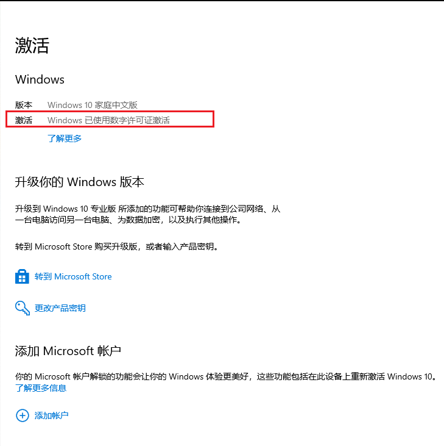

---

<h2 id="c-1-3" class="mh2">Navicat</h2>
<h2 id="c-1-4" class="mh3">Navicat 15.0</h2>

1. 下载压缩包

    
2. 解压压缩包

    
3. 安装 Navicat

    
    
    

    ```
      不建议安装在C盘，路径可自行调整，后续 Patch 时会用到
    ```

    
    
    
    
    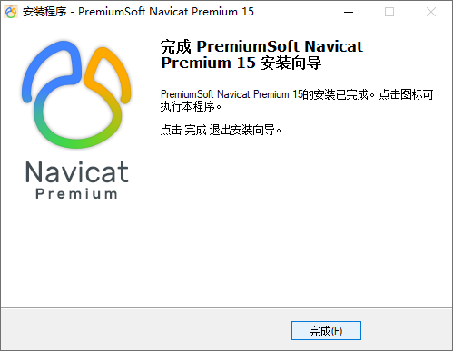

4. 断网

     

5. 安装

    

    安装 Key Patch 破解软件

    ```
    注意事项
    
    1. Patch 时 需要选择自定义安装路径中的Navicat.exe
    2. 不能够Patch 得到 Cracked时，卸载重装Navicat
    3. 密钥、请求码、激活码 在Navicat、Keygen 之间不能自动复制时，需要手动复制
    ```

    
    
    
    
    
    
    
    
    
6. 效果

    

<h2 id="c-1-5" class="mh3">Navicat 16.1</h2>

1. 下载压缩包

    
2. 解压压缩包

    
3. 预安装 Navicat

    
    
    
    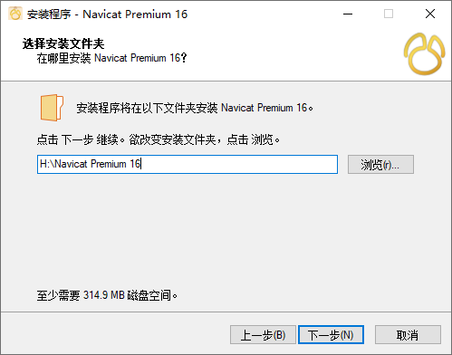

    ```
    不建议安装在C盘，路径可自行调整，后续 Patch 时会用到
    ```

    
    
    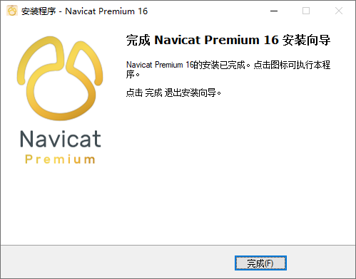

4. 断网

    

5. 安装
    

    安装 Key Patch 破解软件

    ```
    注意事项
    
    1. Patch 时 需要选择自定义安装路径中的Navicat.exe
    2. 不能够Patch 得到 Cracked时，卸载重装Navicat
    3. 密钥、请求码、激活码 在Navicat、Keygen 之间不能自动复制时，需要手动复制
    ```

    
    
    
    
    
    
    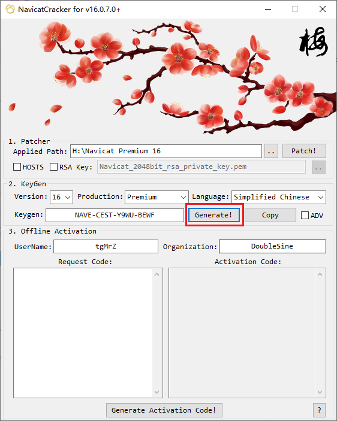
    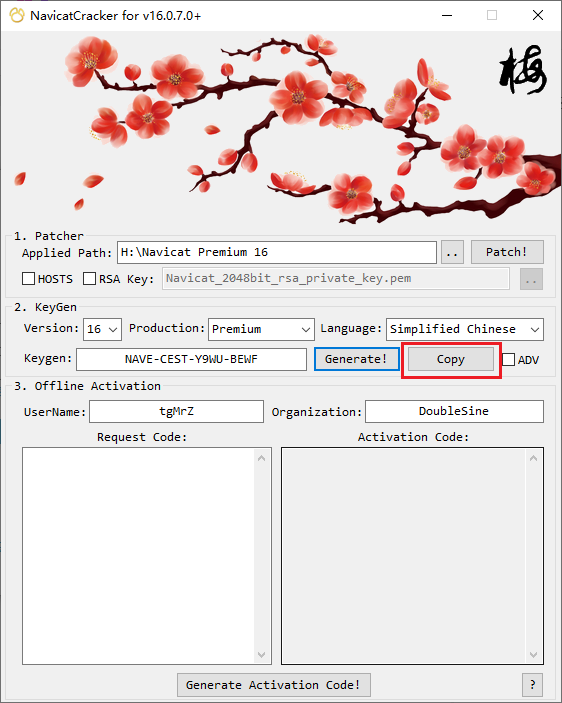
    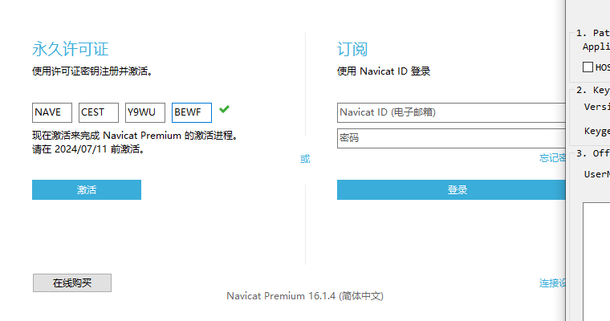
    
    
    
    
    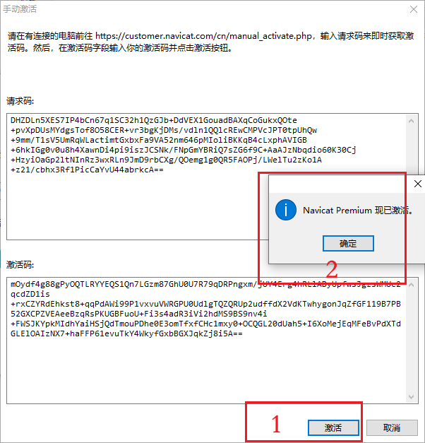
    

6. 效果

    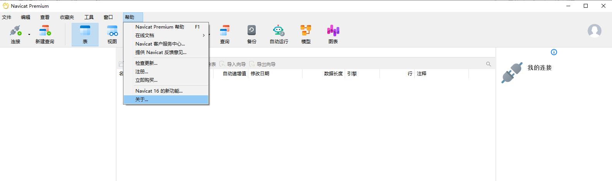
    

---

<h2 id="c-1-6" class="mh3">Navicat 16.3</h2>

1. 下载压缩包

    
2. 解压压缩包

    
3. 执行绿化脚本

     
     

4. 效果

     
     
     

---

<h2 id="c-1-7" class="mh2">Office 2016</h2>

1. 下载压缩包

     
2. 解压压缩包

     
3. 预安装

     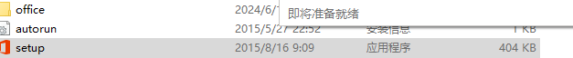
     
     
4. 安装

     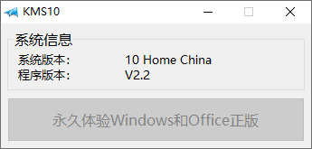
5. 效果

     

---
<h2 id="c-1-8" class="mh2">PhotoShop 2021</h2>

1. 下载压缩包

    
2. 解压压缩包

    
3. 安装

     
     
     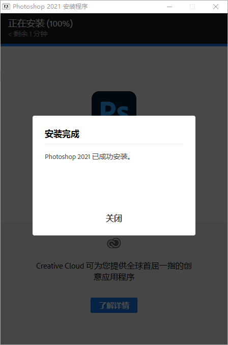

4. 效果

    

---
<h2 id="c-1-9" class="mh2">TablePlus 4.10.8</h2>

1. 下载压缩包

    
2. 解压压缩包

    
3. 预安装

    
    
    
    
    
4. 清理本地TablePlus hosts映射

    

5. 预安装

    
    
    
    
6. 效果

    

---

<h2 id="c-1-10" class="mh2">TablePlus 5.3.3</h2>

1. 下载压缩包

    
2. 解压压缩包

    
3. 预安装

     
     
     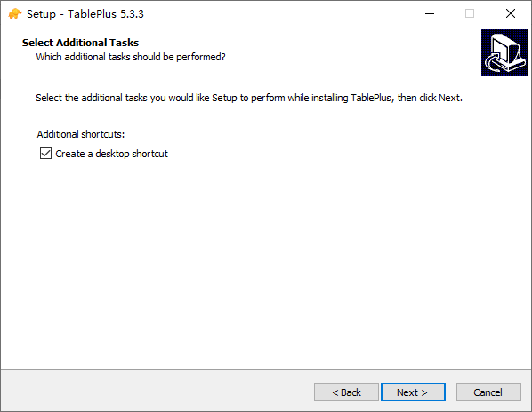
     
     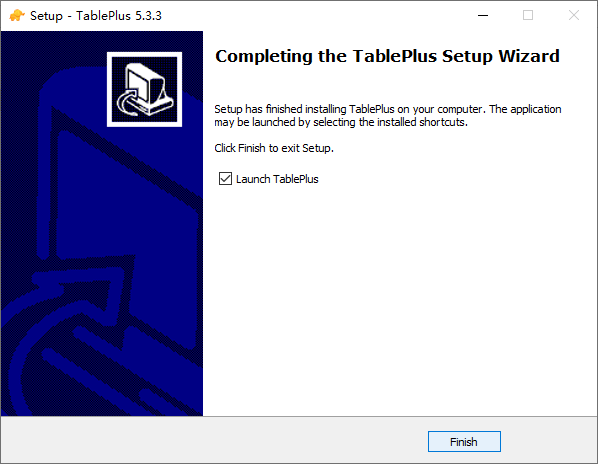
4. 清理本地TablePlus hosts映射

     

5. 安装

    
    
    
6. 效果

    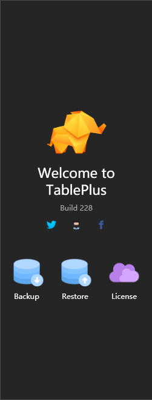

---

<h2 id="c-1-11" class="mh2">Typora</h2>

1. 下载压缩包

    
2. 解压压缩包

    
3. 安装

    
6. 效果

    

---

<h2 id="c-1-12" class="mh2">IDM 下载器（激活）</h2>

> 激活方法来自github上一个开源项目，项目名是：IDM-Activation-Script。

1. 下载 IDM [Internet Download Manager](https://www.internetdownloadmanager.com/)

2. 以管理员身份运行 PowerShell，运行以下命令

   ```shell
   irm https://massgrave.dev/ias | iex
   ```

3. 根据命令操作，脚本自动执行，执行过程中会下载几张临时图片，当窗口出现 The IDM Activation process has been completed. 时 说明激活成功

    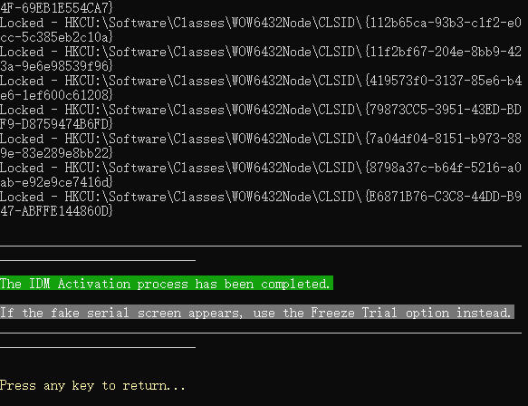

4. 打开 internet Download Manager，点击 注册，可以看到本软件已注册

    

5. 扩展：安装IDM时 会自动安装 Chrome 插件，在扩展程序中打开即可使用
    

<hr style="background-color: blue;border: none;height: 15px;width: 100%" />

<h2 id="c-2-1" class="mh2">CleanMyMac X 4.10.6</h2>

> CleanMyMac X是一款专业的Mac清理软件，可智能清理mac磁盘垃圾和多余语言安装包，快速释放电脑内存，轻松管理和升级Mac上的应用。同时CleanMyMac X可以强力卸载恶意软件，修复系统漏洞，一键扫描和优化Mac系统，让您的电脑焕然一新！

1. 下载压缩包

    
2. 解压压缩包

    
3. 安装&破解

    
    
    

4 效果
    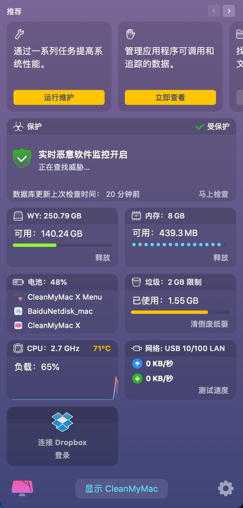

<h2 id="c-2-2" class="mh2">IINA 1.2.0</h2>

> IINA 是一款专门针对 macOS 系统设计的现代媒体播放器。它为用户提供了调整回放设置的能力，并提供在 Intel 和 M1-based Mac 上本地运行的通用二进制文件。

1. 下载压缩包

    
2. 解压压缩包

    
3. 安装&破解

    
    
    
    

4. 效果

    

<h2 id="c-2-3" class="mh2">Navicat 16.3.6</h2>

1. 下载压缩包

    
2. 解压压缩包

    
3. 安装&破解

    

4. 效果

    

<h2 id="c-2-4" class="mh2">Office 16.53</h2>

1. 下载压缩包

    
2. 解压压缩包

    
3. 安装Office

    
    
    
    
    
    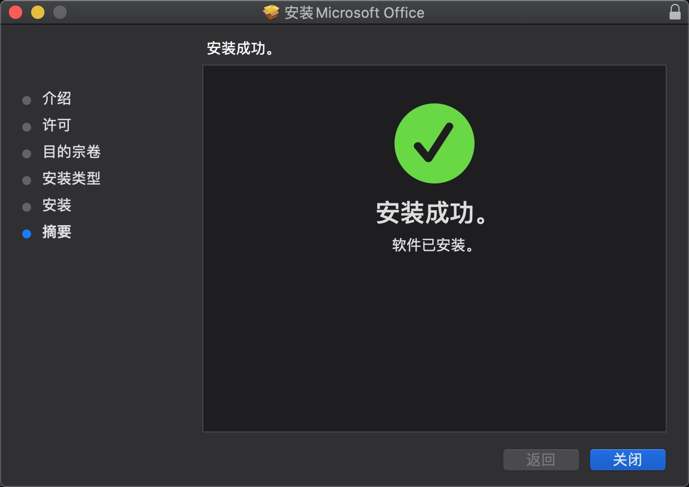

4. 效果

    

5. 可根据需要安装Word|Excel,安装位置可自定义,步骤同上。

<h2 id="c-2-5" class="mh2">Photoshop CC 2019</h2>

1. 下载压缩包

    
2. 解压压缩包

    
3. 安装&破解

    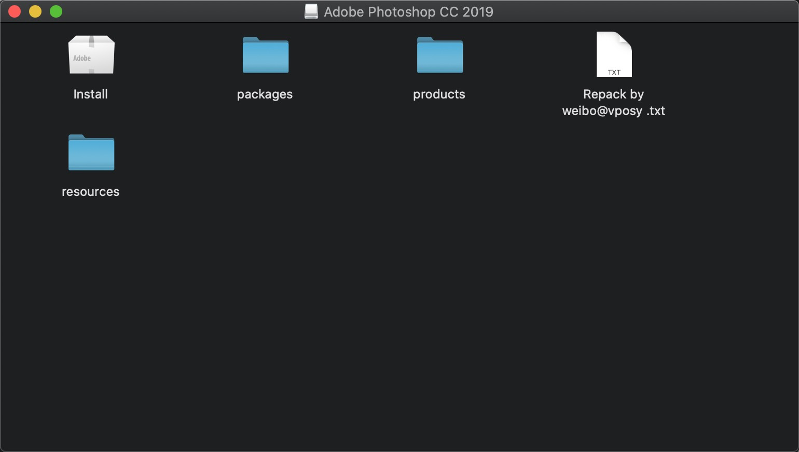
    
    
    
    

<h2 id="c-2-6" class="mh2">TablePlus 3.11</h2>

1. 下载压缩包

    
2. 解压压缩包

    
3. 安装&破解

    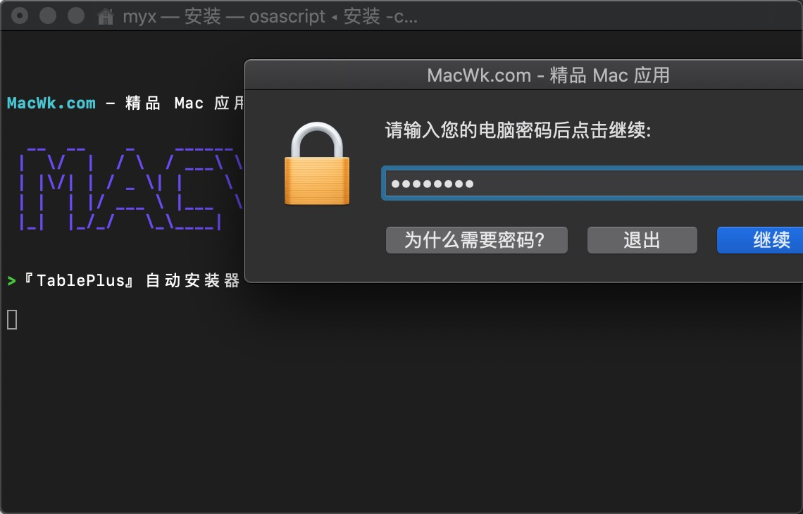
    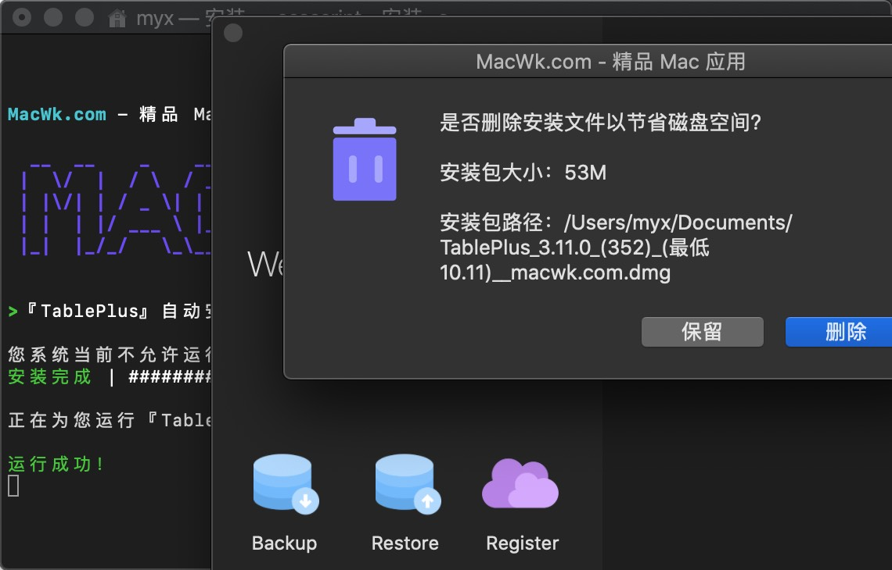

4. 效果

    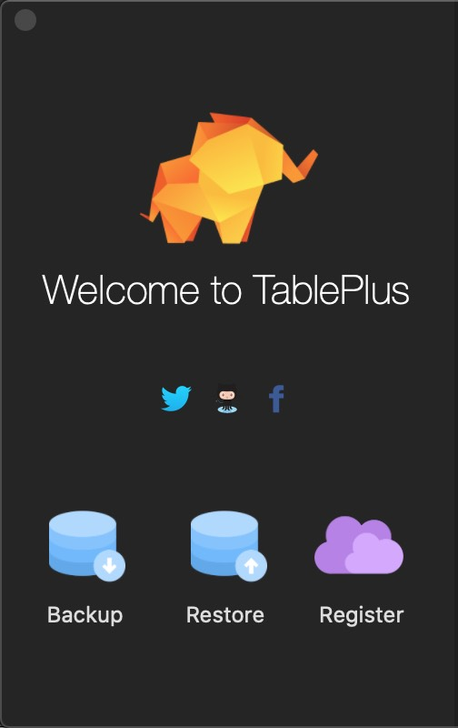

<h2 id="c-2-7" class="mh2">Typora 1.8.10</h2>

1. 下载压缩包

    
2. 解压压缩包

    
3. 安装&破解

    
    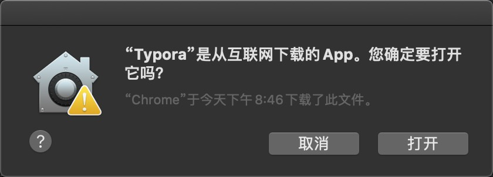

4. 效果

    

<div class="mi1">
    <strong>目录</strong>
      <ul style="margin: 10px 0; padding-left: 20px; list-style-type: none;">
        <li style="list-style-type: none;"><a href="#c-1-1">Windows</a></li>
            <ul style="padding-left: 15px; list-style-type: none;">
              <li style="list-style-type: none;"><a href="#c-1-1">绘图工具</a></li>
                <ul style="padding-left: 15px; list-style-type: none;">
                <li style="list-style-type: none;"><a href="https://app.diagrams.net/">draw.io(在线)</a></li>
                <li style="list-style-type: none;"><a href="https://excalidraw.com/">Excalidraw(在线)</a></li>
                <li style="list-style-type: none;"><a href="#c-1-1">Edraw Max v9.0 激活版</a></li>
                </ul>
              <li style="list-style-type: none;"><a href="#c-1-3">数据库管理工具</a></li>
                <ul style="padding-left: 15px; list-style-type: none;">
                <li style="list-style-type: none;"><a href="#c-1-4">Navicat 15.0</a></li>
                <li style="list-style-type: none;"><a href="#c-1-5">Navicat 16.1</a></li>
                <li style="list-style-type: none;"><a href="#c-1-6">Navicat 16.3</a></li>
                <li style="list-style-type: none;"><a href="#c-1-9">TablePlus 4.10.8</a></li>
                <li style="list-style-type: none;"><a href="#c-1-10">TablePlus 5.3.3</a></li>
                </ul>  
              <li style="list-style-type: none;"><a href="#c-1-8">图文音视频工具</a></li>
                <ul style="padding-left: 15px; list-style-type: none;">
                <li style="list-style-type: none;"><a title="OBS Studio 是一款免费且开源的视频录制和直播软件。" href="https://obsproject.com/download">OBS Studio(视频录制)</a></li>
                <li style="list-style-type: none;"><a title="PotPlayer播放器是一款免费全能多媒体影音播放器,堪称Windows平台最强大的本地视频播放器." href="https://potplayer.tv/">PotPlayer(视频播放)</a></li>
                <li style="list-style-type: none;"><a title="LICEcap是一款开源的跨平台GIF动画录制工具，允许用户捕捉计算机屏幕上的活动并将其保存为GIF图像。" href="https://www.cockos.com/licecap/">Lice Cap(Gif录制)</a></li>
                <li style="list-style-type: none;"><a title="WavePad Audio Editor 是一款完美的音频和音乐编辑程序，用于快速编辑音频和音乐文件。" href="https://www.nch.com.au/wavepad/download-now.html">Wave Pad(音频剪辑)</a></li>
                <li style="list-style-type: none;"><a title="Adobe Photoshop 是一款由 Adobe Systems 开发的专业图像编辑和设计软件，广泛应用于平面设计、图像处理、照片编辑等领域。" href="#c-1-8">PhotoShop 2021(破解版)</a></li>
                <li style="list-style-type: none;"><a href="https://www.snipaste.com/">Snipaste(截屏贴图)</a></li>
                <li style="list-style-type: none;"><a href="#c-1-11">Typora(绿色版)</a></li>
                <li style="list-style-type: none;"><a href="#c-1-7">Office 2016(激活版)</a></li>
                <li style="list-style-type: none;"><a title="一键自动化 下载、安装、激活 Office 的利器。绿色、开源、安全、无毒。" href="https://github.com/OdysseusYuan/LKY_OfficeTools">LKY_OfficeTools</a></li>
                </ul>
              <li style="list-style-type: none;"><a href="#c-1-2">其他</a></li>
                <ul style="padding-left: 15px; list-style-type: none;">
                <li style="list-style-type: none;"><a href="#c-1-2">HEU KMS V30.1.0(激活工具)</a></li>
                <li style="list-style-type: none;"><a title="Internet Download Manager（IDM）是一款专业的下载管理器，可以加速下载、断点续传、批量下载等。" href="#c-1-12">Internet Download Manager(激活版)</a></li>
                <li style="list-style-type: none;"><a title="Everything 是一款免费的文件搜索工具，支持快速搜索文件和文件夹，支持正则表达式、通配符等搜索方式。" href="https://www.voidtools.com/">Everything(文件搜索)</a></li>
                <a title="NoMeiryoUI是Windows 8.1 / 10 / 11上的Windows系统字体设置工具。除了对系统所有字体进行变更，还可以针对不同的系统组件进行字体单独变更，如图标字体、菜单栏字体等。支持日语，韩语，中文，英文等。" href="https://github.com/Tatsu-syo/noMeiryoUI/releases">NoMeiryoUI(字体设置)</a>
                <li style="list-style-type: none;"><a title="v2rayN是Windows系统下的代理软件客户端，功能强大且支持多种代理协议，如VMess、VLESS、Trojan、Socks、Shadowsocks、Hysteria2、Tuic等代理协议。" href="https://github.com/2dust/v2rayN">V2rayN(代理)</a>
                </ul>
            </ul>
         <li style="list-style-type: none;"><a href="#c-3-0">Mac</a></li>
            <ul style="padding-left: 15px; list-style-type: none;">
              <li style="list-style-type: none;"><a href="#c-2-1">CleanMyMac X 4.10.6</a></li>
              <ul style="padding-left: 15px; list-style-type: none;"></ul>
              <li style="list-style-type: none;"><a href="#c-2-2">IINA 1.2.0</a></li>
              <ul style="padding-left: 15px; list-style-type: none;"> </ul>
              <li style="list-style-type: none;"><a href="#c-2-3">Navicat 16.3.6</a></li>
              <ul style="padding-left: 15px; list-style-type: none;"> </ul>
              <li style="list-style-type: none;"><a href="#c-2-4">Office 16.53</a></li>
              <ul style="padding-left: 15px; list-style-type: none;"> </ul>
              <li style="list-style-type: none;"><a href="#c-2-5">Photoshop CC 2019</a></li>
              <ul style="padding-left: 15px; list-style-type: none;"> </ul>
              <li style="list-style-type: none;"><a href="#c-2-6">TablePlus 3.11</a></li>
              <ul style="padding-left: 15px; list-style-type: none;"> </ul>
              <li style="list-style-type: none;"><a href="#c-2-7">Typora 1.8.10</a></li>
              <ul style="padding-left: 15px; list-style-type: none;"> </ul>
            </ul>
      </ul>
</div>

<style>
    /* 一级段落 */
    .mh1 {
    text-align: center;
    color: black;
    background: linear-gradient(#fff 60%, #b2e311ff 40%);
    margin: 1.4em 0 1.1em;
    font-size: 1.4em;
    font-family: 'roboto', 'Iowan Old Style', 'Ovo', 'Hoefler Text', Georgia, 'Times New Roman', 'TIBch', 'Source Han Sans', 'PingFangSC-Regular', 'Hiragino Sans GB', 'STHeiti', 'Microsoft Yahei', 'Droid Sans Fallback', 'WenQuanYi Micro Hei', sans-serif;
    line-height: 1.7;
    letter-spacing: .33px;
    }
    /* 二级段落 */

    .mh2 {
    -webkit-text-size-adjust: 100%; letter-spacing: .33px; font-family: 'roboto', 'Iowan Old Style', 'Ovo', 'Hoefler Text', Georgia, 'Times New Roman', 'TIBch', 'Source Han Sans', 'PingFangSC-Regular', 'Hiragino Sans GB', 'STHeiti', 'Microsoft Yahei', 'Droid Sans Fallback', 'WenQuanYi Micro Hei', sans-serif; line-height: 1.7; color: #1cc03cff; border-left: 4px solid #1bb75cff; padding-left: 6px; margin: 1.4em 0 1.1em;
    }

    /* 三级段落 */

    .mh3 {
    -webkit-text-size-adjust: 100%;
    letter-spacing: .11px;
    font-family: 'roboto', 'Iowan Old Style', 'Ovo', 'Hoefler Text', Georgia, 'Times New Roman', 'TIBch', 'Source Han Sans', 'PingFangSC-Regular', 'Hiragino Sans GB', 'STHeiti', 'Microsoft Yahei', 'Droid Sans Fallback', 'WenQuanYi Micro Hei', sans-serif;
    line-height: 0.7;
    color: #1cc03cff;
    border-left: 2px solid #27b663ff;
    padding-left: 3px;
    margin: 0.7em 0 0.5em;
    font-size: smaller; /* 新的字体大小设置 */
    }

    /* 目录 高度、宽度 可自行调整*/
    .mi1 {
    position: fixed; bottom: 240px; right: 10px; width: 340px; height: 320px; background: #f8f9fa; border: 1px solid #e9ecef; border-radius: 8px; padding: 15px; overflow-y: auto; font-family: 'roboto', 'Iowan Old Style', 'Ovo', 'Hoefler Text', Georgia, 'Times New Roman', 'TIBch', 'Source Han Sans', 'PingFangSC-Regular', 'Hiragino Sans GB', 'STHeiti', 'Microsoft Yahei', 'Droid Sans Fallback', 'WenQuanYi Micro Hei', sans-serif; font-size: 14px; line-height: 1.15; color: #444; letter-spacing: 0.33px; transition: all 0.3s ease;
    }

</style>

本技术手册将持续更新，欢迎提交Issue和Pull Request
