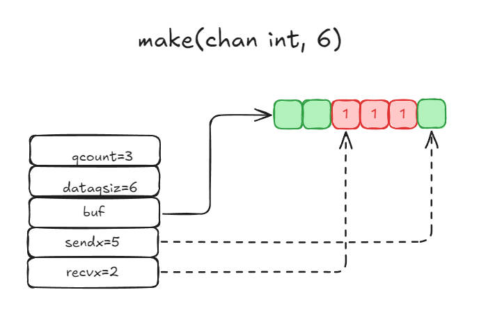

不要通过共享内存来通信，而要通过通信来共享内存

<!-- more -->

<h2 id="c-1-0" class="mh1">一、Channel</h2>

- `Channel` 是 Go 语言中的一种数据类型，用于在不同的 Goroutine 之间进行通信和同步。它是一种特殊的类型，可以用来传递数据，也可以用来传递信号。如果需要跨进程通信，建议使用分布式系统的方法来解决。

- `Channel` 可以分为两种类型：无缓冲的 `Channel` 和有缓冲的 `Channel`。
  - 无缓冲的 `Channel` 在发送和接收操作之间没有缓冲区，因此发送操作和接收操作必须同时进行，否则会阻塞。
  - 而有缓冲的 `Channel` 在发送和接收操作之间有一个缓冲区，因此发送操作和接收操作可以异步进行，只有当缓冲区满时发送操作才会阻塞，只有当缓冲区空时接收操作才会阻塞。

- 如何理解不要通过共享内存来通信，而要通过通信来共享内存？
  - 在 Go 语言中，通过共享内存来通信是一种并发编程的方式，它允许不同的 Goroutine 之间共享数据。然而，这种方式可能会导致数据竞争和死锁等问题，因此 Go 语言推荐使用 `Channel` 来进行通信，而不是共享内存。
  - 前后两个通信的概念不同
    - 内存能够被多个线程读到，修改内存数据，即可达到通过内存达到通信的目的。
    - 在go中，一个内存由一个线程来负责，另外一个线程要操作这块内存，需要当前线程让渡所有权，这个所有权的让渡过程是"通信"。

<h2 id="c-2-0" class="mh1">二、基础结构</h2>

```
    type hchan struct {
        qcount   uint           // 队列中存储的总数据量，当前队列中剩余元素个数。
        dataqsiz uint           // 环形队列的大小，即循环队列中可以存储的最大元素个数。
        buf      unsafe.Pointer // 环形队列指针，指向存放数据的内存区域。
        elemsize uint16         // 元素大小
        closed   uint32         // Channel 是否关闭
        elemtype *_type         // 元素类型
                                // send/recv 可以看作针对这个队列操作，向这个队列Send(发送)消息，即写消息；从这个队列Recv(接受)消息，即读消息。
        sendx    uint           // 队列下标，指元素写入时放到队列中的位置
        recvx    uint           // 队列下标，指元素从队列的哪个位置读出
        recvq    waitq          // 等待读消息的goroutine队列
        sendq    waitq          // 等待写消息的goroutine队列
        lock mutex              // 互斥锁，不允许并发读写
    }
```

### 2.1 环形队列(buf)

> chan 内部实现了一个环形队列作为其缓冲区，队列的长度是创建时指定的。

> 下图展示了一个可缓冲6个元素的channel，类型为int的示意图:
    

    - qcount: 表示队列中还有3个元素；
    - dataqsiz: 表示队列能容纳6个元素；
    - buf 环形队列的指针，指向队列的内存，这里队列还剩下3个int类型的元素；
    - sendx: 表示队列下一个写入的位置，这里是队列的索引5；
    - recvx: 表示队列下一个读取的位置，这里是队列的索引2。

### 2.2 等待队列

- 阻塞：
  - 从channel读数据，如果channel缓冲区为空或者没有缓冲区
  - 向channel写数据，如果channel缓冲区已满或者没有缓冲区

- 被阻塞的goroutine将会被挂在channel的等待队列中：
  - 因**读**阻塞的goroutine会被挂在**recvq**队列中；会被向channel**写**数据的goroutine唤醒。
  - 因**写**阻塞的goroutine会被挂在**sendq**队列中；会被从channel**读**数据的goroutine唤醒。

> 下图展示了一个没有缓冲区的channel,有几个goroutine阻塞等待读数据。
    

注意，一般情况下recvq和sendq至少有一个为空。只有一个例外，那就是同一个goroutine使用select语句向channel一边写数据，一边读数据。

### 2.3 类型信息

一个channel 只能传递一种类型的值，类型信息存储在hchan结构体中的elemtype字段。

- elemtype *_type // 元素类型, 用于数据传递过程中的赋值
- elemsize uint16 // 元素大小, 内存对齐, 用于buf中定位元素位置

### 2.4 锁

一个channel同时仅允许被一个goroutine读写，为了保证这个特性，channel内部实现了一个互斥锁，对channel的读写操作均需要先获取这个锁。

<h2 id="c-3-0" class="mh1">三、Channel 读写</h2>

### 3.1 创建 channel

创建channel 的过程实际上是初始化hchan结构体的过程，底层会根据传入的参数初始化hchan结构体中的各个字段。

其中类型信息和缓冲区长度由make语句传入，buf的大小则与元素大小和缓冲区长度共同决定。

创建channel的伪代码如下所示：

```
func makechan(t *chantype, size int) *hchan{
    var c *hchan
    c = new(hchan)
    c.buf = malloc(元素类型大小*size)
    c.elemsize = uint16(元素类型大小)
    c.elemtype = 元素类型
    c.dataqsiz = uint(size)
    return c
}
```

### 3.2 向channel 写数据

向channel写数据时，会先根据channel的类型检查写入数据的类型是否正确，不正确会panic。

如果等待接收队列recvq不为空，说明缓冲区中没有数据或者没有缓冲区，此时直接从receq取出G，并把数据写入，最后把该G唤醒，结束发送过程。

如果缓冲区有空余位置，将数据写入缓冲区，结束发送进程。

如果缓冲区没有空余位置，将发送数据写入G，将当前G加入sendq，进入睡眠，等待被读groutine唤醒。

### 3.3 从channel 读数据

从channel读数据时，会先根据channel的类型检查读取数据的类型是否正确，不正确会panic。

1. 如果等待发送队列sendq不为空，且没有缓冲区，直接从sendq中取出G，把G中数据读出，最后把G唤醒，结束读取过程。
2. 如果等待发送队列sendq不为空，此时说明缓冲区已满，从缓冲区中首部读出数据，把G中数据写入缓冲区尾部，把G唤醒，结束读取过程。
3. 如果缓冲区中有数据，则从缓冲区取出数据，结束读取过程。
4. 将当前goroutine加入recv1，进入睡眠，等待被写goroutine唤醒。

### 3.4 关闭channel

关闭channel时会把receq中的G全部唤醒，本该写入G的数据位置为nil。把sendq中的G全部唤醒，但这些G会panic。

除此之外，panic 出现的常见场景还有:

1. 关闭值为nil的channel
2. 关闭已经被关闭的channel
3. 向已经关闭的channel写数据

<h2 id="c-4-0" class="mh1">四、Channel 常见用法</h2>

### 4.1 单向 channel

顾名思义，单向channel指只能用于发送或接收数据，实际上也没有单向channel.

我们知道channel可以通过参数传递，所谓单向channel 只是对channel的一种使用限制，这跟C语言使用const修饰函数为只读是一个道理。

- func readChan(chanName <-chan int): 通过形参限定函数内部只能从channel中读取数据。
- func writeChan(chanName chan<- int): 通过形参限定函数内部只能向channel中写入数据。

一个简单的示例如下：

```
func readChan(ch <-chan int) {
    for {
        if data, ok := <-ch; ok {
            fmt.Println(data)
        } else {
            break
        }
    }
}

func writeChan(ch chan<- int) {
    for i := 0; i < 10; i++ {
        ch <- i
    }
    close(ch)
}

func main() {
    ch := make(chan int, 10)
    go writeChan(ch)
    readChan(ch)
}
```

ch 是个正常的channel, 而readeChan()形参限制了传入的channel只能用来读，writeChan()形参限制了传入的channel只能用来写。

### 4.2 select

使用select可以监控多个channel，当其中一个channel有数据时，程序会立刻执行相应的case。

select的用法如下：

``` go
package main

import(
    "fmt"
)

func main() {
    ch1 := make(chan int)
    ch2 := make(chan int)

    go func() {
        time.Sleep(time.Second)
        ch1 <- 1
    }()

    go func() {
        time.Sleep(2 * time.Second)
        ch2 <- 2
    }()

    for{
        select {
        case <-ch1:
            // 从ch1中读取数据
            fmt.Println("ch1", data)
        case data := <-ch2:
            // 从ch2中读取数据
            fmt.Println("ch2", data)
        default:
            // 当上面case都没有准备好时，执行default分支
            fmt.Println("No data ready")
        }
    }

}

```

select会一直阻塞，直到下面的case中有满足条件的分支。如果同时有多个case分支满足条件，会随机选择一个。
select的case语句读channel不会阻塞，尽管channel中没有数据。这是由于case语句编译后调用读channel时会明确传入不阻塞的参数，此时读不到数据时不会将当前goroutine加入等待队列，而是直接返回。

### 4.3 for range

使用for range可以遍历channel中的数据，当channel关闭时，遍历结束。
通过range可以持续从channel中读出数据，好像在遍历一个数组一样，当channel中没有数据时会阻塞当前goroutine，与读channel时阻塞处理机制一样。

```
func chanRange(chanName chan int){
    for data := range chanName {
        fmt.Println(data)
    }
}
```

<h2 id="c-5-0" class="mh1">五、Channel 应用</h2>

`Channel` 是 Go 语言中非常重要的一个特性，它被广泛应用于并发编程中。以下是一些常见的 `Channel` 的应用场景：

- Goroutine 之间的通信：`Channel` 可以用于 Goroutine 之间的通信，例如一个 Goroutine 可以发送数据到 `Channel`，另一个 Goroutine 可以从 `Channel` 接收数据。这种机制可以使得 Goroutine 之间可以相互协作，实现复杂的并发任务。

- Goroutine 的同步：`Channel` 还可以用于 Goroutine 的同步，例如可以使用 `Channel` 来等待多个 Goroutine 的完成。当一个 Goroutine 完成任务后，可以向 `Channel` 发送一个信号，其他 Goroutine 可以通过 `Channel` 接收这个信号，从而实现同步。

- Goroutine 的取消：`Channel` 还可以用于 Goroutine 的取消，例如可以使用 `Channel` 来通知 Goroutine 停止执行。当一个 Goroutine 需要停止执行时，可以向 `Channel` 发送一个信号，其他 Goroutine 可以通过 `Channel` 接收这个信号，从而实现取消。

  ``` go
  package main

  import (
   "fmt"
   "time"
  )
  
  func main() {
   ch := make(chan bool)
   defer close(ch)
  
   go func(ch chan bool) {
    for {
     select {
     case <-ch:
      fmt.Println("收到消息")
      break
     default:
      fmt.Println("没收到消息")
     }
    }
   }(ch)
   time.Sleep(time.Second)
   ch <- true // 发送消息
  }
  ```

<h2 id="c-10-0" class="mh1">六、参考资源</h2>

- [Go 专家编程](https://www.topgoer.cn/docs/gozhuanjia/gochan4)

<hr aria-hidden="true" style=" border: 0; height: 2px; background: linear-gradient(90deg, transparent, #1bb75c, transparent); margin: 2rem 0; " />

<!-- 目录容器 -->
<div class="mi1">
    <strong>目录</strong>
        <ul style="margin: 10px 0; padding-left: 20px; list-style-type: none;">
            <li style="list-style-type: none;"><a href="#c-1-0">一、Channel</a></li>
            <ul style="padding-left: 15px; list-style-type: none;"></ul>
            <li style="list-style-type: none;"><a href="#c-2-0">二、基础结构</a></li>
            <ul style="padding-left: 15px; list-style-type: none;"></ul>
            <li style="list-style-type: none;"><a href="#c-3-0">三、Channel 读写</a></li>
            <ul style="padding-left: 15px; list-style-type: none;"></ul>
            <li style="list-style-type: none;"><a href="#c-4-0">四、Channel 常见用法</a></li>
            <ul style="padding-left: 15px; list-style-type: none;"></ul>
            <li style="list-style-type: none;"><a href="#c-5-0">五、Channel 应用</a></li>
            <ul style="padding-left: 15px; list-style-type: none;"></ul>
            <li style="list-style-type: none;"><a href="#c-10-0">六、参考资源</a></li>
            <ul style="padding-left: 15px; list-style-type: none;"></ul>
        </ul>
</div>

<style>
    /* 一级段落 */
    .mh1 {
      text-align: center;
      color: black;
      background: linear-gradient(#fff 60%, #b2e311ff 40%);
      margin: 1.4em 0 1.1em;
      font-size: 1.4em;
      font-family: 'roboto', 'Iowan Old Style', 'Ovo', 'Hoefler Text', Georgia, 'Times New Roman', 'TIBch', 'Source Han Sans', 'PingFangSC-Regular', 'Hiragino Sans GB', 'STHeiti', 'Microsoft Yahei', 'Droid Sans Fallback', 'WenQuanYi Micro Hei', sans-serif;
      line-height: 1.7;
      letter-spacing: .33px;
    }
    /* 二级段落 */

    .mh2 {
      -webkit-text-size-adjust: 100%; letter-spacing: .33px; font-family: 'roboto', 'Iowan Old Style', 'Ovo', 'Hoefler Text', Georgia, 'Times New Roman', 'TIBch', 'Source Han Sans', 'PingFangSC-Regular', 'Hiragino Sans GB', 'STHeiti', 'Microsoft Yahei', 'Droid Sans Fallback', 'WenQuanYi Micro Hei', sans-serif; line-height: 1.7; color: #1cc03cff; border-left: 4px solid #1bb75cff; padding-left: 6px; margin: 1.4em 0 1.1em;
    }

    /* 目录 高度、宽度 可自行调整*/
    .mi1 {
      position: fixed; bottom: 240px; right: 10px; width: 240px; height: 200px; background: #f8f9fa; border: 1px solid #e9ecef; border-radius: 8px; padding: 15px; overflow-y: auto; font-family: 'roboto', 'Iowan Old Style', 'Ovo', 'Hoefler Text', Georgia, 'Times New Roman', 'TIBch', 'Source Han Sans', 'PingFangSC-Regular', 'Hiragino Sans GB', 'STHeiti', 'Microsoft Yahei', 'Droid Sans Fallback', 'WenQuanYi Micro Hei', sans-serif; font-size: 14px; line-height: 1.15; color: #444; letter-spacing: 0.33px; transition: all 0.3s ease;
    }

</style>

本技术手册将持续更新，欢迎提交Issue和Pull Request
