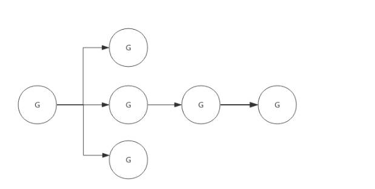
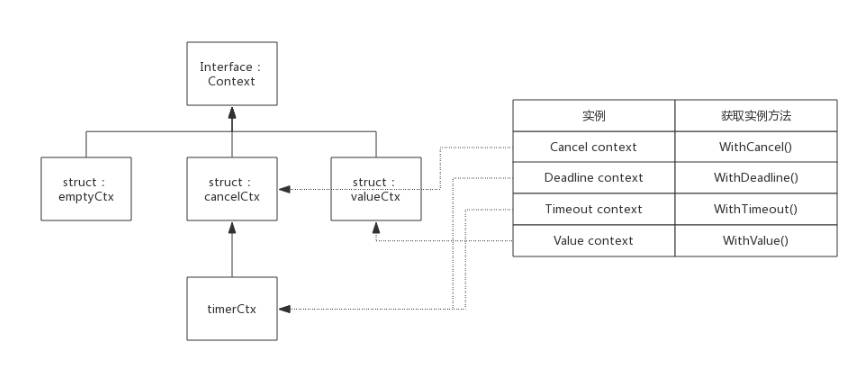

<!-- more -->

<h2 id="c-1-0" class="mh1">一、Context 是什么</h2>

Context 是 Go 语言中用于在多个函数调用之间传递请求范围的值、取消信号、截止日期的机制。它通常用于控制 goroutine 的执行和资源管理。

Context 是 Go 应用开发常用的并发控制计数，可以控制多级的goroutine。

Context 翻译成中文是“上下文”，它可以控制一组呈树状结构的goroutine，每个goroutine拥有相同的上下文，通过它可以控制每个goroutine的行为。

典型的使用场景如下：


<h2 id="c-2-0" class="mh1">二、Context 实现原理</h2>

Context实际上只定义了接口，凡是实现该接口的类型都可称为一种Context, 官方包中实现了几个常用的Context,分别可用于不同的场景。

<h2 id="c-2-1" class="mh2">2.1 基础结构</h2>

```go
type Context interface {
    Deadline() (deadline time.Time, ok bool)
    Done() <-chan struct{}
    Err() error
    Value(key interface{}) interface{}
}
```

### 1. Deadline() (deadline time.Time, ok bool) 返回一个超时时间和标识是否已设置deadline的布尔值。如果没有设置deadline，则ok为false。此时deadline为一个初始值的time.Time

### 2. Done() <-chan struct{} 返回一个只读的channel

- 当context关闭后，Done()返回一个被关闭的管道，关闭的管道仍是可读的，据此goroutine可以收到关闭请求。
- 当context未关闭时，Done返回nil。

### 3. Err()

该方法描述context关闭的原因。关闭原因由context实现控制，不需要用户设置。比如Deadline Context, 关闭原因可能因为Deadline, 也可能提前被主动关闭，那么关闭原因就不同：

- 因deadline关闭，Err()返回context.DeadlineExceeded
- 因主动调用cancel()关闭，Err()返回context.Canceled

    当context关闭后，Err()返回关闭原因。如果context未关闭，Err()返回nil。

### 4. Value()

有一种context，它不是用于控制呈树状分布的goroutine,而是用于在树状分布的goroutine间传递消息。Value()方法就是用于此种类型的context，该方法根据key值查询map中的value.

<h2 id="c-2-2" class="mh2">2.2 EmptyCtx</h2>

context 包中定义了一个空的context，名为emptyCtx,用于context的根节点，空的context只能简单的实现了Context接口，本身不包含任何值，仅用于Context的父节点。

```go
type emptyCtx int

func (*emptyCtx) Deadline() (deadline time.Time, ok bool) {
    return
}

func (*emptyCtx) Done() <-chan struct{} {
    return nil
}

func (*emptyCtx) Err() error {
    return nil
}

func (*emptyCtx) Value(key interface{}) interface{} {
    return nil
}
```

context 包中定义了一个公用的emptyCtx全局变量，名为background,可以使用context.Background()获取该变量。

```go
var (
    background = new(emptyCtx)
    todo       = new(emptyCtx)
)
```

- context.Background() 返回一个空的Context, 它不能被取消、不包含值、也没有截止时间，一般作为主函数、初始化中和测试代码的Context。
- context.TODO() 返回一个空的Context, 它不能被取消、不包含值、也没有截止时间，一般用于不确定应该使用哪种Context时。

<h2 id="c-2-3" class="mh2">2.3 ValueCtx</h2>

```go
type valueCtx struct {
    Context
    key, val interface{}
}
```

valueCtx只是在Context基础上增加了一个key-value对，用于在各级协程间传递一些数据。

由于valueCtx既不需要cancel，也不需要deadline，那么只需要实现value（）接口即可。

### 1. Value()接口实现

由valueCtx数据结构定义可见，valueCtx.key和valueCtx.val分别代表其key和value值。

```go
func (c *valueCtx) Value(key interface{}) interface{} {
    if c.key == key {
        return c.val
    }
    return c.Context.Value(key)
}
```

这里有个细节需要关注一下，即当前context查找不到key时，会从父节点查找，如果查询不到则最终返回interface{}。也就是说，可以通过子context查询到父context的value值。

### 2. WithValue()方法实现

```go
func WithValue(parent Context, key, val interface{}) Context {
    if key == nil {
        panic("nil key")
    }
    return &valueCtx{parent, key, val}
}
```

<h2 id="c-2-4" class="mh2">2.4 方法实现</h2>

包提供了4个方法创建不同类型的context，使用这些方法时如果没有父context,则使用background作为父context。

### 1. context.WithCancel(parent Context) (ctx Context, cancel CancelFunc)

创建一个可取消的context,返回子context和取消函数cancel。调用cancel()可以取消子context以及子context的子context。

### 2. context.WithDeadline(parent Context, deadline time.Time) (Context, CancelFunc)

创建一个可取消的context,返回子context和取消函数cancel。当时间到达deadline时，自动取消子context以及子context的子context。

### 3. context.WithTimeout(parent Context, timeout time.Duration) (Context, CancelFunc)

创建一个可取消的context,返回子context和取消函数cancel。当时间到达timeout时，自动取消子context以及子context的子context。

### 4. context.WithValue(parent Context, key, val interface{}) Context

创建一个可携带值的context,返回子context。WithValue()返回的context可以向下传递值，但是不能修改值。



struct cancelCtx, timeCtx, valueCtx都继承于Context。

#### Deadline()

Deadline()方法仅仅是返回timerCtx.deadline而已，而timerCtx.deadline是WithDeadline()或WithTimeout()方法创建timerCtx时传入的参数。

#### Cancel()

cancel()方法继承cancelCtx,只需要额外把timer关闭。

timerCtx被关闭后，timerCtx.cancelCtx.err将会存储关闭原因。

- 如果deadline到来之前手动关闭，则关闭原因与cancelCtx显示一致。
- 如果deadline到来时自动关闭，则原因为：“context deadline exceeded”。

#### WithDeadline()
  
WithDeadline()方法实现步骤如下：

1. 初始化一个timerCtx实例
2. 将timerCtx实例添加到其父节点的children中（如果父节点也可以被cancel的话）
3. 启动定时器，定时器到期后会自动cancel本Context
4. 返回timerCtx实例和cancel()方法

也就是说，timerCtx类型的context不仅支持手动cancel，也会在定时器到来后自动cancel。
  
#### WithTimeout()

WithTimeout()实际调用了WithDeadline,二者实现原理一致。

<h2 id="c-2-5" class="mh2">2.5 WithCancel</h2>

### 取消是通知机制，发出取消请求

``` go
ctx, cancel := context.WithCancel(context.Background())

// 取消是主动发起的信号
cancel() // 这里：发起取消请求

// 在其他地方检测
select {
case <-ctx.Done():
    // 这里：收到取消信号
    fmt.Println("任务被取消")
case <-time.After(time.Second):
    fmt.Println("任务正常完成")
}
```

### 取消的作用

``` go
func worker(ctx context.Context) {
    for {
        select {
        case <-ctx.Done():  // 1. 监听取消信号
            fmt.Println("收到取消信号，清理资源")
            return          // 2. 优雅退出
        default:
            // 正常工作
        }
    }
}
```

### WithCancel 的实现原理

``` go
type cancelCtx struct {
    context.Context
    
    done     chan struct{}  // 延迟初始化的 channel
    children map[canceler]struct{}  // 所有子 context
    err      error          // 取消原因
}

// 关键：cancel() 时发生了什么
func (c *cancelCtx) cancel(removeFromParent bool, err error) {
    // 1. 设置错误原因
    c.err = err
    
    // 2. 关闭 done channel（如果有监听者会立即收到通知）
    close(c.done)
    
    // 3. 递归取消所有子 context
    for child := range c.children {
        child.cancel(false, err)
    }
}
```

### 取消的常见场景

``` go
// 场景1：主动取消
func example1() {
    ctx, cancel := context.WithCancel(context.Background())
    
    go func() {
        time.Sleep(2 * time.Second)
        cancel()  // 主动请求取消
    }()
    
    <-ctx.Done()  // 等待取消信号
}

// 场景2：超时取消
func example2() {
    // 3秒后自动取消
    ctx, cancel := context.WithTimeout(context.Background(), 3*time.Second)
    defer cancel()  // 防止内存泄漏
    
    <-ctx.Done()  // 3秒后收到信号
}

// 场景3：截止时间取消
func example3() {
    deadline := time.Now().Add(5 * time.Second)
    ctx, cancel := context.WithDeadline(context.Background(), deadline)
    defer cancel()
} 
```

<h2 id="c-3-0" class="mh1">三、参考资源</h2>

- [Go 专家编程](https://www.topgoer.cn/docs/gozhuanjia/gochan4)

<hr aria-hidden="true" style=" border: 0; height: 2px; background: linear-gradient(90deg, transparent, #1bb75c, transparent); margin: 2rem 0; " />

<!-- 目录容器 -->
<div class="mi1">
    <strong>目录</strong>
        <ul style="margin: 10px 0; padding-left: 20px; list-style-type: none;">
            <li style="list-style-type: none;"><a href="#c-1-0">一、Context 是什么</a></li>
            <ul style="padding-left: 15px; list-style-type: none;"></ul>
            <li style="list-style-type: none;"><a href="#c-2-0">二、Context 实现原理</a></li>
                <ul style="padding-left: 15px; list-style-type: none;">
                    <li style="list-style-type: none;"><a href="#c-2-1">2.1 基础结构</a></li>
                    <li style="list-style-type: none;"><a href="#c-2-2">2.2 EmptyCtx</a></li>
                    <li style="list-style-type: none;"><a href="#c-2-3">2.3 ValueCtx</a></li>
                    <li style="list-style-type: none;"><a href="#c-2-4">2.4 方法实现</a></li>
                    <li style="list-style-type: none;"><a href="#c-2-5">2.5 WithCancel</a></li>
                </ul>
            <li style="list-style-type: none;"><a href="#c-3-0">三、参考资源</a></li>
            <ul style="padding-left: 15px; list-style-type: none;"></ul>
        </ul>
</div>

<style>
    /* 一级段落 */
    .mh1 {
      text-align: center;
      color: black;
      background: linear-gradient(#fff 60%, #b2e311ff 40%);
      margin: 1.4em 0 1.1em;
      font-size: 1.4em;
      font-family: 'roboto', 'Iowan Old Style', 'Ovo', 'Hoefler Text', Georgia, 'Times New Roman', 'TIBch', 'Source Han Sans', 'PingFangSC-Regular', 'Hiragino Sans GB', 'STHeiti', 'Microsoft Yahei', 'Droid Sans Fallback', 'WenQuanYi Micro Hei', sans-serif;
      line-height: 1.7;
      letter-spacing: .33px;
    }
    /* 二级段落 */

    .mh2 {
      -webkit-text-size-adjust: 100%; letter-spacing: .33px; font-family: 'roboto', 'Iowan Old Style', 'Ovo', 'Hoefler Text', Georgia, 'Times New Roman', 'TIBch', 'Source Han Sans', 'PingFangSC-Regular', 'Hiragino Sans GB', 'STHeiti', 'Microsoft Yahei', 'Droid Sans Fallback', 'WenQuanYi Micro Hei', sans-serif; line-height: 1.7; color: #1cc03cff; border-left: 4px solid #1bb75cff; padding-left: 6px; margin: 1.4em 0 1.1em;
    }

    /* 目录 高度、宽度 可自行调整*/
    .mi1 {
      position: fixed; bottom: 240px; right: 10px; width: 240px; height: 220px; background: #f8f9fa; border: 1px solid #e9ecef; border-radius: 8px; padding: 15px; overflow-y: auto; font-family: 'roboto', 'Iowan Old Style', 'Ovo', 'Hoefler Text', Georgia, 'Times New Roman', 'TIBch', 'Source Han Sans', 'PingFangSC-Regular', 'Hiragino Sans GB', 'STHeiti', 'Microsoft Yahei', 'Droid Sans Fallback', 'WenQuanYi Micro Hei', sans-serif; font-size: 14px; line-height: 1.15; color: #444; letter-spacing: 0.33px; transition: all 0.3s ease;
    }

</style>

本技术手册将持续更新，欢迎提交Issue和Pull Request
