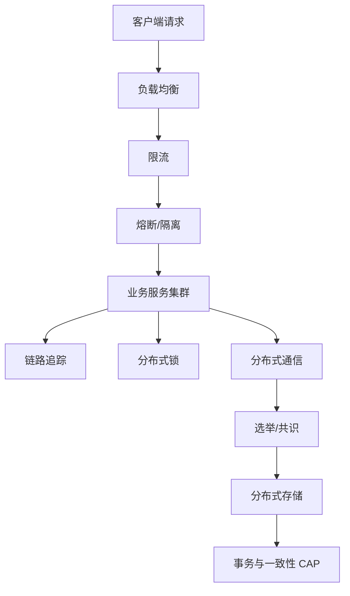
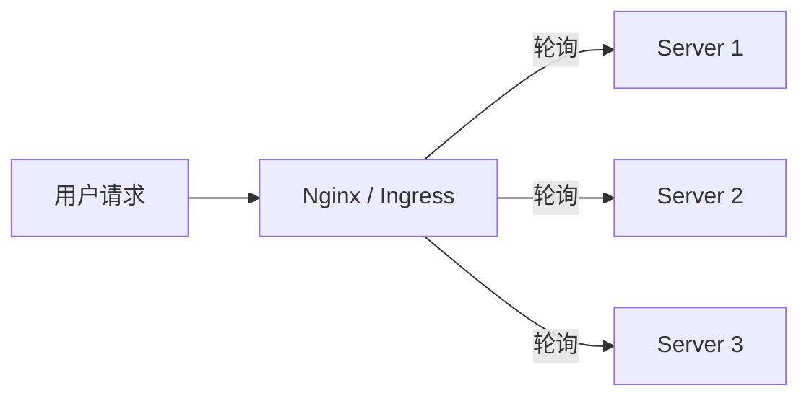
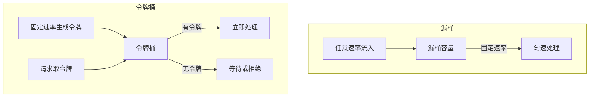
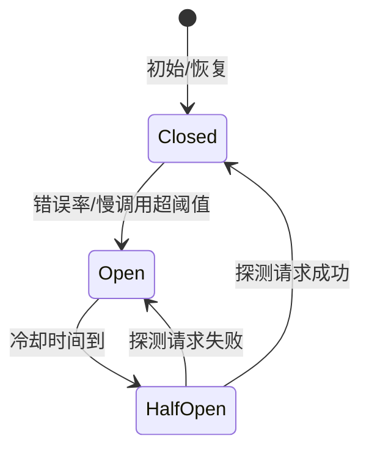
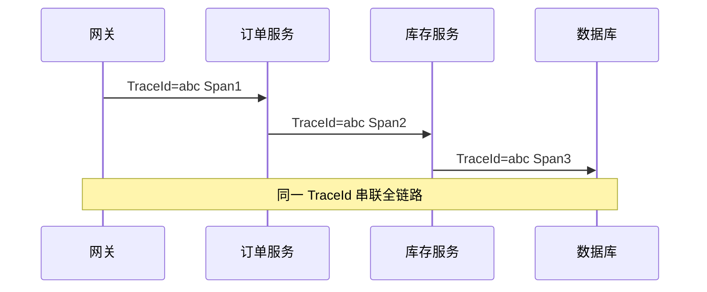
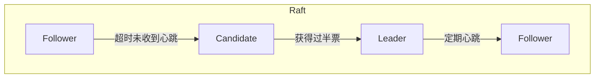
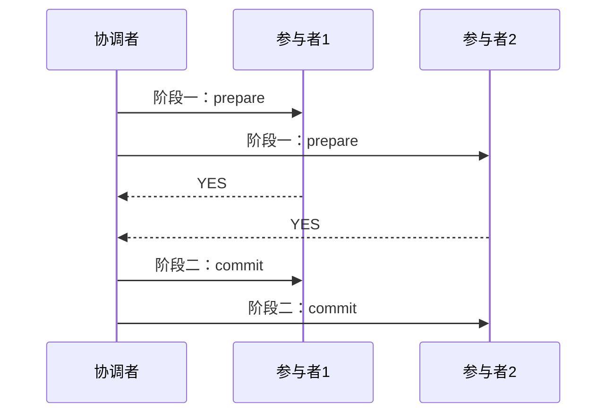
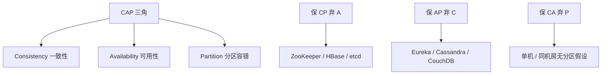
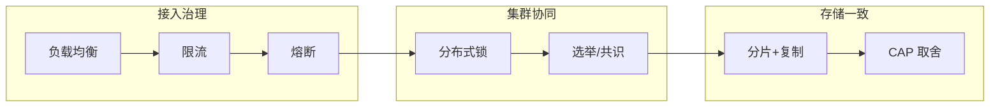

本文记录读完 **《分布式技术原理与算法解析》** 后的个人梳理：不按书中「四纵四横」，而是按 **请求接入 → 数据读写** 由外到内串联负载均衡、限流、熔断、链路追踪、分布式锁、选举、存储与 CAP 等核心概念，便于在实际项目中按图索骥。参考专栏 [分布式技术原理与算法解析](http://localhost:8888/%E4%B8%93%E6%A0%8F/%E5%88%86%E5%B8%83%E5%BC%8F%E6%8A%80%E6%9C%AF%E5%8E%9F%E7%90%86%E4%B8%8E%E7%AE%97%E6%B3%95%E8%A7%A3%E6%9E%90/)（聂鹏程 · 极客时间）；火车站购票系统场景串联另篇补充，本文不涉及。

<!-- more -->

<h2 id="c-1-0" class="mh1">一、梳理思路与阅读路径</h2>

<h2 id="c-1-1" class="mh2">1.1 为什么这样梳理</h2>

计划用两个章节进行梳理：首先是**个人理解**章节（本文），其次以火车站购票系统为例串联融合（另篇补充）。

个人理解不再按书中「四纵四横」展开，而是按**请求接入 → 数据读写**两条线，由外到内、由上到下梳理。一条用户请求进来，先经过接入与治理，再落到集群协同与存储；读写数据时，再面对事务与一致性取舍。

<h2 id="c-1-2" class="mh2">1.2 整体脉络</h2>




<h2 id="c-2-0" class="mh1">二、请求接入层</h2>

请求从客户端发出，到被后端正确处理，依次要解决：**流量往哪分、流量多大、故障如何隔离、出问题如何定位、多节点如何协同、数据放哪里**。

<h2 id="c-2-1" class="mh2">2.1 负载均衡</h2>

**核心理解**：负载均衡的本质是「不患寡，而患不均」——把请求或数据尽量均匀分摊到多个节点，避免单点过载，同时提升整体吞吐与可用性。

书中将负载均衡分为两类：

| 类型 | 含义 | 典型场景 |
|------|------|----------|
| 请求负载均衡 | 将用户请求分发到不同服务器处理 | Nginx、K8s Service、Dubbo |
| 数据负载均衡 | 将数据分布到不同存储节点 | 哈希、一致性哈希、分片 |

**常见策略对比**（中间件层）：

| 策略 | 原理 | 优点 | 缺点 | 适用场景 |
|------|------|------|------|----------|
| 轮询 | 按顺序依次分配；加权轮询按权重分配 | 实现简单，分布较均匀 | 不考虑节点负载差异；有状态场景需额外处理 | 请求开销接近的无状态服务 |
| 随机 | 随机选取节点 | 实现简单 | 短期可能不均；不考虑异构性 | 节点能力相近的无状态服务 |
| 哈希/一致性哈希 | 按 key 映射到固定节点 | 相同 key 落同一节点，适合有状态 | 节点变化时可能数据倾斜或迁移 | 缓存、Session 亲和 |
| 最少连接/资源感知 | 选连接数少或空闲资源多的节点 | 考虑实际负载 | 实现复杂，需采集指标 | 长连接、计算密集型 |

**加权轮询 vs Nginx 平滑加权轮询**：普通加权轮询在请求少时可能全落在高权重节点；Nginx 通过 `current_weight` 动态调整，使流量更平滑。



**个人实践**：无状态 API 用轮询或最少连接；需要 Session/缓存亲和用一致性哈希；K8s 中 Service + Ingress 即典型的多层负载均衡。

<h2 id="c-2-2" class="mh2">2.2 限流</h2>

**核心理解**：限流是保护系统的「闸门」，防止瞬时流量过大击垮服务。书中强调「大禹治水，在疏不在堵」——不是简单拒绝一切，而是把流量控制在系统可承受范围内。

> 注意区分两个「滑动窗口」：TCP 网络层的滑动窗口是**流量控制**（协调发送/接收速率）；分布式限流里的滑动窗口是**统计时间窗口内的请求数**，二者概念不同。

**常见限流算法**：

| 算法 | 原理 | 特点 | 典型应用 |
|------|------|------|----------|
| 固定窗口 | 按固定时间段计数，超限则拒绝 | 实现简单；窗口边界可能突发双倍流量 | 粗粒度限流 |
| 滑动窗口 | 将时间划分为多个小格，统计滑动区间内请求数 | 比固定窗口更平滑 | Redis + Lua、Sentinel |
| 漏桶 | 请求任意速率进入桶，以**固定速率**流出处理 | 宽进严出，输出匀速 | Sentinel 匀速排队 |
| 令牌桶 | 以固定速率向桶中放令牌，请求需取到令牌才通过 | 允许一定突发（桶内有令牌时） | Guava RateLimiter、Sentinel |



**漏桶 vs 令牌桶**：

- **漏桶**：适合间隔性突发、不要求即时处理的场景（如消息削峰后匀速消费）。
- **令牌桶**：适合允许短时突发、要求即时响应的场景（如 API 网关）。

**Sentinel 限流形态**：直接限流、关联限流、链路限流、**预热**（冷启动时限流从低到高）、**匀速排队**（漏桶思想）。

<h2 id="c-2-3" class="mh2">2.3 熔断及熔断恢复</h2>

**核心理解**：熔断是故障隔离的一种手段。当依赖服务故障率或延迟超过阈值时，**快速失败**而非持续调用，避免故障扩散、线程堆积，保护调用方自身可用。

书中「故障隔离」从设计维度分为：

| 维度 | 策略 | 说明 |
|------|------|------|
| 功能模块 | 线程级隔离 | 不同业务用不同线程池（Hystrix 思想） |
| 功能模块 | 进程级隔离 | 微服务拆分，单服务故障不拖垮全局 |
| 资源 | 容器/虚拟机/机房隔离 | Docker、K8s、多机房部署 |

**熔断器三态**（以 Hystrix / Sentinel 为代表）：



| 状态 | 行为 |
|------|------|
| Closed（关闭） | 正常调用，统计失败率 |
| Open（打开） | 直接降级/快速失败，不调用下游 |
| HalfOpen（半开） | 放行少量探测请求，成功则恢复，失败则继续熔断 |

**隔离粒度**（由粗到细）：机房/集群 → 服务 → 接口 → 功能模块。

**配套手段**：

- **降级**：返回默认值、缓存数据、简化流程，保证核心功能可用。
- **舱壁隔离**：线程池隔离，避免一个慢依赖占满所有线程。
- **超时控制**：避免无限等待。

**个人理解**：熔断不是「关停服务」，而是「有节制地放弃非核心路径」。银行转账核心链路保 CP，商品详情页可降级读缓存，即不同粒度的隔离策略。

<h2 id="c-2-4" class="mh2">2.4 链路追踪</h2>

**核心理解**：微服务拆分后，一次请求会穿越多个服务。链路追踪回答：**请求经过了谁、每段耗时多少、哪里出错**。

**实现要点**（基于标注的方案，如 Jaeger、Zipkin、SkyWalking）：

| 概念 | 含义 |
|------|------|
| Trace | 一次完整请求链路 |
| Span | 链路中的一个操作单元（如一次 HTTP、一次 DB 调用） |
| SpanContext | TraceId、SpanId、ParentSpanId，用于跨服务传递 |
| 埋点 | 在入口创建 Span，通过 HTTP Header / gRPC Metadata 向下游透传 |



**采样策略**：Const（全采）、Probabilistic（概率）、RateLimiting（限速），在可观测性与性能间权衡。

更详细的 Jaeger 实践可参考本站笔记：[链路追踪之 Jaeger](/-lg-go-jaeger)。

<h2 id="c-2-5" class="mh2">2.5 集群与分布式锁</h2>

**集群理解**：多个节点组成逻辑整体，对外提供统一服务。

| 层级 | 示例 |
|------|------|
| 物理 | 机房、机架、服务器 |
| 逻辑 | K8s 集群、Redis 集群、Kafka 集群 |

**无状态 vs 有状态**：

- **无状态服务**（如大部分 REST API）：可随意扩缩容，多副本跑在不同 Pod/机器，配合负载均衡即可。
- **有状态服务**：多节点访问同一资源会产生竞争，需**分布式锁**或**数据分片**保证一致性。

**分布式锁三种实现**（书中对比）：

| 方式 | 原理 | 优点 | 缺点 |
|------|------|------|------|
| 数据库 | 唯一索引 / `for update` | 实现直观 | 性能差、单点与死锁风险 |
| Redis | `SET key value NX EX ttl` | 性能高、使用简单 | 主从切换可能丢锁；需 Redlock 等增强方案 |
| ZooKeeper / etcd | 临时顺序节点，序号最小获锁 | 可靠性高、无单点 | 性能较低、实现复杂 |

**Redis 分布式锁注意点**：

1. 必须设置过期时间，防止死锁。
2. 释放锁时要校验 value（如 UUID），避免误删他人锁。
3. 主从异步复制场景，可考虑 Redlock 或直接用 etcd/ZK。

**缓存与数据库一致性 — 双删策略**：

```
1. 删除缓存
2. 更新数据库
3. 延迟 N ms 后再次删除缓存（清除并发读导致的脏缓存）
```

也可用「先更新 DB，再删缓存」+ 消息队列保证最终一致；强一致场景考虑 Canal 等订阅 binlog 异步删缓存。

<h2 id="c-2-6" class="mh2">2.6 多节点分布式选举</h2>

**为什么需要选举**：集群需要 Leader 协调写操作、维护元数据；「国不可一日无君」，主节点故障必须重新选主。

**常见算法**：

| 算法 | 核心思想 | 代表应用 | 特点 |
|------|----------|----------|------|
| Bully | ID 最大者为主 | MongoDB 副本集 | 简单快速；新大 ID 节点加入易频繁切主 |
| Raft | 过半投票选主 | etcd、K8s | 易理解；需多数派通信 |
| ZAB | Raft 改进，优先 zxid 最大的节点 | ZooKeeper | 保证数据最新性 |



**Raft 角色**：Follower → Candidate → Leader。每轮选举每节点仅投一票；Leader 故障后 Follower 超时转 Candidate 发起选举。

**实践建议**：多数派集群通常用**奇数节点**（3/5/7），避免脑裂时两边都无法过半。

**选举 vs 共识**：选举解决「谁来做主」；共识（如 Raft 日志复制、Paxos）解决「多个节点对数据达成一致」。etcd 同时用 Raft 做选主和日志复制。

<h2 id="c-2-7" class="mh2">2.7 分布式存储</h2>

书中用「顾客、导购、货架」类比存储三要素：

| 类比 | 技术含义 |
|------|----------|
| 顾客 | 数据生产者 / 消费者 |
| 导购 | 数据索引与定位（分片、路由） |
| 货架 | 实际存储介质与系统 |

**数据分片（Sharding）**：按规则把数据拆到不同节点，降低单点压力。

- 范围分片：如按用户 ID 区间、按地域线路。
- 哈希分片：均匀但扩缩容迁移大。
- 一致性哈希：扩缩容只影响相邻节点。

**数据复制（Replication）**：同一份数据多副本，主从/多副本保证高可用；分片与复制通常共存（如 Kafka Partition + 副本）。

**消息中间件 Broker 模型**（以 Kafka 为例）：

```
Topic → 多个 Partition（分片）→ 分布在多个 Broker
每个 Partition 有 Leader + Follower 副本
```

**持久化与备份**：

| 系统 | 机制 | 说明 |
|------|------|------|
| Redis | RDB | 定时快照，恢复快，可能丢最近数据 |
| Redis | AOF | 记录写命令，可配置 fsync 策略 |
| MySQL | binlog | 逻辑日志，用于主从复制与 PITR |
| MySQL | redo log | 物理日志，保证事务持久性 |

**存储介质选择**：热数据放内存（Redis），温冷数据放磁盘（MySQL、对象存储）；电商中爆款商品信息常缓存，长尾商品落盘。


<h2 id="c-3-0" class="mh1">三、数据读写层</h2>

请求进入集群后，真正读写数据时，要面对**事务**与**一致性**问题。

<h2 id="c-3-1" class="mh2">3.1 分布式事务</h2>

**ACID 在分布式的挑战**：跨服务、跨库时，单机事务无法满足，需要分布式协调。

**三种主流方案**：

| 方案 | 一致性 | 特点 |
|------|--------|------|
| 2PC（两阶段提交） | 强一致 | 协调者 + 投票 + 提交/回滚；同步阻塞、协调者单点 |
| 3PC（三阶段提交） | 强一致 | 增加 CanCommit 预阶段 + 超时机制；仍可能数据不一致 |
| 消息最终一致性 | 最终一致 | 本地事务 + 消息队列，性能好，允许短暂不一致 |

**2PC 流程**：



**3PC 改进**：CanCommit → PreCommit → DoCommit；协调者与参与者均有超时，减少长时间阻塞。

**柔性事务**（BASE）：基本可用、软状态、最终一致。适合电商下单、积分等非金融核心场景。

<h2 id="c-3-2" class="mh2">3.2 CAP 理论</h2>

**三个特性**：

| 字母 | 含义 | 举例 |
|------|------|------|
| C（Consistency） | 所有节点同一时刻数据一致 | 三地仓库库存数字相同 |
| A（Availability） | 任意请求都能得到响应（不保证最新） | 分区时仍可查询 |
| P（Partition tolerance） | 网络分区时系统仍能继续工作 | 机房之间网络中断 |

**核心结论**：分布式系统**最多同时满足两个**。实际场景中 P 几乎必须保证（网络不可靠），因此常在 **CP** 与 **AP** 间取舍。



| 策略 | 场景 | 典型系统 |
|------|------|----------|
| CP | 金融、支付、库存强一致 | ZooKeeper、HBase、etcd |
| AP | 社交动态、商品浏览、可接受短暂不一致 | Eureka、Cassandra、DynamoDB |
| CA | 单机或不考虑分区 | 传统关系型数据库单实例 |

**CAP 与 ACID 的 C/A 不同**：

- CAP 的 C：多节点间数据一致。
- ACID 的 C：事务前后数据满足约束。
- CAP 的 A：每次请求都能得到响应。
- ACID 的 A：事务要么全成功要么全失败。

**BASE 理论**（CAP 中 AP 的延伸）：基本可用、软状态、最终一致。与刚性事务（2PC/3PC）相对，适合大规模互联网业务。


<h2 id="c-4-0" class="mh1">四、个人串联小结</h2>

<h2 id="c-4-1" class="mh2">4.1 请求全链路回顾</h2>

把一条请求从进入到落库串起来：

1. **接入**：负载均衡分流 → 限流控速 → 熔断保护下游。
2. **可观测**：链路追踪定位慢调用与错误。
3. **协同**：无状态服务水平扩展；有状态场景加分布式锁；元数据与主节点靠选举（Raft/etcd）。
4. **存储**：分片扩容 + 副本高可用 + 缓存加速；持久化靠 RDB/AOF/binlog。
5. **一致性**：金融类保 CP + 分布式事务；互联网读多写少常保 AP + 最终一致。



火车站购票系统的场景串联另篇展开，本文聚焦概念梳理与工程映射。实际项目中不必堆砌所有技术，按业务 SLA 在可用性、一致性、性能之间做取舍即可。

<hr aria-hidden="true" style=" border: 0; height: 2px; background: linear-gradient(90deg, transparent, #1bb75c, transparent); margin: 2rem 0; " />

<!-- 目录容器 -->
<div class="mi1">
    <strong>目录</strong>
        <ul style="margin: 10px 0; padding-left: 20px; list-style-type: none;">
            <li style="list-style-type: none;"><a href="#c-1-0">一、梳理思路与阅读路径</a></li>
            <ul style="padding-left: 15px; list-style-type: none;">
                <li style="list-style-type: none;"><a href="#c-1-1">1.1 为什么这样梳理</a></li>
                <li style="list-style-type: none;"><a href="#c-1-2">1.2 整体脉络</a></li>
            </ul>
            <li style="list-style-type: none;"><a href="#c-2-0">二、请求接入层</a></li>
            <ul style="padding-left: 15px; list-style-type: none;">
                <li style="list-style-type: none;"><a href="#c-2-1">2.1 负载均衡</a></li>
                <li style="list-style-type: none;"><a href="#c-2-2">2.2 限流</a></li>
                <li style="list-style-type: none;"><a href="#c-2-3">2.3 熔断及熔断恢复</a></li>
                <li style="list-style-type: none;"><a href="#c-2-4">2.4 链路追踪</a></li>
                <li style="list-style-type: none;"><a href="#c-2-5">2.5 集群与分布式锁</a></li>
                <li style="list-style-type: none;"><a href="#c-2-6">2.6 多节点分布式选举</a></li>
                <li style="list-style-type: none;"><a href="#c-2-7">2.7 分布式存储</a></li>
            </ul>
            <li style="list-style-type: none;"><a href="#c-3-0">三、数据读写层</a></li>
            <ul style="padding-left: 15px; list-style-type: none;">
                <li style="list-style-type: none;"><a href="#c-3-1">3.1 分布式事务</a></li>
                <li style="list-style-type: none;"><a href="#c-3-2">3.2 CAP 理论</a></li>
            </ul>
            <li style="list-style-type: none;"><a href="#c-4-0">四、个人串联小结</a></li>
            <ul style="padding-left: 15px; list-style-type: none;">
                <li style="list-style-type: none;"><a href="#c-4-1">4.1 请求全链路回顾</a></li>
            </ul>
        </ul>
</div>

本笔记将持续更新，欢迎提交 Issue 和 Pull Request
