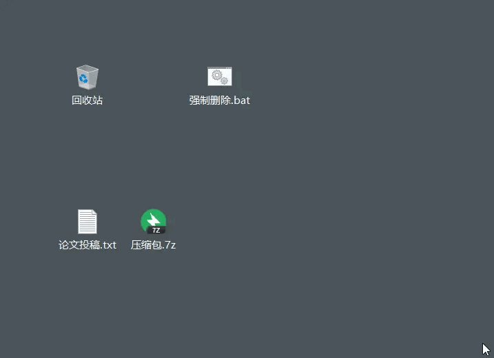

`工作过程中的一些脚本记录，重复工作流程化处理`

<!-- more -->

<h2 id="c-1-0" class="mh1">一、文件、文件夹删除-Win</h2>

`说明： 该脚本用于大文件或文件夹的强制删除，不需要执行命令，只需要把数据拖拽到脚本工具即可`

- 1. 文件删除脚本创建

      ```
        强制删除.bat
        ----------------------
        DEL /F /A /Q \\?\%1 RD /S /Q \\?\%1
      ```

- 2. 执行文件删除脚本
  - 1. 创建 强制删除.bat 文件，写入 `DEL /F /A /Q \\?\%1 RD /S /Q \\?\%1` 内容
  - 2. 拉取要删除的文件/文件夹 到 强制删除.bat
  

<h2 id="c-2-0" class="mh1">二、日志初始化-Win</h2>

`说明：针对每天的工作计划，初始出一个Markdown文档模块，执行初始化脚本后，自动根据日期创建当天的模块`

- 1. 新建初始化日志模板

      ```
          template.md
          1. 需要调整格式 取消缩进
          ----------

          > 与人为善,于己为善,与人有路,于己有退

          - [ ] 每日一语？
            
            ```
            
            ```


          - [ ] 我今天怎样比昨天做的更好？
            
            ```
            
            ```

          -----

          <div id="jump">工作任务</div>

          - [ ] 
          - [ ] 
          - [ ] 
          - [ ] 
          - [ ] 
          - [ ] 

          ---

          [工作完成进度确认](#jump)

          ```

          ```

          ---

          ***今日总结***  

          ```

          ```
      ```

- 2. 新建初始化日志脚本

      ```
        initLogs.bat
        1. 需要调整格式 取消缩进
        2. 参数说明
          dest 为存储路径
          %dest%/logs 为存放日志的文件夹
          %dest%/template.md 为模板文件路径
          %dt% 为日期格式
        ----------
        
        @echo off
      
        SET dest=C:\Users\Admin\Desktop

        echo jump log path
        cd /d %dest%\logs

        echo set today date
        set dt=%date:~0,4%.%date:~5,2%.%date:~8,2%-%date:~11,13%

        echo copy template markdown file 
        xcopy %dest%\template.md .
        cd ./%dt%

        echo rename template.md today markdown file
        ren template.md %dt%.md
        del template.md

        echo create success
      ```

- 3. 执行初始化脚本

    
    

<h2 id="c-3-0" class="mh1">三、一键启动多任务-Win</h2>

- 1. 新建一键启动多任务脚本

      ```
        start.bat
        1. 需要调整格式 取消缩进
        2. start 可执行多次多个任务
        ----------

        @echo off
 

        if "%1" == "h" goto begin
        

        mshta vbscript:createobject("wscript.shell").run("""%~nx0"" h",0)(window.close)&&exit
        

        :begin
        
        echo 打开打卡定时图片任务...
        start /B C:/workspace/golang/src/feng6917/local/bash/gohome_bat.exe
      ```  

- 2. 执行 start.bat

<h2 id="c-4-0" class="mh1">四、MySQL数据备份-Linux</h2>

<h2 id="c-4-1" class="mh2">4.1 命令备份</h2>
- 1. 备份

  ```bash
  mysqldump -u root -p123456 --all-databases > /data/mysql/all-databases.sql
  ```

- 2. 恢复

  ```bash
  mysql -u root -p123456 < /data/mysql/all-databases.sql
  ```

<h2 id="c-4-2" class="mh2">4.2 Cron备份</h2>

- 1. 备份脚本编写

      ```
      #保存备份个数，备份7天数据
      number=7
      #备份保存路径  路径名可自定义
      backup_dir=/root/mmysql/mysqlbackup
      #日期
      dd=`date +%Y-%m-%d-%H-%M-%S`
      #备份工具
      tool=mysqldump
      #用户名
      username=root
      #密码  自己的数据库密码
      password=root
      #将要备份的数据库
      database_name=db_myz
      #host
      host=192.168.23.68
      #port
      port=31506

      #如果文件夹不存在则创建
      if [ ! -d $backup_dir ];
      then
          mkdir -p $backup_dir;
      fi

      #简单写法 mysqldump -u root -p123456 users > /root/mysqlbackup/users-$filename.sql
      #变量写法  本实例采用变量写法，这样增强脚本可移植性、可读性，后期维护时只需修改变量名即可
      $tool -h$host -P$port -u $username -p$password $database_name > $backup_dir/$database_name-$dd.sql

      #写创建备份日志
      echo "创建数据部备份文件 $backup_dir/$database_name-$dd.sql" >> $backup_dir/log.txt

      #找出需要删除的备份
      delfile=`ls -l -crt $backup_dir/*.sql | awk '{print $9 }' | head -1`

      #判断现在的备份数量是否大于$number
      count=`ls -l -crt $backup_dir/*.sql | awk '{print $9 }' | wc -l`

      if [ $count -gt $number ]
      then
        #删除最早生成的备份，只保留number数量的备份
        rm $delfile
        #写删除文件日志
        echo "删除过期本份文件 $delfile" >> $backup_dir/log.txt
      fi
      ```

- 2. 使用 cron 定时执行脚本

      ```
        #service crond start //启动服务
        #service crond stop //关闭服务
        #service crond restart //重启服务
        #service crond reload //重新载入配置
        #service crond status //查看服务状态
        #cron 文件内容
        #0 2 * * * /root/mysql_backup_script.sh
        #cron 执行
        #crontab mysqlRollback.cron
        #cron 状态
        #crontab -l
      ```

<h2 id="c-5-0" class="mh1">五、XShell 脚本（构建镜像）</h2>

`说明：该脚本主要用于可执行文件拷贝到容器中，构建新的镜像。第一个shell 脚本，用于运行容器，替换容器ID。第二个脚本 用于打包，生成新镜像。区分开是为了方便二次及多次编译。`

1. xshell 脚本内容

``` vbscript
    Sub Main
      ' 第一步：连接到服务器并运行docker
      xsh.Session.Open("./内网 goserver build.xsh")
      
      ' 等待命令执行
      xsh.Screen.WaitForString("#")

      ' 在新窗口中执行操作
      xsh.Screen.Send("cd ~/myz" & vbCr)
      xsh.Screen.WaitForString("#")

      ' 获取容器ID并替换文件第二行
      xsh.Screen.Send "container_id=$(docker run -it -d registry.zhst.com/video-analysis/go-server:zhstserver-dongfeng-102959)" & vbCr
      xsh.Screen.WaitForString "#"

      ' 显示完整ID和截取后的ID
      xsh.Screen.Send "echo ""完整容器ID: $container_id""" & vbCr
      xsh.Screen.WaitForString "#"

      ' 先截取前12位，再替换文件
      xsh.Screen.Send "short_id=""containerID=$(echo $container_id | cut -c1-12)""" & vbCr
      xsh.Screen.Send "echo ""截取后容器ID: $short_id""" & vbCr
      xsh.Screen.WaitForString "#"

      ' 替换文件第二行 - 使用单引号
      xsh.Screen.Send("sed -i ""2c $short_id"" ~/myz/ci_goserver.sh" & vbCr)
      xsh.Screen.WaitForString "#"
      
      ' ' 显示第二行内容
      xsh.Screen.Send "awk 'NR==2' ~/myz/ci_goserver.sh" & vbCr
      xsh.Screen.WaitForString "#"    
      
    End Sub
```

2. ci_goserver.sh 脚本内容

``` bash
containerID=54578a5fad66

# 生成 ctag：当前日期（月日-时分）
ctag="112107"

echo "containerID: $containerID commit: $ccomit tag: $ctag"

docker cp zhstserver $containerID:/myapp

docker commit -m "fix: $ccommit" $containerID registry.zhst.com/video-analysis/go-server:zhstserver-dongfeng-102959-$ctag

echo "镜像: registry.zhst.com/video-analysis/go-server:zhstserver-dongfeng-102959-$ctag"

rm -rf goserver-*

docker save -o goserver-$ctag.tar registry.zhst.com/video-analysis/go-server:zhstserver-dongfeng-102959-$ctag

echo "goserver-$ctag.tar 打包成功."
```

<h2 id="c-6-0" class="mh1">六、参考资源</h2>

<h3 id="c-6-1" class="mh2">6.1 相关技术链接</h3>

- 学习资源
  - [MySQL 数据库定时备份脚本实例](https://blog.csdn.net/SudongJang/article/details/125444498)

<hr aria-hidden="true" style=" border: 0; height: 2px; background: linear-gradient(90deg, transparent, #1bb75c, transparent); margin: 2rem 0; " />

<!-- 目录容器 -->
<div class="mi1">
    <strong>目录</strong>
        <ul style="margin: 10px 0; padding-left: 20px; list-style-type: none;">
            <li style="list-style-type: none;"><a href="#c-1-0">一、文件、文件夹删除-Win</a></li>
            <ul style="padding-left: 15px; list-style-type: none;"></ul>
            <li style="list-style-type: none;"><a href="#c-2-0">二、日志初始化-Win</a></li>
            <ul style="padding-left: 15px; list-style-type: none;"></ul>
            <li style="list-style-type: none;"><a href="#c-3-0">三、一键启动多任务-Win</a></li>
            <ul style="padding-left: 15px; list-style-type: none;"></ul>
            <li style="list-style-type: none;"><a href="#c-4-0">四、MySQL数据备份-Linux</a></li>
            <ul style="padding-left: 15px; list-style-type: none;"></ul>
            <li style="list-style-type: none;"><a href="#c-5-0">五、XShell 脚本(构建镜像)</a></li>
            <ul style="padding-left: 15px; list-style-type: none;"></ul>
            <li style="list-style-type: none;"><a href="#c-6-0">六、参考资源</a></li>
                <ul style="padding-left: 15px; list-style-type: none;">
                    <li style="list-style-type: none;"><a href="#c-6-1">6.1 相关技术链接</a></li>
                </ul>
        </ul>
</div>

<style>
    /* 一级段落 */
    .mh1 {
      text-align: center;
      color: black;
      background: linear-gradient(#fff 60%, #b2e311ff 40%);
      margin: 1.4em 0 1.1em;
      font-size: 1.4em;
      font-family: 'roboto', 'Iowan Old Style', 'Ovo', 'Hoefler Text', Georgia, 'Times New Roman', 'TIBch', 'Source Han Sans', 'PingFangSC-Regular', 'Hiragino Sans GB', 'STHeiti', 'Microsoft Yahei', 'Droid Sans Fallback', 'WenQuanYi Micro Hei', sans-serif;
      line-height: 1.7;
      letter-spacing: .33px;
    }
    /* 二级段落 */

    .mh2 {
      -webkit-text-size-adjust: 100%; letter-spacing: .33px; font-family: 'roboto', 'Iowan Old Style', 'Ovo', 'Hoefler Text', Georgia, 'Times New Roman', 'TIBch', 'Source Han Sans', 'PingFangSC-Regular', 'Hiragino Sans GB', 'STHeiti', 'Microsoft Yahei', 'Droid Sans Fallback', 'WenQuanYi Micro Hei', sans-serif; line-height: 1.7; color: #1cc03cff; border-left: 4px solid #1bb75cff; padding-left: 6px; margin: 1.4em 0 1.1em;
    }

    /* 目录 高度、宽度 可自行调整*/
    .mi1 {
      position: fixed; bottom: 240px; right: 10px; width: 240px; height: 320px; background: #f8f9fa; border: 1px solid #e9ecef; border-radius: 8px; padding: 15px; overflow-y: auto; font-family: 'roboto', 'Iowan Old Style', 'Ovo', 'Hoefler Text', Georgia, 'Times New Roman', 'TIBch', 'Source Han Sans', 'PingFangSC-Regular', 'Hiragino Sans GB', 'STHeiti', 'Microsoft Yahei', 'Droid Sans Fallback', 'WenQuanYi Micro Hei', sans-serif; font-size: 14px; line-height: 1.15; color: #444; letter-spacing: 0.33px; transition: all 0.3s ease;
    }

</style>

本技术手册将持续更新，欢迎提交Issue和Pull Request
