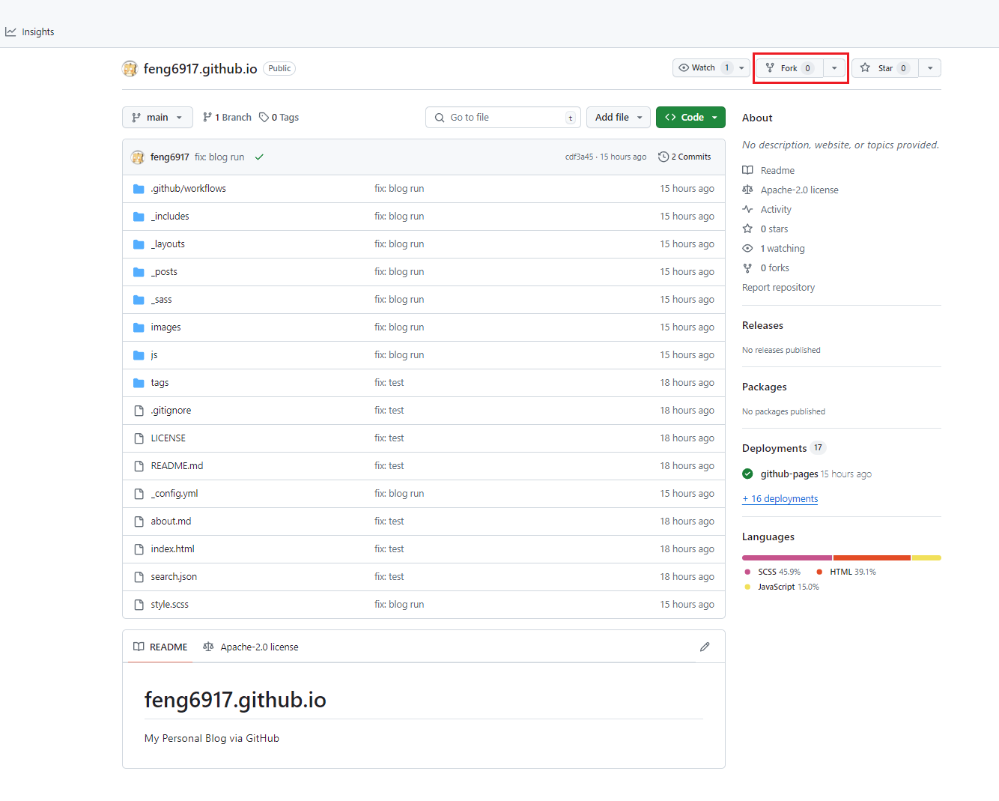
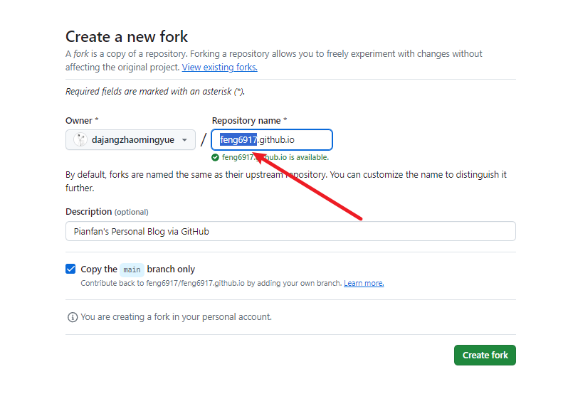
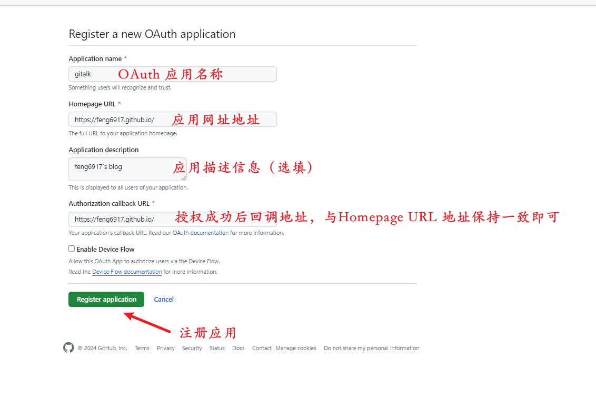
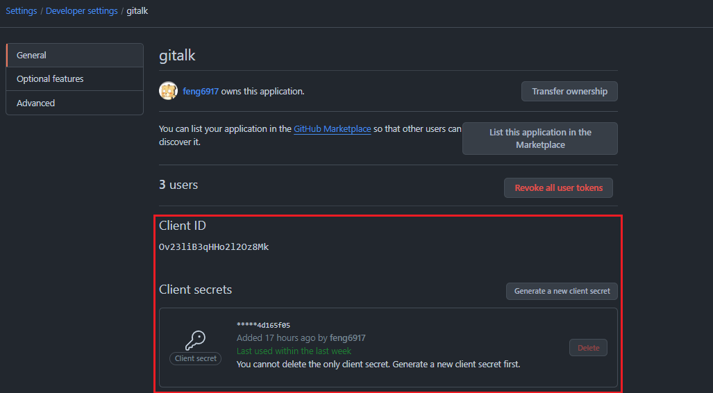
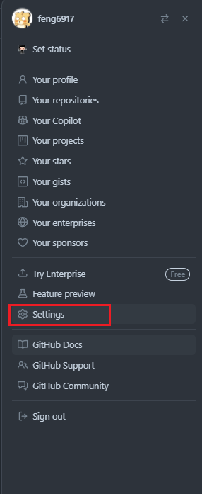
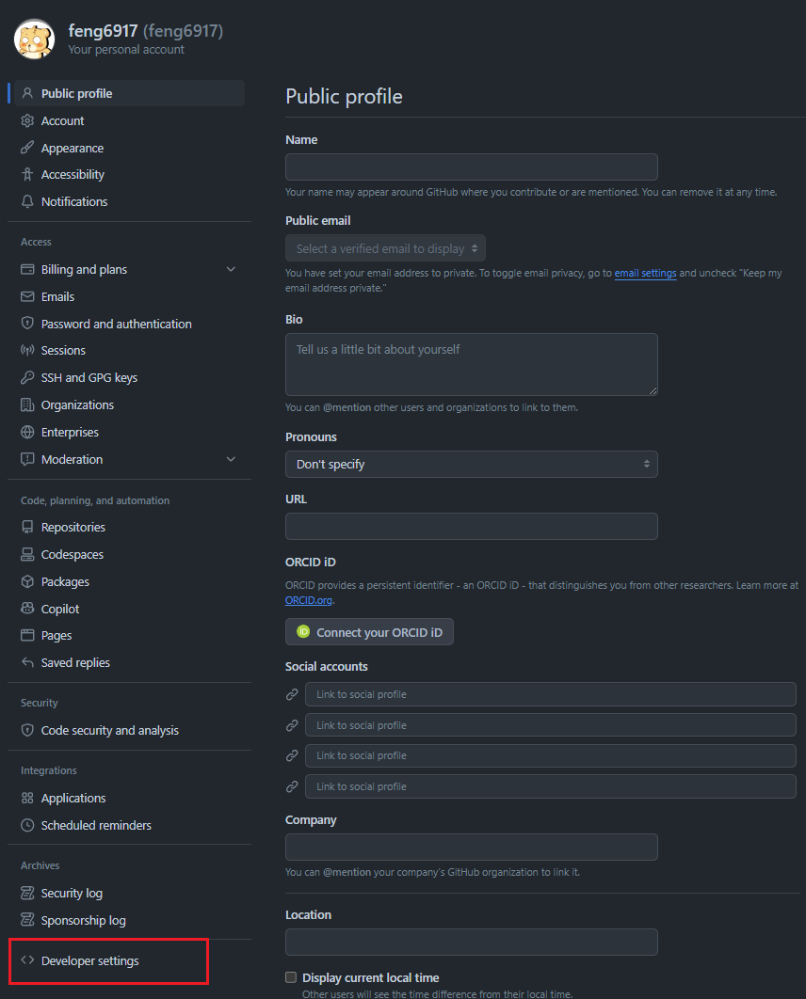
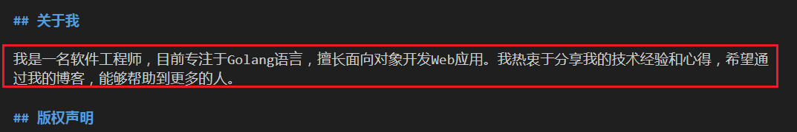
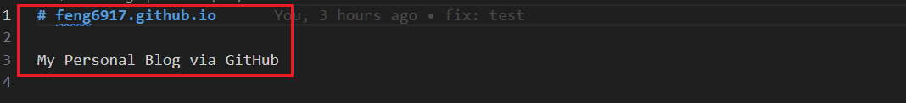

从零开始部署个人技术博客，详细记录每一步操作，包括GitHub Pages博客搭建、评论系统搭建、文章发布等。
<!-- more -->

<h2 id="c-1-0" class="mh1">一、GitHub Pages博客搭建指南</h2>

<h3 id="c-1-1" class="mh2">1.1 仓库Fork操作</h3>

1. 访问 [博客地址](https://github.com/feng6917/feng6917.github.io) ，点击右上角的 Fork 按钮。
  
2. 修改仓库名称为个人GitHub用户名
    

- 技术要点：
  - Fork操作创建仓库副本
  - 仓库命名格式：username.github.io
  - 确保仓库设置为Public访问权限

<h3 id="c-1-2" class="mh2">1.2 仓库重命名配置</h3>

- 仓库命名规范：
  - 必须使用 GitHub 用户名
  - 格式：username.github.io
  - 启用 GitHub Pages 功能

<h2 id="c-2-0" class="mh1">二、配置文件修改</h2>

<h3 id="c-2-1" class="mh2">2.1 全局配置文件修改</h3>

`_config.yml` 全局配置文件、`_posts` 放置博客文章的文件夹、
`images` 存放图片的文件夹

- _config.yml 文件

  ```
  name: "feng6917's blog" # 博客名称
  description: "feng6917的个人技术博客" # 博客描述信息

  avatar: https://feng6917.github.io/images/avator.png # 个人头像
  favicon: https://feng6917.github.io/images/favicon.ico # github 图标 可忽略

  url: https://feng6917.github.io # 博客地址

  # Gitalk
  gitalk:
    enable: true    # 是否开启Gitalk评论
    clientID: Ov23liB3qHHo2l2Oz8Mk                            # 生成的clientID
    clientSecret: 0c468c2bf18bcae0d9174aacb1dc0d094d165f05    # 生成的clientSecret
    repo: feng6917.github.io    # 仓库名称
    owner: feng6917    # github用户名
    admin: feng6917
    distractionFreeMode: true # 是否启用类似FB的阴影遮罩 

  footer-links:
    email: feng6917@gmail.com # 邮箱地址
    github: feng6917 # github地址

  footer-text: Copyright (c) 2024 Feng6917 # 版权信息
  ```  

<h3 id="c-2-2" class="mh2">2.2 OAuth应用配置</h3>
- 打开 [申请地址](https://github.com/settings/applications/new)

- 填写信息 & 注册应用

    

- 查询 Client ID 和 Client Secret

    

- 通过首页查询 OAuth Application

  
  
  

<h3 id="c-2-3" class="mh2">2.3 个人信息页面配置</h3>

- 修改 about.md 文件
    

- 修改 README.md 文件
    

<h2 id="c-3-0" class="mh1">三、内容清理与初始化</h2>

<h3 id="c-3-1" class="mh2">3.1 模板内容清理</h3>

```
需要清理的目录和文件：

  _posts/          # 删除所有示例文章
  images/          # 删除示例图片
  _config.yml      # 移除私有配置信息
```

- 清理操作说明：
  - 保留博客框架结构
  - 移除个人敏感信息
  - 准备自定义内容

<h2 id="c-4-0" class="mh1">四、博客文章发布</h2>

<h3 id="c-4-1" class="mh2">4.1 文章创建规范</h3>

```
---
layout: post
title: "我的第一篇文章"
subtitle: "Hello World, Hello Blog"
date: 2024-08-21
author: "你的名字"
catalog: true
tags:
  - 博客
  - 技术
---
## 文章标题

> 这是我的第一篇博客。

正文内容开始...

进入你的博客主页，新的文章将会出现在你的主页上。
```

- 文件命名规则：
  - 格式：年-月-日-文章标题.md
  - 示例：2024-8-21-我的第一篇文章.md
  - 使用UTF-8编码

<h2 id="c-5-0" class="mh1">五、参考资源</h2>

- [翩帆的个人技术博客](https://pianfan.github.io/)
- [博客搭建详细教程](https://github.com/qiubaiying/qiubaiying.github.io/wiki/博客搭建详细教程)
- [为博客添加Gitalk评论插件](https://qiubaiying.github.io/2017/12/19/为博客添加-Gitalk-评论插件/)

<hr aria-hidden="true" style=" border: 0; height: 2px; background: linear-gradient(90deg, transparent, #1bb75c, transparent); margin: 2rem 0; " />

<!-- 目录容器 -->
<div style="position: fixed; bottom: 240px; right: 10px; width: 240px; height: 320px; background: #f8f9fa; border: 1px solid #e9ecef; border-radius: 8px; padding: 15px; overflow-y: auto; font-family: 'roboto', 'Iowan Old Style', 'Ovo', 'Hoefler Text', Georgia, 'Times New Roman', 'TIBch', 'Source Han Sans', 'PingFangSC-Regular', 'Hiragino Sans GB', 'STHeiti', 'Microsoft Yahei', 'Droid Sans Fallback', 'WenQuanYi Micro Hei', sans-serif; font-size: 14px; line-height: 1.15; color: #444; letter-spacing: 0.33px; transition: all 0.3s ease;">
    <strong>目录</strong>
        <ul style="margin: 10px 0; padding-left: 20px; list-style-type: none;">
            <li style="list-style-type: none;"><a href="#c-1-0">一、GitHub Pages博客搭建指南</a></li>
            <ul style="padding-left: 15px; list-style-type: none;">
                <li style="list-style-type: none;"><a href="#c-1-1">1.1 仓库Fork操作</a></li>
                <li style="list-style-type: none;"><a href="#c-1-2">1.2 仓库重命名配置</a></li>
            </ul>
            <li style="list-style-type: none;"><a href="#c-2-0">二、配置文件修改</a></li>
            <ul style="padding-left: 15px; list-style-type: none;">
                <li style="list-style-type: none;"><a href="#c-2-1">2.1 全局配置文件修改</a></li>
                <li style="list-style-type: none;"><a href="#c-2-2">2.2 OAuth应用配置</a></li>
                <li style="list-style-type: none;"><a href="#c-2-3">2.3 个人信息页面配置</a></li>
            </ul>
            <li style="list-style-type: none;"><a href="#c-3-0">三、内容清理与初始化</a></li>
            <ul style="padding-left: 15px; list-style-type: none;">
                <li style="list-style-type: none;"><a href="#c-3-1">3.1 模板内容清理</a></li>
            </ul>
            <li style="list-style-type: none;"><a href="#c-4-0">四、博客文章发布</a></li>
            <ul style="padding-left: 15px; list-style-type: none;">
                <li style="list-style-type: none;"><a href="#c-4-1">4.1 文章创作规范</a></li>
            </ul>
            <li style="list-style-type: none;"><a href="#c-5-0">五、参考资源</a></li>
            <ul style="padding-left: 15px; list-style-type: none;"></ul>
        </ul>
</div>

本技术手册将持续更新，欢迎提交Issue和Pull Request

<style>
    /* 一级段落 */
    .mh1 {
      text-align: center;
      color: black;
      background: linear-gradient(#fff 60%, #b2e311ff 40%);
      margin: 1.4em 0 1.1em;
      font-size: 1.4em;
      font-family: 'roboto', 'Iowan Old Style', 'Ovo', 'Hoefler Text', Georgia, 'Times New Roman', 'TIBch', 'Source Han Sans', 'PingFangSC-Regular', 'Hiragino Sans GB', 'STHeiti', 'Microsoft Yahei', 'Droid Sans Fallback', 'WenQuanYi Micro Hei', sans-serif;
      line-height: 1.7;
      letter-spacing: .33px;
    }
    /* 二级段落 */

    .mh2 {
      -webkit-text-size-adjust: 100%; letter-spacing: .33px; font-family: 'roboto', 'Iowan Old Style', 'Ovo', 'Hoefler Text', Georgia, 'Times New Roman', 'TIBch', 'Source Han Sans', 'PingFangSC-Regular', 'Hiragino Sans GB', 'STHeiti', 'Microsoft Yahei', 'Droid Sans Fallback', 'WenQuanYi Micro Hei', sans-serif; line-height: 1.7; color: #1cc03cff; border-left: 4px solid #1bb75cff; padding-left: 6px; margin: 1.4em 0 1.1em;
    }

</style>
