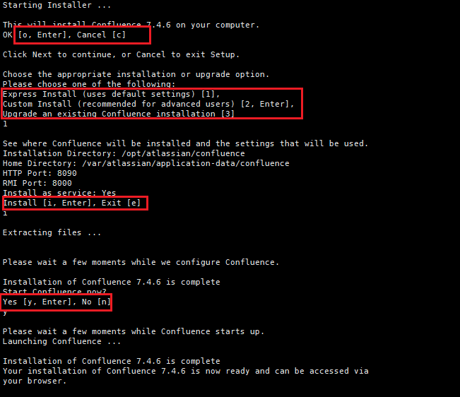
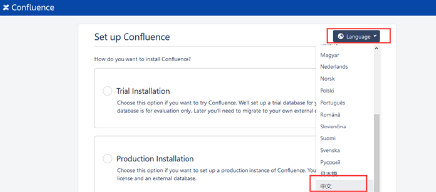
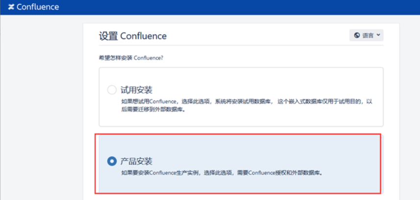
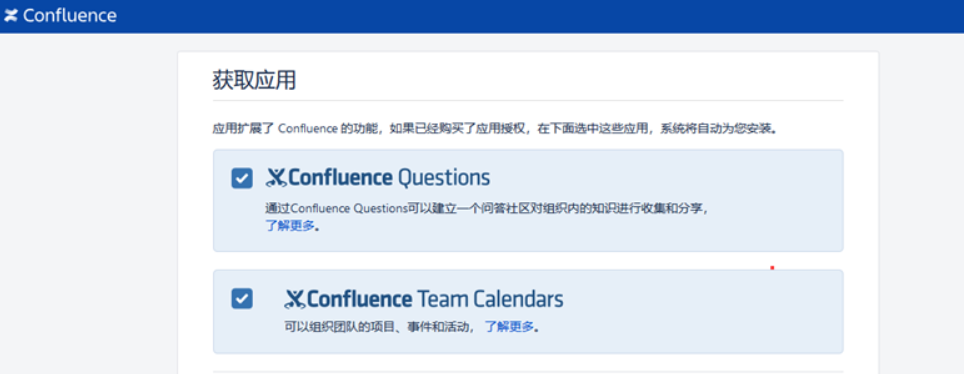
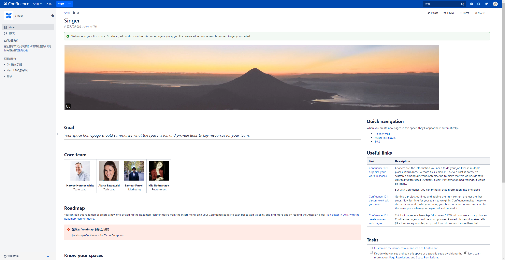

实战记录Confluence企业Wiki平台部署：从MySQL数据库搭建、Confluence应用部署到软件破解和配置调优的完整技术方案。

<!-- more -->

<h2 id="c-1-0" class="mh1">一、数据库部署和库创建</h2>

- 1.1 # 创建挂载文件夹

    ```
    mkdir -p /data
    mkdir -p /data/mysql
    ```

- 1.2 # 拉取镜像 服务器上已有Mysql镜像可直接使用已有Mysql镜像版本

    ```
    docker pull mysql:5.7 （可替换）
    ```

- 1.3 # 运行镜像 端口可改

    ```
    docker run -itd -p 3306:3306 --name wiki-mysql -e MYSQL_ROOT_PASSWORD=123456 --restart=always --restart=on-failure:1 --oom-score-adj -1000 --privileged=true --log-opt max-size=10m --log-opt max-file=1 -v /data/mysql:/var/lib/mysql  mysql:5.7
    ```

- 1.4 # 连接mysql

    ```
        docker exec -it wiki-mysql bash
        mysql -uroot -p123456
    ```

- 1.5 # 创建数据库

    ```
        create database confluence default character set utf8mb4 collate utf8mb4_unicode_ci;
    ```

- 1.5 # 创建用户并授权

    ```
      # 创建用户
      create user 'confluence'@'%' identified by 'confluence';
      
      # 用户授权
      grant all privileges on `confluence`.* to 'confluence'@'%' identified by 'confluence' with grant option;
      
      grant all privileges on `confluence`.* to 'confluence'@'localhost' identified by 'confluence' with grant option;
      
      # 应用
      flush privileges;
    ```

- 1.6 # 设置隔离等级

    ```
        set global tx_isolation='READ-COMMITTED';
    ```

<h2 id="c-2-0" class="mh1">二、软件部署</h2>

- 2.1 # 拷贝本地 xxx.bin 到服务器
  - <https://www.atlassian.com/software/confluence/download-archives> 官网下载地址

  ```
      scp atlassian-confluence-7.4.6-x64.bin root@ip:/opt/
  ```

- 2.2 # 添加可执行权限&执行

    ```
        chmod +x atlassian-confluence-7.4.6-x64.bin
        ./atlassian-confluence-7.4.6-x64.bin
    ```

- 2.3 # 期间需要输入O、 1、 i、 y 如下图所示
    

- 2.4 # 完成后 浏览器上打开服务器 ip:8090

- 2.5 Language 选择中文
    

- 2.6 选择产品安装 下一步
    

- 2.7 勾选所有扩展功能 下一步
    

- 2.8 复制服务器ID
    

<h2 id="c-3-0" class="mh1">三、软件破解</h2>

- 3.1 关闭服务

    ```
        sh /opt/atlassian/confluence/bin/stop-confluence.sh
    ```

- 3.2 拷贝文件atlassian-agent-v1.2.3.tar.gz 到服务器

    下载地址： https://github.com/qinyuxin99/atlassian-agent/releases
    
    ``` 
        # 拷贝到服务器
        scp atlassian-agent-v1.2.3.tar.gz root@ip:/opt/atlassian/
        # 解压缩
        tar -zxvf atlassian-agent-v1.2.3.tar.gz     
    ```

- 3.2 修改环境变量

    ```
        cd /opt/atlassian/confluence/bin

        [root@confluence bin]# vim setenv.sh

        #在文件最末尾添加这段，根据包的存放实际路径

        export JAVA_OPTS="-javaagent:/opt/atlassian/atlassian-agent-v1.2.3/atlassian-agent.jar ${JAVA_OPTS}"
    ```

- 3.3  拷贝MySQL驱动到服务器(用于数据库连接，后续配置会用到)

    ```
        scp mysqlconnectorjava5.1.44bin.jar root@ip:/opt/atlassian/confluence/confluence/WEB-INF/lib/
    ```  

- 3.4 开启服务

    ```
        sh /opt/atlassian/confluence/bin/start-confluence.sh
    ```      

- 3.5 Confluence 授权码获取

    ```
        cd /opt/atlassian/confluence/bin

        # 破解 
        java -jar /opt/atlassian/atlassian-agent-v1.2.3/atlassian-agent.jar -p conf -m 12345@qq.com -n confluence -o confluence -s 服务器ID(从页面获取)

        # 将执行得出的Code复制到页面上即可，按流程进行操作
    ```


- 3.6 confluence关闭启用命令

    ```
        停止：sh /opt/atlassian/confluence/bin/stop-confluence.sh
        启动：sh /opt/atlassian/confluence/bin/start-confluence.sh
    ```

- 3.7 登录web页面 localhost:8090 复制授权码并粘贴
    

<h2 id="c-4-0" class="mh1">四、软件配置</h2>

- 4.1 设置您的数据库 选择 我自己的数据库 下一步

- 4.2 数据库类型选择MySQl， 安装类型选择通过字符串 地址如下：

    ```
        jdbc:mysql://ip:port/confluence?useUnicode=true&characterEncoding=utf-8&autoReconnect=true
    ```

- 4.3 输入用户名 密码 测试连接 下一步

- 4.4 加载内容 选择空白站点 下一步

- 4.5 配置用户管理 选择 在Confluence中管理用户与组

- 4.6 配置系统管理员账户  admin@123456

- 4.7 设置成功
    

- 4.8 效果图

  

<h2 id="c-5-0" class="mh1">五、参考资源</h2>

- [Linux搭建confluence企业级WIKI](https://www.dczzs.com/articles/2021/09/14/1631581152758.html)
- [wiki的confluence 8.5.4安装部署](https://blog.csdn.net/weixin_44024436/article/details/135389431)
- [Confluence7.4安装并汉化](https://blog.whsir.com/post-5854.html)
- [Confluence官网下载地址](https://www.atlassian.com/software/confluence/download-archives)
- [为博客添加Gitalk评论插件](https://qiubaiying.github.io/2017/12/19/为博客添加-Gitalk-评论插件/)
- [wiki的confluence 8.5.4安装部署及破j](https://blog.csdn.net/weixin_44024436/article/details/135389431)

<hr aria-hidden="true" style=" border: 0; height: 2px; background: linear-gradient(90deg, transparent, #1bb75c, transparent); margin: 2rem 0; " />

<!-- 目录容器 -->
<div class="mi1">
    <strong>目录</strong>
        <ul style="margin: 10px 0; padding-left: 20px; list-style-type: none;">
            <li style="list-style-type: none;"><a href="#c-1-0">一、数据库部署和库创建</a></li>
            <ul style="padding-left: 15px; list-style-type: none;"></ul>
            <li style="list-style-type: none;"><a href="#c-2-0">二、软件部署</a></li>
            <ul style="padding-left: 15px; list-style-type: none;"></ul>
            <li style="list-style-type: none;"><a href="#c-3-0">三、软件破解</a></li>
            <ul style="padding-left: 15px; list-style-type: none;"></ul>
            <li style="list-style-type: none;"><a href="#c-4-0">四、软件配置</a></li>
            <ul style="padding-left: 15px; list-style-type: none;"></ul>
            <li style="list-style-type: none;"><a href="#c-5-0">五、参考资源</a></li>
            <ul style="padding-left: 15px; list-style-type: none;"></ul>
        </ul>
</div>

本技术手册将持续更新，欢迎提交Issue和Pull Request

