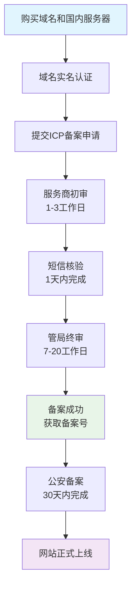

容器化应用项目实战记录

<!-- more -->

<h2 id="c-1-0" class="mh1">一、Docker镜像构建优化</h2>

### 1.1 Dockerfile优化配置

```dockerfile
# 第一阶段：构建阶段
FROM node:16-alpine AS builder

# 设置工作目录
WORKDIR /app

# 复制包管理文件
COPY package.json package-lock.json ./

# 安装依赖（使用ci确保一致性）
RUN npm ci --only=production

# 复制源代码并构建
COPY . .
RUN npm run build

# 第二阶段：生产阶段
FROM nginx:1.20-alpine

# 设置维护者信息
LABEL maintainer="your-team@company.com"

# 设置时区
RUN apk add --no-cache tzdata && \
    cp /usr/share/zoneinfo/Asia/Shanghai /etc/localtime && \
    echo "Asia/Shanghai" > /etc/timezone

# 复制配置文件
COPY default.conf /etc/nginx/conf.d/

# 从构建阶段复制构建产物
COPY --from=builder /app/dist /usr/share/nginx/html

# 设置目录权限
RUN chmod -R 755 /usr/share/nginx/html

# 声明健康检查
HEALTHCHECK --interval=30s --timeout=3s --retries=3 \
    CMD wget --quiet --tries=1 --spider http://localhost/ || exit 1

# 暴露端口
EXPOSE 80

# 启动Nginx（前台运行）
CMD ["nginx", "-g", "daemon off;"]
```

### 1.2 Nginx配置文件优化

```nginx
# default.conf - 优化版配置

server {
    listen 80;
    server_name localhost;
    
    # 根目录设置
    root /usr/share/nginx/html;
    index index.html;
    
    # 安全头设置
    add_header X-Frame-Options "SAMEORIGIN" always;
    add_header X-Content-Type-Options "nosniff" always;
    add_header X-XSS-Protection "1; mode=block" always;
    
    # Gzip压缩配置（优化传输）
    gzip on;
    gzip_min_length 1k;
    gzip_comp_level 6;
    gzip_types text/plain text/css text/javascript 
               application/json application/javascript 
               application/xml;
    gzip_vary on;
    
    # 静态文件缓存设置
    location ~* \.(jpg|jpeg|png|gif|ico|css|js)$ {
        expires 7d;
        add_header Cache-Control "public, immutable";
    }
    
    # 主要路由配置（支持前端路由）
    location / {
        try_files $uri $uri/ /index.html;
    }
    
    # 健康检查端点
    location /health {
        access_log off;
        return 200 "healthy\n";
        add_header Content-Type text/plain;
    }
}
```

<h2 id="c-2-0" class="mh1">二、部署脚本优化</h2>

### 2.1 镜像构建和推送脚本

```bash
#!/bin/bash
# push.sh - 镜像构建推送脚本

set -e  # 遇到错误立即退出

# 配置信息
IMAGE_NAME="your-repo/your-app"
IMAGE_TAG="v1.0-$(date +%Y%m%d)"

echo "🚀 开始构建镜像..."
docker build -t ${IMAGE_NAME}:${IMAGE_TAG} .

echo "🔐 登录Docker仓库..."
# 建议使用环境变量或配置文件存储凭证
docker login -u ${DOCKER_USER} -p ${DOCKER_PASS}

echo "📦 推送镜像到仓库..."
docker push ${IMAGE_NAME}:${IMAGE_TAG}

# 同时推送latest标签
docker tag ${IMAGE_NAME}:${IMAGE_TAG} ${IMAGE_NAME}:latest
docker push ${IMAGE_NAME}:latest

echo "✅ 镜像推送完成: ${IMAGE_NAME}:${IMAGE_TAG}"
```

### 2.2 服务器部署脚本

```bash
#!/bin/bash
# deploy.sh - 服务器部署脚本

set -e

# 应用配置
APP_NAME="your-app"
IMAGE_NAME="your-repo/your-app"
PORT=8080

echo "🔄 停止并移除旧容器..."
docker stop ${APP_NAME} || true
docker rm ${APP_NAME} || true

echo "🧹 清理无用镜像..."
docker image prune -f

echo "📥 拉取最新镜像..."
docker pull ${IMAGE_NAME}:latest

echo "🚀 启动新容器..."
docker run -d \
  --name ${APP_NAME} \
  --restart always \
  -p ${PORT}:80 \
  -e TZ=Asia/Shanghai \
  ${IMAGE_NAME}:latest

echo "📊 检查容器状态..."
sleep 3
docker ps -f name=${APP_NAME}

echo "✅ 部署完成！应用运行在端口: ${PORT}"
```

<h2 id="c-3-0" class="mh1">三、Docker Compose部署方案</h2>

### 3.1 多服务编排配置

```yaml
# docker-compose.yml - 优化版

version: '3.8'

# 自定义网络，容器间可相互访问
networks:
  app-network:
    driver: bridge

services:
  # 前端应用服务
  frontend:
    image: your-repo/your-frontend:latest
    container_name: frontend
    restart: always
    ports:
      - "80:80"
    networks:
      - app-network
    environment:
      - TZ=Asia/Shanghai
    healthcheck:
      test: ["CMD", "curl", "-f", "http://localhost/health"]
      interval: 30s
      timeout: 10s
      retries: 3

  # Nginx反向代理（可选）
  nginx-proxy:
    image: nginx:alpine
    container_name: nginx-proxy
    restart: always
    ports:
      - "443:443"
      - "80:80"
    volumes:
      - ./nginx/conf.d:/etc/nginx/conf.d
      - ./ssl:/etc/nginx/ssl
    networks:
      - app-network
    depends_on:
      - frontend
```

### 3.2 简化的Docker Compose配置

```yaml
# docker-compose.simple.yml - 简单应用配置

version: '3'

services:
  app:
    image: your-repo/your-app:latest
    container_name: my-app
    restart: unless-stopped
    ports:
      - "3000:80"
    volumes:
      # 挂载配置文件（可选）
      - ./config:/app/config
    environment:
      - NODE_ENV=production
      - API_URL=https://api.example.com
```

<h2 id="c-4-0" class="mh1">四、域名与网络配置</h2>

### 4.1 域名解析配置

| 记录类型 | 主机记录 | 记录值 | TTL | 说明 |
|---------|---------|--------|-----|------|
| A | alg | 47.87.204.169 | 600 | 主域名解析 |
| A | www | 47.87.204.169 | 600 | www子域名 |
| CNAME | * | alg.cpenny.club | 600 | 泛解析 |
| TXT | @ | v=spf1 include:_spf.google.com ~all | 3600 | SPF记录 |
| TXT | _dmarc | v=DMARC1; p=none; rua=mailto:dmarc@cpenny.club | 3600 | DMARC记录 |

### 4.2 Nginx反向代理配置（生产环境）

```nginx
# /etc/nginx/sites-available/alg.cpenny.club

upstream frontend_backend {
    server frontend-app:80;
    keepalive 32;
}

server {
    listen 80;
    server_name alg.cpenny.club www.alg.cpenny.club;
    
    # 重定向到HTTPS
    return 301 https://$server_name$request_uri;
}

server {
    listen 443 ssl http2;
    server_name alg.cpenny.club www.alg.cpenny.club;
    
    # SSL配置
    ssl_certificate /etc/letsencrypt/live/alg.cpenny.club/fullchain.pem;
    ssl_certificate_key /etc/letsencrypt/live/alg.cpenny.club/privkey.pem;
    
    # SSL优化参数
    ssl_session_cache shared:SSL:10m;
    ssl_session_timeout 10m;
    ssl_protocols TLSv1.2 TLSv1.3;
    
    # 安全头
    add_header Strict-Transport-Security "max-age=31536000; includeSubDomains" always;
    add_header Content-Security-Policy "default-src 'self'; script-src 'self' 'unsafe-inline' cdn.jsdelivr.net; style-src 'self' 'unsafe-inline';" always;
    
    # 代理设置
    location / {
        proxy_pass http://frontend_backend;
        proxy_http_version 1.1;
        proxy_set_header Upgrade $http_upgrade;
        proxy_set_header Connection "upgrade";
        proxy_set_header Host $host;
        proxy_set_header X-Real-IP $remote_addr;
        proxy_set_header X-Forwarded-For $proxy_add_x_forwarded_for;
        proxy_set_header X-Forwarded-Proto $scheme;
        proxy_set_header X-Forwarded-Host $host;
        proxy_set_header X-Forwarded-Port $server_port;
        
        # 超时设置
        proxy_connect_timeout 60s;
        proxy_send_timeout 60s;
        proxy_read_timeout 60s;
        
        # 缓冲设置
        proxy_buffering on;
        proxy_buffer_size 4k;
        proxy_buffers 8 4k;
        
        # 禁用缓冲
        proxy_request_buffering off;
    }
    
    # 静态文件直接服务
    location ~* \.(js|css|png|jpg|jpeg|gif|ico|svg|woff|woff2|ttf|eot)$ {
        expires 1y;
        add_header Cache-Control "public, immutable";
        proxy_pass http://frontend_backend;
    }
    
    # 验证文件访问
    location = /tencent6216454472508417133.txt {
        proxy_pass http://frontend_backend;
    }
    
    # 健康检查
    location /health {
        access_log off;
        proxy_pass http://frontend_backend/health;
    }
    
    # 阻止敏感文件访问
    location ~ /\.(git|env|ht) {
        deny all;
        return 404;
    }
    
    # 日志配置
    access_log /var/log/nginx/alg.cpenny.club.access.log json_combined buffer=32k flush=5s;
    error_log /var/log/nginx/alg.cpenny.club.error.log warn;
}
```

<h2 id="c-5-0" class="mh1">五、实用运维命令</h2>

### 5.1 常用Docker命令

```bash
# 查看容器日志
docker logs -f [容器名]

# 查看容器资源使用
docker stats [容器名]

# 进入容器
docker exec -it [容器名] /bin/sh

# 查看所有容器状态
docker ps -a

# 批量清理无用容器和镜像
docker system prune -f

# 查看镜像信息
docker image inspect [镜像名]

# 重启容器
docker restart [容器名]
```

### 5.2 日志查看和分析

```bash
# 查看实时日志
docker logs --tail 100 -f [容器名]

# 查看指定时间的日志
docker logs --since 1h [容器名]

# 将日志输出到文件
docker logs [容器名] > app.log

# 查看错误日志
docker logs [容器名] | grep -i error
```

### 5.3 健康检查和监控

```bash
# 检查容器健康状态
docker inspect --format='{{json .State.Health}}' [容器名]

# 查看容器基本信息
docker inspect [容器名]

# 查看容器端口映射
docker port [容器名]

# 查看容器运行状态
docker stats --no-stream [容器名]
```

<h2 id="c-6-0" class="mh1">六、域名备案与认证</h2>

### 6.1 国内备案完整流程



**备案材料准备清单：**

1. **个人备案**：身份证正反面扫描件、本人手持身份证照片、网站真实性核验单
2. **网站信息**：
    - 网站名称：提升个人能力
    - 网站类型：博客/个人空间
    - 网站内容描述：

    ```
    本网站为个人网站，主要是分享一些个人的写作文章。
    包括：1、生活心得，日常总结；2、学习心得，方法经验；3、技术文章等专业相关的知识分享。
    ```

3. **备案号放置要求**：备案通过后，必须在网站首页底部添加备案号，并链接至工信部网站

### 6.2 微信认证与验证文件管理

**重要区别说明：**

- **微信公众平台认证**：年审制，300元/年，获取认证标识和高级接口
- **微信站长平台验证**：免费，验证网站所有权，仅需文件验证

**Nginx验证文件配置（已整合到完整配置中）：**

```nginx
# 已在 default.conf 中配置，确保放在 location / 之前
location = /tencent6216454472508417133.txt {
    # 假设文件存放在容器内的 /usr/share/nginx/html/public/ 目录
    alias /usr/share/nginx/html/public/tencent6216454472508417133.txt;
}

# 其他搜索引擎验证文件（同目录管理）
location = /Baidu_verify_xxxxx.txt {
    alias /usr/share/nginx/html/public/Baidu_verify_xxxxx.txt;
}

location = /googlexxxxx.html {
    alias /usr/share/nginx/html/public/googlexxxxx.html;
}
```

**验证文件部署步骤：**

1. 在微信/百度/谷歌站长平台获取验证文件
2. 将文件放入项目 `public/` 目录
3. 确保Dockerfile复制了public目录：`COPY public/ /usr/share/nginx/html/public/`
4. 重新构建和部署镜像
5. 访问 `https://alg.cpenny.club/tencent6216454472508417133.txt` 确认可访问
6. 在站长平台完成验证

<h2 id="c-7-0" class="mh1">七、汇玩项目配置文件参考</h2>

- nginx.conf 配置文件：

```nginx
user nginx;
worker_processes auto;

error_log /var/log/nginx/error.log warn;
pid /var/run/nginx.pid;

events {
    worker_connections 1024;
    multi_accept on;
    use epoll;
}

http {
    include /etc/nginx/mime.types;
    default_type application/octet-stream;

    log_format main '$remote_addr - $remote_user [$time_local] "$request" '
                    '$status $body_bytes_sent "$http_referer" '
                    '"$http_user_agent" "$http_x_forwarded_for"';

    access_log /var/log/nginx/access.log main;
    
    # Performance optimizations
    sendfile on;
    tcp_nopush on;
    tcp_nodelay on;
    keepalive_timeout 65;
    keepalive_requests 1000;
    reset_timedout_connection on;
    client_body_timeout 15;
    client_header_timeout 15;
    send_timeout 15;
    
    # Buffer size optimizations
    client_body_buffer_size 16k;
    client_header_buffer_size 1k;
    client_max_body_size 8m;
    large_client_header_buffers 4 8k;
    
    # Gzip compression
    gzip on;
    gzip_comp_level 5;
    gzip_min_length 256;
    gzip_proxied any;
    gzip_vary on;
    gzip_types
        application/atom+xml
        application/javascript
        application/json
        application/ld+json
        application/manifest+json
        application/rss+xml
        application/vnd.geo+json
        application/vnd.ms-fontobject
        application/x-font-ttf
        application/x-web-app-manifest+json
        application/xhtml+xml
        application/xml
        font/opentype
        image/bmp
        image/svg+xml
        image/x-icon
        text/cache-manifest
        text/css
        text/plain
        text/vcard
        text/vnd.rim.location.xloc
        text/vtt
        text/x-component
        text/x-cross-domain-policy;

    server {
        listen 80;
        server_name www.xxxx.com;
        # 301永久重定向
        return 301 https://www.xxxx.com$request_uri;
    }
   
    server {
        listen 443 ssl;
        server_name www.xxxx.com;
 
        ssl_certificate x.pem; 
        ssl_certificate_key x.key; 
 
        ssl_session_cache shared:SSL:1m;
        ssl_session_timeout 5m;
        ssl_ciphers ECDHE-RSA-AES128-GCM-SHA256:ECDHE:ECDH:AES:HIGH:!NULL:!aNULL:!MD5:!ADH:!RC4; 
        ssl_protocols TLSv1 TLSv1.1 TLSv1.2;
        ssl_prefer_server_ciphers on;
        location /tencent6216454472508417133.txt {
            alias ./public/tencent6216454472508417133.txt;
        }
        location / {
            root /etc/nginx/public;
            proxy_pass http://x.x.x.x:8080;
        }
    }  

    server {
        listen 443 ssl;
        server_name store.xxxx.com;

        ssl_certificate store.pem;
        ssl_certificate_key store.key;

        ssl_session_cache shared:SSL:1m;
        ssl_session_timeout 5m;
        ssl_ciphers ECDHE-RSA-AES128-GCM-SHA256:ECDHE:ECDH:AES:HIGH:!NULL:!aNULL:!MD5:!ADH:!RC4;
        ssl_protocols TLSv1 TLSv1.1 TLSv1.2;
        ssl_prefer_server_ciphers on;
        location / {
            root /etc/nginx/public;
            proxy_pass http://x.x.x.x:8081;
        }
    }  
}
```

- docker-compose.yml 配置文件：

```yaml
version: '3'
services:
  mysql57:
    image: mysql:5.7.44
    restart: always
    container_name: mysql57
    hostname: mysql57
    environment:
      MYSQL_ROOT_PASSWORD: 2755ba37b72
      TZ: Asia/Shanghai
    ports:
      - 13306:3306
    volumes:
      - ./data:/var/lib/mysql
      - /home/mysql/conf/my.cnf:/etc/mysql/my.cnf
    command:
      --max_connections=1000
      --character-set-server=utf8mb4
      --collation-server=utf8mb4_general_ci
      --default-authentication-plugin=mysql_native_password
    networks:
      - xxxx
    healthcheck:
      test: ["CMD-SHELL", "curl --silent localhost:3306 >/dev/null || exit 1"]
      interval: 10s
      timeout: 10s
      retries: 3
  redis50:
    image: redis:5.0.14
    container_name: redis50
    ports:
      - "16379:6379"
    restart: always
    networks:
      - xxxx
    command: --appendonly yes
    volumes:
      - /home/redis/data:/data
    logging:
      options:
        max-size: 100m
  x:
    image: x:v4.5
    container_name: x
    ports:
      - "8000:8000"
      - "9000:9000"
    volumes:
      - /root/myz/conf:/app/conf
    networks:
      - xxxx
    restart: unless-stopped
  x_h5:
    image: x-h5:v0.8
    container_name: x_h5
    ports:
      - "8080:80"
    networks:
      - xxxx
    restart: unless-stopped

  x_manage:
    image: my-frontend-management:v1.0.2
    container_name: x_manage
    ports:
      - "8081:80"
    networks:
      - xxxx
    restart: unless-stopped

# 连接外部网络
networks:
  x:
    external: true
```

- 滑动窗口跳转页面(作中转):

```html
<!DOCTYPE html>
<html lang="zh-CN">

<head>
    <meta charset="UTF-8">
    <meta name="viewport" content="width=device-width, initial-scale=1.0">
    <title>滑动验证 - 访问汇玩</title>
    <style>
        * {
            margin: 0;
            padding: 0;
            box-sizing: border-box;
        }

        body {
            font-family: 'PingFang SC', 'Microsoft YaHei', sans-serif;
            background: linear-gradient(135deg, #667eea 0%, #764ba2 100%);
            min-height: 100vh;
            display: flex;
            justify-content: center;
            align-items: center;
            padding: 20px;
        }

        .container {
            background: white;
            border-radius: 20px;
            padding: 40px;
            box-shadow: 0 20px 40px rgba(0, 0, 0, 0.1);
            text-align: center;
            max-width: 400px;
            width: 100%;
        }

        .logo {
            width: 80px;
            height: 80px;
            margin: 0 auto 20px;
            background: linear-gradient(45deg, #ff6b6b, #ee5a24);
            border-radius: 50%;
            display: flex;
            align-items: center;
            justify-content: center;
            color: white;
            font-size: 24px;
            font-weight: bold;
        }

        h1 {
            color: #333;
            margin-bottom: 10px;
            font-size: 24px;
        }

        .description {
            color: #666;
            margin-bottom: 30px;
            line-height: 1.6;
        }

        .slider-container {
            background: #f8f9fa;
            border-radius: 25px;
            height: 50px;
            position: relative;
            margin: 30px 0;
            border: 2px solid #e9ecef;
            overflow: hidden;
        }

        .slider-bg {
            position: absolute;
            top: 0;
            left: 0;
            height: 100%;
            background: linear-gradient(90deg, #4CAF50, #45a049);
            border-radius: 25px;
            width: 0;
            transition: width 0.3s ease;
        }

        .slider-handle {
            position: absolute;
            top: 0;
            left: 0;
            width: 50px;
            height: 46px;
            background: white;
            border-radius: 25px;
            cursor: grab;
            display: flex;
            align-items: center;
            justify-content: center;
            box-shadow: 0 2px 10px rgba(0, 0, 0, 0.2);
            z-index: 2;
            border: 2px solid #ddd;
        }

        .slider-handle:active {
            cursor: grabbing;
            box-shadow: 0 2px 15px rgba(0, 0, 0, 0.3);
        }

        .slider-handle::after {
            content: '→';
            font-size: 18px;
            color: #666;
        }

        .slider-text {
            position: absolute;
            width: 100%;
            height: 100%;
            display: flex;
            align-items: center;
            justify-content: center;
            color: #666;
            font-weight: 500;
            z-index: 1;
        }

        .success-message {
            color: #4CAF50;
            font-weight: bold;
            margin: 20px 0;
            opacity: 0;
            transform: translateY(20px);
            transition: all 0.5s ease;
        }

        .success-message.show {
            opacity: 1;
            transform: translateY(0);
        }

        .countdown {
            font-size: 14px;
            color: #666;
            margin-top: 10px;
        }

        .reset-btn {
            margin-top: 20px;
            padding: 10px 20px;
            background: #6c757d;
            color: white;
            border: none;
            border-radius: 5px;
            cursor: pointer;
            display: none;
        }

        .reset-btn:hover {
            background: #5a6268;
        }

        @keyframes shake {

            0%,
            100% {
                transform: translateX(0);
            }

            25% {
                transform: translateX(-5px);
            }

            75% {
                transform: translateX(5px);
            }
        }

        .shake {
            animation: shake 0.3s ease-in-out;
        }
    </style>
</head>

<body>
    <div class="container">
        <div class="logo">✓</div>
        <h1>滑动验证</h1>
        <p class="description">请按住滑块，拖动到最右侧完成验证</p>

        <div class="slider-container">
            <div class="slider-bg" id="sliderBg"></div>
            <div class="slider-text" id="sliderText">滑动验证</div>
            <div class="slider-handle" id="sliderHandle"></div>
        </div>

        <div class="success-message" id="successMessage">
            验证成功！正在跳转到汇玩...
        </div>

        <div class="countdown" id="countdown"></div>
        <button class="reset-btn" id="resetBtn">重新验证</button>
    </div>

    <script>
        document.addEventListener('DOMContentLoaded', function () {
            const sliderHandle = document.getElementById('sliderHandle');
            const sliderBg = document.getElementById('sliderBg');
            const sliderText = document.getElementById('sliderText');
            const successMessage = document.getElementById('successMessage');
            const countdown = document.getElementById('countdown');
            const resetBtn = document.getElementById('resetBtn');
            const container = document.querySelector('.slider-container');

            let isVerified = false;
            let isDragging = false;
            let startX = 0;
            let currentX = 0;
            const maxWidth = container.offsetWidth - sliderHandle.offsetWidth;

            // 鼠标按下事件
            sliderHandle.addEventListener('mousedown', function (e) {
                if (isVerified) return;

                isDragging = true;
                startX = e.clientX;
                sliderHandle.style.transition = 'none';
                document.addEventListener('mousemove', handleMove);
                document.addEventListener('mouseup', handleUp);
            });

            // 触摸开始事件（移动端支持）
            sliderHandle.addEventListener('touchstart', function (e) {
                if (isVerified) return;

                isDragging = true;
                startX = e.touches[0].clientX;
                sliderHandle.style.transition = 'none';
                document.addEventListener('touchmove', handleMove);
                document.addEventListener('touchend', handleUp);
            });

            function handleMove(e) {
                if (!isDragging || isVerified) return;

                const clientX = e.type.includes('mouse') ? e.clientX : e.touches[0].clientX;
                currentX = clientX - startX;

                // 限制滑动范围
                currentX = Math.max(0, Math.min(currentX, maxWidth));

                // 更新滑块位置和背景
                sliderHandle.style.left = currentX + 'px';
                sliderBg.style.width = currentX + 'px';

                // 如果滑动到最右边，验证成功
                if (currentX >= maxWidth - 2) {
                    verifySuccess();
                }
            }

            function handleUp() {
                if (isVerified) return;

                isDragging = false;
                sliderHandle.style.transition = 'left 0.3s ease';
                sliderBg.style.transition = 'width 0.3s ease';

                // 如果没有滑动到最右边，复位
                if (currentX < maxWidth) {
                    resetSlider();
                }

                // 移除事件监听
                document.removeEventListener('mousemove', handleMove);
                document.removeEventListener('mouseup', handleUp);
                document.removeEventListener('touchmove', handleMove);
                document.removeEventListener('touchend', handleUp);
            }

            function resetSlider() {
                sliderHandle.style.left = '0px';
                sliderBg.style.width = '0px';
                currentX = 0;

                // 添加抖动效果
                sliderHandle.classList.add('shake');
                setTimeout(() => {
                    sliderHandle.classList.remove('shake');
                }, 300);
            }

            function verifySuccess() {
                isVerified = true;
                sliderText.textContent = '验证成功';
                successMessage.classList.add('show');

                // 显示倒计时
                let seconds = 3;
                countdown.textContent = `页面将在 ${seconds} 秒后跳转...`;

                const countdownInterval = setInterval(() => {
                    seconds--;
                    if (seconds > 0) {
                        countdown.textContent = `页面将在 ${seconds} 秒后跳转...`;
                    } else {
                        clearInterval(countdownInterval);
                        window.location.href = 'http://sale.huiwan.org';
                    }
                }, 1000);

                // 显示重置按钮
                setTimeout(() => {
                    resetBtn.style.display = 'block';
                }, 2000);
            }

            // 重置按钮事件
            resetBtn.addEventListener('click', function () {
                isVerified = false;
                sliderHandle.style.left = '0px';
                sliderBg.style.width = '0px';
                sliderText.textContent = '滑动验证';
                successMessage.classList.remove('show');
                countdown.textContent = '';
                resetBtn.style.display = 'none';
                currentX = 0;
            });
        });
    </script>
</body>

</html>

```

外网也有部署，服务器购买cheapvpsbox.com(建议地址选香港，否则贼卡)>, 域名购买dash.cloudflare.com(需要Visa卡)。

<!-- 目录容器 -->
<div class="mi1">
    <strong>目录</strong>
        <ul style="margin: 10px 0; padding-left: 20px; list-style-type: none;">
            <li style="list-style-type: none;"><a href="#c-1-0">一、Docker镜像构建优化</a></li>
            <ul style="padding-left: 15px; list-style-type: none;"></ul>
            <li style="list-style-type: none;"><a href="#c-2-0">二、部署脚本优化</a></li>
            <ul style="padding-left: 15px; list-style-type: none;"></ul>
            <li style="list-style-type: none;"><a href="#c-3-0">三、Docker Compose部署方案</a></li>
            <ul style="padding-left: 15px; list-style-type: none;"></ul>
            <li style="list-style-type: none;"><a href="#c-4-0">四、域名与网络配置</a></li>
            <ul style="padding-left: 15px; list-style-type: none;"></ul>
            <li style="list-style-type: none;"><a href="#c-5-0">五、实用运维命令</a></li>
            <ul style="padding-left: 15px; list-style-type: none;"></ul>
            <li style="list-style-type: none;"><a href="#c-6-0">六、域名备案与认证</a></li>
            <ul style="padding-left: 15px; list-style-type: none;"></ul>
            <li style="list-style-type: none;"><a href="#c-7-0">七、汇玩项目配置文件参考</a></li>
            <ul style="padding-left: 15px; list-style-type: none;"></ul>
        </ul>
</div>

<style>
    /* 一级段落 */
    .mh1 {
      text-align: center;
      color: black;
      background: linear-gradient(#fff 60%, #b2e311ff 40%);
      margin: 1.4em 0 1.1em;
      font-size: 1.4em;
      font-family: 'roboto', 'Iowan Old Style', 'Ovo', 'Hoefler Text', Georgia, 'Times New Roman', 'TIBch', 'Source Han Sans', 'PingFangSC-Regular', 'Hiragino Sans GB', 'STHeiti', 'Microsoft Yahei', 'Droid Sans Fallback', 'WenQuanYi Micro Hei', sans-serif;
      line-height: 1.7;
      letter-spacing: .33px;
    }
    /* 二级段落 */

    .mh2 {
      -webkit-text-size-adjust: 100%; letter-spacing: .33px; font-family: 'roboto', 'Iowan Old Style', 'Ovo', 'Hoefler Text', Georgia, 'Times New Roman', 'TIBch', 'Source Han Sans', 'PingFangSC-Regular', 'Hiragino Sans GB', 'STHeiti', 'Microsoft Yahei', 'Droid Sans Fallback', 'WenQuanYi Micro Hei', sans-serif; line-height: 1.7; color: #1cc03cff; border-left: 4px solid #1bb75cff; padding-left: 6px; margin: 1.4em 0 1.1em;
    }

    /* 目录 高度、宽度 可自行调整*/
    .mi1 {
      position: fixed; bottom: 240px; right: 10px; width: 240px; height: 100px; background: #f8f9fa; border: 1px solid #e9ecef; border-radius: 8px; padding: 15px; overflow-y: auto; font-family: 'roboto', 'Iowan Old Style', 'Ovo', 'Hoefler Text', Georgia, 'Times New Roman', 'TIBch', 'Source Han Sans', 'PingFangSC-Regular', 'Hiragino Sans GB', 'STHeiti', 'Microsoft Yahei', 'Droid Sans Fallback', 'WenQuanYi Micro Hei', sans-serif; font-size: 14px; line-height: 1.15; color: #444; letter-spacing: 0.33px; transition: all 0.3s ease;
    }

</style>
