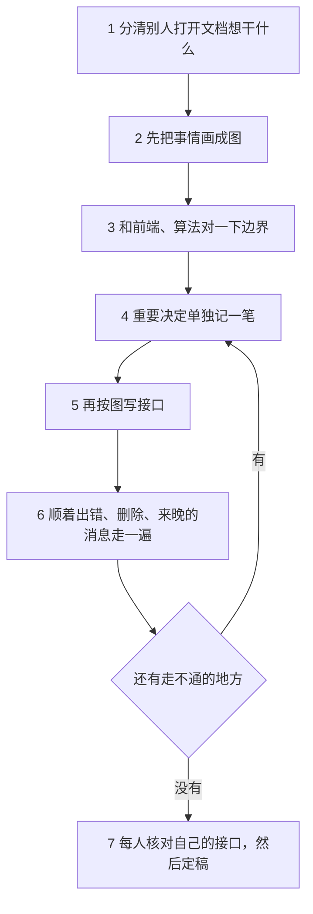
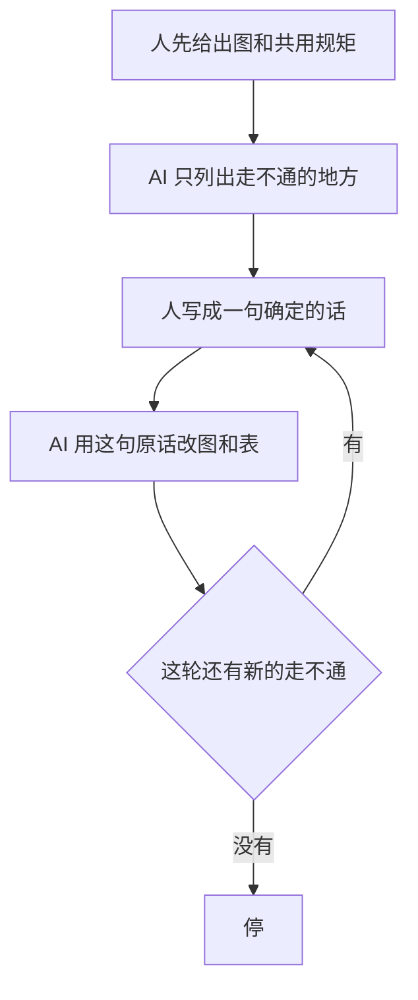
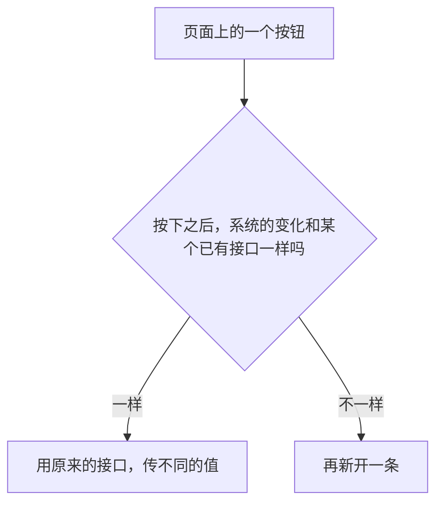

本文记录一套整理 **多端对接文档** 的可复用写法：先分清别人打开文档想干什么，再把事情画成图，重要决定单独记一笔，最后才写接口字段。例子用自训练平台：预警墙上的结果标进数据集，训练出新模型，发回布控，墙上再出现新的预警。

<!-- more -->

<h2 id="c-1-0" class="mh1">一、先把边界想清楚</h2>

> 接口少、人少的时候，口头说清楚就够了。一旦变成「预警进数据集，训练出新模型，再发回布控」，中间还有失败、删除、消息晚到，就需要一份大家一起看的文档。

做自训练、自定义算法这类功能时，手里通常同时有三份材料：产品说明、现有系统的接口、算法侧的训练和推理。前端看着页面，业务看着布控和数据集，算法看着模型和算力。三份材料各写各的，会一开会，每个人脑子里都是一条不同的线。

不先把线画出来，联调时才会发现：发布失败了数据已经被改掉，回滚又多出来一个谁都不认的接口。

比较稳的做法其实不复杂。先分清别人打开文档想干什么，再把事情画成图，重要决定单独记一笔，最后才写接口字段。写完不必把全文再读一遍，专门顺着失败和删除走一遍，看有没有走不通的地方。

<h2 id="c-1-1" class="mh2">1.1 这种文档是什么</h2>

它是给前端、业务、算法一起看的对接说明。它回答三条：

- 这条业务线谁先调用谁
- 做成了，谁去改状态
- 失败了，谁都不要改数据

带新人从零把功能做一遍，那是教程，另写一份。这里只负责把对接边界说清楚。

<h2 id="c-1-2" class="mh2">1.2 别人打开文档想干什么</h2>

别人打开它，通常是这三种目的，写的时候就按这三种分开：

- 想搞懂整件事怎么转：看开头的图
- 想知道自己这一端要做什么：看分端清单
- 想查某个接口有哪些字段：看后面的协议

三种内容可以放在同一个文件里，开会时好翻。不要挤在同一段里，又讲原因又贴报文，读的人不知道该信哪句。

<h2 id="c-1-3" class="mh2">1.3 六个核心概念</h2>

整理这种文档，记住下面六件事就够了。

1. **先看读者来干什么。** 搞懂全局、知道自己做什么、查字段，这是三件事。分开写，读的人才找得到。
2. **图比字段先写。** 一条线一张「谁先叫谁」的图。做不成从哪退出，另画一张。字段写早了，主线一改，整张表都要重写。
3. **决定单独记一笔。** 正文写现在的规矩。另外用一张小表写下：当时定了什么、没采用什么。以后问「为什么没有单独的回滚接口」，看这张表。
4. **接口是图的文字版。** 先写大家共用的规矩，再写各端要做什么，最后才写每个接口的字段。代码里的 proto 跟着文档走。
5. **评审专走容易卡住的路。** 不把文章再读一遍。专门走失败、删除、消息来晚、重复提交、好几个任务共用一个模型。
6. **页面上一个按钮，不一定是一个新接口。** 先看按下之后系统实际变了什么。和已有接口是同一件事，就复用，传不同的值。

听起来步骤不少。下面按顺序看，每一步只做一件事，并对应到自训练这次是怎么落的。

<h2 id="c-2-0" class="mh1">二、建议的先后顺序</h2>

> 前面一步没做完，先不要写接口字段。第六步如果又发现走不通，回到第四步把结论记上，再改图和接口，不要在字段表里临时加一句。

<h2 id="c-2-1" class="mh2">2.1 七步流程</h2>

<h2 id="c-2-2" class="mh2">2.2 自训练这次的主线</h2>

自训练这次要讲清的主线是一个圈：

旁边还有一条不进这个圈的旁路：上传一张图，看新模型的效果。试完不进预警墙，也不算发布。

<h2 id="c-3-0" class="mh1">三、分清别人来查什么</h2>

<h2 id="c-3-1" class="mh2">3.1 先看系统在干什么</h2>

先用十分钟看材料，只回答「系统在干什么」，先不记字段。自训练这一眼能留下的是四端：业务 Go 管数据集和训练，业务 C++ 管布控和预警墙，算法训练管训练，算法调度管推理、拉模型和消息。

然后再看两遍。一遍看状态和失败：谁写入、失败时停在哪。一遍拿产品说明、离线标注格式、现有布控接口对一下，记下三份材料哪里说法不一样。不一样的地方先空着，开会再填，不要提前写死。

<h2 id="c-3-2" class="mh2">3.2 按三种读者分块</h2>

写的时候按三种读者分成三块：

| 读者想做的事 | 文档里放什么 | 自训练这次放在哪 |
| --- | --- | --- |
| 搞懂整件事怎么转 | 闭环和时序图 | 开头的图 |
| 知道自己这一端要做什么 | 分端清单 | 按 Go、C++、训练、调度分开列 |
| 查某个接口的字段 | 路径、字段、示例 | 协议那一节 |

<h2 id="c-4-0" class="mh1">四、先把事情画成图</h2>

<h2 id="c-4-1" class="mh2">4.1 一条线一张图</h2>

一条业务线画一张图，只回答「谁先调用谁」。失败的分支多了，另画一张，画出「不行的时候从哪出去」。不要在同一张图里套很多层「如果」。

图就写在这份 Markdown 里。另存成图片之后，接口改了，图经常忘了改。

<h2 id="c-4-2" class="mh2">4.2 说得出主线再往下写</h2>

材料看完先放下。过一会儿不看笔记，用自己的话说主线。说得出类似下面这种句子，再往下写：

> 开布控时，前端不选模型。业务去问能力平台：这个类型现在该用哪一个。已经在跑就接着用，没在跑才去问调度有没有算力，然后再加载。

说不出来，说明还没懂，先别写字段。

<h2 id="c-4-3" class="mh2">4.3 自训练这次画了三条线</h2>

自训练这次实际画了三条线：布控到预警墙，数据集到训练（含发布和回滚），以及效果检测。效果检测是同步调用，和预警墙不是一条路。

<h2 id="c-5-0" class="mh1">五、和前端、算法对边界</h2>

<h2 id="c-5-1" class="mh2">5.1 会上只带图和未决问题</h2>

会上只带图，和还没定下来的问题。字段表留到图稳定之后。

<h2 id="c-5-2" class="mh2">5.2 这一轮只对三件事</h2>

- 这个动作谁调用、谁提供
- 做成了，谁去改状态
- 失败了，谁都不要改数据

前端关心页面调哪条、失败时提示从哪来。算法关心训练进程碰不碰业务库、结束消息谁来发。业务关心「好几个布控共用一个模型」时，停掉一个要不要把模型卸掉。

<h2 id="c-5-3" class="mh2">5.3 本轮不谈什么</h2>

数据库表怎么建、模型文件怎么加载，这轮不谈。那是各端自己的实现。

<h2 id="c-6-0" class="mh1">六、重要决定单独记一笔</h2>

<h2 id="c-6-1" class="mh2">6.1 正文写规矩，小表写拍板</h2>

正文写「现在的规矩是什么」。另外留一张小表，写「当时定了什么、没采用什么」。这张表就是以后翻旧账的地方。

<h2 id="c-6-2" class="mh2">6.2 自训练这次的拍板</h2>

自训练这次，这类决定包括：

| 定下来的 | 没采用的 |
| --- | --- |
| 回滚就是再发布上一个模型 | 给 C++ 再做一个回滚接口 |
| 训练结束以消息为准 | 用进度查询去改数据库里的状态 |
| 只有检出了才发完成消息 | 顺便带回一个分数 |
| 推理用的卡和训练用的卡分开 | 创建训练时先占住训练卡，占不到就不建任务 |

产品说明、现有接口、标注格式说法不一致时，以这张表为准，再去改图和协议。

<h2 id="c-6-3" class="mh2">6.3 和旧接口的关系写成一句能执行的话</h2>

和旧接口的关系也要写成一句能执行的话。要么写明「在旧接口上加哪几个字段」，要么写明「新开一个，旧的不动，原因是什么」。两句都留着，例如「可以补充，但不建议」，写代码的人不知道听哪句。

<h2 id="c-7-0" class="mh1">七、再按图写接口</h2>

<h2 id="c-7-1" class="mh2">7.1 接口跟着图写</h2>

接口跟着图写，顺序不要倒：

<h2 id="c-7-2" class="mh2">7.2 共用规矩只写一处</h2>

「大家共用的规矩」只在一处写全。自训练这次，这处写了四件共用的事：一个模型一个编号；训练状态大家用同一套词；算法走 HTTP，业务走 gRPC，事件走消息队列；字段名用驼峰。其他章节写成「见某一节」。同一句话抄很多遍，以后改一处、漏一处，文档里就会出现两种说法。

文档里的路径和字段定了，再写 proto。代码跟着文档改。

<h2 id="c-7-3" class="mh2">7.3 分端清单怎么列</h2>

各端清单按「谁提供」来列，每行只要三列：接口名、谁调用、一句话职责。第二次开会不再讨论主线对不对，每人只核对：

- 我要提供的接口在不在
- 我要调用的接口在不在
- 失败的时候我改不改数据

<h2 id="c-7-4" class="mh2">7.4 改文档也从左到右</h2>

改文档也按上面那张图从左到右。只改了字段示例、图还是旧的，会上还是各说各的。

<h2 id="c-8-0" class="mh1">八、顺着容易卡住的路走一遍</h2>

<h2 id="c-8-1" class="mh2">8.1 专走失败、删除、来晚</h2>

这一步不把文章再读一遍。专门走那些平时容易漏的情况：失败了、删掉了、消息来晚了、同一张图又提交了一次、好几个布控共用一个模型。

<h2 id="c-8-2" class="mh2">8.2 AI 怎么用</h2>

这里可以用 AI，但用法要收住：

不要让它把整篇重写。它会把已经定好的话换一种说法，意思就变了。每轮只让它做一件事：列出走不通的地方，或者按你给的那句话，改指定的几节。

<h2 id="c-8-3" class="mh2">8.3 自训练这次补上的缺口</h2>

自训练这次走完，补上的都是联调时才会发现的：

| 遇到的情况 | 怎么处理 |
| --- | --- |
| 发布失败 | 数据库保持发布前的样子 |
| 这种类型现在没有布控在跑 | 不能发布，也不能回滚 |
| 记录已经删了，结束消息才到 | 把这条消息丢掉 |
| 删的是当前正在用的模型，但布控已经停了 | 只退回上一版，更早的不再接 |
| 同一张图又标了一次 | 改原来那条，不新增一条 |
| 在预警墙上标注 | 墙上只改状态；真正进数据集，由前端直接调能力平台 |
| 这边以为模型还在跑，调度那边其实已经没了 | 复用之前先确认还活着，不在就重新加载 |

一轮走下来没有新的缺口，并且分端清单、协议清单、错误表说的是同一句话，这一步就可以停。

<h2 id="c-9-0" class="mh1">九、定稿前再收一次</h2>

<h2 id="c-9-1" class="mh2">9.1 页面按钮不要原样变成接口</h2>

定稿看两件事。

第一件：页面上的按钮，不要原样变成接口。先看按下之后，系统实际发生的变化，是不是某条已有接口已经做过的事。

修改、重置、设置，如果改的是同一批资料，状态变化也一样，就用同一个写接口。回滚如果就是「再发布上一个模型」，继续走发布。自训练这次没有给 C++ 再做一个回滚接口，就是这个原因。

<h2 id="c-9-2" class="mh2">9.2 框收成一套</h2>

框也收成一套。预警、入库、试效果，坐标都是相对整张图的 0 到 1。训练要的是另一套刻度，只在交给训练之前换一次。

<h2 id="c-9-3" class="mh2">9.3 让 AI 对名单，不要直接生接口</h2>

第二件：让 AI 对名单，不要让它看着产品页面直接生接口。分端清单上的每一行，协议目录里要有同名的一条，调用的人也要一致。同一句结论留在「共用的规矩」里，其他地方写「见某一节」。

<h2 id="c-10-0" class="mh1">十、以后一份文档可以这样摆</h2>

1. 一张闭环图。每条线再配一张「谁先叫谁」的图。
2. 大家共用的规矩：编号、状态、走哪条通道、多个任务怎么占用同一个模型。
3. 一张拍板表：定了什么、没采用什么、和旧接口差在哪。
4. 分端清单。会上按这张表点名。
5. 协议。按「谁提供」能查到字段和示例。
6. 错误时怎么处理。只写图上已经有的那些分支。

阅读的时候也按这个顺序：先看懂闭环，隔一会儿用自己的话说主线，图对齐之后再写协议。AI 放在两个地方：找走不通的分支，以及检查各节是不是同一句话。页面上的修改、重置、设置，先问按下之后系统变的是不是同一件事，再决定要不要新开接口。

<!-- 目录容器 -->

    <strong>目录</strong>
        <ul style="margin: 10px 0; padding-left: 20px; list-style-type: none;">
            <li style="list-style-type: none;"><a href="#c-1-0">一、先把边界想清楚</a></li>
                <ul style="padding-left: 15px; list-style-type: none;">
                    <li style="list-style-type: none;"><a href="#c-1-1">1.1 这种文档是什么</a></li>
                    <li style="list-style-type: none;"><a href="#c-1-2">1.2 别人打开文档想干什么</a></li>
                    <li style="list-style-type: none;"><a href="#c-1-3">1.3 六个核心概念</a></li>
                </ul>
            <li style="list-style-type: none;"><a href="#c-2-0">二、建议的先后顺序</a></li>
                <ul style="padding-left: 15px; list-style-type: none;">
                    <li style="list-style-type: none;"><a href="#c-2-1">2.1 七步流程</a></li>
                    <li style="list-style-type: none;"><a href="#c-2-2">2.2 自训练这次的主线</a></li>
                </ul>
            <li style="list-style-type: none;"><a href="#c-3-0">三、分清别人来查什么</a></li>
                <ul style="padding-left: 15px; list-style-type: none;">
                    <li style="list-style-type: none;"><a href="#c-3-1">3.1 先看系统在干什么</a></li>
                    <li style="list-style-type: none;"><a href="#c-3-2">3.2 按三种读者分块</a></li>
                </ul>
            <li style="list-style-type: none;"><a href="#c-4-0">四、先把事情画成图</a></li>
                <ul style="padding-left: 15px; list-style-type: none;">
                    <li style="list-style-type: none;"><a href="#c-4-1">4.1 一条线一张图</a></li>
                    <li style="list-style-type: none;"><a href="#c-4-2">4.2 说得出主线再往下写</a></li>
                    <li style="list-style-type: none;"><a href="#c-4-3">4.3 自训练这次画了三条线</a></li>
                </ul>
            <li style="list-style-type: none;"><a href="#c-5-0">五、和前端、算法对边界</a></li>
                <ul style="padding-left: 15px; list-style-type: none;">
                    <li style="list-style-type: none;"><a href="#c-5-1">5.1 会上只带图和未决问题</a></li>
                    <li style="list-style-type: none;"><a href="#c-5-2">5.2 这一轮只对三件事</a></li>
                    <li style="list-style-type: none;"><a href="#c-5-3">5.3 本轮不谈什么</a></li>
                </ul>
            <li style="list-style-type: none;"><a href="#c-6-0">六、重要决定单独记一笔</a></li>
                <ul style="padding-left: 15px; list-style-type: none;">
                    <li style="list-style-type: none;"><a href="#c-6-1">6.1 正文写规矩，小表写拍板</a></li>
                    <li style="list-style-type: none;"><a href="#c-6-2">6.2 自训练这次的拍板</a></li>
                    <li style="list-style-type: none;"><a href="#c-6-3">6.3 和旧接口的关系写成一句能执行的话</a></li>
                </ul>
            <li style="list-style-type: none;"><a href="#c-7-0">七、再按图写接口</a></li>
                <ul style="padding-left: 15px; list-style-type: none;">
                    <li style="list-style-type: none;"><a href="#c-7-1">7.1 接口跟着图写</a></li>
                    <li style="list-style-type: none;"><a href="#c-7-2">7.2 共用规矩只写一处</a></li>
                    <li style="list-style-type: none;"><a href="#c-7-3">7.3 分端清单怎么列</a></li>
                    <li style="list-style-type: none;"><a href="#c-7-4">7.4 改文档也从左到右</a></li>
                </ul>
            <li style="list-style-type: none;"><a href="#c-8-0">八、顺着容易卡住的路走一遍</a></li>
                <ul style="padding-left: 15px; list-style-type: none;">
                    <li style="list-style-type: none;"><a href="#c-8-1">8.1 专走失败、删除、来晚</a></li>
                    <li style="list-style-type: none;"><a href="#c-8-2">8.2 AI 怎么用</a></li>
                    <li style="list-style-type: none;"><a href="#c-8-3">8.3 自训练这次补上的缺口</a></li>
                </ul>
            <li style="list-style-type: none;"><a href="#c-9-0">九、定稿前再收一次</a></li>
                <ul style="padding-left: 15px; list-style-type: none;">
                    <li style="list-style-type: none;"><a href="#c-9-1">9.1 页面按钮不要原样变成接口</a></li>
                    <li style="list-style-type: none;"><a href="#c-9-2">9.2 框收成一套</a></li>
                    <li style="list-style-type: none;"><a href="#c-9-3">9.3 让 AI 对名单，不要直接生接口</a></li>
                </ul>
            <li style="list-style-type: none;"><a href="#c-10-0">十、以后一份文档可以这样摆</a></li>
                <ul style="padding-left: 15px; list-style-type: none;"></ul>
        </ul>

本技术手册将持续更新，欢迎提交Issue和Pull Request
