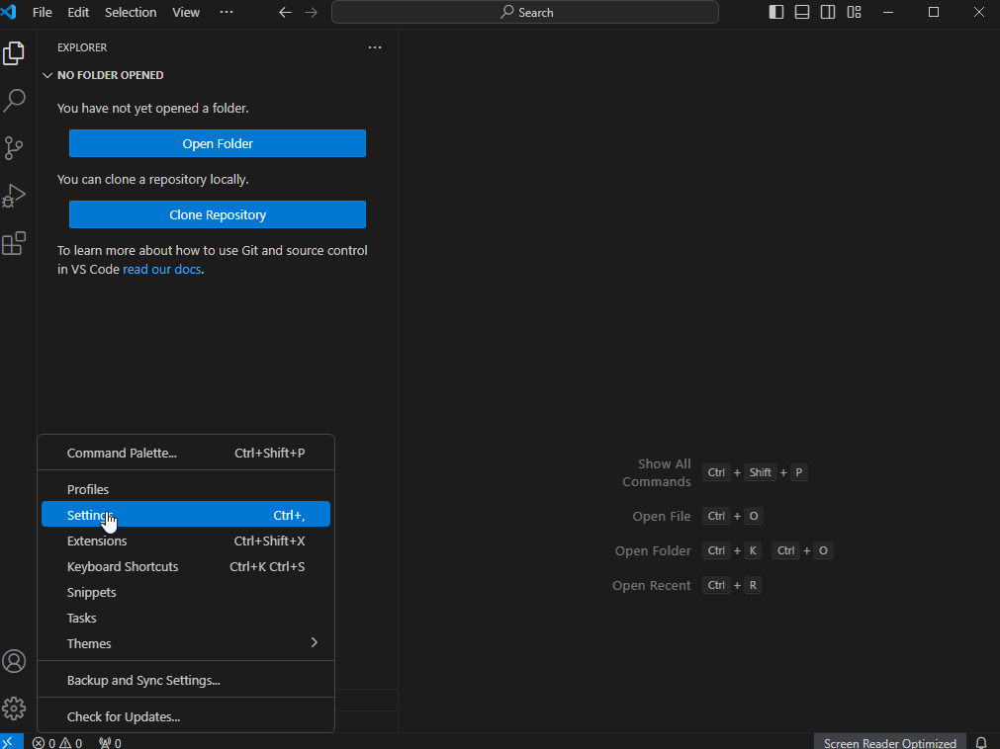
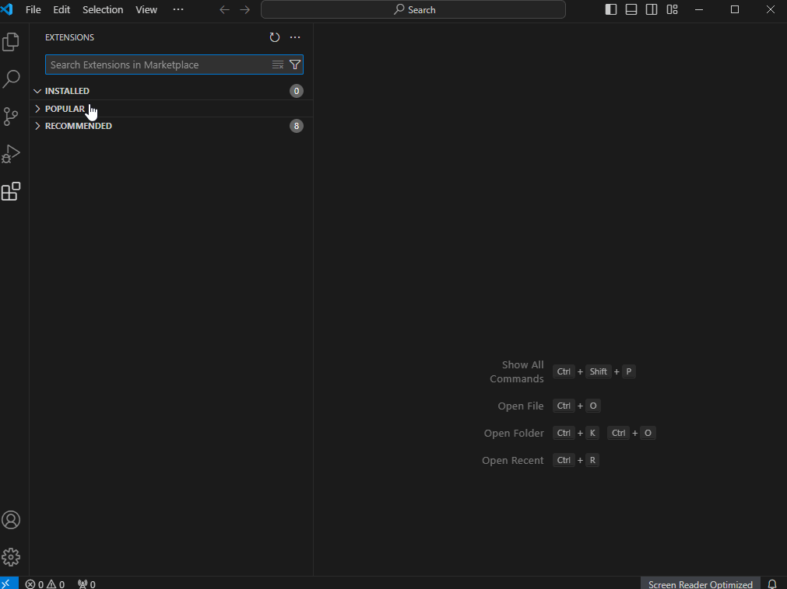
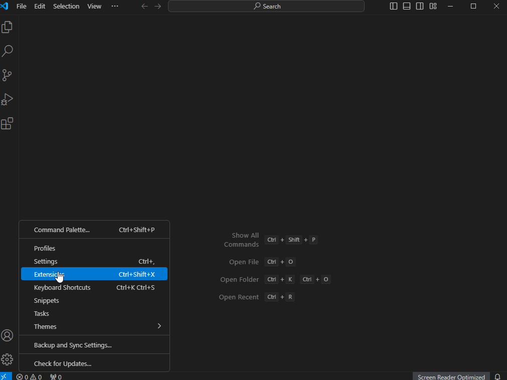
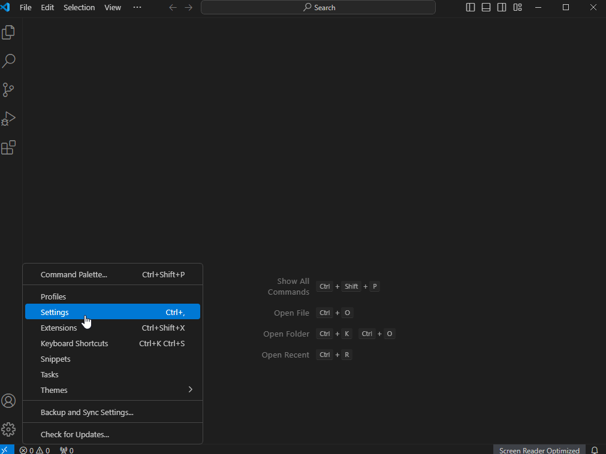
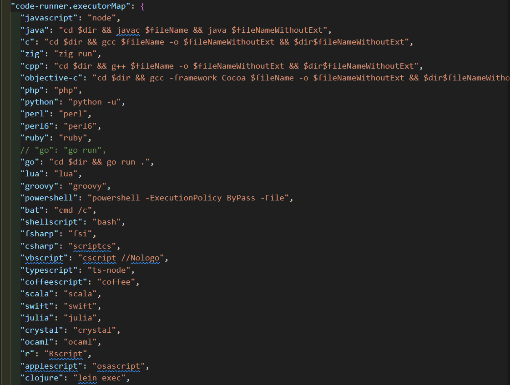

`VS Code 的全称是 Visual Studio Code，是一款开源的、免费的、跨平台的、高性能的、轻量级的代码编辑器。它在性能、语言支持、开源社区方面，都做得很不错。`

<!-- more -->

### 目录

- [一、软件安装](#一软件安装)

- [二、代理配置](#二代理配置)

- [三、插件配置](#三插件配置)

- [四、容器化开发](#四容器化开发)

- [五、Golang安装](#五golang-安装)

- [六、代码格式化](#六代码格式化)

- [七、断点调试](#七断点调试)

#### 一、软件安装

> 软件下载请点击 [Visual Studio Code](https://code.visualstudio.com/Download) , 软件安装较为基础且简单，基本就是下一步，唯一要注意的地方，*安装路径尽量自定义，建议不要把应用放在系统盘*。
    

#### 二、代理配置

> 代理设置分为两种，一种是通过 `settings.json` 文件配置，一种是通过终端配置。

1. settings.json 文件配置

    ```json
    "http.proxy": "http://127.0.0.1:1080",
    "http.proxyStrictSSL": false,
    "https.proxy": "http://127.0.0.1:1080",
    "https.proxyStrictSSL": false
    ```

    

2. 终端 配置
    - 设置代理

        ```
        //http || https
        git config --global http.proxy 127.0.0.1:7890
        git config --global https.proxy 127.0.0.1:7890

        //sock5代理
        git config --global http.proxy socks5 127.0.0.1:7891
        git config --global https.proxy socks5 127.0.0.1:7891
        ```

    - 查看代理

        ```
        git config --global --get http.proxy
        git config --global --get https.proxy
        ```

    - 取消代理

        ```
        git config --global --unset http.proxy
        git config --global --unset https.proxy
        ```

[Top](#目录)

#### 三、插件配置

1. 安装简体中文插件示例
    

2. 推荐几个插件

    | 插件名称                                                  | 描述信息                               |
    | --------------------------------------------------------- | -------------------------------------- |
    | Chinese (Simplified) Language Pack for Visual Studio Code | 中文语言包                             |
    | Comment Translate                                         | 翻译插件                               |
    | GitLens、Git History                                      | Git 插件                               |
    | Todo Tree                                                 | 管理项目中的 TODO 注释和其他标记       |
    | vscode-pets                                               | 萌宠插件                               |
    | Tabnine (AI Code Completion)                              | AI 代码补全                            |
    | CodeGeeX                                                  | 解释代码、生成注释、联网搜索、文件提问 |
    | Markdown All in One                                       | md 文档编辑                            |
    | Power Mode                                                | 酷炫打字                               |

3. 插件导出与导入
   - 导出
     
   - 导入
     

[Top](#目录)

#### 四、容器化开发

1. wsl 安装
    >
    > > 打开微软商店（Microsoft Store），搜索 Windows Terminal, 免费下载
    >
    > > 打开 Windows Terminal，输入 wsl --install，此命令将启用运行 WSL 并安装 Linux 的 Ubuntu 发行版所需的功能
    >
    > > wsl --list --online，查看可用发行版列表并运行 wsl --install -d <DistroName> 以安装一个发行版
    >
    > > wsl -l -v，查看正在运行的版本
    >
    > > wsl --set-version <distro name> 2 命令将 <distro name> 替换为要更新的 Linux 发行版的名称。 例如，wsl --set-version Ubuntu-20.04 2 会将 Ubuntu 20.04 发行版设置为使用 WSL 2。
2. docker 安装，基本就是下一步，不再赘述。
   > docker engine 配置参考

   ```
        {
            "builder": {
                "gc": {
                "defaultKeepStorage": "120GB",
                "enabled": true
                }
            },
            "debug": false,
            "experimental": false,
            "features": {
                "buildkit": true
            },
            "insecure-registries": [],
            "registry-mirrors": [
                "http://hub-mirror.c.163.com",
                "https://docker.mirrors.ustc.edu.cn"
            ]
        }
   ```

3. Docker 容器启动
    > 下载启动镜像，一般为Centos 系统镜像，可以使用docker pull centos:7.6 下载镜像，安装开发环境，自定义封装镜像；也可以使用docker pull dingms/ucas-bdms-hw-u64-2019 下载已经配置好开发环境的镜像。

    > 启动容器，docker run -it --name ucas-bdms-hw-u64-2019 dingms/ucas-bdms-hw-u64-2019 /bin/bash(sh), 启动后 输入 Exit 退出容器

4. Visual Studio Code `Remote Development`、`Dev Containers`、`Remote - SSH` 插件安装

5. 在Docker 客户端 打开容器，在Visual Studio Code 中 Dev Containers -> Open Folder in Container -> 选择容器启动的路径，即可在VsCode 中进行开发，开发环境与容器一致。

[Top](#目录)

#### 五、Golang 安装

[安装参考文档](https://feng6917.github.io/lg-go-dev-env)

#### 六、代码格式化

1. 安装Clang-Format 插件 `apt install clang-format`

2. 在项目的根目录下（或者项目的任意上级目录下）新建一个.clang-format或_clang-format文件 配置内容可以参考官网：<https://clang.llvm.org/docs/ClangFormatStyleOptions.html>

    除此之外无需其它配置，格式化代码即会根据该clang-format文件内容来格式化代码。
3. 设置 全局配置

    ```
      // 自动保存
        "files.autoSave": "onFocusChange",
      // proto3 格式化
        "[proto3]": {
           "editor.defaultFormatter": "xaver.clang-format"
    ```

4. .clang-format Proto 文件格式化参考

    ```
    Language: Proto
    IndentWidth:     4
    ColumnLimit: 1000
    AlignTrailingComments:  true
    PenaltyBreakComment:    1000
    ReflowComments: true
    AlignConsecutiveAssignments: true
    ```

[Top](#目录)

#### 七、断点调试

0. launch.json 微调整

    ```
        {
             "name": "Launch Package",
             "type": "go",
             "request": "launch",
             "mode": "auto",
             "program": "${fileDirname}",
             "cwd": "${workspaceFolder}",
             "env": {},
             "args": []
         }

    ```

1. `F5` 启动调试
2. `F5` 继续执行
3. `F10` 单步执行
4. `F11` 进入函数
5. 操作示例


- 右上角运行插件使用
  - 1. 安装Code Runner 插件
  - 2. 运行配置文件编辑
    

[Top](#目录)

###### 参考链接如下

- [如何使用 WSL 在 Windows 上安装 Linux](https://learn.microsoft.com/zh-cn/windows/wsl/install)

- [Docker Install](https://www.runoob.com/docker/windows-docker-install.html)

- [dingms 镜像](https://hub.docker.com/r/dingms/ucas-bdms-hw-u64-2019)

- [WSL 2.0 Install](https://blog.csdn.net/hjb2722404/article/details/120738062)

- [VsCode Install](https://www.runoob.com/w3cnote/vscode-tutorial.html)

- [Docker 使用容器来创建镜像](https://www.runoob.com/w3cnote/docker-use-container-create-image.html)
