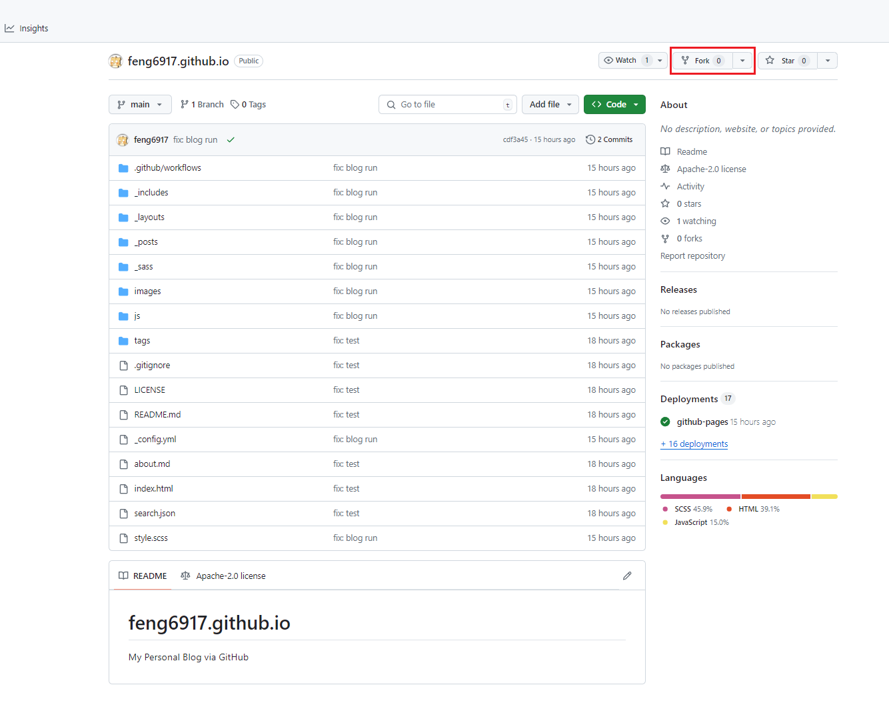

```
  简单说一下搭建流程
  1. 复制别人的仓库到自己的Github账号上
  2. 替换别人的仓库配置信息
  3. 移除别人的文章、账号
  4. 发布自己的第一篇文章
```

<!-- more -->

### 目录

- [1. 拷贝别人的仓库到自己的账号上](#拷贝别人的仓库到自己的账号上)

- [2. 替换别人的仓库配置信息](#替换别人的仓库配置信息)

- [3. 移除文章、图像、及配置信息](#移除文章、图像、及配置信息)

- [4. 发布自己的第一篇文章](#发布自己的第一篇文章)

#### 拷贝别人的仓库到自己的账号上

- 访问 [博客地址](https://github.com/feng6917/feng6917.github.io) ，点击右上角的 Fork 按钮。
  
- 仓库名修改为自己的 github 账号名
    

#### 替换别人的仓库配置信息

- _config.yml 全局配置文件
- _posts 放置博客文章的文件夹
- images 存放图片的文件夹

- 修改_config.yml 文件
    

- 修改 about.md 文件
    

- 修改 README.md 文件
    

#### 移除文章、图像、及配置信息

- 删除 _posts 文件夹下的文章

- 删除 images 文件夹下的图片

- 删除 _config.yml 文件中的私有配置信息

#### 发布自己的第一篇文章

  ```
    在_posts文件夹下新建md文件，文件名格式为：年-月-日-文章标题.md
    例如：2018-5-27-我的第一篇文章.md

    ---
    layout: post
    title: "我的第一篇文章"
    date: 2018-5-27
    categories: [博客, 技术]
    ---

    这是我的第一篇文章的内容。

  ```

###### 参考链接如下

- <https://pianfan.github.io/>
- <https://github.com/qiubaiying/qiubaiying.github.io>
- <https://github.com/qiubaiying/qiubaiying.github.io/wiki/博客搭建详细教程>
