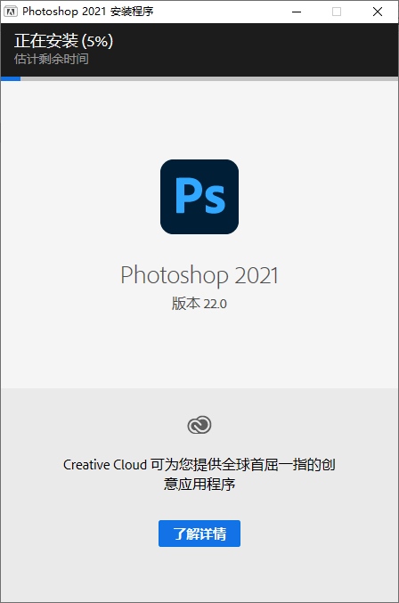
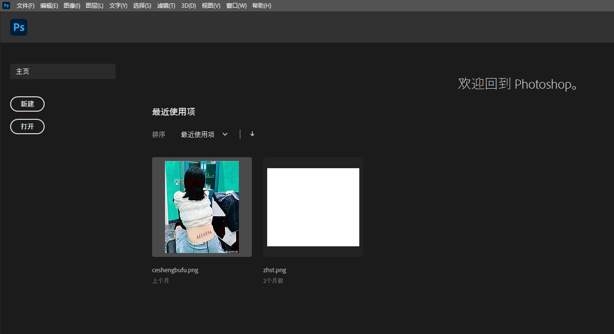
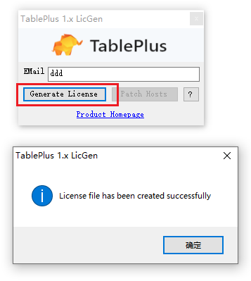

<!-- more -->
### 目录
- [Edraw Max v9.0](#edraw-max-v90)
- [HEU KMS V30.1.0](#heu-kms-v3010)
- [Navicat 15.0](#navicat-150)
- [Navicat 16.1](#navicat-161)
- [Navicat 16.3](#navicat-163)
- [Office 2016](#office-2016)
- [Photoshop 2021](#photoshop-2021)
- [TablePlus 4.10.8](#table-plus-4108)
- [TablePlus 5.3.3](#tableplus-533)
- [Typora](#typora)

#### Edraw Max v9.0

> Edraw Max是一款简单易用的快速制图软件，帮助你轻松创建流程图、网络拓扑图、组织结构图、商业图表、工程图，思维导图、软件设计图和平面布局图等。

- 1. 下载压缩包
      [Link](https://pan.baidu.com/s/1GJvxxj-5kJRDdq1yYe3kMw?pwd=3aot)
      
- 2. 解压压缩包
      
- 3. 预安装
     
     
- 3.1 安装
     
     
     
     
     
     

- 4. 预补丁
     
- 3.1 补丁
     
     
- 4 打开即可
     

[Top](#目录)

<hr style="background-color: blue;border: none;height: 10px;opacity: .1;width: 100%" />

#### HEU KMS V30.1.0

> HEU KMS Activator 激活工具是适用于 Windows、Office 及 VL 版本的一款基于KMS服务端模拟环境“KMS Server Emulator”的激活工具，使用起来直接离线全自动激活，无需联网，十分强大。

- 1. 下载压缩包
      [Link](https://pan.baidu.com/s/18PRztIyBAxXvmNZ5sEJINQ?pwd=2ho5)
      
- 2. 解压压缩包
      
- 3. 预安装
     
- 3.1 安装
     
     
     
     

- 4 效果
    

[Top](#目录)

<hr style="background-color: blue;border: none;height: 10px;opacity: .1;width: 100%" />

#### Navicat 15.0 

- 1. 下载压缩包
      [Link](https://pan.baidu.com/s/1MvlfDvR7GU-GCQGQZrQojg?pwd=bjma)
      
- 2. 解压压缩包
      
- 3. 预安装 Navicat
     
- 3.1 安装 Navicat 软件
    
    

    ```
        不建议安装在C盘，路径可自行调整，后续 Patch 时会用到
    ```

    
    
    
    
    

- 4. 断网
     

- 5. 预安装
      
- 5.1 安装 Key Patch 破解软件

    ```
       注意事项
       
       1. Patch 时 需要选择自定义安装路径中的Navicat.exe
       2. 不能够Patch 得到 Cracked时，卸载重装Navicat
       3. 密钥、请求码、激活码 在Navicat、Keygen 之间不能自动复制时，需要手动复制
    ```

    
    
    
    
    
    
    
    
    
- 5.2 效果
      

[Top](#目录)

<hr style="background-color: blue;border: none;height: 10px;opacity: .1;width: 100%" />

#### Navicat 16.1 

- 1. 下载压缩包
      [Link](https://pan.baidu.com/s/12BY6jhNi0e3zWWrD54ZGiA?pwd=atuw)
      
- 2. 解压压缩包
      
- 3. 预安装 Navicat
     
- 3.1 安装 Navicat 软件
    
    
    

    ```
        不建议安装在C盘，路径可自行调整，后续 Patch 时会用到
    ```

    
    
    

- 4. 断网
     

- 5. 预安装
      
- 5.1 安装 Key Patch 破解软件

    ```
       注意事项
       
       1. Patch 时 需要选择自定义安装路径中的Navicat.exe
       2. 不能够Patch 得到 Cracked时，卸载重装Navicat
       3. 密钥、请求码、激活码 在Navicat、Keygen 之间不能自动复制时，需要手动复制
    ```

    
    
    
    
    
    
    
    
    
    
    
    
    
    
    

- 5.2 效果
    
    

[Top](#目录)

<hr style="background-color: blue;border: none;height: 10px;opacity: .1;width: 100%" />

#### Navicat 16.3

- 1. 下载压缩包
      [Link](https://pan.baidu.com/s/1M-zcHdILqBCs691pteuPmA?pwd=os7i)
      
- 2. 解压压缩包
      
- 3. 执行绿化脚本
     
     

- 4 效果
    
    
    

[Top](#目录)

<hr style="background-color: blue;border: none;height: 10px;opacity: .1;width: 100%" />

#### Office 2016

- 1. 下载压缩包
      [Link](https://pan.baidu.com/s/13IPxOwld3olPG1z5ZTPN2Q?pwd=y6ex)
      
- 2. 解压压缩包
      
- 3. 预安装
     
- 3.1 安装
     

- 5. 预安装
    
- 5.1 安装
    
- 6. 效果
    

[Top](#目录)

<hr style="background-color: blue;border: none;height: 10px;opacity: .1;width: 100%" />

#### Photoshop 2021

- 1. 下载压缩包
      [Link](https://pan.baidu.com/s/1PXGf7Pf863xTOtSUj_PmXg?pwd=dxcu)
      
- 2. 解压压缩包
      
- 3. 安装
     
     
     

- 4 效果
    

[Top](#目录)

<hr style="background-color: blue;border: none;height: 10px;opacity: .1;width: 100%" />

#### TablePlus 4.10.8

- 1. 下载压缩包
      [Link](https://pan.baidu.com/s/1CwyCneSpLOrfB2fdT7V6uA?pwd=f4bw)
      
- 2. 解压压缩包
      
- 3. 预安装
     
- 3.1 安装
     
     
     
     
- 4. 清理本地TablePlus hosts映射
     

- 5. 预安装
    
- 5.1 安装
    
    
    
- 6. 效果
    

[Top](#目录)

<hr style="background-color: blue;border: none;height: 10px;opacity: .1;width: 100%" />

#### TablePlus 5.3.3

- 1. 下载压缩包
      [Link](https://pan.baidu.com/s/1pKS_lKBif0IGa7WFHarTPQ?pwd=nfnl)
      
- 2. 解压压缩包
      
- 3. 预安装
     
- 3.1 安装
     
     
     
     
- 4. 清理本地TablePlus hosts映射
     

- 5. 预安装
    
- 5.1 安装
    
    
- 6. 效果
    

[Top](#目录)

<hr style="background-color: blue;border: none;height: 10px;opacity: .1;width: 100%" />

#### Typora

- 1. 下载压缩包
      [Link](https://pan.baidu.com/s/1y1kItRGkIRANLUINKMqjmg?pwd=kvx7)
      
- 2. 解压压缩包
      
- 3. 预安装
     
- 6. 效果
      

[Top](#目录)

