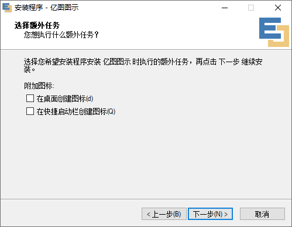

`Edraw Max是一款简单易用的快速制图软件，帮助你轻松创建流程图、网络拓扑图、组织结构图、商业图表、工程图，思维导图、软件设计图和平面布局图等。`

<!-- more -->

- 1. 下载压缩包
      [Link](https://pan.baidu.com/s/1GJvxxj-5kJRDdq1yYe3kMw?pwd=3aot)
      
- 2. 解压压缩包
      
- 3. 预安装
     
     
- 3.1 安装
     
     
     
     
     
     

- 4. 预补丁
     
- 3.1 补丁
     
     
- 4 打开即可
     
