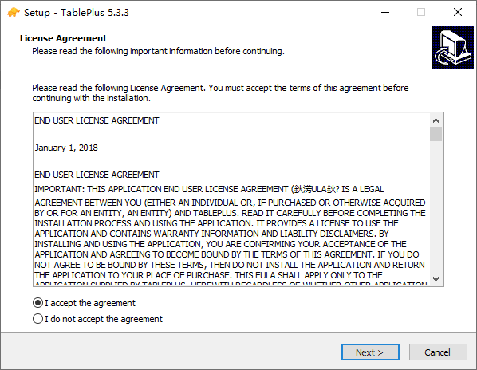
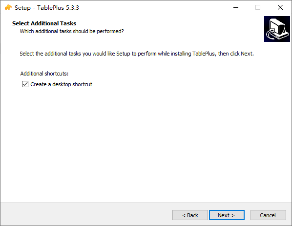
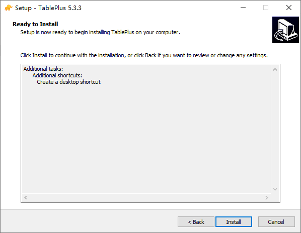
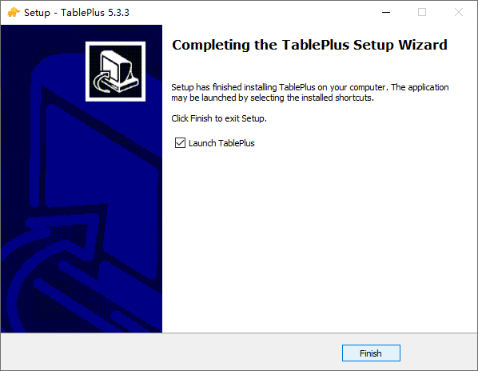
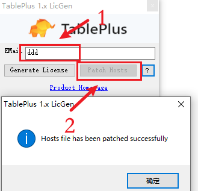
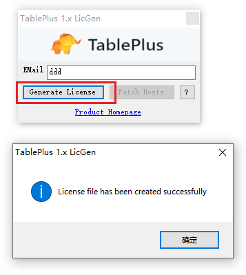

`TablePlus for Mac 是一款功能全面、操作简便的数据库管理工具。`

<!-- more -->

- 1. 下载压缩包
      [Link](https://pan.baidu.com/s/1pKS_lKBif0IGa7WFHarTPQ?pwd=nfnl)
      
- 2. 解压压缩包
      
- 3. 预安装
     
- 3.1 安装
     
     
     
     
- 4. 清理本地TablePlus hosts映射
     

- 5. 预安装
    
- 5.1 安装
    
    
- 6. 效果
    
