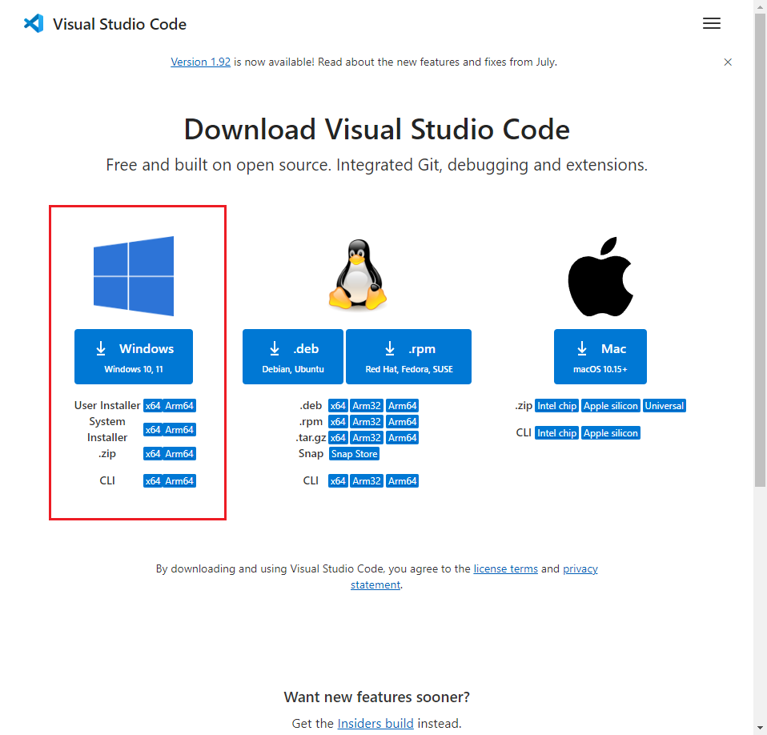
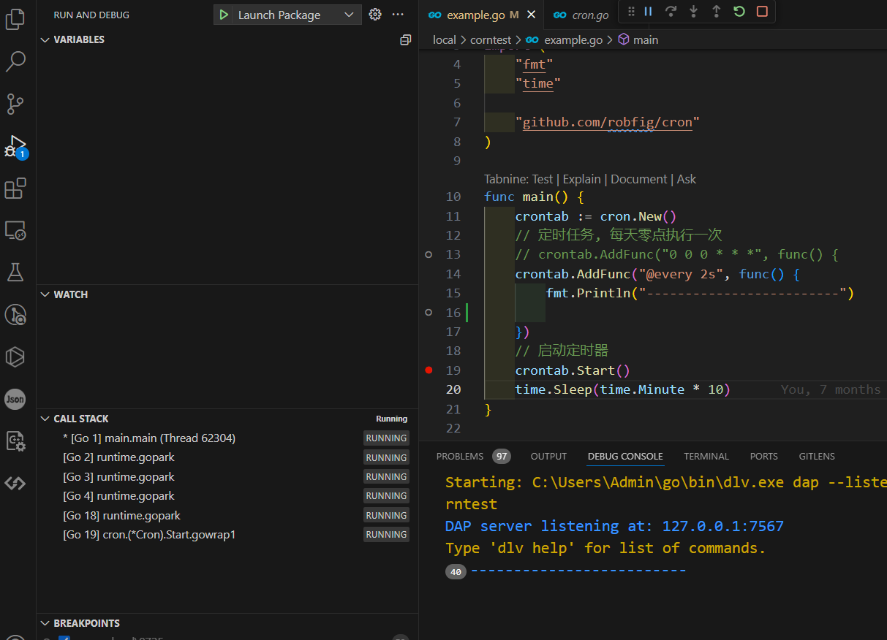
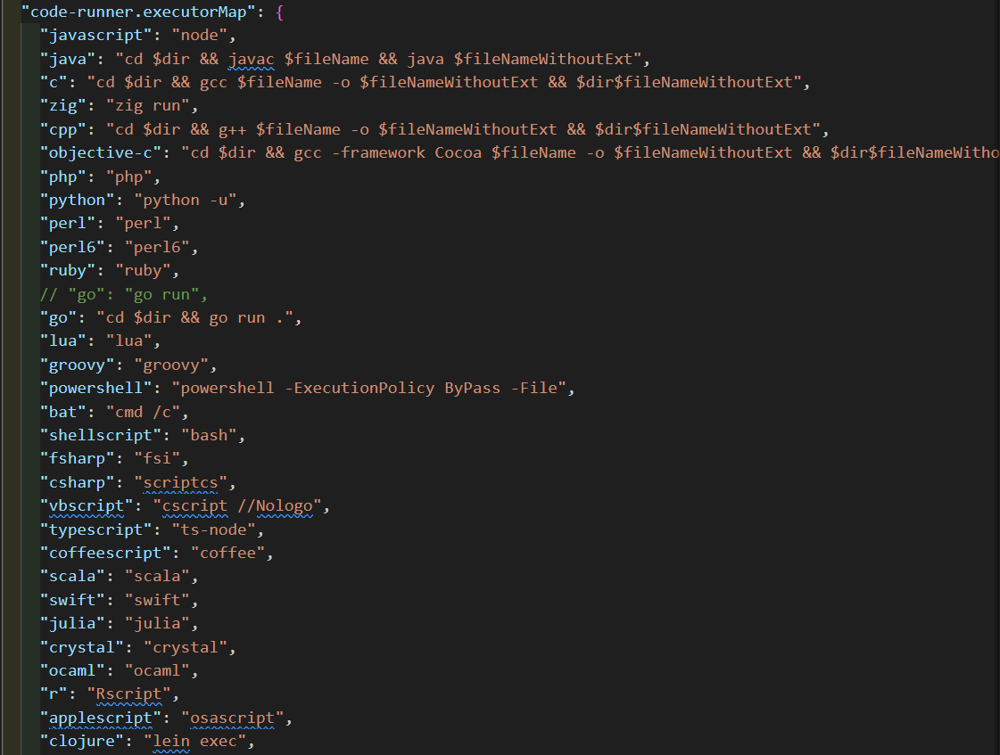

`VS Code 的全称是 Visual Studio Code，是一款开源的、免费的、跨平台的、高性能的、轻量级的代码编辑器。它在性能、语言支持、开源社区方面，都做得很不错。`

<!-- more -->

### 目录

- [1. VS Code 安装](#软件安装)

- [2. Proxy 代理设置](#代理设置)

- [3. plugins 插件安装](#插件安装)

- [4. launch 断点调试](#断点调试)

- [5. Clang-Format 代码格式化](#代码格式化)

- [5. Remote 远程开发](#远程开发)

#### 软件安装

1. 下载安装包

    [VsCode 官网](https://code.visualstudio.com/Download)
    

2. 安装

    双击安装包，按照提示进行安装。

#### 代理设置

1. settings.json 配置

    ```json
    "http.proxy": "http://127.0.0.1:1080",
    "http.proxyStrictSSL": false,
    "https.proxy": "http://127.0.0.1:1080",
    "https.proxyStrictSSL": false
    ```

2. 终端 配置
    - 设置代理

        ```
        //http || https
        git config --global http.proxy 127.0.0.1:7890
        git config --global https.proxy 127.0.0.1:7890

        //sock5代理
        git config --global http.proxy socks5 127.0.0.1:7891
        git config --global https.proxy socks5 127.0.0.1:7891
        ```

    - 查看代理

        ```
        git config --global --get http.proxy
        git config --global --get https.proxy
        ```

    - 取消代理

        ```
        git config --global --unset http.proxy
        git config --global --unset https.proxy
        ```

[返回目录](#目录)

#### 插件安装

1. 打开插件市场

        ```
        //Ctrl+P 输入 ext install
        ```

2. `推荐几个插件`
    - Chinese (Simplified) Language Pack for Visual Studio Code

        ```
        //中文语言包
        ```

    - Tabnine (AI Code Completion)

        ```
        //AI 代码补全
        ```

    - CodeGeeX

        ```
        //AI 代码生成
        ```

    - Comment Translate

        ```
        //翻译插件
        ```

    - GitLens

        ```
        //git 插件
        ```

    - Git History

        ```
        //git 插件
        ```

    - Project Manager

        ```
        //项目管理
        ```

    - Todo Tree

        ```
        //TODO 插件
        ```

    - vscode-pets

        ```
        //萌宠插件
        ```

[返回目录](#目录)

#### 断点调试

0. launch.json 微调整

    ```
        {
             "name": "Launch Package",
             "type": "go",
             "request": "launch",
             "mode": "auto",
             "program": "${fileDirname}",
             "cwd": "${workspaceFolder}",
             "env": {},
             "args": []
         }

    ```

1. `F5` 启动调试
2. `F5` 继续执行
3. `F10` 单步执行
4. `F11` 进入函数
5. 操作示例


- 右上角运行插件使用
  - 1. 安装Code Runner 插件
  - 2. 运行配置文件编辑
    

[返回目录](#目录)

#### 代码格式化

1. 安装Clang-Format 插件 `apt install clang-format`

2. 在项目的根目录下（或者项目的任意上级目录下）新建一个.clang-format或_clang-format文件 配置内容可以参考官网：<https://clang.llvm.org/docs/ClangFormatStyleOptions.html>

    除此之外无需其它配置，格式化代码即会根据该clang-format文件内容来格式化代码。
3. 设置 全局配置

    ```
      // 自动保存
        "files.autoSave": "onFocusChange",
      // proto3 格式化
        "[proto3]": {
           "editor.defaultFormatter": "xaver.clang-format"
    ```

4. .clang-format Proto 文件格式化参考

    ```
    Language: Proto
    IndentWidth:     4
    ColumnLimit: 1000
    AlignTrailingComments:  true
    PenaltyBreakComment:    1000
    ReflowComments: true
    AlignConsecutiveAssignments: true
    ```

[返回目录](#目录)

#### 远程开发

- 1. Remote Development、Dev Containers 相关插件安装
- 2. 点击左下角 SSH -> Remote SSH -> + Add New SSH HOST.. -> 页面 启动 打开文件夹
- 3. 本地部分插件无法使用需要在远程服务器上进行安装
- 4. VsCode+WSL+Docker 开发环境构建指南

    [Docker Install](https://www.runoob.com/docker/windows-docker-install.html)

    [WSL 2.0 Install](https://blog.csdn.net/hjb2722404/article/details/120738062)

    [VsCode Install](https://www.runoob.com/w3cnote/vscode-tutorial.html)

  - 构建镜像

      dingms 镜像参考 <https://hub.docker.com/r/dingms/ucas-bdms-hw-u64-2019> 该镜像包含大数据开发使用到的常见环境

      推荐自己构建镜像 <https://www.runoob.com/w3cnote/docker-use-container-create-image.html>

[返回目录](#目录)
