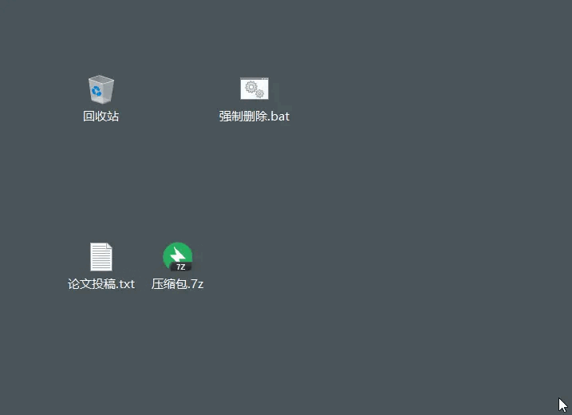
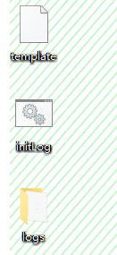
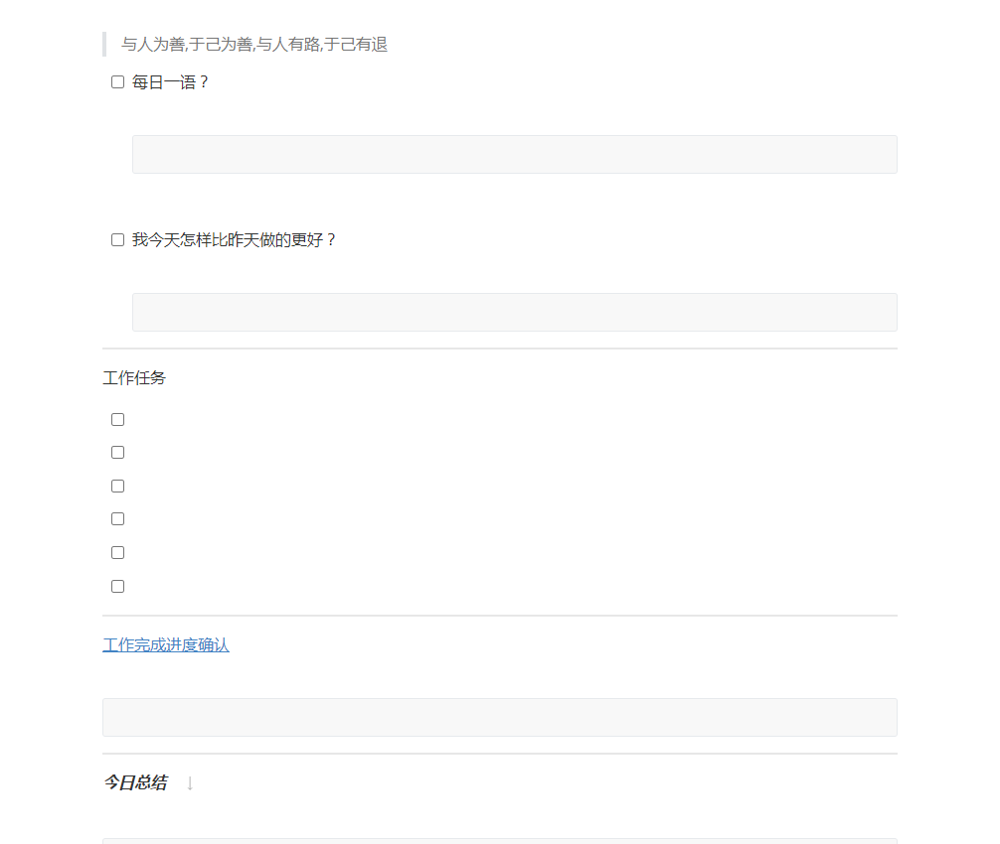

`Win Bash 持续更新 ...`

<!-- more -->

#### 目录

[文件删除](#文件删除)

[日志初始化](#日志初始化)

[一键启动多任务](#一键启动多任务)

#### 文件删除

- 1. 文件删除脚本创建

      ```
        强制删除.bat
        ----------------------
        DEL /F /A /Q \\?\%1 RD /S /Q \\?\%1
      ```

- 2. 执行文件删除脚本
  - 1. 创建 强制删除.bat 文件，写入 `DEL /F /A /Q \\?\%1 RD /S /Q \\?\%1` 内容
  - 2. 拉取要删除的文件/文件夹 到 强制删除.bat
  

[返回目录](#目录)

#### 日志初始化

- 1. 新建初始化日志模板

      ```
          template.md
          1. 需要调整格式 取消缩进
          ----------

          > 与人为善,于己为善,与人有路,于己有退

          - [ ] 每日一语？
            
            ```
            
            ```


          - [ ] 我今天怎样比昨天做的更好？
            
            ```
            
            ```

          -----

          <div id="jump">工作任务</div>

          - [ ] 
          - [ ] 
          - [ ] 
          - [ ] 
          - [ ] 
          - [ ] 

          ---

          [工作完成进度确认](#jump)

          ```

          ```

          ---

          ***今日总结***  

          ```

          ```
      ```

- 2. 新建初始化日志脚本

      ```
        initLogs.bat
        1. 需要调整格式 取消缩进
        2. 参数说明
          dest 为存储路径
          %dest%/logs 为存放日志的文件夹
          %dest%/template.md 为模板文件路径
          %dt% 为日期格式
        ----------
        
        @echo off
      
        SET dest=C:\Users\Admin\Desktop

        echo jump log path
        cd /d %dest%\logs

        echo set today date
        set dt=%date:~0,4%.%date:~5,2%.%date:~8,2%-%date:~11,13%

        echo copy template markdown file 
        xcopy %dest%\template.md .
        cd ./%dt%

        echo rename template.md today markdown file
        ren template.md %dt%.md
        del template.md

        echo create success
      ```

- 3. 执行初始化脚本

    
    

[返回目录](#目录)

#### 一键启动多任务

- 1. 新建一键启动多任务脚本

      ```
        start.bat
        1. 需要调整格式 取消缩进
        2. start 可执行多次多个任务
        ----------

        @echo off
 

        if "%1" == "h" goto begin
        

        mshta vbscript:createobject("wscript.shell").run("""%~nx0"" h",0)(window.close)&&exit
        

        :begin
        
        echo 打开打卡定时图片任务...
        start /B C:/workspace/golang/src/feng6917/local/bash/gohome_bat.exe
      ```  

- 2. 执行 start.bat

[返回目录](#目录)
