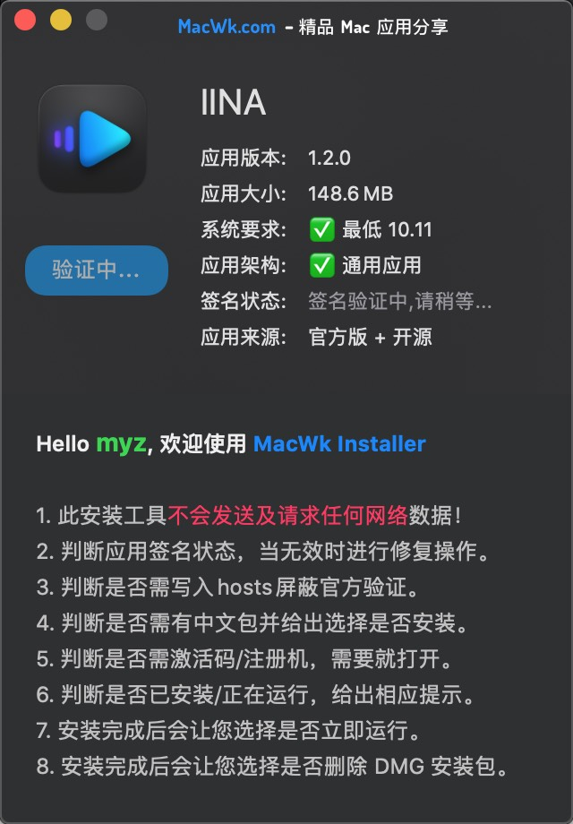

    `IINA 是一款专门针对 macOS 系统设计的现代媒体播放器。它为用户提供了调整回放设置的能力，并提供在 Intel 和 M1-based Mac 上本地运行的通用二进制文件。`

<!-- more -->

- 1. 下载压缩包
      [Link](https://pan.baidu.com/s/1LExFry2DevxsF_GsjmAQKA?pwd=cpgz)
      
- 2. 解压压缩包
      
- 3. 安装&破解
     
     
     
     

- 4 效果
    
