`Navicat 挺好用的，不过自从用了Table Plus，嗯，真香`

<!-- more -->
### [目录]

- [Mac 版本](#mac-版本)
- [Win 15.0 版本](#win-150-版本)
- [Win 16.1 版本](#win-161-版本)
- [Win 16.3 版本](#win-163-版本)

---

#### Mac 版本

- 1. 下载压缩包
      [Link](https://pan.baidu.com/s/1XL9QCsCvuIU5DpH-dr0LjA?pwd=c02x)
      
- 2. 解压压缩包
      
- 3. 安装&破解
     

- 4 效果
    

[Top](#目录)

<hr style="background-color: blue;border: none;height: 10px;opacity: .1;width: 100%" />

#### Win 15.0 版本

- 1. 下载压缩包
      [Link](https://pan.baidu.com/s/1MvlfDvR7GU-GCQGQZrQojg?pwd=bjma)
      
- 2. 解压压缩包
      
- 3. 预安装 Navicat
     
- 3.1 安装 Navicat 软件
    
    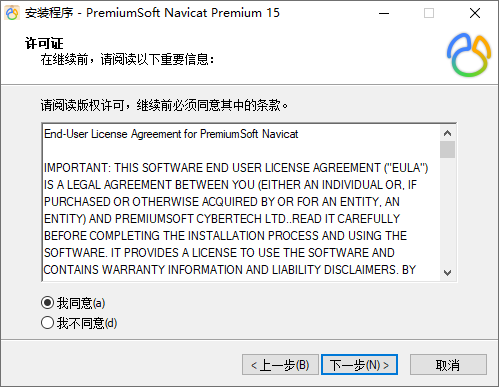

    ```
        不建议安装在C盘，路径可自行调整，后续 Patch 时会用到
    ```

    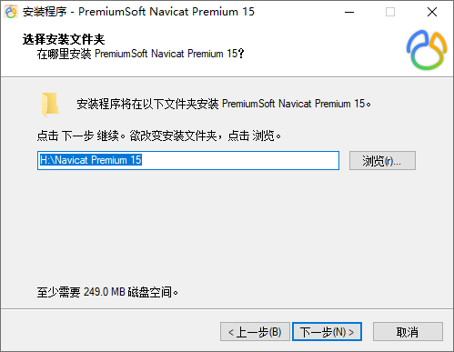
    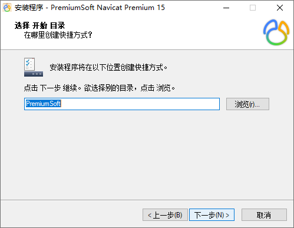
    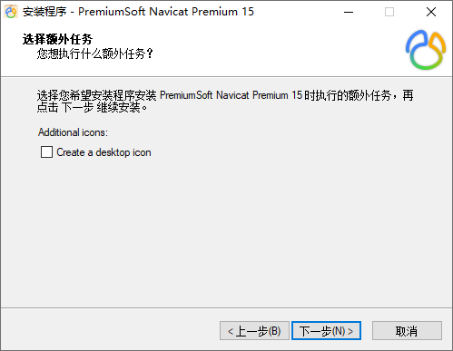
    
    

- 4. 断网
     

- 5. 预安装
      
- 5.1 安装 Key Patch 破解软件

    ```
       注意事项
       
       1. Patch 时 需要选择自定义安装路径中的Navicat.exe
       2. 不能够Patch 得到 Cracked时，卸载重装Navicat
       3. 密钥、请求码、激活码 在Navicat、Keygen 之间不能自动复制时，需要手动复制
    ```

    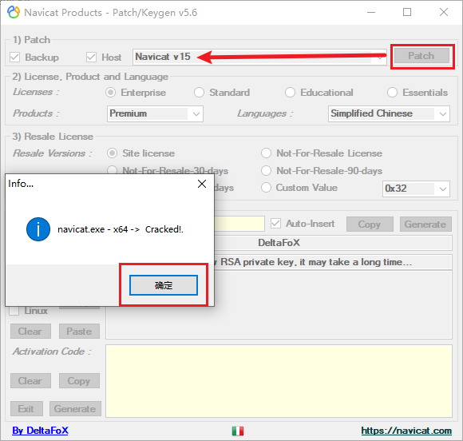
    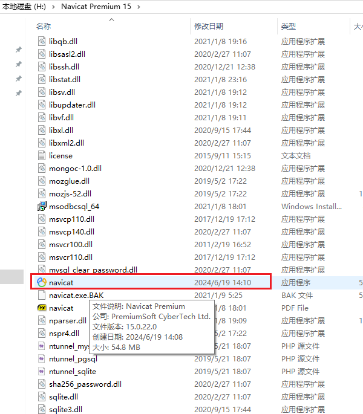
    
    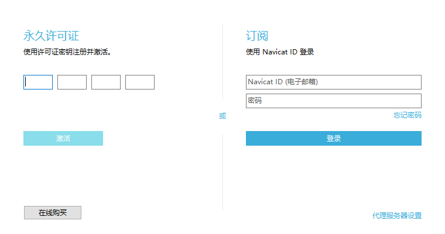
    
    
    
    
    
- 5.2 效果
      

[Top](#目录)

<hr style="background-color: blue;border: none;height: 10px;opacity: .1;width: 100%" />

#### Win 16.1 版本

- 1. 下载压缩包
      [Link](https://pan.baidu.com/s/12BY6jhNi0e3zWWrD54ZGiA?pwd=atuw)
      
- 2. 解压压缩包
      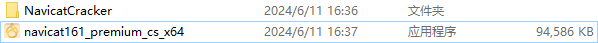
- 3. 预安装 Navicat
     
- 3.1 安装 Navicat 软件
    
    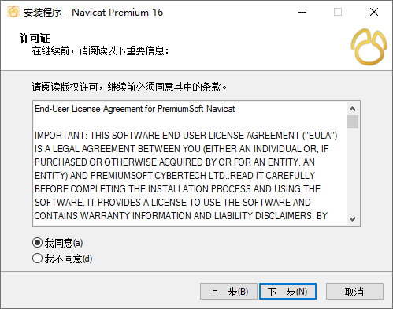
    

    ```
        不建议安装在C盘，路径可自行调整，后续 Patch 时会用到
    ```

    
    
    

- 4. 断网
     

- 5. 预安装
      
- 5.1 安装 Key Patch 破解软件

    ```
       注意事项
       
       1. Patch 时 需要选择自定义安装路径中的Navicat.exe
       2. 不能够Patch 得到 Cracked时，卸载重装Navicat
       3. 密钥、请求码、激活码 在Navicat、Keygen 之间不能自动复制时，需要手动复制
    ```

    
    
    
    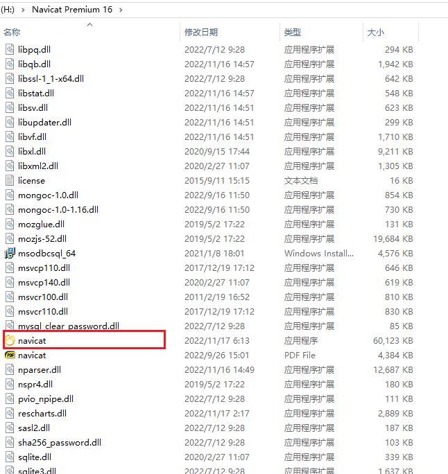
    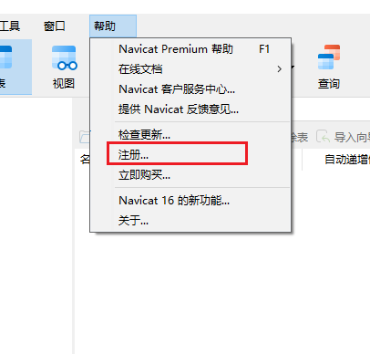
    
    
    
    
    
    
    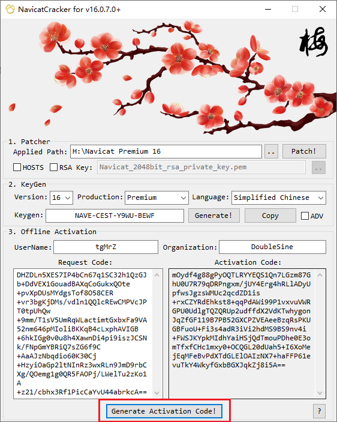
    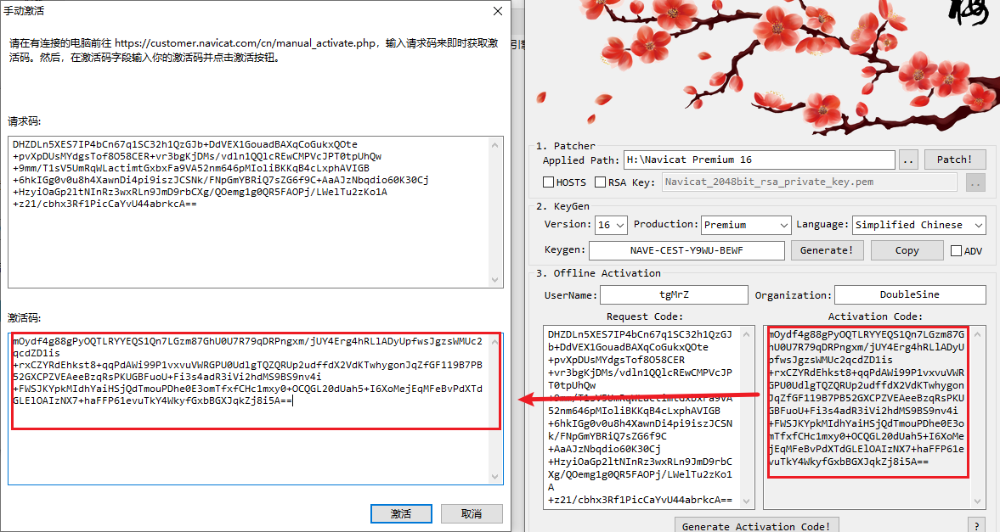
    
    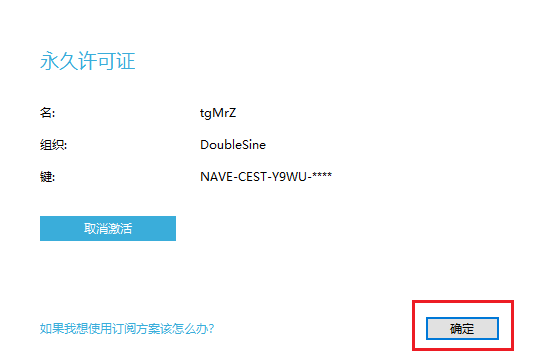

- 5.2 效果
    
    

[Top](#目录)

#### Win 16.3 版本

- 1. 下载压缩包
      [Link](https://pan.baidu.com/s/1M-zcHdILqBCs691pteuPmA?pwd=os7i)
      
- 2. 解压压缩包
      
- 3. 执行绿化脚本
     
     

- 4 效果
    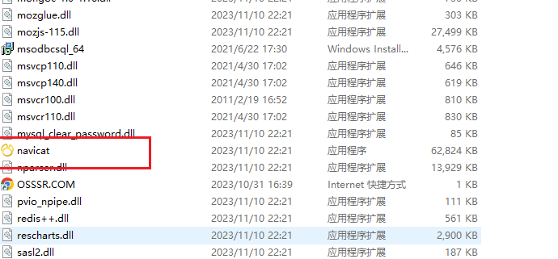
    
    

[Top](#目录)
