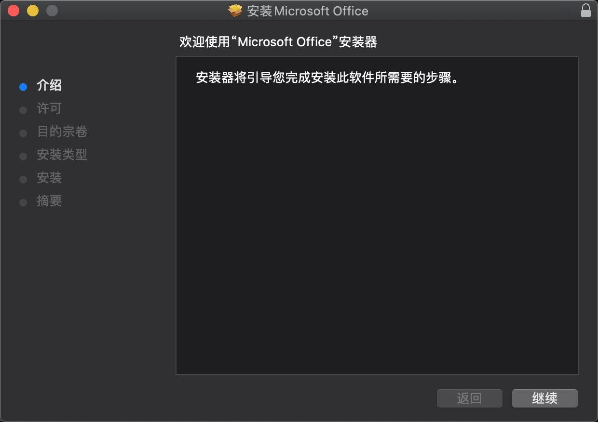
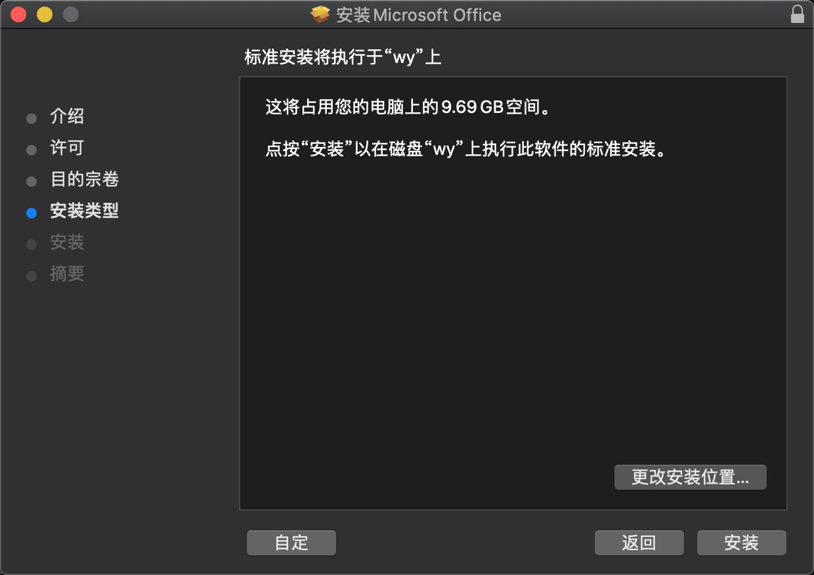
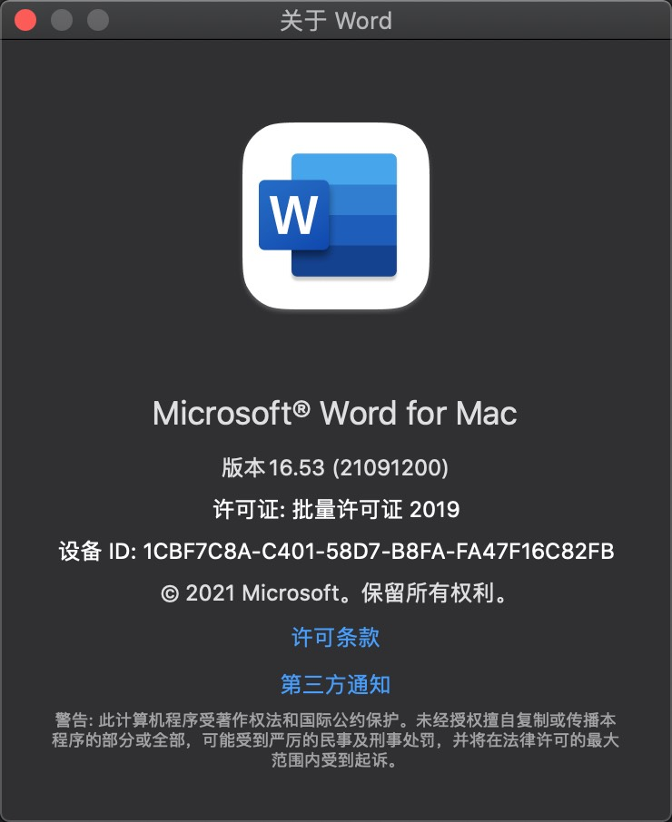

`你懂的，好使`

<!-- more -->

### [目录]

- [Mac 版本](#mac-版本)
- [Win 版本](#win-版本)

#### Mac 版本

- 1. 下载压缩包
      [Link](https://pan.baidu.com/s/1oUB9td-EmG4tGSxUnGOyVQ?pwd=j8wh)
      
- 2. 解压压缩包
      
- 3. 安装Office
     
     
     
     
     
     

- 4. 效果
    

- 5. 可根据需要安装Word|Excel,安装位置可自定义,步骤同上。

[Top](#目录)

#### Win 版本

- 1. 下载压缩包
      [Link](https://pan.baidu.com/s/13IPxOwld3olPG1z5ZTPN2Q?pwd=y6ex)
      
- 2. 解压压缩包
      
- 3. 预安装
     
- 3.1 安装
     

- 5. 预安装
    
- 5.1 安装
    
- 6. 效果
    
