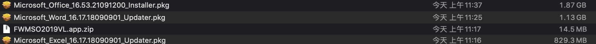

    ```
        Microsoft Office 是由 微软公司 开发的 办公软件套装 ，有 Microsoft Windows 、 Mac系列 、 iOS 和 Android 等不同系统的版本。 与其他办公室应用程式一样，它包括联合的 伺服器 和基于 网际网路 的服务。
    ```

<!-- more -->

- 1. 下载压缩包
      [Link](https://pan.baidu.com/s/1oUB9td-EmG4tGSxUnGOyVQ?pwd=j8wh)
      
- 2. 解压压缩包
      
- 3. 安装Office
     
     
     
     
     
     

- 4. 效果
    

- 5. 可根据需要安装Word|Excel,安装位置可自定义,步骤同上。
