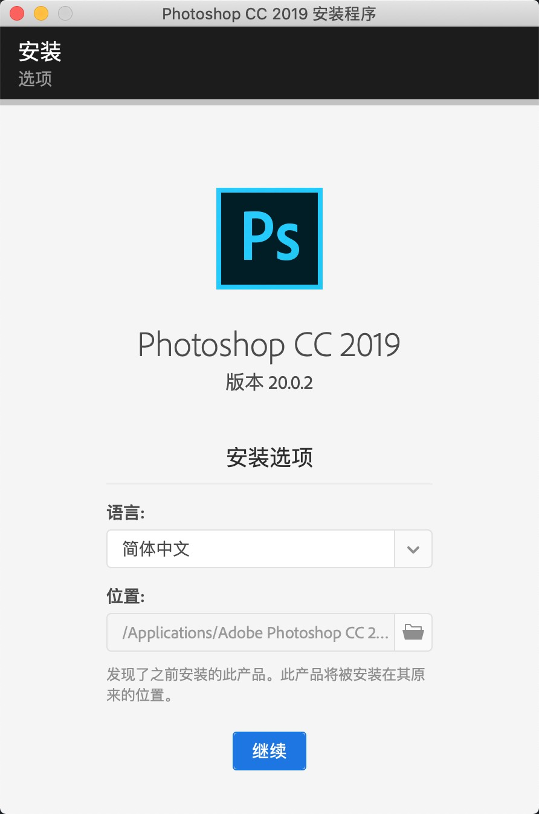

`唉呦，不错，不错`

<!-- more -->

### [目录]

- [Mac 版本](#mac-版本)
- [Mac 版本](#windows-版本)

#### Mac 版本

- 1. 下载压缩包
      [Link](https://pan.baidu.com/s/1_HBBavN_8GMHAiRG9nYBsw?pwd=187e)
      
- 2. 解压压缩包
      
- 3. 安装&破解
     
     
     
     
     

[Top](#目录)

#### Windows 版本

- 1. 下载压缩包
      [Link](https://pan.baidu.com/s/1PXGf7Pf863xTOtSUj_PmXg?pwd=dxcu)
      
- 2. 解压压缩包
      
- 3. 安装
     
     
     

- 4 效果
    

[Top](#目录)
