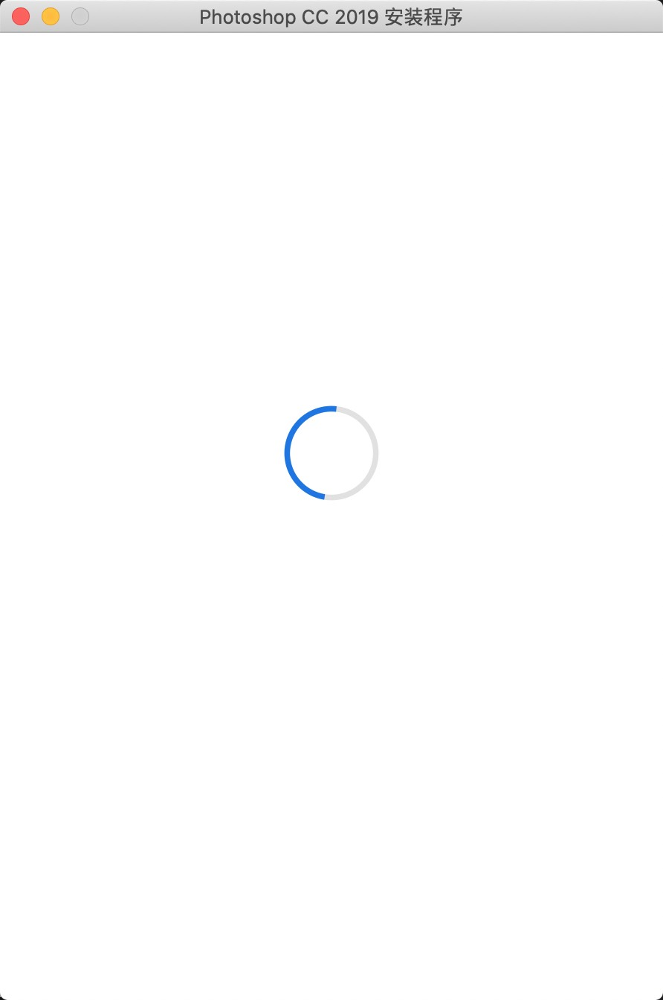

    ```
        Adobe Photoshop 是一个由 Adobe 开发和发行的图像处理软件。该软件提供对 Windows 和 macOS 操作系统的支持。
    ```

<!-- more -->

- 1. 下载压缩包
      [Link](https://pan.baidu.com/s/1_HBBavN_8GMHAiRG9nYBsw?pwd=187e)
      
- 2. 解压压缩包
      
- 3. 安装&破解
     
     
     
     
     
