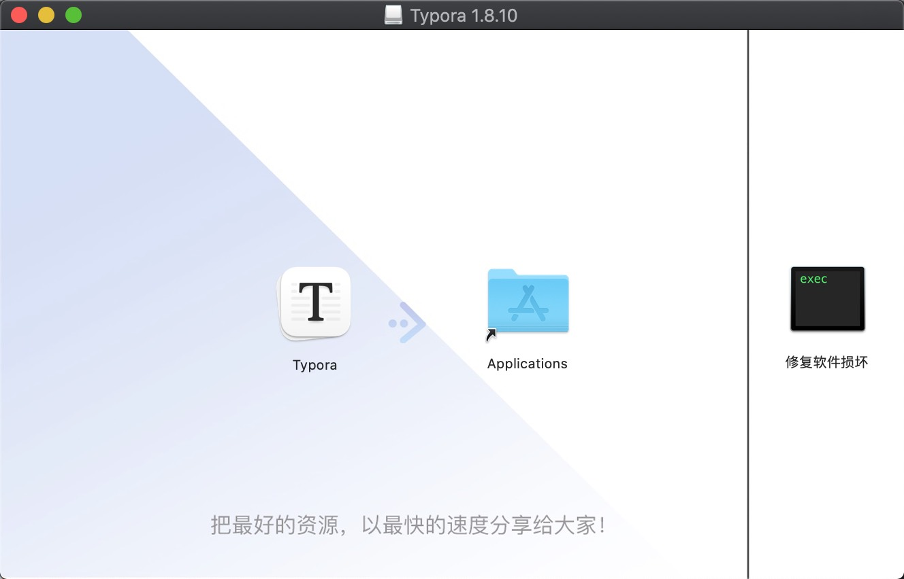

`Typora 是一款轻量级的 Markdown 编辑器，其最为出众的特点是： 所见即所得 。`

<!-- more -->

### 目录

- [Mac 版本](#mac-版本)
- [Win 版本](#win-版本)

#### Mac 版本

- 1. 下载压缩包
      [Link](https://pan.baidu.com/s/1B3HKiyH9DK5w-abpSfPkzw?pwd=x9tx)
      
- 2. 解压压缩包
      
- 3. 安装&破解
     
     

- 4 效果
    

[Top](#目录)

#### Win 版本

- 1. 下载压缩包
      [Link](https://pan.baidu.com/s/1y1kItRGkIRANLUINKMqjmg?pwd=kvx7)
      
- 2. 解压压缩包
      
- 3. 预安装
     
- 6. 效果
      

[Top](#目录)
