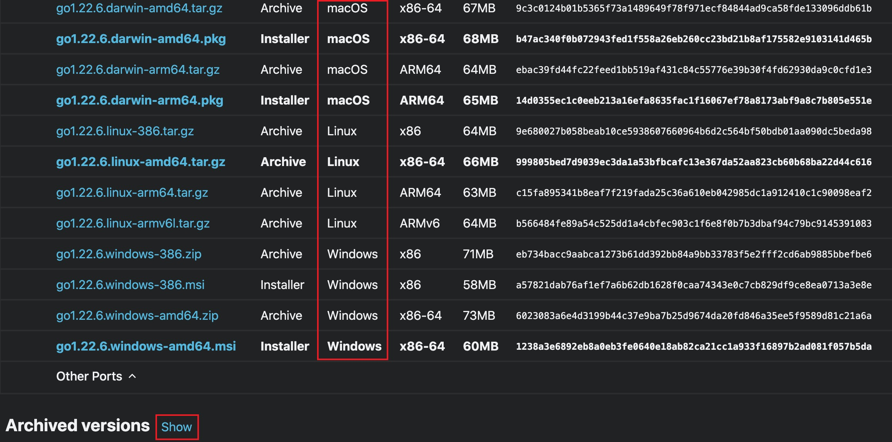

`持续更新 ...`

<!-- more -->

### [目录]

- [安装包下载](#安装包下载)

- [不同环境安装](#不同环境安装)

- [参数配置](#参数配置)

- [构建和运行](#构建和运行)

#### 安装包下载

1. 请求 [下载地址](https://go.dev/dl/) 进行 安装包下载 
2. 根据Mac、Linux、Windows 选择不同环境进行下载，点击show选择不同版本
       

#### 不同环境安装
- Linux
  1. 下载安装包

  2. 通过删除 /usr/local/go 文件夹（如果存在）来删除任何以前的 Go 安装，然后将您刚刚下载的存档解压到 /usr/local，在 /usr/local/go 中创建一个新的 Go 树：
      ``` bash
      $ rm -rf /usr/local/go && tar -C /usr/local -xzf go1.23.0.linux-amd64.tar.gz
      ```

  3. 将 /usr/local/go/bin 添加到 PATH 环境变量
      ``` bash
        # 您可以通过将以下行添加到您的 $HOME/.profile 或 /etc/profile (对于系统范围的安装) 来执行此操作：
        
        export PATH=$PATH:/usr/local/go/bin
        
        # 注意：对配置文件所做的更改可能要等到您下次登录计算机时才会生效。要立即应用更改，只需直接运行 shell 命令或使用 source $HOME/.profile 等命令从配置文件中执行这些更改。
      ```

  4. 打开命令提示符并输入以下命令来验证是否已安装 Go
      ``` bash
      $ go version
      ```

- Mac
  1. 下载安装包
  2. 打开下载的包文件，按照提示安装Go
      > 该软件包将 Go 发行版安装到 /usr/local/go。该软件包应将 /usr/local/go/bin 目录放入您的 PATH 环境变量中。您可能需要重新启动任何打开的终端会话才能使更改生效。
  3. 打开命令提示符并输入以下命令来验证是否已安装 Go
      ``` bash
      $ go version
      ```

- Windows
  1. 下载安装包
  2. 打开下载的 MSI 文件并按照提示安装 Go
      ```
        默认情况下，安装程序将安装 Go to Program Files 或 Program Files (x86)。您可以根据需要更改位置。安装后，您需要关闭并重新打开所有打开的命令提示符，以便安装程序对环境所做的更改反映在命令提示符中。
      ```
  3. 验证您是否已安装 Go。
      1. 输入 Win+Q， cmd, Enter 确认
      
      2. 打开命令提示符并输入以下命令来验证是否已安装 Go
          ``` bash
          $ go version
          ```

#### 参数配置

  - GO111MODULE
      > - GO111MODULE=off，无模块支持，go命令行将不会支持module功能，寻找依赖包的方式将会沿用旧版本那种通过vendor目录或者GOPATH模式来查找。
      > - GO111MODULE=on，模块支持，go命令行会使用modules，而一点也不会去GOPATH目录下查找。
      > - GO111MODULE=auto，默认值，go命令行将会根据当前目录来决定是否启用module功能。这种情况下可以分为两种情形：
      （1）当前目录在GOPATH/src之外且该目录包含go.mod文件，开启模块支持。
      （2）当前文件在包含go.mod文件的目录下面。
    
      ``` bash
      $ go env -w GO111MODULE=on
      ```

  - GOPROXY
      > 一些第三方代码库是在国外服务器上的，因为一些限制，我们不能很顺利的使用和下载这些仓库，这样就会导致下载缓慢或者失败，所以这个时候就需要一个 代理来实现下载，这个代理就是中间商，可以跨过限制来访问。
    
      ``` bash
      # 国内七牛云代理
      go env -w GOPROXY=https://goproxy.cn,direct
      ```

#### 构建和运行
  1. 编写代码
      1. 新建 *go_test* 文件夹

          ```
          $ make dir go_test
          ```
      2. 新建 *hello.go* 文件
          ```
          $ vi hello.go
          --------------------------------------------
          package main
       
          import "fmt"
       
          func main() {
       
            fmt.Println("Hello World!")	
        
          } 
          ```
    
  2. 构建

      1. 初始化
          ``` bash
          $ go mod init hello
          $ go mod tidy
          ```

      2. 构建、运行
          ``` bash
          $ go build
          $ ./hello
          ```
    


[返回目录](https://feng6917.github.io/language-golang/#目录)      

----
参考链接

- [官网 Download and install](https://go.dev/doc/install)
- [Windows上安装 Go 环境并配置环境变量 （超详细教程）](https://blog.csdn.net/liu_chen_yang/article/details/132012969)
- [安装和设置Go开发环境：详细指南
](https://cloud.tencent.com/developer/article/2426367)

