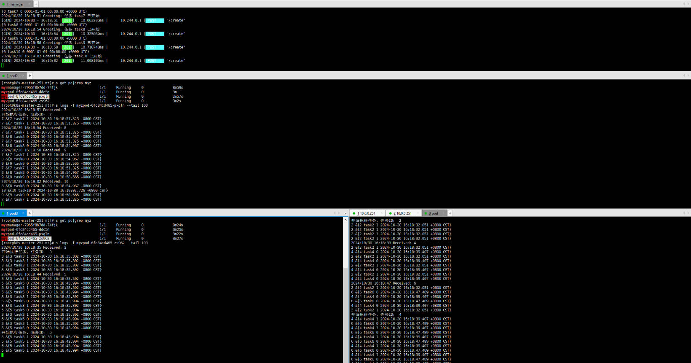

`针对实际业务场景，实现一个多副本任务管理`

<!-- more -->

### 目录

- [一、场景描述](#一场景描述)
- [二、管理中心实现](#二管理中心实现)
- [三、任务中心实现](#三任务中心实现)
- [四、协议调度及效果展示](#四协议调度及效果展示)

#### 一、场景描述
>
> 在实际业务场景中，我们经常需要处理一些高并发的任务，比如批量处理数据、定时任务等。为了提高系统的并发处理能力，我们可以采用多副本调度的方式，将任务分配给多个副本进行处理。本文将介绍如何实现一个多副本调度任务，包括业务管理中心和任务中心的实现。

1. 管理中心：负责管理任务的状态和调度任务到任务中心
2. 任务中心：负责执行任务，监控任务状态及任务执行情况及时调整

#### 二、管理中心实现

> 管理中心负责管理任务的状态和调度任务到任务中心，主要包括以下功能：

1. 任务创建：用户可以创建任务，并指定任务的名称、描述、执行时间等参数，创建后进行持久化，然后调度到任务中心执行。
2. 任务调整：用户可以调整任务状态，停止，重启等，提供协议或NSQ，供任务中心监控及时调整任务执行情况。

- 外部调用协议的实现，可以使用Gin直接实现创建任务、查看任务详情、查看任务列表、停止及重启任务。

- 内部调用协议的实现，可以使用Grpc实现订阅协议，供任务中心监控及时调整任务执行情况。

- 内部广播实现可以使用`go-broadcast`包。使用协议订阅可以调整为消息队列方式实现，任务中心消费者组订阅NSQ方式实现任务状态变化监听。

#### 三、任务中心实现

> 任务中心负责执行任务，监控任务状态及任务执行情况及时调整，主要包括以下功能：

1. 任务执行：任务中心接收到任务后，根据任务类型和参数执行任务。
2. 任务监控：任务中心监控任务状态，对任务执行情况进行实时调整。

- 外部实现，Grpc 开启任务协议

- 内部实现，任务调度，可利用队列实现，接收任务后加入等待队列，定时从等待队列取任务到运行队列，运行队列限制运行数量。

- 内部实现，任务状态监听，监听管理中心订阅协议，根据任务状态调整等待及运行队列中任务。

#### 四、协议调度及效果展示

1. 程序打包，镜像编译，上传镜像仓库

2. helm 文件编辑，k8s部署

3. 外部调用协议测试

    <a href="#目录" style="text-decoration: none;">Top</a>

