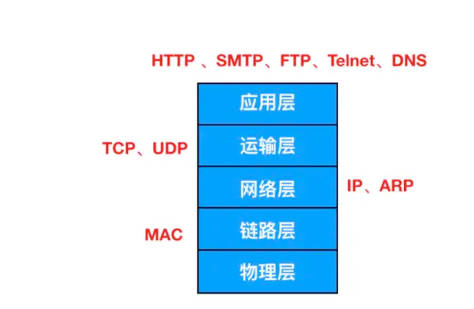
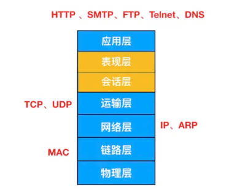
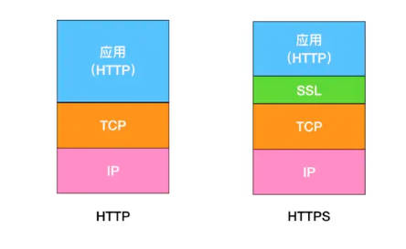
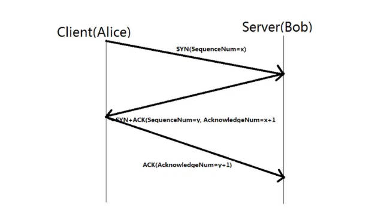
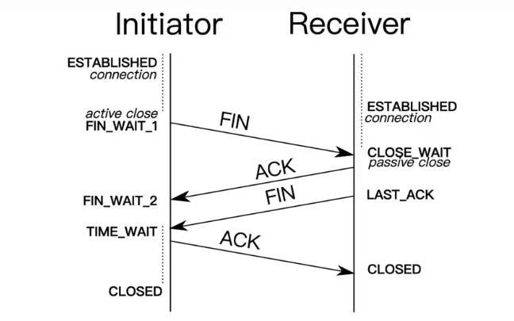

`gulang 基础面试汇总`

<!-- more -->

#### 目录

- [Go基础](#go基础)
- [网络](#网络)
- [微服务](#微服务)
- [消息队列](#消息队列)
- [Docker](#docker)
- [常用词汇理解](#常用词汇理解)
- [场景题](#场景题)

#### Go基础

###### 1. = 和 := 的区别?

1. = 是赋值操作符，用于给变量赋值
2. := 是声明并赋值操作符，用于声明并初始化变量

> := 可以理解为 var + =，但 := 只能在函数体内使用，不能在函数体外使用

###### 2. 指针的作用?

1. 动态内存分配：指针可以用于动态分配内存，例如使用 new 函数创建一个新的变量，并返回其指针。

2. 修改值：指针可以用于修改其指向的变量的值，而不需要通过返回值或全局变量。例如，可以通过指针修改一个函数的参数的值。

3. 传递大型结构体：由于指针存储的是内存地址，因此传递指针比传递大型结构体更高效，因为它避免了复制整个结构体的开销。

4. 实现引用语义：指针可以实现引用语义，即多个变量可以引用同一个内存地址，从而共享同一个值。

5. 实现动态数据结构：指针可以用于实现动态数据结构，例如链表、树和图等。

6. 实现并发编程：在并发编程中，指针可以用于在多个 goroutine 之间共享和修改数据。

###### 3. Go 允许多个返回值么?
>
> 允许

###### 4. Go 有异常类型么？
>
> Go语言没有内置的异常类型。在Go语言中，错误是通过返回值来处理的，而不是通过异常来处理的。这种错误处理方式被称为返回错误模式。

###### 5. 什么是协程（Goroutine）?

1. goroutine是一种轻量级的线程,由go运行时管理，而不是由操作系统管理。
2. goroutine可以看作用户态的线程，它们共享相同的地址空间，但它们之间没有共享的栈，因此它们之间切换开销非常小。
3. goroutine 特点：
    - 轻量级：协程的创建、销毁和切换开销非常小，因此可以创建大量的协程。
    - 并发执行：协程可以在多个CPU核心上并发执行，从而提高程序的执行效率。
    - 非抢占式：协程是非抢占式的，也就是说，协程只能主动让出CPU，而不能被操作系统强制中断。
    - 通道通信：协程之间可以通过通道（Channel）进行通信，从而实现并发编程。

> 一个Goroutine会以一个很小的栈启动2KB或4KB，当遇到栈空间不足时，栈会自动伸缩， 因此可以轻易实现成千上万个goroutine同时启动。

###### 6. 如何高效的拼接字符串？

1. 使用 + 运算符：使用 + 运算符拼接字符串时，每次都会创建一个新的字符串，这会导致大量的内存分配和复制，从而降低性能。例如：

2. 使用 strings.Builder：strings.Builder 是Go语言标准库中的一个结构体，它可以高效地拼接字符串。它使用一个字节切片来存储字符串，并且可以在原地修改字符串，而不需要创建新的字符串。

###### 7. 什么是rune类型？

在Go语言中，rune类型是一个32位的整数类型，用于表示Unicode码点。它通常用于处理UTF-8编码的字符串。

在Go语言中，字符串是以UTF-8编码的，每个字符可能占用1到4个字节。因此，我们不能直接使用索引来访问字符串中的字符，因为索引返回的是字节的位置，而不是字符的位置。为了解决这个问题，Go语言引入了rune类型，它可以表示一个Unicode字符，无论它占用多少个字节。

###### 8. Go 支持默认参数或可选参数么？

Go语言不支持默认参数或可选参数。在Go语言中，函数的参数列表中的每个参数都必须有明确的名称和类型，不能省略。如果函数有多个参数，那么调用函数时必须提供所有参数的值。

可以利用结构体参数，或者...传入参数切片数组。

###### 9. defer 的执行顺序？

1. defer语句的执行顺序是后进先出（LIFO），也就是说，最后声明的defer语句会最先执行。

2. defer语句中的参数会在声明时求值，而不是在执行时求值。

3. defer 原理
    > Go 中的 defer 语句会将函数推迟到外层函数返回之后执行。
    > 推迟的函数调用会被压入一个栈中。当外层函数返回时，被推迟的函数会按照后进先出的顺序调用。

###### 10. Go 语言tag的用处？

在Go语言中，tag是一种元数据，它可以附加到结构体字段的声明中，用于描述字段的额外信息。tag通常用于序列化和反序列化、数据库映射、JSON映射等场景。

其他场景：Gorm、Gin Form等

###### 11. 如何获取一个结构体的所有tag？

在Go语言中，可以使用反射（reflection）来获取一个结构体的所有tag。

1. 使用reflect.TypeOf函数获取其类型。
2. 然后，我们使用NumField方法获取结构体中的字段数量，并使用Field方法获取每个字段的类型信息。
3. 最后，我们使用Tag.Get方法获取每个字段的json标签。

###### 12. 如何判断两个字符串切片（slice）是相等的

使用reflect.DeepEqual()函数

###### 13. 结构体打印时，%v,%s+v,%#v的区别？

1. %v：这是最常用的占位符，它会以默认的方式打印结构体的值。
2. %+v：这个占位符与%v类似，但它会打印结构体的字段名和值，包括私有字段。
3. %#v：这个占位符会打印结构体的完整表示，包括结构体的类型、字段名、字段值和内存地址。

###### 14. Go 语言如何表示枚举值？

枚举值通常使用const关键字和iota常量生成器来表示。

1. 使用const 定义枚举值。
2. 使用iota 自增。

###### 15. 空结构体的用途？

1. 实现集合：由于空结构体不占用任何内存空间，因此可以使用空结构体来实现集合。例如，可以使用一个映射（map）来存储集合的元素，其中键是元素的值，值是一个空结构体。

2. 实现信号：空结构体可以用于实现信号，例如，可以使用一个通道（channel）来发送和接收信号，其中通道的值是一个空结构体。

3. 实现互斥锁：空结构体可以用于实现互斥锁，例如，可以使用一个通道（channel）来阻塞和解除阻塞，其中通道的值是一个空结构体。

###### 16. Go 里面的int和int32的区别？

- **大小**：int类型的大小取决于操作系统。在32位操作系统上，int类型的大小是32位，在64位操作系统上，int类型的大小是64位。int32类型的大小始终是32位。

- **范围**：由于int类型的大小取决于操作系统，因此int类型的范围也取决于操作系统。在32位操作系统上，int类型的范围是-2^31到2^31-1，在64位操作系统上，int类型的范围是-2^63到2^63-1。int32类型的范围始终是-2^31到2^31-1。

- **性能**：由于int32类型的大小固定为32位，因此它在某些情况下可能会比int类型更高效。例如，如果函数的参数或返回值是int32类型，那么编译器可以生成更优化的代码。

- **可移植性**：由于int类型的大小取决于操作系统，因此int类型在跨平台编程中可能会遇到问题。

###### 17. init() 函数是什么时候执行的，可以执行多次么?

- init()函数是一种特殊的函数，它用于初始化包级别的变量和执行一些初始化操作。

- init()函数在包被首次导入时执行，并且只执行一次。

- init()函数不能被显式调用，也不能被其他函数调用。它只能由Go运行时在包被首次导入时自动执行。

- 每个包可以有多个init()函数，这些init()函数的执行顺序是不确定的，但它们都会在包被首次导入时执行。

> 执行顺序：import –> const –> var –>init()–>main()

###### 18. 多个init()函数的意义何在？

- 分离初始化逻辑：可以将不同的初始化逻辑分离到不同的init()函数中，使得代码更加模块化和清晰。
- 简化包的初始化：通过将初始化逻辑分散到多个init()函数中，可以简化包的初始化过程。
- 提高代码的可读性：将初始化逻辑分散到多个init()函数中，可以使代码更加清晰和易于理解。
- 并行执行：在Go 1.9版本之后，init()函数可以并行执行。这意味着多个init()函数可以在不同的goroutine中并行执行，从而提高程序的启动速度。

###### 19. 如何知道一个对象是分配到堆上还是栈上？

变量的存储位置（堆或栈）是由编译器在编译时决定的，而不是在运行时决定的。

- **栈**：局部变量、函数参数和返回值通常存储在栈上。栈是一种后进先出（LIFO）的数据结构，它用于存储函数调用的参数和返回值，以及局部变量。栈的内存空间在函数调用时分配，在函数返回时释放。

- **堆**：全局变量、动态分配的内存和大多数复合类型（例如切片、映射和通道）通常存储在堆上。堆是一种动态分配的内存空间，它用于存储全局变量和动态分配的内存。堆的内存空间在程序运行时分配，并且在不再需要时由垃圾回收器自动释放。

`Go build -gcflags '-m -m -l' xxx.go.`

> 关于逃逸的可能情况：变量大小不确定，变量类型不确定，变量分配的内存超过用户栈最大值，暴露给了外部指针。

###### 20. 2个interface{} 可以比较么？

不能进行直接比较，需要先判断类型是否一致，如果一致再判断值是否一致。

###### 21. 函数返回局部变量的指针是安全的么？
>
> 不安全

当函数返回后，局部变量会被销毁，此时指针指向的内存区域已经无效。

###### 22. 无缓冲的channel和有缓冲的channel的区别?

1. **无缓冲的通道**：无缓冲的通道在发送和接收操作之间没有缓冲区，因此发送操作和接收操作必须同时进行。如果发送操作在接收操作之前发生，那么发送操作会阻塞，直到有接收操作发生。同样，如果接收操作在发送操作之前发生，那么接收操作会阻塞，直到有发送操作发生。

2. **有缓冲的通道**：有缓冲的通道在发送和接收操作之间有一个缓冲区，因此发送操作和接收操作可以独立进行。如果缓冲区已满，那么发送操作会阻塞，直到有接收操作发生。同样，如果缓冲区为空，那么接收操作会阻塞，直到有发送操作发生。

> 无缓冲的通道用于在goroutine之间进行同步，而有缓冲的通道用于在goroutine之间进行异步通信。

###### 23. 为什么会有协程泄露(Goroutine Leak)?

协程泄露（goroutine leak）是指goroutine在创建后没有被正确地关闭或结束，导致它们继续运行并消耗系统资源，但不再被需要。

1. **忘记关闭通道**：在Go语言中，goroutine通常通过通道进行通信。如果一个goroutine在等待从通道接收数据，但通道没有被关闭，那么goroutine会一直等待，导致协程泄露。

2. **未处理的错误**：如果一个goroutine在执行过程中遇到错误，并且错误没有被正确处理，那么goroutine可能会继续运行，导致协程泄露。

3. **未处理的退出信号**：如果一个goroutine在等待退出信号，但退出信号没有被正确发送，那么goroutine会一直等待，导致协程泄露。

4. **阻塞**：缺少接收器或缺少发送器。

5. **死锁**：多个goroutine 由于竞争资源导致死锁。

###### 24. Go 可以限制运行时操作系统的线程数量么，常见的goroutine函数有哪些?

可以限制运行时操作系统的线程数量，通过runtime包中的GOMAXPROCS函数可以设置。该值默认为CPU逻辑核数，如果设的太大，会引起频繁的线程切换，降低性能。

常见的goroutine函数有：

1. runtime.Gosched() 让出当前goroutine的执行权限，调度器安排其它等待的任务运行，并在下次某个时候从该位置恢复执行。
2. runtime.Goexit() 退出当前goroutine，不会影响其他goroutine的执行。
3. runtime.GOMAXPROCS() 设置可执行的CPU核数，默认为CPU逻辑核数。

###### 25. new 和 make 的区别？

1. **new**：new函数用于分配内存并返回指向该内存的指针。new函数的参数是一个类型，它返回一个指向该类型的零值。

2. **make**：make函数用于创建并初始化切片、映射和通道。make函数的参数是一个类型和一个可选的长度和容量。

###### 26. 简述Golang 面向对象是如何实现的？

面向对象编程（OOP）是通过结构体（struct）和接口（interface）来实现的。

- **封装**：在Go中，封装是通过将字段和方法封装在结构体中实现的。只有结构体的方法才能访问结构体的字段。（也可以说成内部结构体方法）

- **继承**：在Go中，继承是通过嵌入（embedding）来实现的。当一个结构体嵌入另一个结构体时，它将继承被嵌入结构体的所有字段和方法。（编译时特征）

- **多态**：在Go中，多态是通过接口（interface）来实现的。一个类型可以实现多个接口，从而实现多态性。（运行时特征）

###### 27. uint型变量值分为为1，2，它们相减的结果是多少？

结果会溢出，如果是32位系统，结果是2^32-1，如果是64位系统，结果2^64-1.

###### 28. golang的内存管理的原理清楚吗？简述go内存管理机制?

Go语言的内存管理机制主要基于Tcmalloc（Thread-Caching Malloc）算法，该算法由Google开发，用于优化多线程环境下的内存分配性能。

1. **内存分配**：Go语言使用一个全局的内存分配器来管理内存。内存分配器将内存划分为不同的区域，每个区域用于存储特定大小的对象。当需要分配内存时，内存分配器会根据对象的大小选择合适的区域，并将对象存储在该区域中。

2. **内存回收**：Go语言使用垃圾回收（Garbage Collection，GC）机制来回收不再使用的内存。垃圾回收器会定期扫描内存，找出不再使用的对象，并将它们标记为垃圾。然后，垃圾回收器会回收这些对象的内存，以便重新使用。

3. **内存对齐**：Go语言要求对象在内存中按照一定的对齐方式存储。这种对齐方式可以优化内存访问性能，并减少内存碎片。Go语言使用一个名为mcache的结构体来管理内存对齐。

4. **内存池**：Go语言使用内存池来减少内存分配和回收的开销。内存池将内存划分为不同的区域，每个区域用于存储特定大小的对象。当需要分配内存时，内存池会从合适的区域中获取内存，而不是直接从全局内存分配器中获取。当不再需要内存时，内存池会将内存返回到合适的区域中，而不是直接将内存归还给全局内存分配器。

###### 29. mutex有几种模式？分别是什么？

mutex 是 Go 语言中的一种同步原语，用于保护共享资源，防止多个 goroutine 同时访问。它是一种互斥锁，即同一时间只有一个 goroutine 可以持有该锁，其他 goroutine 需要等待锁被释放后才能继续执行。

1. 正常模式
    - **等待队列**：等待获取互斥锁的goroutine按照先进先出（FIFO）的顺序排队。
    - **竞争机制**：当一个goroutine被唤醒并试图获取互斥锁时，它与其他新到达的goroutine竞争锁的拥有权。新到达的goroutine有优势，因为它们已经在CPU上运行，并且可能有很多这样的goroutine。因此，被唤醒的goroutine有很大机会失败，并会被重新排队到等待队列的前面。
    - **切换到饥饿模式**：如果一个goroutine等待超过1毫秒仍未获取到互斥锁，则互斥锁会切换到饥饿模式。

2. 饥饿模式
    - **直接传递所有权**：在饥饿模式下，互斥锁的所有权直接从释放锁的goroutine传递给等待队列中的第一个goroutine。
    - **新goroutine的等待**：新到达的goroutine不会尝试获取互斥锁，即使它看起来是解锁状态，也不会自旋。相反，它们会排队到等待队列的末尾。
    - **切换回正常模式**：如果一个goroutine获取了互斥锁，并且发现它是队列中的最后一个等待者，或者它等待的时间少于1毫秒，那么互斥锁会切换回正常操作模式。

3. `mutex.state`是32位的整型变量，内部实现时把该变量分成四份，用于记录Mutex的四种状态
    - **mutexLocked**：表示互斥锁是否被锁定，1表示锁定，0表示未锁定。
    - **mutexWoken**：表示是否唤醒过goroutine，1表示已经唤醒过，0表示没有唤醒过。
    - **mutexStarving**：表示是否处于饥饿模式，1表示处于饥饿模式，0表示不处于饥饿模式。
    - **mutexWaiterShift**：表示等待队列的长度，即等待获取互斥锁的goroutine的数量。

###### 30. Go 如何进行调度的？详细说一下？

1. **Goroutine**：Goroutine是Go语言中的轻量级线程，它由Go运行时管理，而不是由操作系统管理。Goroutine的创建、销毁和切换开销非常小，因此可以创建大量的Goroutine。

2. **Processor**：Processor是Go语言调度器的基本执行单元，它负责执行Goroutine。每个Processor都有一个本地队列，用于存储等待执行的Goroutine。当Processor没有可执行的Goroutine时，它会从全局队列中获取Goroutine来执行。

3. **M（Machine）**：Machine是Golang调度器中的执行线程，它负责将Goroutine映射到操作系统线程上。每个M都有自己的调用栈和寄存器状态。调度器会根据需要创建或销毁M，以适应并发任务的数量和系统负载。

> `goroutine`的调度器使用了一种称为工作窃取（work stealing）和让出（hand off）的机制来提高并发性能。以下是一些关于工作窃取和让出的要点：

1. 工作窃取：当处理器没有可执行的goroutine时，它会从其他处理器的本地队列中窃取goroutine来执行。这种设计可以避免某些处理器空闲，从而提高并发性能。工作窃取是一种常见的并发算法，它可以在多个任务队列之间平衡负载。

2. 让出：当处理器在执行一个goroutine时，如果该goroutine需要等待某些事件的发生，例如等待I/O操作完成，那么处理器会主动让出该goroutine的执行，以便其他goroutine可以执行。这种设计可以避免某些goroutine长时间等待，从而提高并发性能。让出是一种常见的并发算法，它可以在多个任务之间平衡负载。

###### 31. Go 什么时候发生阻塞，阻塞时，调度器会怎么做？

1. 等待I/O操作：当goroutine执行I/O操作时，例如读取或写入文件、发送或接收网络数据等，它可能会被阻塞，直到操作完成。

2. 等待锁：当goroutine尝试获取一个已经被其他goroutine持有的锁时，它可能会被阻塞，直到锁被释放。

3. 等待通道操作：当goroutine在等待从通道接收数据，或者向通道发送数据时，它可能会被阻塞，直到操作完成。

4. 等待系统调用：当goroutine执行系统调用时，例如创建进程、打开文件等，它可能会被阻塞，直到系统调用完成。

当goroutine发生阻塞时，Go 调度器会进行以下操作：

1. 保存goroutine的状态：当goroutine发生阻塞时，Go调度器会保存goroutine的当前状态，包括寄存器的值、程序计数器、栈指针等。

2. 将goroutine放入等待队列：Go调度器会将goroutine放入相应的等待队列中，例如I/O等待队列、锁等待队列、通道等待队列等。

3. 选择新的goroutine执行：Go调度器会从其他处理器中选择一个goroutine来执行。如果其他处理器没有可执行的goroutine，那么Go调度器会从全局队列中获取goroutine来执行。

4. 恢复goroutine的状态：当goroutine从阻塞状态恢复时，Go调度器会恢复goroutine的当前状态，然后goroutine会继续执行。

###### 32. 如果一个G一直占用占用资源怎么办？

如果一个goroutine（G）一直占用资源，可能会导致其他goroutine无法执行，从而影响程序的并发性能。

1. **使用超时**：你可以为goroutine设置一个超时时间，如果goroutine在超时时间内没有完成，那么你可以中断它的执行。例如，你可以使用context包来设置超时时间。

2. **使用信号量**：你可以使用信号量来限制goroutine的并发数量。例如，你可以使用sync.WaitGroup来等待goroutine完成，或者使用sync.Mutex和sync.Cond来实现一个计数信号量。

3. **使用抢占式调度**：Go语言调度器使用抢占式调度来避免某些goroutine长时间占用CPU。当goroutine执行的时间过长时，Go运行时会主动抢占它的执行，以便其他goroutine可以执行。

###### 33. goroutine 什么时候会发生泄露？

goroutine泄漏是指goroutine创建后，由于某种原因一直无法结束，导致资源无法释放。

暂时性泄露：

1. 获取长字符串中的一段长字符未释放
2. 获取长slice的一段导致长slice未释放
3. 在长slice新建slice导致泄露

永久性泄露：

1. goroutine 永久阻塞而导致泄露
2. time.Ticker未关闭导致泄露

###### 34. Go 竞态条件了解么？

竞态条件（Race Condition）是指多个goroutine同时访问和修改共享资源，导致程序的行为不确定。以下是一些关于竞态条件的要点：

- **共享资源**：在Go语言中，goroutine可以访问和修改共享资源，例如全局变量、映射和切片等。如果一个goroutine在修改共享资源时，其他goroutine也在修改共享资源，那么就会发生竞态条件。

- **不确定的行为**：当多个goroutine同时访问和修改共享资源时，程序的行为是不确定的。例如，一个goroutine可能会读取到一个未初始化的变量，或者一个goroutine可能会覆盖另一个goroutine的修改。

- **检测竞态条件**：Go语言提供了一个名为race detector的工具，用于检测竞态条件。你可以使用go run -race命令来运行程序，并使用go test -race命令来运行测试。如果程序中存在竞态条件，那么race detector会打印出相关的信息。

- **避免竞态条件**：为了避免竞态条件，你应该使用同步机制来保护共享资源。例如，你可以使用sync.Mutex或sync.RWMutex来保护共享变量，或者使用sync.WaitGroup来等待goroutine完成。

###### 35. 若干个goroutine，有一个panic怎么办？

如果一个goroutine发生panic，那么它会停止执行，并且会向其所在的goroutine发送一个panic信号。

如果这个goroutine没有处理这个panic信号，那么panic会继续向上层goroutine传播，直到被捕获或导致程序崩溃。

> 为了避免这种情况，可以使用defer语句和recover函数来捕获panic，并处理它。

###### 36. defer 可以捕捉goroutine的子goroutine么?

不可以。

1. 它们处于不同的调度器P中。对于子goroutine，必须通过 `recover()` 机制来进行恢复，然后结合日志进行打印。

2. 或者通过channel传递error，然后通过channel接收error，进行打印。

###### 37. Go 是怎么做参数校验的？

1. **类型断言**：你可以使用类型断言来检查参数的类型。例如，你可以使用value, ok := interface{}(parameter).(Type)来检查参数是否为特定类型。

2. **类型检查**：你可以使用类型检查来检查参数的类型。例如，你可以使用reflect.TypeOf(parameter) == reflect.TypeOf(Type)来检查参数是否为特定类型。

3. **自定义函数**：你可以编写自定义函数来检查参数的值。例如，你可以编写一个函数来检查参数是否为非负数，或者参数是否为有效的电子邮件地址。

4. **第三方库**：有一些第三方库提供了更强大的参数校验功能。例如，go-playground/validator库可以用于校验结构体的字段，go-playground/validator.v10库可以用于校验结构体的字段。

###### 38. 中间件用过么？

中间件是一种拦截器，它可以在请求到达目标方法之前，对请求进行拦截，也可以在目标方法执行之后，对响应进行拦截。

中间件可以用于日志记录、身份验证、权限检查、参数校验等场景。

###### 39. Go 解析tag是如何实现的？

1. 在编译阶段，编译器会将tag解析为结构体字段的反射信息，并存储在结构体字段的反射信息中。

2. 在运行阶段，通过反射获取结构体字段的反射信息，从而获取tag信息。

###### 40. 项目如何使用信号进行优雅的启停？

1. 在程序启动时，监听系统信号，当收到系统信号时，执行相应的操作，比如：数据库连接、开启http服务、开启grpc服务等。

2. 在程序退出时，关闭所有资源，比如：关闭数据库连接、关闭文件句柄、关闭http服务、关闭grpc服务等。

###### 41. 持久化怎么做的？

持久化是将数据存储到磁盘，以便在程序退出后仍然可以访问数据。在Go中，可以使用文件、数据库、缓存等存储方式来实现持久化。

- **文件持久化**：将数据存储到文件中，可以使用os包中的函数来读写文件。（1. 直接存储 2. 序列化成固定协议）

- **数据库持久化**：将数据存储到数据库中，可以使用数据库驱动程序来连接数据库，并执行SQL语句来操作数据。

- **缓存持久化**：将数据存储到缓存中，可以使用缓存服务，如Redis、Memcached等，来存储数据。

###### 42. Channel 死锁的场景？

Channel 死锁是指两个或多个 goroutine 在等待对方释放资源时，导致程序无法继续执行的情况。

常见的死锁场景有：

1. 当一个 channel 中没有数据，直接读取时。
2. 当 channel 数据满了，再尝试写数据时。
3. 向一个关闭的channel 写数据。

###### 43. 对已经关闭的chan进行读写会出现什么情况？

1. 向已经关闭的 channel 写数据会导致 panic。
2. 从已经关闭的 channel 读数据;
    - 如果 channel 中还有数据，则可以正常读取。状态为True。
    - 如果 channel 中没有数据，则返回零值。状态为False。

###### 44. 说受atomic底层是怎么实现的？

atomic 底层使用的是 CPU 提供的原子操作指令, 这些指令可以在不使用锁的情况下，保证对内存的原子操作，从而实现并发安全。

通过源码可知，atomic采用CAS(CompareAndSwap)的方式实现的。

所谓的CAS就是使用了CPU的原子性操作。在操作共享变量时，CAS不需要对其进行加锁，而是通过类似于乐观锁的方式进行检测，总是假设被操作的值未曾改变(即旧值相等),并一旦确认这个假设的真实性就立即进行值替换。本质上是不断占用CPU资源来避免加锁的开销。

###### 45. channel 底层实现，是否线程安全？

通道（channel）是一种用于在goroutine之间进行通信的数据结构。通道的底层实现是基于环形队列和互斥锁的，它确保了线程安全。

以下是一些关于通道的要点：

- **环形队列**：通道的底层实现是一个环形队列，它用于存储发送到通道的数据。当通道的缓冲区已满时，发送操作会阻塞，直到有接收操作发生。同样，当通道为空时，接收操作会阻塞，直到有发送操作发生。

- **互斥锁**：通道使用互斥锁来保护对环形队列的访问。当一个goroutine在发送或接收数据时，它会获取互斥锁，然后访问环形队列。当其他goroutine尝试发送或接收数据时，它们会等待互斥锁被释放。

- **线程安全**：由于通道的底层实现使用了互斥锁，因此它是线程安全的。多个goroutine可以同时发送或接收数据，而不会发生竞态条件。

###### 46. map 的底层实现？

map是一种用于存储键值对的数据结构。map的底层实现是基于哈希表（hash table）的。

以下是一些关于map的底层实现的要点：

- **哈希表**：map的底层实现是一个哈希表，它使用哈希函数将键转换为哈希值，然后根据哈希值将键值对存储在哈希表中的适当位置。

- **桶**：哈希表由多个桶组成，每个桶可以存储多个键值对。当哈希函数将键转换为哈希值时，哈希表会根据哈希值将键值对存储在适当的桶中。
    1. 每个bucket固定包含8个key和value,实现bmap是一个固定大小的连续内存块，分为四部分，每个条目的状态，8个key值，8个value值，指向下个bucket的指针。

- **链表**：如果两个键的哈希值相同，那么它们会被存储在同一个桶中。在这种情况下，哈希表会使用链表来存储这些键值对。链表中的每个节点都包含一个键值对。

- **扩容**：当哈希表的负载因子（即键值对的数量除以桶的数量）超过一定阈值时，哈希表会进行扩容。扩容会创建一个新的哈希表，并将旧的哈希表中的键值对复制到新的哈希表中。扩容可以减少哈希冲突，提高哈希表的性能。

> map 查找就是将key哈希后得到的64位用最后8个比特位计算在哪个桶，在bucket中，从前往后找到第一个空位。这样，在查找某个key时，先找到对应的桶，再去遍历 bucket 中的key。

47. select 的实现原理？

select是一种用于处理多个通道的语句。select的底层实现是基于轮询和通道的，它确保了线程安全。以下是一些关于select的要点：

- **轮询**：select会轮询每个通道，看是否有数据可以读取或写入。如果有，那么select会立即处理该通道，并返回相应的结果。如果没有，那么select会等待，直到有数据可以读取或写入。

- **通道**：select可以处理多个通道，包括无缓冲通道和有缓冲通道。对于无缓冲通道，select会立即处理该通道。对于有缓冲通道，select会等待，直到缓冲区有数据或可以写入数据。

- **超时**：select可以设置超时时间。如果超时时间到达，那么select会返回一个特殊的值，表示超时。

- **线程安全**：由于select会轮询每个通道，因此它是线程安全的。多个goroutine可以同时调用select，而不会发生竞态条件。

###### 48. interface 底层实现？（待补充）

接口由两种类型实现 iface 和 eface。iface 是包含方法的接口，而 eface 不包含方法。

- **iface**: tab表示接口的具体结构类型，而data是接口的值
- **eface**: 使用_type 直接表示类型，这样就无法使用方法。

###### 48. reflect 底层实现？（待补充）

reflect 包实现了运行时反射，允许程序操作任意类型的对象。

反射三大法则：

1. 反射从接口映射到反射对象。
2. 反射从反射对象映射到接口值。
3. 只有值可以修改，才可以修改反射对象。

> type用于获取当前值的类型，value用于获取当前的值。

###### 49. Go 调试/分析 工具用过哪些？

1. **pprof**：pprof是Go语言内置的性能分析工具，它可以生成程序的CPU和内存使用情况的报告。你可以使用go tool pprof命令来查看和分析这些报告。

2. **trace**：trace是Go语言内置的跟踪工具，它可以生成程序的执行情况的报告，包括goroutine的创建和销毁，阻塞和唤醒，系统调用等。你可以使用go tool trace命令来查看和分析这些报告。

3. **go test**：go test是一个用于运行Go测试的工具，它可以运行单元测试，基准测试和示例测试。你可以使用go test命令来运行测试，并使用-race标志来检测竞态条件。

4. **golint**：golint是一个用于检查Go代码风格的工具，它可以检测出代码中的风格问题，例如未使用的变量，未初始化的变量，错误的类型转换等。你可以使用golint命令来运行代码风格检查。

###### 50. 进程被Kill, 如何保证所有goroutine顺利退出?

如果一个进程被Kill，那么所有的goroutine都会被强制终止，无法保证它们顺利退出。

1. **使用context包**：你可以使用context包来传递取消信号。当进程被Kill时，你可以创建一个context.Context对象，并使用context.WithCancel函数来创建一个可取消的上下文。然后，你可以将这个上下文传递给每个goroutine，并在goroutine中定期检查上下文的取消状态。如果上下文被取消，那么goroutine可以优雅地退出。

2. **使用信号处理**：你可以使用os/signal包来监听操作系统信号。当进程被Kill时，操作系统会发送一个SIGTERM信号。你可以使用signal.Notify函数来监听SIGTERM信号，并在收到信号时取消上下文或关闭通道，从而通知goroutine退出。

###### 51. context 了解么？

context 是 Go 语言中用于在多个 goroutine 之间传递上下文信息，相同的 context 可以传递给运行在不同 goroutine 中的函数，上下文对于多个 goroutine 同时使用是安全的。

context 包定义了上下文类型，可以使用background, TODO 创建一个上下文，在函数调用链之间传播 context，也可以使用WithDeadLine, WithTimeout, WithCancel 或 WithValue 创建的修改副本替换它。

context 的作用就是在不同的goroutine之间 同步请求特定的数据，取消信号以及处理请求的截至日期。

###### 52. Go 切片可以赋值给数组么？

不可以。

切片和数组是不同的类型，不能直接赋值。

###### 53. goroutine 如何关闭？

1. **使用context包**：你可以使用context包来传递取消信号。当goroutine需要退出时，你可以创建一个context.Context对象，并使用context.WithCancel函数来创建一个可取消的上下文。然后，你可以将这个上下文传递给每个goroutine，并在goroutine中定期检查上下文的取消状态。如果上下文被取消，那么goroutine可以优雅地退出。

2. **使用channel**：你可以使用channel来通知goroutine退出。当goroutine需要退出时，你可以创建一个channel，并将这个通道传递给每个goroutine。然后，你可以向通道发送一个特殊的值，例如nil，来通知goroutine退出。在goroutine中，你可以定期检查通道的状态，如果通道被关闭，那么goroutine可以优雅地退出。

###### 54. 如何理解CSP(不要使用共享内存来通信，通过通信来共享内存)？

前后两个通信的概念不同，内存能够通过多个线程读到，修改内存数据，即可达到通过内存来通信。

在go中，一个内存由一个线程来负责，另外一个线程要操作这块内存，需要当前线程让渡所有权，这个所有权的让渡过程是"通信"。

本质上，两种模式谋求的都是同一时刻只有一个线程在操作同一块内存，以保护逻辑的原子性。后者通过引入所有权的概念，channel和临时变量，简化了操作约定。

###### 55. map 并发读写会怎样？

1. **并发读写**：当多个goroutine同时读取和修改map时，可能会发生竞态条件。例如，一个goroutine可能在另一个goroutine读取map的同时修改map，导致读取到的值是不确定的。

2. **未定义的行为**：由于map的并发读写可能会导致竞态条件，因此Go语言规范没有定义map的并发读写的行为。这意味着，如果你在并发读写map时没有使用同步机制，那么程序的行为是不确定的。

3. **使用互斥锁**：为了避免map的并发读写，你应该使用互斥锁来保护对map的访问。例如，你可以使用sync.Mutex或sync.RWMutex来保护map，或者使用sync.Map来处理并发读写。

###### 56. context.WithTimeout() 如何实现？

> WithTimeout 和 WithDeadline 创建的是 timeCtx，timerCtx 基于 cancelCtx，多了一个 time.Timer 和 deadline。

1. **实现原理**：context.WithTimeout()函数的实现原理是使用一个定时器来设置一个超时时间，并在超时时间到达时取消上下文。当上下文被取消时，所有等待该上下文的goroutine都会收到一个取消信号，从而可以优雅地退出。

2. **使用场景**：context.WithTimeout()函数通常用于设置一个超时时间，以防止goroutine无限期地等待。例如，你可以使用context.WithTimeout()函数来设置一个超时时间，以防止goroutine无限期地等待一个网络请求的响应。

    <a href="#目录" style="text-decoration: none;">Top</a>

#### 网络

1. grpc 是什么？
    

    
Ans

    gRPC 是基于go的远程过程调用。RPC 框架的目标就是让远程服务调用更加简单、透明，RPC 框架负责屏蔽层的传输方式（TCP或者UDP）、序列化方式（XML/JSON/二进制）和通信细节。
    服务调用者可以像本地接口一样调用远程的服务提供者，而不需要关心底层通信细节和调用过程。
    

2. grpc 为啥好，基本原理是什么，和http比呢？
    

    
Ans

    
grpc 是基于http2的，grpc 是一个现代开源的高性能远程过程调用框架，可以在任何环境中运行。它可以通过对负载平衡、跟踪、健康检查和身份验证的可插拔支持有效地连接数据中心和跨服务中兴的服务。它也适用于分布式计算的最后一英里，将设备、移动应用程序和浏览器连接到后端服务。

    
区别：

    <ul>
        <li>rpc是远程过程调用，就是本地去调用远程的函数；而http是通过 url 和符合restful风格的数据包去发送和获取数据。</li>
        <li>rpc一般使用的编解码协议更加高效，比如grpc使用protobuf编解码。而http一般使用json进行编解码，数据相比rpc更加直观，但是数据包也更大，效率低下。</li>
        <li>rpc一般用于服务内部调用，而http则用于和用户交互</li>
    </ul>
    
相似点：

    <ul>
        <li>都有类似的机制，例如grpc的metadata机制和http的头部机制作用相似，而web框架和grpc框架都有拦截器的概念。</li>
    </ul>
    

3. 什么是WebSocket?
    

    
Ans

    WebSocket 是一种在单个 TCP 连接上进行全双工通信的协议。WebSocket 使得客户端和服务器之间的数据交换变得更加简单，允许服务端主动向客户端推送数据。在 WebSocket API 中，浏览器和服务器只需要完成一次握手，两者之间就直接可以创建持久性的连接，并进行双向数据传输。
    

4. 全双工通讯协议的概念？
    

    
全双工是通讯传输的一个术语。通信允许数据在两个方向上同时传输，它在能力上相当于两个单工通信方式的结合。全双工指同时进行信号的双向传输。

    
拿演唱会举例：

    
单工：我们是场外观众，只能通过大屏幕查看，不能够进行互动。

    
半双工：我们是维护秩序保安，使用对讲机可以沟通，但同一时刻只能由一方进行数据传送。

    
全双工是：我们是场内观众，可以同时进行数据传送。

    

5. WebSocket 和 Socket 的区别是什么？
    

    
Ans

    
Socket 是对 TCP/IP 协议的封装，它提供了一个端到端的通信方式，使得数据可以在网络中传输。

    
WebSocket 是一个网络编程接口，是一种在单个 TCP 连接上进行全双工通信的协议，它使得客户端和服务器之间的数据交换变得更加简单，允许服务端主动向客户端推送数据，它允许在单个 TCP 连接上进行全双工通信。

    

6. http和WebSocket的区别是什么？
    

    
Ans

    
http 是一种应用层协议，它用于在网络上传输数据。而 WebSocket 是一种在单个 TCP 连接上进行全双工通信的协议，它允许在客户端和服务器之间进行实时通信。

    
http 是一种请求-响应协议，客户端发送一个请求，服务器返回一个响应。而 WebSocket 是一种全双工协议，客户端和服务器可以同时发送和接收数据。

    

7. http 和 https 的区别？
    

    
Ans

    
http 是一种超文本传输协议(Hypertext Transfer Protocol)，是一个在计算机世界里专门在两点之间传输文字、图片、音视频等文本数据的约定和规范。

    
    
HTTP 主要分为三部分： 超文本、传输、协议

    <ul>
        <li>超文本就是不单单只是文本，它还可以传输图片、音视频，甚至点击文字或图片能够进行超链接的跳转。</li>
        <li>上面这些概念可以统称为数据，传输就是数据需要经过一系列的物理介质从一个端系统传送到另外一个端系统的过程。通常我们把传输数据包的一方成为 请求方， 把 接到二进制数据包的一方称为 应答方。</li>
        <li>而协议指的就是网络中（互联网）传递、管理信息的一些规范。如同人与人之间相互交流是需要遵循一定的规矩一样，计算机之间的相互通信需要共同遵守一定的规则，这些规则就称为协议，只不过是网络协议。</li>
    </ul>
    
TCP/IP网络模型：

    
    
    
https 就是身披了一层 SSL 的 http

    

    http 和 https 的区别：
    <ul>
        <li>http 以 http:// 开头；https 以 https:// 开头</li>
        <li>http 是未经安全加密的协议，它的传输过程容易被攻击者监听、数据容易被窃取、发送方和接收方容易被伪造；而https 是安全的协议，它通过 密钥交换算法-签名算法-对称加密算法-摘要算法 能够解决上面问题。</li>
        <li>http 默认端口是80；https 默认端口是443</li>
    </ul>
    

8. http get 和 post 区别？
    

    
Ans

    
http 中 get 和 post 是 http 中最常用的两个方法，基本上使用 http 方法中有 99% 都是在使用 Get 和 post 方法，所以有必要我们对两个方法有更加深刻的认识。

    <ul>
        <li>get 方法一般用于请求，比如你在浏览器地址栏输入 xxx ,其实就是发送了一个get请求，它的主要特征是请求服务器返回资源，而post 方法一般用于 form 表单的提交， 相当于是把信息提交给服务器，等待服务器做出响应，get 相当于一个是 pull/拉的操作，而 post 相当于是一个 push/推 的操作。</li>
        <li>get 方法是不安全的，因为你在发送请求的过程中，你的请求参数会拼在URL后面，从而导致容易被攻击者窃取，对你的信息造成破坏和伪造；而post 方法是把参数放在请求体body 中的，对用户来说不可见。</li>
        <li>get 请求的URL 有长度限制，而 post 请求会把参数和值放在消息体中，对数据长度没有要求。</li>
        <li>get 请求会被浏览器主动 cache, 而 post 不会，除非手动设置。</li>
        <li>get 请求在浏览器反复地 回退/前进 操作是无害的，而post 操作会再次提交表单请求。</li>
        <li>get 请求在发送过程中会产生一个 TCP数据包；post 在发送过程中会产生两个TCP 数据包，对于 get 方式的请求，浏览器会把 http header 和 data 一并发送过去，服务器响应200（返回数据）;而对于post，浏览器先发送header, 服务器响应 100 continue, 浏览器再发送data, 服务器响应200 ok(返回数据)。</li>
    </ul>
    

9. 什么是无状态协议，http是无状态协议么，怎么解决？
    

    
Ans

    
无状态协议 就是浏览器对于事务的处理没有记忆能力。举个例子来说就是比如客户端请求获得网页之后关闭浏览器，然后再次启动浏览器，登录该网站，但是服务器并不知道客户关闭了一次浏览器。

    
http 就是一种无状态的协议，它对用户的操作没有记忆能力。可能大多数用户不相信，它可能觉得每次输入用户名和密码登录一个网站后，下次登录就不再重新输入用户名和密码了。这其实不是http做的事情，起作用的是 一个叫做 小甜饼(Cookie) 的机制。它能够让浏览器具有记忆能力。

    
JWT 的 Cookie 信息存储在客户端，而不是服务器内存中。也就是说JWT 直接本地进行验证就可以，验证完毕后，这个Token 就会在 Session 中随请求一起发送到服务器，通过这种方式，可以节省服务器资源，并且 token 可以进行多次验证。

    
JWT 支持跨域认证，Cookies 只能用在单个 节点的域 或者 它的子域 中有效。如果它们尝试通过第三个节点访问，就会被禁止。使用JWT 可以解决这个问题，使用JWT 能够通过多个节点进行用户认证，也就是我们常说的跨域认证。

    

10. UDP 和 TCP 的区别？
    

    
Ans

    
UDP User DataGram Protocol 用户数据包协议。它不需要所谓的 握手操作，从而加快了通信速度，允许网络上的其他主机在接收方同意通信之前进行数据传输。

    
UDP 的特点主要有：

    <ul>
        <li>UDP 能够支持容忍数据包丢失的带宽密集型应用程序。</li>
        <li>UDP 具有低延迟的特点</li>
        <li>UDP 能够发送大量的数据包</li>
        <li>UDP 能够允许 DNS 查找，DNS 是建立在 UDP 之上的应用层协议。</li>
    </ul>
    
TCP Transmission Control Protocol 传输控制协议。它能够帮助你确定计算机连接到 Internet 以及它们之间的数据传输。通过三次握手来建立TCP连接，三次握手就是用来启动和确认 TCP 连接的过程。一旦连接建立后，就可以发送数据了，当数据传输完成后，会通过关闭虚拟电路来断开连接。

    
TCP 的主要特点有：

    <ul>
        <li>TCP 能够确保连接的建立和数据包的发送</li>
        <li>TCP 支持错误重传机制</li>
        <li>TCP 支持拥塞控制，能够在网络拥堵的情况下延迟发送</li>
        <li>TCP 能够提供错误校验和甄别有害的数据包</li>
    </ul>
    
UDP 和 TCP 的区别：

    <ul>
        <li>TCP 是面向连接的协议；UDP是无连接的协议</li>
        <li>TCP 在发送数据前需要建立连接，然后再发送数据；UDP无需建立连接就可以直接发送大量数据</li>
        <li>TCP 会按照特定顺序重新排列数据包；UDP数据包没有固定顺序，所有数据包都相互独立</li>
        <li>TCP 传输速度比较慢；UDP 传输速度会更快</li>
        <li>TCP 头部有20字节；UDP 头部只有8字节</li>
        <li>TCP 是重量级的，在发送任何用户数据之前，TCP需要三次握手建立连接；UDP 是轻量级的，没有跟踪连接，消息排序等</li>
        <li>TCP 会进行错误校验，并能够进行错误恢复；UDP 也会错误检查，但会丢弃错误的数据包。</li>
        <li>TCP 有发送确认；UDP 没有</li>
        <li>TCP 会使用握手协议，例如 SYN，SYN-ACK，ACK； UDP 无握手协议。</li>
        <li>TCP 是可靠的，因为它可以确保数据传送到路由器；UDP 中不能保证数据发送到目标。</li>

    </ul>
    

11. TCP 三次握手和四次挥手？
    

    
Ans

    
TCP 是一种面向连接的、可靠的、基于字节流的传输层通信协议，它能够保证数据包的准确送达。

    
三次握手：

    
    
四次挥手：

    
    

12. 简述 http1.0/1.1/2.0 的区别？
    

    
Ans

    
http1.0：

    <ul>
        HTTP 1.0 是在 1996 年引入的，从那时开始，它的普及率就达到了惊人的效果。
        <li>HTTP 1.0 仅仅提供了最基本的认证，这时候用户名和密码还未经加密，因此很容易收到窥探</li>
        <li>HTTP 1.0 被设计用来使用短链接，即每次发送数据都会经过 TCP 的三次握手和四次挥手，效率比较低。</li>
        <li>HTTP 1.0 只使用 header 中的 If-Modified-Since 和 Expires 作为缓存失效的标准。</li>
        <li>HTTP 1.0 不支持断点续传，也就是说，每次都会传送全部的页面和数据。</li>
        <li>HTTP 1.0 认为每台计算机只能绑定一个 IP，所以请求消息中的 URL 并没有传递主机名（hostname）。</li>
    </ul>
    
http1.1：

    <ul>
        HTTP 1.1 是 HTTP 1.0 开发三年后出现的，也就是 1999 年，它做出了以下方面的变化
        <li>HTTP 1.1 使用了摘要算法来进行身份验证</li>
        <li>TTP 1.1 默认使用长连接，长连接就是只需一次建立就可以传输多次数据，传输完成后，只需要一次切断连接即可。长连接的连接时长可以通过请求头中的 keep-alive 来设置</li>
        <li>HTTP 1.1 中新增加了 E-tag，If-Unmodified-Since, If-Match, If-None-Match 等缓存控制标头来控制缓存失效。</li>
        <li>HTTP 1.1 支持断点续传，通过使用请求头中的 Range 来实现。</li>
        <li>HTTP 1.1 使用了虚拟网络，在一台物理服务器上可以存在多个虚拟主机（Multi-homed Web Servers），并且它们共享一个IP地址。</li>
    </ul>
    
http2.0：

    <ul>
        HTTP 2.0 是 2015 年开发出来的标准，它主要做的改变如下
        <li>头部压缩，由于 HTTP 1.1 经常会出现 User-Agent、Cookie、Accept、Server、Range 等字段可能会占用几百甚至几千字节，而 Body 却经常只有几十字节，所以导致头部偏重。HTTP 2.0 使用 HPACK 算法进行压缩。</li>
        <li>二进制格式，HTTP 2.0 使用了更加靠近 TCP/IP 的二进制格式，而抛弃了 ASCII 码，提升了解析效率</li>
        <li>强化安全，由于安全已经成为重中之重，所以 HTTP2.0 一般都跑在 HTTPS 上。</li>
        <li>多路复用，即每一个请求都是是用作连接共享。一个请求对应一个id，这样一个连接上可以有多个请求。</li>
    </ul>
    

13. 常用的 HTTP 请求头？
    

    
Ans

    
Date: 一个通用标头，可以出现在请求标头和响应标头中，表示的是格林威治标准时间，这个时间要比北京时间慢八个小时。

    
Upgrade: 升级为其他协议

    

    
Accept：告诉服务器能够发送哪些媒体类型

    
Accept-Charset：告诉服务器能够发送哪些字符集

    
Accept-Encoding：告诉服务器能够发送哪些编码方式

    
Accept-Language：告诉服务器能够发送哪些语言

    
Authorization：告诉服务器能够发送哪些授权信息

    
Cache-Control：告诉服务器哪些缓存行为是允许的

    
Connection：告诉服务器是否需要持久连接

    
Cookie：告诉服务器之前请求过的信息

    
Host：告诉服务器请求的主机名

    
Origin：告诉服务器请求的来源信息

    
Referer：告诉服务器请求的来源页面

    
User-Agent：告诉服务器客户端的信息

    

14. 常用的 HTTP 状态码？
    

    
Ans

    
200：请求成功

    
301：永久重定向

    
302：临时重定向

    
400：请求错误

    
401：未授权

    
403：禁止访问

    
404：未找到

    
500：服务器错误

    
502：网关错误

    
503：服务不可用

    
504：网关超时

    

15. 地址栏输入URL发生了什么？
    

    
Ans

    
1. 浏览器查找域名的 IP 地址：当用户在地址栏输入 URL 后，浏览器会首先查找域名的 IP 地址。浏览器会先查看本地 DNS 缓存(浏览器缓存->hosts)，如果找到对应的 IP 地址，则直接使用；如果没有找到，则向 DNS 服务器发送请求，获取域名的 IP 地址。

    
首先，查询请求会先找到本地 DNS 服务器来查询是否包含 IP 地址，如果本地 DNS 无法查询到目标 IP 地址，就会向根域名服务器发起一个 DNS 查询。

    
在由根域名服务器 -> 顶级域名服务器 -> 权威 DNS 服务器后，由权威服务器告诉本地服务器目标 IP 地址，再有本地 DNS 服务器告诉用户需要访问的 IP 地址。

    
2. 浏览器需要和目标服务器建立 TCP 连接，需要经过三次握手的过程

    
在建立连接后，浏览器会向目标服务器发起 HTTP-GET 请求，包括其中的 URL，HTTP 1.1 后默认使用长连接，只需要一次握手即可多次传输数据。

    
如果目标服务器只是一个简单的页面，就会直接返回。但是对于某些大型网站的站点，往往不会直接返回主机名所在的页面，而会直接重定向。返回的状态码就不是 200 ，而是 301,302 以 3 开头的重定向码，浏览器在获取了重定向响应后，在响应报文中 Location 项找到重定向地址，浏览器重新第一步访问即可。

    
然后浏览器重新发送请求，携带新的 URL，返回状态码 200 OK，表示服务器可以响应请求，返回报文。

    <a href="https://blog.csdn.net/Newbie___/article/details/107212575">详细了解参考</a>
    

16. 为什么post是两个TCP包呢？
    

    
Ans

    
post 先去检测一下服务器能够正常应答，然后再把data携带进去，如果应答不了，就没有了第二步数据传输。就好像送快递一样，送之前先打电话，确认是否在家，在家再送过去，避免白跑一趟，资源浪费。

    

    <a href="#目录" style="text-decoration: none;">Top</a>

#### 微服务

1. 微服务了解么？
    

    
Ans

    微服务是一种开发软件的架构和组织方法，其中软件由通过明确定义的API进行通信的小型独立服务组成。微服务架构使应用程序更易于扩展和更快地开发，从而加速创新并缩短新功能的上市时间。
    
微服务有着自主，专用，灵活性等特点

    用自己的话讲
    微服务是一种程序架构思想，一种程序迭代过程中一种自然的现象。从单片到SOA到微服务，由一到多，由复杂到简单的一种过程，是能够让开发者更加专注于自身服务，快速开发，快速上线，快速迭代。
    跟进程、线程、协程类似，是一种自然进化，微服务与运维相辅相成，先开发后运维，微服务缺点，聚合，及事务，及监控，需要运维。
    微服务本身的优点，因为该服务是做什么的，已经划定好了，不需要考虑杂七杂八的，更加专注处理该服务，少了很多相关业务的处理。外部，不同服务可以使用不同的技术栈进行开发。然后易扩展，新上线产品，可以快速开发。然后，微服务易于服务，可以不拆分或者改动很少进行二次使用，然后快速迭代。
    

2. 服务发现是怎么做的？
    

    
Ans

    服务发现是微服务架构中不可或缺的一部分，它能让服务之间相互发现，从而进行通信。服务发现主要有两种方式：客户端发现和服务器端发现。
    
客户端发现：当我们使用客户端发现的时候，客户端负责决定可用服务实例的网络地址并且在集群中对请求负载均衡，客户端访问服务登记表，也就是一个可用服务的数据库，然后客户端使用一种负载均衡算法选择一个可用的服务实例然后发起请求。

    
服务器端发现：客户端通过负载均衡器向某个服务提出请求，负载均衡器查询服务注册表，并将请求转发到可用的服务实例。如同客户端发现，服务实例在服务注册表中注册或注销。

    

3. ETCD 用过么？
    

    
Ans

    etcd 是一个高度一致的分布式键值存储，它提供了一种可靠的方式来存储需要由分布式系统或机器集群访问的数据。它可以优雅地处理网络分区期间的领导者选举，即使领导者节点选取中也可以容忍机器故障。

    
etcd 是用Go语言编写的，它具有出色的跨平台支持，小的二进制文件和强大的社区。etcd 机器之间的通信通过Raft 共识算法处理。

    

4. 什么是wire?
    

    
Ans

    wire 是Google 开发的 自动依赖注入框架，专门用于 Go 语言。wire 通过 代码生成而非运行时反射 来实现依赖注入，这与许多其他语言中的依赖注入框架不同。这种方法使得注入的代码在编译时就已经确定，从而提高了性能并保证了代码的可维护性。
    

5. 分布式锁？实现方式？
    

    
Ans

    分布式锁是控制分布式系统之间同步访问共享资源的一种机制。分布式锁可以保证在分布式系统中，多个节点对于共享资源只能有一个节点同时进行操作。
    
分布式锁的实现方式有：基于数据库、基于 Redis、基于 Zookeeper

    基于数据库:
    <ul>
        基于唯一索引 通过无法插入数据，数据库行锁实现。
        <li>因为是基于数据库实现，需要考虑数据库的可用性和性能，双机部署，数据同步等</li>
        <li>不具备重入性，因为同一个线程在释放锁之前，行数据一直存在，无法再次成功插入数据。需要新增一列 记录获取锁的机器和线程信息，再次获取锁的时候先进行比对再进行后续操作。</li>
        <li>没有锁失效机制，需要新增一列，记录失效时间。</li>
        <li>不具备阻塞锁特性，需要优化获取逻辑，循环多次去获取。</li>
    </ul>
    基于redis:
    <ul>
        <li>无法保证过期时间，需要循环增加过期时间</li>
        <li>redissesion 具备watchdog 看门狗，定期检查线程是否过期，自动续命。集群使用lua脚本。</li>
        <li>多节点 使用 redlock, redlock 保证所有节点获取成功才成功</li>
    </ul>
    基于zookeeper:
    <ul>
        <li>需要额外搭建</li>
    </ul>
    

6. CAP理论？
    

    
Ans

    CAP 理论是分布式系统设计中的基本理论，它指出，在分布式系统中，不可能同时满足以下三个特性：
    
Consistency（一致性）：所有节点在同一时间具有相同的数据。

    
Availability（可用性）：系统在正常情况下可以响应请求。

    
Partition tolerance（分区容错性）：系统在出现网络分区时仍能继续运行。

    

7. BASE理论？
    

    
Ans

    BASE 理论是分布式系统设计中的基本理论，它指出，在分布式系统中，不可能同时满足以下三个特性：
    
Basically Available（基本可用）：系统在正常情况下可以响应请求。

    
Soft state（软状态）：系统允许在一定时间内存在不一致的状态。

    
Eventual consistency（最终一致性）：系统在经过一定时间后，最终会达到一致的状态。

    

8. 分布式事务？
    

    
Ans

    分布式事务是指在一个分布式系统中，多个服务需要协同完成一个事务。分布式事务需要保证多个服务之间的数据一致性，即要么全部成功，要么全部失败。
    
分布式事务的实现方式有：两阶段提交xa、三阶段提交、TCC、Saga、本地消息表、事务消息、最大努力通知等。

    

9. 什么是Zookeeper?
    

    
Ans

    Zookeeper 是一个开源的分布式协调服务，它提供了一种分布式系统中的协调机制，可以用于实现分布式锁、配置管理、命名服务等功能。Zookeeper 使用一种树形结构来存储数据，每个节点都有一个唯一的路径，可以通过这个路径来访问节点上的数据。
    

10. zookeeper 可以实现哪些功能？
    

    
Ans

    
1. 分布式锁

    
2. 配置管理

    
3. 数据发布/订阅

    
4. 集群管理

    
5. 分布式协调/通知

    

11. zookeeper 可以保证哪些分布式一致性特性？
    

    
Ans

    <ul>
        <li>顺序一致性</li>
        <li>原子性</li>
        <li>实时性</li>
        <li>可靠性</li>
    </ul>
    

12. zookeeper 的数据模型？
    

    
Ans

    共享的、树形结构，由一系列的Znode数据节点组成，类似文件系统(目录不能存数据)。Znode存有数据信息，如版本号等等。Znode之间的层级关系，像文件系统中的目录结构一样。并且它是将数据存在内存中，这样可以提高吞吐、减少延迟。
    

13. zookeeper 如何识别请求的先后顺序？
    

    
Ans

    zookeeper 会给每个更新请求，分配一个全局唯一的递增编号(zxid), 编号的大小体现事务操作的先后顺序。
    

14. 分布式？
    

    
Ans

    分布式架构， 把系统按照模块拆分成多个子系统，多个子系统分布在不同的网络计算机上相互协作完成业务流程，系统之间需要进行通信。
    
优点：

    <ul>
        <li>把模块拆分，使用接口通信，降低模块之间的耦合度</li>
        <li>把项目拆分成若干个子项目，不同的团队负责不同的子项目</li>
        <li>增加功能时只需要再增加一个子项目，调用其他系统的接口就可以</li>
        <li>可以灵活的进行分布式部署</li>
    </ul>
    缺点:
    <ul>
        <li>系统之间交互需要使用远程通信，接口开发增加工作量</li>
        <li>各个模块有一些通用的业务逻辑无法公用</li>
    </ul>
    

15. 基于SOA架构?
    

    
Ans

    SOA: 面向服务的架构。也就是把工程拆分成服务层，表现层两个工程。服务层中包含业务逻辑，只需要对外提供服务即可。表现层只需要处理和页面的交互，业务逻辑都是调用服务层的服务来实现。
    

16. 分布式架构和SOA架构有什么区别？
    

    
Ans

    SOA,主要还是从服务的角度，将工程拆分成服务层、表现层两个工程。
    

    分布式，主要还是从部署的角度，将应用按照访问压力进行归类，主要目标是充分利用服务器的资源，避免资源分配不均。
    

17. 集群？
    

    
Ans

    一个集群系统是一群松散结合的服务器组，形成一个虚拟的服务器，为客户端提供统一的服务。对于这个客户端来说，通常在访问集群系统时不会意识到它的服务是由具体的哪一台服务器提供。集群的目的，是为实现负载均衡，容错，和灾难恢复。以达到系统可用性和可伸缩性的要求。集群系统一般应具有高可用性、可伸缩性、负载均衡、故障恢复和可维护性等特殊性能。一般同一工程上会部署多台服务器。
    

18. 分布式与集群的区别？
    

    
Ans

    分布式是指将不同的业务分布在不同的地方。而集群指的是将几台服务器集中在一起，实现同一业务。一句话，分布式是并联工作的，集群是串联工作的。
    

    分布式中的每一个节点，都可以做集群。而集群并不一定就是分布式的。
    

    举例，分布式是淘宝的整个业务系统，将每个服务模块独立拆分出来，分别部署到不同的机器上，模块之间通过rpc通信。集群是数据库服务器的集群，实现读写分离，提高数据库并发性能。
    

    分布式是以缩短单个任务的执行时间来提升效率的，而集群是通过提高的那位时间内执行的任务数来提升效率的。
    

    举例：如果一个任务由10个子任务组成，每个子任务单独执行需要小时，则在一台服务器上执行该任务需10小时。采用分布式方案，提供10台服务器，每台服务器只负责处理一个子任务，不考虑子任务间的依赖关系，执行完，这个任务只需一个小时。
    
而集群方案，同样提供10台服务器，每台服务器都能独立处理这个任务。假设有10个任务同时到达，10台服务器将同时工作，1小时后，10个任务同时完成，这样，整体来看，还是1小时内完成一个任务。

    

19. 高并发？
    

    
Ans

    处理高并发常见的方法有哪些？
    

    数据层
    <ul>
        <li>数据库集群和库表散列</li>
        <li>分表分库</li>
        <li>开启缓存、索引</li>
        <li>表设计、SQL语句 优化</li>
        <li>缓存服务器、搜索服务器、图片服务器分离</li>
    </ul>
    项目层
    <ul>
        <li>采用面向服务分布式架构（分担服务器压力，提高并发能力）</li>
        <li>采用并发访问较高的详情系统采用静态页面，HTML静态化</li>
        <li>使用页面缓存</li>
        <li>业务解耦，提高并发能力</li>
        <li>使用分布式文件系统存储海量文件</li>
    </ul>
    应用层
    <ul>
        <li>使用负载均衡</li>
        <li>使用CDN</li>
        <li>使用消息队列</li>
    </ul>
    

20. 高可用？
    

    
Ans

    目的：保证服务器硬件故障服务为依然可用，数据依然保存并能够访问。
    

    高可用的服务：
    <ul>
        <li>分级管理：核心应用和服务具有更高的优先级，比如用户及时付款比能否评价商品更重要</li>
        <li>超时设置：设置服务调用的超时时间，一旦超时，通信框架抛出异常，应用程序则根据服务调度策略选择重试or请求转移到其他服务器上</li>
        <li>异步调用：通过消息队列等异步方式完成，避免一个服务失败导致整个应用请求失败的情况。（不是所有服务都可以异步调用，对于获取用户信息这类调用，采用异步方式会延长响应时间，得不偿失，对于那些必须确认调用成功后才可以继续进行下一步操作的应用也不适合。）</li>
        <li>服务降级：网站访问高峰期间，为了保证核心应用的正常运行，需要对服务降级。（1.拒绝，拒绝优先级较低的服务，减少服务并发数，确保核心应用的正常运行。2.关闭功能，关闭部分不重要的服务，或者不重要的功能，节约系统开销。）</li>
        <li>幂等性设计：保证服务重复调用和调用一次产生的结构相同。</li>
    </ul>
    高可用的数据：
    <ul>
        保证数据高可用的主要手段有两种：一是数据备份，二是失效转移机制
        <li>数据备份：又分为冷备份和热备份，冷备份是定期复制，不能保证数据可用性。热备份又分为异步热备和同步热备，异步热备是指多分数据副本的写入操作异步完成，而同步方式则是指多分数据副本的写入操作同时完成。</li>
        <li>失效转移：若数据服务器集群中任何一台服务器宕机，那么应用程序针对这台服务器的所有读写操作都要重新路由到其他服务器，保证数据访问不会失败。</li>
    </ul>
    网站运行监控
    <ul>
        <li>监控数据采集：1. 用户行为日志收集，2. 服务器性能监控，3. 运行数据报告</li>
        <li>监控管理：1.系统报警 2. 失效转移 3. 自动优雅降级</li>
    </ul>
    

21. 负载均衡：
    

    
Ans

    当一台服务器的性能达到极限时，我们可以使用服务器集群来提高网站的整体性能。那么，在服务器集群中，需要有一台服务器充当调度者的角色，用户的所有请求都会首先由它接收，调度者再根据每台服务器的负载情况讲请求分配给某一后端服务器去处理。
    

    
1.http 重定向负载均衡

        
原理：当用户向服务器发起请求时，请求首先被集群调度者截获；调度者根据某种分配策略，选择一台服务
        器，并将选中的服务器的IP地址封装在HTTP响应消息头部的Location字段中，并将响应消息的状态码设为
        302，最后将这个响应消息返回给浏览器。当浏览器收到响应消息后，解析Location字段，并向该URL发起请
        求，然后指定的服务器处理该用户的请求，最后将结果返回给用户。
        

        
优点：比较简单

        
缺点：调度服务器只在客户端第一次向网站发起请求的时候起作用。当调度服务器向浏览器返回响应信息后，
        客户端此后的操作都基于新的URL进行的(也就是后端服务器)，此后浏览器就不会与调度服务器产生关系，浏
        览器需要每次请求两次服务器才能拿完成一次访问，性能较差。而且调度服务器在调度时，无法知道当前用户
        将会对服务器造成多大的压力，只不过是把请求次数平均分配给每台服务器罢了，浏览器会与后端服务器直接交互。

    

    
2. 反向代理负载均衡

        
原理：反向代理服务器是一个位于实际服务器之前的服务器，所有向我们网站发来的请求都首先要经过反向代
        理服务器，服务器根据用户的请求要么直接将结果返回给用户，要么将请求交给后端服务器处理，再返回给用
        户。反向代理服务器就可以充当服务器集群的调度者，它可以根据当前后端服务器的负载情况，将请求转发给
        一台合适的服务器，并将处理结果返回给用户。

        
优点：

        <ul>
            <li>部署简单</li>
            <li>隐藏后端服务器：与HTTP重定向相比，反向代理能够隐藏后端服务器，所有浏览器都不会与后端服务器直接
            交互，从而能够确保调度者的控制权，提升集群的整体性能。</li>
            <li>故障转移 ：与DNS负载均衡相比，反向代理能够更快速地移除故障结点。当监控程序发现某一后端服务器出
            现故障时，能够及时通知反向代理服务器，并立即将其删除。</li>
            <li>合理分配任务 ：HTTP重定向和DNS负载均衡都无法实现真正意义上的负载均衡，也就是调度服务器无法根据
            后端服务器的实际负载情况分配任务。但反向代理服务器支持手动设定每台后端服务器的权重。我们可以根据
            服务器的配置设置不同的权重，权重的不同会导致被调度者选中的概率的不同。</li>
        </ul>
        
缺点：

        <ul>
            <li>调度者压力过大 ：由于所有的请求都先由反向代理服务器处理，那么当请求量超过调度服务器的最大负载
            时，调度服务器的吞吐率降低会直接降低集群的整体性能。</li>
            <li>制约扩展 ：当后端服务器也无法满足巨大的吞吐量时，就需要增加后端服务器的数量，可没办法无限量地增
            加，因为会受到调度服务器的最大吞吐量的制约。</li>
            <li>粘滞会话：反向代理服务器会引起一个问题。若某台后端服务器处理了用户的请求，并保存了该用户的
            session或存储了缓存，那么当该用户再次发送请求时，无法保证该请求仍然由保存了其Session或缓存的服
            务器处理，若由其他服务器处理，先前的Session或缓存就找不到了。</li>
            

            <li>解决办法1： 可以修改反向代理服务器的任务分配策略，以用户IP作为标识较为合适。相同的用户IP会交由同
            一台后端服务器处理，从而就避免了粘滞会话的问题。
            解决办法2： 可以在Cookie中标注请求的服务器ID，当再次提交请求时，调度者将该请求分配给Cookie中标
            注的服务器处理即可。</li>
        </ul>
        

    

    
3. IP负载均衡。

    <ul>
        <li>通过NAT实现负载均衡：响应报文一般比较大，每一次都需要NAT转换的话，大流量的时候，会导致调度器成为一个瓶颈。</li>
        <li>通过直接路由实现负载均衡</li>
    </ul>
    

22. 分布式事务 异步通信问题解决方案。
    

    
Ans

    
1. 延迟队列。

    
2. 定时轮询扫描。

    

    <a href="#目录" style="text-decoration: none;">Top</a>

#### 消息队列

1. 消息队列了解么？
    

    
Ans

    就是消息的传输过程中保存消息的容器。
    

    消息队列是 中间件 是分布式系统中重要的组件，主要解决应用解耦，异步消息，流量削峰等问题，实现高性能，高可用，可伸缩和最终一致性架构。目前使用较多的消息队列有RabbitMQ,Kafka,NSQ。
    

2. 消息队列应用场景
    

    
Ans

    
1. 异步处理

    用户注册后，需要发注册邮件和注册短信。传统做法有两种 1. 串行 2. 并行。可以利用消息队列 异步进行处理。
    
2. 应用解耦

    用户下单，订单系统需要通知库存系统。传统做法，订单系统调用库存系统的接口。可以利用消息队列，订单系统发送一个下单消息到消息队列，库存系统订阅下单消息，获取下单消息，进行库存处理。好处，解耦，库存系统挂掉不影响订单系统正常使用。
    
3. 流量削峰

    秒杀活动，一般会因为流量过大，导致流量暴增，应用挂掉，为解决这个问题，一般需要在应用前端加入消息队列。1. 可以控制活动的人数 2. 可以缓解短时间内高流量压垮应用
    
4. 日志处理

    日志处理是指将消息队列用在日志处理中，比如Kafka的应用。解决大量日志传输问题。
    
5. 消息通讯

    消息通讯是指，消息队列一般都内置了高效的通信机制，因此也可以用在纯的消息通讯。比如点对点消息队列，聊天室等。
    

3. MQ 选型对比？
    

    
Ans

    
Kafka是linkedin开源的MQ系统，主要特点是基于Pull的模式来处理消息消费，追求高吞吐量，一开始的目的就是用于日志收集和传输，0.8开始支持复制，不支持事务，适合产生大量数据的互联网服务的数据收集业务。

    
RabbitMQ是使用Erlang语言开发的开源消息队列系统，基于AMQP协议来实现。AMQP的主要特征是面向消息、队列、路由（包括点对点和发布/订阅）、可靠性、安全。AMQP协议更多用在企业系统内，对数据一致性、稳定性和可靠性要求很高的场景，对性能和吞吐量的要求还在其次。

    
RabbitMQ/Kafka 都能提供消息队列服务，但有很大的区别。

    
在面向服务架构中通过消息代理（比如 RabbitMQ / Kafka等），使用生产者-消费者模式在服务间进行异步通信是一种比较好的思想。

    
因为服务间依赖由强耦合变成了松耦合。消息代理都会提供持久化机制，在消费者负载高或者掉线的情况下会把消息保存起来，不会丢失。就是说生产者和消费者不需要同时在线，这是传统的请求-应答模式比较难做到的，需要一个中间件来专门做这件事。其次消息代理可以根据消息本身做简单的路由策略，消费者可以根据这个来做负载均衡，业务分离等。

    
缺点也有，就是需要额外搭建消息代理集群（但优点是大于缺点的 ） 。

    
RabbitMQ 支持 AMQP（二进制），STOMP（文本），MQTT（二进制），HTTP（里面包装其他协议）等协议。Kafka 使用自己的协议。

    
Kafka 自身服务和消费者都需要依赖 Zookeeper。

    
RabbitMQ 在有大量消息堆积的情况下性能会下降，Kafka不会。毕竟AMQP设计的初衷不是用来持久化海量消息的，而Kafka一开始是用来处理海量日志的。

    <ul>
        <li>RabbitMq比kafka成熟，在可用性上，稳定性上，可靠性上，RabbitMq超过kafka。</li>
        <li>Kafka设计的初衷就是处理日志的，可以看做是一个日志系统，针对性很强，所以它并没有具备一个成熟MQ应该具备的特性。</li>
        <li>Kafka的性能（吞吐量、tps）比RabbitMq要强，这篇文章的作者认为，两者在这方面没有可比性。</li>
    </ul>
    

4. 重复消费？
    

    
Ans

    
1. 消息重复消费的原因

    
1.1 消息发送时重复

    
1.2 消息消费时重复

    
2. 如何避免消息重复消费

    
2.1 消息生产时，保证消息唯一性，比如使用业务唯一ID + 消息ID的方式，防止消息重复

    

5. 丢消息？
    

    
Ans

    
1. 消息发送时丢失

    
1.1 消息发送失败，没有进行重试

    
1.2 消息发送成功，但MQ服务宕机，消息丢失

    
2. 消息消费时丢失

    
2.1 消费者消费消息成功，但MQ服务宕机，导致消息丢失

    
2.2 消费者消费消息失败，但MQ服务没有回执，导致消息重复消费

    
3. 如何避免消息丢失

    
3.1 消息生产时，保证消息持久化, 非持久化消息及时处理不要堆积

    
3.2 消息消费时，保证消息幂等性

    

6. kafka 数据存储在什么地方？
    

    
Ans

    
Kafka 数据存储在 Kafka 代理节点上的磁盘上。每个 Kafka 代理节点都被称为一个 broker。每个 broker 负责存储一个或多个 partition（分区）的数据。

    
在 Kafka 中，数据被组织成 topic（主题），每个 topic 可以有一个或多个 partition。每个 partition 是一个有序的、不可变的消息序列，这些消息被连续地追加到 partition 的末尾。每个 partition 都有一个唯一的编号，这个编号从 0 开始。

    
每个 partition 的数据存储在 broker 的磁盘上，具体位置由 broker 的配置决定。默认情况下，Kafka 将数据存储在 broker 的 log.dirs 配置指定的目录中。这个配置可以是一个目录的路径，也可以是一个目录路径的列表。如果配置的是一个目录路径的列表，Kafka 将在列表中的目录中选择一个目录来存储数据。

    
每个 partition 的数据由多个 segment（段）组成，每个 segment 包含一系列连续的消息。每个 segment 都有一个唯一的编号，这个编号从 0 开始。每个 segment 都有一个 .log 文件和一个 .index 文件，其中 .log 文件存储实际的

    

    <a href="#目录" style="text-decoration: none;">Top</a>

#### Docker

1. 什么是Docker、容器、镜像？
    

    
Ans

    Docker 是一个开源的应用容器引擎，让开发者可以打包他们的应用以及依赖包到一个可移植的容器中，然后发布到任何流行的 Linux 机器上，也可以实现虚拟化。容器是完全使用沙箱机制，相互之间不会有任何接口。
    
容器技术是轻量级的虚拟化技术，容器之间共享宿主机的内核，容器之间相互隔离，每个容器有自己的文件系统，容器之间进程相互隔离，互不影响。

    
镜像是一种轻量级、可执行的独立软件包，用来打包软件运行环境和基于运行环境开发的软件，它包含运行某个软件所需的所有内容，包括代码、运行时、库、环境变量和配置文件。

    

2. Docker 和 虚拟机有啥不同？
    

    
Ans

    
docker 是轻量级的沙盒，在其中运行的只是应用，虚拟机里面还有额外的系统。

    

3. Docker 安全么？
    

    
Ans

    docker 利用了 Linux 内核中很多安全特性来保证不同容器之间的隔离，并且通过签名机制来对镜像进行验证。大量生产环境的部署证明，docker 虽然隔离性无法与虚拟机相比，但仍然具有极高的安全性。
    

4. 如何清理后台停止的容器？
    

    
Ans

    docker rm $(docker ps -a -q -f status=exited)
    

5. 如何查看镜像支持的环境变量？
    

    
Ans

    可以使用 docker run image env 命令
    

6. 当启动容器的时候提示，exec format error? 如何解决？
    

    
Ans

    
exec format error 是因为容器镜像的操作系统和宿主机的操作系统不兼容导致的，比如容器镜像是基于 Linux 的，而宿主机是 Windows，或者容器镜像是基于 64 位的，而宿主机是 32 位的。

    
解决方法：

    <ul>
        <li>更换宿主机的操作系统，使其与容器镜像的操作系统兼容。</li>
        <li>更换容器镜像，使其与宿主机的操作系统兼容。</li>
        <li>使用 Docker 的多架构支持，将容器镜像转换为与宿主机的操作系统兼容的格式。</li>
    </ul>
    

7. 本地的镜像文件都存放在哪里？
    

    
Ans

    
在 Linux 系统中，Docker 镜像文件默认存放在 /var/lib/docker 目录下，具体位置在 /var/lib/docker/overlay2 目录下。

    
在 Windows 系统中，Docker 镜像文件存放在 C:\ProgramData\Docker\windowsfilter 目录下。

    

8. 如何退出一个镜像bash，而不终止它？
    

    
Ans

    按 Ctrl+p，后按 Ctrl+q，如果按 Ctrl+c 会使容器内的应用进程终止，进而会使 容器终止。
    

9. 退出容器时自动删除？
    

    
Ans

    -rm ; docker run -rm -it ubuntu
    

10. 如何批量清理临时镜像文件？
    

    
Ans

    docker rmi $(docker images -f dangling=true -q)
    

11. docker 镜像应该遵循哪些原则？
    

    
Ans

    整体上，尽量保持镜像功能上的明确和内容的精简。
    <ul>
        <li>尽量选取满足需求但较小的基础系统镜像</li>
        <li>清理编译生成文件、安装包的缓存等临时文件</li>
        <li>安装各个软件时需要指定准确的版本号，并避免引入不必要依赖</li>
        <li>从安全角度考虑，应用尽量使用系统的库和依赖</li>
        <li>使用dockerfile 创建镜像时，添加.dockerignore或使用干净的工作目录</li>
    </ul>
    

12. 容器退出后，通过docker ps 命令看不到，数据会丢失么？
    

    
Ans

    容器退出后，数据不会丢失，除非你明确删除了容器。容器退出后，容器内的数据仍然存在，可以通过docker start命令重新启动容器，或者使用docker attach命令重新连接到容器。
    

    使用 docker ps -a 查看
    

13. 如何停止所有正在运行的容器？
    

    
Ans

    使用 docker kill $(docker ps -q) 命令
    

14. 如何删除所有正在运行的容器？
    

    
Ans

    使用 docker rm $(docker ps -q) 命令
    

15. 很多应用容器都是默认后台运行的，怎么查看它们的输出和日志信息？
    

    
Ans

    使用 docker logs container_id
    

16. 如何在控制容器占用系统资源(CPU、内存)的限制？
    

    
Ans

    使用 docker run 命令的 -m 或 --memory 参数来限制容器的内存使用量，使用 --cpus 参数来限制容器的 CPU 使用量。
    

17. 仓库、注册服务器、注册索引有什么关系？
    

    
Ans

    仓库（Repository）是存储镜像的地方，注册服务器（Registry）是存储仓库的服务器，注册索引（Index）是用于搜索和查找仓库的目录。
    

18. 如何更改docker的默认存储设置？
    

    
Ans

    可以通过修改 Docker 的配置文件来更改默认存储设置。在 Linux 系统中，Docker 的配置文件通常位于 /etc/docker/daemon.json。在 Windows 系统中，Docker 的配置文件通常位于 C:\ProgramData\Docker\config\daemon.json。

    可以使用软连接
    

19. 如何将一台宿主机的 docker 环境迁移到另外一台宿主机?
    

    
Ans

    可以通过以下步骤将一台宿主机的 Docker 环境迁移到另外一台宿主机：
    <ul>
        <li>备份宿主机的 Docker 数据。可以使用以下命令将 Docker 数据备份到指定目录：
            <pre>
            docker save -o /path/to/backup.tar $(docker images -q)
            </pre>
        </li>
        <li>将备份文件复制到目标宿主机。可以使用 scp 或其他文件传输工具将备份文件复制到目标宿主机。
            <pre>
            scp /path/to/backup.tar user@target-host:/path/to/backup.tar
            </pre>
        </li>
        <li>在目标宿主机上加载备份文件。使用以下命令在目标宿主机上加载备份文件：
            <pre>
            docker load -i /path/to/backup.tar
            </pre>
        </li>
        <li>启动容器。使用以下命令启动容器：
            <pre>
            docker start container_id
            </pre>
        </li>
    </ul>
    

    <a href="#目录" style="text-decoration: none;">Top</a>

#### 常用词汇理解

1. QPS、TPS、RT、并发数理解和性能优化
    

    
Ans

    QPS (Queries Per Second) 每秒查询数
    <ul>
        <li>代表每秒能响应的查询次数。这里的查询数指的是用户的请求到服务器做出响应成功的次数。</li>
        <li>简单理解可以理解为查询等于请求request,也就是qps=每秒钟request的数量。</li>
        <li>QPS = 并发数/RT</li>
    </ul>
    TPS (Transactions Per Second) 每秒事务数
    <ul>
        <li>一个事务是指一个客户机 向服务器发送请求 然后服务器做出反应的过程。客户机在发送请求时开始计时，收到服务器响应后结束计时，以此计算使用的时间和完成的事务个数。</li>
        <li>针对单接口而言，TPS可以认为是等价于QPS的。</li>
    </ul>
    RT （Response Time）响应时间
    <ul>
        <li>系统从输入到输出的时间间隔，代表从客户端发起请求到服务端接收请求并响应所有数据的时间差。一般取平均响应时间。</li>
    </ul>
    并发数
    <ul>
        <li>指系统能够同时处理的请求或事务数量。</li>
    </ul>
    

2. Keycloak 是什么？
    

    
Ans

    Keycloak是一个开源的身份和访问管理解决方案，它提供了诸如单点登录（SSO）、多因素认证、用户管理、权限管理等功能。Keycloak可以帮助开发人员轻松地集成身份验证和授权功能到他们的应用程序中，而无需自己编写复杂的身份验证和授权逻辑。
    <a href="https://blog.csdn.net/m0_63144319/article/details/138858366">详细了解参考</a>
    

3. 单点登录 SSO?
    

    
Ans

    单点登录（Single Sign-On，SSO）是一种身份验证和授权机制，允许用户在一个地方登录，然后访问多个应用程序或系统，而无需在每个应用程序或系统中单独登录。单点登录的主要目标是简化用户身份验证过程，提高用户体验，并减少管理成本。
    

4. 设计模式？
    

    
Ans

    设计模式（Design Pattern）是解决特定问题的经过验证的解决方案，它们在软件开发中得到了广泛的应用。设计模式可以帮助开发人员更好地理解和解决常见的问题，提高代码的可维护性和可扩展性。
    
个人理解，设计模式相当于一种特殊的方法，把一些常用的解决方法归纳出来，形成一种固定的模式，方便以后使用。

    在项目中有使用到的模式，单例模式（数据库池 单例，唯一DB 进行操作）；工厂模式（多平台上传数据，OSS，MINIO，Hw等，统一实现上传等方法，避免紧密耦合）；适配器模式（协议结构体与内部对象的转换器，不用考虑参数增删，做到兼容）
    

    <a href="https://juejin.cn/post/7095581880200167432">详细了解参考</a>
    

5. 跨域？
    

    
Ans

    当异步请求时，访问的请求地址的协议、ip地址、端口号任意一个与当前站点不同时，就会涉及到跨域访问。
    

    解决方案：
    <ul>
        <li>jQuery 提供了 JSONP 实现</li>
        <li>W3C 提供了 CORS(跨域资源共享) 解决方案</li>
        <li>代理</li>
    </ul>
    

6. 怎么加快访问速度，怎样进行性能调优？
    

    
Ans

    加快访问：
    <ul>
        <li>硬件上加大网络带宽，和服务器内存</li>
        <li>代码处理：静态页面，缓存，优化SQL，创建索引等</li>
    </ul>
    系统性能：
    <ul>
        <li>提高吞吐量：分布式集群，模块解耦，设计模式</li>
        <li>系统延迟：异步通信</li>
    </ul>
    

7. 心跳？
    

    
Ans

    心跳检测机制一般有两个作用:
    <ul>
        <li>保活</li>
        <li>检测死链</li>
    </ul>
    
一般是客户端主动给服务器发送心跳包，服务器端做心跳检测决定是否连接，而不是反过来。从客户端的角度来说，客户端为了让自己得到服务器端的正常服务有必要主动和服务器保持连接状态正常，而服务器端不会局限于某个特定的客户端，如果客户端不能主动和其保持连接，那么就会主动回收与该客户端的连接。当然服务器端在收到客户端的心跳包时应该给客户端一个心跳应答。

    

    
带业务类心跳包：在心跳包数据结构里面加上需要的业务字段信息，然后在定时器中定时发送，客户端发给服务器，服务器在应答心跳包中填上约定的业务数据信息即可。

    
数据包与流量：当连接数较多时，进出服务器程序的数据包通常都是心跳包(为了保活),所以减轻网络代码压力，节省流量，在设计心跳包格式时应尽量减小心跳包的数据大小。

    
心跳包与日志：记录心跳日志应设置为可配，可以关闭

    

8. devOps 是什么？
    

    
Ans

    DevOps 是 Development 和 Operations 的组合，是一种软件开发和运维的实践，旨在通过自动化和持续集成/交付来提高软件交付的效率和质量。DevOps 的目标是缩短开发周期，提高软件交付的速度和稳定性，同时减少开发和运维之间的沟通和协作障碍。
    

    <a href="#目录" style="text-decoration: none;">Top</a>

#### 场景题

1. B数和B+数有什么区别？为什么MySQL使用B+数？
    

    
Ans

    1. B+数数据放在叶子节点，可以腾出空间让分支节点可以组织更宽的树--提高数据检索性能。层级三到四层，更低，检索更快。
    

    2. 叶子节点双向链表，所有数据都维护在叶子节点--对范围查询和排序性能更好。
    

2. 生成订单未支付，则自动取消，使用什么方式？
    

    
Ans

    
根据不同场景选择不同方案

    1. 定时任务，定时扫描订单状态，如果订单未支付，则自动取消。 批处理方式，适合24小时外，数据量较大。
    

    2. 使用消息队列，订单创建后，发送消息到消息队列，消息队列定时扫描订单状态，如果订单未支付，则自动取消。
    <ul>
        <li>数据量较小，单体应用可以使用deloy queue(延迟队列)。</li>
        <li>可以使用rebbit mq(24h内 分布式),redis 过期时间监听。</li>
    </ul>
    

3.

[返回上级](https://feng6917.github.io/language-gulang/#面试题)

[Go Learn](https://feng6917.github.io/language-gulang/#目录)

---
参考链接如下

- [Go常见面试题【由浅入深】2022版](https://zhuanlan.zhihu.com/p/471490292)
- [WebSocket 面试题](https://www.cnblogs.com/zhaozhitong/p/12450124.html)
- [100%的面试官都会问的HTTP面试题](https://zhuanlan.zhihu.com/p/135947893)
- [面试官：消息队列使用场景有哪些？](https://cloud.tencent.com/developer/article/1961095)
