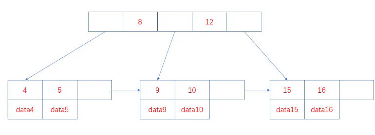

`gulang 基础面试汇总`

<!-- more -->

#### 目录

- [Go基础](#go基础)
- [网络](#网络)
- [微服务](#微服务)
- [消息队列](#消息队列)
- [常用词汇理解](#常用词汇理解)
- [场景题](#场景题)
- [MySQL](#mysql)
- [Redis](#redis)

#### Go基础

###### 1. = 和 := 的区别?

1. = 是赋值操作符，用于给变量赋值
2. := 是声明并赋值操作符，用于声明并初始化变量

> := 可以理解为 var + =，但 := 只能在函数体内使用，不能在函数体外使用

###### 2. 指针的作用?

1. 动态内存分配：指针可以用于动态分配内存，例如使用 new 函数创建一个新的变量，并返回其指针。

2. 修改值：指针可以用于修改其指向的变量的值，而不需要通过返回值或全局变量。例如，可以通过指针修改一个函数的参数的值。

3. 传递大型结构体：由于指针存储的是内存地址，因此传递指针比传递大型结构体更高效，因为它避免了复制整个结构体的开销。

4. 实现引用语义：指针可以实现引用语义，即多个变量可以引用同一个内存地址，从而共享同一个值。

5. 实现动态数据结构：指针可以用于实现动态数据结构，例如链表、树和图等。

6. 实现并发编程：在并发编程中，指针可以用于在多个 goroutine 之间共享和修改数据。

###### 3. Go 允许多个返回值么?
>
> 允许

###### 4. Go 有异常类型么？
>
> Go语言没有内置的异常类型。在Go语言中，错误是通过返回值来处理的，而不是通过异常来处理的。这种错误处理方式被称为返回错误模式。

###### 5. 什么是协程（Goroutine）?

1. goroutine是一种轻量级的线程,由go运行时管理，而不是由操作系统管理。
2. goroutine可以看作用户态的线程，它们共享相同的地址空间，但它们之间没有共享的栈，因此它们之间切换开销非常小。
3. goroutine 特点：
    - 轻量级：协程的创建、销毁和切换开销非常小，因此可以创建大量的协程。
    - 并发执行：协程可以在多个CPU核心上并发执行，从而提高程序的执行效率。
    - 非抢占式：协程是非抢占式的，也就是说，协程只能主动让出CPU，而不能被操作系统强制中断。
    - 通道通信：协程之间可以通过通道（Channel）进行通信，从而实现并发编程。

> 一个Goroutine会以一个很小的栈启动2KB或4KB，当遇到栈空间不足时，栈会自动伸缩， 因此可以轻易实现成千上万个goroutine同时启动。

###### 6. 如何高效的拼接字符串？

1. 使用 + 运算符：使用 + 运算符拼接字符串时，每次都会创建一个新的字符串，这会导致大量的内存分配和复制，从而降低性能。例如：

2. 使用 strings.Builder：strings.Builder 是Go语言标准库中的一个结构体，它可以高效地拼接字符串。它使用一个字节切片来存储字符串，并且可以在原地修改字符串，而不需要创建新的字符串。

###### 7. 什么是rune类型？

在Go语言中，rune类型是一个32位的整数类型，用于表示Unicode码点。它通常用于处理UTF-8编码的字符串。

在Go语言中，字符串是以UTF-8编码的，每个字符可能占用1到4个字节。因此，我们不能直接使用索引来访问字符串中的字符，因为索引返回的是字节的位置，而不是字符的位置。为了解决这个问题，Go语言引入了rune类型，它可以表示一个Unicode字符，无论它占用多少个字节。

###### 8. Go 支持默认参数或可选参数么？

Go语言不支持默认参数或可选参数。在Go语言中，函数的参数列表中的每个参数都必须有明确的名称和类型，不能省略。如果函数有多个参数，那么调用函数时必须提供所有参数的值。

可以利用结构体参数，或者...传入参数切片数组。

###### 9. defer 的执行顺序？

1. defer语句的执行顺序是后进先出（LIFO），也就是说，最后声明的defer语句会最先执行。

2. defer语句中的参数会在声明时求值，而不是在执行时求值。

3. defer 原理
    > Go 中的 defer 语句会将函数推迟到外层函数返回之后执行。
    > 推迟的函数调用会被压入一个栈中。当外层函数返回时，被推迟的函数会按照后进先出的顺序调用。

###### 10. Go 语言tag的用处？

在Go语言中，tag是一种元数据，它可以附加到结构体字段的声明中，用于描述字段的额外信息。tag通常用于序列化和反序列化、数据库映射、JSON映射等场景。

其他场景：Gorm、Gin Form等

###### 11. 如何获取一个结构体的所有tag？

在Go语言中，可以使用反射（reflection）来获取一个结构体的所有tag。

1. 使用reflect.TypeOf函数获取其类型。
2. 然后，我们使用NumField方法获取结构体中的字段数量，并使用Field方法获取每个字段的类型信息。
3. 最后，我们使用Tag.Get方法获取每个字段的json标签。

###### 12. 如何判断两个字符串切片（slice）是相等的

使用reflect.DeepEqual()函数

###### 13. 结构体打印时，%v,%s+v,%#v的区别？

1. %v：这是最常用的占位符，它会以默认的方式打印结构体的值。
2. %+v：这个占位符与%v类似，但它会打印结构体的字段名和值，包括私有字段。
3. %#v：这个占位符会打印结构体的完整表示，包括结构体的类型、字段名、字段值和内存地址。

###### 14. Go 语言如何表示枚举值？

枚举值通常使用const关键字和iota常量生成器来表示。

1. 使用const 定义枚举值。
2. 使用iota 自增。

###### 15. 空结构体的用途？

1. 实现集合：由于空结构体不占用任何内存空间，因此可以使用空结构体来实现集合。例如，可以使用一个映射（map）来存储集合的元素，其中键是元素的值，值是一个空结构体。

2. 实现信号：空结构体可以用于实现信号，例如，可以使用一个通道（channel）来发送和接收信号，其中通道的值是一个空结构体。

3. 实现互斥锁：空结构体可以用于实现互斥锁，例如，可以使用一个通道（channel）来阻塞和解除阻塞，其中通道的值是一个空结构体。

###### 16. Go 里面的int和int32的区别？

- **大小**：int类型的大小取决于操作系统。在32位操作系统上，int类型的大小是32位，在64位操作系统上，int类型的大小是64位。int32类型的大小始终是32位。

- **范围**：由于int类型的大小取决于操作系统，因此int类型的范围也取决于操作系统。在32位操作系统上，int类型的范围是-2^31到2^31-1，在64位操作系统上，int类型的范围是-2^63到2^63-1。int32类型的范围始终是-2^31到2^31-1。

- **性能**：由于int32类型的大小固定为32位，因此它在某些情况下可能会比int类型更高效。例如，如果函数的参数或返回值是int32类型，那么编译器可以生成更优化的代码。

- **可移植性**：由于int类型的大小取决于操作系统，因此int类型在跨平台编程中可能会遇到问题。

###### 17. init() 函数是什么时候执行的，可以执行多次么?

- init()函数是一种特殊的函数，它用于初始化包级别的变量和执行一些初始化操作。

- init()函数在包被首次导入时执行，并且只执行一次。

- init()函数不能被显式调用，也不能被其他函数调用。它只能由Go运行时在包被首次导入时自动执行。

- 每个包可以有多个init()函数，这些init()函数的执行顺序是不确定的，但它们都会在包被首次导入时执行。

> 执行顺序：import –> const –> var –>init()–>main()

###### 18. 多个init()函数的意义何在？

- 分离初始化逻辑：可以将不同的初始化逻辑分离到不同的init()函数中，使得代码更加模块化和清晰。
- 简化包的初始化：通过将初始化逻辑分散到多个init()函数中，可以简化包的初始化过程。
- 提高代码的可读性：将初始化逻辑分散到多个init()函数中，可以使代码更加清晰和易于理解。
- 并行执行：在Go 1.9版本之后，init()函数可以并行执行。这意味着多个init()函数可以在不同的goroutine中并行执行，从而提高程序的启动速度。

###### 19. 如何知道一个对象是分配到堆上还是栈上？

变量的存储位置（堆或栈）是由编译器在编译时决定的，而不是在运行时决定的。

- **栈**：局部变量、函数参数和返回值通常存储在栈上。栈是一种后进先出（LIFO）的数据结构，它用于存储函数调用的参数和返回值，以及局部变量。栈的内存空间在函数调用时分配，在函数返回时释放。

- **堆**：全局变量、动态分配的内存和大多数复合类型（例如切片、映射和通道）通常存储在堆上。堆是一种动态分配的内存空间，它用于存储全局变量和动态分配的内存。堆的内存空间在程序运行时分配，并且在不再需要时由垃圾回收器自动释放。

`Go build -gcflags '-m -m -l' xxx.go.`

> 关于逃逸的可能情况：变量大小不确定，变量类型不确定，变量分配的内存超过用户栈最大值，暴露给了外部指针。

###### 20. 2个interface{} 可以比较么？

不能进行直接比较，需要先判断类型是否一致，如果一致再判断值是否一致。

###### 21. 函数返回局部变量的指针是安全的么？
>
> 不安全

当函数返回后，局部变量会被销毁，此时指针指向的内存区域已经无效。

###### 22. 无缓冲的channel和有缓冲的channel的区别?

1. **无缓冲的通道**：无缓冲的通道在发送和接收操作之间没有缓冲区，因此发送操作和接收操作必须同时进行。如果发送操作在接收操作之前发生，那么发送操作会阻塞，直到有接收操作发生。同样，如果接收操作在发送操作之前发生，那么接收操作会阻塞，直到有发送操作发生。

2. **有缓冲的通道**：有缓冲的通道在发送和接收操作之间有一个缓冲区，因此发送操作和接收操作可以独立进行。如果缓冲区已满，那么发送操作会阻塞，直到有接收操作发生。同样，如果缓冲区为空，那么接收操作会阻塞，直到有发送操作发生。

> 无缓冲的通道用于在goroutine之间进行同步，而有缓冲的通道用于在goroutine之间进行异步通信。

###### 23. 为什么会有协程泄露(Goroutine Leak)?

协程泄露（goroutine leak）是指goroutine在创建后没有被正确地关闭或结束，导致它们继续运行并消耗系统资源，但不再被需要。

1. **忘记关闭通道**：在Go语言中，goroutine通常通过通道进行通信。如果一个goroutine在等待从通道接收数据，但通道没有被关闭，那么goroutine会一直等待，导致协程泄露。

2. **未处理的错误**：如果一个goroutine在执行过程中遇到错误，并且错误没有被正确处理，那么goroutine可能会继续运行，导致协程泄露。

3. **未处理的退出信号**：如果一个goroutine在等待退出信号，但退出信号没有被正确发送，那么goroutine会一直等待，导致协程泄露。

4. **阻塞**：缺少接收器或缺少发送器。

5. **死锁**：多个goroutine 由于竞争资源导致死锁。

###### 24. Go 可以限制运行时操作系统的线程数量么，常见的goroutine函数有哪些?

可以限制运行时操作系统的线程数量，通过runtime包中的GOMAXPROCS函数可以设置。该值默认为CPU逻辑核数，如果设的太大，会引起频繁的线程切换，降低性能。

常见的goroutine函数有：

1. runtime.Gosched() 让出当前goroutine的执行权限，调度器安排其它等待的任务运行，并在下次某个时候从该位置恢复执行。
2. runtime.Goexit() 退出当前goroutine，不会影响其他goroutine的执行。
3. runtime.GOMAXPROCS() 设置可执行的CPU核数，默认为CPU逻辑核数。

###### 25. new 和 make 的区别？

1. **new**：new函数用于分配内存并返回指向该内存的指针。new函数的参数是一个类型，它返回一个指向该类型的零值。

2. **make**：make函数用于创建并初始化切片、映射和通道。make函数的参数是一个类型和一个可选的长度和容量。

###### 26. 简述Golang 面向对象是如何实现的？

面向对象编程（OOP）是通过结构体（struct）和接口（interface）来实现的。

- **封装**：在Go中，封装是通过将字段和方法封装在结构体中实现的。只有结构体的方法才能访问结构体的字段。（也可以说成内部结构体方法）

- **继承**：在Go中，继承是通过嵌入（embedding）来实现的。当一个结构体嵌入另一个结构体时，它将继承被嵌入结构体的所有字段和方法。（编译时特征）

- **多态**：在Go中，多态是通过接口（interface）来实现的。一个类型可以实现多个接口，从而实现多态性。（运行时特征）

###### 27. uint型变量值分为为1，2，它们相减的结果是多少？

结果会溢出，如果是32位系统，结果是2^32-1，如果是64位系统，结果2^64-1.

###### 28. golang的内存管理的原理清楚吗？简述go内存管理机制?

Go语言的内存管理机制主要基于Tcmalloc（Thread-Caching Malloc）算法，该算法由Google开发，用于优化多线程环境下的内存分配性能。

1. **内存分配**：Go语言使用一个全局的内存分配器来管理内存。内存分配器将内存划分为不同的区域，每个区域用于存储特定大小的对象。当需要分配内存时，内存分配器会根据对象的大小选择合适的区域，并将对象存储在该区域中。

2. **内存回收**：Go语言使用垃圾回收（Garbage Collection，GC）机制来回收不再使用的内存。垃圾回收器会定期扫描内存，找出不再使用的对象，并将它们标记为垃圾。然后，垃圾回收器会回收这些对象的内存，以便重新使用。

3. **内存对齐**：Go语言要求对象在内存中按照一定的对齐方式存储。这种对齐方式可以优化内存访问性能，并减少内存碎片。Go语言使用一个名为mcache的结构体来管理内存对齐。

4. **内存池**：Go语言使用内存池来减少内存分配和回收的开销。内存池将内存划分为不同的区域，每个区域用于存储特定大小的对象。当需要分配内存时，内存池会从合适的区域中获取内存，而不是直接从全局内存分配器中获取。当不再需要内存时，内存池会将内存返回到合适的区域中，而不是直接将内存归还给全局内存分配器。

###### 29. mutex有几种模式？分别是什么？

mutex 是 Go 语言中的一种同步原语，用于保护共享资源，防止多个 goroutine 同时访问。它是一种互斥锁，即同一时间只有一个 goroutine 可以持有该锁，其他 goroutine 需要等待锁被释放后才能继续执行。

1. 正常模式
    - **等待队列**：等待获取互斥锁的goroutine按照先进先出（FIFO）的顺序排队。
    - **竞争机制**：当一个goroutine被唤醒并试图获取互斥锁时，它与其他新到达的goroutine竞争锁的拥有权。新到达的goroutine有优势，因为它们已经在CPU上运行，并且可能有很多这样的goroutine。因此，被唤醒的goroutine有很大机会失败，并会被重新排队到等待队列的前面。
    - **切换到饥饿模式**：如果一个goroutine等待超过1毫秒仍未获取到互斥锁，则互斥锁会切换到饥饿模式。

2. 饥饿模式
    - **直接传递所有权**：在饥饿模式下，互斥锁的所有权直接从释放锁的goroutine传递给等待队列中的第一个goroutine。
    - **新goroutine的等待**：新到达的goroutine不会尝试获取互斥锁，即使它看起来是解锁状态，也不会自旋。相反，它们会排队到等待队列的末尾。
    - **切换回正常模式**：如果一个goroutine获取了互斥锁，并且发现它是队列中的最后一个等待者，或者它等待的时间少于1毫秒，那么互斥锁会切换回正常操作模式。

3. `mutex.state`是32位的整型变量，内部实现时把该变量分成四份，用于记录Mutex的四种状态
    - **mutexLocked**：表示互斥锁是否被锁定，1表示锁定，0表示未锁定。
    - **mutexWoken**：表示是否唤醒过goroutine，1表示已经唤醒过，0表示没有唤醒过。
    - **mutexStarving**：表示是否处于饥饿模式，1表示处于饥饿模式，0表示不处于饥饿模式。
    - **mutexWaiterShift**：表示等待队列的长度，即等待获取互斥锁的goroutine的数量。

###### 30. Go 如何进行调度的？详细说一下？

1. **Goroutine**：Goroutine是Go语言中的轻量级线程，它由Go运行时管理，而不是由操作系统管理。Goroutine的创建、销毁和切换开销非常小，因此可以创建大量的Goroutine。

2. **Processor**：Processor是Go语言调度器的基本执行单元，它负责执行Goroutine。每个Processor都有一个本地队列，用于存储等待执行的Goroutine。当Processor没有可执行的Goroutine时，它会从全局队列中获取Goroutine来执行。

3. **M（Machine）**：Machine是Golang调度器中的执行线程，它负责将Goroutine映射到操作系统线程上。每个M都有自己的调用栈和寄存器状态。调度器会根据需要创建或销毁M，以适应并发任务的数量和系统负载。

> `goroutine`的调度器使用了一种称为工作窃取（work stealing）和让出（hand off）的机制来提高并发性能。以下是一些关于工作窃取和让出的要点：

1. 工作窃取：当处理器没有可执行的goroutine时，它会从其他处理器的本地队列中窃取goroutine来执行。这种设计可以避免某些处理器空闲，从而提高并发性能。工作窃取是一种常见的并发算法，它可以在多个任务队列之间平衡负载。

2. 让出：当处理器在执行一个goroutine时，如果该goroutine需要等待某些事件的发生，例如等待I/O操作完成，那么处理器会主动让出该goroutine的执行，以便其他goroutine可以执行。这种设计可以避免某些goroutine长时间等待，从而提高并发性能。让出是一种常见的并发算法，它可以在多个任务之间平衡负载。

###### 31. Go 什么时候发生阻塞，阻塞时，调度器会怎么做？

1. 等待I/O操作：当goroutine执行I/O操作时，例如读取或写入文件、发送或接收网络数据等，它可能会被阻塞，直到操作完成。

2. 等待锁：当goroutine尝试获取一个已经被其他goroutine持有的锁时，它可能会被阻塞，直到锁被释放。

3. 等待通道操作：当goroutine在等待从通道接收数据，或者向通道发送数据时，它可能会被阻塞，直到操作完成。

4. 等待系统调用：当goroutine执行系统调用时，例如创建进程、打开文件等，它可能会被阻塞，直到系统调用完成。

当goroutine发生阻塞时，Go 调度器会进行以下操作：

1. 保存goroutine的状态：当goroutine发生阻塞时，Go调度器会保存goroutine的当前状态，包括寄存器的值、程序计数器、栈指针等。

2. 将goroutine放入等待队列：Go调度器会将goroutine放入相应的等待队列中，例如I/O等待队列、锁等待队列、通道等待队列等。

3. 选择新的goroutine执行：Go调度器会从其他处理器中选择一个goroutine来执行。如果其他处理器没有可执行的goroutine，那么Go调度器会从全局队列中获取goroutine来执行。

4. 恢复goroutine的状态：当goroutine从阻塞状态恢复时，Go调度器会恢复goroutine的当前状态，然后goroutine会继续执行。

###### 32. 如果一个G一直占用占用资源怎么办？

如果一个goroutine（G）一直占用资源，可能会导致其他goroutine无法执行，从而影响程序的并发性能。

1. **使用超时**：你可以为goroutine设置一个超时时间，如果goroutine在超时时间内没有完成，那么你可以中断它的执行。例如，你可以使用context包来设置超时时间。

2. **使用信号量**：你可以使用信号量来限制goroutine的并发数量。例如，你可以使用sync.WaitGroup来等待goroutine完成，或者使用sync.Mutex和sync.Cond来实现一个计数信号量。

3. **使用抢占式调度**：Go语言调度器使用抢占式调度来避免某些goroutine长时间占用CPU。当goroutine执行的时间过长时，Go运行时会主动抢占它的执行，以便其他goroutine可以执行。

###### 33. goroutine 什么时候会发生泄露？

goroutine泄漏是指goroutine创建后，由于某种原因一直无法结束，导致资源无法释放。

暂时性泄露：

1. 获取长字符串中的一段长字符未释放
2. 获取长slice的一段导致长slice未释放
3. 在长slice新建slice导致泄露

永久性泄露：

1. goroutine 永久阻塞而导致泄露
2. time.Ticker未关闭导致泄露

###### 34. Go 竞态条件了解么？

竞态条件（Race Condition）是指多个goroutine同时访问和修改共享资源，导致程序的行为不确定。以下是一些关于竞态条件的要点：

- **共享资源**：在Go语言中，goroutine可以访问和修改共享资源，例如全局变量、映射和切片等。如果一个goroutine在修改共享资源时，其他goroutine也在修改共享资源，那么就会发生竞态条件。

- **不确定的行为**：当多个goroutine同时访问和修改共享资源时，程序的行为是不确定的。例如，一个goroutine可能会读取到一个未初始化的变量，或者一个goroutine可能会覆盖另一个goroutine的修改。

- **检测竞态条件**：Go语言提供了一个名为race detector的工具，用于检测竞态条件。你可以使用go run -race命令来运行程序，并使用go test -race命令来运行测试。如果程序中存在竞态条件，那么race detector会打印出相关的信息。

- **避免竞态条件**：为了避免竞态条件，你应该使用同步机制来保护共享资源。例如，你可以使用sync.Mutex或sync.RWMutex来保护共享变量，或者使用sync.WaitGroup来等待goroutine完成。

###### 35. 若干个goroutine，有一个panic怎么办？

如果一个goroutine发生panic，那么它会停止执行，并且会向其所在的goroutine发送一个panic信号。

如果这个goroutine没有处理这个panic信号，那么panic会继续向上层goroutine传播，直到被捕获或导致程序崩溃。

> 为了避免这种情况，可以使用defer语句和recover函数来捕获panic，并处理它。

###### 36. defer 可以捕捉goroutine的子goroutine么?

不可以。

1. 它们处于不同的调度器P中。对于子goroutine，必须通过 `recover()` 机制来进行恢复，然后结合日志进行打印。

2. 或者通过channel传递error，然后通过channel接收error，进行打印。

###### 37. Go 是怎么做参数校验的？

1. **类型断言**：你可以使用类型断言来检查参数的类型。例如，你可以使用value, ok := interface{}(parameter).(Type)来检查参数是否为特定类型。

2. **类型检查**：你可以使用类型检查来检查参数的类型。例如，你可以使用reflect.TypeOf(parameter) == reflect.TypeOf(Type)来检查参数是否为特定类型。

3. **自定义函数**：你可以编写自定义函数来检查参数的值。例如，你可以编写一个函数来检查参数是否为非负数，或者参数是否为有效的电子邮件地址。

4. **第三方库**：有一些第三方库提供了更强大的参数校验功能。例如，go-playground/validator库可以用于校验结构体的字段，go-playground/validator.v10库可以用于校验结构体的字段。

###### 38. 中间件用过么？

中间件是一种拦截器，它可以在请求到达目标方法之前，对请求进行拦截，也可以在目标方法执行之后，对响应进行拦截。

中间件可以用于日志记录、身份验证、权限检查、参数校验等场景。

###### 39. Go 解析tag是如何实现的？

1. 在编译阶段，编译器会将tag解析为结构体字段的反射信息，并存储在结构体字段的反射信息中。

2. 在运行阶段，通过反射获取结构体字段的反射信息，从而获取tag信息。

###### 40. 项目如何使用信号进行优雅的启停？

1. 在程序启动时，监听系统信号，当收到系统信号时，执行相应的操作，比如：数据库连接、开启http服务、开启grpc服务等。

2. 在程序退出时，关闭所有资源，比如：关闭数据库连接、关闭文件句柄、关闭http服务、关闭grpc服务等。

###### 41. 持久化怎么做的？

持久化是将数据存储到磁盘，以便在程序退出后仍然可以访问数据。在Go中，可以使用文件、数据库、缓存等存储方式来实现持久化。

- **文件持久化**：将数据存储到文件中，可以使用os包中的函数来读写文件。（1. 直接存储 2. 序列化成固定协议）

- **数据库持久化**：将数据存储到数据库中，可以使用数据库驱动程序来连接数据库，并执行SQL语句来操作数据。

- **缓存持久化**：将数据存储到缓存中，可以使用缓存服务，如Redis、Memcached等，来存储数据。

###### 42. Channel 死锁的场景？

Channel 死锁是指两个或多个 goroutine 在等待对方释放资源时，导致程序无法继续执行的情况。

常见的死锁场景有：

1. 当一个 channel 中没有数据，直接读取时。
2. 当 channel 数据满了，再尝试写数据时。
3. 向一个关闭的channel 写数据。

###### 43. 对已经关闭的chan进行读写会出现什么情况？

1. 向已经关闭的 channel 写数据会导致 panic。
2. 从已经关闭的 channel 读数据;
    - 如果 channel 中还有数据，则可以正常读取。状态为True。
    - 如果 channel 中没有数据，则返回零值。状态为False。

###### 44. 说受atomic底层是怎么实现的？

atomic 底层使用的是 CPU 提供的原子操作指令, 这些指令可以在不使用锁的情况下，保证对内存的原子操作，从而实现并发安全。

通过源码可知，atomic采用CAS(CompareAndSwap)的方式实现的。

所谓的CAS就是使用了CPU的原子性操作。在操作共享变量时，CAS不需要对其进行加锁，而是通过类似于乐观锁的方式进行检测，总是假设被操作的值未曾改变(即旧值相等),并一旦确认这个假设的真实性就立即进行值替换。本质上是不断占用CPU资源来避免加锁的开销。

###### 45. channel 底层实现，是否线程安全？

通道（channel）是一种用于在goroutine之间进行通信的数据结构。通道的底层实现是基于环形队列和互斥锁的，它确保了线程安全。

以下是一些关于通道的要点：

- **环形队列**：通道的底层实现是一个环形队列，它用于存储发送到通道的数据。当通道的缓冲区已满时，发送操作会阻塞，直到有接收操作发生。同样，当通道为空时，接收操作会阻塞，直到有发送操作发生。

- **互斥锁**：通道使用互斥锁来保护对环形队列的访问。当一个goroutine在发送或接收数据时，它会获取互斥锁，然后访问环形队列。当其他goroutine尝试发送或接收数据时，它们会等待互斥锁被释放。

- **线程安全**：由于通道的底层实现使用了互斥锁，因此它是线程安全的。多个goroutine可以同时发送或接收数据，而不会发生竞态条件。

###### 46. map 的底层实现？

map是一种用于存储键值对的数据结构。map的底层实现是基于哈希表（hash table）的。

以下是一些关于map的底层实现的要点：

- **哈希表**：map的底层实现是一个哈希表，它使用哈希函数将键转换为哈希值，然后根据哈希值将键值对存储在哈希表中的适当位置。

- **桶**：哈希表由多个桶组成，每个桶可以存储多个键值对。当哈希函数将键转换为哈希值时，哈希表会根据哈希值将键值对存储在适当的桶中。
    1. 每个bucket固定包含8个key和value,实现bmap是一个固定大小的连续内存块，分为四部分，每个条目的状态，8个key值，8个value值，指向下个bucket的指针。

- **链表**：如果两个键的哈希值相同，那么它们会被存储在同一个桶中。在这种情况下，哈希表会使用链表来存储这些键值对。链表中的每个节点都包含一个键值对。

- **扩容**：当哈希表的负载因子（即键值对的数量除以桶的数量）超过一定阈值时，哈希表会进行扩容。扩容会创建一个新的哈希表，并将旧的哈希表中的键值对复制到新的哈希表中。扩容可以减少哈希冲突，提高哈希表的性能。

> map 查找就是将key哈希后得到的64位用最后8个比特位计算在哪个桶，在bucket中，从前往后找到第一个空位。这样，在查找某个key时，先找到对应的桶，再去遍历 bucket 中的key。

47. select 的实现原理？

select是一种用于处理多个通道的语句。select的底层实现是基于轮询和通道的，它确保了线程安全。以下是一些关于select的要点：

- **轮询**：select会轮询每个通道，看是否有数据可以读取或写入。如果有，那么select会立即处理该通道，并返回相应的结果。如果没有，那么select会等待，直到有数据可以读取或写入。

- **通道**：select可以处理多个通道，包括无缓冲通道和有缓冲通道。对于无缓冲通道，select会立即处理该通道。对于有缓冲通道，select会等待，直到缓冲区有数据或可以写入数据。

- **超时**：select可以设置超时时间。如果超时时间到达，那么select会返回一个特殊的值，表示超时。

- **线程安全**：由于select会轮询每个通道，因此它是线程安全的。多个goroutine可以同时调用select，而不会发生竞态条件。

###### 48. interface 底层实现？（待补充）

接口由两种类型实现 iface 和 eface。iface 是包含方法的接口，而 eface 不包含方法。

- **iface**: tab表示接口的具体结构类型，而data是接口的值
- **eface**: 使用_type 直接表示类型，这样就无法使用方法。

###### 48. reflect 底层实现？（待补充）

reflect 包实现了运行时反射，允许程序操作任意类型的对象。

反射三大法则：

1. 反射从接口映射到反射对象。
2. 反射从反射对象映射到接口值。
3. 只有值可以修改，才可以修改反射对象。

> type用于获取当前值的类型，value用于获取当前的值。

###### 49. Go 调试/分析 工具用过哪些？

1. **pprof**：pprof是Go语言内置的性能分析工具，它可以生成程序的CPU和内存使用情况的报告。你可以使用go tool pprof命令来查看和分析这些报告。

2. **trace**：trace是Go语言内置的跟踪工具，它可以生成程序的执行情况的报告，包括goroutine的创建和销毁，阻塞和唤醒，系统调用等。你可以使用go tool trace命令来查看和分析这些报告。

3. **go test**：go test是一个用于运行Go测试的工具，它可以运行单元测试，基准测试和示例测试。你可以使用go test命令来运行测试，并使用-race标志来检测竞态条件。

4. **golint**：golint是一个用于检查Go代码风格的工具，它可以检测出代码中的风格问题，例如未使用的变量，未初始化的变量，错误的类型转换等。你可以使用golint命令来运行代码风格检查。

###### 50. 进程被Kill, 如何保证所有goroutine顺利退出?

如果一个进程被Kill，那么所有的goroutine都会被强制终止，无法保证它们顺利退出。

1. **使用context包**：你可以使用context包来传递取消信号。当进程被Kill时，你可以创建一个context.Context对象，并使用context.WithCancel函数来创建一个可取消的上下文。然后，你可以将这个上下文传递给每个goroutine，并在goroutine中定期检查上下文的取消状态。如果上下文被取消，那么goroutine可以优雅地退出。

2. **使用信号处理**：你可以使用os/signal包来监听操作系统信号。当进程被Kill时，操作系统会发送一个SIGTERM信号。你可以使用signal.Notify函数来监听SIGTERM信号，并在收到信号时取消上下文或关闭通道，从而通知goroutine退出。

###### 51. context 了解么？

context 是 Go 语言中用于在多个 goroutine 之间传递上下文信息，相同的 context 可以传递给运行在不同 goroutine 中的函数，上下文对于多个 goroutine 同时使用是安全的。

context 包定义了上下文类型，可以使用background, TODO 创建一个上下文，在函数调用链之间传播 context，也可以使用WithDeadLine, WithTimeout, WithCancel 或 WithValue 创建的修改副本替换它。

context 的作用就是在不同的goroutine之间 同步请求特定的数据，取消信号以及处理请求的截至日期。

###### 52. Go 切片可以赋值给数组么？

不可以。

切片和数组是不同的类型，不能直接赋值。

###### 53. goroutine 如何关闭？

1. **使用context包**：你可以使用context包来传递取消信号。当goroutine需要退出时，你可以创建一个context.Context对象，并使用context.WithCancel函数来创建一个可取消的上下文。然后，你可以将这个上下文传递给每个goroutine，并在goroutine中定期检查上下文的取消状态。如果上下文被取消，那么goroutine可以优雅地退出。

2. **使用channel**：你可以使用channel来通知goroutine退出。当goroutine需要退出时，你可以创建一个channel，并将这个通道传递给每个goroutine。然后，你可以向通道发送一个特殊的值，例如nil，来通知goroutine退出。在goroutine中，你可以定期检查通道的状态，如果通道被关闭，那么goroutine可以优雅地退出。

###### 54. 如何理解CSP(不要使用共享内存来通信，通过通信来共享内存)？

前后两个通信的概念不同，内存能够通过多个线程读到，修改内存数据，即可达到通过内存来通信。

在go中，一个内存由一个线程来负责，另外一个线程要操作这块内存，需要当前线程让渡所有权，这个所有权的让渡过程是"通信"。

本质上，两种模式谋求的都是同一时刻只有一个线程在操作同一块内存，以保护逻辑的原子性。后者通过引入所有权的概念，channel和临时变量，简化了操作约定。

###### 55. map 并发读写会怎样？

1. **并发读写**：当多个goroutine同时读取和修改map时，可能会发生竞态条件。例如，一个goroutine可能在另一个goroutine读取map的同时修改map，导致读取到的值是不确定的。

2. **未定义的行为**：由于map的并发读写可能会导致竞态条件，因此Go语言规范没有定义map的并发读写的行为。这意味着，如果你在并发读写map时没有使用同步机制，那么程序的行为是不确定的。

3. **使用互斥锁**：为了避免map的并发读写，你应该使用互斥锁来保护对map的访问。例如，你可以使用sync.Mutex或sync.RWMutex来保护map，或者使用sync.Map来处理并发读写。

###### 56. context.WithTimeout() 如何实现？

> WithTimeout 和 WithDeadline 创建的是 timeCtx，timerCtx 基于 cancelCtx，多了一个 time.Timer 和 deadline。

1. **实现原理**：context.WithTimeout()函数的实现原理是使用一个定时器来设置一个超时时间，并在超时时间到达时取消上下文。当上下文被取消时，所有等待该上下文的goroutine都会收到一个取消信号，从而可以优雅地退出。

2. **使用场景**：context.WithTimeout()函数通常用于设置一个超时时间，以防止goroutine无限期地等待。例如，你可以使用context.WithTimeout()函数来设置一个超时时间，以防止goroutine无限期地等待一个网络请求的响应。

###### 57. map的扩容时机?

装载因子：装载因子是map中元素数量与桶（bucket）数量的比值。当装载因子超过一定阈值时，map会进行扩容。默认的装载因子阈值为6.5，即当元素数量超过桶数量的6.5倍时，map会进行扩容。

溢出桶的数量：当map中的溢出桶（overflow bucket）数量超过一定阈值时，map会进行扩容。默认的溢出桶数量阈值为2，即当溢出桶数量超过2倍的最大桶数量时，map会进行扩容。

<div style="text-align: right;">
    <a href="#目录" style="text-decoration: none;">Top</a>
</div>

<hr style="background-color: blue;border: none;height: 15px;width: 100%" />

#### 网络

###### 1. grpc 是什么？

gRPC 是基于go的远程过程调用。RPC 框架的目标就是让远程服务调用更加简单、透明，RPC 框架负责屏蔽层的传输方式（TCP或者UDP）、序列化方式（XML/JSON/二进制）和通信细节。

服务调用者可以像本地接口一样调用远程的服务提供者，而不需要关心底层通信细节和调用过程。

- **高性能**：gRPC使用Protocol Buffers作为序列化格式，它比JSON和XML等格式更小、更快。gRPC还使用HTTP/2作为传输协议，它支持流式传输、多路复用和头部压缩等特性，可以显著提高网络传输的效率。

- **跨语言支持**：gRPC支持多种编程语言，包括C++、Java、Python、Go、Ruby、Node.js、PHP、C#等。这使得gRPC可以用于构建跨语言的应用程序。

- **拦截器**：gRPC支持拦截器，可以在请求发送之前和响应接收之后执行一些操作，例如身份验证、日志记录、错误处理等。

- **双向流**：gRPC支持双向流，可以在客户端和服务器之间进行双向的、全双工的通信。这使得gRPC可以用于构建实时、交互式的应用程序。

###### 2. grpc 为啥好，基本原理是什么，和http比呢？

grpc 是基于http2的，grpc 是一个现代开源的高性能远程过程调用框架，可以在任何环境中运行。它可以通过对负载平衡、跟踪、健康检查和身份验证的可插拔支持有效地连接数据中心和跨服务中兴的服务。它也适用于分布式计算的最后一英里，将设备、移动应用程序和浏览器连接到后端服务。

区别：

1. rpc是远程过程调用，就是本地去调用远程的函数；而http是通过 url 和符合restful风格的数据包去发送和获取数据。
2. rpc一般使用的编解码协议更加高效，比如grpc使用protobuf编解码。而http一般使用json进行编解码，数据相比rpc更加直观，但是数据包也更大，效率低下。
3. rpc一般用于服务内部调用，而http则用于和用户交互

相似点：

1. 都有类似的机制，例如grpc的metadata机制和http的头部机制作用相似，而web框架和grpc框架都有拦截器的概念。

###### 3. 什么是WebSocket?

WebSocket 是一种在单个 TCP 连接上进行全双工通信的协议。WebSocket 使得客户端和服务器之间的数据交换变得更加简单，允许服务端主动向客户端推送数据。在 WebSocket API 中，浏览器和服务器只需要完成一次握手，两者之间就直接可以创建持久性的连接，并进行双向数据传输。

###### 4. 全双工通讯协议的概念？

全双工是通讯传输的一个术语。通信允许数据在两个方向上同时传输，它在能力上相当于两个单工通信方式的结合。全双工指同时进行信号的双向传输。

拿演唱会举例：

1. 单工：我们是场外观众，只能通过大屏幕查看，不能够进行互动。
2. 半双工：我们是维护秩序保安，使用对讲机可以沟通，但同一时刻只能由一方进行数据传送。
3. 全双工：我们是场内观众，可以同时进行数据传送。

###### 5. WebSocket 和 Socket 的区别是什么？

Socket 是对 TCP/IP 协议的封装，它提供了一个端到端的通信方式，使得数据可以在网络中传输。

WebSocket 是一个网络编程接口，是一种在单个 TCP 连接上进行全双工通信的协议，它使得客户端和服务器之间的数据交换变得更加简单，允许服务端主动向客户端推送数据，它允许在单个 TCP 连接上进行全双工通信。

###### 6. http和WebSocket的区别是什么？

1. http 是一种应用层协议，它用于在网络上传输数据。而 WebSocket 是一种在单个 TCP 连接上进行全双工通信的协议，它允许在客户端和服务器之间进行实时通信。

2. http 是一种请求-响应协议，客户端发送一个请求，服务器返回一个响应。而 WebSocket 是一种全双工协议，客户端和服务器可以同时发送和接收数据。

###### 7. http 和 https 的区别？

http 是一种超文本传输协议(Hypertext Transfer Protocol)，是一个在计算机世界里专门在两点之间传输文字、图片、音视频等文本数据的约定和规范。


HTTP 主要分为三部分： 超文本、传输、协议

1. 超文本就是不单单只是文本，它还可以传输图片、音视频，甚至点击文字或图片能够进行超链接的跳转。
2. 传输：数据需要经过一系列的物理介质从一个端系统传送到另外一个端系统的过程。通常我们把传输数据包的一方成为 请求方， 把 接到二进制数据包的一方称为 应答方。
3. 协议：网络中（互联网）传递、管理信息的一些规范。如同人与人之间相互交流是需要遵循一定的规矩一样，计算机之间的相互通信需要共同遵守一定的规则，这些规则就称为协议，只不过是网络协议。

TCP/IP网络模型：


https 就是身披了一层 SSL 的 http，它比 http 多了一层 SSL 安全层，所以 https 是安全的 http 协议。


http 和 https 的区别：

1. http 以 http:// 开头；https 以 https:// 开头。
2. http 是未经安全加密的协议，它的传输过程容易被攻击者监听、数据容易被窃取、发送方和接收方容易被伪造；而https 是安全的协议，它通过 密钥交换算法-签名算法-对称加密算法-摘要算法 能够解决上面问题。
3. http 默认端口是80；https 默认端口是443。

###### 8. http get 和 post 区别？

http 中 get 和 post 是 http 中最常用的两个方法，基本上使用 http 方法中有 99% 都是在使用 Get 和 post 方法，所以有必要我们对两个方法有更加深刻的认识。

1. get 方法一般用于请求，比如你在浏览器地址栏输入 xxx ,其实就是发送了一个get请求，它的主要特征是请求服务器返回资源，而post 方法一般用于 form 表单的提交， 相当于是把信息提交给服务器，等待服务器做出响应，get 相当于一个是 pull/拉的操作，而 post 相当于是一个 push/推 的操作。
2. get 方法是不安全的，因为你在发送请求的过程中，你的请求参数会拼在URL后面，从而导致容易被攻击者窃取，对你的信息造成破坏和伪造；而post 方法是把参数放在请求体body 中的，对用户来说不可见。
3. get 请求的URL 有长度限制，而 post 请求会把参数和值放在消息体中，对数据长度没有要求。
4. get 请求会被浏览器主动 cache, 而 post 不会，除非手动设置。
5. get 请求在浏览器反复地 回退/前进 操作是无害的，而post 操作会再次提交表单请求。
6. get 请求在发送过程中会产生一个 TCP数据包；post 在发送过程中会产生两个TCP 数据包，对于 get 方式的请求，浏览器会把 http header 和 data 一并发送过去，服务器响应200（返回数据）;而对于post，浏览器先发送header, 服务器响应 100 continue, 浏览器再发送data, 服务器响应200 ok(返回数据)。

###### 9. 什么是无状态协议，http是无状态协议么，怎么解决？

无状态协议 就是浏览器对于事务的处理没有记忆能力。举个例子来说就是比如客户端请求获得网页之后关闭浏览器，然后再次启动浏览器，登录该网站，但是服务器并不知道客户关闭了一次浏览器。

http 就是一种无状态的协议，它对用户的操作没有记忆能力。可能大多数用户不相信，它可能觉得每次输入用户名和密码登录一个网站后，下次登录就不再重新输入用户名和密码了。这其实不是http做的事情，起作用的是 一个叫做 小甜饼(Cookie) 的机制。它能够让浏览器具有记忆能力。

JWT 的 Cookie 信息存储在客户端，而不是服务器内存中。也就是说JWT 直接本地进行验证就可以，验证完毕后，这个Token 就会在 Session 中随请求一起发送到服务器，通过这种方式，可以节省服务器资源，并且 token 可以进行多次验证。

JWT 支持跨域认证，Cookies 只能用在单个 节点的域 或者 它的子域 中有效。如果它们尝试通过第三个节点访问，就会被禁止。使用JWT 可以解决这个问题，使用JWT 能够通过多个节点进行用户认证，也就是我们常说的跨域认证。

###### 10. UDP 和 TCP 的区别？

UDP User DataGram Protocol 用户数据包协议。它不需要所谓的 握手操作，从而加快了通信速度，允许网络上的其他主机在接收方同意通信之前进行数据传输。

UDP 的特点主要有：

1. UDP 能够支持容忍数据包丢失的带宽密集型应用程序。
2. UDP 具有低延迟的特点。
3. UDP 能够发送大量的数据包。
4. UDP 能够允许 DNS 查找，DNS 是建立在 UDP 之上的应用层协议。

TCP Transmission Control Protocol 传输控制协议。它能够帮助你确定计算机连接到 Internet 以及它们之间的数据传输。通过三次握手来建立TCP连接，三次握手就是用来启动和确认 TCP 连接的过程。一旦连接建立后，就可以发送数据了，当数据传输完成后，会通过关闭虚拟电路来断开连接。

TCP 的主要特点有：

1. TCP 能够确保连接的建立和数据包的发送。
2. TCP 支持错误重传机制。
3. TCP 支持拥塞控制，能够在网络拥堵的情况下延迟发送。
4. TCP 能够提供错误校验和甄别有害的数据包。

UDP 和 TCP 的区别：

1. TCP 是面向连接的协议；UDP是无连接的协议
2. TCP 在发送数据前需要建立连接，然后再发送数据；UDP无需建立连接就可以直接发送大量数据
3. TCP 会按照特定顺序重新排列数据包；UDP数据包没有固定顺序，所有数据包都相互独立
4. TCP 传输速度比较慢；UDP 传输速度会更快
5. TCP 头部有20字节；UDP 头部只有8字节
6. TCP 是重量级的，在发送任何用户数据之前，TCP需要三次握手建立连接；UDP 是轻量级的，没有跟踪连接，消息排序等
7. TCP 会进行错误校验，并能够进行错误恢复；UDP 也会错误检查，但会丢弃错误的数据包。
8. TCP 有发送确认；UDP 没有
9. TCP 会使用握手协议，例如 SYN，SYN-ACK，ACK； UDP 无握手协议。
10. TCP 是可靠的，因为它可以确保数据传送到路由器；UDP 中不能保证数据发送到目标。

###### 11. TCP 三次握手和四次挥手？

TCP 是一种面向连接的、可靠的、基于字节流的传输层通信协议，它能够保证数据包的准确送达。

三次握手：


四次挥手：


###### 12. 简述 http1.0/1.1/2.0 的区别？

http1.0：
> HTTP 1.0 是在 1996 年引入的，从那时开始，它的普及率就达到了惊人的效果。

1. HTTP 1.0 仅仅提供了最基本的认证，这时候用户名和密码还未经加密，因此很容易收到窥探
2. HTTP 1.0 被设计用来使用短链接，即每次发送数据都会经过 TCP 的三次握手和四次挥手，效率比较低。
3. HTTP 1.0 只使用 header 中的 If-Modified-Since 和 Expires 作为缓存失效的标准。
4. HTTP 1.0 不支持断点续传，也就是说，每次都会传送全部的页面和数据。
5. HTTP 1.0 认为每台计算机只能绑定一个 IP，所以请求消息中的 URL 并没有传递主机名（hostname）。

http1.1：
> HTTP 1.1 是 HTTP 1.0 开发三年后出现的，也就是 1999 年，它做出了以下方面的变化。

1. HTTP 1.1 使用了摘要算法来进行身份验证
2. HTTP 1.1 默认使用长连接，长连接就是只需一次建立就可以传输多次数据，传输完成后，只需要一次切断连接即可。长连接的连接时长可以通过请求头中的 keep-alive 来设置
3. HTTP 1.1 中新增加了 E-tag，If-Unmodified-Since, If-Match, If-None-Match 等缓存控制标头来控制缓存失效。
4. HTTP 1.1 支持断点续传，通过使用请求头中的 Range 来实现。
5. HTTP 1.1 使用了虚拟网络，在一台物理服务器上可以存在多个虚拟主机（Multi-homed Web Servers），并且它们共享一个IP地址。

http2.0：
> HTTP 2.0 是在 2015 年开发出来的标准，它主要做了以下改变

1. 头部压缩，由于 HTTP 1.1 经常会出现 User-Agent、Cookie、Accept、Server、Range 等字段可能会占用几百甚至几千字节，而 Body 却经常只有几十字节，所以导致头部偏重。HTTP 2.0 使用 HPACK 算法进行压缩。
2. 二进制格式，HTTP 2.0 使用了更加靠近 TCP/IP 的二进制格式，而抛弃了 ASCII 码，提升了解析效率
3. 强化安全，由于安全已经成为重中之重，所以 HTTP2.0 一般都跑在 HTTPS 上。
4. 多路复用，即每一个请求都是是用作连接共享。一个请求对应一个id，这样一个连接上可以有多个请求。

###### 13. 常用的 HTTP 请求头？

- Date: 一个通用标头，可以出现在请求标头和响应标头中，表示的是格林威治标准时间，这个时间要比北京时间慢八个小时。
- Upgrade: 升级为其他协议
- Accept：告诉服务器能够发送哪些媒体类型
- Accept-Charset：告诉服务器能够发送哪些字符集
- Accept-Encoding：告诉服务器能够发送哪些编码方式
- Accept-Language：告诉服务器能够发送哪些语言
- Authorization：告诉服务器能够发送哪些授权信息
- Cache-Control：告诉服务器哪些缓存行为是允许的
- Connection：告诉服务器是否需要持久连接
- Cookie：告诉服务器之前请求过的信息
- Host：告诉服务器请求的主机名
- Origin：告诉服务器请求的来源信息
- Referer：告诉服务器请求的来源页面
- User-Agent：告诉服务器客户端的信息

###### 14. 常用的 HTTP 状态码？

- 200：请求成功
- 301：永久重定向
- 302：临时重定向
- 400：请求错误
- 401：未授权
- 403：禁止访问
- 404：未找到
- 500：服务器错误
- 502：网关错误
- 503：服务不可用
- 504：网关超时

###### 15. 地址栏输入URL发生了什么？

1. 浏览器查找域名的 IP 地址：当用户在地址栏输入 URL 后，浏览器会首先查找域名的 IP 地址。浏览器会先查看本地 DNS 缓存(浏览器缓存->hosts)，如果找到对应的 IP 地址，则直接使用；如果没有找到，则向 DNS 服务器发送请求，获取域名的 IP 地址。

    首先，查询请求会先找到本地 DNS 服务器来查询是否包含 IP 地址，如果本地 DNS 无法查询到目标 IP 地址，就会向根域名服务器发起一个 DNS 查询。
在由根域名服务器 -> 顶级域名服务器 -> 权威 DNS 服务器后，由权威服务器告诉本地服务器目标 IP 地址，再有本地 DNS 服务器告诉用户需要访问的 IP 地址。

2. 浏览器需要和目标服务器建立 TCP 连接，需要经过三次握手的过程。在建立连接后，浏览器会向目标服务器发起 HTTP-GET 请求，包括其中的 URL，HTTP 1.1 后默认使用长连接，只需要一次握手即可多次传输数据。

    如果目标服务器只是一个简单的页面，就会直接返回。但是对于某些大型网站的站点，往往不会直接返回主机名所在的页面，而会直接重定向。返回的状态码就不是 200 ，而是 301,302 以 3 开头的重定向码，浏览器在获取了重定向响应后，在响应报文中 Location 项找到重定向地址，浏览器重新第一步访问即可。
然后浏览器重新发送请求，携带新的 URL，返回状态码 200 OK，表示服务器可以响应请求，返回报文。

    <a href="https://blog.csdn.net/Newbie___/article/details/107212575">详细了解参考</a>

###### 16. 为什么post是两个TCP包呢？

post 先去检测一下服务器能够正常应答，然后再把data携带进去，如果应答不了，就没有了第二步数据传输。就好像送快递一样，送之前先打电话，确认是否在家，在家再送过去，避免白跑一趟，资源浪费。

<div style="text-align: right;">
    <a href="#目录" style="text-decoration: none;">Top</a>
</div>

<hr style="background-color: blue;border: none;height: 15px;width: 100%" />

#### 微服务

###### 1. 微服务了解么？

微服务是一种软件架构风格，它将应用程序分解为一组小的、独立的服务，每个服务实现特定的业务功能。以下是一些关于微服务的要点：

1. 独立部署：每个微服务都是一个独立的应用程序，可以独立部署和扩展。这使得微服务可以快速迭代和部署，提高开发效率和系统的可维护性。

2. 独立开发：每个微服务都可以由一个团队独立开发，团队可以自由选择技术栈和开发流程。这使得微服务可以更好地适应不同团队的技术能力和业务需求。

3. 独立运行：每个微服务都是一个独立的应用程序，可以独立运行和扩展。这使得微服务可以更好地利用硬件资源，提高系统的可用性和性能。

4. 服务发现和负载均衡：微服务通常使用服务发现和负载均衡的技术，例如Consul、Eureka等，来自动发现和选择可用的服务实例，从而提高系统的可用性和性能。

5. API网关：微服务通常使用API网关来处理客户端请求，API网关可以提供路由、负载均衡、身份验证、缓存等功能，从而简化客户端的开发。

用自己的话讲;

1. 微服务是一种程序架构思想，一种程序迭代过程中一种自然的现象。从单片到SOA到微服务，由一到多，由复杂到简单的一种过程，是能够让开发者更加专注于自身服务，快速开发，快速上线，快速迭代。

2. 跟进程、线程、协程类似，是一种自然进化，微服务与运维相辅相成，先开发后运维，微服务缺点，聚合，及事务，及监控，需要运维。

3. 微服务本身的优点，因为该服务是做什么的，已经划定好了，不需要考虑杂七杂八的，更加专注处理该服务，少了很多相关业务的处理。外部，不同服务可以使用不同的技术栈进行开发。然后易扩展，新上线产品，可以快速开发。然后，微服务易于服务，可以不拆分或者改动很少进行二次使用，然后快速迭代。

###### 2. 服务发现是怎么做的？

服务发现是微服务架构中不可或缺的一部分，它能让服务之间相互发现，从而进行通信。服务发现主要有两种方式：客户端发现和服务器端发现。

1. 客户端发现：当我们使用客户端发现的时候，客户端负责决定可用服务实例的网络地址并且在集群中对请求负载均衡，客户端访问服务登记表，也就是一个可用服务的数据库，然后客户端使用一种负载均衡算法选择一个可用的服务实例然后发起请求。

2. 服务器端发现：客户端通过负载均衡器向某个服务提出请求，负载均衡器查询服务注册表，并将请求转发到可用的服务实例。如同客户端发现，服务实例在服务注册表中注册或注销。

###### 3. ETCD 用过么？

etcd 是一个高度一致的分布式键值存储，它提供了一种可靠的方式来存储需要由分布式系统或机器集群访问的数据。它可以优雅地处理网络分区期间的领导者选举，即使领导者节点选取中也可以容忍机器故障。

etcd 是用Go语言编写的，它具有出色的跨平台支持，小的二进制文件和强大的社区。etcd 机器之间的通信通过Raft 共识算法处理。

###### 4. 什么是wire?

wire 是Google 开发的 自动依赖注入框架，专门用于 Go 语言。wire 通过 代码生成而非运行时反射 来实现依赖注入，这与许多其他语言中的依赖注入框架不同。这种方法使得注入的代码在编译时就已经确定，从而提高了性能并保证了代码的可维护性。

###### 5. 分布式锁？实现方式？

分布式锁是控制分布式系统之间同步访问共享资源的一种机制。分布式锁可以保证在分布式系统中，多个节点对于共享资源只能有一个节点同时进行操作。

分布式锁的实现方式有：基于数据库、基于 Redis、基于 Zookeeper

基于数据库:

1. 基于唯一索引 通过无法插入数据，数据库行锁实现。因为是基于数据库实现，需要考虑数据库的可用性和性能，双机部署，数据同步等
2. 不具备重入性，因为同一个线程在释放锁之前，行数据一直存在，无法再次成功插入数据。需要新增一列 记录获取锁的机器和线程信息，再次获取锁的时候先进行比对再进行后续操作。
3. 没有锁失效机制，需要新增一列，记录失效时间。
4. 不具备阻塞锁特性，需要优化获取逻辑，循环多次去获取。

基于Redis:

1. 无法保证过期时间，需要循环增加过期时间
2. Redissesion 具备watchdog 看门狗，定期检查线程是否过期，自动续命。集群使用lua脚本。
3. 多节点 使用 redlock, redlock 保证所有节点获取成功才成功

基于zookeeper:

1. 需要额外搭建

###### 6. CAP理论？

CAP 理论是分布式系统设计中的基本理论，它指出，在分布式系统中，不可能同时满足以下三个特性：

1. Consistency（一致性）：所有节点在同一时间具有相同的数据。
2. Availability（可用性）：系统在正常情况下可以响应请求。
3. Partition tolerance（分区容错性）：系统在出现网络分区时仍能继续运行。

###### 7. BASE理论？

BASE 理论是分布式系统设计中的基本理论，它指出，在分布式系统中，不可能同时满足以下三个特性：

1. Basically Available（基本可用）：系统在正常情况下可以响应请求。
2. Soft state（软状态）：系统允许在一定时间内存在不一致的状态。
3. Eventual consistency（最终一致性）：系统在经过一定时间后，最终会达到一致的状态。

###### 8. 分布式事务？

分布式事务是指在一个分布式系统中，多个服务需要协同完成一个事务。分布式事务需要保证多个服务之间的数据一致性，即要么全部成功，要么全部失败。

分布式事务的实现方式有：两阶段提交xa、三阶段提交、TCC、Saga、本地消息表、事务消息、最大努力通知等。

###### 9. 什么是Zookeeper?

Zookeeper 是一个开源的分布式协调服务，它提供了一种分布式系统中的协调机制，可以用于实现分布式锁、配置管理、命名服务等功能。Zookeeper 使用一种树形结构来存储数据，每个节点都有一个唯一的路径，可以通过这个路径来访问节点上的数据。

###### 10. zookeeper 可以实现哪些功能？

1. 分布式锁
2. 配置管理
3. 数据发布/订阅
4. 集群管理
5. 分布式协调/通知

###### 11. zookeeper 可以保证哪些分布式一致性特性？

- 顺序一致性
- 原子性
- 实时性
- 可靠性

###### 12. zookeeper 的数据模型？

共享的、树形结构，由一系列的Znode数据节点组成，类似文件系统(目录不能存数据)。Znode存有数据信息，如版本号等等。Znode之间的层级关系，像文件系统中的目录结构一样。并且它是将数据存在内存中，这样可以提高吞吐、减少延迟。

###### 13. zookeeper 如何识别请求的先后顺序？

zookeeper 会给每个更新请求，分配一个全局唯一的递增编号(zxid), 编号的大小体现事务操作的先后顺序。

###### 14. 分布式？

分布式架构， 把系统按照模块拆分成多个子系统，多个子系统分布在不同的网络计算机上相互协作完成业务流程，系统之间需要进行通信。

优点：

- 把模块拆分，使用接口通信，降低模块之间的耦合度
- 把项目拆分成若干个子项目，不同的团队负责不同的子项目
- 增加功能时只需要再增加一个子项目，调用其他系统的接口就可以
- 可以灵活的进行分布式部署

缺点:

- 系统之间交互需要使用远程通信，接口开发增加工作量
- 各个模块有一些通用的业务逻辑无法公用

###### 15. 分布式架构和SOA架构有什么区别？

SOA: 面向服务的架构。也就是把工程拆分成服务层，表现层两个工程。服务层中包含业务逻辑，只需要对外提供服务即可。表现层只需要处理和页面的交互，业务逻辑都是调用服务层的服务来实现。

分布式：主要还是从部署的角度，将应用按照访问压力进行归类，主要目标是充分利用服务器的资源，避免资源分配不均。

###### 16. 集群？

一个集群系统是一群松散结合的服务器组，形成一个虚拟的服务器，为客户端提供统一的服务。对于这个客户端来说，通常在访问集群系统时不会意识到它的服务是由具体的哪一台服务器提供。集群的目的，是为实现负载均衡，容错，和灾难恢复。以达到系统可用性和可伸缩性的要求。集群系统一般应具有高可用性、可伸缩性、负载均衡、故障恢复和可维护性等特殊性能。一般同一工程上会部署多台服务器。

###### 17. 分布式与集群的区别？

1. 分布式是指将不同的业务分布在不同的地方。

2. 而集群指的是将几台服务器集中在一起，实现同一业务。一句话，分布式是并联工作的，集群是串联工作的。

分布式中的每一个节点，都可以做集群。而集群并不一定就是分布式的。

举例，分布式是淘宝的整个业务系统，将每个服务模块独立拆分出来，分别部署到不同的机器上，模块之间通过rpc通信。集群是数据库服务器的集群，实现读写分离，提高数据库并发性能。

**分布式是以缩短单个任务的执行时间来提升效率的，而集群是通过提高的单位时间内执行的任务数来提升效率的。**

举例：如果一个任务由10个子任务组成，每个子任务单独执行需要小时，则在一台服务器上执行该任务需10小时。采用分布式方案，提供10台服务器，每台服务器只负责处理一个子任务，不考虑子任务间的依赖关系，执行完，这个任务只需一个小时。

而集群方案，同样提供10台服务器，每台服务器都能独立处理这个任务。假设有10个任务同时到达，10台服务器将同时工作，1小时后，10个任务同时完成，这样，整体来看，还是1小时内完成一个任务。

###### 18. 高并发？

处理高并发常见的方法有哪些？

数据层

- 数据库集群和库表散列
- 分表分库
- 开启缓存、索引
- 表设计、SQL语句 优化
- 缓存服务器、搜索服务器、图片服务器分离

项目层

- 采用面向服务分布式架构（分担服务器压力，提高并发能力）
- 采用并发访问较高的详情系统采用静态页面，HTML静态化
- 使用页面缓存
- 业务解耦，提高并发能力
- 使用分布式文件系统存储海量文件

应用层

- 使用负载均衡
- 使用CDN
- 使用消息队列

###### 19. 高可用？

目的：保证服务器硬件故障服务为依然可用，数据依然保存并能够访问。

高可用的服务：

1. 分级管理：核心应用和服务具有更高的优先级，比如用户及时付款比能否评价商品更重要。
2. 超时设置：设置服务调用的超时时间，一旦超时，通信框架抛出异常，应用程序则根据服务调度策略选择重试or请求转移到其他服务器上
3. 异步调用：通过消息队列等异步方式完成，避免一个服务失败导致整个应用请求失败的情况。（不是所有服务都可以异步调用，对于获取用户信息这类调用，采用异步方式会延长响应时间，得不偿失，对于那些必须确认调用成功后才可以继续进行下一步操作的应用也不适合。）
4. 服务降级：网站访问高峰期间，为了保证核心应用的正常运行，需要对服务降级。（1.拒绝，拒绝优先级较低的服务，减少服务并发数，确保核心应用的正常运行。2.关闭功能，关闭部分不重要的服务，或者不重要的功能，节约系统开销。）
5. 幂等性设计：保证服务重复调用和调用一次产生的结构相同。

高可用的数据：

保证数据高可用的主要手段有两种：一是数据备份，二是失效转移机制

1. 数据备份：又分为冷备份和热备份，冷备份是定期复制，不能保证数据可用性。热备份又分为异步热备和同步热备，异步热备是指多分数据副本的写入操作异步完成，而同步方式则是指多分数据副本的写入操作同时完成。
2. 失效转移：若数据服务器集群中任何一台服务器宕机，那么应用程序针对这台服务器的所有读写操作都要重新路由到其他服务器，保证数据访问不会失败。

网站运行监控

1. 监控数据采集：1. 用户行为日志收集，2. 服务器性能监控，3. 运行数据报告
2. 监控管理：1.系统报警 2. 失效转移 3. 自动优雅降级

###### 20. 负载均衡?

当一台服务器的性能达到极限时，我们可以使用服务器集群来提高网站的整体性能。那么，在服务器集群中，需要有一台服务器充当调度者的角色，用户的所有请求都会首先由它接收，调度者再根据每台服务器的负载情况讲请求分配给某一后端服务器去处理。

1. http 重定向负载均衡

    原理：

        当用户向服务器发起请求时，请求首先被集群调度者截获；调度者根据某种分配策略，选择一台服务器，并将选中的服务器的IP地址封装在HTTP响应消息头部的Location字段中，并将响应消息的状态码设为302，最后将这个响应消息返回给浏览器。当浏览器收到响应消息后，解析Location字段，并向该URL发起请求，然后指定的服务器处理该用户的请求，最后将结果返回给用户。

    优点：

        比较简单

    缺点：

        调度服务器只在客户端第一次向网站发起请求的时候起作用。当调度服务器向浏览器返回响应信息后，客户端此后的操作都基于新的URL进行的(也就是后端服务器)，此后浏览器就不会与调度服务器产生关系，浏览器需要每次请求两次服务器才能拿完成一次访问，性能较差。而且调度服务器在调度时，无法知道当前用户将会对服务器造成多大的压力，只不过是把请求次数平均分配给每台服务器罢了，浏览器会与后端服务器直接交互。

2. 反向代理负载均衡

    原理：

        反向代理服务器是一个位于实际服务器之前的服务器，所有向我们网站发来的请求都首先要经过反向代理服务器，服务器根据用户的请求要么直接将结果返回给用户，要么将请求交给后端服务器处理，再返回给用户。反向代理服务器就可以充当服务器集群的调度者，它可以根据当前后端服务器的负载情况，将请求转发给一台合适的服务器，并将处理结果返回给用户。

    优点：

    - **隐藏后端服务器**：与HTTP重定向相比，反向代理能够隐藏后端服务器，所有浏览器都不会与后端服务器直接
        交互，从而能够确保调度者的控制权，提升集群的整体性能。

    - **故障转移**：与DNS负载均衡相比，反向代理能够更快速地移除故障结点。当监控程序发现某一后端服务器出
        现故障时，能够及时通知反向代理服务器，并立即将其删除。

    - **合理分配任务** ：HTTP重定向和DNS负载均衡都无法实现真正意义上的负载均衡，也就是调度服务器无法根据
        后端服务器的实际负载情况分配任务。但反向代理服务器支持手动设定每台后端服务器的权重。我们可以根据
        服务器的配置设置不同的权重，权重的不同会导致被调度者选中的概率的不同。

    缺点：

    - **调度者压力过大** ：由于所有的请求都先由反向代理服务器处理，那么当请求量超过调度服务器的最大负载时，调度服务器的吞吐率降低会直接降低集群的整体性能。

    - **制约扩展**：当后端服务器也无法满足巨大的吞吐量时，就需要增加后端服务器的数量，可没办法无限量地增加，因为会受到调度服务器的最大吞吐量的制约。

    - **粘滞会话**：反向代理服务器会引起一个问题。若某台后端服务器处理了用户的请求，并保存了该用户的session或存储了缓存，那么当该用户再次发送请求时，无法保证该请求仍然由保存了其Session或缓存的服务器处理，若由其他服务器处理，先前的Session或缓存就找不到了。

    > 解决办法1： 可以修改反向代理服务器的任务分配策略，以用户IP作为标识较为合适。相同的用户IP会交由同一台后端服务器处理，从而就避免了粘滞会话的问题。

    > 解决办法2： 可以在Cookie中标注请求的服务器ID，当再次提交请求时，调度者将该请求分配给Cookie中标注的服务器处理即可。

3. IP负载均衡。

    - 通过NAT实现负载均衡：响应报文一般比较大，每一次都需要NAT转换的话，大流量的时候，会导致调度器成为一个瓶颈。

    - 通过直接路由实现负载均衡。

###### 21. 分布式事务及异步通信问题解决方案?

1. **分布式事务**：分布式事务是指在多个分布式系统中，保证多个操作要么全部成功，要么全部失败。以下是一些常见的解决方案：

    - **两阶段提交（2PC）**：两阶段提交是一种经典的分布式事务解决方案，它将事务分为两个阶段：准备阶段和提交阶段。
        1. **准备阶段**：协调者向所有参与者发送准备请求，参与者收到请求后，执行事务操作但不提交，并响应协调者准备就绪。
        2. **提交阶段**：如果所有参与者都回复准备就绪，协调者向所有参与者发送提交请求，参与者收到请求后提交事务。如果有任何一个参与者回复不能准备就绪，协调者向所有参与者发送回滚请求，参与者收到请求后回滚事务。

    - **三阶段提交（3PC）**：三阶段提交是两阶段提交的改进版本，它将事务分为三个阶段：准备阶段、预提交阶段和提交阶段。三阶段提交的优点是减少了阻塞问题，提高了系统的可用性。但是，它也存在一些问题，例如协调者单点故障、性能问题等。
        1. **准备阶段1**：协调者向所有参与者发送准备请求，参与者收到请求后，执行事务操作但不提交，并响应协调者准备就绪。
        2. **准备阶段2**：如果所有参与者都回复准备就绪，协调者向所有参与者发送预提交请求，参与者收到请求后执行事务操作但不提交，并响应协调者预提交就绪。如果有任何一个参与者回复不能准备就绪，协调者向所有参与者发送回滚请求，参与者收到请求后回滚事务。
        3. **提交阶段**：如果所有参与者都回复预提交就绪，协调者向所有参与者发送提交请求，参与者收到请求后提交事务。如果有任何一个参与者回复不能预提交就绪，协调者向所有参与者发送回滚请求，参与者收到请求后回滚事务。

    - **TCC（Try-Confirm-Cancel）**：TCC是一种基于业务逻辑的分布式事务解决方案，它将事务分为三个阶段：Try、Confirm和Cancel。
        1. 在Try阶段，参与者执行事务操作，但不提交。
        2. 在Confirm阶段，参与者提交事务操作。
        3. 在Cancel阶段，参与者回滚事务操作。

2. **异步通信**：异步通信是指在分布式系统中，一个服务可以异步地发送消息给另一个服务，而不需要等待响应。

    - **消息队列**：消息队列是一种常用的异步通信解决方案，它将消息存储在队列中，发送方将消息发送到队列中，接收方从队列中读取消息。消息队列可以保证消息的顺序和可靠性，并且可以处理高并发和大规模的消息。
    - **WebSocket**：WebSocket是一种常用的异步通信解决方案，它提供了一种在单个TCP连接上进行全双工通信的方式。WebSocket可以用于实时通信，例如聊天室、在线游戏等。
    - **HTTP/2**：HTTP/2是一种常用的异步通信解决方案，它提供了一种在单个TCP连接上进行多路复用和流式传输的方式。

<div style="text-align: right;">
    <a href="#目录" style="text-decoration: none;">Top</a>
</div>

<hr style="background-color: blue;border: none;height: 15px;width: 100%" />

#### 消息队列

###### 1. 消息队列了解么？

就是消息的传输过程中保存消息的容器。

消息队列是 中间件 是分布式系统中重要的组件，主要解决应用解耦，异步消息，流量削峰等问题，实现高性能，高可用，可伸缩和最终一致性架构。目前使用较多的消息队列有RabbitMQ,Kafka,NSQ。

###### 2. 消息队列应用场景

1. 异步处理

    用户注册后，需要发注册邮件和注册短信。传统做法有两种 1. 串行 2. 并行。可以利用消息队列 异步进行处理。
2. 应用解耦

    用户下单，订单系统需要通知库存系统。传统做法，订单系统调用库存系统的接口。可以利用消息队列，订单系统发送一个下单消息到消息队列，库存系统订阅下单消息，获取下单消息，进行库存处理。好处，解耦，库存系统挂掉不影响订单系统正常使用。
3. 流量削峰

    秒杀活动，一般会因为流量过大，导致流量暴增，应用挂掉，为解决这个问题，一般需要在应用前端加入消息队列。1. 可以控制活动的人数 2. 可以缓解短时间内高流量压垮应用
4. 日志处理

    日志处理是指将消息队列用在日志处理中，比如Kafka的应用。解决大量日志传输问题。
5. 消息通讯

    消息通讯是指，消息队列一般都内置了高效的通信机制，因此也可以用在纯的消息通讯。比如点对点消息队列，聊天室等。

###### 3. MQ 选型对比？

- Kafka是linkedin开源的MQ系统，主要特点是基于Pull的模式来处理消息消费，追求高吞吐量，一开始的目的就是用于日志收集和传输，0.8开始支持复制，不支持事务，适合产生大量数据的互联网服务的数据收集业务。

- RabbitMQ是使用Erlang语言开发的开源消息队列系统，基于AMQP协议来实现。AMQP的主要特征是面向消息、队列、路由（包括点对点和发布/订阅）、可靠性、安全。AMQP协议更多用在企业系统内，对数据一致性、稳定性和可靠性要求很高的场景，对性能和吞吐量的要求还在其次。

> RabbitMQ/Kafka 都能提供消息队列服务，但有很大的区别。

1. 在面向服务架构中通过消息代理（比如 RabbitMQ / Kafka等），使用生产者-消费者模式在服务间进行异步通信是一种比较好的思想。

    因为服务间依赖由强耦合变成了松耦合。消息代理都会提供持久化机制，在消费者负载高或者掉线的情况下会把消息保存起来，不会丢失。就是说生产者和消费者不需要同时在线，这是传统的请求-应答模式比较难做到的，需要一个中间件来专门做这件事。其次消息代理可以根据消息本身做简单的路由策略，消费者可以根据这个来做负载均衡，业务分离等。

    缺点也有，就是需要额外搭建消息代理集群（但优点是大于缺点的 ） 。

2. RabbitMQ 支持 AMQP（二进制），STOMP（文本），MQTT（二进制），HTTP（里面包装其他协议）等协议。Kafka 使用自己的协议。

3. Kafka 自身服务和消费者都需要依赖 Zookeeper。

4. RabbitMQ 在有大量消息堆积的情况下性能会下降，Kafka不会。毕竟AMQP设计的初衷不是用来持久化海量消息的，而Kafka一开始是用来处理海量日志的。

5. RabbitMq比kafka成熟，在可用性上，稳定性上，可靠性上，RabbitMq超过kafka。

6. Kafka设计的初衷就是处理日志的，可以看做是一个日志系统，针对性很强，所以它并没有具备一个成熟MQ应该具备的特性。

7. Kafka的性能（吞吐量、tps）比RabbitMq要强，两者在这方面没有可比性。

###### 4. 重复消费？

1. 消息重复消费的原因
    - 消息发送时重复
    - 消息消费时重复
2. 如何避免消息重复消费
    - 消息生产时，保证消息唯一性，比如使用业务唯一ID + 消息ID的方式，防止消息重复

###### 5. 丢消息？

1. 消息发送时丢失
    - 消息发送失败，没有进行重试
    - 消息发送成功，但MQ服务宕机，消息丢失
2. 消息消费时丢失
    - 消费者消费消息成功，但MQ服务宕机，导致消息丢失
    - 消费者消费消息失败，但MQ服务没有回执，导致消息重复消费
3. 如何避免消息丢失
    - 消息生产时，保证消息持久化, 非持久化消息及时处理不要堆积
    - 消息消费时，保证消息幂等性

###### 6. kafka 数据存储在什么地方？

Kafka 数据存储在 Kafka 代理节点上的磁盘上。每个 Kafka 代理节点都被称为一个 broker。每个 broker 负责存储一个或多个 partition（分区）的数据。

在 Kafka 中，数据被组织成 topic（主题），每个 topic 可以有一个或多个 partition。每个 partition 是一个有序的、不可变的消息序列，这些消息被连续地追加到 partition 的末尾。每个 partition 都有一个唯一的编号，这个编号从 0 开始。

每个 partition 的数据存储在 broker 的磁盘上，具体位置由 broker 的配置决定。默认情况下，Kafka 将数据存储在 broker 的 log.dirs 配置指定的目录中。这个配置可以是一个目录的路径，也可以是一个目录路径的列表。如果配置的是一个目录路径的列表，Kafka 将在列表中的目录中选择一个目录来存储数据。

每个 partition 的数据由多个 segment（段）组成，每个 segment 包含一系列连续的消息。每个 segment 都有一个唯一的编号，这个编号从 0 开始。每个 segment 都有一个 .log 文件和一个 .index 文件，其中 .log 文件存储实际的。

###### 7. 消息队列的基本作用？

消息队列的主要作用是：解耦、异步处理、削峰

解耦:
> A 系统通过接口调用发送数据到B、C、D 三个系统。那么如果现在 E 系统也要这个数据呢？那如果C 系统现在不需要了呢？现在A 系统又要发送第二种数据了呢？这样的话A 系统的维护成本就非常的高，而且A 系统要时时刻刻考虑B、C、D、E四个系统如果出现故障怎么办？A 系统是重发还是先把消息保存起来呢？使用消息队列就可以解决这个问题。A系统只负责生产数据，不需要考虑消息被哪个系统来消费。

异步处理:
> A 系统需要发送个请求给B系统处理，由于 B 系统需要查询数据库花费时间较长，以至于A 系统要等待B 系统处理完毕后再发送下个请求，造成A 系统资源浪费。使用消息队列后，A 系统生产完消息后直接丢进消息队列，不用等待B 系统的结果，直接继续去干自己的事情了。

削峰:
> A 系统调用B 系统处理数据，每天0点到 12点，A系统风平浪静，每秒并发请求数量就100 个。结果每次一到12点~13点，每秒并发请求数量突然会暴增到1万条。但是B系统最大的处理能力就是之恶能每秒处理1000个请求，这样系统很容易就会崩掉。这种情况引入消息队列，把请求数据先存入消息队列中，消费系统再根据自己的消费能力拉取消费。

###### 8. 消息队列的优缺点？

优点：

解耦、异步处理、削峰

缺点：

- **降低系统的可用性**：系统引入的外部依赖越多，越容易挂掉。
- **系统复杂度提高**：使用MQ后可能需要保证消息没有被重复消费、处理消息丢失的情况、保证消息传递的顺序性等问题。
- **一致性问题**：A 系统处理完了直接返回成功了，但问题是：要是B、C、D三个系统哪里，B 和 D 两个系统写库成功了，结果C 系统写库失败了，就造成数据不一致了。

###### 9. 如何保证消息队列的高可用？(待调整)

消息队列的常见高可用架构：

1. 多主多从架构，每个主节点和从节点都保存了所有的数据，每个主节点和从节点都提供读服务，每个主节点负责提供写服务。主节点和从节点之间同步数据。

2. 每个主节点和从节点都保存了所有的数据，每个主节点和从节点都提供读服务，每个主节点负责提供写服务。主节点和从节点之间同步数据。

###### 10. 如何保证消息不被重复消费？或者说，如何保证消息的幂等性？

要保证消息不被重复消费，其实就是要保证消息消费的幂等性。幂等性：无论你重复请求多少次，得到的结果都是一样的。例如：一条数据重复出现两次，数据库里就只有一条数据，这就保证了系统的幂等性。

1. 写数据时，先根据主键查一下这条数据是否已经存在，如果已经存在则 update;
2. 数据库的唯一键约束也可以保证不会重复插入多条，因为重复插入多条只会报错，不会导致数据库出现脏数据。
3. 如果是写Redis，就没有问题，因为set操作时天然幂等性的。

###### 11. 如何保证消息的可靠性传输？或者说，如何处理消息丢失的问题？

消息丢失的场景：

1. 生产者发送消息时，网络故障导致发送失败。
2. 消息队列宕机，导致消息丢失。
3. 消费者消费消息时，网络故障导致消费失败。

消息丢失的解决方法：

1. 生产者发送消息时，采用同步发送，确保消息发送成功。
2. 消息队列采用持久化机制，将消息持久化到磁盘。
3. 消费者消费消息时，采用手动提交offset的方式，确保消息被消费成功。

###### 12. 如何保证消息的顺序性？

消息顺序性：消息队列中的消息，同一个队列中的消息，其顺序是一定的，但是不同队列之间的消息顺序是不一定的。

保证消息顺序性的方法:

1. 写N个内存Queue，具有相同key的数据都到同一个内存Queue;
2. 然后N个线程，每个线程分别消费一个内存Queue 即可，这样就能保证顺序性。

###### 13. 如何解决消息队列的延时以及过期失效问题？消息队列满了以后该怎么处理？有几百万消息持续积压几小时，说说怎么解决？

消息队列的延时以及过期失效问题: 消息队列中的消息，如果长时间没有被消费，就会导致消息积压，从而影响系统的正常运行。

解决方法:

1. 消息积压后，优先处理积压的消息，然后再处理新的消息。  
2. 对消息进行分类，将不同类型的消息放到不同的队列中，然后对不同的队列进行不同的处理。
3. 对消息进行重试，如果消息处理失败，则将消息重新放回队列中，等待下次处理。
4. 对消息进行过期处理，如果消息在一段时间内没有被消费，则将消息删除。
5. 对消息进行限流，对消息的消费进行限速，避免消息积压。还可以通过优化消费者的处理逻辑、增加消费者的数量、使用更高效的消息队列系统等方式来减少消息积压。

###### 14. MQ 中的消息过期失效了怎么办？

消息过期失效：消息队列中的消息，如果在一定时间内没有被消费，就会过期失效。

解决方法：

1. 消息过期后，可以通过消息重试机制，将消息重新放回队列中，等待下次处理。
2. 消息过期后，可以通过消息过期处理机制，将消息删除。
3. 消息过期后，可以通过消息通知机制，将消息通知给相关系统，由相关系统进行处理。

大量积压-批量重导，大量积压的时候，直接丢弃数据了，然后等过了高峰期以后开始写程序，将丢失的数据一点点查出来，然后重新灌入 MQ 里面，把丢失的数据补回来。

###### 15. RabbitMQ 有哪些重要的角色？

RabbitMQ 的角色

1. 生产者：消息的创建者，负责创建和推送数据到消息服务器。
2. 消费者：消费的接收方，用于处理数据和确认消息。
3. 代理：就是RabbitMQ本身，用于扮演 “快递” 的角色，本身不生产消息，只是扮演 “快递” 的角色。。
4. 队列：存储消息，等待消费者消费。

###### 16. RabbitMQ 有哪些重要的组件？

RabbitMQ 的组件

- ConnectionFactory(连接管理器)：应用程序与Rabbit之间建立的管理器，程序代码中使用。
- Channel(信道)：消息推送使用的信道。
- Exchange(交换器): 用于接收，分配消息。
- Queue(队列)：用于存储生产者的消息。
- RoutingKey(路由键)：用于把生产者的数据分配到交换器上。
- BindingKey(绑定键): 用于把交换器的消息绑定到队列上。

###### 17. RabbitMQ 有几种广播类型？

RabbitMQ 的广播类型

1. fanout: 广播类型，将消息发送到所有绑定到交换器的队列中。
2. direct: 直接类型，将消息发送到与路由键完全匹配的队列中。
3. topic: 主题类型，将消息发送到与路由键匹配的队列中。

###### 18. Kafka 可以脱离 zookeeper 单独使用吗？

Kafka 可以脱离 ZooKeeper 单独使用，但这并不是推荐的做法。ZooKeeper 在 Kafka 中扮演着非常重要的角色，它负责管理 Kafka 集群的状态，包括 broker 的注册、topic 的分区信息、消费者的消费位置等。

如果脱离 ZooKeeper 使用 Kafka，那么 Kafka 将无法正常工作。例如，Kafka 集群将无法选举出 leader，无法进行分区副本的选举，也无法进行消费者的 reBalance 等。

因此，推荐的做法是使用 ZooKeeper 来管理 Kafka 集群。如果确实需要脱离 ZooKeeper，那么可以考虑使用其他一些分布式协调服务，如 etcd、Consul 等。但是，这些服务可能需要额外的配置和管理工作，而且可能无法完全替代 ZooKeeper 的功能。

###### 19. Kafka 有几种数据保留的策略？

1. 基于时间：可以配置 Kafka 保留数据的时间长度，例如保留最近一周的数据。当数据超过这个时间长度时，Kafka 会自动删除这些数据。

2. 基于大小：可以配置 Kafka 保留数据的大小，例如保留总共 1TB 的数据。当数据总量超过这个大小时，Kafka 会自动删除旧的数据。

3. 基于时间和大小的混合策略：可以同时配置基于时间和大小的策略，例如保留最近一周的数据，并且总共保留 1TB 的数据。当数据超过这个时间长度或数据总量超过这个大小时，Kafka 会自动删除旧的数据。

###### 20. Kafka 的分区策略有哪些？

1. 轮询策略：按照顺序将消息发送到每个分区，确保每个分区的消息数量尽可能均匀。
2. 随机策略：随机地将消息发送到每个分区，无法保证每个分区的消息数量均匀。
3. 按照消息的 key 分配策略：根据消息的 key，将消息发送到对应的分区。如果 key 相同，则发送到同一个分区；如果 key 不同，则发送到不同的分区。
4. 按照自定义策略：根据业务需求，自定义分区策略。

<div style="text-align: right;">
    <a href="#目录" style="text-decoration: none;">Top</a>
</div>

<hr style="background-color: blue;border: none;height: 15px;width: 100%" />

#### 常用词汇理解

###### 1. QPS、TPS、RT、并发数理解和性能优化？

QPS (Queries Per Second) 每秒查询数

> 代表每秒能响应的查询次数。这里的查询数指的是用户的请求到服务器做出响应成功的次数。
简单理解可以理解为查询等于请求request,也就是qps=每秒钟request的数量。
QPS = 并发数/RT

TPS (Transactions Per Second) 每秒事务数

> 一个事务是指一个客户机 向服务器发送请求 然后服务器做出反应的过程。客户机在发送请求时开始计时，收到服务器响应后结束计时，以此计算使用的时间和完成的事务个数。
针对单接口而言，TPS可以认为是等价于QPS的。

RT （Response Time）响应时间

> 系统从输入到输出的时间间隔，代表从客户端发起请求到服务端接收请求并响应所有数据的时间差。一般取平均响应时间。

并发数

> 指系统能够同时处理的请求或事务数量。

###### 2. Keycloak 是什么？

Keycloak是一个开源的身份和访问管理解决方案，它提供了诸如单点登录（SSO）、多因素认证、用户管理、权限管理等功能。Keycloak可以帮助开发人员轻松地集成身份验证和授权功能到他们的应用程序中，而无需自己编写复杂的身份验证和授权逻辑。
<a href="https://blog.csdn.net/m0_63144319/article/details/138858366">详细了解参考</a>

###### 3. 单点登录 SSO?

单点登录（Single Sign-On，SSO）是一种身份验证和授权机制，允许用户在一个地方登录，然后访问多个应用程序或系统，而无需在每个应用程序或系统中单独登录。单点登录的主要目标是简化用户身份验证过程，提高用户体验，并减少管理成本。

###### 4. 设计模式？

设计模式（Design Pattern）是解决特定问题的经过验证的解决方案，它们在软件开发中得到了广泛的应用。设计模式可以帮助开发人员更好地理解和解决常见的问题，提高代码的可维护性和可扩展性。

个人理解，设计模式相当于一种特殊的方法，把一些常用的解决方法归纳出来，形成一种固定的模式，方便以后使用。

在项目中有使用到的模式：

- 单例模式（数据库池 单例，唯一DB 进行操作）；
- 工厂模式（多平台上传数据，OSS，MINIO，Hw等，统一实现上传等方法，避免紧密耦合）；
- 适配器模式（协议结构体与内部对象的转换器，不用考虑参数增删，做到兼容）；
- 生产者- 消费者模式（消息队列，异步处理）；

<a href="https://juejin.cn/post/7095581880200167432">详细了解参考</a>

###### 5. 跨域？

当异步请求时，访问的请求地址的协议、ip地址、端口号任意一个与当前站点不同时，就会涉及到跨域访问。

解决方案：

- jQuery 提供了 JSONP 实现
- W3C 提供了 CORS(跨域资源共享) 解决方案
- 代理

###### 6. 怎么加快访问速度，怎样进行性能调优？

加快访问：

- 硬件上加大网络带宽，和服务器内存
- 代码处理：静态页面，缓存，优化SQL，创建索引等

系统性能：

- 提高吞吐量：分布式集群，模块解耦，设计模式
- 系统延迟：异步通信

###### 7. 心跳？

心跳检测机制一般有两个作用:

- 保活
- 检测死链

一般是客户端主动给服务器发送心跳包，服务器端做心跳检测决定是否连接，而不是反过来。从客户端的角度来说，客户端为了让自己得到服务器端的正常服务有必要主动和服务器保持连接状态正常，而服务器端不会局限于某个特定的客户端，如果客户端不能主动和其保持连接，那么就会主动回收与该客户端的连接。当然服务器端在收到客户端的心跳包时应该给客户端一个心跳应答。

- **带业务类心跳包**：在心跳包数据结构里面加上需要的业务字段信息，然后在定时器中定时发送，客户端发给服务器，服务器在应答心跳包中填上约定的业务数据信息即可。
- **数据包与流量**：当连接数较多时，进出服务器程序的数据包通常都是心跳包(为了保活),所以减轻网络代码压力，节省流量，在设计心跳包格式时应尽量减小心跳包的数据大小。
- **心跳包与日志**：记录心跳日志应设置为可配，可以关闭

###### 8. devOps 是什么？

DevOps 是 Development 和 Operations 的组合，是一种软件开发和运维的实践，旨在通过自动化和持续集成/交付来提高软件交付的效率和质量。DevOps 的目标是缩短开发周期，提高软件交付的速度和稳定性，同时减少开发和运维之间的沟通和协作障碍。

<div style="text-align: right;">
    <a href="#目录" style="text-decoration: none;">Top</a>
</div>

<hr style="background-color: blue;border: none;height: 15px;width: 100%" />

#### 场景题

###### 1. B数和B+数有什么区别？为什么MySQL使用B+数？

1. B+数数据放在叶子节点，可以腾出空间让分支节点可以组织更宽的树--提高数据检索性能。层级三到四层，更低，检索更快。

2. 叶子节点双向链表，所有数据都维护在叶子节点--对范围查询和排序性能更好。

###### 2. 生成订单未支付，则自动取消，使用什么方式？

根据不同场景选择不同方案:

1. 定时任务，定时扫描订单状态，如果订单未支付，则自动取消。批处理方式，适合24小时外，数据量较大。

2. 使用消息队列，订单创建后，发送消息到消息队列，消息队列定时扫描订单状态，如果订单未支付，则自动取消。

- 数据量较小，单体应用可以使用Delay Queue(延迟队列)。
- 可以使用Rabbit mq(24h内 分布式)
- Redis 过期时间监听。

###### 3. 消息队列与webSocket 如何选择？

1. 如果你的应用需要处理大量的异步任务，并且可以接受一定的延迟，那么消息队列可能是一个更好的选择。

2. 如果你的应用需要实时通信，并且可以接受一定的复杂性，那么WebSocket可能是一个更好的选择。

3. 如果需要双向通信，实时性要求高，使用WebSocket，如果需要异步处理，使用消息队列。

<div style="text-align: right;">
    <a href="#目录" style="text-decoration: none;">Top</a>
</div>

<hr style="background-color: blue;border: none;height: 15px;width: 100%" />

#### MySQL

###### 1. 什么是MySQL？

MySQL是一种开放源代码的关系型数据库管理系统（RDBMS），使用最常见的数据库管理语言-结构化查询语言（SQL）进行数据库管理。

MySQL是开放源代码的，因此任何人都可以在General Public License的许可下下载并根据自己需要去修改和重新发布MySQL。

MySQL因为其体积小、速度快、总体拥有成本低，尤其是开放源码这一特点，一般中小型网站的开发都选择MySQL作为网站数据库。

###### 2. MySQl 常用的存储引擎有什么，它们有什么区别？

InnoDB存储引擎：InnoDB是MySQL的默认存储引擎，InnoDB存储引擎提供了具有提交、回滚和崩溃恢复能力的事务安全。

MyISAM存储引擎：MyISAM是MySQL5.1版本前的默认引擎，MyISAM的并发性比较差，不支持事务和外键等操作，默认的锁的粒度是表级锁。

| 特性 | InnoDB | MyISAM |
| --- | --- | --- |
| 外键 | 支持 | 不支持 |
| 锁 | 支持表锁和行锁 | 支持表锁 |
| 可恢复性 | 支持事务日志恢复 | 无事务日志 |
| 表结构 | 数据和索引是集中存储的，.ibd和.frm | 数据和索引是分开存储的，数据.MYD,索引.MYI |
| 查询性能 | 一般情况相比MyISAM较差 | 一般情况相比InnoDB较好 |
| 索引 | 聚簇索引 | 非聚簇索引 |

###### 3. 数据库三大范式？

1. 第一范式：数据库表的每一列都是不可分割的基本数据项，同一列中不能有多个值，即实体中的某个属性有多个值时，必须拆分为不同的属性。
2. 第二范式：在第一范式的基础上，非主属性完全依赖于主键，即不能存在非主属性只依赖于主键的一部分。
3. 第三范式：在第二范式的基础上，任何非主属性不依赖于其它非主属性，即不存在有传递依赖。

###### 4. MySQL 的数据类型有哪些？

- 数值类型：
    TINYINT、SMALLINT、MEDIUMINT、INT、BIGINT分别占用8、16、24、32、64位存储空间。

    值得注意的是，INT(10)中的10只是表示显示字符的个数，并无实际意义。一般和UNSIGNED ZEROFILL 配合使用才有实际意义，例如，数据类型INT(3)， 属性位UNSIGENED ZEROFILL，如果插入的数据为3的话，实际存储的数据为003。
- 浮点数:
    FLOAT、DOUBLE、DECIMAL为浮点数类型，DECIMAL是利用字符串进行处理的，能存储精确的小数。相比于FLOAT和DOUBLE，DECIMAL的效率更低些。

    FLOAT、DOUBLE及DECIMAL都可以指定列宽，例如FLOAT(5,2)表示一共5位，两位存储小数部分，三位存储整数部分。
- 字符串类型：
    字符串常用的主要有CHAR和VARCHAR，VARCHAR主要用于存储可变长字符串，相比于CHAR更节省空间。CHAR是定长的，根据定义的字符串长度分配空间。

    应用场景：对于经常变更的数据使用CHAR更好，CHAR不容易产生碎片。对于非常短的列也是使用CHAR更好些，CHAR相比VARCHAR在效率上更高些。一般避免使用TEXT/BLOB等类型，因为查询时会使用临时表，造成严重的性能开销。
- 日期和时间类型：

    比较常见的有year、time、date、datetime、timestamp等，datetime保存从1000年到9999年的时间，精度为秒，使用8字节的存储空间，与时区无关。timestamp和UNIX的时间戳相同，保存从1970年1月1日到2038年的时间，精度到秒，使用四个字节的存储空间，并且与时区相关。

    应用场景：尽量使用timestamp，相比于datetime 它有着更高的空间效率。

###### 5. 什么是索引，有什么优缺点?

索引是帮助MySQL高效获取数据的数据结构。索引的本质就是数据结构，常见的索引结构有B树、B+树和哈希表。

优点：

1. 提高查询速度
2. 降低IO成本，将随机I/O变成顺序I/O(因为B+树的叶子节点是连接在一起的)
3. 降低排序成本
4. 提高唯一性约束

缺点：

1. 从空间角度考虑，建立索引需要占用物理空间
2. 从时间角度考虑，创建和维护索引都需要花费时间，例如对数据进行增删改的时候都需要维护索引

###### 6. MySQL 索引的数据结构

常见的索引结构有B树、B+树和哈希表。

- B树和B+树都是平衡多路查找树，二者的区别在于B+树只有叶子节点保存数据，其他节点只保存索引，而B树的所有节点都保存数据。

- 哈希表是一种以键值对存储数据的结构，通过哈希函数对键进行计算得到对应的哈希地址，从而快速定位数据。

1. B+数索引：

    在B+数中，所有的记录节点都是按照键值大小的顺序放在叶子节点上，如下图：

    

    从上图可以看出，因为B+树具有有序性，并且所有的数据都存放在叶子节点，所以查找效率非常高，并且支持排序和范围查找。

    B+数的索引又可以分为主索引和辅助索引。其中主索引为聚簇索引，辅助索引为非聚簇索引。

    **聚簇索引是以主键作为B+树索引的键值所构成的B+树索引，聚簇索引的叶子节点存储着完成的数据记录。**

    非聚簇索引是以非主键的列作为B+树的键值所构成的B+树索引，非聚簇索引的叶子节点存储着主键值。所以使用非聚簇索引进行查询时，会先找到主键值，然后到根据聚簇索引找到的主键对应的数据域。

    上图中叶子节点存储的是数据记录，为聚簇索引的结构图。

    非聚簇索引的结构图如下：

    

2. 哈希索引：

    哈希索引是基于哈希表实现的，对于每一行数据，存储引擎会对索引列通过哈希算法进行哈希计算得到哈希码，并且哈希算法要尽量保证不同的列值计算出的哈希码值是不同的，将哈希码的值作为哈希表的key值，将指向数据行的指针作为哈希表的value值，这样查找一个数据的时间复杂度就是o(1)，一般多用于精确查找。

###### 7. MySQL 哈希索引和B+树索引的区别

因为两者数据结构上差异导致他们的使用场景不同，哈希索引一般用于精确的等值查找，B+索引则多用于精确的等值查找外的其他查找。在大多数情况下，会选择使用B+树索引。

- 哈希索引只能用于等值查询，而B+树索引可用于等值查询和范围查询。
- 哈希索引在等值查询上速度更快，但是不支持排序和范围查询。
- 哈希索引的数据不是按照索引值顺序存储的，而B+树索引的数据是按照索引值顺序存储的。
- 哈希索引具有更高的空间效率，因为哈希索引只存储哈希码和指向数据行的指针，而B+树索引需要存储索引值和指向数据行的指针。

    因为哈希表中会存在哈希冲突，所以哈希索引的性能相对不稳定，B+索引每次查询都是从根节点到叶子节点，相对稳定。

###### 8. MySQL 的索引类型有哪些？

MySQL的索引类型有`FULLTEXT`、`HASH`、`BTREE`、`RTREE`。

- **FULLTEXT**：全局索引，MyISAM存储引擎和InnoDB存储引擎在MySQL5.6.4以上版本支持全文索引，一般用于查找文本中的关键字，而不是直接比较是否相等，多在CHAR，VARCHAR，TEXT等数据类型上创建全文索引。全文索引主要用于解决WHERE LIKE '%T%'  等这类模糊查询效率低的问题。
- **HASH**：哈希索引，哈希索引多用于等值查询，时间复杂度O(1),效率非常高，但不支持排序，范围查询及模糊查询等。
- **BTREE**：b+树索引，InnoDB存储引擎默认的索引，支持排序、分组、范围查询等，并且性能稳定。
- **RTREE**：空间索引，多用于地理数据的存储，相比于其他索引，空间数据索引的优势在于范围查找

###### 9. MySQL 索引的种类有哪些?

- **主键索引**：数据列不允许重复，不能为NULL，一个表只能由一个主键索引
- **组合索引**：由多个列值组成的索引。
- **唯一索引**：数据列不允许重复，可以为NULL，索引列的值必须唯一的，如果是组合索引，则列值的组合必须唯一。
- **全文索引**：对文本的内容进行搜索。
- **普通索引**：基本的索引类型，可以为NULL。

###### 10. B树和B+树的区别?

B树和B+树的区别主要有两点：

- B树中的内部节点和叶子节点均存放在键和值，而B+树的内部节点只有键没有值，叶子节点存放所有的键和值。
- B+树的叶子节点是相连在一起的，方便顺序检索。

两者的结构图如下：

- 

###### 11. MySQL 什么情况下会出现索引失效?

以下情况会导致索引失效：

- 使用函数、类型转换、表达式、运算符、负向查询时，会导致索引失效
- 使用LIKE模糊匹配时，如果匹配字符串的第一个字符是“%”，索引会失效
- 使用OR、NOT、!=关键字时，会导致索引失效
- 使用IS NULL时，会导致索引失效
- 使用ORDER BY时，如果排序的列没有索引，会导致索引失效
- 使用GROUP BY时，如果分组的列没有索引，会导致索引失效

###### 12. MySQL 索引为什么使用B+树而不是B树?

B树适用于随机检索，而B+树适用于随机检索和顺序检索。

- B+树的空间利用率更高，因为B树每个节点要存储键和值，而B+树的内部节点只存储键，这样B+树的一个节点就可以存储更多的索引，从而使树的高度变低，减少了I/O次数，是的数据检索速度更快。

- B+树的叶子节点都是连接在一起的，所以范围查找，顺序查找更加方便。

- B+树的性能更加稳定，因为在B+树中，每次查询都是从根节点到叶子节点，而在B树中，要查询的值可能不再叶子节点，在内部节点就可以找到。

那什么情况适合使用B树呢？

- 因为B树的内部节点也可以存储值，所以可以把一些频繁访问的值放在距离根节点比较近的地方，这样可以提高查询效率。

###### 13. 什么是聚簇索引，什么是非聚簇索引？

聚簇索引和非聚簇索引最主要的区别是数据和索引是否分开存储。

- **聚簇索引**：将数据和索引放在一起存储，索引结构的叶子节点保留了数据行。

- **非聚簇索引**：将数据和索引分开存储，索引叶子节点存储的是指向数据行的地址。

在InnoDB存储引擎中，默认的索引为B+树索引，利用主键创建的索引为主索引，也是聚簇索引，在主索引之上创建的索引为辅助索引，也是非聚簇索引。

为什么说辅助索引是在主索引之上创建呢？

- 因为辅助索引中的叶子节点存储的是主键。

在MyISAM存储引擎中，默认的索引也是B+树索引，但主索引和辅助索引都是非聚簇索引，也就是说索引结构的叶子节点存储的都是一个指向数据行的地址。并且使用辅助索引检索无需访问主键的索引。

InnoDB索引：

- 

MyISAM索引：

- 

###### 14. 什么是覆盖索引？

- 覆盖索引是指查询语句中的字段，全部都在索引中，而无需访问数据行。
- 覆盖索引可以减少I/O次数，提高查询效率。

###### 15. 什么是回表查询？

回表查询是指通过二级索引查询数据时，需要先通过二级索引找到主键值，然后再通过主键索引找到数据记录的过程。

###### 16. 非聚簇索引一定会进行回表查询吗？

不一定。

如果查询语句中使用了覆盖索引，那么就不需要回表查询。

- 覆盖索引是指查询语句中的字段，全部都在索引中，而无需访问数据行。

###### 17. 索引的使用场景有哪些？

- 对于中大型表建立索引非常有效，对于非常小的表，一般全表扫描更快些。
- 对于超大型的表，建立和维护索引的代价也会变高，这时可以考虑分区技术。
- 如果表的增删改查非常多，而查询需求非常少的话，那就没有必要建立索引了，因为维护索引也是需要代价的。
- 一般不会出现在where条件中的字段就没有必要建立索引了。
- 多个字段经常被查询的话可以考虑联合索引。
- 字段多且字段值没有重复的时候考虑唯一索引。
- 字段多且有重复的时候考虑普通索引。

###### 18. 索引的设计原则？

- 选择唯一索引，尽量选择数值类型索引，因为字符串类型索引比数值类型索引占用更多的磁盘空间，比较慢。
- 为经常需要排序、分组和联合操作的字段建立索引。
- 为常作为查询条件的字段建立索引。
- 限制索引的数目，索引并不是越多越好，索引虽然可以提高查询速度，但是会降低更新表的速度。
- 尽量使用覆盖索引，减少select *语句。
- 限制索引的长度，如果索引太长，查询时占用的磁盘空间会增大，速度也会变慢。
- 对于经常增删改的表，要避免对这些字段建立索引。
- 对于经常需要进行表连接的字段，最好建立索引。

###### 19. 什么是前缀索引？

> 前缀索引是指对文本字段的前几个字符建立索引，而不是对整个字段建立索引。

优点：

- 前缀索引可以减少索引占用的磁盘空间，提高查询速度。

缺点：

- 但是前缀索引也有缺点，就是会增加查询的难度，因为查询时需要比较前缀，而不是整个字段。

建立前缀索引的方式：

> `ALTER TABLE table_name ADD KEY(column_name(prefix_length);`

这里面有个prefix_length参数很难确定，这个参数就是前缀长度的意思。通常可以使用以下方法进行确定，先计算全列的区分度。

> `SELECT COUNT(DISTINCT column_name)/COUNT(*) FROM table_name;`

然后在计算前缀长度为多少时和全列的区分度最相似。
> `SELECT COUNT(DISTINCT LEFT(column_name, prefix_length))/COUNT(*) FROM table_name;`

不断地调整prefix_length的值，直到和全列计算出区分度相近。

###### 20. 如何对索引进行优化？

- 选择合适的索引类型，比如主键索引、唯一索引、普通索引、全文索引等。
- 选择合适的索引列，比如经常需要查询的字段、经常需要排序的字段、经常需要联合查询的字段等。
- 选择合适的索引长度，比如对于字符串类型的字段，可以选择前缀索引，而不是整个字段。
- 选择合适的索引顺序，比如对于联合索引，需要考虑字段的顺序，以减少回表查询的次数。
- 定期维护索引，比如删除重复的索引、删除冗余的索引、重建索引等。
- 在进行查询时，索引列不能是表达式的一部分，也不能是函数的参数，因为这样无法使用索引。例如 "select *from table where id+1=10" 这样的查询是无法使用索引的，因为id+1不是索引列的一部分。
- 将区分度最高的索引放在前面
- 尽量少使用select*

###### 21. 如何创建索引或删除索引？使用索引查询时性能一定会提升吗？

创建索引:

- 使用CREATE INDEX 语句:
    `CREATE INDEX index_name ON table_name (column_List);`

- 在CREATE TABLE时创建:
`CREATE TABLE user(id INT PRIMARY KEY,information text, FULLTEXT KEY (information));`

- 使用ALTER TABLE创建索引:
`ALTER TABLE table_name ADD INDEX index_name (column_List);`

删除索引：

- 删除主键索引:
`alter table table_name drop primary key;`

- 删除其他索引:
`alter table table_name drop key index_name`

> 不一定，前面在索引的使用场景和索引的设计原则中已经提到了如何合理地使用索引，因为创建和维护索引需要花费空间和时间上的代价，如果不合理地使用索引反而会使查询性能下降。

###### 22. 如何查看索引？

- 可以使用SHOW INDEX FROM table_name语句查看表的索引。
- 也可以使用EXPLAIN语句查看查询语句的执行计划，包括是否使用了索引。

###### 23. 什么是最左匹配原则？

**最左匹配原则**：从最左边为起点开始连续匹配，遇到范围查询（<、>、between、like）会停止匹配。

###### 24. 索引在什么情况下会失效？

- 条件中有or，例如 `select *from table_name where a = 1 or b =3;`
- 在索引上进行计算会导致索引失效，例如 `select* from table_name where a + 1 =2`
- 在索引的类型上进行数据类型的隐形转换，会导致索引失效，例如字符串一定要加引号，假设`select *from table_name where a = '1'`会使用到索引，如果写成`select* from table_name where a = 1`则会导致索引失效。
- 在索引中使用函数会导致索引失效，例如`select *from table_name where abs(a) = 1`
- 在使用like查询时以%开头会导致索引失效
- 索引上使用!、=、<>进行判断时会导致索引失效，例如`select* from table_name where a != 1;`
- 索引字段上使用is null/is not null判断时会导致索引失效，例如`select * from table_name where a is null`
- 使用order by、group by、limit时，会导致索引失效

###### 25. 什么是数据库事务？事务的四大特性是什么？

数据库事务是指一组逻辑操作，要么全部成功，要么全部失败。

事务的四大特性：ACID

- **原子性**：事务是一个不可分割的工作单位，事务中的操作要么全部完成，要么全部不完成。
- **一致性**：事务开始和完成时，数据必须保持一致状态。
- **隔离性**：多个用户并发访问数据库时，数据库为每一个用户开启的事务，不能被其他事务的操作数据所干扰，多个并发事务之间要相互隔离。
- **持久性**：一个事务一旦被提交，它对数据库中数据的改变就是永久性的，接下来即使数据库发生故障也不应该对其有任何影响。

###### 26. 数据库的并发一致性问题？

当多个事务并发执行时，可能会出现以下问题：

- **脏读**：事务A更新了数据，但还没有提交，这时事务B读到事务A更新后的数据，然后事务A回滚了，事务B读取到的数据就成为脏数据了。
- **不可重复读**：事务A对数据进行多次读取，事务B在事务A多次读取的过程中执行了更新操作并提交了，导致事务A多次读取到数据并不一致。
- **幻读**：事务A在读取数据后，事务B向事务A读取的数据中插入了几条数据，事务A再次读取数据时发现多了几条数据，和之前读取的数据不一致。
- **丢失更改**：事务A和事务B都对同一个数据进行修改，事务A先修改，事务B随后修改，事务B的修改覆盖了事务A的修改。

**不可重复读和幻读比较像，它们主要的区别是：在不可重复读中，发现数据不一致主要是数据被更新了。在幻读中，发现数据不一致主要是数据增多或减少了。**

解决方式：

- **脏读**：通过设置事务隔离级别为读已提交或以上解决。
- **不可重复读**：通过设置事务隔离级别为可重复读或以上解决。
- **幻读**：通过设置事务隔离级别为串行化或以上解决。
- **丢失更改**：通过设置事务隔离级别为可串行化解决。

###### 27. 什么是MVCC？MVCC的实现原理是什么？

MVCC（多版本并发控制）指维护一个数据的多个版本，使得读写操作没有冲突，快照读是MySQL中实现MVCC的方式。

- **MVCC的实现原理**：通过在每行记录后面保存两个隐藏的列来实现，一列记录**创建版本号**，一列记录**删除版本号**，然后通过版本号与事务的版本号进行比较，从而判断数据是否可见。

###### 28. 数据库的隔离级别有哪些？隔离级别是如何实现的？

数据库的隔离级别有四种：

- **未提交读**：一个事务在提交前，它的修改对其他事务也是可见的。
- **提交读**：一个事务提交之后，它的修改才能被其他事务看到。
- **可重复读**：一个事务开启后，无论其他事务是否提交，当前事务读取到的数据都是一致的。
- **串行化**：最高的隔离级别，需要加锁实现，事务只能一个接一个的执行，不能并发执行。

数据库的隔离级别分别可以解决数据库的脏读、不可重复读、幻读等问题

| 隔离级别 | 脏读 | 不可重复读 | 幻读 |
| --- | --- | --- | --- |
| 未提交读 | 允许 | 允许 | 允许 |
| 提交读 | 不允许 | 允许 | 允许 |
| 可重复读 | 不允许 | 不允许 | 允许 |
| 串行化 | 不允许 | 不允许 | 不允许 |

隔离级别是如何实现的？

> 事务的隔离机制主要是依靠锁机制和MVCC(多版本并发控制)实现的，提交读和可重复读可以通过**MVCC**实现，串行化可以通过**锁机制**实现。

###### 29. 数据库锁的类型有哪些？

按照锁的粒度可以将MySQL锁分为三种：

1. 行锁：对某一行加锁，锁的粒度最小，发生锁冲突的概率最低，并发度也最高。
2. 表锁：对整个表加锁，锁的粒度最大，发生锁冲突的概率最高，并发度也最低。
3. 页锁：对整个页面加锁，锁的粒度介于行锁和表锁之间，并发度一般。

按照锁的类型可以将MySQL锁分为三种：

1. 共享锁：又称为读锁，多个事务可以同时获取，不会相互阻塞。
2. 排他锁：又称为写锁，一个写锁会阻塞其他的写锁和读锁。
3. 意向锁：意向锁是表级锁，表示一个事务想要获得一张表中某几行的锁，意向锁之间不会产生冲突，但是意向锁会阻塞表级锁和行级锁的请求。

按照锁的持续时间可以将MySQL锁分为三种：

1. 持久锁：在事务提交前，锁一直存在。
2. 共享锁：在事务提交前，锁一直存在。
3. 死锁：两个或两个以上的事务在执行过程中，因争夺资源而造成的一种互相等待的现象。

###### 30. 什么是死锁？如何解决死锁？

> 死锁是指两个或两个以上的事务在执行过程中，因争夺资源而造成的一种互相等待的现象。

避免或预防死锁的方法:

1. 如果不同的程序并发存取多个表，尽量以相同的顺序访问表。
2. 在程序以批量方式处理数据的时候，如果已经对数据排序，尽量保证每个线程按照固定的顺序来处理记录。
3. 在事务中，如果需要更新记录，应直接申请足够级别的排他锁，而不应该先申请共享锁，更新时再申请排他锁，因为在当前用户申请排他锁时，其他事务可能已经获得了相同记录的共享锁，从而造成锁冲突或者死锁。
4. 尽量使用较低的隔离级别。
5. 尽量使用索引访问数据，使加锁更加准确，从而减少锁冲突的机会。
6. 合理选择事务的大小，小事务发生锁冲突的概率更低。
7. 尽量用相等的条件访问数据，可以避免NEXT-KEY锁对并发插入的影响。
8. 不要申请超过实际需要的锁级别，查询时尽量不要显示加锁。
9. 对于一些特定的事务，可以表锁来提高处理速度或减少死锁的概率。

解决死锁的方法：

1. 设置超时时间：为事务设置一个等待时间，如果在这个时间内无法获取到锁，则自动放弃，并回滚事务。
2. 设置死锁检测：通过数据库的死锁检测机制，主动检测出死锁并进行处理，比如回滚其中一个事务。

###### 31. 什么是数据库的乐观锁和悲观锁，如何实现？

数据库的乐观锁和悲观锁是两种常见的锁机制。

- **乐观锁**：认为并发冲突的概率比较低，所以在数据提交之前，先尝试提交数据，如果提交失败，则再次尝试提交，直到提交成功为止。
- **悲观锁**：认为并发冲突的概率比较高，所以在数据提交之前，先尝试获取锁，如果获取到锁，则提交数据，如果获取不到锁，则等待锁释放后再提交数据。

乐观锁的实现方式：

1. **版本号**：在数据表中添加一个版本号字段，每次更新数据时，先查询出当前数据的版本号，然后更新数据时，将版本号加1，如果更新数据时，发现版本号已经改变，则更新失败。
2. **时间戳**：在数据表中添加一个时间戳字段，每次更新数据时，先查询出当前数据的时间戳，然后更新数据时，将时间戳更新为当前时间，如果更新数据时，发现时间戳已经改变，则更新失败。

悲观锁的实现方式：

1. 悲观锁：在查询数据时，先获取锁，然后更新数据，最后释放锁。
2. 通过数据库的锁机制实现，对查询语句添加for update

###### 32. SQL语句主要分为哪几类？

- **DDL（Data Definition Language）**：数据定义语言，用于创建、修改和删除数据库对象，如数据库、表、索引等。
- **DML（Data Manipulation Language）**：数据操作语言，用于查询、插入、更新和删除数据。
- **DCL（Data Control Language）**：数据控制语言，用于控制数据库的访问权限。
- **TCL（Transaction Control Language）**：事务控制语言，用于控制事务的提交、回滚等。

###### 33. SQL约束有哪些？

- **主键约束**：主键为在表中存在一列或者多列的组合，能唯一标识表中的每一行。一个表只有一个主键，并且主键约束的列不能为空。
- **外键约束**：外键约束是指用于在两个表之间建立关系，需要指定引用主表的哪一刻。只有主表的主键可以被从表用作外键，被约束的从表的列可以不是主键，所以创建外键约束需要先定义主表的主键，然后定义从表的外键。
- **唯一约束**：确保表中的一列数据没有相同的值，一个表可以定义多个唯一约束。
- **默认约束**：在插入新数据时，如果该行没有指定数据，系统将默认值赋给改行，如果没有设置没默认值，则为NULL。
- **Check约束**：Check会通过逻辑表达式来判断数据的有效性，用来限制输入一列或者多列的值的范围。在列更新数据时，输入的内容必须满足Check约束的条件。

###### 34. 什么是子查询？

子查询是指在一个SQL语句中嵌套另一个SQL语句，子查询可以嵌套在SELECT、INSERT、UPDATE、DELETE等语句中，也可以嵌套在另一个子查询中。

子查询可以返回一个值、一个行、一个列或者一个表，根据子查询返回的结果类型，可以将子查询分为以下几类：

- **标量子查询**：指子查询返回的是一个值，可以使用=,>,<,>=,<=,<> 等操作符对子查询标量结构进行比较，一般子查询会放在比较式的右侧。`SELECT * FROM user WHERE age = (SELECT max(age) FROM user) // 查询年纪最大的人`
- **列子查询**：指子查询的结果是n行一列，一般应用于对表的某个字段进行查询返回。可以使用IN，ANY，SOME和ALL等操作符，不能直接使用`SELECT num1 FROM table1 WHERE num1 > ANY(SELECT num2 FROM table2)`
- **行子查询**：指子查询返回的结果一行n列`SELECT * FROM user WHERE (age, sex) = (SELECT age, sex FROM user WHERE name = '张三') // 查询和张三年龄和性别相同的人`
- **表子查询**：指子查询是n行n列的一个数据表`SELECT * FROM student WHERE (name, age, sex) IN (SELECT name, age, sex FROM user) // 查询在user表中存在的学生`

###### 35. 了解MySQL的连接查询吗？

MySQL的连接查询主要可以分为外连接，内连接，交叉连接。

外连接：

外连接主要分为左外连接(LEFT JOIN)、右外连接(RIGHT JOIN) 和全外连接。

- **左外连接**：显示左表中所有的数据及右表中符合条件的数据，右表中不符合条件的数据为null.
- **右外连接**：显示右表中所有的数据及左表符合条件的数据，左表中不符合条件的数据为null.

MySQL 中不支持全外连接

- **内连接**：只显示符合条件的数据
- **交叉连接**：使用笛卡尔积的一种连接
- **笛卡尔积**：两个集合X和Y的笛卡尔积表示为X*Y，第一个对象是X的成员，而第二个对象是Y的所有可能有序对的其中一个成员。

    例如：`A={a,b},B={0,1,2}, A*B={(a,0),(a,1),(a,2),(b,0),(b,1),(b,2)}`

###### 36. MySQL中IN和EXISTS的区别?

IN和EXISTS都是子查询的条件判断，但是它们的执行方式和效率不同。

- 使用exists时会先进行外表查询，将查询到的每行数据带入到内表查询中看是否满足条件；
- 使用in一般会先进行内表查询获取结果集，然后对外表查询匹配结果集，返回数据。

> in在内表查询或者外表查询过程中都会用到索引；exists仅在内表查询时会用到索引。

一般来说，当子查询的结果集比较大，**外表较小**使用**exist**效率更高；当子查询结果集较小，**外表较大**时，使用**in**效率更高。

对于not in和not exists, **not exists效率比not in的效率高**，于子查询的结果集无关，因为not in 对于内外表都进行了全表扫描，没有使用到索引。not exists的子查询中可以用到表上的索引。

###### 37. varchar和char的区别? MySQL中int(10)和char(10)和varchar(10)的区别?

varchar表示变长，char表示长度固定。

当所插入的字符超过他们的长度时，在严格模式下，会拒绝插入并提示错误信息，在一般模式下，会截取后插入。如char(5),无论插入的字符长度是多少，长度是5，插入字符长度小于5，则用空格补充。对于varchar(5),如果插入的字符长度小于5，则存储的字符长度就是插入字符的长度，不会填充。

- **存储容量不同**: 对于char来说，最多能存放的字符个数为255。对于varchar,最多能存放的字符个数是65532.
- **存储速度不同**: char长度固定，存储速度会比varchar快一些，但在空间上会占用额外的空间，属于一种空间换时间的策略。而varchar空间利用率会高些，但存储速度慢，属于一种时间换空间的策略。

> int(10)中的10表示的是显示数据的长度，而char(10)和varchar(10)表示的是存储数据的大小。

###### 38. MySQL 中 drop、delete、truncate的区别？


一般来讲，删除整个表，使用drop。删除表的部分数据使用delete。保留表结构删除表的全部数据使用truncate。

###### 39. UNION和UNION ALL的区别?

union和union all的作用都是将两个结果集合并在一起。

- union会对结果去重并排序，union all直接返回合并后的结果，不去重也不进行排序。
- union all的性能比union性能好。

###### 40. 什么是临时表，什么时候会使用到临时表，什么时候删除临时表?

MySQL在执行SQL语句的时候会临时创建一些存储中间结果集的表，这种表被称为临时表，临时表只对当前连接可见，在连接关闭后，临时表会被删除并释放空间。

临时表主要分为内存临时表和磁盘临时表两种。内存临时表使用的是MEMORY存储引擎，磁盘临时表使用的是MySQL存储引擎。

一般在以下几种情况中会使用到临时表：

- FROM 中的子查询
- 使用UNION 查询会产生临时表
- ORDER BY 和 GROUP BY的子句不一样时会产生临时表
- DISTINCT 查询并加上 ORDER BY

###### 41. 大表数据查询如何进行优化?

- 索引优化
- SQL语句优化
- 水平拆分
- 垂直拆分
- 建立中间表
- 使用缓存技术
- 固定长度的表访问起来更快
- 越小的列访问越快

###### 42. 了解慢日志查询吗?统计过慢查询吗？对慢查询如何优化?

慢查询一般用于记录执行时间超过某个临界值的SQL语句的日志。
相关参数:

- slow_query_log: 是否开启慢日志查询，1表示开启，0表示关闭。
- slow_query_log_file: MySQL数据库慢查询日志存储路径。
- long_query_time: 慢查询阈值，当SQL语句查询时间大于阈值，会被记录在日志上。
- log_queries_not_using_indexes: 未使用索引的查询会被记录到慢查询日志中。
- log_output: 日志存储方式。"FILE"表示将日志存入文件。"TABLE"表示将日志存入数据库。

如何对慢查询进行优化？

1. 分析语句的执行计划，查看SQL语句的索引是否命中。
2. 优化数据库的结构，将字段很多的表分解成多个表，或者考虑建立中间表。
3. 优化LIMIT分页。

###### 43. 为什么要设置主键?主键一般用自增ID还是UUID?

因为主键是唯一区分表中每一行的唯一标识，如果没有主键，更新或者删除表中特定的行会很困难，因为不能唯一准确地标识某一行。

主键一般用自增ID还是UUID?

使用自增ID的好处：

1. 字段长度较UUID会小很多
2. 数据库自动编号，按顺序存放，利于检索
3. 无需担心主键重复问题

使用自增ID的缺点：

1. 因为是自增，在某些业务场景下，容易被其他人看到业务量。
2. 发生数据迁移时，或者表合并时会非常麻烦。
3. 在高并发的场景下，竞争自增锁会降低数据库的吞吐能力。

UUID：通用唯一标识码，UUID是基于当前时间、计数器和硬件标识等数据计算生成的。
使用UUID的优点：

1. 唯一标识，不会考虑重复问题，在数据拆分、合并时也能达到全局的唯一性。
2. 可以在应用层生成，提高数据库的吞吐能力。
3. 无需担心业务量泄露的问题。

使用UUID的缺点：

1. 因为UUID时随机生成的，所以会发生随机IO，影响插入速度，并且造成硬盘的使用率较低。
2. UUID占用空间较大，建立的索引较多，造成的影响越大。
3. UUID之间比较大小自增ID慢不少，影响查询速度。

一般情况下，MySQL推荐使用自增ID。因为在MySQL的InnoDB存储引擎中，主键索引是一种聚簇索引，主键索引的B+树的叶子节点按照顺序存储了主键值及数据，如果主键索引是自增ID，只需要按顺序往后排列即可，如果是UUID，ID是随机生成的，在数据插入时会造成大量的数据移动，产生大量的内存碎片，造成插入性能的下降。

###### 44. MySQL字段为什么要设置成NOT NULL?

NULL和空值是不一样的，空值是不占用空间的，而NULL是占用空间的，所以字段设为NOT NULL后仍然可以插入空值。

字段设置成NOT NULL主要有以下几点原因：

1. NULL值会影响一些函数的统计，如count，遇到NULL值，这条记录不会统计在内。
2. B树不存储NULL，所以索引用不到NULL，会造成第一点中说的统计不到的问题。
3. NOT IN子查询在有NULL值的情况下返回的结果都是空值。
`SELECT * FROM user WHERE username NOT IN (SELECT username FROM user WHERE id != 0);`这条查询语句应该能够查到数据，但是结果显示为null。

MySQL在进行比较的时候，NULL会参与字段的比较，因为NULL是一种比较特殊的数据类型，数据库在处理时需要进行特殊处理，增加了数据库处理记录的复杂性。

###### 45. 如何优化查询过程中的数据访问？

从减少数据访问方面考虑：

1. 正确使用索引，尽量做到索引覆盖
2. 优化SQL执行计划

从返回更少的数据方面考虑：

1. 数据分页处理
2. 只返回需要的字段

从减少服务器CPU开销方面考虑：

1. 合理使用排序
2. 较少比较的操作
3. 复杂运算在客户端处理

从增加资源方面考虑：

1. 客户端多进程并行访问
2. 数据库并行处理

###### 46. 如何优化长难的查询语句？如何优化LIMIT分页？如何优化UNION查询？

优化长难查询语句：

1. 将一个大的查询分解成多个小的查询
2. 分解关联查询，使缓存的效率更高

如何优化LIMIT分页？

1. 在LIMIT偏移量较大的时候，查询效率会变低，可以记录每次取出的最大ID，下次查询时可以利用ID进行查询
2. 建立复合索引

如何优化UNION查询？

1. 如果不需要对结果集进行去重或者排序建议使用UNION ALL，会好一些。

###### 47. 如何优化WHERE子句？

1. 不要在where子句中使用 != 和 <> 进行不等于判断，这样会导致放弃索引进行全表扫描
2. 不要在where子句中使用null或空值判断，尽量设置字段为not null.
3. 尽量使用union all代替or
4. 在where 和order by设计的列建立索引
5. 尽量减少使用in或者not in，会进行全表扫描
6. 在where字句中使用参数会导致全表扫描
7. 避免在where子句中对字段及进行表达式或者函数操作会导致存储引擎放弃索引进而全表扫描

###### 48. SQL语句执行的很慢原因是什么？

1. 没有建立索引
2. 索引失效
3. 数据过多
4. 查询字段过多
5. 服务器调优及各个参数设置不合理

如果SQL语句只是偶尔执行很慢，可能是执行的时候遇到了锁，也可能是redo log日志写满了，要将redo log中的数据同步到磁盘中去。

如果SQL语句一直都很慢，可能是字段上没有索引或者字段有索引但是没用上索引。

###### 49. 数据库中大表如何优化？

1. 限定数据的范围：避免不带任何限制数据范围条件的查询语句。
2. 读写分离：主库负责写，从库负责读。
3. 垂直分表：将一个表按照字段分成多个表，每个表存储其中一部分字段。
4. 水平分表：在同一数据库内，把一个表的数据按照一定规则拆分到多个表中。
5. 对单表进行优化：对表中的字段、索引、查询SQL语句优化。
6. 添加缓存

###### 50. 分库分表后，ID键如何处理？

- **UUID**：
  - 优点：本地生成ID，不需要远程调用；全程唯一不重复。
  - 缺点：占用空间大，不适合作为索引。

- **数据库自增ID**：在分库分表后使用数据库自增ID，需要专门用于生成主键的库，每次服务接收到请求，先向这个库中插入一条没有意义的数据，获取一个数据库自增的ID，利用这个ID去分库分表中写数据。

  - 优点：简单易实现。
  - 缺点：在高并发下存在瓶颈。系统结构图如下：


- **Redis生成ID**：

  - 优点：不依赖数据库，性能比较好。
  - 缺点：引入新的组件会使得系统复杂度增加。

- Twitter 的 snowflake 算法.
- 美团的Leaf分布式ID生成系统，美团点评分布式ID生成系统。

###### 51. MySQL的复制原理及流程？如何实现主从负值？

MySQL复制：为保证主服务器和从服务器的数据一致性，在向主服务器插入数据后，从服务器会自动将主服务器中修改的数据同步过来。

主从复制的原理：

主从复制主要有三个线程：BinLog线程，I/O线程，SQL线程。

- **BinLog线程**：负责将主服务器上的数据更改写入到二进制日志（Binary Log）中。
- **I/O线程**：负责从主服务器上读取二进制日志（Binary Log），并写入从服务器的中继日志（Relay Log）中。
- **SQL线程**：负责读取中继日志，解析出主服务器中已经执行的数据更改并在从服务器中重放。

主从复制的作用：

1. 高可用和故障转移
2. 负载均衡
3. 数据备份
4. 升级测试

###### 52. 了解读写分离吗？

读写分离主要依赖于主从复制，主从复制为读写分离服务。

读写分离的优势：

1. 主服务器负责写，从服务器负责读，缓解了锁的竞争。
2. 从服务器可以使用MyISAM，提升查询性能及节约系统开销。
3. 增加冗余，提高可用性。

###### 53. now 和 current_date 区别？

now()返回当前时间日期，current_date()返回当前日期，不包括时间部分。

###### 54. SQL 生命周期

1. 客户端通过用户名密码连接到MySQL服务器
2. 客户端发送一条查询给服务器
3. 服务器先检查查询缓存，如果命中缓存，则直接返回结果，否则进入下一阶段
4. 服务器进行SQL解析、预处理，再由优化器生成对应的执行计划
5. MySQL根据执行计划，调用存储引擎的API来执行查询
6. 将结果返回给客户端

###### 55. Select For UPDATE 有什么含义？

在MySQL中，InnoDB存储引擎支持对数据进行加锁操作，它支持两种行锁：共享锁和排他锁。默认情况下，InnoDB采用行锁，当然，也可以使用表锁。

共享锁又称读锁，是读取操作创建的锁。其他用户可以并发读取数据，但任何对数据记录的更新操作，都需要等待已存在的共享锁被释放后才可以执行。

排他锁又称写锁，是更新操作创建的锁。其他用户对数据的读写操作，都需要等待已存在的排他锁被释放后才可以执行。

在MySQL中，SELECT操作默认不加任何锁类型，如果加锁需要在SELECT之后加上FOR UPDATE（排他锁）或者LOCK IN SHARE MODE（共享锁）。

###### 56. 什么是存储过程？有哪些优点？

存储过程是一组为了完成特定功能的SQL语句集，它存储在数据库中，一次编译后永久有效，用户通过指定存储过程的名字并给定参数（如果该存储过程带有参数）来执行它。

优点：

1. 存储过程一旦被编译存储在数据库中，用户通过一次调用就可以引用，减少网络通信量。
2. 存储过程在服务器端执行，减少数据在客户端和服务器端之间的传输。
3. 存储过程由预编译的SQL代码组成，可以减少SQL语句的编译、解析时间，提高数据访问速度。
4. 存储过程的安全性强，只有拥有执行权限的用户才能执行。
5. 存储过程可以重复使用，减少数据库开发人员的工作量。

###### 57. 数据库支持emoji 表情么？

MySQL默认的字符集是latin1，不支持存储emoji表情，需要将字符集修改为utf8mb4。
修改方法：

1. 修改MySQL配置文件my.cnf，在[mysqld]下添加以下配置：

    ```
    character-set-server=utf8mb4
    collation-server=utf8mb4_unicode_ci
    ```

2. 修改数据库字符集：

    `ALTER DATABASE database_name CHARACTER SET = utf8mb4 COLLATE = utf8mb4_unicode_ci;`

3. 修改表字符集：

    `ALTER TABLE table_name CONVERT TO CHARACTER SET utf8mb4 COLLATE utf8mb4_unicode_ci;`

4. 修改列字符集：

    `ALTER TABLE table_name CHANGE column_name column_name VARCHAR(255) CHARACTER SET utf8mb4 COLLATE utf8mb4_unicode_ci;`

###### 58. 索引的目的是什么？

索引的目的是提高查询速度，通过创建唯一索引，可以保证数据库表中每一行数据的唯一性。

###### 59. 什么是最左前缀原则？

最左前缀原则是指在创建多列索引时，查询条件必须从索引的最左侧开始使用，否则无法使用索引。

例如，创建了一个包含列a、b、c的多列索引，查询条件必须按照a、b、c的顺序使用，否则无法使用索引。

###### 60. 什么是数据库连接池，为什么需要数据库连接池？

数据库连接池是用于管理数据库连接的池子，它可以在应用程序启动时预先创建一定数量的数据库连接，并在应用程序运行过程中重复使用这些连接，从而减少数据库连接的创建和销毁次数，提高应用程序的性能。

数据库连接池的优点：

1. 减少数据库连接的创建和销毁次数，提高应用程序的性能。
2. 可以限制数据库连接的数量，防止数据库连接过多导致数据库服务器压力过大。
3. 可以设置连接的超时时间，防止连接长时间占用数据库资源。

###### 61. 列运算符号是什么？

列运算符号是用于对列进行运算的符号，例如加号（+）、减号（-）、乘号（*）、除号（/）等。

###### 62. EXPLAIN 类型？

EXPLAIN可以用来查看SQL语句的执行计划。[MySQL EXPLAIN type类型说明](https://blog.csdn.net/qq_27676247/article/details/79387637)

由上至下，性能从最差到最好

- aLL 全表扫描，扫描全表来找到匹配的行
- index 索引全扫描，遍历整个索引来查找最匹配的行
- range 索引范围扫描，常见于<、>、between 等操作符
- ref 使用非唯一性索引或者唯一性索引的前缀扫描，返回匹配某个单独值得记录行。
- eq_ref 相对于red来说使用得是唯一索引，对于每个索引键值，只有唯一得一条匹配记录
- const/system 单表中最多只有一条匹配行，查询起来非常迅速，所以这个匹配行中其他列中得值可以被优化器在当前查询中当作常量来处理。
- NULL，mysql 不用访问表或索引就直接能得到结果。

###### 63. 大数据量有索引为什么请求时间仍然很长？

大数据量有索引为什么请求时间仍然很长？

1. 索引失效或者没有使用最右索引
2. 索引没有覆盖到查询的字段
3. 查询的数据量过大或者查询过于复杂（多表关联、聚合等），导致查询时间过长
4. 数据库服务器性能不足，导致查询时间过长

###### 64. TIDB 是什么？

TiDB 是一个开源的分布式关系型数据库，兼容 MySQL 协议，支持水平扩展、强一致性和高可用性。

TiDB 是一个开源的分布式关系型数据库，它使用了一种称为 "TiKV" 的分布式键值存储作为其底层存储引擎。TiDB 的设计目标是提供与 MySQL 兼容的体验，同时提供水平扩展和高可用性。

在 TiDB 中，数据被分布在多个 TiKV 节点上，每个 TiKV 节点是一个独立的存储节点，可以处理读写请求。TiDB 的查询层（TiDB Server）负责处理 SQL 查询，并将查询请求路由到合适的 TiKV 节点。

TiDB 的这种设计实际上是一种多主架构，因为每个 TiKV 节点都可以处理读写请求，并且这些请求会自动同步到其他 TiKV 节点。这种设计的好处是可以提供高可用性和水平扩展性，因为如果某个 TiKV 节点出现故障，其他 TiKV 节点可以接管其工作。

需要注意的是，虽然 TiDB 的设计类似于多主架构，但它并不是一个完全的分布式数据库系统。例如，TiDB 的查询层（TiDB Server）仍然是一个集中的组件，它需要处理所有的 SQL 查询。此外，TiDB 的数据一致性模型是基于 Raft 协议的，它需要保证所有的数据修改都能被复制到大多数的 TiKV 节点。

###### 65. 监控MySQL性能和健康情况？

1. 查看MySQL的运行状态：可以使用`SHOW STATUS`命令查看MySQL的运行状态，包括连接数、查询数、缓存命中率等。
2. 查看MySQL的慢查询日志：可以使用`SHOW VARIABLES LIKE 'slow_query_log'`命令查看MySQL的慢查询日志是否开启，如果开启，可以使用`SHOW SLOW QUERIES`命令查看慢查询日志。
3. 使用MySQL的监控工具：可以使用MySQL的监控工具，使用Prometheus和Grafana，来监控MySQL的性能和健康情况。[部署流程参考](https://www.bilibili.com/video/BV17T4y1r7W4/)
    - Prometheus：这是一个开源的系统监控和警报工具包，可以用来收集和存储时间序列数据。
    - Grafana：这是一个开源的度量分析和可视化套件，可以用来展示Prometheus收集的数据。
    - 你可以通过Prometheus的MySQL exporter来收集MySQL的性能指标，然后使用Grafana来可视化这些数据。

<div style="text-align: right;">
    <a href="#目录" style="text-decoration: none;">Top</a>
</div>

<hr style="background-color: blue;border: none;height: 15px;width: 100%" />

#### Redis

###### 1. 什么是Redis？

Redis是一个高性能的非关系型的键值对数据库，使用C编写实现的。于传统的数据库不同的是Redis是存在内存中的，所以读写速度非常快，每秒可以处理超过10万次读写操作，这也是Redis被广泛用于缓存、消息队列、分布式锁等场景的原因。

###### 2. Redis的优缺点？

优点:

- 读写性能好，读的速度可达110000次/s，写的速度可达81000次/s。
- 支持数据持久化，有AOF和RDB两种持久化方式。
- 数据结构丰富，支持String，List, Set, Hash等结构。
- 支持事务，Redis所有的操作都是原子性的，并且还支持几个操作合并后的原子性执行，原子性指操作要么成功执行，要么失败不执行，不会执行一部分。
- 支持主从复制，主机可以自动将数据同步到从机，进行读写分离。

缺点：

- 因为Redis是将数据存到内存中的，所以会收到内存大小的限制，不能用作海量数据的读写。
- Redis不具备自动容错和恢复功能，主机或从机宕机会导致前端部分读写请求失败，需要重启机器或者手动切换前端的IP才能切换。

###### 3. Redis为什么常常用作缓存？相比于guava有什么优势？

缓存的定义是访问速度比一般随机存取存储器快的一种高速存储器，而因为Redis是基于内存提供了高性能的数据存取功能，其比较显著的优势就是非常地快。

缓存可以分为本地缓存或者分布式缓存，比较常用的guava缓存就是一种本地缓存，其主要特点是轻量并且快速，生命周期随着JVM的销毁而结束，缺点是在多实例的情况下，每个实例都要自己保存一份缓存，这样会导致缓存的一致性出现问题。

Redis则是分布式缓存，在多实例情况下，每个实例都共享一份缓存数据，缓存具备一致性。缺点要保持Redis的高可用整体架构会比较复杂。

###### 4. Redis和Memcached的区别于相同点？

相同点：

- 两者的读写性能都比较高
- 都是基于内存的数据库，通常被当作缓存使用
- 都有过期策略
- 都是基于C语言实现

不同点：
    

###### 5. Redis 是单线程还是多线程？Redis 为什么这么快？

Redis6.0之前是单线程的，Redis6.0之后引入了多线程，但是默认情况下是关闭的，需要手动开启。

Redis之所以这么快，主要原因是：

- 运行在内存中，内存的读写速度非常快
- 基于C语言实现，C语言在内存操作方面性能高
- 数据结构简单，操作简单
- 使用IO多路复用技术，非阻塞IO
- 单线程避免了多线程的上下文切换开销

###### 6. Redis6.0之后为什么引入了多线程？

Redis6.0之前是单线程的，但是随着互联网的快速发展，Redis的QPS已经无法满足互联网的需求，所以Redis6.0之后引入了多线程，但是默认情况下是关闭的，需要手动开启。

Redis6.0引入多线程主要是为了提高网络IO的读写性能，因为Redis的瓶颈主要在于网络IO，而非CPU，执行命令还是单线程执行的，所以也不存在线程安全的问题。

###### 7. Redis的持久化方式有哪些？有什么区别？

Redis的持久化方式有两种：RDB和AOF。

RDB是Redis默认的持久化方式，在指定的时间间隔内，将内存中的数据集快照写入磁盘，也就是Snapshot快照，它恢复时是将快照文件直接读到内存中。

AOF则是将Redis的操作日志以追加的方式写入文件中，恢复时是将文件中的命令重新执行一遍。

两者之间的区别：

- RDB持久化方式是在指定的时间间隔内将内存中的数据集快照写入磁盘，而AOF持久化方式则是将Redis的操作日志以追加的方式写入文件中。
- RDB持久化方式在恢复时是将快照文件直接读到内存中，而AOF持久化方式则是将文件中的命令重新执行一遍。
- RDB持久化方式在内存中生成快照，而AOF持久化方式则是将操作日志写入文件中。
- RDB持久化方式在恢复时速度较快，而AOF持久化方式在恢复时速度较慢。

###### 8. Redis的数据类型有哪些？

Redis支持五种数据类型：`String（字符串）`，`Hash（哈希）`，`List（列表）`，`Set（集合）`和`Zset（有序集合）`。还有三种不那么常见的数据类型：`HyperLogLog（基数统计）`，`Bitmap（位图）`和`Stream（流）`。


Bitmap:

位图，是一个以位为单位的数组，数组中只能存储1或0，数组的下标再Bitmap中叫做偏移量。Bitmap实现统计功能，更省空间。布隆过滤器就有用到这种数据结构，布隆过滤器可以判断出哪些数据一定不在数据库中，所以常被用来解决Redis缓存穿透问题。

HyperLogLog:

HyperLogLog 是一种用于统计基数的数据集合类型，每个 HyperLogLog 键只需要花费12KB内存，接口已计算接近2^64个不同元素的基数。

- **优点**: 在输入元素的数量或者体积非常大时，计算基数所需的空间总是固定的，并且时很小的。
- **缺点**: HyperLogLog 的统计规则是基于概率完成的，所以它给出的统计结果是有一定误差的，标准误算率是0.81%。
- **常见的应用场景**：统计网站的UV。

Geospatial:

主要用于存储地理位置信息，常用于定位附近的人，打车距离的计算等。

###### 9. Redis的数据结构有哪些？

Redis的数据结构有简单动态字符串、链表、字典、跳跃表、整数集合、压缩列表等。

1. 简单动态字符串：

    Redis的底层是用C语言编写，但Redis并没有直接使用C语言传统的字符串表示，而是构建了一种名为简单动态字符串的抽象类型。

2. 链表：

    链表提供了高效的节点重拍能力，以及顺序性的节点访问方式，并且可以通过增删改节点来灵活地调整链表的长度。链表是列表的底层实现之一。

3. 字典：

    字典，又称为符号表(symbol table)、关联数组(associative array)或映射(map),是一种用于保存键值对(key-value pair)的抽象数据结构。字典在Redis中的应用相当广泛，比如Redis的数据库就是使用字典来作为底层实现的，对数据的增删改查操作也是构建在对字典的操作之上的。

4. 整数集合：

    整数集合(int set)是集合键的底层实现之一，当一个集合只包含整数值元素，并且这个集合的元素数量不多时，Redis就会使用整数集合作为集合键的底层实现。

5. 压缩列表(zipList)：

    压缩列表是Redis为了节约内存而开发的，是由一系列特殊编码的连续内存块组成的顺序型(sequential)数据结构。一个压缩列表可以包含任意多个节点，每个节点可以保存一个字节数组或者一个整数值。

6. 对象:

    Redis并没有直接使用这些数据结构来实现键值对数据库，而是基于这些数据结构创建了一个对象系统，这个系统包含了字符串对象、列表对象、哈希对象、集合对象和有序集合对象这五种类型的对象，每种对象都用到了至少一种数据结构。

    针对不同的场景，为对象设置多种不同的数据结构实现，从而优化对象在不同场景下的使用效率。
    实现了基于引用计数计数的内存回收机制，当程序不再使用某个对象的时候，这个对象所占用的内存就会被自动释放。

    Redis还通过引用计数技术实现了对象共享机制，这一机制可以在适当的条件下，通过让多个数据库键共享同一个对象来节约内存。

7. 跳跃表：

    跳跃表(skipList)是一种有序数据结构，它通过在每个节点中维持多个指向其他节点的指针，从而达到快速访问节点的目的。跳跃表支持平均O(logN)、最坏O(n)复杂度的节点查找，还可以通过顺序性操作来批量处理节点。跳跃表是有序集合键的底层实现之一。

    和链表、字典等数据结构被广泛地应用在Redis内部不同，Redis只在两个地方用到了跳跃表，一个是实现有序集合键，另一个是在集群节点中用作内部数据结构。

    跳跃表本质上采用的是一种空间换时间的策略，是一种可以进行二分查找的有序链表，跳表在原有的有序链表上增加了多级索引，通过索引来实现快速查询。跳表不仅能提高搜索性能，同时也可以提高插入和删除的性能。

Redis跳跃表和普通的跳跃表有什么区别？

1. Redis中跳跃表分数(score)允许重复，即跳跃表的key允许重复，如果分数重复，还需要根据数据内容来进行字段排序。普通的跳跃表是不支持的。
2. 第一层链表不是一个单向链表，而是一个双向链表。这是为了方便以倒序方式获取一个范围内的元素。
3. 在Redis的跳跃表中可以很方便地计算出每个元素的排名。

###### 10. Redis的应用场景有哪些?

- **缓存**：Redis基于内存，读写速度非常快，并且有键过期功能和键淘汰策略，可以作为缓存使用。
- **排行榜**：Redis提供的有序集合可以很方便地实现排行榜。
- **分布式锁**：Redis的setnx功能来实现分布式的锁。
- **社交功能**: 实现公共好友、共同关注等
- **计数器**：通过String进行自增自减实现计数功能
- **消息队列**：Redis提供了发布、订阅、阻塞队列等功能，可以实现一个简单的消息队列。

###### 11. Redis是单线程的，如何提高CPU的利用率？

Redis是基于内存的操作，CPU不是Redis的瓶颈，Redis的瓶颈最有可能是机器内存的大小或者网络带宽。既然单线程容易实现，而且CPU不会成为瓶颈，那就顺理成章地采用单线程的方案了。

可以在一个服务器上部署多个Redis实例，把他们当作不同的服务器使用。

###### 12. Redis键的过期删除策略

Redis的过期删除策略有三种：定时删除、惰性删除和定期删除。

- **定时删除**：在设置键的过期时间的同时，创建一个定时器，让定时器在键过期时间来临时，立即执行对键的删除操作。
- **惰性删除**：放任键过期不管，但是每次从键空间获取键时，都检查键是否过期，如果过期的话，就删除该键；如果没有过期，就返回该键。
- **定期删除**：每隔一段时间，程序就对数据库进行一次检查，删除里面的过期键。至于要删除多少过期键，以及要检查多少个数据库，则由算法决定。

###### 13. Redis的内存淘汰机制是什么样的？

Redis是基于内存的，所以容量肯定是有限的，有效的内存淘汰机制对Redis是非常重要的。
当存入的数据超过Redis最大允许内存后，会触发Redis的内存淘汰策略。在Redis4.0前有6种淘汰策略。

- **volatile-lru**: 当Redis内存不足时，会在设置了过期时间的键中使用LRU算法移除哪些最少使用的键。
- **volatile-ttl**: 从设置了过期时间的键中移除将要过期的。
- **volatile-random**: 从设置了过期时间的键中随机淘汰一些
- **allkeys-lru**: 当内存空间不足时，根据LRU算法移除一些建
- **allkeys-random**: 当内存空间不足时，随机移除某些键
- **noeviction**: 当内存空间不足时，新的写入操作会报错

前面三个是在设置了过期时间的键的空间进行移除，后三个是在全局的空间进行移除。
在Redis4.0 后增加两个

1. volatile-lfu: 从设置过期时间的键中移除一些最不经常使用的键(LFU算法: Least Frequently Used)
2. allkeys-lfu: 当内存不足时，从所有的键中移除一些最不经常使用的键。

###### 14. 什么是Redis的持久化？

Redis是一种内存数据库，数据保存在内存中，如果断电或者重启，内存中的数据就会丢失，所以Redis提供了持久化功能。

Redis提供了两种持久化机制，分别是`RDB(Redis Database)`和`AOF(Append Only File)`。

###### 15. Redis的RDB持久化机制

RDB是Redis默认的持久化方式，按照一定的时间间隔将内存的数据以快照的形式保存到硬盘，恢复时是将快照读取到内存中。RDB持久化实际操作过程是fork一个子进程，先将数据集写入临时文件，写入成功后，再替换之前的文件，用二进制压缩存储。

优点：

- 适合对大规模的数据恢复，比AOF的启动效率高
- 只有一个dump.rdb，方便持久化
- 性能最大化，在开始持久化时，它唯一需要做的只是fork出子进程，之后再由子进程完成这些持久化的工作，这样就可以极大的避免服务进程进行IO操作了。

缺点：

- 数据安全性低，在一定间隔时间内做一次备份，如果Redis突然宕机，会丢失最后一次快照的修改。
- 由于RDB是通过fork子进程来协助完成数据持久化工作的，因此当数据集较大时，可能会导致整个服务器停止服务几百毫秒，甚至是1秒钟。

###### 16. Redis的AOF持久化机制

AOF持久化以日志的形式记录服务器所处理的每一个写、删除操作，查询操作不会记录，可以打开文件看到详细的操作记录。

优点：

- 具备更高的安全性，Redis提供了3种同步策略，分别是每秒同步、每修改同步和不同步。相比RDB突然宕机丢失的数据会更少，每秒同步会丢失一秒钟的数据。
- 由于该机制对日志文件的写入操作采用的是append模式，因此在写入过程中即使出现宕机现象，也不会破坏日志文件中已经存在的内容。
- AOF包含一个格式清晰、易于理解的日志文件用于记录所有的修改操作，可以通过该文件完成数据的重建。

缺点：

- 对于相同数量的数据集而言，AOF通常要大于RDB文件。RDB在恢复大数据集时的速度比AOF的恢复速度要快。
- 根据AOF选择同步策略的不同，效率也不同，但AOF在运行效率上往往会慢于RDB。

###### 17. 什么是Redis的发布订阅？

Redis的事务时一个单独的隔离操作，事务中所有命令都会序列化、按顺序地执行。事务在执行的过程中，不会被其他客户端发送来的命令请求所打断，所以Redis事务时在一个队列中，一次性、顺序性、排他性执行一系列命令。

Redis事务的主要作用就是串联多个命令防止别的命令插队。

###### 18. Redis事务的相关命令

Redis事务的相关命令有：`multi`、`exec`、`discard`、`watch`、`unwatch`。

- **multi**：开启一个事务，将多个命令放入队列中。
- **exec**：执行事务队列中的命令。
- **discard**：取消事务，清空事务队列。
- **watch**：监视一个或多个键，如果在事务执行之前被修改，事务将被打断。
- **unwatch**：取消watch命令对所有键的监视。

###### 19. Redis事务的特性，Redis事务执行的三个阶段

Redis事务的特性：

- Redis事务不保证原子性，单条的Redis命令是原子性的，但事务不能保证原子性。
- Redis事务是有隔离性的，但没有隔离级别，事务中的所有命令都会序列化、按顺序执行。事务在执行的过程中，不会被其他客户端发送来的命令请求所打断。
- Redis事务不支持回滚，Redis执行过程中的命令执行失败，其他命令仍然可以执行。

Redis事务执行的三个阶段：

- 开启事务：使用multi命令开启一个事务。
- 命令入队：在开启事务后，客户端发送的命令都会被放入一个队列中，并不会立即执行。
- 执行事务：使用exec命令执行事务队列中的命令。

###### 20. Redis事务为什么不支持回滚？

Redis事务不支持回滚，主要是因为Redis的设计者认为回滚会降低Redis的性能，并且Redis事务的错误处理机制可以保证数据的一致性。

Redis事务的错误处理机制：

- 语法错误：在开启事务后，如果事务队列中的命令存在语法错误，那么事务中的所有命令都不会被执行。
- 运行时错误：在开启事务后，如果事务队列中的命令在执行时出现运行时错误，那么只有出现错误的命令不会被执行，其他命令仍然会执行。

因为不需要回滚，所以Redis内部实现简单并高效。(在Redis为什么是单线程而不是多线程也用了这个思想，实现简单并高效。)

###### 21. Redis集群的实现方案有哪些？

Redis单机版有以下缺点：

1. 不能保证数据的可靠性，服务部署在一台服务器上，一旦服务器宕机服务就不可用。
2. 性能瓶颈，内存容量有限，处理能力有限。
Redis集群主要有以下几种方案:

Redis主从模式:

1. Redis主从模式通过将数据复制到多个节点上，实现了数据的冗余，提高了数据的可靠性。
2. 主节点负责处理写操作，从节点负责处理读操作，通过读写分离，提高了Redis的性能。

Redis哨兵模式:

1. Redis主从模式虽然解决了数据可靠性问题，但master节点存在单点故障问题，一旦master节点宕机，服务将不可用，为了解决这个问题，Redis提供了哨兵模式，哨兵模式通过监控master节点的状态，当master节点宕机时，哨兵会自动将从节点提升为master节点，保证服务的高可用。

Redis自研:

1. 哨兵模式虽然解决了主从模式存在的一些问题，但其本身也存在一些弊端，比如数据在每个Redis实例中都是全量存储，极大地浪费了资源，为了解决这个问题，Redis提供了Redis Cluster，实现了数据分片存储，但Redis提供Redis Cluster之前，很多公司为了解决哨兵模式存在的问题，分别自行研发Redis集群方案。

Redis Cluster

Redis Cluster是Redis官方提供的集群方案，在Redis 3.0版本正式推出，Redis Cluster采用无中心结构，每个节点保存数据和整个集群状态，每个节点都和其他所有节点连接。Redis Cluster集群主要解决以下问题：

1. **数据分片**：Redis Cluster采用虚拟槽分区，所有的键根据哈希函数映射到0~16383个整数槽内，每个节点负责维护一部分槽以及槽所映射的键值数据。
2. **高可用**：Redis Cluster采用主从复制模式，每个主节点都有一个或多个从节点，当主节点故障时，从节点会自动接管主节点，保证集群的高可用。
3. **高性能**：Redis Cluster采用无中心结构，每个节点都和其他所有节点连接，数据读写可以在任意节点进行，大大提高了集群的性能。

###### 23. Redis 主从架构中数据丢失么

Redis主从架构丢失主要有两种情况：

1. 异步复制同步丢失
2. 集群产生脑裂数据丢失

异步复制同步丢失：

- Redis主节点和从节点之间的复制是异步的，当主节点的数据未完全复制到从节点就发生宕机了，master内存中的数据会丢失。

**如果主节点开启持久化是否可以解决这个问题么？**

> 答案是否定的。

    在master 发生宕机后，sentinel集群检测到主节点发生故障，重新选举新的主节点，如果旧的主节点在故障恢复后重启，那么此时它需要同步新主节点的数据，此时新的主节点的数据都是空的（假设这段时间中没有数据写入）。那么旧主机点中的数据就会被刷新掉，此时数据还是会丢失。

**集群产生脑裂**：

简单来说，集群脑裂是指一个集群中有多少主节点，像一个人有两个大脑，到底听谁的？

例如，由于网络原因，集群出现分区，master与slave节点之间断开了联系，哨兵检测后认为主节点故障，重新选举从节点未主节点，但主节点可能并没有发生故障。

此时客户端依然在旧的主节点上写数据，而新的主节点中没有数据，在发现这个问题之后，旧的主节点会被降为slave，并且开始同步新的master数据，那么之前的写入旧的主节点的数据被刷新掉，大量数据丢失。

###### 22. 如何解决Redis主从架构中数据丢失的问题？

在Redis的配置文件中，有两个参数如下：

`min-slaves-to-write 1`

`min-slaves-max-lag 10`

其中，min-slaves-to-write 默认情况下是0，min-slaves-max-lag 默认情况下是10。

上述参数表示至少有1个slave的与master的同步复制延迟不能超过10s，一旦所有的slave复制和同步的延迟达到了10s，那么此时master就不会接受任何请求。

通过降低min-slaves-max-lag参数的值，可以避免在发生故障时大量的数据丢失，一旦发现延迟超过了该值就不会往master中写入数据。

这种解决数据丢失的方法时降低系统的可用性来实现的。

###### 23. Redis 集群的主从复制过程是什么样的？

- 主从复制主要有以下几步：

    1. 设置服务器的地址和端口号
    2. 建立套接字连接（建立主从服务器之间的连接）
    3. 发送PING命令（校验套接字是否可用）
    4. 身份验证
    5. 同步（从主库向从库同步数据，分为全量复制和部分复制）
    6. 命令传播（经过上面同步操作，此时主从的数据库状态其实已经一致了，主服务器马上就接受到了新的写命令，执行完该命令后，主从的数据库状态又不一致。数据同步阶段完成后，主从节点进入命令传播阶段；在这个阶段主节点将自己执行的写命令发送给从节点，从节点接收命令并执行，从而保证主从节点数据的一致性。）

在Redis2.8以前，从节点向主节点发送sync命令请求同步数据，此时的同步方式是全量复制；在Redis2.8及以后，从节点可以发送psync命令请求同步数据，此时根据主从节点状态的不同，同步方式可能是全量复制或部分复制。

- **全量复制**：用于初次复制或其他无法进行部分复制的情况，将主节点中的所有数据都发送给从节点，是一个非常重型的操作。
- **部分复制**：用于网络中断等情况后的复制，只将中断期间主节点执行的写命令发送给从节点，与全量复制相比更加高效。需要注意的是，如果网络中断的时间过长，导致主节点没有能够完整地保存中断期间执行的写命令，则无法进行部分复制，仍使用全量复制。

###### 24. Redis 是如何保证主从服务器一致处于连接状态以及命令是否丢失？

命令传播阶段，从服务器会利用心跳检测机制定时的向主服务发送消息。

###### 25. 因为网络原因在主从复制过程中停止复制会怎么样？

如果出现网络问题断开，会自动重连，并且支持断点续传，接着上次复制的地方继续复制，而不是重新复制一份。

###### 26. Redis集群最大的节点个数是多少？为什么？

Redis集群中最大的节点个数是16384个，这是由哈希槽决定的。

在Redis节点发送心跳包时需要把所有的槽放到这个心跳包里，以便让节点知道当前集群信息，16384=16k,在发送心跳包时使用char进行bitmap压缩后时2k(2*8(8 bit)*1024(1k)=16k),也就是说使用2k的空间创建了16k的槽数。虽然使用CRC16算法最多可以分配65535(2^16-1)个槽位，65535=65k,压缩后就是8k(8*8(8 bit)*1024(1k) = 65k), 也就是说需要8k的心跳包。

###### 27. Redis集群是如何选择数据库的？

Redis 集群目前无法做数据库选择，默认在0数据库。

###### 28. Redis高可用方案如何实现？

1. 数据持久化
2. 主从模式
3. Redis 哨兵模式
4. Redis 集群(自研及Redis Cluster)

###### 29. Redis分区的作用是什么？Redis分区有哪些实现方案？

- Redis分区的作用是什么？

    1. 扩展数据库容量，可以利用多台机器的内存构建更大的数据库。
    2. 扩展计算能力，分区可以在多核和多计算机之间弹性扩展计算力，在多计算机和网络适配器之间弹性扩展网络带宽

- Redis分区有哪些实现方案？

    1. 客户端分区：客户端决定数据被存到哪个Redis节点或者从哪个节点读取。
    2. 代理分区：客户端将请求发送到代理，而不是直接发送到Redis节点，代理根据分区策略将请求发送到Redis节点上。
    3. 查询路由：客户端随机请求任意一个Redis节点，这个Redis将请求转发到正确的Redis节点。Redis Cluster 实现了一种混合形式的查询路由,并不是直接将请求从一个Redis节点转发到另一个Redis节点，而是在客户端的帮助下直接重定向到正确的Redis节点。

###### 30. Redis分区的缺点？

- 不支持多个键的操作，例如不能操作映射在两个Redis实例上的两个集合的交叉集。
- Redis不支持多个键的事务。
- Redis是以键来分区，因此不能使用单个大键对数据集进行分片，例如一个非常大的有序集。
- 数据的处理会变得复杂，比如你必须处理多个RDB和AOF文件，在多个实例和主机之间持久化你的数据。
- 添加和删除节点也会变得复杂，例如通过在运行时添加和删除节点，Redis集群通常支持透明地再均衡数据，但是其他系统像客户端分区或者代理分区就不支持该特性。

###### 31. 什么是分布式锁？

分布式锁是控制分布式系统之间同步访问共享资源的一种方式。

例如多实例 操作同一资源需要加锁，否则就会导致异常情况发生。

###### 32. 分布式锁具备哪些特性？

- 互斥性：在任意时刻，同一条数据只能被一台机器上的一个线程执行。
- 高可用性：在部分节点宕机后，客户端仍可以正常地获取锁和释放锁。
- 独占性：加锁和解锁必须同一台服务器执行，不能再一个服务器上加锁，在另一个服务器上释放锁。
- 防锁超时: 如果客户端没有主动释放锁，服务器会在一定时间后自动释放锁，防止客户端宕机或者网络异常导致宕机。

###### 33. 分布式锁的实现方法？

思路是要在整个系统中提供一个全局，唯一的获取锁的东西，然后每个系统在需要加锁时，都去问这个东西拿到一把锁，这样不同的系统拿到的就可以认为时同一把锁。

分布式锁的实现方法有以下几种：

1. 基于关系型数据库实现分布式锁
    - 优点，直接借助数据库容易理解
    - 缺点，在使用关系型数据库实现分布式锁的过程中会出现各种问题，例如数据库单点问题和可重入问题，并且在解决过程中会使得整个方案越来越复杂。

2. 基于Redis实现分布式锁
    - 优点，性能好，实现起来较为方便
    - 缺点，key的过期时间设置难以确定，如果设置过短，锁提前过期，如果设置过长，锁过期，其他线程无法获取锁，导致死锁。
    - Redis的集群虽然能解决单点问题，但是并不是强一致性的，锁的不够健壮。

3. 基于Zookeeper实现分布式锁
    - 优点，有效地解决单点问题，不可重入问题，非阻塞问题以及锁无法释放的问题，实现起来较为简单。
    - 缺点，性能上不如使用缓存实现分布式锁

<a href="https://segmentfault.com/a/1190000041172633">Redis 分布式锁正确实现原理演化历程与Redisson 实战总结</a>

###### 34. Redis并发竞争key问题应该如何解决？

Redis 并发竞争key就是多个客户端操作一个key，可能导致数据出现问题。

解决方法：

- **乐观锁**: watch 命令可以方便的实现乐观锁。watch 命令会监视给定的每一个key,当exec时如果监视的任意一个key自从调用watch后发生变化，则整个事务回滚，不执行任何操作。不能再分片集群中使用。
- **分布式锁**: 适合分布式场景。
- **时间戳**: 适合有序场景，比如A想把key设置1，B想把key设置为3，对每个操作加上时间戳，写入前先比较自己的时间戳是不是早于现有记录的时间戳，如果早于，就不写入了。
- **消息队列**: 串行化处理。

###### 35. 缓存雪崩，缓存穿透，缓存击穿，及解决方案

缓存的作用是减轻数据库的压力，提升系统的性能，无论是缓存雪崩，缓存击穿还是缓存穿透都是缓存失效了导致数据库压力过大。

1. 缓存雪崩？

    缓存雪崩是指在某一时刻出现大规模的缓存失效的情况，大量的请求直接打在数据库上面，可能导致数据库宕机，如果这时重启数据库并不能解决根本问题，会再次造成缓存雪崩。

    原因：

    - Redis 宕机了
    - 很多key采取了相同的过期时间

    解决方案:

    - 为避免Redis宕机造成缓存雪崩，可以搭建Redis集群
    - 尽量不要设置相同的过期时间，例如可以在原有的过期时间加上随机数
    - 服务降级，当流量到达一定的阈值时，就直接返回“系统繁忙”之类的提示，防止过多的请求打在数据库上，这样虽然很难用，但至少可以使用，避免直接把数据库搞挂，没有解决根本问题，算是临时方案。

2. 缓存击穿？

    缓存雪崩是大规模的key失效，而缓存击穿是一个热点的key，有大并发集中对其他进行访问，突然间这个Key失效了，导致大并发全部打在数据库基础上，导致数据库压力剧增，这种现象就叫做缓存击穿。
    比较经典的例子是商品秒杀时，大量的用户在抢某个商品时，商品的key突然过期失效了，所有的请求都到数据库上了。

    如何解决缓存击穿：

    - 热点key不设置过期时间，避免key过期失效
    - 加锁，如果缓存失效的情况，只能拿到锁才能查询数据库，降低了在同一时刻打在数据库上的请求，防止数据库宕机，不过这样会导致系统的性能变差。

3. 缓存穿透？

    缓存穿透是指用户的请求没有经过缓存而直接请求到数据库上，比如用于请求的key在Redis不存在，或者用户恶意伪造大量不存在的key进行请求，都可以绕过缓存,导致数据库压力太大挂掉。

    - 如何解决缓存穿透：

        1. 参数校验，例如可以对用户id进行校验，直接拦截不合法的用户的请求
        2. 布隆过滤器，布隆过滤器可以判断这个key不在数据库中，特点是如果判断这个key不在数据库中，那么这个key一定不在数据库中，如果判断这个key在数据库中，也不能保证这个key一定在数据库中。就是会有少数的漏网之鱼，造成这种现象的原因是因为布隆过滤器使用了hash算法,对key进行hash时，不同的key的hash值一定不同，但相同的hash的值不能说明这两个key相同。
            1. 布隆过滤器底层使用bit数组存储数据，该数组中的元素默认值是0.
            2. 布隆过滤器第一次初始化的时候，会把数据库中所有已存在的key，经过一系列hash算法计算，算出每个key的位置，并将该位置的值置为1，为了减少哈希冲突的影响，可以对每个key进行多次hash计算。
            3. 布隆过滤器存在误判的情况，布隆过滤器不支持删除，因为布隆过滤器中存的1可能设计多个key，直接删除可能会影响到其他key。

###### 37. 如何保证缓存与数据库双写时的数据一致性？

- **强一致性**：当更新操作完成之后，任何多个后续进程或线程的访问都会返回最新的更新过的值。强一致性对用户比较友好，但对系统性能影响比较大。
- **弱一致性**：系统并不能保证后续进程或者线程的访问都会返回最新的更新过的值。
- **最终一致性**：也是弱一致性的一种特殊形式，系统保证在没有后续更新的前提下，系统最终返回上一次更新操作的值。

缓存与数据库双写时的数据一致性，主要是指缓存与数据库中的数据不一致。

- 如何保证缓存与数据库双写时的数据一致性：

    1. 先更新数据库，再更新缓存
    2. 先删除缓存，再更新数据库
    3. 先更新数据库，再删除缓存
        1. 更新数据库
        2. 拉取BinLog日志
        3. 删除缓存
        4. 将删除的Key放到MQ中
        5. 拉取队列中的数据
        6. 重新删除

    4. 先删除缓存，再更新数据库，再删除缓存
        1. 延迟双删，延迟时间要大于主从复制的时间。

###### 38. 一个字符串类型的值能存储的最大容量是多少？

Redis中，字符串类型最大可以存储512MB的数据。

###### 39. Redis如何实现大量数据插入？

- 使用管道，管道是Redis提供的一种机制，可以在一个命令序列中一次性发送多个命令，然后一次性读取所有命令的响应。这样可以减少网络往返次数，显著提高插入效率。

- 使用Redis的批量插入命令，Redis提供了一些批量操作命令，如MSET，可以一次性插入多个键值对。

- 使用Redis的批量插入工具

- 使用Lua脚本

###### 40. 如何通过Redis实现异步队列？

1. 第一种是使用List作为队列，通过RPUSH生产消息，LPOP消费消息。

    存在的问题：**如果队列是空的，客户端会不停的POP，陷入死循环。**

    解决方法：

    1. 当lpop没有消息时，可以使用sleep机制先休眠一段时间，然后再检查有没有消息。

    2. 可以使用blpop命令，在队列没有数据的时候，会立即进入休眠状态，一旦数据到来，则立刻醒过来。这种做法的缺点是只能提供一个消费者消费。

2. 第二种方法是pub/sub主题订阅模式，发送者pub消息，消费者sub消息。

    存在的问题：

    1. 消息的发布是无状态的，无法保证到达，如果订阅者在发送者发布消息时掉线，之后上线也无法接收发布者发送的消息

    解决方法:

    1. 使用消息队列

###### 41. 如何通过Redis实现延迟队列？

可以通过Redis 的zset命令实现延迟队列，ZSET是Redis的有序集合，通过`zadd score1 value1` 命令向内存中生产消息，并利用设置好的时间戳作为score进行排序，然后zrangebysocre 查询符合条件的所有待处理任务，循环执行。

也可以 `zrangebyscore key min max withscores limit 0 1`查询最早的一条任务，来进行消费，与当前时间进行判断是否执行任务。

###### 42. Redis回收使用什么算法？

Redis使用LRU（最近最少使用）算法和引用计数法。

- LRU：淘汰最长时间没有被使用的对象。
- LFU：淘汰使用次数最少的对象。

###### 43. Redis里面有1亿个key，其中有10个key是包含Java，如何将他们全部找出来？

1. 使用keys命令，时间复杂度是O(n),但是keys命令会阻塞Redis服务器，不建议使用。
2. 使用scan命令，scan命令可以分页扫描，不会阻塞Redis服务器。

###### 44. Redis相比 Memcached 有哪些优势？

- Redis支持的数据类型更丰富，包括字符串、哈希、列表、集合、有序集合等，而Memcached只支持字符串类型。
- Redis支持持久化，可以将数据存储到磁盘上，而Memcached不支持持久化。
- Redis支持主从复制，可以实现数据的备份和故障转移，而Memcached不支持。
- Redis支持事务，可以保证多个操作的原子性，而Memcached不支持。
- Redis支持发布/订阅模式，可以实现消息的实时推送，而Memcached不支持。
- Redis支持Lua脚本，可以实现复杂的逻辑操作，而Memcached不支持。

###### 45. Redis 常见性能问题和解决方案？

Master 最好不要写内存快照，如果Master 写内存快照，save命令 调度 rdbSave 函数，会阻塞主线程的工作，当快照比较大时会对性能影响非常大，会间接性暂停服务。

- 如果数据比较重要，某个Slave 开启AOF 备份数据，策略设置为每秒同步一次
- 为了主从复制的速度和连接的稳定性，Master和Slave最好在同一局域网
- 尽量避免在压力很大的主库上增加从
- 主从复制不要用图状结构，用单向链表结构更为稳定，即：Master<- Slave1 <- Slave2 <- Slave3... 这样的结构方便解决单点故障问题，实现Slave 对 Master 的替换。如果Master 挂了，可以立即启用Slave1 做 Master，其他不变。

###### 46. 为什么 Redis 需要把所有数据放到内存中？

Redis 为了达到最快的读写速度将数据都读到内存中，并通过异步的方式将数据写入到磁盘。

所以Redis 具有快速和数据持久化的特征。如果不将数据放在内存中，磁盘I/O 速度会严重影响 Redis的性能。

在内存越来越便宜的今天，Redis 会越来越受欢迎。如果设置了最大使用的内存，则数据已有记录数达到内存限值后不能继续插入新值。

###### 47. Redis 的同步机制了解么？

Redis 可以使用主从同步，从从同步。第一次同步时，主节点做一次bgsave,并同时将后续修改操作记录到内存 buffer, 待完成后 将 rdb 文件全量同步到复制节点，复制节点接收完成后将 rdb 镜像加载到内存。加载完成后，再通知主节点将期间修改的操作记录同步到复制节点进行重放就完成了同步过程。

###### 48. Pipeline 有什么好处，为什么要用 pipeline？

可以将多次IO往返的时间缩减为一次，前提时pipeline 执行的指令之间没有因果相关性。使用 Redis-benchmark 进行压测的时候可以发现影响Redis 的QPS 峰值的一个重要因素是 pipeline 批次指令的数目。

###### 49. Redis 哈希槽的概念？

Redis 集群没有使用一致性hash,而是引入了哈希槽的概念，Redis 集群有16384个哈希槽，每个key 通过CRC16校验后对16384取模来决定放置哪个槽，集群的每个节点负责一部分hash槽。

###### 50. Redis 集群的主从复制模型是怎样的？

为了使在部分节点失败或者大部分节点无法通信的情况下集群仍然可用，所以集群使用了主从复制模型,每个节点都会有N-1个复制品.

###### 51. Redis 集群会有写操作丢失吗？为什么？

Redis 并不能保证数据的强一致性，在正常网络分区的情况下，Redis 是可以容忍部分节点故障的，因为 Redis 集群的数据是按照哈希槽来分布的，即使某个节点故障，也不会影响其他节点的数据，所以数据也不会丢失。

###### 52. Redis 集群如何复制的？

Redis 集群使用异步复制，这意味着主节点不会等待从节点确认接收了写入的数据，因此主节点可能会在从节点确认之前就返回了成功的响应。这可能会导致在从节点还没有接收到数据的情况下，主节点故障，从而导致数据丢失。

###### 53. Redis 集群最大节点个数是多少？

Redis 集群中的最大节点个数是16384个，这是由哈希槽的数量决定的。

###### 54. 怎么测试Redis 的连通性？

可以使用Redis-cli 的ping命令来测试Redis 的连通性，如果Redis 正常运行，会返回PONG。

###### 55. Redis 如何做内存优化？

使用Redis 的内存优化策略，比如使用压缩列表、哈希表、整数集合等数据结构来减少内存的使用。同时，还可以使用Redis 的LRU 算法来淘汰不常用的数据，以释放内存空间。

###### 56. Redis 回收进程是如何工作的？

一个客户端运行了新的命令，添加了新的数据。Redis 检查内存使用情况，如果 大于 maxmemory 的限制，则根据设定好的策略进行回收。

一个新的命令被执行，等等。所以我们不断地穿越内存限制的边界，通过不断达到边界然后不断地回收到边界以下。

如果一个命令的结果导致大量内存被使用，不用多久内存限制就会被这个内存使用量超越。

###### 57. Redis 的内存用完了会怎么样？

如果达到设置的上限，Redis 的写命令会返回错误信息或者你可以将Redis 当缓存来使用配置淘汰机制，当Redis达到内存上限时就会冲刷掉旧的内容。

###### 58. 一个Redis 实例最多能存放多少的keys?

理论上Redis 可以处理多达232的keys

###### 59. MySQL 里有2000w 条数据，Redis 中只存 20w 的数据，如何保证Redis 中的数据都是热点数据？

1. 数据预热 定时任务/预热脚本
2. 选择合适的淘汰策略

###### 60. 如果有大量的 keys 需要设置同一时间过期，应该怎么做？

如果key 过期时间 过于集中，到过期的那个时间点，Redis 可能会出现短暂的卡顿现象。一般需要在时间上加一个随机值，使得过期时间分散一些。

###### 61. Redis 缓存

Redis是内存中的数据结构存储系统，一个key-value类型的非关系型数据库，可持久化的数据库，相对于关系型数据库，性能高，因此我们一般用Redis来做缓存使用；并且Redis支持丰富的数据类型，比较容易解决各种问题，因此Redis可以用来作注册中心，数据库、缓存和消息中间件。Redis values 可以是字符串（String），哈希（Hash），列表（List），集合（Set）和有序集合（Sorted Set）等数据类型。

- **string**: 一个key对应一个value
- **hash**: 它的key是string类型，value 是一个map(key-value),适合存储对象。
- **List**: 按照插入顺序的字符串链表（双向链表），主要命令是LPUSH和RPUSH，能够支持反向查找和遍历。
- **set**： 用哈希表类型的字符串序列，没有顺序，集合成员是唯一的，没有重复数据，底层主要是由一个value永远为null的hashmap来实现的。
- **zset**: 和set类型基本一致，不过它会给每个元素关联一个double类型的分数(score),这样就可以为成员排序，并且插入是有序的。

###### 62. Memcache 和 Redis的区别

- **数据支持的类型**： Redis 不仅仅支持简单的k/v类型的数据，同事还支持List、set、zset、hash等数据结构的存储；Memcache 只支持简单的k/v类型的数据，key和value都是字符串类型。

- **可靠性**：Memcache 不支持数据持久化，断电后重启后数据丢失，但其稳定性是有保证的；Redis支持数据持久化和数据恢复，允许单点故障，但是同时也会付出性能的代价。

- **性能上**：对于存储大数据，Memcache 的性能要高于Redis.

###### 63. Redis的安全机制（你们公司Redis的安全这方面怎么考虑的？）

漏洞介绍：Redis 默认情况下，会绑定再bing 0.0.0.0:6379, 这样就会将Redis的服务暴露到公网上，如果在没有开启认证的情况下，可以导致任意用户在访问目标服务器的情况下，未授权就可访问Redis以及读取Redis的数据，攻击者就可以在未授权访问Redis的情况下可以利用Redis的相关方法，成功在Redis服务器上写入公钥，进而可以直接使用私钥进行直接登录目标主机。

解决方案：

1. 禁止一些高危命令。修改Redis.conf文件，用来禁止远程修改DB文件地址
2. 以低权限运行Redis服务。为Redis服务创建单独的用户和根目录，并且配置禁止登录
3. 为Redis添加密码验证，修改Redis.conf文件，添加requirepass mypassword
4. 禁止外网访问Redis,修改Redis.conf文件，添加或修改bind 127.0.0.1,使得Redis服务只在当前主机使用;
5. 做log监控，即使发现攻击

###### 64. Redis的哨兵机制？

- **监控**：监控主数据库和从数据库是否正常运行
- **提醒**：当被监控的某个Redis出现问题的时候，哨兵可以通过API想管理员或其他程序发送通知
- **自动故障转移**：主数据库出现故障时，可以自动将从数据库转化为主数据库，实现自动切换；

如果master 主服务器设置了密码，记得在哨兵的配置文件(sentinel.conf)中配置访问密码

###### 65. Redis 对于生存时间的应用

Redis 可以使用expire命令设置一个键的生存时间，到时间后自动删除

应用场景：

1. 设置限制的优惠活动的信息
2. 一些及时需要更新的数据，积分排行榜
3. 手机验证码的时间
4. 限制网站访客访问频率

###### 66. Redis 實現消息队列的几种方式？

1. **List结构**：使用lpush和rpop实现消息队列，使用lpush将消息放入队列，使用rpop从队列中取出消息。
2. **sorted set结构**：使用zadd和zrangebyscore实现消息队列，使用zadd将消息放入队列，使用zrangebyscore从队列中取出消息。
3. **pub/sub**：发布订阅模式，发送者（pub）发送消息，订阅者（sub）接收消息。

###### 67. Redis stream 队列？

Redis Stream 是 Redis 5.0 版本新增加的数据结构。

Redis Stream 主要用于消息队列（MQ，Message Queue），Redis 本身是内存数据库，而消息队列通常用于存储临时数据，因此 Redis Stream 将消息存储在内存中，以实现高速的消息读取。

Redis Stream 提供了消息的持久化和主备复制功能，这样 Redis Stream 就可以实现更可靠的消息队列。

基本命令：

- 创建stream：XADD key ID field value [field value ...]
- 消费stream：XREAD [COUNT count] [BLOCK milliseconds] STREAMS key [key ...] ID [ID ...]
    1. 从0条消息读取
    2. 从 指定位置读取
    3. 一直阻塞读取
    4. 从 起始-结束位置 读取若干条

- 删除stream：XDEL key ID [ID ...]
- 删除所有已消费的消息：XTRIM key MAXLEN [~] count

xgroup 消费者组：

1. 创建消费者组：XGROUP CREATE key groupname id-or-$
2. 读取消费者组中的消息：XREADGROUP GROUP groupname consumer [COUNT count] [BLOCK milliseconds] [NOACK] STREAMS key [key ...] ID [ID ...]
3. 确认消息：XACK key group id [id ...]
4. 查看消费者组中的消息：XINFO GROUPS key
5. 查看消费者组中的消费者：XINFO CONSUMERS key groupname

Pending 等待列表: 通过xreadgroup 读取消息时消息会分配给对应的消费者，每个消费者都内部维护一个pending列表用于保存接收到的消息，当消息ack后会从pending列表内移除，也就是说 pending 列表内维护的是所有未 ack 的消息的ID。

消息转移：

1. 当消费者接收到消息却不能正确消费时（报错或其他原因），可以使用 XCLAIM 将消息转移给其他消费者消费，需要设置组、转移的目标消费者和消息ID，同时需要提供IDLE（已被读取时长），只有超过这个时长，才能被转移。
2. 通过 Xclaim 转移的消息只是将消息移入另一个消费者的pending列表，消费者并不能通过xreadgroup读取到消息，只能通过xpending读取到。

###### 68. Redis 百万级别数据比较?

1. 使用Redis的set数据结构，将数据存入set中，然后使用sinter命令获取交集。
2. 使用Redis的zset数据结构，将数据存入zset中，然后使用zinter命令获取交集。

<div style="text-align: right;">
    <a href="#目录" style="text-decoration: none;">Top</a>
</div>

<hr style="background-color: blue;border: none;height: 15px;width: 100%" />

[Go Learn](https://feng6917.github.io/language-gulang/#目录)

---
参考链接如下

- [Go常见面试题【由浅入深】2022版](https://zhuanlan.zhihu.com/p/471490292)
- [WebSocket 面试题](https://www.cnblogs.com/zhaozhitong/p/12450124.html)
- [100%的面试官都会问的HTTP面试题](https://zhuanlan.zhihu.com/p/135947893)
- [面试官：消息队列使用场景有哪些？](https://cloud.tencent.com/developer/article/1961095)
