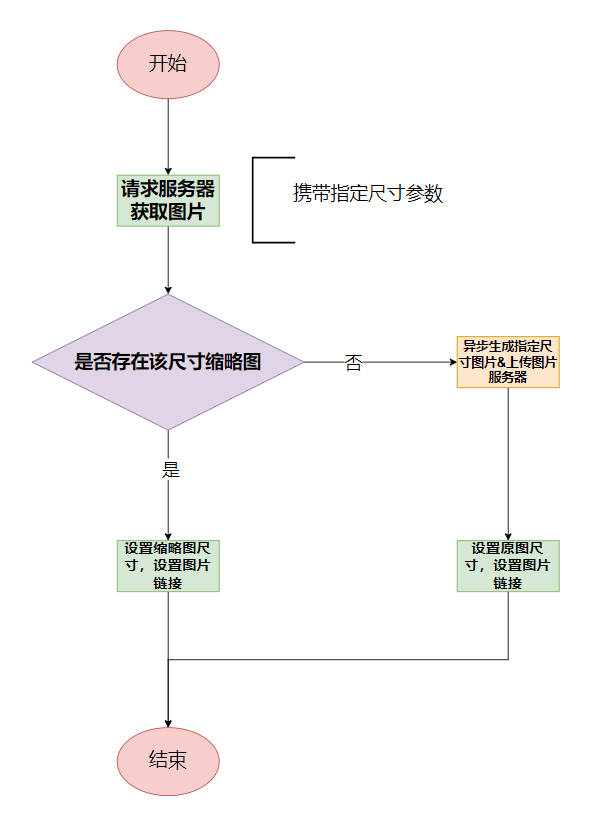
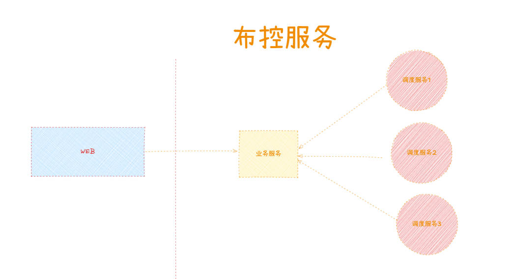

`持续更新中...`

<!-- more -->

## 目录

回答问题 尽可能条理清晰，简洁，突出重点，回答问题前，先阐述一下项目背景，然后回答问题

---

- [蜂鸟重构（重点）](#蜂鸟重构)
- [平台重构](#平台重构)
  - [权限模块](#权限模块)
  - [数据迁移](#数据迁移)

**项目是做什么的？**

**项目中负责什么？**

***项目中用到了哪些技术？***

**项目中的收获，不足的地方？**

---

1. 离职原因：

    公司项目已经趋于稳定，日常工作较为轻松，个人发展空间有限，故选择离职。

2. 自我介绍：

    面试官，你好，我是xxx岗位的面试者，从事开发已经5年了，最开始入行选择的是python语言，使用该语言做了服务器文档、Mysql 数据 迁移到 Es，负责整体迁移工作，Mysql 使用 binlog 日志进行迁移，
    服务器数据 通过FTP 服务器进行。后来因公司统一技术栈 开始使用Golang, 维护全景项目，从零到一 开发了内部考核系统，参与 OA 权限，网盘，应用等开发。在第二家公司 重写了rust 薪资模块，优化
    图像识别系统代码，参与重构，mysql 数据 到 Pg 数据迁移，服务开发等，实现了 DDD 领域驱动设计的落地。上家公司 参与蜂鸟的重构，各个服务模块优化，并在入职当年获得最佳新人奖等。

    说明要点
    1. 从事6+，突出工作年限
    2. python 入行，转 golang 突出学习能力
    3. 每家公司突出一些东西，第一家 内部考核系统，从零到一，自己完全负责；OA 项目权限，网盘。第二家 重写 rust 薪资代码，DDD实践落地，数据迁移。现在公司 业务重构，优化，服务治理，最佳新人奖。

#### 蜂鸟重构

1. 动态缩略图配置

2. 各种优化
    - 表分区：按天进行分区
    - 表垂直拆分：增加副表，将不常用字段拆分到副表
    - 表链接优化：使用各字段值组合拼接，减少表链接
    - 表字段优化：字段类型优化，字段长度优化，字段枚举优化，字段默认值优化，字段索引优化, 浮点数*255，选择合适数值类型
    - 缓存优化：查询数据Redis 缓存，查询详情 设置时间范围（等同于指定分区）
    - 统计优化：定制统计表，累计不同类型数据数量
    - 视频分片：长视频拆分，根据平台拆分分片，重复利用分片

3. 摘要检索，存储与插入 大数据量所做出的调整

    *问题*：你认为工作中做的好一点的，或者你认为比较赞的项目是什么？

    *目标*：阐述蜂鸟重构，摘要检索服务。

    *回答*：我认为最近做的蜂鸟重构的摘要检索服务值得探讨一下。首先我先承上启下说一下这个项目，这个项目主要是上传一段视频，或者指定监控设备（摄像头）的一段
    时间或者指定某个设备进行任务解析，然后程序内部可以解析视频流进行帧截图，通过不同算法，识别帧图片形体、人脸、机动车和非机动车，识别到相应数据生成摘要，
    存储到数据库中，方便后续检索。摘要检索服务主要是对生成的摘要进行存储及检索。

    *已做优化*：针对该服务，对原有业务逻辑，调用关系，协议等梳理完成后，开始重构，首先对原有的表结构进行优化，垂直拆分，时间分区，字段转换等，然后对摘要检索服务进行优化，缓存，数据延迟存储，最后进行服务拆分，拆分后服务独立部署，方便后续扩展。

    *复盘*：大数据量数据接入及检索也就是峰值时如何处理，如何进行优化。

    什么原因导致的？当出现大批量插入数据，势必会对检索产生影响，
    1. 存储和检索错开，尽可能不同时进行，可以用锁机制。有检索过来时，获取锁，检索完释放锁。插入数据时，获取锁，插入完释放锁。
    2. 针对存储进行优化，针对数据大批量插入，考虑延迟插入，将数据先存储到队列中，然后通过多任务并发处理，多节点处理，进行数据插入。
    3. 针对检索进行优化，采用redis缓存，近段时间重复请求缓存，减少数据库压力。指定时间范围（等同于指定分区）。
    4. 服务降级，针对不重要不常使用的服务限流、熔断（）。

4. 布控预警，多副本，分布式锁的使用

    项目是做什么的？
    > 用户上传形体或人脸图片，选定时间范围，设备范围，对未来一段时间进行布控，布控成功后，系统会提取图片中特征，对该时间段该范围设备内的帧截图特征进行比对，比对成功后，生成预警信息。

    针对项目，做的优化，用到了什么？
    > 用到多副本管理，原本布控仅有一个服务，临控，可以进行超过24小时的布控，后续增加了管控，圈层，对二十小时内不同时间段进行布控。做的优化，隔离开来，分为业务服务和多副本调度服务。业务服务负责接收用户请求，生成任务，存储到数据库，多副本调度服务负责调度任务，将任务分配到不同副本，副本负责执行任务，生成预警信息。业务服务与调度服务之间通过消息队列(NSQ)进行通信，保证数据一致性。

    > 用到了分布式锁，有对副本运行状态进行统计，具体是凌晨十二点副本会发送运行状态到业务服务，业务服务进行累加统计，然后根据统计结果，对副本进行重启或停止，保证副本运行状态一致，保证数据一致性。

    

5. 回溯离线 视频分片重复利用，提高回溯效率

#### 平台重构

原因：
> 为了解决平台混乱关系，增加服务的可扩展性，基础结构的一致性，对现有平台进行重构。

负责内容：
> 负责权限模块、业务接口、数据迁移等；

###### 权限模块
>
> 负责权限表设计，及基础接口提供，权限基于RBAC，包含 角色、权限、操作、资源 四个部门

1. 操作表示怎么做，或读或写或跳转等；
2. 资源表示操作谁，订单，企业，权限管理等；
3. 权限是操作和资源的组合，表示怎么做，操作谁，查看订单，修改企业等，内部结构有操作ID于资源ID组成；
4. 角色 可以认为一类人的统称，有某一个或多个权限，与人员进行绑定，比如管理员，普通用户；
5. 整体上的关系是 人跟角色关联，角色跟权限关联，权限由操作和资源组成；人关联了角色，将拥有这个角色下的权限。

不足：

1. 数据表不够灵活；角色权限关联表，如果存在部门或者组与权限进行关联，是否需要重新建立一个关联表，能否合二为一，相应的会有冗余字段，用于标识关联类型是角色权限还是组权限还是其他

2. 页面可配置操作及资源是否合理，设置成功后是否有效？

###### 数据迁移
>
> 负责全量及增量迁移，负责MySQL到PG切换；

1. 全量迁移：
    1. 理清业务逻辑，迁移的数据所对应的迁移后数据表
    2. 数据表表字段换（包含字段类型，长度，枚举等），唯一对应值关系映射表搭建
    3. 数据表数据校验，数据量校验及抽取+首位值校验
    4. 数据表 ID 范围记录，留有一定长度做区分或特殊处理
    5. 迁移日期记录 特殊数据处理

2. 增量迁移：
    1. 数据调整以迁移后数据为准，迁移前数据调整不做处理
    2. 从上次记录位置开始调整

3. MySQL 到PG切换：
    - 代码调整
    - 数据调整
        1. 区分大小写处理
        2. Group By 分组处理
        3. 字段零值处理
        4. 字段类型处理
        5. 函数不一致处理

不足：
​ 该迁移为宕机迁移，对用户体验不是很好，是否可以无感迁移，动态迁移？
