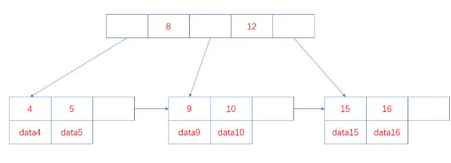
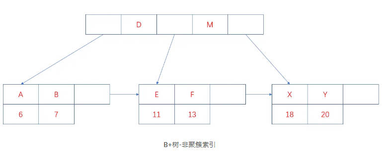

`持续更新中...`

<!-- more -->

1. 什么是MySQL？
    

    
Ans

    <ol>
        <li>MySQL是一种开放源代码的关系型数据库管理系统（RDBMS），使用最常见的数据库管理语言-结构化查询语言（SQL）进行数据库管理。</li>
        <li>MySQL是开放源代码的，因此任何人都可以在General Public License的许可下下载并根据自己需要去修改和重新发布MySQL。</li>
        <li>MySQL因为其体积小、速度快、总体拥有成本低，尤其是开放源码这一特点，一般中小型网站的开发都选择MySQL作为网站数据库。</li>
    </ol>
    

2. MySQl 常用的存储引擎有什么它们有什么区别？
    

    
Ans

    <ol>
        <li>InnoDB存储引擎：InnoDB是MySQL的默认存储引擎，InnoDB存储引擎提供了具有提交、回滚和崩溃恢复能力的事务安全。</li>
        <li>MyISAM存储引擎：MyISAM是MySQL5.1版本前的默认引擎，MyISAM的并发性比较差，不支持事务和外键等操作，默认的锁的粒度是表级锁。</li>
    </ol>
    <table>
        <tr>
            <th>特性</th>
            <th>InnoDB</th>
            <th>MyISAM</th>
        </tr>
        <tr>
            <td>外键</td>
            <td>支持</td>
            <td>不支持</td>
        </tr>
        <tr>
            <td>锁</td>
            <td>支持表锁和行锁</td>
            <td>支持表锁</td>
        </tr>
        <tr>
            <td>可恢复性</td>
            <td>支持事务日志恢复</td>
            <td>无事务日志</td>
        </tr>
        <tr>
            <td>表结构</td>
            <td>数据和索引是集中存储的，.ibd和.frm</td>
            <td>数据和索引是分开存储的，数据.MYD,索引.MYI</td>
        </tr>
        <tr>
            <td>查询性能</td>
            <td>一般情况相比MyISAM较差</td>
            <td>一般情况相比InnoDB较好</td>
        </tr>
        <tr>
            <td>索引</td>
            <td>聚簇索引</td>
            <td>非聚簇索引</td>
        </tr>
    </table>
    

3. 数据库三大范式
    

    
Ans

    <ol>
        <li>第一范式：数据库表的每一列都是不可分割的基本数据项，同一列中不能有多个值，即实体中的某个属性有多个值时，必须拆分为不同的属性。</li>
        <li>第二范式：在第一范式的基础上，非主属性完全依赖于主键，即不能存在非主属性只依赖于主键的一部分。</li>
        <li>第三范式：在第二范式的基础上，任何非主属性不依赖于其它非主属性，即不存在有传递依赖。</li>
    </ol>
    

4. MySQL 的数据类型有哪些
    

    
Ans

    <ol>
        <li>数值类型：
        
TINYINT、SMALLINT、MEDIUMINT、INT、BIGINT分别占用8、16、24、32、64位存储空间。

        
值得注意的是，INT(10)中的10只是表示显示字符的个数，并无实际意义。一般和UNSIGNED ZEROFILL 配合使用才有实际意义，例如，数据类型INT(3)， 属性位UNSIGENED ZEROFILL，如果插入的数据为3的话，实际存储的数据为003。
</li>
        <li>浮点数:
        
FLOAT、DOUBLE、DECIMAL为浮点数类型，DECIMAL是利用字符串进行处理的，能存储精确的小数。相比于FLOAT和DOUBLE，DECIMAL的效率更低些。

        
FLOAT、DOUBLE及DECIMAL都可以指定列宽，例如FLOAT(5,2)表示一共5位，两位存储小数部分，三位存储整数部分。
</li>
        <li>字符串类型：
        
字符串常用的主要有CHAR和VARCHAR，VARCHAR主要用于存储可变长字符串，相比于CHAR更节省空间。CHAR是定长的，根据定义的字符串长度分配空间。

        
应用场景：对于经常变更的数据使用CHAR更好，CHAR不容易产生碎片。对于非常短的列也是使用CHAR更好些，CHAR相比VARCHAR在效率上更高些。一般避免使用TEXT/BLOB等类型，因为查询时会使用临时表，造成严重的性能开销。
</li>
        <li>日期和时间类型：
        
比较常见的有year、time、date、datetime、timestamp等，datetime保存从1000年到9999年的时间，精度为秒，使用8字节的存储空间，与时区无关。timestamp和UNIX的时间戳相同，保存从1970年1月1日到2038年的时间，精度到秒，使用四个字节的存储空间，并且与时区相关。

        
应用场景：尽量使用timestamp，相比于datetime 它有着更高的空间效率。
</li>
    </ol>
    

5. 什么是索引，有什么优缺点
    

    
Ans

    
索引是帮助MySQL高效获取数据的数据结构。索引的本质就是数据结构，常见的索引结构有B树、B+树和哈希表。

    
优点：

    <ol>
        <li>提高查询速度</li>
        <li>降低IO成本，将随机I/O变成顺序I/O(因为B+树的叶子节点是连接在一起的)</li>
        <li>降低排序成本</li>
        <li>提高唯一性约束</li>
    </ol>
    
缺点：

    <ol>
        <li>从空间角度考虑，建立索引需要占用物理空间</li>
        <li>从时间角度考虑，创建和维护索引都需要花费时间，例如对数据进行增删改的时候都需要维护索引</li>
    </ol>
    

6. MySQL 索引的数据结构

    

    
Ans

    
常见的索引结构有B树、B+树和哈希表。

    
B树和B+树都是平衡多路查找树，二者的区别在于B+树只有叶子节点保存数据，其他节点只保存索引，而B树的所有节点都保存数据。

    
哈希表是一种以键值对存储数据的结构，通过哈希函数对键进行计算得到对应的哈希地址，从而快速定位数据。

    
B+数索引

    <ol>
    <li>在B+数中，所有的记录节点都是按照键值大小的顺序放在叶子节点上，如下图：
        
    
从上图可以看出，因为B+树具有有序性，并且所有的数据都存放在叶子节点，所以查找效率非常高，并且支持排序和范围查找。

    </li>
    <li>
    
B+数的索引又可以分为主索引和辅助索引。其中主索引为聚簇索引，辅助索引为非聚簇索引。

    <ul>
    <li>    
聚簇索引是以主键作为B+树索引的键值所构成的B+树索引，聚簇索引的叶子节点存储着完成的数据记录。
</li>
    <li>
    
非聚簇索引是以非主键的列作为B+树的键值所构成的B+树索引，非聚簇索引的叶子节点存储着主键值。所以使用非聚簇索引进行查询时，会先找到主键值，然后到根据聚簇索引找到的主键对应的数据域。

    
上图中叶子节点存储的是数据记录，为聚簇索引的结构图。

    
非聚簇索引的结构图如下：

    
    </li>
    </ul>
    </li>
    </ol>

    
哈希索引

    
哈希索引是基于哈希表实现的，对于每一行数据，存储引擎会对索引列通过哈希算法进行哈希计算得到哈希码，并且哈希算法要尽量保证不同的列值计算出的哈希码值是不同的，将哈希码的值作为哈希表的key值，将指向数据行的指针作为哈希表的value值，这样查找一个数据的时间复杂度就是o(1)，一般多用于精确查找。

    

    

    

7. MySQL 哈希索引和B+树索引的区别

    

    
Ans

    
因为两者数据结构上差异导致他们的使用场景不同，哈希索引一般用于精确的等值查找，B+索引则多用于精确的等值查找外的其他查找。在大多数情况下，会选择使用B+树索引。

    <ol>
    <li>哈希索引只能用于等值查询，而B+树索引可用于等值查询和范围查询</li>
    <li>哈希索引在等值查询上速度更快，但是不支持排序和范围查询</li>
    <li>哈希索引的数据不是按照索引值顺序存储的，而B+树索引的数据是按照索引值顺序存储的</li>
    <li>哈希索引具有更高的空间效率，因为哈希索引只存储哈希码和指向数据行的指针，而B+树索引需要存储索引值和指向数据行的指针</li>
    <li>因为哈希表中会存在哈希冲突，所以哈希索引的性能相对不稳定，B+索引每次查询都是从根节点到叶子节点，相对稳定。</li>
    </ol>
    

8. MySQL 的索引类型有哪些？

    

    
Ans

    
MySQL的索引类型有FULLTEXT、HASH、BTREE、RTREE。

    
FULLTEXT：全局索引，MyISAM存储引擎和InnoDB存储引擎在MySQL5.6.4以上版本支持全文索引，一般用于查找文本中的关键字，而不是直接比较是否相等，多在CHAR，VARCHAR，TEXT等数据类型上创建全文索引。全文索引主要用于解决WHERE LIKE '%T%'  等这类模糊查询效率低的问题。

    
HASH：哈希索引，哈希索引多用于等值查询，时间复杂度O(1),效率非常高，但不支持排序，范围查询及模糊查询等。

    
BTREE：b+树索引，InnoDB存储引擎默认的索引，支持排序、分组、范围查询等，并且性能稳定。

    
RTREE：空间索引，多用于地理数据的存储，相比于其他索引，空间数据索引的优势在于范围查找

    

9. MySQL 索引的种类有哪些

    

    
Ans

    <ul>
        <li>主键索引：数据列不允许重复，不能为NULL，一个表只能由一个主键索引</li>
        <li>组合索引：由多个列值组成的索引。</li>
        <li>唯一索引：数据列不允许重复，可以为NULL，索引列的值必须唯一的，如果是组合索引，则列值的组合必须唯一。</li>
        <li>全文索引：对文本的内容进行搜索。</li>
        <li>普通索引：基本的索引类型，可以为NULL。</li>
    </ul>

    

[返回上级](https://feng6917.github.io/language-golang/#面试题)

[Go Learn](https://feng6917.github.io/language-golang/#目录)

---
参考链接如下

- [面试题](http://mian.topgoer.com/)
