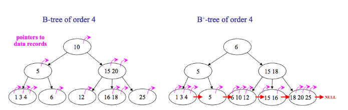
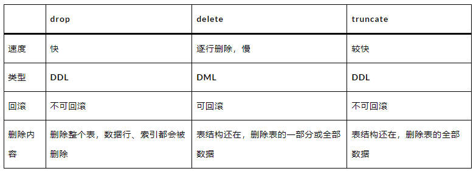

`持续更新中...`

<!-- more -->

1. 什么是MySQL？
    

    
Ans

    <ol>
        <li>MySQL是一种开放源代码的关系型数据库管理系统（RDBMS），使用最常见的数据库管理语言-结构化查询语言（SQL）进行数据库管理。</li>
        <li>MySQL是开放源代码的，因此任何人都可以在General Public License的许可下下载并根据自己需要去修改和重新发布MySQL。</li>
        <li>MySQL因为其体积小、速度快、总体拥有成本低，尤其是开放源码这一特点，一般中小型网站的开发都选择MySQL作为网站数据库。</li>
    </ol>
    

2. MySQl 常用的存储引擎有什么它们有什么区别？
    

    
Ans

    <ol>
        <li>InnoDB存储引擎：InnoDB是MySQL的默认存储引擎，InnoDB存储引擎提供了具有提交、回滚和崩溃恢复能力的事务安全。</li>
        <li>MyISAM存储引擎：MyISAM是MySQL5.1版本前的默认引擎，MyISAM的并发性比较差，不支持事务和外键等操作，默认的锁的粒度是表级锁。</li>
    </ol>
    <table>
        <tr>
            <th>特性</th>
            <th>InnoDB</th>
            <th>MyISAM</th>
        </tr>
        <tr>
            <td>外键</td>
            <td>支持</td>
            <td>不支持</td>
        </tr>
        <tr>
            <td>锁</td>
            <td>支持表锁和行锁</td>
            <td>支持表锁</td>
        </tr>
        <tr>
            <td>可恢复性</td>
            <td>支持事务日志恢复</td>
            <td>无事务日志</td>
        </tr>
        <tr>
            <td>表结构</td>
            <td>数据和索引是集中存储的，.ibd和.frm</td>
            <td>数据和索引是分开存储的，数据.MYD,索引.MYI</td>
        </tr>
        <tr>
            <td>查询性能</td>
            <td>一般情况相比MyISAM较差</td>
            <td>一般情况相比InnoDB较好</td>
        </tr>
        <tr>
            <td>索引</td>
            <td>聚簇索引</td>
            <td>非聚簇索引</td>
        </tr>
    </table>
    

3. 数据库三大范式
    

    
Ans

    <ol>
        <li>第一范式：数据库表的每一列都是不可分割的基本数据项，同一列中不能有多个值，即实体中的某个属性有多个值时，必须拆分为不同的属性。</li>
        <li>第二范式：在第一范式的基础上，非主属性完全依赖于主键，即不能存在非主属性只依赖于主键的一部分。</li>
        <li>第三范式：在第二范式的基础上，任何非主属性不依赖于其它非主属性，即不存在有传递依赖。</li>
    </ol>
    

4. MySQL 的数据类型有哪些
    

    
Ans

    <ol>
        <li>数值类型：
        
TINYINT、SMALLINT、MEDIUMINT、INT、BIGINT分别占用8、16、24、32、64位存储空间。

        
值得注意的是，INT(10)中的10只是表示显示字符的个数，并无实际意义。一般和UNSIGNED ZEROFILL 配合使用才有实际意义，例如，数据类型INT(3)， 属性位UNSIGENED ZEROFILL，如果插入的数据为3的话，实际存储的数据为003。
</li>
        <li>浮点数:
        
FLOAT、DOUBLE、DECIMAL为浮点数类型，DECIMAL是利用字符串进行处理的，能存储精确的小数。相比于FLOAT和DOUBLE，DECIMAL的效率更低些。

        
FLOAT、DOUBLE及DECIMAL都可以指定列宽，例如FLOAT(5,2)表示一共5位，两位存储小数部分，三位存储整数部分。
</li>
        <li>字符串类型：
        
字符串常用的主要有CHAR和VARCHAR，VARCHAR主要用于存储可变长字符串，相比于CHAR更节省空间。CHAR是定长的，根据定义的字符串长度分配空间。

        
应用场景：对于经常变更的数据使用CHAR更好，CHAR不容易产生碎片。对于非常短的列也是使用CHAR更好些，CHAR相比VARCHAR在效率上更高些。一般避免使用TEXT/BLOB等类型，因为查询时会使用临时表，造成严重的性能开销。
</li>
        <li>日期和时间类型：
        
比较常见的有year、time、date、datetime、timestamp等，datetime保存从1000年到9999年的时间，精度为秒，使用8字节的存储空间，与时区无关。timestamp和UNIX的时间戳相同，保存从1970年1月1日到2038年的时间，精度到秒，使用四个字节的存储空间，并且与时区相关。

        
应用场景：尽量使用timestamp，相比于datetime 它有着更高的空间效率。
</li>
    </ol>
    

5. 什么是索引，有什么优缺点
    

    
Ans

    
索引是帮助MySQL高效获取数据的数据结构。索引的本质就是数据结构，常见的索引结构有B树、B+树和哈希表。

    
优点：

    <ol>
        <li>提高查询速度</li>
        <li>降低IO成本，将随机I/O变成顺序I/O(因为B+树的叶子节点是连接在一起的)</li>
        <li>降低排序成本</li>
        <li>提高唯一性约束</li>
    </ol>
    
缺点：

    <ol>
        <li>从空间角度考虑，建立索引需要占用物理空间</li>
        <li>从时间角度考虑，创建和维护索引都需要花费时间，例如对数据进行增删改的时候都需要维护索引</li>
    </ol>
    

6. MySQL 索引的数据结构

    

    
Ans

    
常见的索引结构有B树、B+树和哈希表。

    
B树和B+树都是平衡多路查找树，二者的区别在于B+树只有叶子节点保存数据，其他节点只保存索引，而B树的所有节点都保存数据。

    
哈希表是一种以键值对存储数据的结构，通过哈希函数对键进行计算得到对应的哈希地址，从而快速定位数据。

    
B+数索引

    <ol>
    <li>在B+数中，所有的记录节点都是按照键值大小的顺序放在叶子节点上，如下图：
        
    
从上图可以看出，因为B+树具有有序性，并且所有的数据都存放在叶子节点，所以查找效率非常高，并且支持排序和范围查找。

    </li>
    <li>
    
B+数的索引又可以分为主索引和辅助索引。其中主索引为聚簇索引，辅助索引为非聚簇索引。

    <ul>
    <li>    
聚簇索引是以主键作为B+树索引的键值所构成的B+树索引，聚簇索引的叶子节点存储着完成的数据记录。
</li>
    <li>
    
非聚簇索引是以非主键的列作为B+树的键值所构成的B+树索引，非聚簇索引的叶子节点存储着主键值。所以使用非聚簇索引进行查询时，会先找到主键值，然后到根据聚簇索引找到的主键对应的数据域。

    
上图中叶子节点存储的是数据记录，为聚簇索引的结构图。

    
非聚簇索引的结构图如下：

    
    </li>
    </ul>
    </li>
    </ol>

    
哈希索引

    
哈希索引是基于哈希表实现的，对于每一行数据，存储引擎会对索引列通过哈希算法进行哈希计算得到哈希码，并且哈希算法要尽量保证不同的列值计算出的哈希码值是不同的，将哈希码的值作为哈希表的key值，将指向数据行的指针作为哈希表的value值，这样查找一个数据的时间复杂度就是o(1)，一般多用于精确查找。

    

    

    

7. MySQL 哈希索引和B+树索引的区别

    

    
Ans

    
因为两者数据结构上差异导致他们的使用场景不同，哈希索引一般用于精确的等值查找，B+索引则多用于精确的等值查找外的其他查找。在大多数情况下，会选择使用B+树索引。

    <ol>
    <li>哈希索引只能用于等值查询，而B+树索引可用于等值查询和范围查询</li>
    <li>哈希索引在等值查询上速度更快，但是不支持排序和范围查询</li>
    <li>哈希索引的数据不是按照索引值顺序存储的，而B+树索引的数据是按照索引值顺序存储的</li>
    <li>哈希索引具有更高的空间效率，因为哈希索引只存储哈希码和指向数据行的指针，而B+树索引需要存储索引值和指向数据行的指针</li>
    <li>因为哈希表中会存在哈希冲突，所以哈希索引的性能相对不稳定，B+索引每次查询都是从根节点到叶子节点，相对稳定。</li>
    </ol>
    

8. MySQL 的索引类型有哪些？

    

    
Ans

    
MySQL的索引类型有FULLTEXT、HASH、BTREE、RTREE。

    
FULLTEXT：全局索引，MyISAM存储引擎和InnoDB存储引擎在MySQL5.6.4以上版本支持全文索引，一般用于查找文本中的关键字，而不是直接比较是否相等，多在CHAR，VARCHAR，TEXT等数据类型上创建全文索引。全文索引主要用于解决WHERE LIKE '%T%'  等这类模糊查询效率低的问题。

    
HASH：哈希索引，哈希索引多用于等值查询，时间复杂度O(1),效率非常高，但不支持排序，范围查询及模糊查询等。

    
BTREE：b+树索引，InnoDB存储引擎默认的索引，支持排序、分组、范围查询等，并且性能稳定。

    
RTREE：空间索引，多用于地理数据的存储，相比于其他索引，空间数据索引的优势在于范围查找

    

9. MySQL 索引的种类有哪些

    

    
Ans

    <ul>
        <li>主键索引：数据列不允许重复，不能为NULL，一个表只能由一个主键索引</li>
        <li>组合索引：由多个列值组成的索引。</li>
        <li>唯一索引：数据列不允许重复，可以为NULL，索引列的值必须唯一的，如果是组合索引，则列值的组合必须唯一。</li>
        <li>全文索引：对文本的内容进行搜索。</li>
        <li>普通索引：基本的索引类型，可以为NULL。</li>
    </ul>

    

10. B树和B+树的区别

    

    
Ans

    
B树和B+树的区别主要有两点：

    <ul>
    <li>B树中的内部节点和叶子节点均存放在键和值，而B+树的内部节点只有键没有值，叶子节点存放所有的键和值。</li>
    <li>B+树的叶子节点是相连在一起的，方便顺序检索。</li>
    </ul>
    
两者的结构图如下：

    
    

11. MySQL 什么情况下会出现索引失效

    

    
Ans

    
以下情况会导致索引失效：

    <ol>
        <li>使用LIKE模糊匹配时，如果匹配字符串的第一个字符是“%”，索引会失效</li>
        <li>使用OR关键字时，会导致索引失效</li>
        <li>使用函数时，会导致索引失效</li>
        <li>使用负向查询时，会导致索引失效</li>
        <li>使用类型转换时，会导致索引失效</li>
        <li>使用表达式时，会导致索引失效</li>
        <li>使用NOT IN时，会导致索引失效</li>
        <li>使用!=时，会导致索引失效</li>
        <li>使用IS NULL时，会导致索引失效</li>
        <li>使用ORDER BY时，如果排序的列没有索引，会导致索引失效</li>
        <li>使用GROUP BY时，如果分组的列没有索引，会导致索引失效</li>
    </ol>
    

12. MySQL 索引为什么使用B+树而不是B树

    

    
Ans

    <ul>
    <li>B树适用于随机检索，而B+树适用于随机检索和顺序检索。</li>
    <li>B+树的空间利用率更高，因为B树每个节点要存储键和值，而B+树的内部节点只存储键，这样B+树的一个节点就可以存储更多的索引，从而使树的高度变低，减少了I/O次数，是的数据检索速度更快。</li>
    <li>B+树的叶子节点都是连接在一起的，所以范围查找，顺序查找更加方便。</li>
    <li>B+树的性能更加稳定，因为在B+树中，每次查询都是从根节点到叶子节点，而在B树中，要查询的值可能不再叶子节点，在内部节点就可以找到。</li>
    </ul>
    
那什么情况适合使用B树呢？

    
因为B树的内部节点也可以存储值，所以可以把一些频繁访问的值放在距离根节点比较近的地方，这样可以提高查询效率。

    

13. 什么是聚簇索引，什么是非聚簇索引？

    

    
Ans

    
聚簇索引和非聚簇索引最主要的区别是数据和索引是否分开存储。

    <ul>
    <li>聚簇索引：将数据和索引放在一起存储，索引结构的叶子节点保留了数据行。</li>
    <li>非聚簇索引：将数据和索引分开存储，索引叶子节点存储的是指向数据行的地址。</li>
    </ul>
    
在InnoDB存储引擎中，默认的索引为B+树索引，利用主键创建的索引为主索引，也是聚簇索引，在主索引之上创建的索引为辅助索引，也是非聚簇索引。

    
为什么说辅助索引是在主索引之上创建呢？因为辅助索引中的叶子节点存储的是主键。

    
在MyISAM存储引擎中，默认的索引也是B+树索引，但主索引和辅助索引都是非聚簇索引，也就是说索引结构的叶子节点存储的都是一个指向数据行的地址。并且使用辅助索引检索无需访问主键的索引。

    
InnoDB索引：

    
    
MyISAM索引：

    
    

14. 什么是覆盖索引？
    

    
Ans

    
覆盖索引是指查询语句中的字段，全部都在索引中，而无需访问数据行。

    
覆盖索引可以减少I/O次数，提高查询效率。

    

15. 什么是回表查询？
    

    
Ans

    
回表查询是指通过二级索引查询数据时，需要先通过二级索引找到主键值，然后再通过主键索引找到数据记录的过程。

    

16. 非聚簇索引一定会进行回表查询吗？
    

    
Ans

    
不一定，如果查询语句中使用了覆盖索引，那么就不需要回表查询。

    
覆盖索引是指查询语句中的字段，全部都在索引中，而无需访问数据行。

    

17. 索引的使用场景有哪些？
    

    
Ans

    <ul>
    <li>对于中大型表建立索引非常有效，对于非常小的表，一般全表扫描更快些。</li>
    <li>对于超大型的表，建立和维护索引的代价也会变高，这时可以考虑分区技术。</li>
    <li>如果表的增删改查非常多，而查询需求非常少的话，那就没有必要建立索引了，因为维护索引也是需要代价的。</li>
    <li>一般不会出现在where条件中的字段就没有必要建立索引了。</li>
    <li>多个字段经常被查询的话可以考虑联合索引。</li>
    <li>字段多且字段值没有重复的时候考虑唯一索引。</li>
    <li>字段多且有重复的时候考虑普通索引。</li>
    </ul>
    

18. 索引的设计原则？
    

    
Ans

    <ul>
    <li>选择唯一索引，尽量选择数值类型索引，因为字符串类型索引比数值类型索引占用更多的磁盘空间，比较慢。</li>
    <li>为经常需要排序、分组和联合操作的字段建立索引。</li>
    <li>为常作为查询条件的字段建立索引。</li>
    <li>限制索引的数目，索引并不是越多越好，索引虽然可以提高查询速度，但是会降低更新表的速度。</li>
    <li>尽量使用覆盖索引，减少select *语句。</li>
    <li>限制索引的长度，如果索引太长，查询时占用的磁盘空间会增大，速度也会变慢。</li>
    <li>对于经常增删改的表，要避免对这些字段建立索引。</li>
    <li>对于经常需要进行表连接的字段，最好建立索引。</li>
    </ul>
    

19. 什么是前缀索引？
    

    
Ans

    
前缀索引是指对文本字段的前几个字符建立索引，而不是对整个字段建立索引。

    
前缀索引可以减少索引占用的磁盘空间，提高查询速度。

    
但是前缀索引也有缺点，就是会增加查询的难度，因为查询时需要比较前缀，而不是整个字段。

    

20. 如何对索引进行优化？
    

    
Ans

    <ul>
    <li>选择合适的索引类型，比如主键索引、唯一索引、普通索引、全文索引等。</li>
    <li>选择合适的索引列，比如经常需要查询的字段、经常需要排序的字段、经常需要联合查询的字段等。</li>
    <li>选择合适的索引长度，比如对于字符串类型的字段，可以选择前缀索引，而不是整个字段。</li>
    <li>选择合适的索引顺序，比如对于联合索引，需要考虑字段的顺序，以减少回表查询的次数。</li>
    <li>定期维护索引，比如删除重复的索引、删除冗余的索引、重建索引等。</li>
    <li>在进行查询时，索引列不能是表达式的一部分，也不能是函数的参数，因为这样无法使用索引。例如 "select * from table where id+1=10" 这样的查询是无法使用索引的，因为id+1不是索引列的一部分。</li>
    <li>将区分度最高的索引放在前面</li>
    <li>尽量少使用select * </li>
    </ul>
    

21. 什么是索引失效？

    

    
Ans

    <ol>
        <li>使用表达式时，会导致索引失效</li>
        <li>使用函数时，会导致索引失效</li>
        <li>使用运算符时，会导致索引失效</li>
        <li>使用like时，会导致索引失效</li>
        <li>使用or时，会导致索引失效</li>
        <li>使用not时，会导致索引失效</li>
        <li>使用!=时，会导致索引失效</li>
        <li>使用order by时，会导致索引失效</li>
        <li>使用group by时，会导致索引失效</li>
        <li>使用limit时，会导致索引失效</li>
    </ol>
    

22. 如何创建索引或删除索引？使用索引查询时性能一定会提升吗？
    

    
Ans

    
创建索引:

    <ol>
    <li>使用CREATE INDEX 语句 <code>CREATE INDEX index_name ON table_name (column_list);</code></li>
    <li>在CREATE TABLE时创建<code>CREATE TABLE user(id INT PRIMARY KEY,information text, FULLTEXT KEY (information));</code></li>
    <li>使用ALTER TABLE创建索引<code>ALTER TABLE table_name ADD INDEX index_name (column_list);</code></li>
    </ol>
    
删除索引：

    <ol>
    <li>删除主键索引:<code>alter table table_name drop primary key;</code></li>
    <li>删除其他索引:<code>alter table table_name drop key index_name</code></li>
    </ol>
    
不一定，前面在索引的使用场景和索引的设计原则中已经提到了如何合理地使用索引，因为创建和维护索引需要花费空间和时间上的代价，如果不合理地使用索引反而会使查询性能下降。

    

23. 如何查看索引？
    

    
Ans

    
可以使用SHOW INDEX FROM table_name语句查看表的索引。

    
也可以使用EXPLAIN语句查看查询语句的执行计划，包括是否使用了索引。

    

24. 什么是前缀索引？
    

    
Ans

    
前缀索引是指对文本或者字符串的前几个字符建立索引，这样索引的长度更短，查询速度更快。

    
前缀索引可以减少索引占用的磁盘空间，提高查询速度。

    
但是前缀索引也有缺点，就是会增加查询的难度，因为查询时需要比较前缀，而不是整个字段。

    
使用场景：前缀的区分度比较高的情况下。

    
建立前缀索引的方式

    
<code>ALTER TABLE table_name ADD KEY(column_name(prefix_length);</code>

    
这里面有个prefix_length参数很难确定，这个参数就是前缀长度的意思。通常可以使用以下方法进行确定，先计算全列的区分度。

    
<code>SELECT COUNT(DISTINCT column_name)/COUNT(*) FROM table_name;</code>

    
然后在计算前缀长度为多少时和全列的区分度最相似。

    
<code>SELECT COUNT(DISTINCT LEFT(column_name, prefix_length))/COUNT(*) FROM table_name;</code>

    
不断地调整prefix_length的值，直到和全列计算出区分度相近。

    

25. 什么是最左匹配原则？
    

    
Ans

    
最左匹配原则：从最左边为起点开始连续匹配，遇到范围查询（<、>、between、like）会停止匹配。

    

26. 索引在什么情况下会失效？
    

    
Ans

    

    <ol>
        <li>条件中有or，例如 <code>select * from table_name where a = 1 or b =3;</code></li>
        <li>在索引上进行计算会导致索引失效，例如 <code>select * from table_name where a + 1 =2</code></li>
        <li>在索引的类型上进行数据类型的隐形转换，会导致索引失效，例如字符串一定要加引号，假设<code>select * from table_name where a = '1'</code>会使用到索引，如果写成<code>select * from table_name where a = 1</code>则会导致索引失效。</li>
        <li>在索引中使用函数会导致索引失效，例如<code>select * from table_name where abs(a) = 1</code></li>
        <li>在使用like查询时以%开头会导致索引失效</li>
        <li>索引上使用!、=、<>进行判断时会导致索引失效，例如<code>select * from table_name where a != 1;</code></li>
        <li>索引字段上使用is null/is not null判断时会导致索引失效，例如<code>select * from table_name where a is null</code></li>
        <li>使用order by、group by、limit时，会导致索引失效</li>
    </ol>
    

27. 什么是数据库事务？事务的四大特性是什么？
    

    
Ans

    
数据库事务是指一组逻辑操作，要么全部成功，要么全部失败。

    
事务的四大特性：ACID

    <ol>
        <li>原子性：事务是一个不可分割的工作单位，事务中的操作要么全部完成，要么全部不完成。</li>
        <li>一致性：事务开始和完成时，数据必须保持一致状态。</li>
        <li>隔离性：多个用户并发访问数据库时，数据库为每一个用户开启的事务，不能被其他事务的操作数据所干扰，多个并发事务之间要相互隔离。</li>
        <li>持久性：一个事务一旦被提交，它对数据库中数据的改变就是永久性的，接下来即使数据库发生故障也不应该对其有任何影响。</li>
    </ol>
    

28. 数据库的并发一致性问题？
    

    
Ans

    
当多个事务并发执行时，可能会出现以下问题：

    <ul>
    <li>脏读：事务A更新了数据，但还没有提交，这时事务B读到事务A更新后的数据，然后事务A回滚了，事务B读取到的数据就成为脏数据了。</li>
    <li>不可重复读：事务A对数据进行多次读取，事务B在事务A多次读取的过程中执行了更新操作并提交了，导致事务A多次读取到数据并不一致。</li>
    <li>幻读：事务A在读取数据后，事务B向事务A读取的数据中插入了几条数据，事务A再次读取数据时发现多了几条数据，和之前读取的数据不一致。</li>
    <li>丢失更改：事务A和事务B都对同一个数据进行修改，事务A先修改，事务B随后修改，事务B的修改覆盖了事务A的修改。</li>
    </ul>
    
不可重复读和幻读比较像，它们主要的区别是：在不可重复读中，发现数据不一致主要是数据被更新了。在幻读中，发现数据不一致主要是数据增多或减少了。

    

29. 什么是MVCC？MVCC的实现原理是什么？
    

    
Ans

    
MVCC（多版本并发控制）指维护一个数据的多个版本，使得读写操作没有冲突，快照读是MySQL中实现MVCC的方式。

    
MVCC的实现原理：通过在每行记录后面保存两个隐藏的列来实现，一列记录创建版本号，一列记录删除版本号，然后通过版本号与事务的版本号进行比较，从而判断数据是否可见。

    

30. 数据库的隔离级别有哪些？隔离级别是如何实现的？
    

    
Ans

    
数据库的隔离级别有四种：

    <ol>
        <li>未提交读：一个事务在提交前，它的修改对其他事务也是可见的。</li>
        <li>提交读：一个事务提交之后，它的修改才能被其他事务看到。</li>
        <li>可重复读：一个事务开启后，无论其他事务是否提交，当前事务读取到的数据都是一致的。</li>
        <li>串行化：最高的隔离级别，需要加锁实现，事务只能一个接一个的执行，不能并发执行。</li>
    </ol>
    
数据库的隔离级别分别可以解决数据库的脏读、不可重复读、幻读等问题

    <table>
        <tr>
            <th>隔离级别</th>
            <th>脏读</th>
            <th>不可重复读</th>
            <th>幻读</th>
        </tr>
        <tr>
            <td>未提交读</td>
            <td>允许</td>
            <td>允许</td>
            <td>允许</td>
        </tr>
        <tr>
            <td>提交读</td>
            <td>不允许</td>
            <td>允许</td>
            <td>允许</td>
        </tr>
        <tr>
            <td>可重复读</td>
            <td>不允许</td>
            <td>不允许</td>
            <td>允许</td>
        </tr>
        <tr>
            <td>串行化</td>
            <td>不允许</td>
            <td>不允许</td>
            <td>不允许</td>
        </tr>
    </table>
    
隔离级别是如何实现的？

    
事务的隔离机制主要是依靠锁机制和MVCC(多版本并发控制)实现的，提交读和可重复读可以通过MVCC实现，串行化可以通过锁机制实现。

    

31. 数据库锁的类型有哪些？
    

    
Ans

    
按照锁的粒度可以将MySQL锁分为三种：

    <ol>
        <li>行锁：对某一行加锁，锁的粒度最小，发生锁冲突的概率最低，并发度也最高。</li>
        <li>表锁：对整个表加锁，锁的粒度最大，发生锁冲突的概率最高，并发度也最低。</li>
        <li>页锁：对整个页面加锁，锁的粒度介于行锁和表锁之间，并发度一般。</li>
    </ol>
    
按照锁的类型可以将MySQL锁分为三种：

    <ol>
        <li>共享锁：又称为读锁，多个事务可以同时获取，不会相互阻塞。</li>
        <li>排他锁：又称为写锁，一个写锁会阻塞其他的写锁和读锁。</li>
        <li>意向锁：意向锁是表级锁，表示一个事务想要获得一张表中某几行的锁，意向锁之间不会产生冲突，但是意向锁会阻塞表级锁和行级锁的请求。</li>
    </ol>
    
按照锁的持续时间可以将MySQL锁分为三种：

    <ol>
        <li>持久锁：在事务提交前，锁一直存在。</li>
        <li>共享锁：在事务提交前，锁一直存在。</li>
        <li>死锁：两个或两个以上的事务在执行过程中，因争夺资源而造成的一种互相等待的现象。</li>
    </ol>
    

32. 什么是死锁？如何解决死锁？
    

    
Ans

    
死锁是指两个或两个以上的事务在执行过程中，因争夺资源而造成的一种互相等待的现象。

    
避免或预防死锁的方法:

    <ol>
        <li>如果不同的程序并发存取多个表，尽量以相同的顺序访问表。</li>
        <li>在程序以批量方式处理数据的时候，如果已经对数据排序，尽量保证每个线程按照固定的顺序来处理记录。</li>
        <li>在事务中，如果需要更新记录，应直接申请足够级别的排他锁，而不应该先申请共享锁，更新时再申请排他锁，因为在当前用户申请排他锁时，其他事务可能已经获得了相同记录的共享锁，从而造成锁冲突或者死锁。</li>
        <li>尽量使用较低的隔离级别。</li>
        <li>尽量使用索引访问数据，使加锁更加准确，从而减少锁冲突的机会。</li>
        <li>合理选择事务的大小，小事务发生锁冲突的概率更低。</li>
        <li>尽量用相等的条件访问数据，可以避免NEXT-KEY锁对并发插入的影响。</li>
        <li>不要申请超过实际需要的锁级别，查询时尽量不要显示加锁。</li>
        <li>对于一些特定的事务，可以表锁来提高处理速度或减少死锁的概率。</li>
    </ol>
    
解决死锁的方法：

    <ol>
        <li>设置超时时间：为事务设置一个等待时间，如果在这个时间内无法获取到锁，则自动放弃，并回滚事务。</li>
        <li>设置死锁检测：通过数据库的死锁检测机制，主动检测出死锁并进行处理，比如回滚其中一个事务。</li>
    </ol>
    

33. 什么是数据库的乐观锁和悲观锁，如何实现？
    

    
Ans

    
数据库的乐观锁和悲观锁是两种常见的锁机制。

    
乐观锁：认为并发冲突的概率比较低，所以在数据提交之前，先尝试提交数据，如果提交失败，则再次尝试提交，直到提交成功为止。

    
悲观锁：认为并发冲突的概率比较高，所以在数据提交之前，先尝试获取锁，如果获取到锁，则提交数据，如果获取不到锁，则等待锁释放后再提交数据。

    
乐观锁的实现方式：

    <ol>
        <li>版本号：在数据表中添加一个版本号字段，每次更新数据时，先查询出当前数据的版本号，然后更新数据时，将版本号加1，如果更新数据时，发现版本号已经改变，则更新失败。</li>
        <li>时间戳：在数据表中添加一个时间戳字段，每次更新数据时，先查询出当前数据的时间戳，然后更新数据时，将时间戳更新为当前时间，如果更新数据时，发现时间戳已经改变，则更新失败。</li>
    </ol>
    
悲观锁的实现方式：

    <ol>
        <li>悲观锁：在查询数据时，先获取锁，然后更新数据，最后释放锁。</li>
        <li>通过数据库的锁机制实现，对查询语句添加for update</li>
    </ol>
    

34. SQL语句主要分为哪几类？
    

    
Ans

    
SQL语句主要分为以下几类：

    <ol>
        <li>DDL（Data Definition Language）：数据定义语言，用于创建、修改和删除数据库对象，如数据库、表、索引等。</li>
        <li>DML（Data Manipulation Language）：数据操作语言，用于查询、插入、更新和删除数据。</li>
        <li>DCL（Data Control Language）：数据控制语言，用于控制数据库的访问权限。</li>
        <li>TCL（Transaction Control Language）：事务控制语言，用于控制事务的提交、回滚等。</li>
    </ol>
    

35. SQL约束有哪些？
    

    
Ans

    <ul>
        <li>主键约束：主键为在表中存在一列或者多列的组合，能唯一标识表中的每一行。一个表只有一个主键，并且主键约束的列不能为空。</li>
        <li>外键约束：外键约束是指用于在两个表之间建立关系，需要指定引用主表的哪一刻。只有主表的主键可以被从表用作外键，被约束的从表的列可以不是主键，所以创建外键约束需要先定义主表的主键，然后定义从表的外键。</li>
        <li>唯一约束：确保表中的一列数据没有相同的值，一个表可以定义多个唯一约束。</li>
        <li>默认约束：在插入新数据时，如果该行没有指定数据，系统将默认值赋给改行，如果没有设置没默认值，则为NULL。</li>
        <li>Check约束：Check会通过逻辑表达式来判断数据的有效性，用来限制输入一列或者多列的值的范围。在列更新数据时，输入的内容必须满足Check约束的条件。</li>
    </ul>
    

36. 什么是子查询？
    

    
Ans

    
子查询是指在一个SQL语句中嵌套另一个SQL语句，子查询可以嵌套在SELECT、INSERT、UPDATE、DELETE等语句中，也可以嵌套在另一个子查询中。

    
子查询可以返回一个值、一个行、一个列或者一个表，根据子查询返回的结果类型，可以将子查询分为以下几类：

    <ol>
        <li>标量子查询：指子查询返回的是一个值，可以使用=,>,<,>=,<=,<> 等操作符对子查询标量结构进行比较，一般子查询会放在比较式的右侧。
<code> SELECT * FROM user WHERE age = (SELECT max(age) FROM user) // 查询年纪最大的人</code>
</li>
        <li>列子查询：指子查询的结果是n行一列，一般应用于对表的某个字段进行查询返回。可以使用IN，ANY，SOME和ALL等操作符，不能直接使用
<code>SELECT num1 FROM table1 WHERE num1 > ANY(SELECT num2 FROM table2)</code>
</li>
        <li>行子查询：指子查询返回的结果一行n列
<code>SELECT * FROM user WHERE (age, sex) = (SELECT age, sex FROM user WHERE name = '张三') // 查询和张三年龄和性别相同的人</code>
</li>
        <li>表子查询：指子查询是n行n列的一个数据表
<code>SELECT * FROM student WHERE (name, age, sex) IN (SELECT name, age, sex FROM user) // 查询在user表中存在的学生</code>
</li>
    

37. 了解MySQL的连接查询吗？
    

    
Ans

    
MySQL的连接查询主要可以分为外连接，内连接，交叉连接。

    <ol>
        <li>外连接
        
外连接主要分为左外连接(LEFT JOIN)、右外连接(RIGHT JOIN) 和全外连接。

        
左外连接：显示左表中所有的数据及右表中符合条件的数据，右表中不符合条件的数据为null.

        
右外连接：显示右表中所有的数据及左表符合条件的数据，左表中不符合条件的数据为null.

        
MySQL 中不支持全外连接

        </li>
        <li>内连接：只显示符合条件的数据</li>
        <li>交叉连接：使用笛卡尔积的一种连接
        
笛卡尔积：两个集合X和Y的笛卡尔积表示为X*Y，第一个对象是X的成员，而第二个对象是Y的所有可能有序对的其中一个成员。

        
例如：A={a,b},B={0,1,2}, A*B={(a,0),(a,1),(a,2),(b,0),(b,1),(b,2)}

        </li>
    </ol>
    

38. MySQL中IN和EXISTS的区别
    

    
Ans

    
IN和EXISTS都是子查询的条件判断，但是它们的执行方式和效率不同。

    <ul>
        <li>使用exists时会先进行外表查询，将查询到的每行数据带入到内表查询中看是否满足条件；使用in一般会先进行内表查询获取结果集，然后对外表查询匹配结果集，返回数据。</li>
        <li>in在内表查询或者外表查询过程中都会用到索引。</li>
        <li>exists仅在内表查询时会用到索引</li>
        <li>一般来说，当子查询的结果集比较大，外表较小使用exist效率更高；当子查询结果集较小，外表较大时，使用in效率更高。</li>
        <li>对于not in和not exists, not exists效率比not in的效率高，于子查询的结果集无关，因为not in 对于内外表都进行了全表扫描，没有使用到索引。not exists的子查询中可以用到表上的索引。</li>
    </ul>
    

39. varchar和char的区别?MySQL中int(10)和char(10)和varchar(10)的区别?

    

    
Ans

    <ul>
        <li>varchar表示变长，char表示长度固定。
当所插入的字符超过他们的长度时，在严格模式下，会拒绝插入并提示错误信息，在一般模式下，会截取后插入。

如char(5),无论插入的字符长度是多少，长度是5，插入字符长度小于5，则用空格补充。对于varchar(5),如果插入的字符长度小于5，则存储的字符长度就是插入字符的长度，不会填充。
</li>
        <li>存储容量不同，对于char来说，最多能存放的字符个数为255。对于varchar,最多能存放的字符个数是65532.</li>
        <li>存储速度不同，char长度固定，存储速度会比varchar快一些，但在空间上会占用额外的空间，属于一种空间换时间的策略。而varchar空间利用率会高些，但存储速度慢，属于一种时间换空间的策略。</li>
    </ul>
        
int(10)中的10表示的是显示数据的长度，而char(10)和varchar(10)表示的是存储数据的大小。

    

40. MySQL 中 drop、delete、truncate的区别
    

    
Ans

        
        一般来讲，删除整个表，使用drop。删除表的部分数据使用delete。保留表结构删除表的全部数据使用truncate。
    

41. UNION和UNION ALL的区别?
    

    
Ans

    
union和union all的作用都是将两个结果集合并在一起。

    <ul>
        <li>union会对结果去重并排序，union all直接返回合并后的结果，不去重也不进行排序。</li>
        <li>union all的性能比union性能好。</li>
    </ul>
    

42. 什么是临时表，什么时候会使用到临时表，什么时候删除临时表?
    

    
Ans

    
MySQL在执行SQL语句的时候会临时创建一些存储中间结果集的表，这种表被称为临时表，临时表只对当前连接可见，在连接关闭后，临时表会被删除并释放空间。

    
临时表主要分为内存临时表和磁盘临时表两种。内存临时表使用的是MEMORY存储引擎，磁盘临时表使用的是MySQL存储引擎。

    
一般在以下几种情况中会使用到临时表：

    <ul>
        <li>FROM 中的子查询</li>
        <li>DISTINCT 查询并加上 ORDER BY</li>
        <li>ORDER BY 和 GROUP BY的子句不一样时会产生临时表</li>
        <li>使用UNION 查询会产生临时表</li>
    </ul>
    

43. 大表数据查询如何进行优化?
    

    
Ans

    <ul>
        <li>索引优化</li>
        <li>SQL语句优化</li>
        <li>水平拆分</li>
        <li>垂直拆分</li>
        <li>建立中间表</li>
        <li>使用缓存技术</li>
        <li>固定长度的表访问起来更快</li>
        <li>越小的列访问越快</li>
    </ul>
    

44. 了解慢日志查询吗?统计过慢查询吗？对慢查询如何优化?
    

    
Ans

    
慢查询一般用于记录执行时间超过某个临界值的SQL语句的日志。

    
相关参数:

    <ul>
        <li>slow_query_log: 是否开启慢日志查询，1表示开启，0表示关闭。</li>
        <li>slow_query_log_file: MySQL数据库慢查询日志存储路径。</li>
        <li>long_query_time: 慢查询阈值，当SQL语句查询时间大于阈值，会被记录在日志上。</li>
        <li>log_queries_not_using_indexes: 未使用索引的查询会被记录到慢查询日志中。</li>
        <li>log_output: 日志存储方式。"FILE"表示将日志存入文件。"TABLE"表示将日志存入数据库。</li>
    </ul>
    
如何对慢查询进行优化？

    <ul>
        <li>分析语句的执行计划，查看SQL语句的索引是否命中。</li>
        <li>优化数据库的结构，将字段很多的表分解成多个表，或者考虑建立中间表。</li>
        <li>优化LIMIT分页。</li>
    </ul>
    

45. 为什么要设置主键?主键一般用自增ID还是UUID?
    

    
Ans

    
因为主键是唯一区分表中每一行的唯一标识，如果没有主键，更新或者删除表中特定的行会很困难，因为不能唯一准确地标识某一行。

    
主键一般用自增ID还是UUID?

    
使用自增ID的好处：

    <ul>
        <li>字段长度较UUID会小很多</li>
        <li>数据库自动编号，按顺序存放，利于检索</li>
        <li>无需担心主键重复问题</li>
    </ul>
    
使用自增ID的缺点：

    <ul>
        <li>因为是自增，在某些业务场景下，容易被其他人看到业务量。</li>
        <li>发生数据迁移时，或者表合并时会非常麻烦。</li>
        <li>在高并发的场景下，竞争自增锁会降低数据库的吞吐能力。</li>
    </ul>
    
UUID：通用唯一标识码，UUID是基于当前时间、计数器和硬件标识等数据计算生成的。

    
使用UUID的优点：

    <ul>
        <li>唯一标识，不会考虑重复问题，在数据拆分、合并时也能达到全局的唯一性。</li>
        <li>可以在应用层生成，提高数据库的吞吐能力。</li>
        <li>无需担心业务量泄露的问题。</li>
    </ul>
    
使用UUID的缺点：

    <ul>
        <li>因为UUID时随机生成的，所以会发生随机IO，影响插入速度，并且造成硬盘的使用率较低。</li>
        <li>UUID占用空间较大，建立的索引较多，造成的影响越大。</li>
        <li>UUID之间比较大小自增ID慢不少，影响查询速度。</li>
    </ul>
    
一般情况下，MySQL推荐使用自增ID。因为在MySQL的InnoDB存储引擎中，主键索引是一种聚簇索引，主键索引的B+树的叶子节点按照顺序存储了主键值及数据，如果主键索引是自增ID，只需要按顺序往后排列即可，如果是UUID，ID是随机生成的，在数据插入时会造成大量的数据移动，产生大量的内存碎片，造成插入性能的下降。

    

46. MySQL字段为什么要设置成NOT NULL?
    

    
Ans

    
NULL和空值是不一样的，空值是不占用空间的，而NULL是占用空间的，所以字段设为NOT NULL后仍然可以插入空值。

    
字段设置成NOT NULL主要有以下几点原因：

    <ul>
        <li>NULL值会影响一些函数的统计，如count，遇到NULL值，这条记录不会统计在内。</li>
        <li>B树不存储NULL，所以索引用不到NULL，会造成第一点中说的统计不到的问题。</li>
        <li>NOT IN子查询在有NULL值的情况下返回的结果都是空值。</li>
        <li><code>SELECT * FROM user WHERE username NOT IN (SELECT username FROM user WHERE id != 0);</code>
这条查询语句应该能够查到数据，但是结果显示为null。
</li>
        <li>MySQL在进行比较的时候，NULL会参与字段的比较，因为NULL是一种比较特殊的数据类型，数据库在处理时需要进行特殊处理，增加了数据库处理记录的复杂性。</li>
    </ul>
    
事务的隔离性由隔离级别进行管理，MySQL数据库有四种隔离级别：

    

47. 如何优化查询过程中的数据访问？
    

    
Ans

    
从减少数据访问方面考虑：

    <ul>
        <li>正确使用索引，尽量做到索引覆盖</li>
        <li>优化SQL执行计划</li>
    </ul>

    
从返回更少的数据方面考虑：

    <ul>
        <li>数据分页处理</li>
        <li>只返回需要的字段</li>
    </ul>

    
从减少服务器CPU开销方面考虑：

    <ul>
        <li>合理使用排序</li>
        <li>较少比较的操作</li>
        <li>复杂运算在客户端处理</li>
    </ul>

    
从增加资源方面考虑：

    <ul>
        <li>客户端多进程并行访问</li>
        <li>数据库并行处理</li>
    </ul>
    

48. 如何优化长难的查询语句？如何优化LIMIT分页？如何优化UNION查询？
    

    
Ans

    
优化长难查询语句：

    <ul>
        <li>将一个大的查询分解成多个小的查询</li>
        <li>分解关联查询，使缓存的效率更高</li>
    </ul>
    
如何优化LIMIT分页？

    <ul>
        <li>在LIMIT偏移量较大的时候，查询效率会变低，可以记录每次取出的最大ID，下次查询时可以利用ID进行查询</li>
        <li>建立复合索引</li>
    </ul>
    
如何优化UNION查询？

    <ul>
        <li>如果不需要对结果集进行去重或者排序建议使用UNION ALL，会好一些。</li>
    </ul>
    

49. 如何优化WHERE子句？
    

    
Ans

    
不要在where子句中使用 != 和 <> 进行不等于判断，这样会导致放弃索引进行全表扫描

    
不要在where子句中使用null或空值判断，尽量设置字段为not null.

    
尽量使用union all代替or

    
在where 和order by设计的列建立索引

    
尽量减少使用in或者not in，会进行全表扫描

    
在where字句中使用参数会导致全表扫描

    
避免在where子句中对字段及进行表达式或者函数操作会导致存储引擎放弃索引进而全表扫描

    

50. SQL语句执行的很慢原因是什么？
    

    
Ans

    
1. 没有建立索引

    
2. 索引失效

    
3. 数据过多

    
4. 查询字段过多

    
5. 服务器调优及各个参数设置不合理

    
如果SQL语句只是偶尔执行很慢，可能是执行的时候遇到了锁，也可能是redo log日志写满了，要将redo log中的数据同步到磁盘中去。

    
如果SQL语句一直都很慢，可能是字段上没有索引或者字段有索引但是没用上索引。

    

51. 数据库中大表如何优化？
    

    
Ans

    
1. 限定数据的范围：避免不带任何限制数据范围条件的查询语句。

    
2. 读写分离：主库负责写，从库负责读。

    
3. 垂直分表：将一个表按照字段分成多个表，每个表存储其中一部分字段。

    
4. 水平分表：在同一数据库内，把一个表的数据按照一定规则拆分到多个表中。

    
5. 对单表进行优化：对表中的字段、索引、查询SQL语句优化。

    
6. 添加缓存

    

52. 分库分表后，ID键如何处理？
    

    
Ans

    
UUID：优点：本地生成ID，不需要远程调用；全程唯一不重复。缺点：占用空间大，不适合作为索引。

    
数据库自增ID：在分库分表后使用数据库自增ID，需要专门用于生成主键的库，每次服务接收到请求，先向这个库中插入一条没有意义的数据，获取一个数据库自增的ID，利用这个ID去分库分表中写数据。优点：简单易实现。缺点：在高并发下存在瓶颈。系统结构图如下：

    
    
Redis生成ID：优点：不依赖数据库，性能比较好。缺点：引入新的组件会使得系统复杂度增加。

    
Twitter 的 snowflake 算法.

    
美团的Leaf分布式ID生成系统，美团点评分布式ID生成系统。

    

53. MySQL的复制原理及流程？如何实现主从负值？
    

    
Ans

    
MySQL复制：为保证主服务器和从服务器的数据一致性，在向主服务器插入数据后，从服务器会自动将主服务器中修改的数据同步过来。

    
主从复制的原理：

    
主从复制主要有三个线程：binlog线程，I/O线程，SQL线程。

    <ol>
        <li>binlog线程：负责将主服务器上的数据更改写入到二进制日志（Binary Log）中。</li>
        <li>I/O线程：负责从主服务器上读取二进制日志（Binary Log），并写入从服务器的中继日志（Relay Log）中。</li>
        <li>SQL线程：负责读取中继日志，解析出主服务器中已经执行的数据更改并在从服务器中重放。</li>
    </ol>
    
主从复制的作用：

    
1. 高可用和故障转移

    
2. 负载均衡

    
3. 数据备份

    
4. 升级测试

    

54. 了解读写分离吗？
    

    
Ans

    
读写分离主要依赖于主从复制，主从复制为读写分离服务。

    
读写分离的优势：

    <ul>
        <li>主服务器负责写，从服务器负责读，缓解了锁的竞争。</li>
        <li>从服务器可以使用MyISAM，提升查询性能及节约系统开销。</li>
        <li>增加冗余，提高可用性。</li>
    </ul>
    

55. now 和 current_date 区别？
    

    
Ans

    
now()返回当前时间日期，current_date()返回当前日期，不包括时间部分。

    

56. SQL 生命周期
    

    
Ans

    
1. 客户端通过用户名密码连接到MySQL服务器

    
2. 客户端发送一条查询给服务器

    
3. 服务器先检查查询缓存，如果命中缓存，则直接返回结果，否则进入下一阶段

    
4. 服务器进行SQL解析、预处理，再由优化器生成对应的执行计划

    
5. MySQL根据执行计划，调用存储引擎的API来执行查询

    
6. 将结果返回给客户端

    

57. Select For UPDATE 有什么含义？
    

    
Ans

    
在MySQL中，InnoDB存储引擎支持对数据进行加锁操作，它支持两种行锁：共享锁和排他锁。默认情况下，InnoDB采用行锁，当然，也可以使用表锁。

    
共享锁又称读锁，是读取操作创建的锁。其他用户可以并发读取数据，但任何对数据记录的更新操作，都需要等待已存在的共享锁被释放后才可以执行。

    
排他锁又称写锁，是更新操作创建的锁。其他用户对数据的读写操作，都需要等待已存在的排他锁被释放后才可以执行。

    
在MySQL中，SELECT操作默认不加任何锁类型，如果加锁需要在SELECT之后加上FOR UPDATE（排他锁）或者LOCK IN SHARE MODE（共享锁）。

    

58. 什么是存储过程？有哪些优点？
    

    
Ans

    
存储过程是一组为了完成特定功能的SQL语句集，它存储在数据库中，一次编译后永久有效，用户通过指定存储过程的名字并给定参数（如果该存储过程带有参数）来执行它。

    
优点：

    <ul>
        <li>存储过程一旦被编译存储在数据库中，用户通过一次调用就可以引用，减少网络通信量。</li>
        <li>存储过程在服务器端执行，减少数据在客户端和服务器端之间的传输。</li>
        <li>存储过程由预编译的SQL代码组成，可以减少SQL语句的编译、解析时间，提高数据访问速度。</li>
        <li>存储过程的安全性强，只有拥有执行权限的用户才能执行。</li>
        <li>存储过程可以重复使用，减少数据库开发人员的工作量。</li>
    </ul>
    

59. 数据库支持emoji 表情么？
    

    
Ans

    
MySQL默认的字符集是latin1，不支持存储emoji表情，需要将字符集修改为utf8mb4。

    
修改方法：

    
1. 修改MySQL配置文件my.cnf，在[mysqld]下添加以下配置：

    <pre><code>character-set-server=utf8mb4

collation-server=utf8mb4_unicode_ci</code></pre>
    
2. 修改数据库字符集：

    <pre><code>ALTER DATABASE database_name CHARACTER SET = utf8mb4 COLLATE = utf8mb4_unicode_ci;</code></pre>
    
3. 修改表字符集：

    <pre><code>ALTER TABLE table_name CONVERT TO CHARACTER SET utf8mb4 COLLATE utf8mb4_unicode_ci;</code></pre>
    
4. 修改列字符集：

    <pre><code>ALTER TABLE table_name CHANGE column_name column_name VARCHAR(255) CHARACTER SET utf8mb4 COLLATE utf8mb4_unicode_ci;</code></pre>
    

60. 索引的目的是什么？
    

    
Ans

    
索引的目的是提高查询速度，通过创建唯一索引，可以保证数据库表中每一行数据的唯一性。

    

61. 什么是最左前缀原则？
    

    
Ans

    
最左前缀原则是指在创建多列索引时，查询条件必须从索引的最左侧开始使用，否则无法使用索引。

    
例如，创建了一个包含列a、b、c的多列索引，查询条件必须按照a、b、c的顺序使用，否则无法使用索引。

    

62. 什么情况下创建了索引但无法使用？
    

    
Ans

    
以下情况下创建了索引但无法使用：

    <ul>
        <li>查询条件中使用了函数或表达式，无法使用索引。</li>
        <li>查询条件中使用了OR操作符，无法使用索引。</li>
        <li>查询条件中使用了LIKE操作符，且通配符不在最左侧，无法使用索引。</li>
        <li>查询条件中使用了NOT操作符，无法使用索引。</li>
        <li>查询条件中使用了!=操作符，无法使用索引。</li>
    </ul>
    

63. 什么是数据库连接池，为什么需要数据库连接池？
    

    
Ans

    
数据库连接池是用于管理数据库连接的池子，它可以在应用程序启动时预先创建一定数量的数据库连接，并在应用程序运行过程中重复使用这些连接，从而减少数据库连接的创建和销毁次数，提高应用程序的性能。

    
数据库连接池的优点：

    <ul>
        <li>减少数据库连接的创建和销毁次数，提高应用程序的性能。</li>
        <li>可以限制数据库连接的数量，防止数据库连接过多导致数据库服务器压力过大。</li>
        <li>可以设置连接的超时时间，防止连接长时间占用数据库资源。</li>
    </ul>
    

64. 列运算符号是什么？
    

    
Ans

    
列运算符号是用于对列进行运算的符号，例如加号（+）、减号（-）、乘号（*）、除号（/）等。

    

65. like 中 % 和 _ 的区别是什么？
    

    
Ans

    
%表示任意多个字符，_表示任意一个字符。

    

[返回上级](https://feng6917.github.io/language-golang/#面试题)

[Go Learn](https://feng6917.github.io/language-golang/#目录)

---
参考链接如下

- [MySQL高频面试题](https://www.mian·i.online/mysql-mysql.html)
