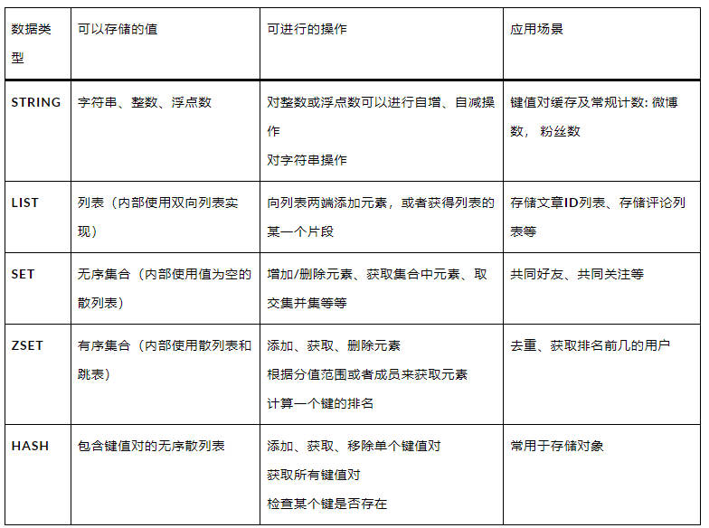

`持续更新中...`

<!-- more -->

1. 什么是Redis？
    

    
Ans

    Redis是一个高性能的非关系型的键值对数据库，使用C编写实现的。于传统的数据库不同的是Redis是存在内存中的，所以读写速度非常快，每秒可以处理超过10万次读写操作，这也是Redis被广泛用于缓存、消息队列、分布式锁等场景的原因。
    

2. Redis的优缺点？
    

    
Ans

    优点:
    <ul>
        <li>读写性能好，读的速度可达110000次/s，写的速度可达81000次/s。</li>
        <li>支持数据持久化，有AOF和RDB两种持久化方式。</li>
        <li>数据结构丰富，支持String，List, Set, Hash等结构。</li>
        <li>支持事务，Redis所有的操作都是原子性的，并且还支持几个操作合并后的原子性执行，原子性指操作要么成功执行，要么失败不执行，不会执行一部分。</li>
        <li>支持主从复制，主机可以自动将数据同步到从机，进行读写分离。</li>
    </ul>
    缺点：
    <ul>
        <li>因为Redis是将数据存到内存中的，所以会收到内存大小的限制，不能用作海量数据的读写。</li>
        <li>Redis不具备自动容错和恢复功能，主机或从机宕机会导致前端部分读写请求失败，需要重启机器或者手动切换前端的IP才能切换。</li>
    </ul>
    

3. Redis为什么常常用作缓存？相比于guava有什么优势？
    

    
缓存的定义是访问速度比一般随机存取存储器快的一种高速存储器，而因为Redis是基于内存提供了高性能的数据存取功能，其比较显著的优势就是非常地快。

    
缓存可以分为本地缓存或者分布式缓存，比较常用的guava缓存就是一种本地缓存，其主要特点是轻量并且快速，生命周期随着JVM的销毁而结束，缺点是在多实例的情况下，每个实例都要自己保存一份缓存，这样会导致缓存的一致性出现问题。

    
Redis则是分布式缓存，在多实例情况下，每个实例都共享一份缓存数据，缓存具备一致性。缺点要保持Redis的高可用整体架构会比较复杂。

    

4. Redis和Memcached的区别于相同点？
    

    
Ans

    相同点：
    <ul>
        <li>两者的读写性能都比较高</li>
        <li>都是基于内存的数据库，通常被当作缓存使用</li>
        <li>都有过期策略</li>
        <li>都是基于C语言实现</li>
    </ul>
    不同点：
        
    

5. Redis 是单线程还是多线程？Redis 为什么这么快？
    

    
Ans

    Redis6.0之前是单线程的，Redis6.0之后引入了多线程，但是默认情况下是关闭的，需要手动开启。

    Redis之所以这么快，主要原因是：
    <ul>
        <li>运行在内存中，内存的读写速度非常快</li>
        <li>基于C语言实现，C语言在内存操作方面性能高</li>
        <li>数据结构简单，操作简单</li>
        <li>使用IO多路复用技术，非阻塞IO</li>
        <li>单线程避免了多线程的上下文切换开销</li>
    </ul>
    

6. Redis6.0之后为什么引入了多线程？
    

    
Ans

    Redis6.0之前是单线程的，但是随着互联网的快速发展，Redis的QPS已经无法满足互联网的需求，所以Redis6.0之后引入了多线程，但是默认情况下是关闭的，需要手动开启。

    Redis6.0引入多线程主要是为了提高网络IO的读写性能，因为Redis的瓶颈主要在于网络IO，而非CPU，执行命令还是单线程执行的，所以也不存在线程安全的问题。
    

7. Redis的持久化方式有哪些？有什么区别？
    

    
Ans

    Redis的持久化方式有两种：RDB和AOF。

    RDB是Redis默认的持久化方式，在指定的时间间隔内，将内存中的数据集快照写入磁盘，也就是Snapshot快照，它恢复时是将快照文件直接读到内存中。

    AOF则是将Redis的操作日志以追加的方式写入文件中，恢复时是将文件中的命令重新执行一遍。

    两者之间的区别：
    <ul>
        <li>RDB持久化方式是在指定的时间间隔内将内存中的数据集快照写入磁盘，而AOF持久化方式则是将Redis的操作日志以追加的方式写入文件中。</li>
        <li>RDB持久化方式在恢复时是将快照文件直接读到内存中，而AOF持久化方式则是将文件中的命令重新执行一遍。</li>
        <li>RDB持久化方式在内存中生成快照，而AOF持久化方式则是将操作日志写入文件中。</li>
        <li>RDB持久化方式在恢复时速度较快，而AOF持久化方式在恢复时速度较慢。</li>
    </ul>
    

8. Redis的数据类型有哪些？
    

    
Ans

    Redis支持五种数据类型：String（字符串），Hash（哈希），List（列表），Set（集合）和Zset（有序集合）。还有三种不那么常见的数据类型：HyperLogLog（基数统计），Bitmap（位图）和Stream（流）。
    
    
Bitmap: 位图，是一个以位为单位的数组，数组中只能存储1或0，数组的下标再Bitmap中叫做偏移量。Bitmap实现统计功能，更省空间。布隆过滤器就有用到这种数据结构，布隆过滤器可以判断出哪些数据一定不在数据库中，所以常被用来解决Redis缓存穿透问题。

    
Hyperloglog: HyperLogLog 是一种用于统计基数的数据集合类型，每个 HyperLogLog 键只需要花费12KB内存，接口已计算接近2^64个不同元素的基数。HyperLogLog 的优点是，在输入元素的数量或者体积非常大时，计算基数所需的空间总是固定的，并且时很小的。缺点是 HyperLogLog 的统计规则是基于概率完成的，所以它给出的统计结果是有一定误差的，标准误算率是0.81%。常见的应用场景：统计网站的UV。

    
Geospatial: 主要用于存储地理位置信息，常用于定位附近的人，打车距离的计算等。

    

9. Redis的数据结构有哪些？
    

    
Ans

    Redis的数据结构有简单动态字符串、链表、字典、跳跃表、整数集合、压缩列表等。
    <ul>
        <li>简单动态字符串：
            
Redis的底层是用C语言编写，但Redis并没有直接使用C语言传统的字符串表示，而是构建了一种名为简单动态字符串的抽象类型。

        </li>
        <li>链表：
            
链表提供了高效的节点重拍能力，以及顺序性的节点访问方式，并且可以通过增删改节点来灵活地调整链表的长度。链表是列表的底层实现之一。

        </li>
        <li>字典：
            
字典，又称为符号表(symbol table)、关联数组(associative array)或映射(map),是一种用于保存键值对(key-value pair)的抽象数据结构。字典在Redis中的应用相当广泛，比如Redis的数据库就是使用字典来作为底层实现的，对数据的增删改查操作也是构建在对字典的操作之上的。

        </li>
        <li>整数集合：
            
整数集合(int set)是集合键的底层实现之一，当一个集合只包含整数值元素，并且这个集合的元素数量不多时，Redis就会使用整数集合作为集合键的底层实现。

        </li>
        <li>压缩列表(ziplist)：
            
压缩列表是Redis为了节约内存而开发的，是由一系列特殊编码的连续内存块组成的顺序型(sequential)数据结构。一个压缩列表可以包含任意多个节点，每个节点可以保存一个字节数组或者一个整数值。

        </li>
        <li>对象:
            
Redis并没有直接使用这些数据结构来实现键值对数据库，而是基于这些数据结构创建了一个对象系统，这个系统包含了字符串对象、列表对象、哈希对象、集合对象和有序集合对象这五种类型的对象，每种对象都用到了至少一种数据结构。

            
针对不同的场景，为对象设置多种不同的数据结构实现，从而优化对象在不同场景下的使用效率。

            
实现了基于引用计数计数的内存回收机制，当程序不再使用某个对象的时候，这个对象所占用的内存就会被自动释放。

            
Redis还通过引用计数技术实现了对象共享机制，这一机制可以在适当的条件下，通过让多个数据库键共享同一个对象来节约内存。

        </li>
        <li>跳跃表：
            
跳跃表(skiplist)是一种有序数据结构，它通过在每个节点中维持多个指向其他节点的指针，从而达到快速访问节点的目的。跳跃表支持平均O(logN)、最坏O(n)复杂度的节点查找，还可以通过顺序性操作来批量处理节点。跳跃表是有序集合键的底层实现之一。

            
和链表、字典等数据结构被广泛地应用在Redis内部不同，Redis只在两个地方用到了跳跃表，一个是实现有序集合键，另一个是在集群节点中用作内部数据结构。

            
跳跃表本质上采用的是一种空间换时间的策略，是一种可以进行二分查找的有序链表，跳表在原有的有序链表上增加了多级索引，通过索引来实现快速查询。跳表不仅能提高搜索性能，同时也可以提高插入和删除的性能。

            

        </li>
        <li>Redis跳跃表和普通的跳跃表有什么区别？
            
1. Redis中跳跃表分数(score)允许重复，即跳跃表的key允许重复，如果分数重复，还需要根据数据内容来进行字段排序。普通的跳跃表是不支持的。

            
2. 第一层链表不是一个单向链表，而是一个双向链表。这是为了方便以倒序方式获取一个范围内的元素。

            
3. 在Redis的跳跃表中可以很方便地计算出每个元素的排名。

        </li>
    </ul>
    

10. Redis的应用场景有哪些?
    

    
Ans

    
缓存：Redis基于内存，读写速度非常快，并且有键过期功能和键淘汰策略，可以作为缓存使用。

    
排行榜：Redis提供的有序集合可以很方便地实现排行榜。

    
分布式锁：Redis的setnx功能来实现分布式的锁。

    
社交功能: 实现公共好友、共同关注等

    
计数器：通过String进行自增自减实现计数功能

    
消息队列：Redis提供了发布、订阅、阻塞队列等功能，可以实现一个简单的消息队列。

    

11. Redis是单线程的，如何提高CPU的利用率？
    

    
Ans

    
Redis是基于内存的操作，CPU不是Redis的瓶颈，Redis的瓶颈最有可能是机器内存的大小或者网络带宽。既然单线程容易实现，而且CPU不会成为瓶颈，那就顺理成章地采用单线程的方案了。
    

    
可以在一个服务器上部署多个Redis实例，把他们当作不同的服务器使用。

    

12. Redis键的过期删除策略
    

    
Ans

    
Redis的过期删除策略有三种：定时删除、惰性删除和定期删除。

    
定时删除：在设置键的过期时间的同时，创建一个定时器，让定时器在键过期时间来临时，立即执行对键的删除操作。

    
惰性删除：放任键过期不管，但是每次从键空间获取键时，都检查键是否过期，如果过期的话，就删除该键；如果没有过期，就返回该键。

    
定期删除：每隔一段时间，程序就对数据库进行一次检查，删除里面的过期键。至于要删除多少过期键，以及要检查多少个数据库，则由算法决定。

    

13. Redis的内存淘汰机制是什么样的？
    

    
Ans

    
Redis是基于内存的，所以容量肯定是有限的，有效的内存淘汰机制对Redis是非常重要的。

    
当存入的数据超过Redis最大允许内存后，会触发Redis的内存淘汰策略。在Redis4.0前有6种淘汰策略。

    <ul>
        <li>volatile-lru: 当Redis内存不足时，会在设置了过期时间的键中使用LRU算法移除哪些最少使用的键。</li>
        <li>volatile-ttl: 从设置了过期时间的键中移除将要过期的。</li>
        <li>volatile-random: 从设置了过期时间的键中随机淘汰一些</li>
        <li>allkeys-lru: 当内存空间不足时，根据LRU算法移除一些建</li>
        <li>allkeys-random: 当内存空间不足时，随机移除某些键</li>
        <li>noeviction: 当内存空间不足时，新的写入操作会报错</li>
    </ul>
    
前面三个是在设置了过期时间的键的空间进行移除，后三个是在全局的空间进行移除。

    
在Redis4.0 后增加两个

    
1. volatile-lfu: 从设置过期时间的键中移除一些最不经常使用的键(LFU算法: Least Frequently Used)

    
2. allkeys-lfu: 当内存不足时，从所有的键中移除一些最不经常使用的键。

    

14. 什么是Redis的持久化？
    

    
Ans

    
Redis是一种内存数据库，数据保存在内存中，如果断电或者重启，内存中的数据就会丢失，所以Redis提供了持久化功能。

    
Redis提供了两种持久化机制，分别是RDB(Redis Database)和AOF(Append Only File)。

    

15. Redis的RDB持久化机制
    

    
Ans

    
RDB是redis默认的持久化方式，按照一定的时间间隔将内存的数据以快照的形式保存到硬盘，恢复时是将快照读取到内存中。RDB持久化实际操作过程是fork一个子进程，先将数据集写入临时文件，写入成功后，再替换之前的文件，用二进制压缩存储。

    
优点：

    <ul>
        <li>适合对大规模的数据恢复，比AOF的启动效率高</li>
        <li>只有一个dump.rdb，方便持久化</li>
        <li>性能最大化，在开始持久化时，它唯一需要做的只是fork出子进程，之后再由子进程完成这些持久化的工作，这样就可以极大的避免服务进程进行IO操作了。</li>
    </ul>

    
缺点：

    <ul>
        <li>数据安全性低，在一定间隔时间内做一次备份，如果Redis突然宕机，会丢失最后一次快照的修改。</li>
        <li>由于RDB是通过fork子进程来协助完成数据持久化工作的，因此当数据集较大时，可能会导致整个服务器停止服务几百毫秒，甚至是1秒钟。</li>
    </ul>

    

16. Redis的AOF持久化机制
    

    
Ans

    
AOF持久化以日志的形式记录服务器所处理的每一个写、删除操作，查询操作不会记录，可以打开文件看到详细的操作记录。

    
优点：

    <ul>
        <li>具备更高的安全性，Redis提供了3种同步策略，分别是每秒同步、每修改同步和不同步。相比RDB突然宕机丢失的数据会更少，每秒同步会丢失一秒钟的数据。</li>
        <li>由于该机制对日志文件的写入操作采用的是append模式，因此在写入过程中即使出现宕机现象，也不会破坏日志文件中已经存在的内容。</li>
        <li>AOF包含一个格式清晰、易于理解的日志文件用于记录所有的修改操作，可以通过该文件完成数据的重建。</li>
    </ul>
    
缺点：

    <ul>
        <li>对于相同数量的数据集而言，AOF通常要大于RDB文件。RDB在恢复大数据集时的速度比AOF的恢复速度要快。</li>
        <li>根据AOF选择同步策略的不同，效率也不同，但AOF在运行效率上往往会慢于RDB。</li>
    </ul>

    

17. 什么是Redis的发布订阅？
    

    
Ans

    
Redis的事务时一个单独的隔离操作，事务中所有命令都会序列化、按顺序地执行。事务在执行的过程中，不会被其他客户端发送来的命令请求所打断，所以Redis事务时在一个队列中，一次性、顺序性、排他性执行一系列命令。

    
Redis事务的主要作用就是串联多个命令防止别的命令插队。

    

18. Redis事务的相关命令
    

    
Ans

    
Redis事务的相关命令有：multi、exec、discard、watch、unwatch。

    
multi：开启一个事务，将多个命令放入队列中。

    
exec：执行事务队列中的命令。

    
discard：取消事务，清空事务队列。

    
watch：监视一个或多个键，如果在事务执行之前被修改，事务将被打断。

    
unwatch：取消watch命令对所有键的监视。

    

19. Redis事务的特性，Redis事务执行的三个阶段
    

    
Ans

    
Redis事务的特性：

    <ul>
        <li>Redis事务不保证原子性，单条的Redis命令是原子性的，但事务不能保证原子性。</li>
        <li>Redis事务是有隔离性的，但没有隔离级别，事务中的所有命令都会序列化、按顺序执行。事务在执行的过程中，不会被其他客户端发送来的命令请求所打断。</li>
        <li>Redis事务不支持回滚，Redis执行过程中的命令执行失败，其他命令仍然可以执行。</li>
    </ul>
    
Redis事务执行的三个阶段：

    <ol>
        <li>开启事务：使用multi命令开启一个事务。</li>
        <li>命令入队：在开启事务后，客户端发送的命令都会被放入一个队列中，并不会立即执行。</li>
        <li>执行事务：使用exec命令执行事务队列中的命令。</li>
    </ol>
    

20. Redis事务为什么不支持回滚？
    

    
Ans

    
Redis事务不支持回滚，主要是因为Redis的设计者认为回滚会降低Redis的性能，并且Redis事务的错误处理机制可以保证数据的一致性。

    
Redis事务的错误处理机制：

    <ul>
        <li>语法错误：在开启事务后，如果事务队列中的命令存在语法错误，那么事务中的所有命令都不会被执行。</li>
        <li>运行时错误：在开启事务后，如果事务队列中的命令在执行时出现运行时错误，那么只有出现错误的命令不会被执行，其他命令仍然会执行。</li>
    </ul>
    因为不需要回滚，所以Redis内部实现简单并高效。(在Redis为什么是单线程而不是多线程也用了这个思想，实现简单并高效。)
    

21. Redis集群的实现方案有哪些？
    

    
Ans

    
Redis单机版有以下缺点：

    
1. 不能保证数据的可靠性，服务部署在一台服务器上，一旦服务器宕机服务就不可用。

    
2. 性能瓶颈，内存容量有限，处理能力有限。

    
Redis集群主要有以下几种方案:

    
Redis主从模式

    <ul>
        
Redis主从模式通过将数据复制到多个节点上，实现了数据的冗余，提高了数据的可靠性。主节点负责处理写操作，从节点负责处理读操作，通过读写分离，提高了Redis的性能。

    </ul>
    
Redis哨兵模式

    <ul>
        
Redis主从模式虽然解决了数据可靠性问题，但master节点存在单点故障问题，一旦master节点宕机，服务将不可用，为了解决这个问题，Redis提供了哨兵模式，哨兵模式通过监控master节点的状态，当master节点宕机时，哨兵会自动将从节点提升为master节点，保证服务的高可用。

    </ul>
    
Redis自研

    <ul>
     
哨兵模式虽然解决了主从模式存在的一些问题，但其本身也存在一些弊端，比如数据在每个Redis实例中都是全量存储，极大地浪费了资源，为了解决这个问题，Redis提供了Redis Cluster，实现了数据分片存储，但Redis提供Redis Cluster之前，很多公司为了解决哨兵模式存在的问题，分别自行研发Redis集群方案。

    </ul>
    
Redis Cluster

    <ul>
        
Redis Cluster是Redis官方提供的集群方案，在Redis 3.0版本正式推出，Redis Cluster采用无中心结构，每个节点保存数据和整个集群状态，每个节点都和其他所有节点连接。Redis Cluster集群主要解决以下问题：

        
1. 数据分片：Redis Cluster采用虚拟槽分区，所有的键根据哈希函数映射到0~16383个整数槽内，每个节点负责维护一部分槽以及槽所映射的键值数据。

        
2. 高可用：Redis Cluster采用主从复制模式，每个主节点都有一个或多个从节点，当主节点故障时，从节点会自动接管主节点，保证集群的高可用。

        
3. 高性能：Redis Cluster采用无中心结构，每个节点都和其他所有节点连接，数据读写可以在任意节点进行，大大提高了集群的性能。

    </ul>
    

23. Redis 主从架构中数据丢失么
    

    
Ans

    
Redis主从架构丢失主要有两种情况：

    
1. 异步复制同步丢失

    
2. 集群产生脑裂数据丢失

    
异步复制同步丢失：

    <ul>
        
Redis主节点和从节点之间的复制是异步的，当主节点的数据未完全复制到从节点就发生宕机了，master内存中的数据会丢失。

        
如果主节点开启持久化是否可以解决这个问题么？

        
答案是否定的，在master 发生宕机后，sentinel集群检测到主节点发生故障，重新选举新的主节点，如果旧的主节点在故障恢复后重启，那么此时它需要同步新主节点的数据，此时新的主节点的数据都是空的（假设这段时间中没有数据写入）。那么旧主机点中的数据就会被刷新掉，此时数据还是会丢失。

    </ul>
    
集群产生脑裂：

    <ul>
        
简单来说，集群脑裂是指一个集群中有多少主节点，像一个人有两个大脑，到底听谁的？

        
例如，由于网络原因，集群出现分区，master与slave节点之间断开了联系，哨兵检测后认为主节点故障，重新选举从节点未主节点，但主节点可能并没有发生故障。此时客户端依然在旧的主节点上写数据，而新的主节点中没有数据，在发现这个问题之后，旧的主节点会被降为slave，并且开始同步新的master数据，那么之前的写入旧的主节点的数据被刷新掉，大量数据丢失。

        

    </ul>

    

22. 如何解决Redis主从架构中数据丢失的问题？
    

    
Ans

    
在Redis的配置文件中，有两个参数如下：

    <code>min-slaves-to-write 1</code>

    <code>min-slaves-max-lag 10</code>

     其中，min-slaves-to-write 默认情况下是0，min-slaves-max-lag 默认情况下是10。

     上述参数表示至少有1个slave的与master的同步复制延迟不能超过10s，一旦所有的slave复制和同步的延迟达到了10s，那么此时master就不会接受任何请求。

     通过降低min-slaves-max-lag参数的值，可以避免在发生故障时大量的数据丢失，一旦发现延迟超过了该值就不会往master中写入数据。

     这种解决数据丢失的方法时降低系统的可用性来实现的。
    

23. Redis 集群的主从复制过程是什么样的？
    

    
Ans

    
主从复制主要有以下几步：

    <ol>
        <li>设置服务器的地址和端口号</li>
        <li>建立套接字连接（建立主从服务器之间的连接）</li>
        <li>发送PING命令（校验套接字是否可用）</li>
        <li>身份验证</li>
        <li>同步（从主库向从库同步数据，分为全量复制和部分复制）</li>
        <li>命令传播（经过上面同步操作，此时主从的数据库状态其实已经一致了，主服务器马上就接受到了新的写命令，执行完该命令后，主从的数据库状态又不一致。数据同步阶段完成后，主从节点进入命令传播阶段；在这个阶段主节点将自己执行的写命令发送给从节点，从节点接收命令并执行，从而保证主从节点数据的一致性。）</li>
    </ol>
    
在Redis2.8以前，从节点向主节点发送sync命令请求同步数据，此时的同步方式是全量复制；在Redis2.8及以后，从节点可以发送psync命令请求同步数据，此时根据主从节点状态的不同，同步方式可能是全量复制或部分复制。

    
全量复制：用于初次复制或其他无法进行部分复制的情况，将主节点中的所有数据都发送给从节点，是一个非常重型的操作。

    
部分复制：用于网络中断等情况后的复制，只将中断期间主节点执行的写命令发送给从节点，与全量复制相比更加高效。需要注意的是，如果网络中断的时间过长，导致主节点没有能够完整地保存中断期间执行的写命令，则无法进行部分复制，仍使用全量复制。

    

24. Redis 是如何保证主从服务器一致处于连接状态以及命令是否丢失？
    

    
Ans

    命令传播阶段，从服务器会利用心跳检测机制定时的向主服务发送消息。
    

25. 因为网络原因在主从复制过程中停止复制会怎么样？
    

    
Ans

    如果出现网络问题断开，会自动重连，并且支持断点续传，接着上次复制的地方继续复制，而不是重新复制一份。
    

26. Redis集群最大的节点个数是多少？为什么？
    

    
Ans

    
Redis集群中最大的节点个数是16384个，这是由哈希槽决定的。

    
在redis节点发送心跳包时需要把所有的槽放到这个心跳包里，以便让节点知道当前集群信息，16384=16k,在发送心跳包时使用char进行bitmap压缩后时2k(2*8(8 bit)*1024(1k)=16k),也就是说使用2k的空间创建了16k的槽数。虽然使用CRC16算法最多可以分配65535(2^16-1)个槽位，65535=65k,压缩后就是8k(8*8(8 bit)*1024(1k) = 65k), 也就是说需要8k的心跳包。

    

    

27. Redis集群是如何选择数据库的？
    

    
Ans

    Redis 集群目前无法做数据库选择，默认在0数据库。
    

28. Redis高可用方案如何实现？
    

    
Ans

    
Redis 常见的高可用方案有以下几种：

    
1. 数据持久化

    
2. 主从模式

    
3. Redis 哨兵模式

    
4. Redis 集群(自研及Redis Cluster)

    

29. Redis分区的作用是什么？Redis分区有哪些实现方案？
    

    
Ans

    
Redis分区的作用是什么？

    <ol>
        <li>扩展数据库容量，可以利用多台机器的内存构建更大的数据库。</li>
        <li>扩展计算能力，分区可以在多核和多计算机之间弹性扩展计算力，在多计算机和网络适配器之间弹性扩展网络带宽</li>
    </ol>
    
Redis分区有哪些实现方案？

    <ol>
        <li>客户端分区：客户端决定数据被存到哪个Redis节点或者从哪个节点读取。</li>
        <li>代理分区：客户端将请求发送到代理，而不是直接发送到Redis节点，代理根据分区策略将请求发送到Redis节点上。</li>
        <li>查询路由：客户端随机请求任意一个Redis节点，这个Redis将请求转发到正确的Redis节点。Redis Cluster 实现了一种混合形式的查询路由,并不是直接将请求从一个Redis节点转发到另一个Redis节点，而是在客户端的帮助下直接重定向到正确的Redis节点。</li>
    </ol>
    

30. Redis分区的缺点？
    

    
Ans

    
Redis分区有以下缺点：

    <ol>
        <li>不支持多个键的操作，例如不能操作映射在两个Redis实例上的两个集合的交叉集。</li>
        <li>Redis不支持多个键的事务。</li>
        <li>Redis是以键来分区，因此不能使用单个大键对数据集进行分片，例如一个非常大的有序集。</li>
        <li>数据的处理会变得复杂，比如你必须处理多个RDB和AOF文件，在多个实例和主机之间持久化你的数据。</li>
        <li>添加和删除节点也会变得复杂，例如通过在运行时添加和删除节点，Redis集群通常支持透明地再均衡数据，但是其他系统像客户端分区或者代理分区就不支持该特性。</li>
    </ol>

31. 什么是分布式锁？
    

    
Ans

    
分布式锁是控制分布式系统之间同步访问共享资源的一种方式。

    
例如多实例 操作同一资源需要加锁，否则就会导致异常情况发生。

    

32. 分布式锁具备哪些特性？
    

    
Ans

    
分布式锁具备以下特性：

    <ol>
        <li>互斥性：在任意时刻，同一条数据只能被一台机器上的一个线程执行。</li>
        <li>高可用性：在部分节点宕机后，客户端仍可以正常地获取锁和释放锁。</li>
        <li>独占性：加锁和解锁必须同一台服务器执行，不能再一个服务器上加锁，在另一个服务器上释放锁。</li>
        <li>防锁超时: 如果客户端没有主动释放锁，服务器会在一定时间后自动释放锁，防止客户端宕机或者网络异常导致宕机。</li>
    </ol>
    

33. 分布式锁的实现方法？
    

    
Ans

    
思路是要在整个系统中提供一个全局，唯一的获取锁的东西，然后每个系统在需要加锁时，都去问这个东西拿到一把锁，这样不同的系统拿到的就可以认为时同一把锁。

    
分布式锁的实现方法有以下几种：

    <ol>
        <li>基于关系型数据库实现分布式锁</li>
        
优点，直接借助数据库容易理解

        缺点，在使用关系型数据库实现分布式锁的过程中会出现各种问题，例如数据库单点问题和可重入问题，并且在解决过程中会使得整个方案越来越复杂。
        <li>基于Redis实现分布式锁
        
优点，性能好，实现起来较为方便

        缺点，key的过期时间设置难以确定，如果设置过短，锁提前过期，如果设置过长，锁过期，其他线程无法获取锁，导致死锁。
        
&nbsp&nbsp&nbsp&nbsp&nbsp&nbsp&nbsp&nbsp&nbsp&nbsp&nbspRedis的集群虽然能解决单点问题，但是并不是强一致性的，锁的不够健壮。

        </li>
        <li>基于Zookeeper实现分布式锁
        
优点，有效地解决单点问题，不可重入问题，非阻塞问题以及锁无法释放的问题，实现起来较为简单。

        
缺点，性能上不如使用缓存实现分布式锁

        </li>
    </ol>

    <a href="https://segmentfault.com/a/1190000041172633">Redis 分布式锁正确实现原理演化历程与Redission 实战总结</a>
    

34. Redis并发竞争key问题应该如何解决？
    

    
Ans

    
Redis 并发竞争key就是多个客户端操作一个key，可能导致数据出现问题。

    
解决方法：

    <ol>
        <li>乐观锁，watch 命令可以方便的实现乐观锁。watch 命令会监视给定的每一个key,当exec时如果监视的任意一个key自从调用watch后发生变化，则整个事务回滚，不执行任何操作。不能再分片集群中使用。</li>
        <li>分布式锁，适合分布式场景。</li>
        <li>时间戳，适合有序场景，比如A想把key设置1，B想把key设置为3，对每个操作加上时间戳，写入前先比较自己的时间戳是不是早于现有记录的时间戳，如果早于，就不写入了。</li>
        <li>消息队列，串行化处理。</li>
    </ol>
    

35. 缓存雪崩，缓存穿透，缓存击穿，及解决方案
    

    
Ans

    
缓存的作用是减轻数据库的压力，提升系统的性能，无论是缓存雪崩，缓存击穿还是缓存穿透都是缓存失效了导致数据库压力过大。

    
缓存雪崩？

    缓存雪崩是指在某一时刻出现大规模的缓存失效的情况，大量的请求直接打在数据库上面，可能导致数据库宕机，如果这时重启数据库并不能解决根本问题，会再次造成缓存雪崩。
    
原因：

    <ol>
        <li>Redis 宕机了</li>
        <li>很多key采取了相同的过期时间</li>
    </ol>
    
解决方案:

    <ol>
        <li>为避免Redis宕机造成缓存雪崩，可以搭建Redis集群</li>
        <li>尽量不要设置相同的过期时间，例如可以在原有的过期时间加上随机数</li>
        <li>服务降级，当流量到达一定的阈值时，就直接返回“系统繁忙”之类的提示，防止过多的请求打在数据库上，这样虽然很难用，但至少可以使用，避免直接把数据库搞挂，没有解决根本问题，算是临时方案。</li>
    </ol>
    

    
缓存击穿？

    缓存雪崩是大规模的key失效，而缓存击穿是一个热点的key，有大并发集中对其他进行访问，突然间这个Key失效了，导致大并发全部打在数据库基础上，导致数据库压力剧增，这种现象就叫做缓存击穿。
    
比较经典的例子是商品秒杀时，大量的用户在抢某个商品时，商品的key突然过期失效了，所有的请求都到数据库上了。

    如何解决缓存击穿：
    <ol>
        <li>热点key不设置过期时间，避免key过期失效</li>
        <li>加锁，如果缓存失效的情况，只能拿到锁才能查询数据库，降低了在同一时刻打在数据库上的请求，防止数据库宕机，不过这样会导致系统的性能变差。</li>
    </ol>
    

    
缓存穿透？

    缓存穿透是指用户的请求没有经过缓存而直接请求到数据库上，比如用于请求的key在Redis不存在，或者用户恶意伪造大量不存在的key进行请求，都可以绕过缓存,导致数据库压力太大挂掉。
    
如何解决缓存穿透：

    <ol>
        <li>参数校验，例如可以对用户id进行校验，直接拦截不合法的用户的请求</li>
        <li>布隆过滤器，布隆过滤器可以判断这个key不在数据库中，特点是如果判断这个key不在数据库中，那么这个key一定不在数据库中，如果判断这个key在数据库中，也不能保证这个key一定在数据库中。就是会有少数的漏网之鱼，造成这种现象的原因是因为布隆过滤器使用了hash算法,对key进行hash时，不同的key的hash值一定不同，但相同的hash的值不能说明这两个key相同。
        
布隆过滤器底层使用bit数组存储数据，该数组中的元素默认值是0.

        
布隆过滤器第一次初始化的时候，会把数据库中所有已存在的key，经过一系列hash算法计算，算出每个key的位置，并将该位置的值置为1，为了减少哈希冲突的影响，可以对每个key进行多次hash计算。

        
布隆过滤器存在误判的情况，布隆过滤器不支持删除，因为布隆过滤器中存的1可能设计多个key，直接删除可能会影响到其他key。

        </li>
    </ol>

    

37. 如何保证缓存与数据库双写时的数据一致性？
    

    
Ans

    <ul>
        <li>强一致性：当更新操作完成之后，任何多个后续进程或线程的访问都会返回最新的更新过的值。强一致性对用户比较友好，但对系统性能影响比较大。</li>
        <li>弱一致性：系统并不能保证后续进程或者线程的访问都会返回最新的更新过的值。</li>
        <li>最终一致性：也是弱一致性的一种特殊形式，系统保证在没有后续更新的前提下，系统最终返回上一次更新操作的值。</li>
    </ul>
    
缓存与数据库双写时的数据一致性，主要是指缓存与数据库中的数据不一致。

    
如何保证缓存与数据库双写时的数据一致性：

    <ol>
        <li>先更新数据库，再更新缓存</li>
        <li>先删除缓存，再更新数据库</li>
        <li>先更新数据库，再删除缓存
            
1.更新数据库 2.拉取binlog日志 3.删除缓存 4.将删除的Key放到MQ中 5.拉取队列中的数据 6.重新删除

        </li>
        <li>先删除缓存，再更新数据库，再删除缓存
            
延迟双删，延迟时间要大于主从复制的时间。

        </li>
    </ol>
    

38. 一个字符串类型的值能存储的最大容量是多少？
    

    
Ans

    
Redis中，字符串类型最大可以存储512MB的数据。

    

39. Redis如何实现大量数据插入？
    

    
Ans

    <ul>
        <li>使用管道，管道是Redis提供的一种机制，可以在一个命令序列中一次性发送多个命令，然后一次性读取所有命令的响应。这样可以减少网络往返次数，显著提高插入效率。</li>
        <li>使用Redis的批量插入命令，Redis提供了一些批量操作命令，如MSET，可以一次性插入多个键值对。</li>
        <li>使用Redis的批量插入工具</li>
        <li>使用Lua脚本</li>
    </ul>
    

40. 如何通过Redis实现异步队列？
    

    
Ans

    
第一种是使用List作为队列，通过RPUSH生产消息，LPOP消费消息。

    
存在的问题：如果队列是空的，客户端会不停的POP，陷入死循环。

    解决方法：
    <ul>
        <li>当lpop没有消息时，可以使用sleep机制先休眠一段时间，然后再检查有没有消息。</li>
        <li>可以使用blpop命令，在队列没有数据的时候，会立即进入休眠状态，一旦数据到来，则立刻醒过来。这种做法的缺点是只能提供一个消费者消费。</li>
    </ul>
    
第二种方法是pub/sub主题订阅模式，发送者pub消息，消费者sub消息。

    
存在的问题：消息的发布是无状态的，无法保证到达，如果订阅者在发送者发布消息时掉线，之后上线也无法接收发布者发送的消息

    解决方法，使用消息队列
    

41. 如何通过Redis实现延迟队列？
    

    
Ans

    
可以通过Redis 的zset命令实现延迟队列，ZSET是Redis的有序集合，通过<code>zadd score1 value1</code> 命令向内存中生产消息，并利用设置好的时间戳作为score进行排序，然后zrangebysocre 查询符合条件的所有待处理任务，循环执行，也可以 <code>zrangebyscore key min max withscores limit 0 1</code>查询最早的一条任务，来进行消费，与当前时间进行判断是否执行任务。

    

42. Redis回收使用什么算法？
    

    
Ans

    
Redis使用LRU（最近最少使用）算法和引用计数法。

    
LRU：淘汰最长时间没有被使用的对象。

    
LFU：淘汰使用次数最少的对象。

    

43. Redis里面有1亿个key，其中有10个key是包含Java，如何将他们全部找出来？
    

    
Ans

    
使用keys命令，时间复杂度是O(n),但是keys命令会阻塞Redis服务器，不建议使用。

    
使用scan命令，scan命令可以分页扫描，不会阻塞Redis服务器。

    

[返回上级](https://feng6917.github.io/language-golang/#面试题)

[Go Learn](https://feng6917.github.io/language-golang/#目录)

---
参考链接如下

- [Redis高频面试题](https://www.mianshi.online/redis-keys.html)
