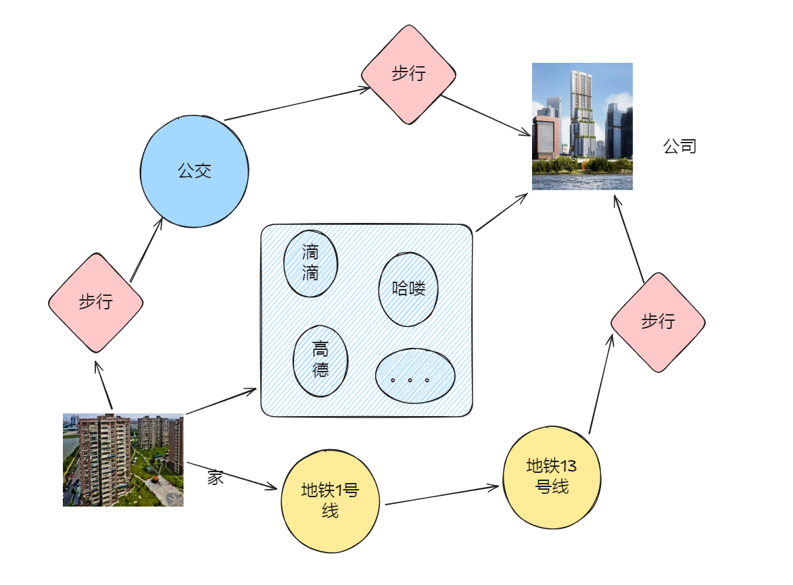
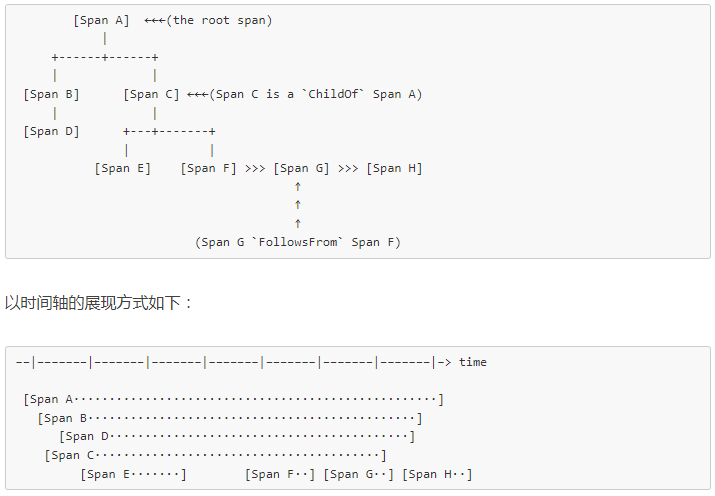

`链路追踪是什么?`

<!-- more -->

### 目录

[带着问题去探索](#带着问题去探索)

- [链路追踪是什么?](#链路追踪是什么)
- [如何实现的?](#如何实现的)
- [实现大体流程?](#实现大体流程)
- [什么时候上报?](#什么时候上报)

[Jaeger 部分参数说明](#jaeger-部分参数了解)

- [Tags](#tags)
- [Logs](#logs)
- [SpanContext](#spancontext)
- [Baggage Items](#baggage-items)
- [References](#references)
- [Trace](#trace)

[上报示例](#上报示例)

- [grpc](#grpc)
- [http](#http)
- [http -> grpc](#http---grpc)

[注意点](#注意点)

- [metadata-发送方及接收使用方式](#metadata-发送方及接收使用方式)
- [创建span实例对象和数据透传](#创建span实例对象和数据透传)
- [跟踪上下文](#跟踪上下文)

---

### 带着问题去探索

##### 链路追踪是什么

  > 链路追踪（Trace）是一种用于监控和诊断分布式系统的方法，它可以帮助你了解请求在系统中的路径，以及每个步骤的执行情况。

  > 分布式系统是建立在网络之上的软件系统，由多个独立的计算机以网络链接组成的服务系统，对用户来说是一个统一的体系。
  >
  > 类比打工族 上班，链路追踪 相当于 对上班过程中，使用了什么交通方式，耗时多少 等进行记录

  

##### 如何实现的？

  > 一个简单实用的分布式链路追踪系统的实现，就是对服务器上每一次请求以及响应收集跟踪标识符(message identifiers)和时间戳(timestamped events)。

- 黑盒方案

    > 假定需要跟踪的除了上述信息之外没有额外的信息，这样使用统计回归技术来推断两者之间的关系。

- 基于标注的方案

    > 依赖于应用程序或中间件明确地标记一个全局ID，从而连接每一条记录和发起者的请求。

- 优缺点

    > 虽然黑盒方案比标注方案更轻便，他们需要更多的数据，以获得足够的精度，因为他们依赖于统计推论。基于标注的方案最主要的缺点是，很明显，需要**代码植入**。在我们的生产环境中，因为所有的应用程序都使用相同的线程模型，控制流和 RPC 系统，我们发现，可以把代码植入限制在一个很小的通用组件库中，从而实现了监测系统的应用对开发人员是有效地透明。

##### 什么时候上报？

  > 可配，以jaeger 为例，在初始化Trace 时 进行响应参数配置。

- Sampler：Sampler 决定了哪些请求会被追踪。Jaeger 提供了多种 Sampler，包括 ConstSampler、ProbabilisticSampler、RateLimitingSampler 等。ConstSampler 会追踪所有的请求，ProbabilisticSampler 会以一定的概率追踪请求，RateLimitingSampler 会以一定的速率追踪请求。
- Reporter：Reporter 决定了追踪数据如何发送。Jaeger 提供了多种 Reporter，包括 ConsoleReporter、RemoteReporter 等。ConsoleReporter 会将追踪数据打印到控制台，RemoteReporter 会将追踪数据发送到远程的 Collector。
  - LogSpans：如果设置为 true，那么追踪数据将被打印到控制台。如果设置为 false，那么追踪数据将被发送到 Collector。
  - LocalAgentHostPort：如果 LogSpans 设置为 false，那么追踪数据将被发送到本地的 Collector。这个选项指定了 Collector 的地址和端口。
  - BufferFlushInterval：这个选项决定了追踪数据被发送到 Collector 的频率。默认值为 1 秒。
  - QueueSize：这个选项决定了追踪数据在发送到 Collector 之前的缓冲区大小。默认值为 1000。
  - MaxPacketSize：这个选项决定了追踪数据包的最大大小。默认值为 4096 字节。

##### 实现大体流程

   1. 创建 Trace：当一个请求到达系统的入口点时，系统会创建一个新的 Trace。Trace 通常由一个唯一的 TraceID 标识。
   2. 创建 Span：在 Trace 的每个步骤中，系统会创建一个新的 Span。Span 通常由一个唯一的 SpanID 标识，并且有一个 ParentID，表示这个 Span 的父 Span。

   3. 记录信息：在 Span 的每个步骤中，系统会记录一些信息，例如，开始时间、结束时间、持续时间、错误信息等。这些信息可以帮助你了解请求在系统中的执行情况。

   4. 发送数据：当请求完成时，系统会将 Trace 的数据发送到追踪系统。追踪系统会将这些数据存储起来，并提供一个 Web 界面来查看追踪数据。

   5. 查看数据：你可以使用追踪系统的 Web 界面来查看 Trace 的数据。你可以查看 Trace 的路径，每个步骤的开始时间、结束时间和持续时间，以及错误信息等。

##### [Top](#目录)

### Jaeger 部分参数了解

##### Tags

> 每个 Span 可以有多个键值 K/V 对形式的 Tags，Tags 是没有时间戳的，支持简单的对 Span 进行注解和补充。Tags 是一个 K/V 类型的键值对，用户可以自定义该标签并保存。主要用于链路追踪结果对查询过滤。如某 Span 是调用 Redis ，而可以设置 `redis` 的标签，这样通过搜索 `redis` 关键字，可以查询出所有相关的 Span 以及 trace；又如 `http.method="GET",http.status_code=200`，其中 key 值必须为字符串，value 必须是字符串，布尔型或者数值型。Span 中的 Tag 仅自己可见，不会随着 SpanContext 传递给后续 Span。

 ```
 span.SetTag("http.method","GET")
 span.SetTag("http.status_code",200)
 ```

##### Logs

> Logs 也是一个 K/V 类型的键值对，与 Tags 不同的是，Logs 还会记录写入 Logs 的时间，因此
Logs 主要用于记录某些事件发生的时间。

```
span.LogFields(
 log.String("database","mysql"),
 log.Int("used_time":5),
 log.Int("start_ts":1596335100),
)
```

> Opentracing 给出了一些惯用的 Tags 和 Logs，[链接](https://github.com/opentracing/specification/blob/master/semantic_conventions.md)

##### SpanContext
>
> 核心字段

> 每个 Span 必须提供方法访问 SpanContext，SpanContext 代表跨越进程边界（在不同的 Span 中传递信息），传递到下级 Span 的状态。SpanContext 携带着一些用于跨服务通信的（跨进程）数据，主要包含：

> 该 Span 的唯一标识信息，如：`span_id`、`trace_id`、`parent_id` 或 `sampled` 等

##### Baggage Items
>
> 为整条追踪连保存跨服务（跨进程）的 K/V 格式的用户自定义数据

> Baggage Items 与 Tags 类似，也是 K/V 键值对。与 tags 不同的是：Baggage Items 的 Key 和 Value 都只能是 string 格式，Baggage items 不仅当前 Span 可见，其会随着 SpanContext 传递给后续所有的子 Span。要小心谨慎的使用 Baggage Items：因为在所有的 Span 中传递这些 Key/Value 会带来不小的网络和 CPU 开销。Baggage 是存储在 SpanContext 中的一个键值对集合。它会在一条追踪链路上的所有 Span 内全局传输，包含这些 Span 对应的 SpanContexts

##### References

> （引用关系）

> Opentracing 定义了两种引用关系: ChildOf 和 FollowFrom，分别来看：

- ChildOf: 父 Span 的执行依赖子 Span 的执行结果时，此时子 Span 对父 Span 的引用关系是 ChildOf。比如对于一次 RPC 调用，服务端的 Span（子 Span）与客户端调用的 Span（父 Span）是 ChildOf 关系。

- FollowFrom：父 Span 的执不依赖子 Span 执行结果时，此时子 Span 对父 Span 的引用关系是 FollowFrom。FollowFrom 常用于异步调用的表示，例如消息队列中 Consumerspan 与 Producerspan 之间的关系。
  
##### Trace

> Trace 表示一次完整的追踪链路，trace 由一个或多个 Span 组成。它表示从头到尾的一个请求的调用链，它的标识符是 traceID。 下图示例表示了一个由 `8` 个 Span 组成的 trace:


> Trace 通常由多个 Span 组成，每个 Span 表示一个步骤。以下是一个 Trace 的基本流程

##### [Top](#目录)

### 上报示例

##### grpc

- server

     ```go
     package main
     
     import (
      "context"
      "fmt"
      "io"
      "log"
      "net"
     
      pb "zhst_self/local/9-6-1/proto" // 导入生成的 gRPC 代码
     
      grpc_middleware "github.com/grpc-ecosystem/go-grpc-middleware"
      "github.com/grpc-ecosystem/grpc-opentracing/go/otgrpc"
      "github.com/opentracing/opentracing-go"
      "github.com/uber/jaeger-client-go"
      jaegercfg "github.com/uber/jaeger-client-go/config"
      "google.golang.org/grpc"
     )
     
     type server struct {
      pb.UnimplementedHelloServiceServer
     }
     
     func (s *server) SayHello(ctx context.Context, in *pb.HelloRequest) (*pb.HelloResponse, error) {
      log.Printf("Received: %v", in.GetName())
      return &pb.HelloResponse{Message: "Hello " + in.GetName()}, nil
     }
     
     func main() {
      lis, err := net.Listen("tcp", ":50051")
      if err != nil {
       log.Fatalf("failed to listen: %v", err)
      }
     
      s := grpc.NewServer(newOpts()...)
      pb.RegisterHelloServiceServer(s, &server{})
      if err := s.Serve(lis); err != nil {
       log.Fatalf("failed to serve: %v", err)
      }
     }
     
     func newOpts() []grpc.ServerOption {
      initJaeger("10.0.0.251:14268", "grpc-server")
      // 拦截器
      var opts []grpc.ServerOption
      opts = append(opts, grpc.UnaryInterceptor(grpc_middleware.ChainUnaryServer(OpentracingGrpcUnaryServerInterceptor())))
      return opts
     }
     
     func initJaeger(addr, service string) io.Closer {
      cfg := jaegercfg.Configuration{
       // 将采样频率设置为 1，每一个 span 都记录，方便查看测试结果
       Sampler: &jaegercfg.SamplerConfig{
        Type:  jaeger.SamplerTypeConst,
        Param: 1,
       },
       Reporter: &jaegercfg.ReporterConfig{
        LogSpans: true,
        // 将 span 发往 jaeger-collector 的服务地址
        CollectorEndpoint: fmt.Sprintf("http://%s/api/traces", addr),
       },
      }
      closer, err := cfg.InitGlobalTracer(service, jaegercfg.Logger(jaeger.StdLogger))
      if err != nil {
       panic(fmt.Sprintf("ERROR: cannot init Jaeger: %v\n", err))
      }
      return closer
     }
     
     // Deprecated: 该方法不允许使用，服务初始化会自动添加
     // OpentracingGrpcUnaryServerInterceptor return opentracing grpc unary server interceptor
     func OpentracingGrpcUnaryServerInterceptor() grpc.UnaryServerInterceptor {
      return otgrpc.OpenTracingServerInterceptor(opentracing.GlobalTracer())
     }
     
     ```

##### [Top](#目录)

- client

     ```go
     package main
     
     import (
      "context"
      "fmt"
      "io"
      "log"
     
      pb "zhst_self/local/9-6-1/proto" // 导入生成的 gRPC 代码
     
      "github.com/grpc-ecosystem/grpc-opentracing/go/otgrpc"
      "github.com/opentracing/opentracing-go"
      "github.com/uber/jaeger-client-go"
      jaegercfg "github.com/uber/jaeger-client-go/config"
      "google.golang.org/grpc"
     )
     
     func main() {
      initJaeger("10.0.0.251:14268", "grpc-client")
     
      /*
       OpenTracingClientInterceptor 是一个 gRPC 客户端拦截器，用于在 gRPC 客户端调用时自动注入和提取 OpenTracing 的上下文信息。它通常用于分布式追踪系统中，以便在跨多个服务调用时跟踪请求的流程。
      */
      conn, err := grpc.Dial("localhost:50051", grpc.WithInsecure(), grpc.WithUnaryInterceptor(otgrpc.OpenTracingClientInterceptor(opentracing.GlobalTracer())))
      if err != nil {
       log.Fatalf("did not connect: %v", err)
      }
      defer conn.Close()
      c := pb.NewHelloServiceClient(conn)
     
      name := "world"
     
      clientSpan, _ := opentracing.StartSpanFromContext(context.Background(), "start SayHello1")
      defer clientSpan.Finish()
     
      r, err := c.SayHello(context.Background(), &pb.HelloRequest{Name: name})
      if err != nil {
       log.Fatalf("could not greet: %v", err)
      }
      log.Printf("Greeting: %s", r.GetMessage())
     
      for {
       select {}
      }
     }
     
     ```

##### [Top](#目录)

##### http

- server

     ```go
     package main
     
     import (
      "fmt"
      "io"
      "net/http"
     
      "github.com/gin-gonic/gin"
      "github.com/opentracing/opentracing-go"
      "github.com/opentracing/opentracing-go/ext"
      "github.com/uber/jaeger-client-go"
      jaegercfg "github.com/uber/jaeger-client-go/config"
     )
     
     func main() {
     
      initJaeger("10.0.0.251:14268", "http-server")
     
      r := gin.Default()
     
      // 插入中间件处理
      r.Use(UseOpenTracing())
     
      r.GET("/Get", func(ctx *gin.Context) {
       fmt.Println("Get Successfully")
       ctx.String(http.StatusOK, "")
      })
      r.Run("0.0.0.0:8081")
     }
     
     func UseOpenTracing() gin.HandlerFunc {
      handler := func(c *gin.Context) {
       spanCtx, _ := opentracing.GlobalTracer().Extract(opentracing.HTTPHeaders,
        opentracing.HTTPHeadersCarrier(c.Request.Header))
       span := opentracing.StartSpan(c.Request.URL.Path, opentracing.FollowsFrom(spanCtx))
       defer span.Finish()
       // 记录 tag
       // 记录请求 Url
       ext.HTTPUrl.Set(span, c.Request.URL.Path)
       // Http Method
       ext.HTTPMethod.Set(span, c.Request.Method)
       // 记录组件名称
       ext.Component.Set(span, "Gin-Http")
       c.Next()
       // 继续设置 tag
       ext.HTTPStatusCode.Set(span, uint16(c.Writer.Status()))
      }
      return handler
     }
     
     ```

##### [Top](#目录)

- client

     ```go
     package main
     
     import (
      "fmt"
      "io"
      "net/http"
     
      "github.com/opentracing/opentracing-go"
      "github.com/opentracing/opentracing-go/ext"
      "github.com/uber/jaeger-client-go"
      jaegercfg "github.com/uber/jaeger-client-go/config"
     )
     
     func main() {
     
      initJaeger("10.0.0.251:14268", "http-client")
     
      get()
     
      for {
       select {}
      }
     }
     
     func get() {
      url := "http://127.0.0.1:8081/Get"
      req, _ := http.NewRequest("GET", url, nil)
     
      span := opentracing.StartSpan("Get Todo")
      defer span.Finish()
      ext.HTTPUrl.Set(span, url)
      ext.HTTPMethod.Set(span, "GET")
      ext.Component.Set(span, "http-client")
     
      opentracing.GlobalTracer().Inject(span.Context(), opentracing.HTTPHeaders, opentracing.HTTPHeadersCarrier(req.Header))
     
      resp, _ := http.DefaultClient.Do(req)
      _ = resp
     }
     ```

##### [Top](#目录)

##### http -> grpc

- server

     > 同grpc server

- client

     ```go
     package main
     
     import (
      "context"
      "fmt"
      "io"
      "log"
     
      pb "zhst_self/local/9-6-1/proto" // 导入生成的 gRPC 代码
     
      "github.com/grpc-ecosystem/grpc-opentracing/go/otgrpc"
      "github.com/opentracing/opentracing-go"
      "github.com/uber/jaeger-client-go"
      jaegercfg "github.com/uber/jaeger-client-go/config"
      "google.golang.org/grpc"
     )
     
     func main() {
     
      initJaeger("10.0.0.251:14268", "http2grpc-http")
     
      get()
     
      for {
       select {}
      }
     }
     
     func get() {
      conn, err := grpc.Dial("127.0.0.1:50051", grpc.WithInsecure(), grpc.WithUnaryInterceptor(otgrpc.OpenTracingClientInterceptor(opentracing.GlobalTracer())))
      if err != nil {
       panic(err)
      }
      defer conn.Close()
     
      cli := pb.NewHelloServiceClient(conn)
     
      name := "world"
     
      span, spanCtx := opentracing.StartSpanFromContext(context.Background(), "say-hello")
      defer span.Finish()
     
      r, err := cli.SayHello(spanCtx, &pb.HelloRequest{Name: name})
      if err != nil {
       log.Fatalf("could not greet: %v", err)
      }
      log.Printf("Greeting: %s", r.GetMessage())
     
     }
     
     ```

##### [Top](#目录)

### 注意点

##### metadata 发送方及接收使用方式

  > 通过 metadata 我们可以将上一个进程中的全局对象透传到下一个被调用的进程。 type MD map[string][]string
  >
- client(发送方):

  ```
  
   //set 数据到 metadata
  
   md := metadata.Pairs("key", "val")
  
   // 新建一个有 metadata 的 context
  
   ctx := metadata.NewOutgoingContext(context.Background(), md)
  
   // 原有ctx 上追加md
  
   ctx := metadata.AppendToOutgoingContext(context.Background(), md)
  ```
  
- server(接收方)：

  ```
  
   //从 Context 中取出 *MD* 对象。
  
   md, ok := metadata.FromIncomingContext(ctx)
  
   if !ok {  
  
       fmt.Printf("get metadata error")
  
   }
  ```

##### 创建span实例对象和数据透传

- 如果没有parentSpan：

    ```
    // 创建Span。
    span := tracer.StartSpan("myspan")
    // 设置Tag。
    clientSpan.SetTag("mytag", "123")
    // 透传traceId。
    tracer.Inject(span.Context(), opentracing.HTTPHeaders, opentracing.HTTPHeadersCarrier(req.Header))
    ...
    defer  span.Finish()
    
    // 创建Span 2
    // span := opentracing.StartSpan()
    span, spanCtx := opentracing.StartSpanFromContext(ctx, "ExportSolutionResult")
    ...
    defer span.Finish()
    
    ```

- 如果有parentSpan：

    ```
    // 从HTTP/RPC对象解析出spanCtx。
    spanCtx, _ := tracer.Extract(opentracing.HTTPHeaders, opentracing.HTTPHeadersCarrier(r.Header))
    span := tracer.StartSpan("myspan", opentracing.ChildOf(spanCtx))
    ...
    defer  span.Finish()
    ```

##### 跟踪上下文

- `Inject(SpanContext,format,carrier)`：Inject 将跟踪上下文放入媒介，来保证跟踪链的连续性，常用于客户端。

- `Extract(format.Carrier)`：一般从媒介（通常是 HTTP 头）获取跟踪上下文，常用于服务端。

##### [Top](#目录)

---
参考链接：
>
> - [GRPC 微服务构建之链路追踪](https://pandaychen.github.io/2020/06/01/GOLANG-TRACING-WITH-ZIPKIN/#:~:text=grpc-serve)
>
> - [可观测链路 OpenTelemetry 版](https://help.aliyun.com/zh/opentelemetry/?spm=a2c4g.11186623.0.0.51131a76Gdu3UJ)
>
> - [Jaeger Client Go 链路追踪|入门详解](https://www.cnblogs.com/whuanle/p/14598049.html)
