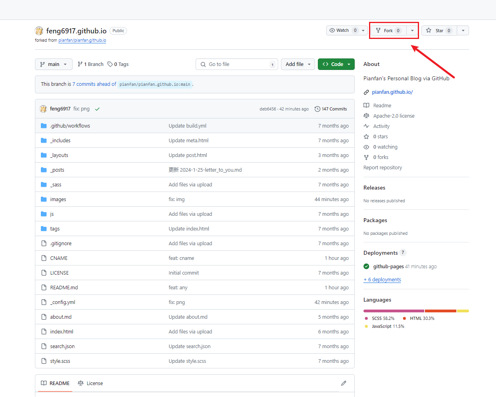

###### 参考链接如下

- <https://pianfan.github.io/>
- <https://thecodedmike.github.io/>

<!-- more -->

### 目录

- [1. fork仓库](#fork仓库)
- [2. 调整仓库配置](#调整仓库配置)
  - [_configyml](#_configyml-调整)
  - [aboutmd](#aboutmd)
  - [readmemd](#readmemd)
  - [git-提交](#git-提交)
- [3. 新建文章示例](#新建文章示例)
  - [常用文件说明](#常用文件说明)
  - [新建文章](#新建文章)

## fork仓库

- 访问 [Fork 地址](https://github.com/feng6917/feng6917.github.io) (前提具有github账号)，点击右上角的 Fork 按钮。
  
- 仓库名修改为自己的 github 账号名
    

## 调整仓库配置

- 克隆fork后仓库代码到本地

  ```
    git clone https://github.com/feng6917/feng6917.github.io.git
  ```

#### _config.yml 调整

  ```
    name: 博客名称 
    description: 博客描述信息
    avatar: 头像图片链接
    favicon: 网站logo链接
    navigation: 可新增删减栏目 相应调整search.json文件
      - name: 归档
        url: /archives
    footer-links: 可新增删减联系方式
      email: 邮箱地址
      github: github地址
    footer-text： 调整为自身账号名称  
  ```

#### about.md

  ```
    关于我，调整为自身描述信息
  ```  

#### README.md

  ```
    修改为自身描述信息
  ```

#### Git 提交

  ```
    git add .
    git commit -m "fix: modify config"
    git push
  ```  

## 新建文章示例

#### 常用文件说明

- _posts

    ```
      是一个常见的文件夹名称，通常用于存放博客文章或网站内容。这个文件夹通常位于一个静态网站或博客系统的根目录下。
    ```

- images

    ```
      图片存储文件夹，用于存储文章图片元数据
    ```

#### 新建文章

  ```
    在_posts文件夹下新建md文件，文件名格式为：年-月-日-文章标题.md
    例如：2024-1-27-搭建github.io记录.md

    ---
    layout: post
    title: "我的第一篇文章"
    date: 2022-01-01
    categories: [博客, 技术]
    ---

    这是我的第一篇文章的内容。

  ```
