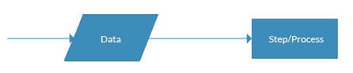
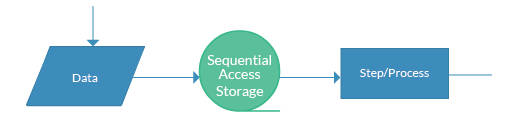

<!-- more -->

### 目录

- [一、UML 用例图](#一uml-用例图)
- [二、流程图](#二流程图)
- [三、时序图](#三时序图)
- [四、绘图软件参考](#四-绘图软件参考)

#### 一、UML 用例图
>
> 用例图（Use Case Diagram）是一种描述系统功能的图，它展示了系统与外部实体之间的交互关系。用例图通常由参与者（Actors）和用例（Use Cases）组成，参与者是系统外部的实体，用例是系统内部的功能模块。用例图可以帮助开发人员理解系统的功能需求，并指导后续的设计和开发工作。

1. 用例图的主要元素包括：

    - 系统（Systems）
      > 系统是待描述的对象，可以是软件系统、硬件系统或任何其他类型的系统。
      

    - 参与者 (Actors)
      > 参与者是系统外部的实体，可以是用户、其他系统或外部设备。参与者与系统进行交互，以实现特定的功能或服务。
      

    - 用例 (Use Cases)
      > 用例是系统内部的功能模块，描述了系统可以执行的操作或服务。用例通常由一组相关的操作组成，可以是一个简单的操作，也可以是一个复杂的操作。
      

    - 关系 (Relationships)
      > 关系描述了参与者与用例之间的关系。常见的用例关系包括关联（Association）、包含（Include）、扩展（Extend）和泛化（Generalization）。
      - 关联
        > 关联表示参与者与用例之间的联系。关联可以是一对一、一对多或多对多的关系。

        

      - 包含
          > 包含表示一个用例包含另一个用例。包含关系表示一个用例需要另一个用例的支持才能完成。
          
      - 扩展
          > 扩展表示一个用例可以扩展另一个用例。扩展关系表示一个用例可以增加额外的功能或服务。
          
      - 泛化
          > 泛化表示一个用例是另一个用例的特例。泛化关系表示一个用例可以继承另一个用例的属性和方法。
          

2. 用户银行转账参考
    

    <a href="#目录" style="text-decoration: none;">Top</a>

#### 二、流程图
  >
  > 流程图（Flowchart）是一种描述系统流程的图，它展示了系统中的各个步骤和流程。流程图通常由节点（Nodes）和箭头（Arrows）组成，节点表示系统的各个步骤，箭头表示流程的流向。流程图可以帮助开发人员理解系统的流程，并指导后续的设计和开发工作。

1. 流程图符号

    > 流程图的符号有很多，包括注释符、卡片、输入输出、数据区、数据库、判定、文件、控制传递等众多类型。

      

2. 常用流程图符号

    - 终端/终结者
        > 终结符显示您的流程开始或结束的位置。 您可以在终结符形状内使用“开始”、“开始”、“结束”等词，以使事情更加明显。

        
    - 流程/矩形
        > 流程图流程形状用于表示流程、操作步骤或操作。 虽然这些是用矩形描绘的，但矩形中的文本主要包括一个动词。 例如，“编辑视频”、“重试”、“选择您的计划”.n'。

        
    - 数据 (I/O)
        > 处理表示流程中的处理操作，表示对数据的处理。处理可以是计算、判断、转换等操作。

        
    - 决定/有条件
        > 决策形状表示为菱形。 此对象始终在流程流中用于提出问题。 而且，问题的答案决定了从钻石中射出的箭头。 这个形状非常独特，有两个箭头从里面出来。 一个从底部点对应于是或真，一个从右/左点对应于否或假。 应始终对箭头进行标记以避免工艺流程中的混淆。

        
    - 文档
        > 文档对象是一个带有波浪状底面的矩形。 此形状用于表示流程流中的文档或报告。

        
    - 存储数据
        > 这是过程流中使用的通用数据存储对象，与也可以存储在硬盘驱动器、磁带、存储卡或任何其他存储设备上的数据相反。
        
    - 直接数据
        > 流程流中的直接数据对象表示可以直接访问的存储信息。 此对象代表计算机的硬盘驱动器。

        
    - 内部存储器
        > 这是编程流程图中常见的一种形状，用于说明存储在内存中的信息，而不是文件中的信息。 这种形状通常被称为早期计算机的磁芯存储器，或者我们今天所说的随机存取存储器 (RAM)。

        

    - 顺序访问
        > 这个物体的形状是一卷磁带。 它表示存储在序列中的信息，例如磁带上的数据。

        

    - 手动输入
        > 该对象由一个顶部从左到右向上倾斜的矩形表示。 手动输入对象表示提示用户输入必须手动输入系统的信息的操作。

        

    - 子程序/预定义过程
        > 这个形状有两个名字——“子程序”或“预定义过程”。 如果您在软件程序流程图中使用此对象，则它称为子例程。 这允许您编写一个子例程，并在代码中的任何位置尽可能频繁地调用它。

        > 同一对象也称为预定义进程。 这意味着必须已经绘制了预定义流程的流程图，您应该参考流程图以获取更多信息。

        

3. 流程图注意点

   - 从上至下，从左至右绘制流程图
   - 开始符号只能有一个出口
   - 进程符号不做逻辑校验
   - 相同流程图，符号大小应一致
   - 引用流程，而不是重绘流程
    
   - 路径符号应尽量避免相互交叉
   - 同一路径，箭头只能有一个
   - 校验说明写在路径上

4. 用户网页登录参考
    

    <a href="#目录" style="text-decoration: none;">Top</a>

#### 三、时序图
  >
  > 时序图（Sequence Diagram）是一种描述对象之间交互的图，它展示了对象之间的消息传递顺序。时序图通常由对象（Objects）、消息（Messages）和生命线（Lifelines）组成，对象表示系统中的各个参与者，消息表示对象之间的交互，生命线表示对象在时间上的存在。

1. 基础元素
    - 参与者（Actors）
      > 参与者用人形图标表示，代表系统中的用户或外部系统。参与者可以是任何实体，如人、系统、设备等。
    - 对象
      > 对象是系统中的实体，可以是类、接口、组件等。对象用矩形表示，矩形内包含对象的名称和类名。
    - 生命线
      > 生命线表示对象在时间上的存在，用垂直虚线表示。生命线从对象名称下方延伸到时序图的底部。生命线从上往下表示时间顺序的先后。
    - 消息
      > 消息表示对象之间的交互，用箭头表示。消息可以是有序的（顺序）或无序的（并发）。
      > 实线表示有序消息，箭头指向接收消息的对象。虚线表示返回消息或从接收对象返回到请求对象的消息。

    - 选择框
      > 选择框表示在两个或多个消息之间进行选择，这些选择之间通常是相互排斥的。

    - 激活框
      > 激活框表示对象在执行某个操作期间的时间段。激活框用矩形表示，矩形内包含操作名称。矩形框放在生命线上，并框住第一条消息和最后一条消息。

2. 客户银行取钱参考
    

    <a href="#目录" style="text-decoration: none;">Top</a>

#### 四、 绘图软件参考

| 名称                                        | 个人评分 | 说明                                             |
| ----------------------------------------------- | ------------ | ------------------------------------------------ |
| [draw.io](https://app.diagrams.net/)            | ★★★★★        | 无需登录、线上线下、免费、功能齐全、使用流畅     |
| [excalidraw](https://excalidraw.com/)           | ★★★★★        | 无需登录、线上、免费、美观、具备在线库、使用流畅 |
| [processon](https://www.processon.com/)         | ★★★★☆        | 需要登录、使用流畅、不断迭代                               |
| [亿图图示、boardmix](https://www.edrawsoft.cn/) | ★★★★☆        | 需要登录、使用流畅、示例齐全                               |

    <a href="#目录" style="text-decoration: none;">Top</a>

[plantuml 绘制各种图形](https://plantuml.com/zh/sequence-diagram)

###### 参考链接如下

- [6 分钟学会 UML 用例图](https://www.bilibili.com/video/BV1qN41177fw)
- [终极流程图教程](https://www.feaseo.com/zh-CN/flowchart-guide-flowchart-tutorial.html)
- [常用流程图符号包括哪些？教你实用的流程图绘制技巧](https://www.liuchengtu.com/tutorial/liuchengtufuhao.html)
- [如何绘制规范的流程图？](https://www.bilibili.com/video/BV1Qb4y1o75D)
- [5 分钟学会 UML 时序图（顺序图、序列图）](https://www.bilibili.com/video/av536324503)
