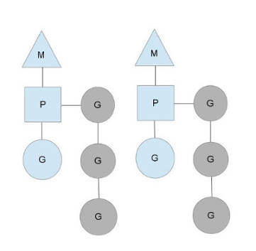
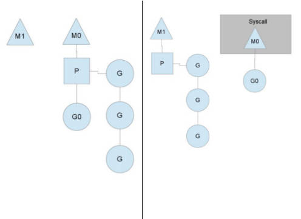
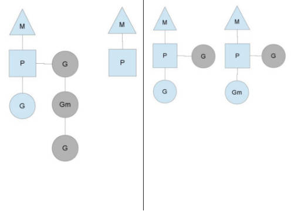

<!-- more -->

### 目录

- [一、mutex 是什么](#一mutex-是什么)
- [二、mutex 数据结构](#二mutex-数据结构)

#### 一、Goroutine 调度器

> 线程过多，导致上下文切换频繁，导致性能下降，所以 Go 语言引入了 Goroutine，Goroutine 是由 Go 运行时管理的轻量级线程，Go 语言运行时会自动将 Goroutine 调度到 CPU 核心上执行。

> Goroutine 调度器的工作就是把“ready-to-run”的goroutine分发到线程中。

> Goroutine 主要概念：

- G(Goroutine): go协程，每个go关键字会创建一个协程。
- M(Machine): 工作线程，在Go中成为Machine。
- P(Processor): 处理器（Go 中定义的一个概念，不是指CPU），包含运行Go代码的必要资源，用来调度G和执行G。

M必须拥有P才可以执行G中的代码，P含有一个包含多个G的队列，P可以调度G交由M执行。

图中M是交给操作系统调度得线程，M持有一个P，P将G调度进M中执行。P同时还维护着一个包含G得队列（图中灰色部分），可以按照一定得策略将G调度到M中执行。

P的个数在程序启动时决定，默认情况下等同于CPU得核数，由于M必须持有一个P才可以运行Go代码，所以同时运行的M个数，也即线程数一般等同于CPU的个数，以达到尽可能的使用CPU而又不至于产生过多的线程切换开销。

程序中可以使用`runtime.GOMAXPROCS()`设置P的个数。

#### 二、Goroutine 调度策略

1. 队列轮转

    每个P都维护着一个包含G的队列，不考虑G进入系统调用或IO操作的情况下，P周期性的将G调度到M上执行，执行一小段时间，将上下文保存下来，然后将G放到队列尾部，然后从队列中重新取出一个G进行调度。

    除了每个P维护的G队列以外，还有一个全局队列，每个P会周期性地查看全局队列中是否有G待运行并将其调度到M中执行，全局队列中G的来源，主要有　从系统调用中恢复的G。

    之所以P会周期性地查看全局队列，也是为了防止全局队列中的G得不到运行。
2. 系统调用

    

    P的个数默认等于CPU核数，每个M必须持有一个P才可以执行G，一般情况下M的个数会略大于P的个数，这多出来的M将会在G产生系统调用时发挥作用。类似线程池，Go也提供了一个M的池子，需要时从池子中获取，用完放回池子，不够用时就再创建一个。

    当G0即将进入系统调用时，M0将释放P，进而某个空闲的M1获取P，继续执行P队列中剩下的G。而M0由于陷入系统调用而被阻塞，M1接替M0的工作，只要P不空闲，就可以保证充分利用CPU。

    M1的来源可能是M的缓存池，也可能是新建的。当G0系统调用结束后，根据M0是否能获取到P，将会对G0做不同的处理。

    - 如果有空闲的P，则获取一个P，继续执行G0.
    - 如果没有空闲的P，则将G0放入全局队列，等待其他的P调度。然后M0将进入缓存池睡眠。

3. 工作量窃取

    

    多个P中维护的G队列有可能是不均衡的。

    竖线左侧中右边的P已经全部执行完，然后去查询全局队列，全局队列中也没有G，而另一个M中处理正在运行的G外，队列中还有３个G待运行，此时，空闲的P会将其他P中的G偷取一部分过来，一般每次偷取一半。偷取完如右图所示。

4. GOMAXPROCS设置对性能的影响
    - 如果GOMAXPROCS设置的值比CPU核数小，那么将导致CPU核数空闲，因为Go运行时最多会使用GOMAXPROCS个P来运行G。
    - 如果是IO密集型的应用，GOMAXPROCS可以大于CPU核数，因为IO操作时，会有大量的时间片浪费在等待IO上，此时可以多开一些P来充分利用CPU。

    <a href="#目录" style="text-decoration: none;">Top</a>

###### 参考链接如下

- [Go 专家编程](https://www.topgoer.cn/docs/gozhuanjia/gochan4)
