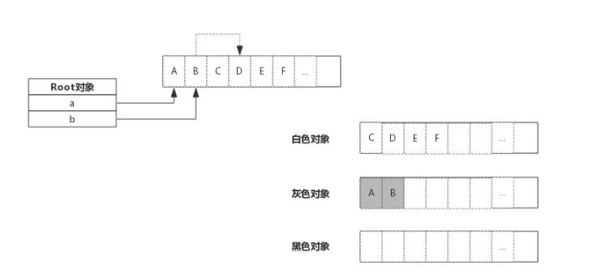

<!-- more -->

### 目录
>
> 所谓垃圾就是不再需要的内存块，这些垃圾如果不清理就没办法再次被分配使用，在不支持垃圾回收的编程语言里，这些垃圾内存就是泄露的内存。

- [一、垃圾回收算法](#一垃圾回收算法)
- [二、Golang 垃圾回收](#二golang-垃圾回收)
- [三、垃圾回收触发时机](#三垃圾回收触发时机)
- [四、垃圾回收理解笔记](#四垃圾回收理解笔记)

#### 一、垃圾回收算法

- 引用计数：对每个对象维护一个引用计数，当引用该对象的对象被销毁时，引用计数减一，当引用计数为0时，对象可以被回收。
  - 优点：对象可以很快地被回收，不会出现内存耗尽或达到某个阈值时才回收。
  - 缺点：不能很好地处理循环引用，而且实时维护引用计数，也有一定代价。
  - 代表语言：Python、PHP、Swift
- 标记-清除：从根变量触发开始遍历所有引用的对象，引用的对象标记为"被引用"，没有被标记的进行回收。
  - 优点：解决了引用计数的确定。
  - 缺点：需要STW，即要暂时停掉程序运行。
  - 代表语言：Golang(三色标记法)
- 分代收集：按照对象生命周期长短划分不同的代空间，生命周期长的放入老年代，而短的放入新生代，不同代有不同的回收算法和回收频率。
  - 优点：回收性能好
  - 缺点：算法复杂
  - 代表语言：JAVA

<hr style="background-color: blue;border: none;height: 10px;opacity: .1;width: 100%" />

<div style="text-align: right;">
    <a href="#目录" style="text-decoration: none;">Top</a>
</div>

#### 二、Golang 垃圾回收

1. 垃圾回收原理
    简单来说，垃圾回收的核心就是标记出哪些内存还在使用中（即被引用到），哪些内存不使用了（即未被引用），把未被引用的内存回收掉，以供后续内存分配时使用。

    下图展示了一段内存，内存中既有已分配掉的内存，也有未分配的内存，垃圾回收的目标是把那些已经分配但没有对象引用的内存找出来回收掉。

    

    上图中，内存块1、2、4号位上的内存已被分配（数字1代表已被分配，0 未分配）。变量a,b为一指针，指向内存的1，2号位。内存块的4号位曾经被使用过，但现在没有任何对象引用了，就需要被回收掉。

    垃圾回收开始时从root对象开始扫描，把root对象引用的内存标记为“被引用”，考虑到内存块中存放可能是指针，所以还需要递归的进行标记，全部标记完成后，只保留被标记的内存，未被标记的全部标识为未分配，即完成了垃圾回收。

2. 内存标记（Mark）
    span中维护了一个个内存块，并由一个位图allcBits表示每个内存块的分配情况。在span数据结构中还有另一个位图gcmarkBits用于标记内存块被引用情况。

    
    如上图所示,allocBits记录了每块内存分配情况，而gcmarkBits记录了每块内存标记情况。标记阶段对每块内存进行标记，有对象的内存标记为1（如图中灰色所示），没有引用的保持默认为0.

    allocBits和gcmarkBits数据结构都是一样的，标记结束就是内存回收，回收时将allocBits指向gcmarkBits，则代表标记过的才是存活的，gcmarkBits则会在下次标记时重新分配内存，非常巧妙。

3. 三色标记法

   三色只是为了叙述上方便抽象出来的一种说法，实际上对象并没有颜色之分。这里的三色，对应了垃圾回收过程中对象的三种状态。

   - 灰色：对象还在标记队列中等待。
   - 黑色：对象已经被标记，gcmarkBits对应的位为1（该对象不会在本次GC中被清理）
   - 白色：对象未被标记，gcmarkBits对应的位为0（该对象在本次GC中被清理）

    例如，当前内存中有A~F一共六个对象，根对象a,b本身为栈上分配的局部变量，根对象a、b分别引用了对象A、B，而B对象又引用了对象D，则GC的整个流程图如下：

    
    
    
    

4. Stop The World
    对于垃圾回收来说，回收过程中也需要控制住内存的变化，否则回收过程中指针传递会引起内存引用变化，如果错误的回收了还在使用的内存，结果将时灾难性的。

    Golang中的STW（Stop The World）就是停掉所有的goroutine，专心做垃圾回收，待垃圾回收结束后再恢复goroutine的运行。

    STW时间过长，程序阻塞严重，对用户体验影响大，所以Go的垃圾回收器在不断的演进，从早期的标记-清除算法，到并发标记清除，再到三色标记法，最终到今天的并发标记清除+混合写屏障，STW的时间在不断的缩短，但仍然还有很大的优化空间。

<hr style="background-color: blue;border: none;height: 10px;opacity: .1;width: 100%" />

<div style="text-align: right;">
    <a href="#目录" style="text-decoration: none;">Top</a>
</div>

#### 三、垃圾回收触发时机

1. 内存分配量达到阈值触发GC

    每次内存分配时都会检查当前内存分配量是否已达到阈值，如果达到阈值则立即启动GC。

    `阈值 = 上次GC内存分配量 * 内存增长率`

    内存增长率是由环境变量`GOGC`控制，默认是100，即每当内存扩大一倍时启动GC。

2. 定期触发GC

    Golang在启动时设置了一个定期触发GC的定时器，默认是2分钟触发一次。如果2分钟内没有触发GC，则下次内存分配时将再次触发GC。

    ```go
    // forcegcperiod is the maximum time in nanoseconds between garbage
    // collections. If we go this long without a garbage collection, one
    // is forced to run.
    //
    // This is a variable for testing purposes. It normally doesn't change.
    var forcegcperiod int64 = 2 * 60 * 1e9
    ```

3. 手动触发

    程序代码中也可以直接使用`runtime.GC()`来手动触发GC。这主要用于GC性能测试和统计。

<hr style="background-color: blue;border: none;height: 10px;opacity: .1;width: 100%" />

<div style="text-align: right;">
    <a href="#目录" style="text-decoration: none;">Top</a>
</div>

#### 四、垃圾回收理解笔记

 > 垃圾回收在生活中，将垃圾进行分类，由环卫工人运输到垃圾厂进行再回收或者销毁。在程序中，也需要相应的方式对垃圾进行处理。

 Golang 语言中 的垃圾回收目前有三个阶段；

- （1.3）第一阶段 标记清除阶段，首先标记所有非垃圾对象，然后把未标记的对象（垃圾）进行清除。

- （1.5）第二阶段 三色标记法，分为白色，灰色，黑色三个桶，第一步所有的对象（不确定是不是垃圾）都放进白色桶内（默认）；第二步把所有接触桶盖的对象（第一层对象）放进灰色桶内；第三步 首先把灰色桶内的对象放进黑色桶内，同时将在白色桶内跟原本灰色对象关联的顶层下游对象（第一层）放进灰色桶内；第四步 重复第三步，直至灰色桶内不再存在对象；第五步 清除白色桶内对象（垃圾）。

- （1.8）第三阶段 三色标记法+混合写屏障法，依旧 分为白色，灰色，黑色三个桶，在三色标记法的基础上做了一些改进，第一步 首先把所有接触桶盖的对象组（接触桶盖的对象包含下游所有子对象）完整的添加进黑色桶内；第二步 所有新创建的对象放进黑色桶内；第三步 删除关联的对象放进灰色桶内；第四步 添加关联的对象放进灰色桶内；后续利用三色标记法 对灰色桶内的对象进行处理；最终清除白色桶内对象。

 这里仅仅描述一下大致处理流程，具体操作方式及为什么分一，二，三阶段，接着往下看。

1. GC 第一阶段 标记清除法（1.3）

    标记清除法为GC最原始的垃圾处理方式，类比生活中环卫工人处理垃圾时，按下时间暂停键，时间静止，人类不再产生垃圾，在某一时间段集中进行垃圾处理，处理完成后，按下时间启动键，人类开始生成垃圾。在程序中的表现形式：第一步 暂停程序，不再执行其他任务； 第二步 对所有的非垃圾对象进行标记；第三步 清除垃圾；第四步 启动程序，重新执行任务。

    在这个过程中会进行标记清扫算法（mark and sweep）暂停程序，STW （stop the world）,程序会进行短时间卡顿，为了解决这个问题，将清除垃圾放在第四步，启动程序之后，但也仅仅是缩短了一点暂停时间没有从根本上解决问题。

2. GC 第二阶段 三色标记法 （1.5）

    三色标记法为优化后的垃圾处理方式，类似于有核的洋葱，把一层层洋葱进行剥开，最后清理中心的核（垃圾）。具体操作步骤：第一步 把所有对象标记为白色（默认色）；第二步 把最外层对象标记灰色；第三步 把灰色对象标记为黑色，同时把灰色对象关联下游最外层对象标记为灰色；第四步 重复第三步 直至不存在灰色对象；第五步 清理白色对象。

    当标记的过程中，不进行STW的情况下，如果黑色对象引用了白色对象，且原本引用该白色对象的灰色对象对该白色对象断开了引用，那么就会导致该白色对象无法回收。针对该问题，提出了两种解决方式，一 强三色不变式，黑色对象不能引用白色对象；二 黑色对象引用的对象上层或上上....如果不存在灰色对象将不能被引用。由此引入了屏障的概念；可以使用插入屏障和删除屏障来处理该问题。

    插入屏障：黑色对象引用的对象都标记为灰色，不足：处理仍需要进行STW (10-100ms);

    删除屏障：被删除的对象为灰色为白色时，标记为灰色对象，不足：回收精度低。

    针对以上问题再次对垃圾回收进行优化，提出了三色标记法+混合写屏障法的概念。

3. GC 第三阶段 三色标记法+混合写屏障法 （1.8）

    混合写屏障法建立在三色标记法的基础上，

    第一步 GC开始时 把所有的存活对象标记为黑色（不需要全表扫描 STW）；

    第二步 GC期间 栈上新创建的对象标记为黑色；

    第三步 被删除引用的对象标记为灰色；

    第四步 被添加引用的对象标记为灰色，之后进行三色标记法后续处理。

    屏障建立在堆上，栈上不存在屏障。在开始和结束时仍会存在短暂的STW，相对来说消耗极小，混合写屏障法改进了STW的使用次数和时间，仍未从根本上解决程序卡顿问题。

<div style="text-align: right;">
    <a href="#目录" style="text-decoration: none;">Top</a>
</div>

###### 参考链接如下

- [Go 专家编程](https://www.topgoer.cn/docs/gozhuanjia/gochan4)
