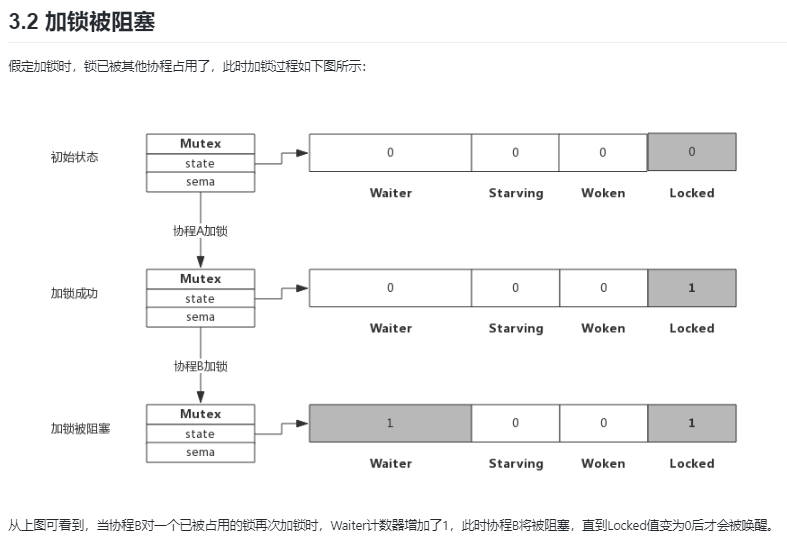
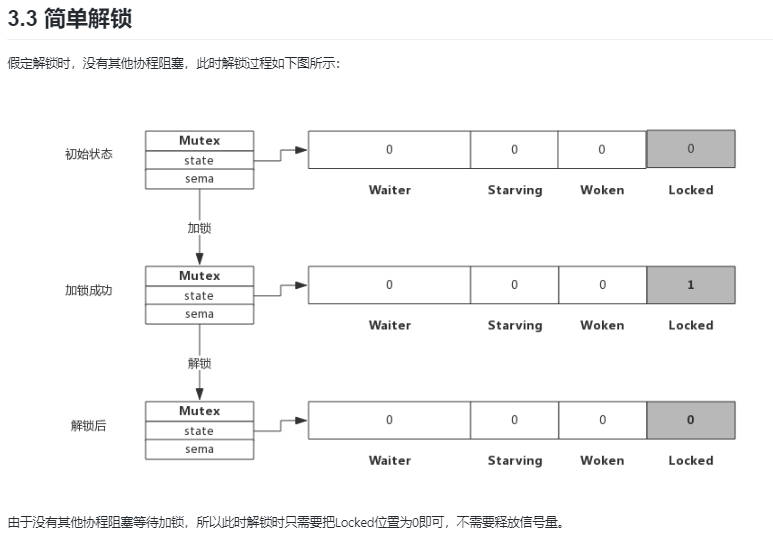
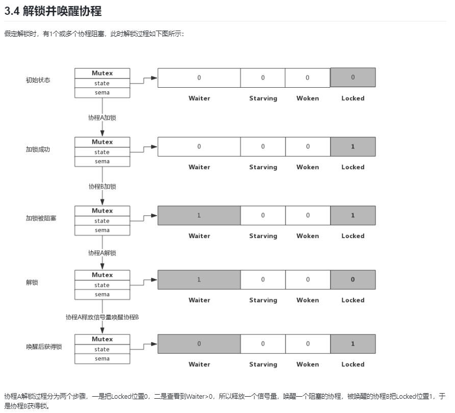

<!-- more -->

### 目录

- [一、mutex 是什么](#一mutex-是什么)
- [二、mutex 数据结构](#二mutex-数据结构)

#### 一、mutex 是什么

mutex 是 Go 语言中的一种同步原语，用于保护共享资源，防止多个 goroutine 同时访问。它是一种互斥锁，即同一时间只有一个 goroutine 可以持有该锁，其他 goroutine 需要等待锁被释放后才能继续执行。

#### 二、mutex 数据结构

1. mutex 结构体

    正常模式：

    - 等待队列：等待获取互斥锁的goroutine按照先进先出（FIFO）的顺序排队。
    - 竞争机制：当一个goroutine被唤醒并试图获取互斥锁时，它与其他新到达的goroutine竞争锁的拥有权。新到达的goroutine有优势，因为它们已经在CPU上运行，并且可能有很多这样的goroutine。因此，被唤醒的goroutine有很大机会失败，并会被重新排队到等待队列的前面。
    - 切换到饥饿模式：如果一个goroutine等待超过1毫秒仍未获取到互斥锁，则互斥锁会切换到饥饿模式。

    饥饿模式

    - 直接传递所有权：在饥饿模式下，互斥锁的所有权直接从释放锁的goroutine传递给等待队列中的第一个goroutine。
    - 新goroutine的等待：新到达的goroutine不会尝试获取互斥锁，即使它看起来是解锁状态，也不会自旋。相反，它们会排队到等待队列的末尾。
    - 切换回正常模式：如果一个goroutine获取了互斥锁，并且发现它是队列中的最后一个等待者，或者它等待的时间少于1毫秒，那么互斥锁会切换回正常操作模式。

    ```go
    type Mutex struct {
    state int32
    sema  uint32
    }
    ```

    mutex.state是32位的整型变量，内部实现时把该变量分成四份，用于记录Mutex的四种状态

    ```go
    const (
    mutexLocked = 1 << iota // mutex is locked
    mutexWoken             // 唤醒标记
    mutexStarving          // 饥饿模式
    mutexWaiterShift = iota // waiter count shift
    )
    ```

    - mutexLocked：表示互斥锁是否被锁定，1表示锁定，0表示未锁定。
    - mutexWoken：表示是否唤醒过goroutine，1表示已经唤醒过，0表示没有唤醒过。
    - mutexStarving：表示是否处于饥饿模式，1表示处于饥饿模式，0表示不处于饥饿模式。
    - mutexWaiterShift：表示等待队列的长度，即等待获取互斥锁的goroutine的数量。

    mutex.sema是一个信号量，用于阻塞和唤醒goroutine。当goroutine尝试获取互斥锁时，如果互斥锁已经被锁定，则goroutine会被阻塞，直到互斥锁被释放。当互斥锁被释放时，被阻塞的goroutine会被唤醒，并尝试获取互斥锁。

2. mutex 方法

    mutex 对外提供了 Lock() 和 Unlock() 方法，用于锁定和解锁互斥锁。

    ```go
    func (m *Mutex) Lock() {
        // Fast path: grab unlocked mutex.
        if atomic.CompareAndSwapInt32(&m.state, 0, mutexLocked) {
            if race.Enabled {
                race.Acquire(unsafe.Pointer(m))
            }
            return
        }
        // Slow path (outlined so that the fast path can be inlined)
        m.lockSlow()
    }

    func (m *Mutex) Unlock() {
        if race.Enabled {
            _ = m.state
            race.Release(unsafe.Pointer(m))
        }

        new := atomic.AddInt32(&m.state, -mutexLocked)
        if new != 0 {
            // Outlined slow path to allow inlining of the fast path.
            // To hide unlockSlow during tracing we skip one extra frame when tracing GoUnblock.
            m.unlockSlow(new)
        }
    }
    ```

    - 加锁：如果互斥锁未被锁定，则直接获取互斥锁。如果互斥锁已经被锁定，则调用 lockSlow() 方法，该方法会进入等待队列，直到互斥锁被释放。
    - 解锁：
        - 检查检查竞态条件：如果启用了竞态检测（race.Enabled），则通过_ = m.state读取互斥锁的状态，并调用race.Release来标记解锁操作，以便竞态检测工具能够检测到。

        - 原子操作：使用atomic.AddInt32函数原子地将互斥锁的状态减去mutexLocked（通常为1），以尝试解锁互斥锁。atomic包提供了原子操作，确保在多线程环境下对共享资源的操作是安全的。

        - 检查解锁状态：如果原子操作后的新状态new不为0，说明解锁操作失败，因为互斥锁可能已经被其他goroutine锁定。此时，调用unlockSlow方法进行更复杂的解锁操作。
3. 加解锁过程

    
    
    
    

4. 自旋过程
   加锁时，如果当前locked位为1，说明该锁当前由其他协程持有，尝试加锁的协程并不是马上转入阻塞，而是会持续的探测locked位是否变为0，这个过程即为自旋过程。

   自旋时间很短，但如果在自旋过程中发现锁已被释放，那么协程可以立即获取锁，此时即便有协程被唤醒也无法获取锁，只能再次阻塞。

   自旋的好处时，当加锁失败时不必立即转入阻塞，有一定机会获取到锁，这样可以避免协程的切换。

   1. 什么是自旋
        > 自旋对应于CPU的·PAUSE·指令，CPU对该指令什么都不做，相当于CPU空转，对程序而言相当于sleep了一小段时间，时间非常短，当前实现是30个CPU指令周期，约在几纳秒到几十纳秒之间。

   2. 自旋条件
       > 加锁时程序会自动判断是否可以自旋，无限制的自旋将会给CPU带来巨大压力，所以判断是否可以自旋就很重要了。

       > 自旋必须满足以下所有条件:
       - 自旋次数要足够小，通常为4，即自旋最多4次。
       - CPU核数要大于1，否则自旋没有意义，因为此时不可能有其他协程释放锁。
       - 协程调度机制中的Process数量要大于1，比如使用GOMAXPROCS()将处理器设置为1就不能启用自旋
       - 协程调度机制中的可运行队列必须为空，否则会延迟协程调度
       > 由此可见，自旋是在不忙的时候才会启用。
   3. 自旋的优势
       > 更充分的利用CPU，尽量避免协程切换。因为当前申请加锁的协程拥有CPU，如果经过短时间的自旋可以获得锁，当前协程无需切换，可以继续执行，减少了协程切换带来的开销。
   4. 自旋的问题
       > 如果自旋过程中获得锁，那么之前被阻塞的协程将无法获得锁，如果加锁的协程特别多，每次都通过自旋获得锁，那么之前被阻塞的进程将很难获得锁，从而进入饥饿状态。

       > 为了避免协程长时间无法获取锁，增加了一个starving状态。这个状态下不会自旋，一旦有协程释放锁，那么一定会唤醒一个协程并成功加锁。
5. 为什么重复解锁会panic
    > unlock的过程分为将locked置为0，然后判断waiter值，如果值>0，则释放信号量。
    > 如果多次解锁，每次都会释放一个信号量，会唤醒多个协程，多个协程唤醒后会继续在lock()的逻辑里抢锁，势必会增加lock()实现的复杂度，也会引起不必要的协程切换。
    >
<div style="text-align: right;">
    <a href="#目录" style="text-decoration: none;">Top</a>
</div>

###### 参考链接如下

- [Go 专家编程](https://www.topgoer.cn/docs/gozhuanjia/gochan4)
