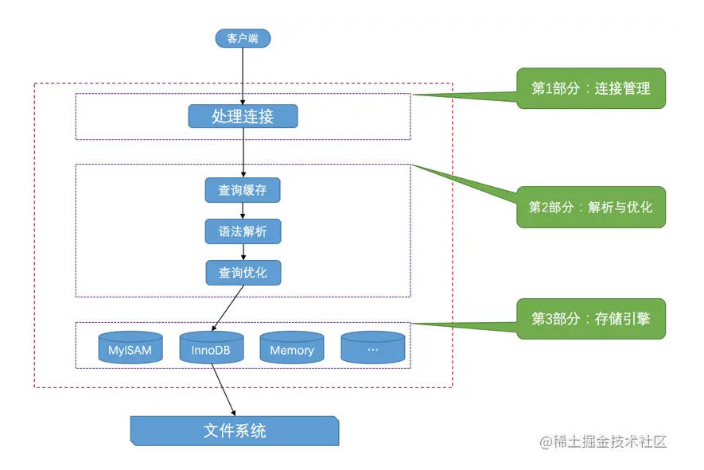

`这是一本以白话文的似的语气阐述了MySQL内部如何存储，运行，执行计划执行的书籍，老少皆宜。`

<!-- more -->

服务器处理客户端请求的流程: 参考第一章节。

字符集：指的是某个字符范围的编码规则，存在GB2312，GBK，UTF-8等编码规则，utf8 是utf8mb3的别名，是阉割过的utf7的字符集，只使用1~3个字节表示字符。如存储emoji表情，需要使用utf8mb4（1~4字节）。存在服务器、数据库、表、列等级别字符集，字符集从发送请求到接收结果过程中会进行字符集转换，最好将字符集统一。

比较规则：指的是某个字符集下，字符如何比较大小，一个字符集可以有若干种比较规则。

页是MySQL中磁盘和内存交互的基本单位，一个页一般是16KB，当记录中的数据太多，当前页放不下的时候，会把多余的数据存储到其他页中，这种现象称为行溢出。

行数据具有多种行格式，包含记录的额外信息(字段长度，记录头信息等)，记录的真实数据。参考第四章节。

每个页都有一个next_record属性，指向下一个记录的相对位置，通过next_record可以遍历页中的所有记录。

InnoDB会把页中的记录划分为若干个组，每个组的最后一个记录地址作为一个槽，存在在Page Directory中，根据主键查找记录可以通过二分法确定槽，再通过next_record遍历组中的记录。

每个数据页的 File Header 部分都有上一个和下一个页的编号，所以所有的的数据页会组成一个双链表。页首部和尾部会存储野种数据的校验和最后修改时对应的LSN值，通过校验可以判断页是否损坏。

索引，B+树，符合索引参考第六七章节。

表空间：参考第九章节。

表统计采样页面数量可以进行配置基于磁盘的永久性统计和基于内存的非永久性统计数据。

MySQL 会针对连接等查询语句及规则进行优化，参考十一，十二，十四章节。

表查询计划查询及优化，参考十，十五，十六，十七章节。

因为内存缓存速度远大于磁盘，所以在缓存中向操作系统申请一段连续的内存空间 Buffer Pool, 使用链表管理，存在free链表（空闲的缓存页），flush链表（修改的页），LRU链表（yong,old 区分从磁盘加载的冷热数据），存在多个Buffer Pool实例,每个实例由若干个chunk组成，一个chunk代表一片连续的内存空间，包含了若干缓存页与其对应的控制块。参考第十八章节。

事务，redo log，undo log参考第十九 至 二十四章节。

锁 参考第 二十五章节。
