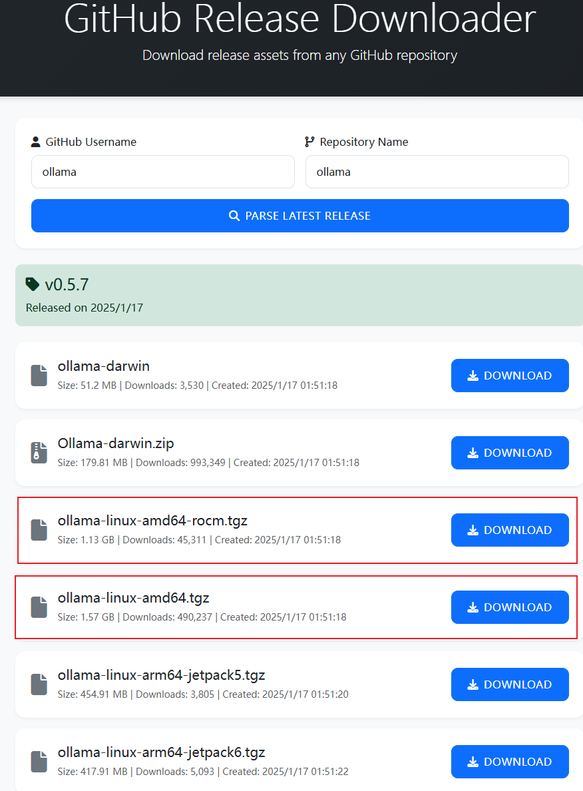
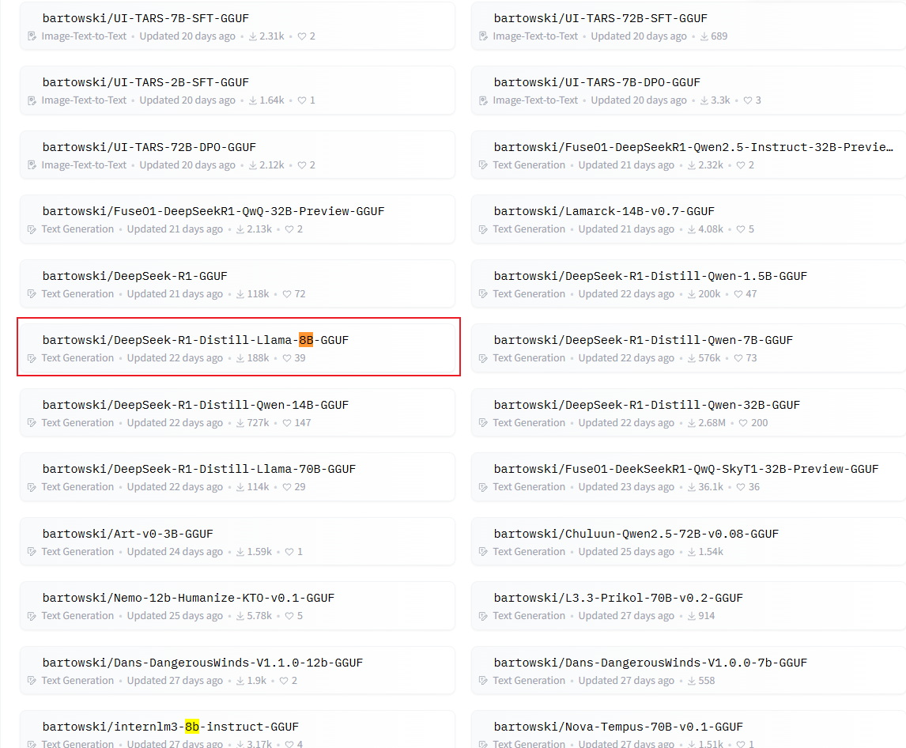

<!-- more -->

### 目录

- [安装步骤](#安装步骤)

#### 安装步骤

1. 下载离线软件
    - [ollama-linux-amd64.tgz](https://github.com/ollama/ollama/releases/download/v0.5.7/ollama-linux-amd64.tgz)
    - [ollama-linux-amd64-rocm.tgz](https://github.com/ollama/ollama/releases/download/v0.5.7/ollama-linux-amd64-rocm.tgz)
      
    - [DeepSeek-R1-Distill-Llama-8B-Q4_K_M.gguf](https://hf-mirror.com/bartowski/DeepSeek-R1-Distill-Llama-8B-GGUF/resolve/main/DeepSeek-R1-Distill-Llama-8B-Q4_K_M.gguf)
      

    ollama 版本：0.5.7，可根据github更新时间选择最新版本, 通过<https://get-github.hexj.org/>可以加速下载。
    deepseek 版本：R1-Distill-Llama-8B-Q4_K_M，可根据<https://hf-mirror.com/bartowski>选择合适版本, 通过迅雷可以加速下载。

2. install.sh 调整

   原脚本位置：<https://ollama.com/install.sh>
   修改内容：
   - ollama-linux-amd64.tgz&ollama-linux-amd64-rocm.tgz下载改为使用本地文件
   - /etc/systemd/system/ollama.service增加`Environment="OLLAMA_HOST=0.0.0.0"`

   ```bash
        #!/bin/sh
        # This script installs Ollama on Linux.
        # It detects the current operating system architecture and installs the appropriate version of Ollama.
        
        set -eu
        
        
        status() { echo ">>> $*" >&2; }
        error() { echo "ERROR $*"; exit 1; }
        warning() { echo "WARNING: $*"; }
        
        TEMP_DIR=$(mktemp -d)
        cleanup() { rm -rf $TEMP_DIR; }
        trap cleanup EXIT
        
        available() { command -v $1 >/dev/null; }
        require() {
            local MISSING=''
            for TOOL in $*; do
                if ! available $TOOL; then
                    MISSING="$MISSING $TOOL"
                fi
            done
        
            echo $MISSING
        }
        
        [ "$(uname -s)" = "Linux" ] || error 'This script is intended to run on Linux only.'
        
        ARCH=$(uname -m)
        case "$ARCH" in
            x86_64) ARCH="amd64" ;;
            aarch64|arm64) ARCH="arm64" ;;
            *) error "Unsupported architecture: $ARCH" ;;
        esac
        
        IS_WSL2=false
        
        KERN=$(uname -r)
        case "$KERN" in
            *icrosoft*WSL2 | *icrosoft*wsl2) IS_WSL2=true;;
            *icrosoft) error "Microsoft WSL1 is not currently supported. Please use WSL2 with 'wsl --set-version <distro> 2'" ;;
            *) ;;
        esac
        
        VER_PARAM="${OLLAMA_VERSION:+?version=$OLLAMA_VERSION}"
        
        SUDO=
        if [ "$(id -u)" -ne 0 ]; then
            # Running as root, no need for sudo
            if ! available sudo; then
                error "This script requires superuser permissions. Please re-run as root."
            fi
        
            SUDO="sudo"
        fi
        
        NEEDS=$(require curl awk grep sed tee xargs)
        if [ -n "$NEEDS" ]; then
            status "ERROR: The following tools are required but missing:"
            for NEED in $NEEDS; do
                echo "  - $NEED"
            done
            exit 1
        fi
        
        for BINDIR in /usr/local/bin /usr/bin /bin; do
            echo $PATH | grep -q $BINDIR && break || continue
        done
        OLLAMA_INSTALL_DIR=$(dirname ${BINDIR})
        
        status "Installing ollama to $OLLAMA_INSTALL_DIR"
        $SUDO install -o0 -g0 -m755 -d $BINDIR
        $SUDO install -o0 -g0 -m755 -d "$OLLAMA_INSTALL_DIR"
        #if curl -I --silent --fail --location "https://ollama.com/download/ollama-linux-${ARCH}.tgz${VER_PARAM}" >/dev/null ; then
        #注释掉以下代码
        #    status "Downloading Linux ${ARCH} bundle"
        #    curl --fail --show-error --location --progress-bar \
        #        "https://ollama.com/download/ollama-linux-${ARCH}.tgz${VER_PARAM}" | \
        #        $SUDO tar -xzf - -C "$OLLAMA_INSTALL_DIR"
        #    BUNDLE=1
        #    if [ "$OLLAMA_INSTALL_DIR/bin/ollama" != "$BINDIR/ollama" ] ; then
        #        status "Making ollama accessible in the PATH in $BINDIR"
        #        $SUDO ln -sf "$OLLAMA_INSTALL_DIR/ollama" "$BINDIR/ollama"
        #    fi
        #else
        #    status "Downloading Linux ${ARCH} CLI"
        #    curl --fail --show-error --location --progress-bar -o "$TEMP_DIR/ollama"\
        #    "https://ollama.com/download/ollama-linux-${ARCH}${VER_PARAM}"
        #    $SUDO install -o0 -g0 -m755 $TEMP_DIR/ollama $OLLAMA_INSTALL_DIR/ollama
        #    BUNDLE=0
        #    if [ "$OLLAMA_INSTALL_DIR/ollama" != "$BINDIR/ollama" ] ; then
        #        status "Making ollama accessible in the PATH in $BINDIR"
        #        $SUDO ln -sf "$OLLAMA_INSTALL_DIR/ollama" "$BINDIR/ollama"
        #    fi
        #fi
        #调整为从本地文件安装
        LOCAL_OLLAMA_TGZ="./ollama-linux-${ARCH}.tgz${VER_PARAM}"
        if [ -f "$LOCAL_OLLAMA_TGZ" ]; then
            status "Installing from local file $LOCAL_OLLAMA_TGZ"
            $SUDO tar -xzf "$LOCAL_OLLAMA_TGZ" -C "$OLLAMA_INSTALL_DIR"
            BUNDLE=1
            if [ ! -e "$BINDIR/ollama" ]; then
                status "Making ollama accessible in the PATH in $BINDIR"
                $SUDO ln -sf "$OLLAMA_INSTALL_DIR/ollama" "$BINDIR/ollama"
            fi
        else
            echo "Error: The local file $LOCAL_OLLAMA_TGZ does not exist."
            exit 1
        fi
        
        
        install_success() {
            status 'The Ollama API is now available at 127.0.0.1:11434.'
            status 'Install complete. Run "ollama" from the command line.'
        }
        trap install_success EXIT
        
        # Everything from this point onwards is optional.
        
        configure_systemd() {
            if ! id ollama >/dev/null 2>&1; then
                status "Creating ollama user..."
                $SUDO useradd -r -s /bin/false -U -m -d /usr/share/ollama ollama
            fi
            if getent group render >/dev/null 2>&1; then
                status "Adding ollama user to render group..."
                $SUDO usermod -a -G render ollama
            fi
            if getent group video >/dev/null 2>&1; then
                status "Adding ollama user to video group..."
                $SUDO usermod -a -G video ollama
            fi
        
            status "Adding current user to ollama group..."
            $SUDO usermod -a -G ollama $(whoami)
        
            status "Creating ollama systemd service..."
            cat <<EOF | $SUDO tee /etc/systemd/system/ollama.service >/dev/null
        [Unit]
        Description=Ollama Service
        After=network-online.target
        
        [Service]
        ExecStart=$BINDIR/ollama serve
        User=ollama
        Group=ollama
        Restart=always
        RestartSec=3
        Environment="PATH=$PATH"
        Environment="OLLAMA_HOST=0.0.0.0"
        
        [Install]
        WantedBy=default.target
        EOF
            SYSTEMCTL_RUNNING="$(systemctl is-system-running || true)"
            case $SYSTEMCTL_RUNNING in
                running|degraded)
                    status "Enabling and starting ollama service..."
                    $SUDO systemctl daemon-reload
                    $SUDO systemctl enable ollama
        
                    start_service() { $SUDO systemctl restart ollama; }
                    trap start_service EXIT
                    ;;
            esac
        }
        
        if available systemctl; then
            configure_systemd
        fi
        
        # WSL2 only supports GPUs via nvidia passthrough
        # so check for nvidia-smi to determine if GPU is available
        if [ "$IS_WSL2" = true ]; then
            if available nvidia-smi && [ -n "$(nvidia-smi | grep -o "CUDA Version: [0-9]*\.[0-9]*")" ]; then
                status "Nvidia GPU detected."
            fi
            install_success
            exit 0
        fi
        
        # Install GPU dependencies on Linux
        if ! available lspci && ! available lshw; then
            warning "Unable to detect NVIDIA/AMD GPU. Install lspci or lshw to automatically detect and install GPU dependencies."
            exit 0
        fi
        
        check_gpu() {
            # Look for devices based on vendor ID for NVIDIA and AMD
            case $1 in
                lspci)
                    case $2 in
                        nvidia) available lspci && lspci -d '10de:' | grep -q 'NVIDIA' || return 1 ;;
                        amdgpu) available lspci && lspci -d '1002:' | grep -q 'AMD' || return 1 ;;
                    esac ;;
                lshw)
                    case $2 in
                        nvidia) available lshw && $SUDO lshw -c display -numeric -disable network | grep -q 'vendor: .* \[10DE\]' || return 1 ;;
                        amdgpu) available lshw && $SUDO lshw -c display -numeric -disable network | grep -q 'vendor: .* \[1002\]' || return 1 ;;
                    esac ;;
                nvidia-smi) available nvidia-smi || return 1 ;;
            esac
        }
        
        if check_gpu nvidia-smi; then
            status "NVIDIA GPU installed."
            exit 0
        fi
        
        if ! check_gpu lspci nvidia && ! check_gpu lshw nvidia && ! check_gpu lspci amdgpu && ! check_gpu lshw amdgpu; then
            install_success
            warning "No NVIDIA/AMD GPU detected. Ollama will run in CPU-only mode."
            exit 0
        fi
        
        # if check_gpu lspci amdgpu || check_gpu lshw amdgpu; then
        #     if [ $BUNDLE -ne 0 ]; then
        #         status "Downloading Linux ROCm ${ARCH} bundle"
        #         curl --fail --show-error --location --progress-bar \
        #             "https://ollama.com/download/ollama-linux-${ARCH}-rocm.tgz${VER_PARAM}" | \
        #             $SUDO tar -xzf - -C "$OLLAMA_INSTALL_DIR"
        
        #         install_success
        #         status "AMD GPU ready."
        #         exit 0
        #     fi
        #     # Look for pre-existing ROCm v6 before downloading the dependencies
        #     for search in "${HIP_PATH:-''}" "${ROCM_PATH:-''}" "/opt/rocm" "/usr/lib64"; do
        #         if [ -n "${search}" ] && [ -e "${search}/libhipblas.so.2" -o -e "${search}/lib/libhipblas.so.2" ]; then
        #             status "Compatible AMD GPU ROCm library detected at ${search}"
        #             install_success
        #             exit 0
        #         fi
        #     done
        
        #     status "Downloading AMD GPU dependencies..."
        #     $SUDO rm -rf /usr/share/ollama/lib
        #     $SUDO chmod o+x /usr/share/ollama
        #     $SUDO install -o ollama -g ollama -m 755 -d /usr/share/ollama/lib/rocm
        #     curl --fail --show-error --location --progress-bar "https://ollama.com/download/ollama-linux-amd64-rocm.tgz${VER_PARAM}" \
        #         | $SUDO tar zx --owner ollama --group ollama -C /usr/share/ollama/lib/rocm .
        #     install_success
        #     status "AMD GPU ready."
        #     exit 0
        # fi

        # 调整为本地安装
        LOCAL_OLLAMA_ROCM_TGZ="./ollama-linux-amd64-rocm.tgz${VER_PARAM}"
        if [ -f "$LOCAL_OLLAMA_ROCM_TGZ" ]; then
            status "Installing from local file $LOCAL_OLLAMA_ROCM_TGZ"
            $SUDO tar -xzf "$LOCAL_OLLAMA_ROCM_TGZ" -C "$OLLAMA_INSTALL_DIR"
            install_success
            status "AMD GPU ready."
            exit 0
        else
            echo "Error: The local file $LOCAL_OLLAMA_ROCM_TGZ does not exist."
            exit 1
        fi
        
        CUDA_REPO_ERR_MSG="NVIDIA GPU detected, but your OS and Architecture are not supported by NVIDIA.  Please install the CUDA driver manually https://docs.nvidia.com/cuda/cuda-installation-guide-linux/"
        # ref: https://docs.nvidia.com/cuda/cuda-installation-guide-linux/index.html#rhel-7-centos-7
        # ref: https://docs.nvidia.com/cuda/cuda-installation-guide-linux/index.html#rhel-8-rocky-8
        # ref: https://docs.nvidia.com/cuda/cuda-installation-guide-linux/index.html#rhel-9-rocky-9
        # ref: https://docs.nvidia.com/cuda/cuda-installation-guide-linux/index.html#fedora
        install_cuda_driver_yum() {
            status 'Installing NVIDIA repository...'
            
            case $PACKAGE_MANAGER in
                yum)
                    $SUDO $PACKAGE_MANAGER -y install yum-utils
                    if curl -I --silent --fail --location "https://developer.download.nvidia.com/compute/cuda/repos/$1$2/$(uname -m | sed -e 's/aarch64/sbsa/')/cuda-$1$2.repo" >/dev/null ; then
                        $SUDO $PACKAGE_MANAGER-config-manager --add-repo https://developer.download.nvidia.com/compute/cuda/repos/$1$2/$(uname -m | sed -e 's/aarch64/sbsa/')/cuda-$1$2.repo
                    else
                        error $CUDA_REPO_ERR_MSG
                    fi
                    ;;
                dnf)
                    if curl -I --silent --fail --location "https://developer.download.nvidia.com/compute/cuda/repos/$1$2/$(uname -m | sed -e 's/aarch64/sbsa/')/cuda-$1$2.repo" >/dev/null ; then
                        $SUDO $PACKAGE_MANAGER config-manager --add-repo https://developer.download.nvidia.com/compute/cuda/repos/$1$2/$(uname -m | sed -e 's/aarch64/sbsa/')/cuda-$1$2.repo
                    else
                        error $CUDA_REPO_ERR_MSG
                    fi
                    ;;
            esac
        
            case $1 in
                rhel)
                    status 'Installing EPEL repository...'
                    # EPEL is required for third-party dependencies such as dkms and libvdpau
                    $SUDO $PACKAGE_MANAGER -y install https://dl.fedoraproject.org/pub/epel/epel-release-latest-$2.noarch.rpm || true
                    ;;
            esac
        
            status 'Installing CUDA driver...'
        
            if [ "$1" = 'centos' ] || [ "$1$2" = 'rhel7' ]; then
                $SUDO $PACKAGE_MANAGER -y install nvidia-driver-latest-dkms
            fi
        
            $SUDO $PACKAGE_MANAGER -y install cuda-drivers
        }
        
        # ref: https://docs.nvidia.com/cuda/cuda-installation-guide-linux/index.html#ubuntu
        # ref: https://docs.nvidia.com/cuda/cuda-installation-guide-linux/index.html#debian
        install_cuda_driver_apt() {
            status 'Installing NVIDIA repository...'
            if curl -I --silent --fail --location "https://developer.download.nvidia.com/compute/cuda/repos/$1$2/$(uname -m | sed -e 's/aarch64/sbsa/')/cuda-keyring_1.1-1_all.deb" >/dev/null ; then
                curl -fsSL -o $TEMP_DIR/cuda-keyring.deb https://developer.download.nvidia.com/compute/cuda/repos/$1$2/$(uname -m | sed -e 's/aarch64/sbsa/')/cuda-keyring_1.1-1_all.deb
            else
                error $CUDA_REPO_ERR_MSG
            fi
        
            case $1 in
                debian)
                    status 'Enabling contrib sources...'
                    $SUDO sed 's/main/contrib/' < /etc/apt/sources.list | $SUDO tee /etc/apt/sources.list.d/contrib.list > /dev/null
                    if [ -f "/etc/apt/sources.list.d/debian.sources" ]; then
                        $SUDO sed 's/main/contrib/' < /etc/apt/sources.list.d/debian.sources | $SUDO tee /etc/apt/sources.list.d/contrib.sources > /dev/null
                    fi
                    ;;
            esac
        
            status 'Installing CUDA driver...'
            $SUDO dpkg -i $TEMP_DIR/cuda-keyring.deb
            $SUDO apt-get update
        
            [ -n "$SUDO" ] && SUDO_E="$SUDO -E" || SUDO_E=
            DEBIAN_FRONTEND=noninteractive $SUDO_E apt-get -y install cuda-drivers -q
        }
        
        if [ ! -f "/etc/os-release" ]; then
            error "Unknown distribution. Skipping CUDA installation."
        fi
        
        . /etc/os-release
        
        OS_NAME=$ID
        OS_VERSION=$VERSION_ID
        
        PACKAGE_MANAGER=
        for PACKAGE_MANAGER in dnf yum apt-get; do
            if available $PACKAGE_MANAGER; then
                break
            fi
        done
        
        if [ -z "$PACKAGE_MANAGER" ]; then
            error "Unknown package manager. Skipping CUDA installation."
        fi
        
        if ! check_gpu nvidia-smi || [ -z "$(nvidia-smi | grep -o "CUDA Version: [0-9]*\.[0-9]*")" ]; then
            case $OS_NAME in
                centos|rhel) install_cuda_driver_yum 'rhel' $(echo $OS_VERSION | cut -d '.' -f 1) ;;
                rocky) install_cuda_driver_yum 'rhel' $(echo $OS_VERSION | cut -c1) ;;
                fedora) [ $OS_VERSION -lt '39' ] && install_cuda_driver_yum $OS_NAME $OS_VERSION || install_cuda_driver_yum $OS_NAME '39';;
                amzn) install_cuda_driver_yum 'fedora' '37' ;;
                debian) install_cuda_driver_apt $OS_NAME $OS_VERSION ;;
                ubuntu) install_cuda_driver_apt $OS_NAME $(echo $OS_VERSION | sed 's/\.//') ;;
                *) exit ;;
            esac
        fi
        
        if ! lsmod | grep -q nvidia || ! lsmod | grep -q nvidia_uvm; then
            KERNEL_RELEASE="$(uname -r)"
            case $OS_NAME in
                rocky) $SUDO $PACKAGE_MANAGER -y install kernel-devel kernel-headers ;;
                centos|rhel|amzn) $SUDO $PACKAGE_MANAGER -y install kernel-devel-$KERNEL_RELEASE kernel-headers-$KERNEL_RELEASE ;;
                fedora) $SUDO $PACKAGE_MANAGER -y install kernel-devel-$KERNEL_RELEASE ;;
                debian|ubuntu) $SUDO apt-get -y install linux-headers-$KERNEL_RELEASE ;;
                *) exit ;;
            esac
        
            NVIDIA_CUDA_VERSION=$($SUDO dkms status | awk -F: '/added/ { print $1 }')
            if [ -n "$NVIDIA_CUDA_VERSION" ]; then
                $SUDO dkms install $NVIDIA_CUDA_VERSION
            fi
        
            if lsmod | grep -q nouveau; then
                status 'Reboot to complete NVIDIA CUDA driver install.'
                exit 0
            fi
        
            $SUDO modprobe nvidia
            $SUDO modprobe nvidia_uvm
        fi
        
        # make sure the NVIDIA modules are loaded on boot with nvidia-persistenced
        if available nvidia-persistenced; then
            $SUDO touch /etc/modules-load.d/nvidia.conf
            MODULES="nvidia nvidia-uvm"
            for MODULE in $MODULES; do
                if ! grep -qxF "$MODULE" /etc/modules-load.d/nvidia.conf; then
                    echo "$MODULE" | $SUDO tee -a /etc/modules-load.d/nvidia.conf > /dev/null
                fi
            done
        fi
        
        status "NVIDIA GPU ready."
        install_success

   ```

3. 安装allama

   将下载的离线软件拷贝到服务器，新建install.sh文件，写入调整内容，给install.sh添加执行权限，执行./install.sh

   

4. 导入deepseek模型

   - 新建文件夹，`mkdir -p /data/ollama/model`, 拷贝 DeepSeek-R1-Distill-Llama-8B-Q4_K_M.gguf 到当前文件夹下
   - 新建文件 `Modelfile`，写入内容 `from ./DeepSeek-R1-Distill-Llama-8B-Q4_K_M.gguf`, gguf 替换为自己下载的模型
   - 导入模型 ollama create <name> -f <path to modelfile>, eg: `ollama create deepseek-r1:8b -f /data/ollama/model/Modelfile`
   - 查看模型 `ollama ls`

     

5. 配置open webui

   - docker 环境(没有请百度)拉取镜像，`docker pull ghcr.nju.edu.cn/open-webui/open-webui`, 使用的是国内镜像

   - run docker, `docker run -d -e HF_ENDPOINT=https://hf-mirror.com -p 3000:8080 -e OLLAMA_BASE_URL=http://10.0.1.14:11434 --add-host=host.docker.internal:host-gateway -v /path/to/open-webui:/app/backend/data --name open-webui ghcr.nju.edu.cn/open-webui/open-webui:main` 10.0.1.14:11434 替换为服务器的ipv4地址

   - 访问 <http://10.0.1.14:3000>，首次需要注册账号，再次登录后选择模型即可使用。

     

6. [deepseek介绍](https://deepseek.csdn.net/67abf7d759bcf8384ab65a77.html),了解更多参考deepseek社区。

###### 参考连接

- [deepseek离线部署](https://blog.csdn.net/linuxxx110/article/details/145440984)
- [linux离线部署Ollama+Deepseek r1+open webui](https://deepseek.csdn.net/67ab1c2579aaf67875cb9624.html)
- [deepseek离线部署](https://blog.csdn.net/linuxxx110/article/details/145440984)
- [curl http:宿主机IP:11434提示访问拒绝](https://www.cnblogs.com/boris2012/p/18233286)

<div style="text-align: right;">
    <a href="#目录" style="text-decoration: none;">Top</a>
</div>
