`工欲善其事必先利其器，好的工具有助于我们更好更好的生活`
<!-- more -->
### 目录

<a title="" href=""></a>

<table border="1">

<tr>
  <td>在线工具</td>
  <td>
  <a title="convertio.co 是一个在线文件转换器，支持多种文件格式之间的转换，包括PDF、Word、Excel、PowerPoint、图片、音频、视频等。" href="https://convertio.co/zh/">文件转换器</a>
  </td>

  <td>
  <a title="微截图Pro是一款2024最新智能方便搞笑娱乐的截图制作神器，包含了多个常用的功能，如微信对话生成器、微信转账生成器等" href="https://vjietu.pro/">微截图Pro</a>
  </td>

  <td>
  <a title="" href="https://uutool.cn/id-photo/">照片底色替换 在线工具</a>
  </td>

  <td>
  <a title="Paste.to 是一个极简、开源、对粘贴内容毫不知情的在线粘贴板，数据在浏览器内进行 AES-256 加密和解密。" href="https://paste.to/">paste.to</a>
  </td>

  <td>
    <a title="Excalidraw是一款开源的画图工具，可以画一些简单的流程图，显示效果像是用笔在纸上画的一样，操作简单明了，可以在线使用或者通过谷歌浏览器插件安装在本地。" href="https://excalidraw.com/">Excalidraw</a>
  </td>
</tr>

<tr>
  <td>流程图绘制</td>
  <td>
    <a title="draw.io 是一个强大简洁的在线的绘图网站，支持流程图，UML图，架构图，原型图等图标。支持Github，Google Drive, One drive等网盘同步，并且永久免费。如果觉得使用Web版不方便，draw.io 也提供了多平台的离线桌面版可供下载。" href="https://app.diagrams.net/">draw.io</a>
    </td>
  
  <td>
  <a title="Edraw Max是一款简单易用的快速制图软件，帮助你轻松创建流程图、网络拓扑图、组织结构图、商业图表、工程图，思维导图、软件设计图和平面布局图等。" href="#edraw-max-v90">Edraw Max v9.0 激活版</a>
  </td>
</tr>
<tr>
  <td>激活工具</td>
  <td>
  <a title="HEU KMS Activator 是知彼而知己基于MDL论坛的KMS 服务端模拟环境“KMS Server Emulator”而制作的一款简洁高效的 KMS 激活工具。适用于 Windows、Office 及 VL 版本，无需联网即可一键激活，离线全自动激活软件。" href="#heu-kms-v3010">HEU KMS V30.1.0</a>
  </td>
</tr>

<tr>
  <td>数据库管理工具</td>
  <td>
   <a title="“Navicat”是一套可创建多个连接的数据库管理工具，用以方便管理 MySQL、Redis、Oracle、PostgreSQL、SQLite、SQL Server、MariaDB 和 MongoDB 等不同类型的数据库，让数据库管理更加轻松高效。" href="">Navicat 激活版</a>
  <table border="1">
   <tr>
     <td><a title="" href="#navicat-150">15.0</a></td>
   </tr>
   <tr>
     <td><a title="" href="#navicat-161">16.1</a></td>
   </tr>
   <tr>
     <td><a title="" href="#navicat-163">16.3</a></td>
   </tr>

   </table>
  </td>
  <td>
  <a title="TablePlus 是一款现代化、原生的数据库管理工具，能够管理各种关系型数据库，像 MySQL、SQlit、Oracle、postgreSQL等众多都可以使用。" href="">TablePlus 激活版</a>
  <table border="1">
   <tr>
     <td><a title="" href="#tableplus-4108">4.10.8</a></td>
   </tr>
   <tr>
     <td><a title="" href="#tableplus-533">5.3.3</a></td>
   </tr>

   </table>
  </td>
</tr>

<tr>
  <td>音视频图像</td>
  <td>
  <a title="OBS Studio 是一款免费且开源的视频录制和直播软件。" href="https://obsproject.com/download">OBS Studio</a>
  </td>
  <td><a title="PotPlayer播放器是一款免费全能多媒体影音播放器,堪称Windows平台最强大的本地视频播放器." href="https://potplayer.tv/">PotPlayer</a>
  </td>
  <td>
  <a title="LICEcap是一款开源的跨平台GIF动画录制工具，允许用户捕捉计算机屏幕上的活动并将其保存为GIF图像。" href="https://pan.baidu.com/s/14MeG_apixMuPWKPBD95n0w?pwd=va5g">Lice Cap</a>
  </td>
  <td>
  <a title="WavePad Audio Editor 是一款完美的音频和音乐编辑程序，用于快速编辑音频和音乐文件。" href="https://pan.baidu.com/s/1k9zvDRidreL7sQ8tcC_A-Q?pwd=kmdd">Wave Pad</a>
  </td>
  <td>
  <a title="Adobe Photoshop 是一款由 Adobe Systems 开发的专业图像编辑和设计软件，广泛应用于平面设计、图像处理、照片编辑等领域。" href="#photoshop-2021">PhotoShop 2021 破解版</a>
  </td>

  <td><a title="Snipaste 是一款免费且开源的屏幕截图工具，支持截图、贴图、标注等功能。" href="https://www.snipaste.com/">Snipaste</a></td>
</tr>

<tr>
  <td>系统软件</td>
  <td><a title="Office 2016 是微软公司推出的办公软件套件，包括 Word、Excel、PowerPoint、Outlook、OneNote 和 Publisher 等组件。" href="#office-2016">Office 2016 激活版</a></td>
  <td><a title="Bandizip 是一款免费且开源的压缩软件，支持多种压缩格式，支持批量压缩、解压缩等功能。" href="https://www.bandisoft.com/bandizip/">Bandizip</a></td>
  <td><a title="Internet Download Manager（IDM）是一款专业的下载管理器，可以加速下载、断点续传、批量下载等。" href="#idm-下载器激活">internet Download Manager 激活版</a></td>
  <td><a title="Everything 是一款免费的文件搜索工具，支持快速搜索文件和文件夹，支持正则表达式、通配符等搜索方式。" href="https://www.voidtools.com/">Everything</a></td>
  <td>
  <a title="NoMeiryoUI是Windows 8.1 / 10 / 11上的Windows系统字体设置工具。除了对系统所有字体进行变更，还可以针对不同的系统组件进行字体单独变更，如图标字体、菜单栏字体等。支持日语，韩语，中文，英文等。" href="https://github.com/Tatsu-syo/noMeiryoUI/releases">noMeiryoUI</a>
  </td>
  <td></td>
</tr>

<tr>
  <td>文本</td>
  <td>
  <a title="Typora 是一款轻量级、所见即所得的 Markdown 编辑器，支持实时预览和导出为多种格式。" href="#typora">Typora 绿色版</a>
  </td>
</tr>

<tr>
  <td>其他</td>
  <td>
  <a title="v2rayN是Windows系统下的代理软件客户端，功能强大且支持多种代理协议，如VMess、VLESS、Trojan、Socks、Shadowsocks、Hysteria2、Tuic等代理协议。" href="https://github.com/2dust/v2rayN">v2rayN</a>
  </td>
  <td></td>
</tr>
</table>

#### Edraw Max v9.0

- 1. 下载压缩包
      [Link](https://pan.baidu.com/s/1GJvxxj-5kJRDdq1yYe3kMw?pwd=3aot)
      
- 2. 解压压缩包
      
- 3. 预安装
     
     
- 3.1 安装
     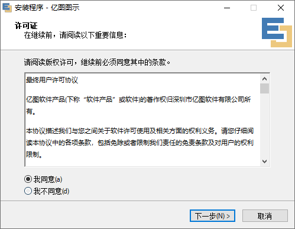
     
     
     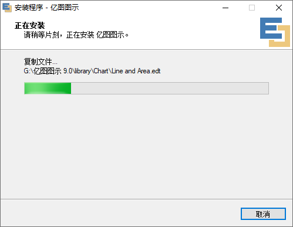
     
     

- 4. 预补丁
     
- 3.1 补丁
     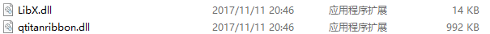
     
- 4 打开即可
     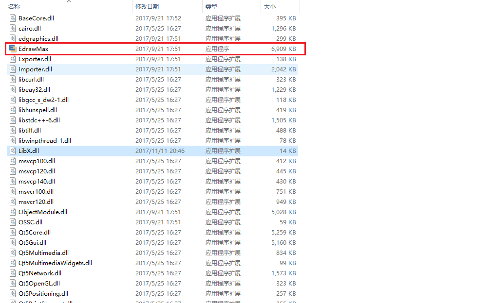

<div style="text-align: right;">
    <a href="#目录" style="text-decoration: none;">Top</a>
</div>

<hr style="background-color: blue;border: none;height: 10px;opacity: .1;width: 100%" />

#### HEU KMS V30.1.0

- 1. 下载压缩包
      [Link](https://pan.baidu.com/s/18PRztIyBAxXvmNZ5sEJINQ?pwd=2ho5)
      
- 2. 解压压缩包
      
- 3. 预安装
     
- 3.1 安装
     
     
     
     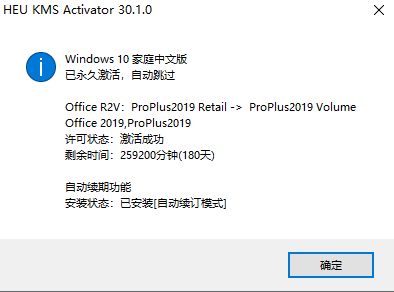

- 4 效果
    

<div style="text-align: right;">
    <a href="#目录" style="text-decoration: none;">Top</a>
</div>

<hr style="background-color: blue;border: none;height: 10px;opacity: .1;width: 100%" />

#### Navicat 15.0

- 1. 下载压缩包
      [Link](https://pan.baidu.com/s/1MvlfDvR7GU-GCQGQZrQojg?pwd=bjma)
      
- 2. 解压压缩包
      
- 3. 预安装 Navicat
     
- 3.1 安装 Navicat 软件
    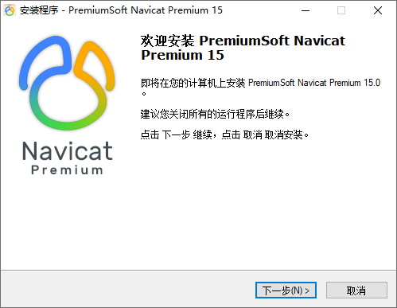
    

    ```
        不建议安装在C盘，路径可自行调整，后续 Patch 时会用到
    ```

    
    
    
    
    

- 4. 断网
     

- 5. 预安装
      
- 5.1 安装 Key Patch 破解软件

    ```
       注意事项
       
       1. Patch 时 需要选择自定义安装路径中的Navicat.exe
       2. 不能够Patch 得到 Cracked时，卸载重装Navicat
       3. 密钥、请求码、激活码 在Navicat、Keygen 之间不能自动复制时，需要手动复制
    ```

    
    
    
    
    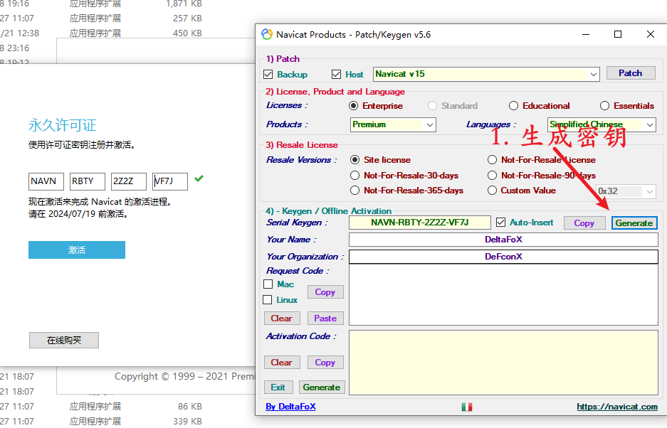
    
    
    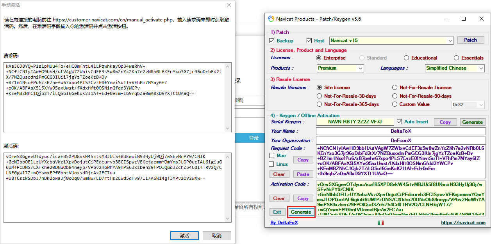
    
- 5.2 效果
      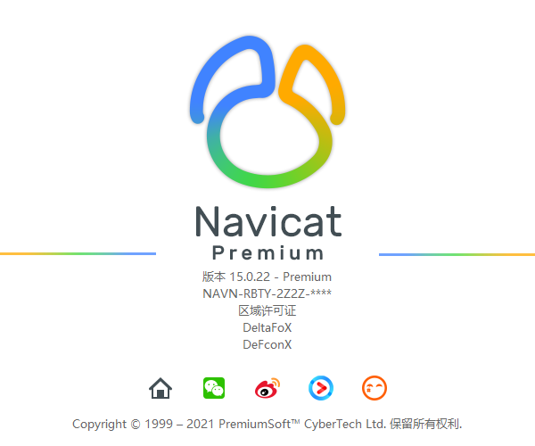

<div style="text-align: right;">
    <a href="#目录" style="text-decoration: none;">Top</a>
</div>

<hr style="background-color: blue;border: none;height: 10px;opacity: .1;width: 100%" />

#### Navicat 16.1

- 1. 下载压缩包
      [Link](https://pan.baidu.com/s/12BY6jhNi0e3zWWrD54ZGiA?pwd=atuw)
      
- 2. 解压压缩包
      
- 3. 预安装 Navicat
     
- 3.1 安装 Navicat 软件
    
    
    

    ```
        不建议安装在C盘，路径可自行调整，后续 Patch 时会用到
    ```

    
    
    

- 4. 断网
     

- 5. 预安装
      
- 5.1 安装 Key Patch 破解软件

    ```
       注意事项
       
       1. Patch 时 需要选择自定义安装路径中的Navicat.exe
       2. 不能够Patch 得到 Cracked时，卸载重装Navicat
       3. 密钥、请求码、激活码 在Navicat、Keygen 之间不能自动复制时，需要手动复制
    ```

    
    
    
    
    
    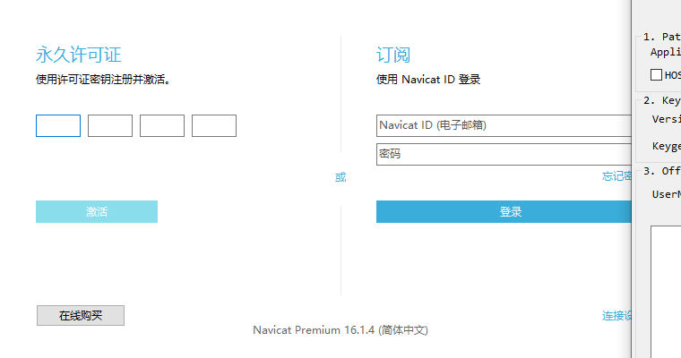
    
    
    
    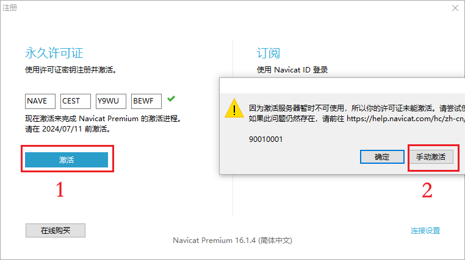
    
    
    
    
    

- 5.2 效果
    
    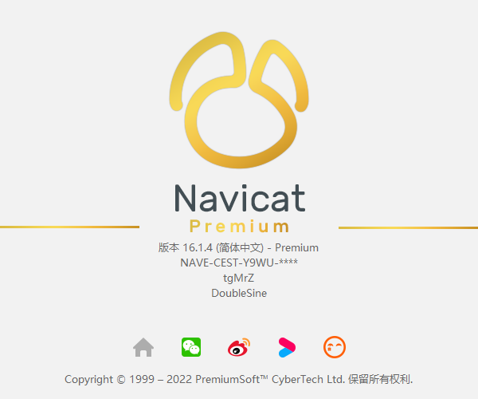

<div style="text-align: right;">
    <a href="#目录" style="text-decoration: none;">Top</a>
</div>

<hr style="background-color: blue;border: none;height: 10px;opacity: .1;width: 100%" />

#### Navicat 16.3

- 1. 下载压缩包
      [Link](https://pan.baidu.com/s/1M-zcHdILqBCs691pteuPmA?pwd=os7i)
      
- 2. 解压压缩包
      
- 3. 执行绿化脚本
     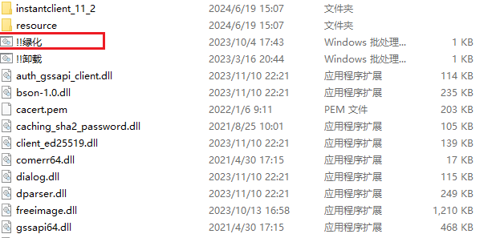
     

- 4 效果
    
    
    

<div style="text-align: right;">
    <a href="#目录" style="text-decoration: none;">Top</a>
</div>

<hr style="background-color: blue;border: none;height: 10px;opacity: .1;width: 100%" />

#### Office 2016

- 1. 下载压缩包
      [Link](https://pan.baidu.com/s/13IPxOwld3olPG1z5ZTPN2Q?pwd=y6ex)
      
- 2. 解压压缩包
      
- 3. 预安装
     
- 3.1 安装
     

- 5. 预安装
    
- 5.1 安装
    
- 6. 效果
    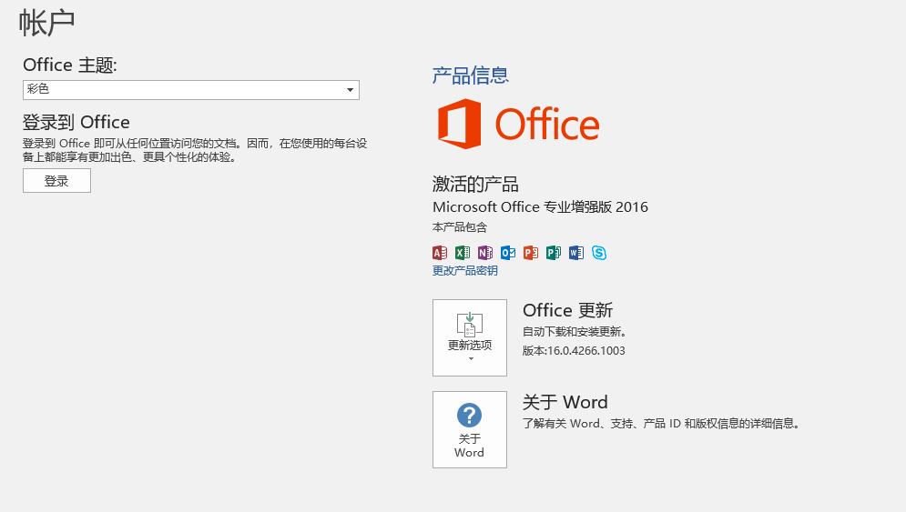

<div style="text-align: right;">
    <a href="#目录" style="text-decoration: none;">Top</a>
</div>

<hr style="background-color: blue;border: none;height: 10px;opacity: .1;width: 100%" />

#### PhotoShop 2021

- 1. 下载压缩包
      [Link](https://pan.baidu.com/s/1PXGf7Pf863xTOtSUj_PmXg?pwd=dxcu)
      
- 2. 解压压缩包
      
- 3. 安装
     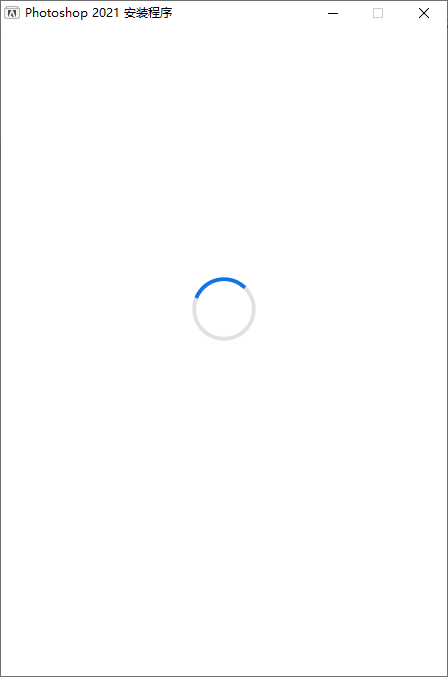
     
     

- 4 效果
    

<div style="text-align: right;">
    <a href="#目录" style="text-decoration: none;">Top</a>
</div>

<hr style="background-color: blue;border: none;height: 10px;opacity: .1;width: 100%" />

#### TablePlus 4.10.8

- 1. 下载压缩包
      [Link](https://pan.baidu.com/s/1CwyCneSpLOrfB2fdT7V6uA?pwd=f4bw)
      
- 2. 解压压缩包
      
- 3. 预安装
     
- 3.1 安装
     
     
     
     
- 4. 清理本地TablePlus hosts映射
     

- 5. 预安装
    
- 5.1 安装
    
    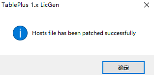
    
- 6. 效果
    

<div style="text-align: right;">
    <a href="#目录" style="text-decoration: none;">Top</a>
</div>

<hr style="background-color: blue;border: none;height: 10px;opacity: .1;width: 100%" />

#### TablePlus 5.3.3

- 1. 下载压缩包
      [Link](https://pan.baidu.com/s/1pKS_lKBif0IGa7WFHarTPQ?pwd=nfnl)
      
- 2. 解压压缩包
      
- 3. 预安装
     
- 3.1 安装
     
     
     
     
- 4. 清理本地TablePlus hosts映射
     

- 5. 预安装
    
- 5.1 安装
    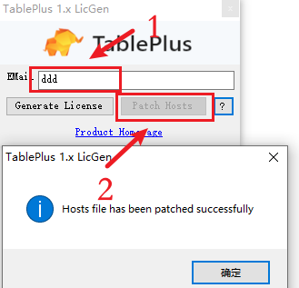
    
- 6. 效果
    

<div style="text-align: right;">
    <a href="#目录" style="text-decoration: none;">Top</a>
</div>

<hr style="background-color: blue;border: none;height: 10px;opacity: .1;width: 100%" />

#### Typora

- 1. 下载压缩包
      [Link](https://pan.baidu.com/s/1y1kItRGkIRANLUINKMqjmg?pwd=kvx7)
      
- 2. 解压压缩包
      
- 3. 预安装
     
- 6. 效果
      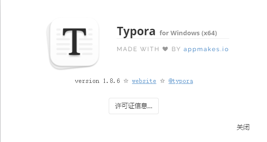

<div style="text-align: right;">
    <a href="#目录" style="text-decoration: none;">Top</a>
</div>

<hr style="background-color: blue;border: none;height: 10px;opacity: .1;width: 100%" />

#### IDM 下载器（激活）

> 激活方法来自github上一个开源项目，项目名是：IDM-Activation-Script。

1. 下载 IDM [Internet Download Manager](https://www.internetdownloadmanager.com/)

2. 以管理员身份运行 PowerShell，运行以下命令

   ```shell
   irm https://massgrave.dev/ias | iex
   ```

3. 根据命令操作，脚本自动执行，执行过程中会下载几张临时图片，当窗口出现 The IDM Activation process has been completed. 时 说明激活成功
   

4. 打开 internet Download Manager，点击 注册，可以看到本软件已注册

   

5. 扩展：安装IDM时 会自动安装 Chrome 插件，在扩展程序中打开即可使用
   

<div style="text-align: right;">
    <a href="#目录" style="text-decoration: none;">Top</a>
</div>

<hr style="background-color: blue;border: none;height: 10px;opacity: .1;width: 100%" />
