`win、linux、kylin ...`

<!-- more -->
<h2 id="c-1-0" style="text-align: center; color: black; background: linear-gradient(#fff 60%, #b2e311ff 40%); margin: 1.4em 0 1.1em; font-size: 1.4em; font-family: 'roboto', 'Iowan Old Style', 'Ovo', 'Hoefler Text', Georgia, 'Times New Roman', 'TIBch', 'Source Han Sans', 'PingFangSC-Regular', 'Hiragino Sans GB', 'STHeiti', 'Microsoft Yahei', 'Droid Sans Fallback', 'WenQuanYi Micro Hei', sans-serif; line-height: 1.7; letter-spacing: .33px;" href="https://guidest.com/cn/markdown/image/">一、镜像烧录工具</h2>

<h3 id="c-1-1" style="-webkit-text-size-adjust: 100%; letter-spacing: .33px; font-family: 'roboto', 'Iowan Old Style', 'Ovo', 'Hoefler Text', Georgia, 'Times New Roman', 'TIBch', 'Source Han Sans', 'PingFangSC-Regular', 'Hiragino Sans GB', 'STHeiti', 'Microsoft Yahei', 'Droid Sans Fallback', 'WenQuanYi Micro Hei', sans-serif; line-height: 1.7; color: #1cc03cff; border-left: 4px solid #1bb75cff; padding-left: 6px; margin: 1.4em 0 1.1em;">1.1 Ventoy</h3>

```
简单来说，Ventoy是一个制作可启动U盘的开源工具。
有了Ventoy你就无需反复地格式化U盘，你只需要把 ISO/WIM/IMG/VHD(x)/EFI 等类型的文件直接拷贝到U盘里面就可以启动了，无需其他操作。
适合系统：https://www.ventoy.net/cn/isolist.html
url: https://www.ventoy.net/cn/index.html
```

<h3 id="c-1-2" style="-webkit-text-size-adjust: 100%; letter-spacing: .33px; font-family: 'roboto', 'Iowan Old Style', 'Ovo', 'Hoefler Text', Georgia, 'Times New Roman', 'TIBch', 'Source Han Sans', 'PingFangSC-Regular', 'Hiragino Sans GB', 'STHeiti', 'Microsoft Yahei', 'Droid Sans Fallback', 'WenQuanYi Micro Hei', sans-serif; line-height: 1.7; color: #1cc03cff; border-left: 4px solid #1bb75cff; padding-left: 6px; margin: 1.4em 0 1.1em;">1.2 Rufs</h3>

```
Rufus 是一个开源的镜像烧录实用工具，可以帮助格式化和创建可引导 USB 闪存盘，比如 USB 随身碟、记忆棒等。Rufus 的体积非常小、但功能全面、速度较快。
适合系统: Windows 7/8/10
url: https://rufus.ie/zh/
```

<h3 id="c-1-3" style="-webkit-text-size-adjust: 100%; letter-spacing: .33px; font-family: 'roboto', 'Iowan Old Style', 'Ovo', 'Hoefler Text', Georgia, 'Times New Roman', 'TIBch', 'Source Han Sans', 'PingFangSC-Regular', 'Hiragino Sans GB', 'STHeiti', 'Microsoft Yahei', 'Droid Sans Fallback', 'WenQuanYi Micro Hei', sans-serif; line-height: 1.7; color: #1cc03cff; border-left: 4px solid #1bb75cff; padding-left: 6px; margin: 1.4em 0 1.1em;">1.3 老毛桃、大白菜 等PE系统</h3>

```
老毛桃：https://www.laomaotao.net/
大白菜: https://www.dabaicai.com/u.html
优启通: https://www.uqitong.com/
U启动: http://www.uqidong.com/download/
```

<h2 id="c-2-0" style="text-align: center; color: black; background: linear-gradient(#fff 60%, #b2e311ff 40%); margin: 1.4em 0 1.1em; font-size: 1.4em; font-family: 'roboto', 'Iowan Old Style', 'Ovo', 'Hoefler Text', Georgia, 'Times New Roman', 'TIBch', 'Source Han Sans', 'PingFangSC-Regular', 'Hiragino Sans GB', 'STHeiti', 'Microsoft Yahei', 'Droid Sans Fallback', 'WenQuanYi Micro Hei', sans-serif; line-height: 1.7; letter-spacing: .33px;" href="https://guidest.com/cn/markdown/image/">二、常用镜像制作推荐</h2>

<h3 id="c-2-1" style="-webkit-text-size-adjust: 100%; letter-spacing: .33px; font-family: 'roboto', 'Iowan Old Style', 'Ovo', 'Hoefler Text', Georgia, 'Times New Roman', 'TIBch', 'Source Han Sans', 'PingFangSC-Regular', 'Hiragino Sans GB', 'STHeiti', 'Microsoft Yahei', 'Droid Sans Fallback', 'WenQuanYi Micro Hei', sans-serif; line-height: 1.7; color: #1cc03cff; border-left: 4px solid #1bb75cff; padding-left: 6px; margin: 1.4em 0 1.1em;">2.1 Windows系统镜像(推荐使用官方安装方式)</h3>

1. 进入链接 <https://www.microsoft.com/zh-cn/software-download> 选择合适版本进行下载
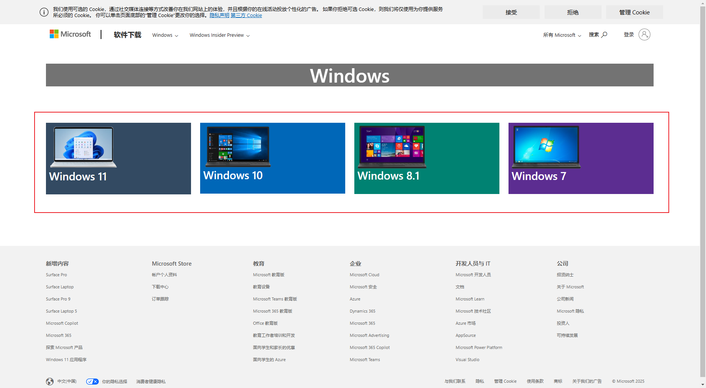

2. 下载完成后，运行MediaCreationTool_xxx.exe，点击接受
    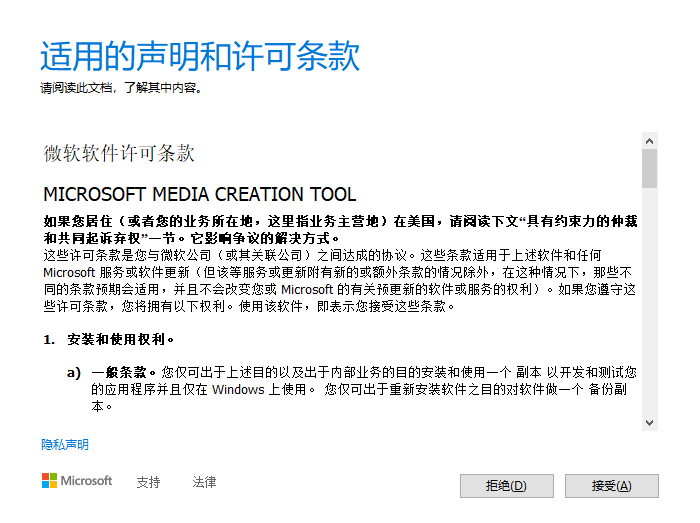
3. 选择升级本机或者制作启动盘
    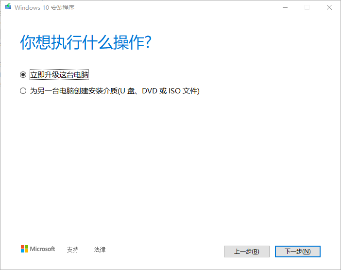
4. 选择语言、体系结构和版本
    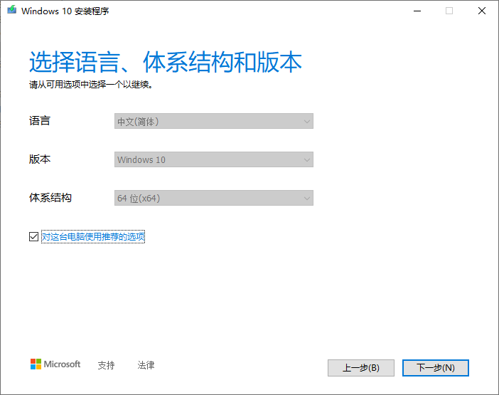
5. 选择制作U盘或下载ISO文件
    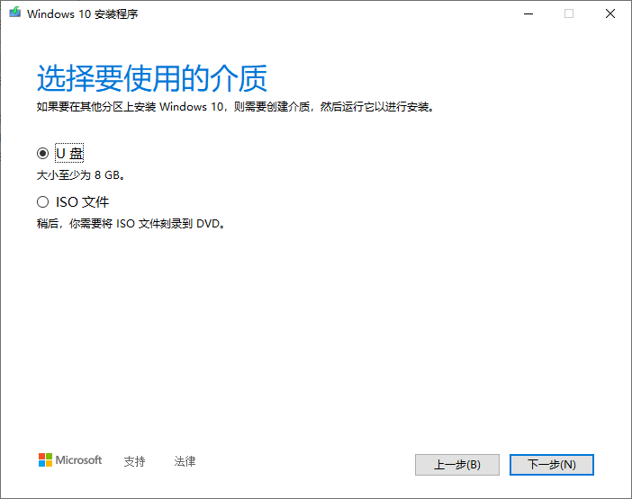

    - 选择ISO文件
        1. 点击下一步,选择保存路径开始下载，等待下载完成。

            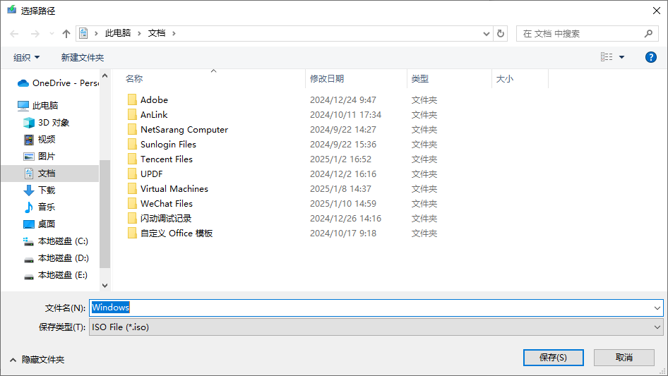
        2. 下载完成后，使用烧录工具(rufs、ventoy等)进行启动盘制作。
        3. 选择设备

            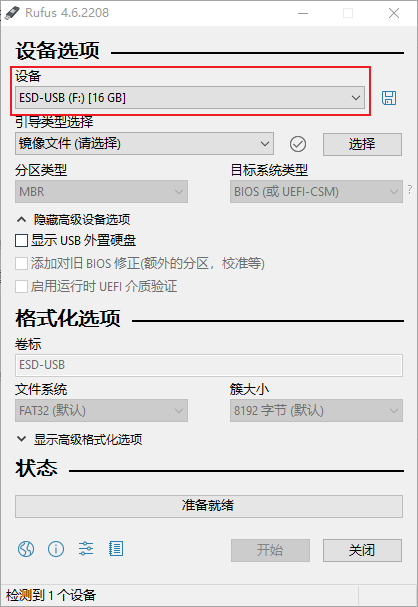
        4. 选择镜像

            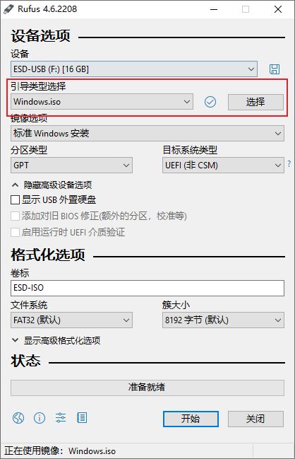
        5. 点击开始，会格式化磁盘。

            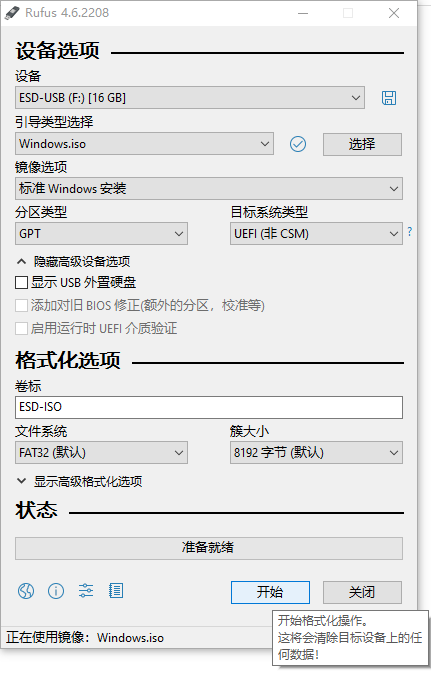
        6. 等待操作完成

            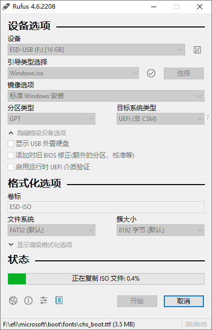
        7. 完成，启动盘制作成功

            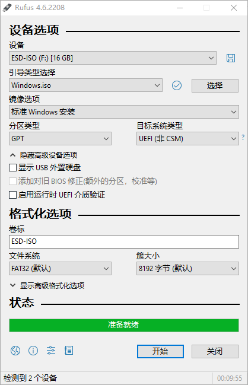
    - 选择U盘
        1. 选择驱动器，点击下一步

            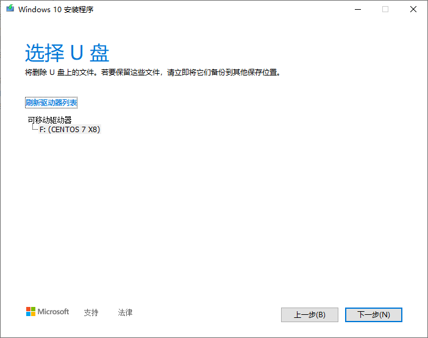
        2. 等待进度完成

            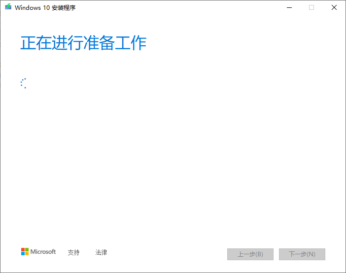
        3. 完成，启动盘制作成功

            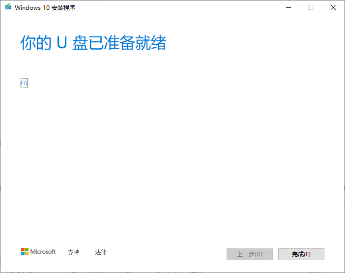  

<h3 id="c-2-2" style="-webkit-text-size-adjust: 100%; letter-spacing: .33px; font-family: 'roboto', 'Iowan Old Style', 'Ovo', 'Hoefler Text', Georgia, 'Times New Roman', 'TIBch', 'Source Han Sans', 'PingFangSC-Regular', 'Hiragino Sans GB', 'STHeiti', 'Microsoft Yahei', 'Droid Sans Fallback', 'WenQuanYi Micro Hei', sans-serif; line-height: 1.7; color: #1cc03cff; border-left: 4px solid #1bb75cff; padding-left: 6px; margin: 1.4em 0 1.1em;">2.2 Centos系统镜像(推荐Rufs、Ventoy)</h3>

1. 进入链接 <https://vault.centos.org/> 选择合适版本进入

    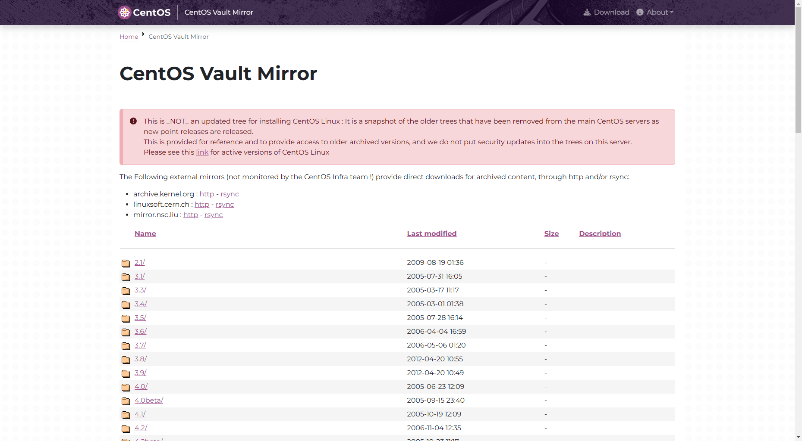
2. 选择isos文件夹进入

    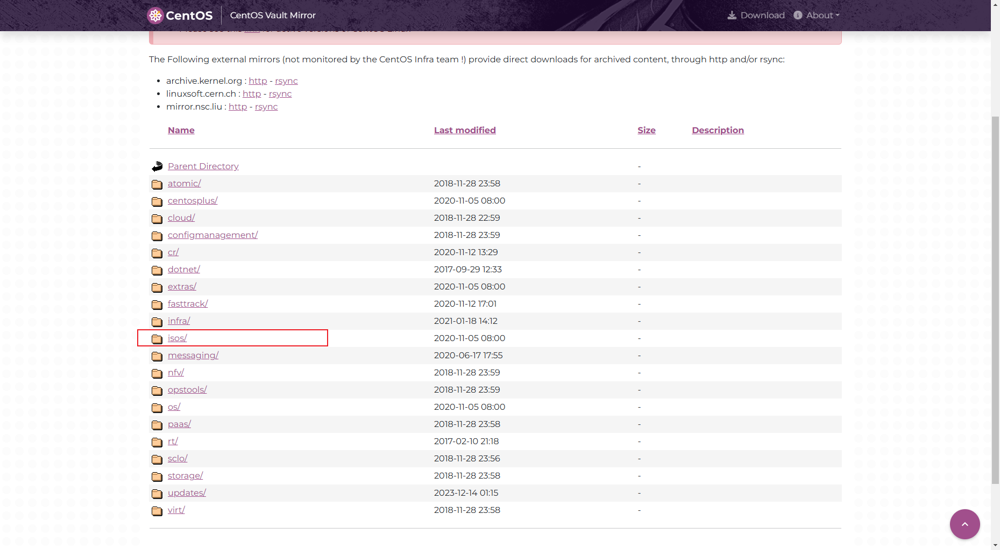
3. 选择x86_64文件夹进入

    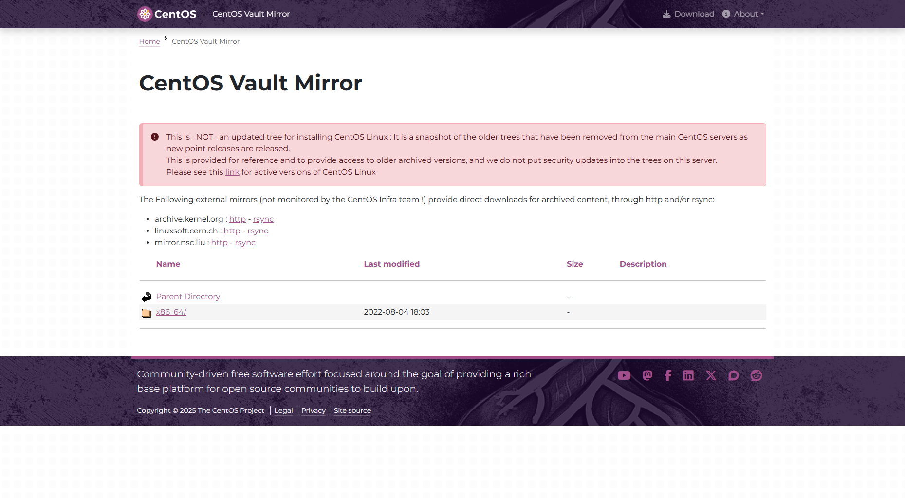
4. 选择合适镜像地址下载

    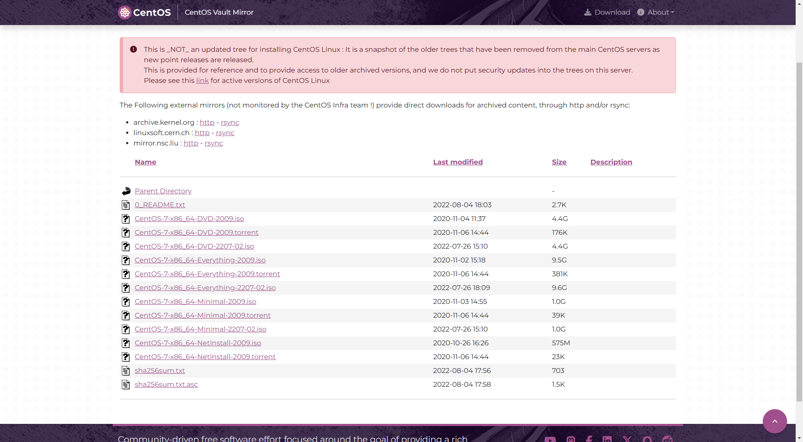
5. 推荐使用IDM加速下载

    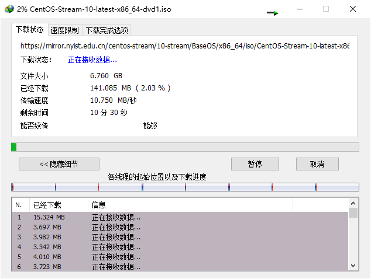
6. 镜像制作(推荐Rufs、Ventoy)，Rufs 参考Windows镜像制作，Ventoy参考Kylin镜像制作。

<h3 id="c-2-3" style="-webkit-text-size-adjust: 100%; letter-spacing: .33px; font-family: 'roboto', 'Iowan Old Style', 'Ovo', 'Hoefler Text', Georgia, 'Times New Roman', 'TIBch', 'Source Han Sans', 'PingFangSC-Regular', 'Hiragino Sans GB', 'STHeiti', 'Microsoft Yahei', 'Droid Sans Fallback', 'WenQuanYi Micro Hei', sans-serif; line-height: 1.7; color: #1cc03cff; border-left: 4px solid #1bb75cff; padding-left: 6px; margin: 1.4em 0 1.1em;">2.3 Kylin系统镜像(推荐Ventoy)</h3>

1. 进去链接 <https://eco.kylinos.cn/partners/mirror.html?class_id=1> 选择不同系统及镜像进行下载，没有登录需要注册登录。

    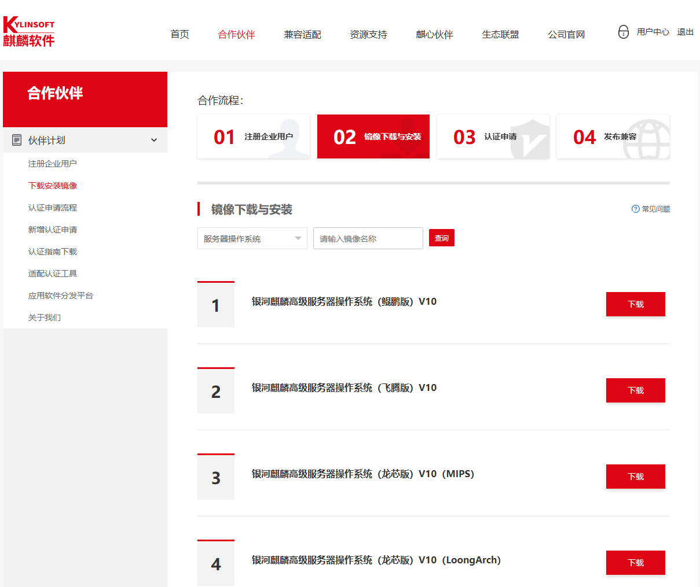
2. 点击下载，根据本地地址进行iso下载，推荐IDM进行下载

    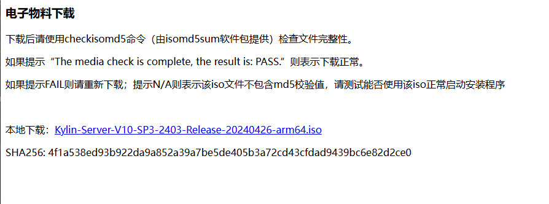

3. 镜像制作(Ventoy)，点击安装（会对该磁盘进行格式化）

    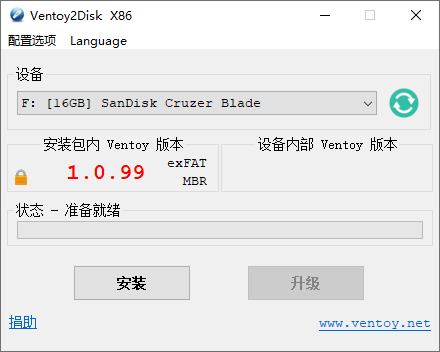
4. 制作完成。

    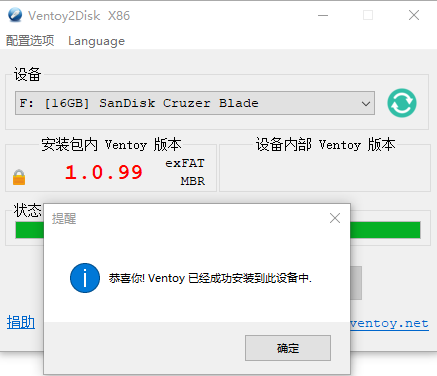
5. 拷贝镜像到该磁盘目录下，镜像制作成功。

    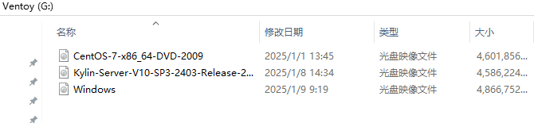

<hr aria-hidden="true" style=" border: 0; height: 2px; background: linear-gradient(90deg, transparent, #1bb75c, transparent); margin: 2rem 0; " />

<!-- 目录容器 -->
<div style="position: fixed; bottom: 240px; right: 10px; width: 240px; height: 320px; background: #f8f9fa; border: 1px solid #e9ecef; border-radius: 8px; padding: 15px; overflow-y: auto; font-family: 'roboto', 'Iowan Old Style', 'Ovo', 'Hoefler Text', Georgia, 'Times New Roman', 'TIBch', 'Source Han Sans', 'PingFangSC-Regular', 'Hiragino Sans GB', 'STHeiti', 'Microsoft Yahei', 'Droid Sans Fallback', 'WenQuanYi Micro Hei', sans-serif; font-size: 14px; line-height: 1.15; color: #444; letter-spacing: 0.33px; transition: all 0.3s ease;">
    <strong>目录</strong>
        <ul style="margin: 10px 0; padding-left: 20px; list-style-type: none;">
            <li style="list-style-type: none;"><a href="#c-1-0">一、镜像烧录工具</a></li>
            <ul style="padding-left: 15px; list-style-type: none;">
                <li style="list-style-type: none;"><a href="#c-1-1">1.1 Ventoy</a></li>
                <li style="list-style-type: none;"><a href="#c-1-2">1.2 Rufs</a></li>
                <li style="list-style-type: none;"><a href="#c-1-3">1.3 老毛桃、大白菜 等PE系统</a></li>
            </ul>
            <li style="list-style-type: none;"><a href="#c-2-0">二、常用镜像启动盘制作</a></li>
            <ul style="padding-left: 15px; list-style-type: none;">
                <li style="list-style-type: none;"><a href="#c-2-1">2.1 Windows系统镜像</a></li>
                <li style="list-style-type: none;"><a href="#c-2-2">2.2 Centos系统镜像</a></li>
                <li style="list-style-type: none;"><a href="#c-2-3">2.3 Kylin系统镜像</a></li>
            </ul>
        </ul>
</div>

本技术手册将持续更新，欢迎提交Issue和Pull Request
