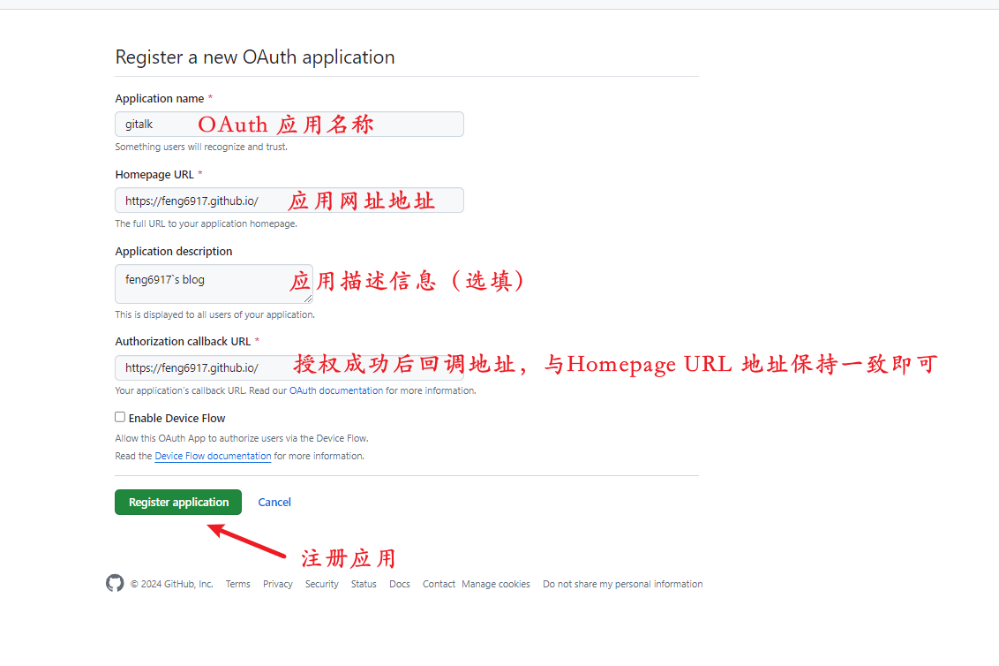
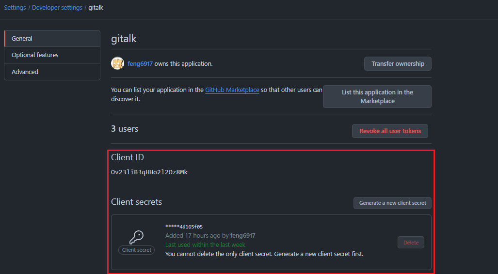
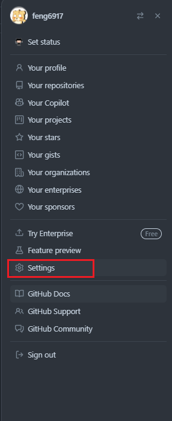
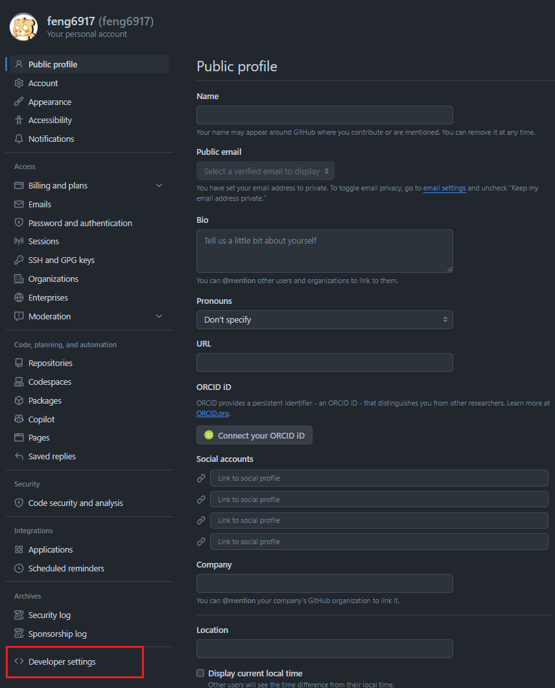
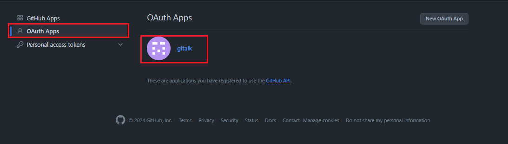
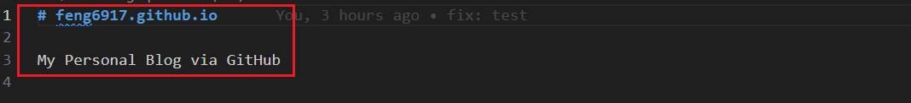

  `一篇流水账式的博客搭建记录`

<!-- more -->

### 目录

- [一、拷贝别人的仓库到自己的账号上](#一拷贝别人的仓库到自己的账号上)

- [二、替换别人的仓库配置信息](#二替换别人的仓库配置信息)

- [三、移除文章、图像、及配置信息](#三移除文章图像及配置信息)

- [四、发布自己的第一篇文章](#四发布自己的第一篇文章)

#### 一、拷贝别人的仓库到自己的账号上

- 访问 [博客地址](https://github.com/feng6917/feng6917.github.io) ，点击右上角的 Fork 按钮。
  
- 仓库名修改为自己的 github 账号名
    

[Top](#目录)

#### 二、替换别人的仓库配置信息

- _config.yml 全局配置文件
- _posts 放置博客文章的文件夹
- images 存放图片的文件夹

- 修改_config.yml 文件
    

  - **申请OAuth Application 步骤**
    - 打开 [申请地址](https://github.com/settings/applications/new)

    - 填写信息 & 注册应用

        

    - 查询 Client ID 和 Client Secret

        

    - 通过首页查询 OAuth Application

      
      
      
  
- 修改 about.md 文件
    

- 修改 README.md 文件
    

[返回目录](#目录)

#### 三、移除文章图像及配置信息

- 删除 _posts 文件夹下的文章

- 删除 images 文件夹下的图片

- 删除 _config.yml 文件中的私有配置信息

#### 四、发布自己的第一篇文章

  ```
    在_posts文件夹下新建md文件，文件名格式为：年-月-日-文章标题.md
    例如：2024-8-21-我的第一篇文章.md

    ---
    layout:     post           # 使用的布局（不需要改）
    title:      我的第一篇文章     # 标题 
    subtitle:   Hello World, Hello Blog #副标题
    date:       2024-8-21     # 时间
    author:     BY       # 作者
    catalog: true       # 是否归档
    tags:        #标签
        - 博客
        - 技术
---

## Hey
>这是我的第一篇博客。

进入你的博客主页，新的文章将会出现在你的主页上.
    ---

    这是我的第一篇文章的内容。

  ```

[Top](#目录)

###### 参考链接如下

- [翩帆的个人技术博客](https://pianfan.github.io/)
- [博客搭建详细教程](https://github.com/qiubaiying/qiubaiying.github.io/wiki/博客搭建详细教程)
- [为博客添加-Gitalk-评论插件](https://qiubaiying.github.io/2017/12/19/为博客添加-Gitalk-评论插件/)
