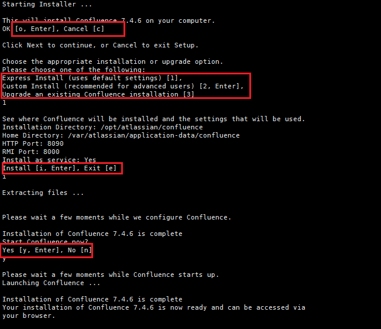
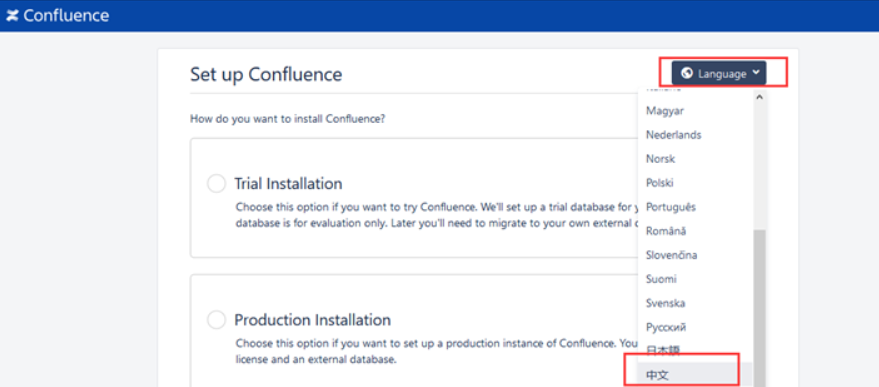
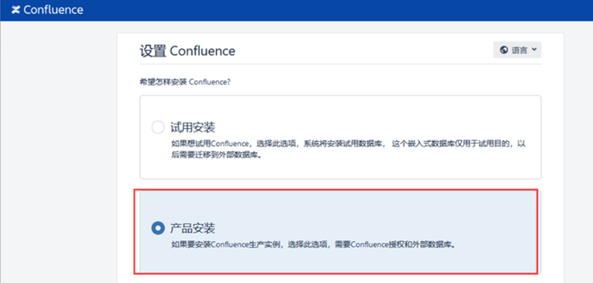
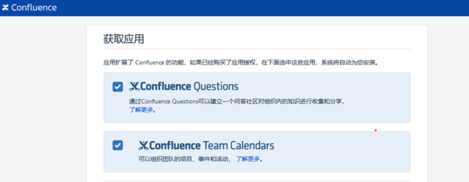
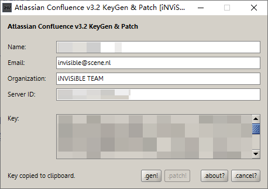
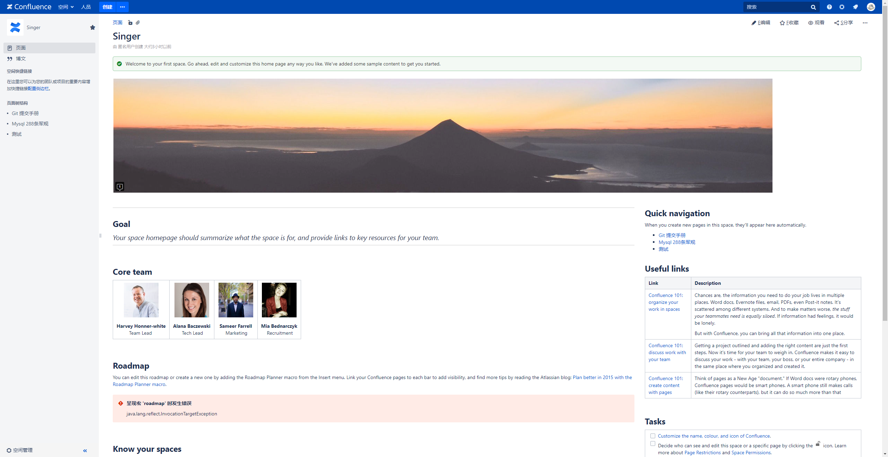

`部署 Confluence 构建企业内部WIKI 记录, 使用起来 确实不错`

<!-- more -->

### 目录

- [一、MySQL 部署 & 库创建](#数据库部署和库创建)

- [二、Confluence 部署](#软件部署)

- [三、Confluence 破解](#软件破解)

- [四、Confluence 配置](#软件配置)

#### 一、数据库部署和库创建

- 1.1 # 创建挂载文件夹

    ```
        mkdir -p /data
        mkdir -p /data/mysql
    ```

- 1.2 # 拉取镜像 服务器上已有Mysql镜像可直接使用已有Mysql镜像版本

    ```
        docker pull mysql:5.7 （可替换）
    ```

- 1.3 # 运行镜像 端口可改

    ```
        docker run -itd -p 3306:3306 --name wiki-mysql -e MYSQL_ROOT_PASSWORD=123456 --restart=always --restart=on-failure:1 --oom-score-adj -1000 --privileged=true --log-opt max-size=10m --log-opt max-file=1 -v /data/mysql:/var/lib/mysql  mysql:5.7
    ```

- 1.4 # 连接mysql

    ```
        docker exec -it wiki-mysql bash
        mysql -uroot -p123456
    ```

- 1.5 # 创建数据库

    ```
        create database confluence default character set utf8mb4 collate utf8mb4_unicode_ci;
    ```

- 1.5 # 创建用户并授权

    ```
      # 创建用户
      create user 'confluence'@'%' identified by 'confluence';
      
      # 用户授权
      grant all privileges on `confluence`.* to 'confluence'@'%' identified by 'confluence' with grant option;
      
      grant all privileges on `confluence`.* to 'confluence'@'localhost' identified by 'confluence' with grant option;
      
      # 应用
      flush privileges;
    ```

- 1.6 # 设置隔离等级

    ```
        set global tx_isolation='READ-COMMITTED';
    ```

[Top](#目录)

#### 二、软件部署

- 2.1 # 拷贝本地 xxx.bin 到服务器
  - <https://www.atlassian.com/software/confluence/download-archives> 官网下载地址

  ```
      scp atlassian-confluence-7.4.6-x64.bin root@ip:/opt/
  ```

- 2.2 # 添加可执行权限&执行

    ```
        chmod +x atlassian-confluence-7.4.6-x64.bin
        ./atlassian-confluence-7.4.6-x64.bin
    ```

- 2.3 # 期间需要输入O、 1、 i、 y 如下图所示
    

- 2.4 # 完成后 浏览器上打开服务器 ip:8090

- 2.5 Language 选择中文
    

- 2.6 选择产品安装 下一步
    

- 2.7 勾选所有扩展功能 下一步
    

- 2.8 复制服务器ID
    

[Top](#目录)

#### 三、软件破解

- 3.1 拷贝服务器atlassian-extras-decoder-v2-3.4.1.jar 到本地

    ```
        mv /opt/atlassian/confluence/confluence/WEB-INF/lib/atlassian-extras-decoder-v2-3.4.1.jar /root/atlassian-extras-2.4.jar

        scp root@IP:/root/atlassian-extras-2.4.jar ./
    ```

- 3.2 windows 中执行 confluence_keygen.jar 打开破解工具（需安装 jdk）

    ```
        java -jar confluence_keygen.jar
        name 英文随便填 serverID 粘贴复制得服务器ID
    ```

- 3.3 点击.patch 选择atlassian-extras-2.4.jar

- 3.4 点击.gen
    

- 3.5 拷贝生成的atlassian-extras-2.4.jar 到服务器

    ```
        scp atlassian-extras-2.4.jar root@ip:/opt/atlassian/confluence/confluence/WEB-INF/lib/atlassian-extras-decoder-v2-3.4.1.jar
    ```

- 3.6  拷贝MySQL驱动到服务器

    ```
        scp mysqlconnectorjava5.1.44bin.jar root@ip:/opt/atlassian/confluence/confluence/WEB-INF/lib/
    ```

- 3.7 重启confluence

    ```
        停止：sh /opt/atlassian/confluence/bin/stop-confluence.sh
        启动：sh /opt/atlassian/confluence/bin/start-confluence.sh
    ```

- 3.8 登录web页面 localhost:8090 复制授权码并粘贴
    

[Top](#目录)

#### 四、软件配置

- 4.1 设置您的数据库 选择 我自己的数据库 下一步

- 4.2 数据库类型选择MySQl， 安装类型选择通过字符串 地址如下：

    ```
        jdbc:mysql://ip:port/confluence?useUnicode=true&characterEncoding=utf-8&autoReconnect=true
    ```

- 4.3 输入用户名 密码 测试连接 下一步

- 4.4 加载内容 选择空白站点 下一步

- 4.5 配置用户管理 选择 在Confluence中管理用户与组

- 4.6 配置系统管理员账户  admin@123456

- 4.7 设置成功
    

[Top](#目录)

#### 效果图

  

[Link](https://pan.baidu.com/s/1FhLo-OyXSHUqtClSql_3Rw?pwd=v1o6)

###### 参考连接

- [Linux搭建confluence企业级WIKI](https://www.dczzs.com/articles/2021/09/14/1631581152758.html)
- [wiki的confluence 8.5.4安装部署](https://blog.csdn.net/weixin_44024436/article/details/135389431)
- [Confluence7.4安装并汉化](https://blog.whsir.com/post-5854.html)
- [Confluence官网下载地址](https://www.atlassian.com/software/confluence/download-archives)
